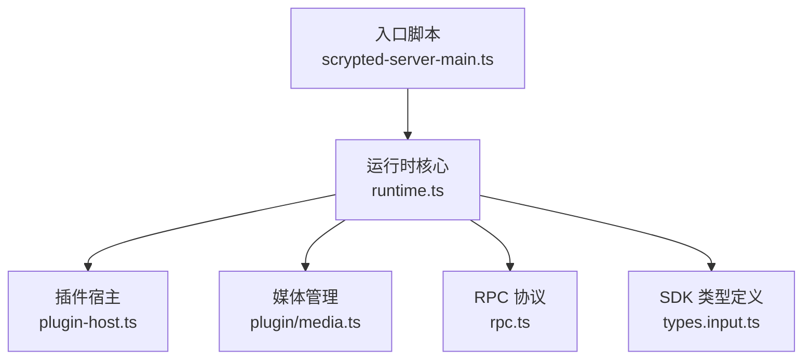
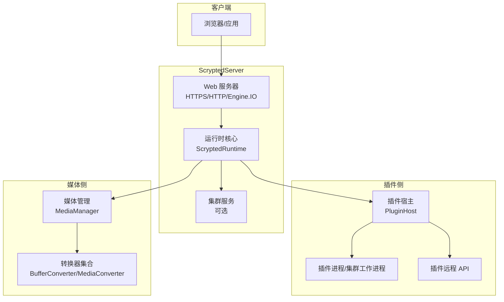
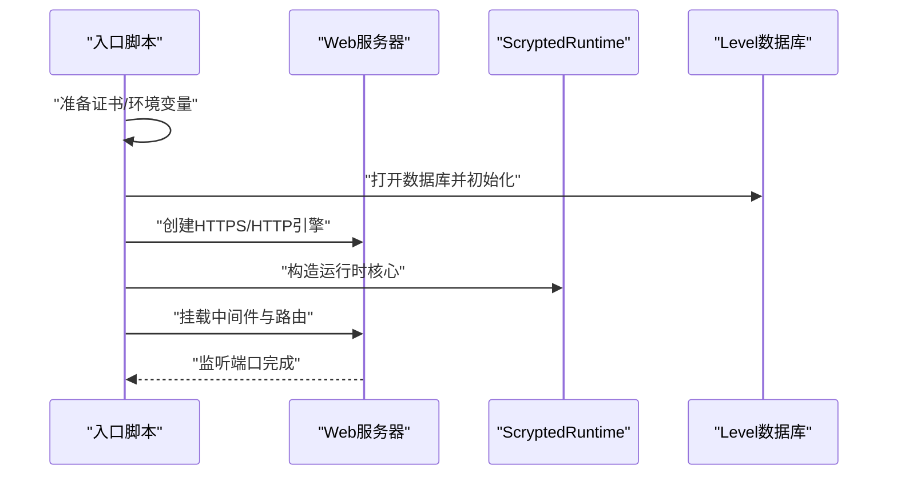
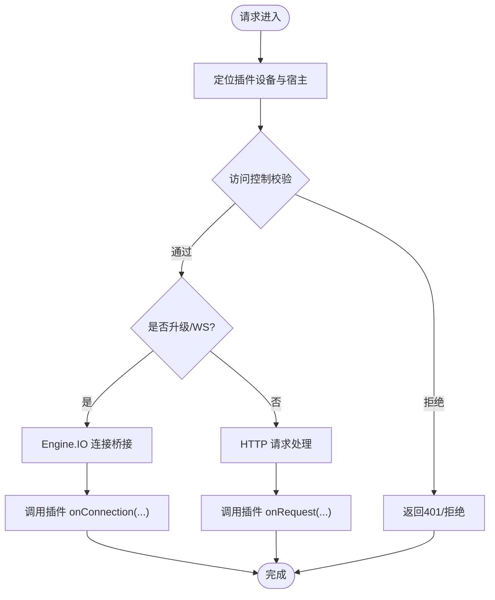
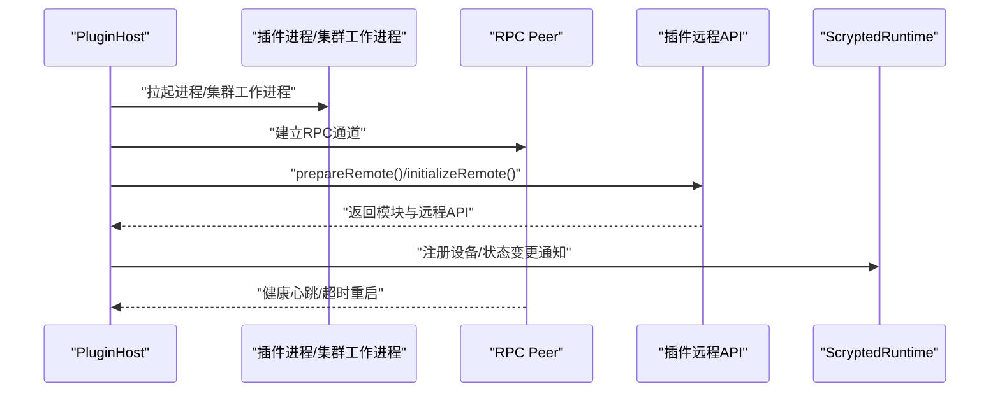
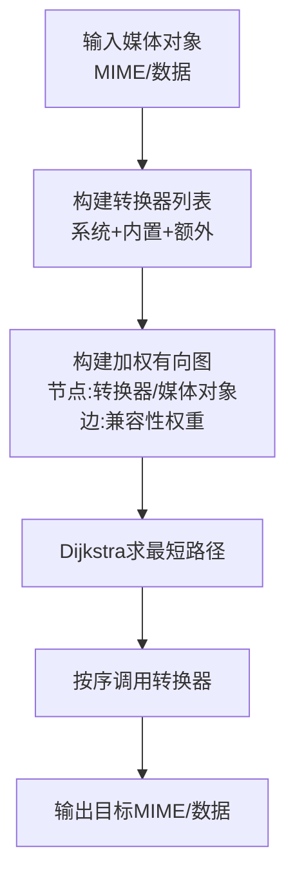
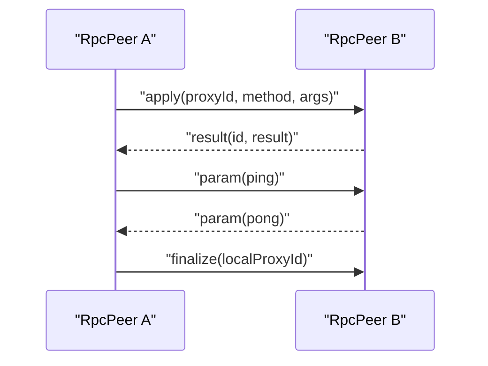
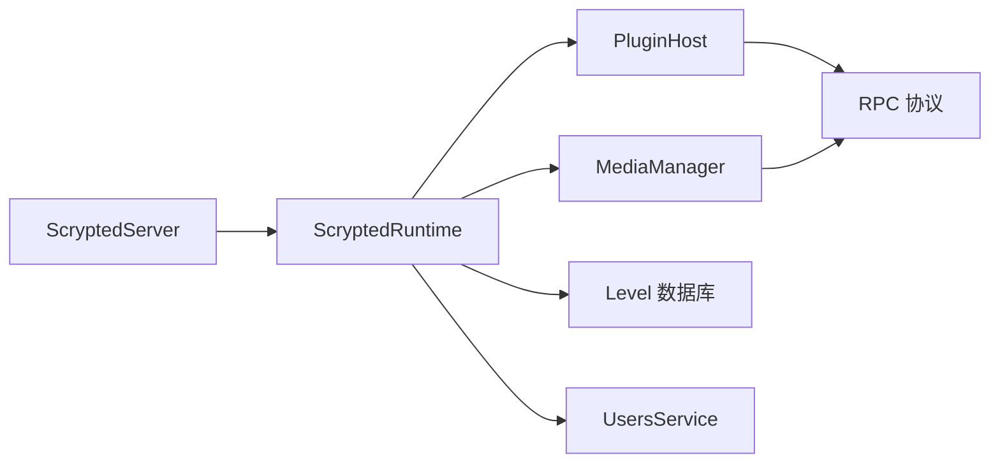

# 核心组件架构

<cite>
**本文引用的文件**
- [server/src/scrypted-server-main.ts](file://server/src/scrypted-server-main.ts)
- [server/src/scrypted-main.ts](file://server/src/scrypted-main.ts)
- [server/src/runtime.ts](file://server/src/runtime.ts)
- [server/src/plugin/plugin-host.ts](file://server/src/plugin/plugin-host.ts)
- [server/src/plugin/media.ts](file://server/src/plugin/media.ts)
- [server/src/rpc.ts](file://server/src/rpc.ts)
- [sdk/types/src/types.input.ts](file://sdk/types/src/types.input.ts)
</cite>

## 目录
1. [引言](#引言)
2. [项目结构](#项目结构)
3. [核心组件](#核心组件)
4. [架构总览](#架构总览)
5. [组件详细分析](#组件详细分析)
6. [依赖关系分析](#依赖关系分析)
7. [性能考量](#性能考量)
8. [故障排查指南](#故障排查指南)
9. [结论](#结论)
10. [附录：配置与参数](#附录配置与参数)

## 引言
本文件面向 Scrypted 核心运行时，系统性梳理 ScryptedServer 主控制器、DeviceManager（通过运行时与设备代理协同实现）、MediaManager（媒体对象创建与转换）以及 PluginHost（插件生命周期与 RPC 协调）的职责边界、启动流程、交互模式与依赖关系。文档以代码为依据，辅以架构图与数据流图，帮助开发者快速理解组件如何协作、如何扩展与优化。

## 项目结构
Scrypted 服务端由“入口脚本”“运行时核心”“插件宿主”“媒体管理”“RPC 协议”等模块构成。入口脚本负责监听端口、初始化数据库与证书、装配 Web 中间件与路由；运行时核心承载设备与插件生命周期、设备代理、集群对象转发、用户与权限、备份与插件安装等；插件宿主负责具体插件进程的拉起、健康检查、IO 连接桥接与远程 API 暴露；媒体管理负责媒体对象的创建、类型转换与路径生成；RPC 协议定义了跨进程/跨网络的代理调用与结果回传。

图表来源
- [server/src/scrypted-server-main.ts:139-400](file://server/src/scrypted-server-main.ts#L139-L400)
- [server/src/runtime.ts:64-176](file://server/src/runtime.ts#L64-L176)
- [server/src/plugin/plugin-host.ts:38-224](file://server/src/plugin/plugin-host.ts#L38-L224)
- [server/src/plugin/media.ts:40-177](file://server/src/plugin/media.ts#L40-L177)
- [server/src/rpc.ts:29-857](file://server/src/rpc.ts#L29-L857)
- [sdk/types/src/types.input.ts:1898-1934](file://sdk/types/src/types.input.ts#L1898-L1934)

章节来源
- [server/src/scrypted-server-main.ts:139-400](file://server/src/scrypted-server-main.ts#L139-L400)
- [server/src/scrypted-main.ts:1-4](file://server/src/scrypted-main.ts#L1-L4)
- [server/src/runtime.ts:64-176](file://server/src/runtime.ts#L64-L176)

## 核心组件
- ScryptedServer 主控制器
  - 职责：启动 Web 服务器（HTTP/HTTPS/Engine.IO/WebSocket），加载数据库与证书，装配认证中间件与 CORS 控制，暴露登录/登出、备份/恢复、插件安装/调试等管理接口，启动集群服务（可选）。
  - 关键点：端口监听、证书自签名与版本化更新、Basic/Cookie/Bearer Token 多种认证方式、访问控制头设置、Engine.IO/WS 升级处理。
- ScryptedRuntime 运行时核心
  - 职责：统一管理插件、设备、设备代理、集群对象转发、日志告警、用户与权限、备份与插件安装、Engine.IO/HTTP 请求分发、WebSocket 连接桥接。
  - 关键点：设备代理缓存与失效、Mixin 表重建、插件自动重启、Engine.IO 连接直连、HTTP 请求响应封装。
- PluginHost 插件宿主
  - 职责：根据插件包信息选择运行时（内置或自定义），拉起子进程/集群工作进程，建立 RPC Peer，注入环境变量与卷目录，维护 IO/WebSocket 连接，健康检查与自动重启。
  - 关键点：运行时选择、zip 解压与哈希校验、Engine.IO API 端点、远程 API 初始化与延迟代理、健康心跳与超时重启。
- MediaManager 媒体管理
  - 职责：创建媒体对象（URL/本地文件/FFmpeg 输入），在系统内聚合 BufferConverter/MediaConverter，基于有向加权图寻找最优转换链路，输出本地/不安全本地 URL 或 Buffer。
  - 关键点：内置转换器（HTTP/文件/FFmpeg 输入/URL 转换），系统与额外转换器叠加，Dijkstra 最短路径算法，源设备 ID 注入。
- RPC 协议
  - 职责：定义 apply/result/finalize/param 消息格式，实现本地代理到远端目标的透明调用，支持单向方法、参数传递、弱代理与终结器回收。
  - 关键点：消息序列化/反序列化、代理映射表、结果回调队列、GC 周期回收。

章节来源
- [server/src/scrypted-server-main.ts:139-400](file://server/src/scrypted-server-main.ts#L139-L400)
- [server/src/runtime.ts:64-176](file://server/src/runtime.ts#L64-L176)
- [server/src/plugin/plugin-host.ts:38-224](file://server/src/plugin/plugin-host.ts#L38-L224)
- [server/src/plugin/media.ts:40-177](file://server/src/plugin/media.ts#L40-L177)
- [server/src/rpc.ts:29-857](file://server/src/rpc.ts#L29-L857)

## 架构总览
下图展示从浏览器/客户端到运行时、插件宿主与媒体管理的整体交互路径，以及关键组件间的依赖关系。

图表来源
- [server/src/scrypted-server-main.ts:139-400](file://server/src/scrypted-server-main.ts#L139-L400)
- [server/src/runtime.ts:64-176](file://server/src/runtime.ts#L64-L176)
- [server/src/plugin/plugin-host.ts:38-224](file://server/src/plugin/plugin-host.ts#L38-L224)
- [server/src/plugin/media.ts:40-177](file://server/src/plugin/media.ts#L40-L177)

## 组件详细分析

### ScryptedServer 启动与初始化流程
- 入口脚本加载后，准备证书（自签名并版本化）、创建 Level 数据库、装配 Express 应用与中间件（BodyParser、CookieParser、CORS/ACL 头、访问控制白名单）。
- 启动 HTTPS/HTTP 服务器，绑定安全/非安全端口，并挂载 Engine.IO/WS 升级处理。
- 初始化运行时核心 ScryptedRuntime，注册备份/恢复、插件安装/调试、登录/登出等路由。
- 可选启动集群服务（根据集群模式配置）。

图表来源
- [server/src/scrypted-server-main.ts:139-400](file://server/src/scrypted-server-main.ts#L139-L400)
- [server/src/scrypted-main.ts:1-4](file://server/src/scrypted-main.ts#L1-L4)

章节来源
- [server/src/scrypted-server-main.ts:139-400](file://server/src/scrypted-server-main.ts#L139-L400)
- [server/src/scrypted-main.ts:1-4](file://server/src/scrypted-main.ts#L1-L4)

### ScryptedRuntime 设备与插件管理
- 设备代理与失效
  - 设备首次访问时创建代理并缓存；当插件设备元数据变更或刷新标志出现时触发失效与 Mixin 表重建，避免频繁实例重建。
- 插件生命周期
  - 安装 npm 包并解压为 zip，写入数据库；启动插件宿主，探测设备；异常退出时按策略自动重启。
- Engine.IO/HTTP 分发
  - 根据请求端点定位插件设备与宿主，校验访问控制，将升级请求转交插件宿主的 Engine.IO 服务或 HTTP 处理器。
- 集群对象转发
  - 对来自集群节点的连接请求，验证签名后转发至本地端口，实现跨节点对象共享。

图表来源
- [server/src/runtime.ts:226-296](file://server/src/runtime.ts#L226-L296)
- [server/src/runtime.ts:397-464](file://server/src/runtime.ts#L397-L464)
- [server/src/runtime.ts:118-153](file://server/src/runtime.ts#L118-L153)

章节来源
- [server/src/runtime.ts:226-296](file://server/src/runtime.ts#L226-L296)
- [server/src/runtime.ts:397-464](file://server/src/runtime.ts#L397-L464)
- [server/src/runtime.ts:118-153](file://server/src/runtime.ts#L118-L153)

### PluginHost 插件生命周期与 RPC 协调
- 运行时选择与进程拉起
  - 根据插件 package.json 的 runtime 字段选择内置运行时或自定义运行时；若启用集群标签，则通过集群工作进程承载。
- 健康检查与自动重启
  - 定期 ping 插件，超过阈值未响应则请求重启；插件退出/错误也触发重启。
- Engine.IO API 与连接桥接
  - 插件可通过 /engine.io/api 访问宿主提供的 API；每个连接建立独立 ACL 控制的 RPC Peer 并注入媒体管理器。
- 设备注册与状态更新
  - 将插件设备的 nativeId 映射到系统设备 ID，并在设备描述变更时触发无效化与重新获取。

图表来源
- [server/src/plugin/plugin-host.ts:122-224](file://server/src/plugin/plugin-host.ts#L122-L224)
- [server/src/plugin/plugin-host.ts:226-274](file://server/src/plugin/plugin-host.ts#L226-L274)
- [server/src/plugin/plugin-host.ts:330-463](file://server/src/plugin/plugin-host.ts#L330-L463)

章节来源
- [server/src/plugin/plugin-host.ts:122-224](file://server/src/plugin/plugin-host.ts#L122-L224)
- [server/src/plugin/plugin-host.ts:226-274](file://server/src/plugin/plugin-host.ts#L226-L274)
- [server/src/plugin/plugin-host.ts:330-463](file://server/src/plugin/plugin-host.ts#L330-L463)

### MediaManager 媒体对象创建与转换
- 创建媒体对象
  - 支持 URL、本地文件、FFmpeg 输入、直接 Buffer 等输入，统一包装为 MediaObjectRemote，注入 sourceId。
- 转换链路
  - 聚合系统 BufferConverter/MediaConverter 与内置转换器，构建有向加权图，使用 Dijkstra 寻找从输入 MIME 到目标 MIME 的最短路径，逐段调用转换器。
- 输出形式
  - 支持输出为本地 URL、不安全本地 URL、Buffer 或 JSON（间接通过 Buffer）。

图表来源
- [server/src/plugin/media.ts:190-242](file://server/src/plugin/media.ts#L190-L242)
- [server/src/plugin/media.ts:313-471](file://server/src/plugin/media.ts#L313-L471)
- [sdk/types/src/types.input.ts:1898-1934](file://sdk/types/src/types.input.ts#L1898-L1934)

章节来源
- [server/src/plugin/media.ts:190-242](file://server/src/plugin/media.ts#L190-L242)
- [server/src/plugin/media.ts:313-471](file://server/src/plugin/media.ts#L313-L471)
- [sdk/types/src/types.input.ts:1898-1934](file://sdk/types/src/types.input.ts#L1898-L1934)

### RPC 协议与消息传递
- 消息类型
  - apply：调用远端方法，携带 proxyId/method/args；可选 oneway。
  - result：返回调用结果或异常。
  - finalize：通知销毁本地代理。
  - param：参数传递（如 ping）。
- 代理与序列化
  - 本地代理映射到远端目标；支持弱代理与终结器；序列化上下文用于跨边界传输。
- GC 回收
  - 周期性检测新创建/被回收的远端代理数量，必要时触发全局 GC。

图表来源
- [server/src/rpc.ts:29-857](file://server/src/rpc.ts#L29-L857)

章节来源
- [server/src/rpc.ts:29-857](file://server/src/rpc.ts#L29-L857)

## 依赖关系分析
- 组件耦合
  - ScryptedServer 仅负责装配与路由，核心逻辑集中在 ScryptedRuntime。
  - ScryptedRuntime 依赖 PluginHost（插件生命周期）、MediaManager（媒体转换）、RPC（跨进程通信）、数据库（Level）与用户/权限服务。
  - PluginHost 依赖运行时主机（内置/自定义）、集群工具、Engine.IO/WS、RPC Peer。
  - MediaManager 依赖系统状态查询、设备/混入控制台、转换器集合。
- 外部依赖
  - Web 服务器（Express/Engine.IO/WS）、TLS/HTTP 客户端、Dijkstra 图算法、MIME 类型解析。
- 循环依赖
  - 通过延迟初始化与弱引用（WeakRef）降低循环风险；RPC 代理映射表与终结器确保资源回收。

图表来源
- [server/src/scrypted-server-main.ts:139-400](file://server/src/scrypted-server-main.ts#L139-L400)
- [server/src/runtime.ts:64-176](file://server/src/runtime.ts#L64-L176)
- [server/src/plugin/plugin-host.ts:38-224](file://server/src/plugin/plugin-host.ts#L38-L224)
- [server/src/plugin/media.ts:40-177](file://server/src/plugin/media.ts#L40-L177)
- [server/src/rpc.ts:29-857](file://server/src/rpc.ts#L29-L857)

章节来源
- [server/src/scrypted-server-main.ts:139-400](file://server/src/scrypted-server-main.ts#L139-L400)
- [server/src/runtime.ts:64-176](file://server/src/runtime.ts#L64-L176)
- [server/src/plugin/plugin-host.ts:38-224](file://server/src/plugin/plugin-host.ts#L38-L224)
- [server/src/plugin/media.ts:40-177](file://server/src/plugin/media.ts#L40-L177)
- [server/src/rpc.ts:29-857](file://server/src/rpc.ts#L29-L857)

## 性能考量
- 插件健康检查与重启
  - 心跳间隔与超时阈值需平衡稳定性与恢复速度；调试模式下放宽超时以提升开发体验。
- Engine.IO 缓冲区与压缩
  - Engine.IO 服务端配置了较大的 maxHttpBufferSize 与 perMessageDeflate，适合大体积媒体数据传输。
- 转换链路优化
  - 转换器权重参数可影响最短路径；尽量减少不必要的中间格式，优先直通（如 Url->FFmpegInput）。
- GC 回收
  - RPC 层周期性触发 GC，有助于缓解长生命周期进程中的内存增长。
- 端口与网络
  - HTTPS/HTTP 端口可通过环境变量调整；在多网卡场景建议限制监听地址以增强安全性。

[本节为通用性能建议，无需特定文件引用]

## 故障排查指南
- 插件无法启动/频繁重启
  - 检查插件健康心跳日志与自动重启记录；确认运行时选择与 zip 文件完整性；查看插件控制台输出。
- 认证失败/跨域问题
  - 核对 Basic/Cookie/Bearer Token 流程与 Access-Control 头设置；确认默认认证开关与 referer 参数。
- Engine.IO/WS 连接异常
  - 确认插件设备声明了 EngineIOHandler 接口；检查 ACL 控制与连接升级头。
- 媒体转换失败
  - 查看转换器权重与兼容性；确认输入 MIME 与目标 MIME；检查系统中是否存在可用的 BufferConverter/MediaConverter。

章节来源
- [server/src/plugin/plugin-host.ts:289-325](file://server/src/plugin/plugin-host.ts#L289-L325)
- [server/src/scrypted-server-main.ts:257-347](file://server/src/scrypted-server-main.ts#L257-L347)
- [server/src/runtime.ts:187-218](file://server/src/runtime.ts#L187-L218)
- [server/src/plugin/media.ts:313-471](file://server/src/plugin/media.ts#L313-L471)

## 结论
Scrypted 的核心架构围绕“运行时统一调度、插件进程隔离、RPC 透明通信、媒体转换链路”展开。通过清晰的组件边界与消息协议，系统实现了高扩展性与可维护性。生产部署中应重点关注插件健康监控、媒体转换链路优化与网络访问控制，以获得稳定高效的运行体验。

## 附录：配置与参数
- 环境变量与端口
  - SCRYPTED_SECURE_PORT/SCRYPTED_INSECURE_PORT：HTTPS/HTTP 监听端口。
  - SCRYPTED_DEBUG_PORT：调试端口（用于转发插件 inspect 端口）。
  - SCRYPTED_SERVER_LISTEN_HOSTNAMES：限制监听的地址白名单。
  - SCRYPTED_ACCESS_CONTROL_ALLOW_ORIGINS：允许的跨域来源列表。
  - SCRYPTED_ADMIN_USERNAME/SCRYPTED_ADMIN_ADDRESS/SCRYPTED_ADMIN_TOKEN：管理员快捷登录与免密来源。
  - SCRYPTED_DEFAULT_AUTHENTICATION：默认匿名用户标识。
  - SCRYPTED_HTTPS_OPTIONS_FILE：自定义 TLS 选项文件。
  - SCRYPTED_CLUSTER_SECRET：集群通信密钥。
- 运行时与插件
  - 插件 package.json 的 scrypted.runtime 与 labels 决定运行时与集群工作进程选择。
  - 插件 zip 文件完整性通过 MD5 校验；安装/调试通过管理接口触发。
- 媒体管理
  - 转换器权重参数可影响路径选择；FFmpeg 路径通过环境变量或内置查找。

章节来源
- [server/src/scrypted-server-main.ts:202-212](file://server/src/scrypted-server-main.ts#L202-L212)
- [server/src/scrypted-server-main.ts:339-355](file://server/src/scrypted-server-main.ts#L339-L355)
- [server/src/plugin/plugin-host.ts:330-463](file://server/src/plugin/plugin-host.ts#L330-L463)
- [server/src/plugin/media.ts:175-177](file://server/src/plugin/media.ts#L175-L177)