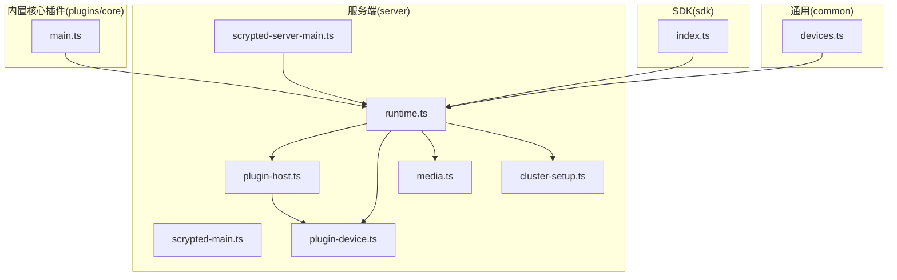
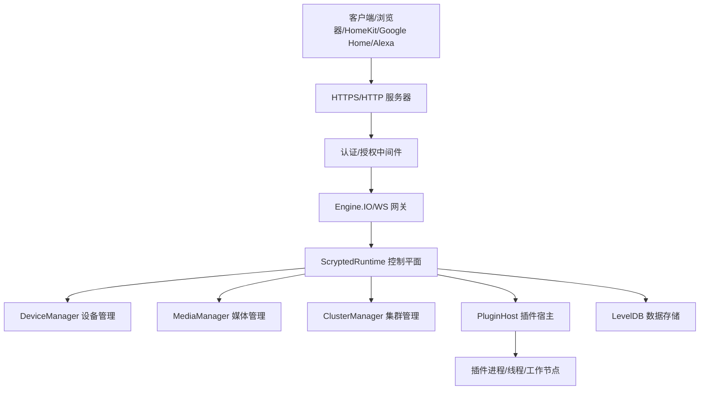
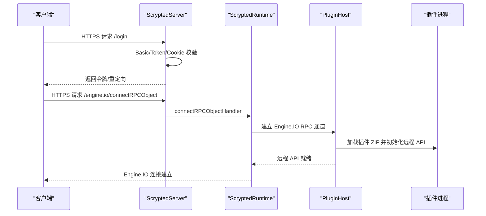
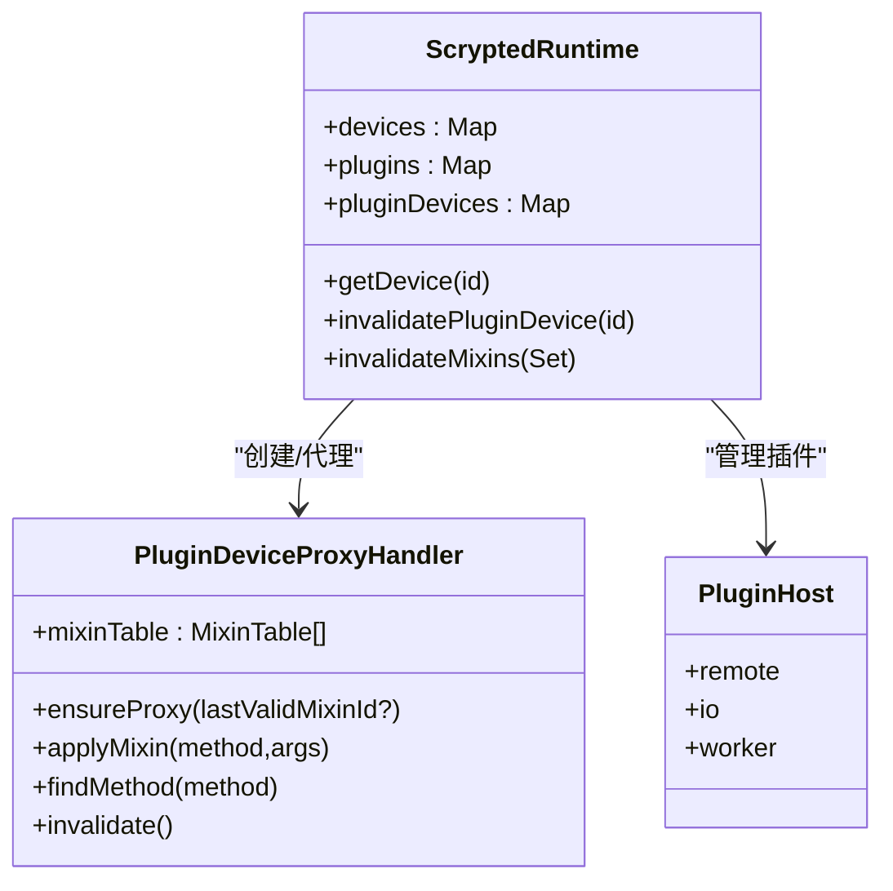
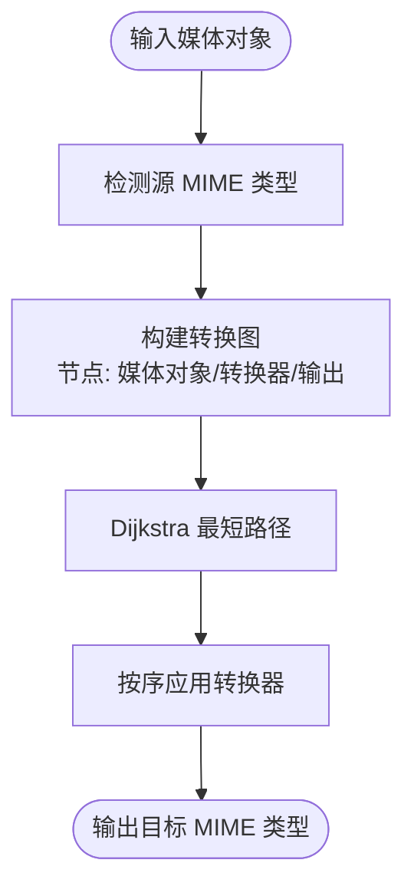
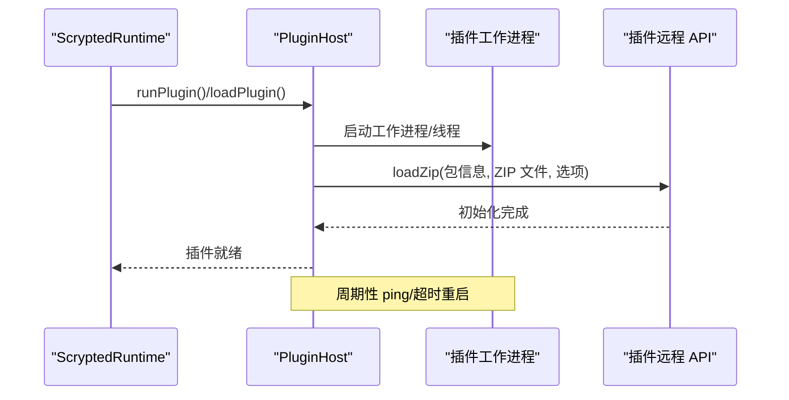
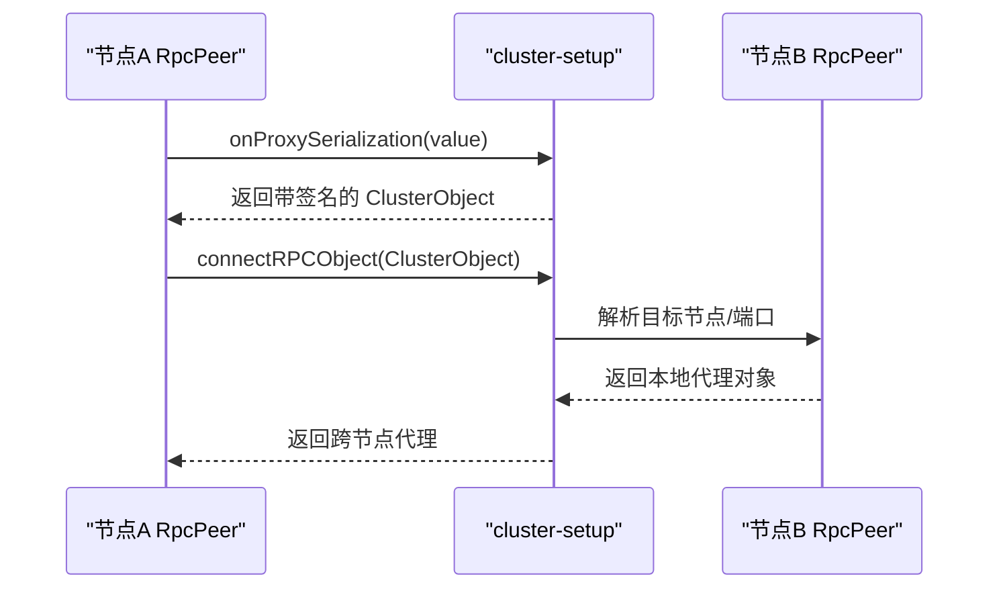
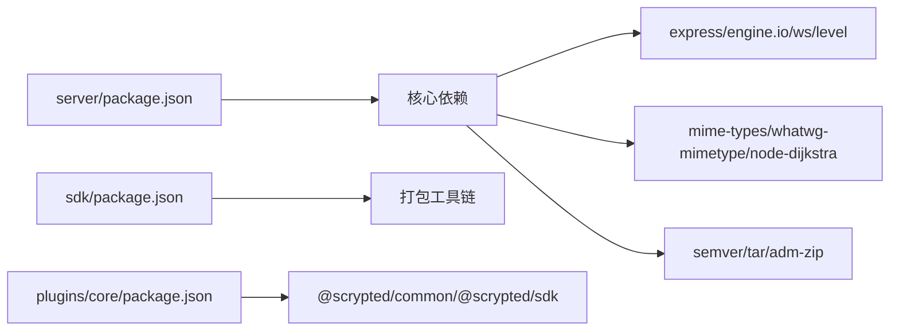

# 系统架构

<cite>
**本文引用的文件**
- [README.md](file://README.md)
- [scrypted-server-main.ts](file://server/src/scrypted-server-main.ts)
- [scrypted-main.ts](file://server/src/scrypted-main.ts)
- [runtime.ts](file://server/src/runtime.ts)
- [plugin-host.ts](file://server/src/plugin/plugin-host.ts)
- [plugin-device.ts](file://server/src/plugin/plugin-device.ts)
- [cluster-setup.ts](file://server/src/cluster/cluster-setup.ts)
- [media.ts](file://server/src/plugin/media.ts)
- [devices.ts](file://common/src/devices.ts)
- [index.ts](file://sdk/src/index.ts)
- [main.ts](file://plugins/core/src/main.ts)
- [package.json（server）](file://server/package.json)
- [package.json（core 插件）](file://plugins/core/package.json)
- [package.json（SDK）](file://sdk/package.json)
</cite>

## 目录
1. [引言](#引言)
2. [项目结构](#项目结构)
3. [核心组件](#核心组件)
4. [架构总览](#架构总览)
5. [详细组件分析](#详细组件分析)
6. [依赖分析](#依赖分析)
7. [性能考量](#性能考量)
8. [故障排查指南](#故障排查指南)
9. [结论](#结论)
10. [附录](#附录)

## 引言
本文件面向 Scrypted 的系统架构，围绕分层设计与模块化组织，系统性阐述表现层、业务逻辑层、数据访问层的职责划分；深入解析核心组件 ScryptedServer、DeviceManager、MediaManager、PluginHost、ClusterManager 的功能与协作机制；总结插件系统的架构模式（生命周期、RPC 通信、模块化）、分布式集群设计理念（节点发现、负载均衡、故障转移）；并给出架构决策的技术考量、性能权衡与扩展性设计建议。

## 项目结构
Scrypted 采用多包（monorepo）组织方式，核心目录与角色如下：
- server：服务端运行时与核心控制平面，负责 HTTP/WebSocket/Engine.IO 网关、插件托管、设备代理、媒体编解码、集群与安全等。
- plugins/core：内置核心插件，提供 UI、系统设备、脚本、终端、REPL、聚合、自动化、用户管理、集群管理等能力。
- sdk：插件开发 SDK，提供设备基类、Mixin、状态、媒体对象创建等 API。
- common：通用工具库，供 server 与插件共享。
- packages、external、sites：辅助包、外部集成与前端站点资源。
- install：容器与安装脚本，支持 Docker、Proxmox 等部署形态。

图表来源
- [scrypted-main.ts:1-4](file://server/src/scrypted-main.ts#L1-L4)
- [scrypted-server-main.ts:1-818](file://server/src/scrypted-server-main.ts#L1-L818)
- [runtime.ts:1-1031](file://server/src/runtime.ts#L1-L1031)
- [plugin-host.ts:1-506](file://server/src/plugin/plugin-host.ts#L1-L506)
- [plugin-device.ts:1-486](file://server/src/plugin/plugin-device.ts#L1-L486)
- [media.ts:1-514](file://server/src/plugin/media.ts#L1-L514)
- [cluster-setup.ts:1-498](file://server/src/cluster/cluster-setup.ts#L1-L498)
- [main.ts:1-414](file://plugins/core/src/main.ts#L1-L414)
- [index.ts:1-297](file://sdk/src/index.ts#L1-L297)
- [devices.ts:1-6](file://common/src/devices.ts#L1-L6)

章节来源
- [README.md:1-59](file://README.md#L1-L59)
- [package.json（server）:1-73](file://server/package.json#L1-L73)
- [package.json（core 插件）:1-51](file://plugins/core/package.json#L1-L51)
- [package.json（SDK）:1-62](file://sdk/package.json#L1-L62)

## 核心组件
- ScryptedServer：服务端入口与控制平面，负责 HTTPS/HTTP 监听、认证授权、CORS、Engine.IO 连接、日志告警、备份、用户管理、集群模式初始化与 RPC 对象桥接。
- DeviceManager：设备发现、状态管理、Mixin 组合、设备代理（Proxy）与接口查询、事件监听、刷新与探测。
- MediaManager：媒体对象转换、URL 生成、FFmpeg 输入参数处理、内置与系统级转换器链路选择与执行。
- PluginHost：插件生命周期管理（启动、加载、重启、崩溃恢复）、RPC 通信、Engine.IO 会话、控制台输出、健康检查、集群工作节点对接。
- ClusterManager：集群模式下的节点发现、连接建立、RPC 对象跨节点转发、线程间 IPC 桥接、代理序列化与签名校验。

章节来源
- [scrypted-server-main.ts:139-818](file://server/src/scrypted-server-main.ts#L139-L818)
- [runtime.ts:64-176](file://server/src/runtime.ts#L64-L176)
- [plugin-host.ts:38-224](file://server/src/plugin/plugin-host.ts#L38-L224)
- [plugin-device.ts:31-486](file://server/src/plugin/plugin-device.ts#L31-L486)
- [media.ts:40-514](file://server/src/plugin/media.ts#L40-L514)
- [cluster-setup.ts:38-399](file://server/src/cluster/cluster-setup.ts#L38-L399)

## 架构总览
Scrypted 采用“服务端 + 多插件”的分层架构：
- 表现层：Web UI、Engine.IO/WS 接口、HTTP API，由服务端在 HTTPS/HTTP 上提供。
- 业务逻辑层：DeviceManager、MediaManager、ClusterManager、ServiceControl、Backup、Users 等服务组件。
- 数据访问层：本地 LevelDB 存储（证书、用户、插件元数据、告警），以及插件设备状态与系统状态缓存。
- 插件层：以 ZIP 包形式分发，按需下载/安装/加载，通过 RPC 与宿主通信，支持自定义运行时与集群工作节点。

图表来源
- [scrypted-server-main.ts:112-794](file://server/src/scrypted-server-main.ts#L112-L794)
- [runtime.ts:64-176](file://server/src/runtime.ts#L64-L176)
- [plugin-host.ts:122-224](file://server/src/plugin/plugin-host.ts#L122-L224)
- [cluster-setup.ts:336-399](file://server/src/cluster/cluster-setup.ts#L336-L399)

## 详细组件分析

### ScryptedServer（服务端）
- 职责：启动 HTTPS/HTTP 服务、注册路由与中间件、处理登录/登出、备份/恢复、插件安装与调试、集群模式监听。
- 关键流程：
  - 初始化证书与 Cookie 签名、Basic 认证、默认认证、令牌校验。
  - 注册 Engine.IO/WS 端点，处理升级与连接。
  - 提供 /login、/logout、/backup、/restore、/web/component/script/* 等管理接口。
  - 在集群模式下启动专用集群服务器端口。

图表来源
- [scrypted-server-main.ts:257-387](file://server/src/scrypted-server-main.ts#L257-L387)
- [runtime.ts:248-274](file://server/src/runtime.ts#L248-L274)
- [plugin-host.ts:465-504](file://server/src/plugin/plugin-host.ts#L465-L504)

章节来源
- [scrypted-server-main.ts:139-818](file://server/src/scrypted-server-main.ts#L139-L818)

### DeviceManager（设备管理）
- 职责：设备发现、状态更新、Mixin 组合、接口查询、事件监听、设备代理（Proxy）构建与失效重建。
- 关键机制：
  - PluginDeviceProxyHandler 动态组合多个 MixinProvider，形成“虚拟设备”接口集。
  - 通过 RpcPeer 将方法调用路由到具体实现或 Mixin。
  - 支持设备刷新、探测、接口变更通知。

图表来源
- [runtime.ts:784-800](file://server/src/runtime.ts#L784-L800)
- [plugin-device.ts:31-486](file://server/src/plugin/plugin-device.ts#L31-L486)
- [plugin-host.ts:38-224](file://server/src/plugin/plugin-host.ts#L38-L224)

章节来源
- [runtime.ts:498-542](file://server/src/runtime.ts#L498-L542)
- [plugin-device.ts:14-486](file://server/src/plugin/plugin-device.ts#L14-L486)

### MediaManager（媒体管理）
- 职责：媒体对象转换、URL 生成（本地/不安全本地/远程）、FFmpeg 输入参数注入、内置与系统转换器链路选择。
- 关键机制：
  - 基于 MIME 类型匹配与权重的 Dijkstra 最短路径算法选择转换链。
  - 内置转换器：HTTP/HTTPS、file、Url↔FFmpegInput、MediaStreamUrl↔FFmpegInput、图片直传等。
  - 支持系统级 BufferConverter/MediaConverter 扩展。

图表来源
- [media.ts:313-471](file://server/src/plugin/media.ts#L313-L471)

章节来源
- [media.ts:40-514](file://server/src/plugin/media.ts#L40-L514)

### PluginHost（插件宿主）
- 职责：插件生命周期管理、RPC 通信、Engine.IO 会话、健康检查、控制台输出、集群工作节点对接。
- 关键机制：
  - 启动插件进程/线程/工作节点，准备 ZIP 文件与解压路径。
  - 通过 RpcPeer 与插件建立双向通信，加载插件模块并初始化远程 API。
  - 健康检查与自动重启策略，错误日志与控制台输出。

图表来源
- [plugin-host.ts:122-224](file://server/src/plugin/plugin-host.ts#L122-L224)
- [plugin-host.ts:226-274](file://server/src/plugin/plugin-host.ts#L226-L274)
- [plugin-host.ts:330-463](file://server/src/plugin/plugin-host.ts#L330-L463)

章节来源
- [plugin-host.ts:38-506](file://server/src/plugin/plugin-host.ts#L38-L506)

### ClusterManager（集群管理）
- 职责：集群模式初始化、节点发现、RPC 对象跨节点转发、线程间 IPC 桥接、代理序列化与签名校验。
- 关键机制：
  - 基于随机端口的唯一 Peer ID，建立双向 RPC 连接。
  - 代理对象序列化携带签名，确保跨节点访问的安全性。
  - 支持 Worker Threads 间 MessagePort 桥接与主从注册。

图表来源
- [cluster-setup.ts:28-76](file://server/src/cluster/cluster-setup.ts#L28-L76)
- [cluster-setup.ts:259-300](file://server/src/cluster/cluster-setup.ts#L259-L300)
- [cluster-setup.ts:336-399](file://server/src/cluster/cluster-setup.ts#L336-L399)

章节来源
- [cluster-setup.ts:38-498](file://server/src/cluster/cluster-setup.ts#L38-L498)

### 插件系统架构模式
- 生命周期：安装（下载/解压/写入数据库）→ 启动（进程/线程/工作节点）→ 加载（ZIP 解析/模块初始化）→ 运行（RPC/Engine.IO/WS）→ 崩溃重启（健康检查）。
- RPC 通信：基于 RpcPeer 的双向消息传递，支持缓冲区与 JSON 分片传输，Engine.IO 会话用于长连接。
- 模块化设计：插件以 ZIP 包分发，可声明运行时（默认 Node，支持自定义），可声明依赖与接口，支持 Mixin 扩展。

章节来源
- [runtime.ts:620-760](file://server/src/runtime.ts#L620-L760)
- [plugin-host.ts:226-274](file://server/src/plugin/plugin-host.ts#L226-L274)
- [plugin-device.ts:14-486](file://server/src/plugin/plugin-device.ts#L14-L486)

### 分布式集群架构
- 节点发现：通过环境变量配置（地址/端口/密钥），服务端监听专用端口，客户端发起连接。
- 负载均衡：插件可声明偏好标签，调度到特定工作节点；Engine.IO/WS 连接按会话路由。
- 故障转移：心跳检测失败触发重启；跨节点 RPC 对象具备签名校验，避免环回与伪造。

章节来源
- [cluster-setup.ts:403-462](file://server/src/cluster/cluster-setup.ts#L403-L462)
- [plugin-host.ts:380-426](file://server/src/plugin/plugin-host.ts#L380-L426)

## 依赖分析
- 服务端依赖：Express、Engine.IO、WS、LevelDB、semver、tar、adm-zip、mime-types、whatwg-mimetype、node-dijkstra 等。
- SDK 依赖：Rollup、Webpack、TypeScript、Babel 等打包工具链。
- 核心插件：依赖 @scrypted/common 与 @scrypted/sdk，声明内置接口与类型。

图表来源
- [package.json（server）:5-31](file://server/package.json#L5-L31)
- [package.json（SDK）:31-53](file://sdk/package.json#L31-L53)
- [package.json（core 插件）:38-46](file://plugins/core/package.json#L38-L46)

章节来源
- [package.json（server）:1-73](file://server/package.json#L1-L73)
- [package.json（SDK）:1-62](file://sdk/package.json#L1-L62)
- [package.json（core 插件）:1-51](file://plugins/core/package.json#L1-L51)

## 性能考量
- 插件隔离：通过独立进程/线程/工作节点隔离，避免单点故障影响全局。
- 媒体转换：基于最短路径算法选择转换链，减少不必要的中间格式；内置转换器优先，系统扩展器后置，避免不稳定配置影响系统。
- 传输优化：Engine.IO 启用 perMessageDeflate，限制大对象传输大小，避免内存压力。
- 健康检查：定期 ping 与超时重启，保障长时间运行稳定性。
- 存储：LevelDB 本地持久化，配合压缩与清理策略（日志清理）。

## 故障排查指南
- 登录与认证问题：检查 Basic/Token/Cookie 设置、默认认证环境变量、证书版本与签名。
- 插件加载失败：查看控制台输出、确认 ZIP 文件完整性、检查运行时兼容性与依赖。
- Engine.IO/WS 连接异常：确认端口占用、CORS/Access-Control 配置、升级头处理。
- 集群连接失败：核对 SCRYPTED_CLUSTER_* 环境变量、节点地址与端口、签名一致性。

章节来源
- [scrypted-server-main.ts:175-200](file://server/src/scrypted-server-main.ts#L175-L200)
- [plugin-host.ts:289-325](file://server/src/plugin/plugin-host.ts#L289-L325)
- [cluster-setup.ts:403-462](file://server/src/cluster/cluster-setup.ts#L403-L462)

## 结论
Scrypted 通过清晰的分层设计与强大的插件体系，实现了高扩展性的家庭视频与智能设备集成平台。服务端作为统一控制平面，结合 DeviceManager、MediaManager、ClusterManager 与 PluginHost，提供了稳定、可扩展且易于运维的运行时。集群模式进一步增强了横向扩展与容错能力。未来可在以下方向持续演进：更细粒度的资源隔离、动态负载均衡策略、增强的可观测性与告警体系、自动化运维与灾难恢复方案。

## 附录
- 系统边界：服务端对外暴露 HTTPS/HTTP 与 Engine.IO/WS；内部通过 RPC 与插件通信；数据持久化于本地 LevelDB。
- 组件交互：服务端路由 → 认证 → Engine.IO/WS → Runtime → PluginHost → 插件进程；媒体请求经 MediaManager 转换链路。
- 数据流：设备状态与系统状态由 Runtime 维护；插件通过 Remote API 更新状态；MediaManager 生成 URL 或本地文件路径。