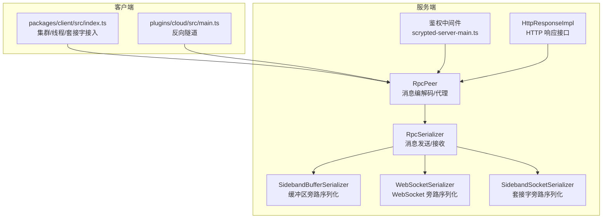
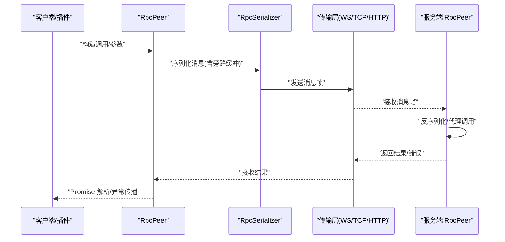
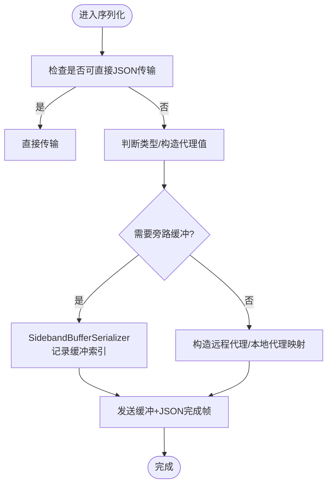
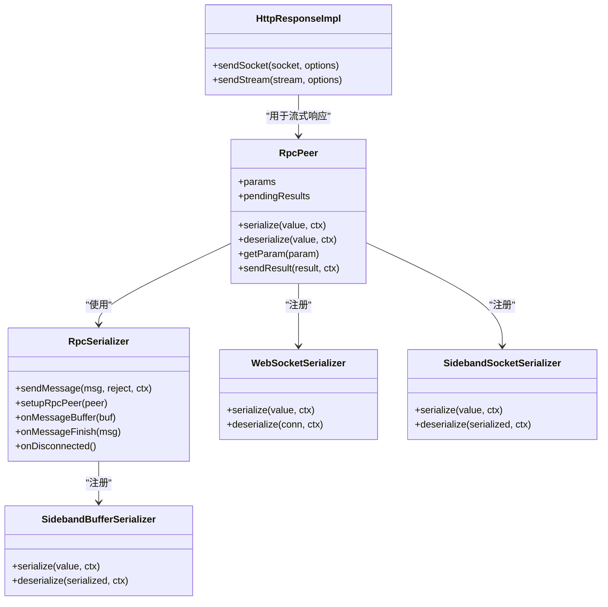
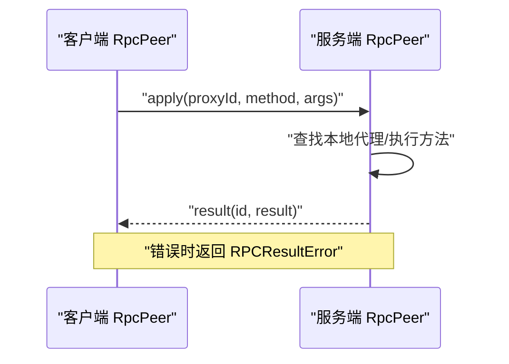
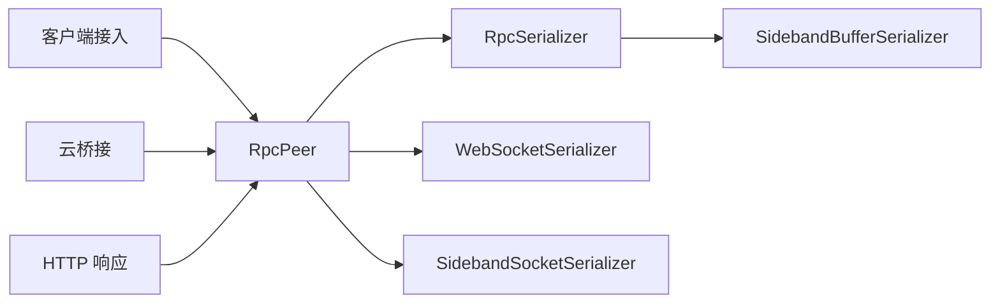

# 通信协议架构

<cite>
**本文引用的文件**
- [server/src/rpc.ts](file://server/src/rpc.ts)
- [server/src/rpc-serializer.ts](file://server/src/rpc-serializer.ts)
- [server/src/rpc-buffer-serializer.ts](file://server/src/rpc-buffer-serializer.ts)
- [server/src/plugin/plugin-remote-websocket.ts](file://server/src/plugin/plugin-remote-websocket.ts)
- [server/src/plugin/socket-serializer.ts](file://server/src/plugin/socket-serializer.ts)
- [server/src/http-interfaces.ts](file://server/src/http-interfaces.ts)
- [server/src/scrypted-server-main.ts](file://server/src/scrypted-server-main.ts)
- [packages/client/src/index.ts](file://packages/client/src/index.ts)
- [plugins/cloud/src/main.ts](file://plugins/cloud/src/main.ts)
- [server/test/rpc-duplex-test.ts](file://server/test/rpc-duplex-test.ts)
</cite>

## 目录
1. [引言](#引言)
2. [项目结构](#项目结构)
3. [核心组件](#核心组件)
4. [架构总览](#架构总览)
5. [详细组件分析](#详细组件分析)
6. [依赖关系分析](#依赖关系分析)
7. [性能考量](#性能考量)
8. [故障排查指南](#故障排查指南)
9. [结论](#结论)
10. [附录](#附录)

## 引言
本文件系统化梳理 Scrypted 的通信协议架构，重点覆盖 RPC 通信协议的设计与实现，包括消息格式、序列化机制、连接管理；不同传输层协议（WebSocket、HTTP、TCP 套接字）的实现差异与适用场景；消息路由与分发、目标定位、错误重试策略；安全机制（认证授权、数据加密、完整性校验）；以及性能优化（压缩、批量、连接复用）与扩展指南、兼容性与调试方法。

## 项目结构
围绕通信协议的关键目录与文件如下：
- 核心 RPC 实现：server/src/rpc.ts、server/src/rpc-serializer.ts、server/src/rpc-buffer-serializer.ts
- 传输适配与序列化：server/src/plugin/plugin-remote-websocket.ts、server/src/plugin/socket-serializer.ts
- HTTP 集成与响应接口：server/src/http-interfaces.ts
- 客户端接入示例：packages/client/src/index.ts
- 云桥接与反向隧道：plugins/cloud/src/main.ts
- 服务端入口与鉴权：server/src/scrypted-server-main.ts
- 单元测试与验证：server/test/rpc-duplex-test.ts

**图表来源**
- [server/src/rpc.ts:285-800](file://server/src/rpc.ts#L285-L800)
- [server/src/rpc-serializer.ts:1-240](file://server/src/rpc-serializer.ts#L1-L240)
- [server/src/rpc-buffer-serializer.ts:1-32](file://server/src/rpc-buffer-serializer.ts#L1-L32)
- [server/src/plugin/plugin-remote-websocket.ts:1-189](file://server/src/plugin/plugin-remote-websocket.ts#L1-L189)
- [server/src/plugin/socket-serializer.ts:1-16](file://server/src/plugin/socket-serializer.ts#L1-L16)
- [server/src/http-interfaces.ts:1-125](file://server/src/http-interfaces.ts#L1-L125)
- [server/src/scrypted-server-main.ts:303-336](file://server/src/scrypted-server-main.ts#L303-L336)
- [packages/client/src/index.ts:624-796](file://packages/client/src/index.ts#L624-L796)
- [plugins/cloud/src/main.ts:1229-1272](file://plugins/cloud/src/main.ts#L1229-L1272)

**章节来源**
- [server/src/rpc.ts:1-858](file://server/src/rpc.ts#L1-L858)
- [server/src/rpc-serializer.ts:1-240](file://server/src/rpc-serializer.ts#L1-L240)
- [server/src/rpc-buffer-serializer.ts:1-32](file://server/src/rpc-buffer-serializer.ts#L1-L32)
- [server/src/plugin/plugin-remote-websocket.ts:1-189](file://server/src/plugin/plugin-remote-websocket.ts#L1-L189)
- [server/src/plugin/socket-serializer.ts:1-16](file://server/src/plugin/socket-serializer.ts#L1-L16)
- [server/src/http-interfaces.ts:1-125](file://server/src/http-interfaces.ts#L1-L125)
- [server/src/scrypted-server-main.ts:303-336](file://server/src/scrypted-server-main.ts#L303-L336)
- [packages/client/src/index.ts:624-796](file://packages/client/src/index.ts#L624-L796)
- [plugins/cloud/src/main.ts:1229-1272](file://plugins/cloud/src/main.ts#L1229-L1272)
- [server/test/rpc-duplex-test.ts:1-30](file://server/test/rpc-duplex-test.ts#L1-L30)

## 核心组件
- RpcPeer：RPC 消息模型、代理对象、参数传递、结果返回、错误序列化与反序列化、挂起结果管理、终结器注册与回收。
- RpcSerializer：消息发送/接收、缓冲区旁路、JSON 完整消息与二进制分片的组合处理、断开检测与对等端销毁。
- SidebandBufferSerializer：二进制大对象旁路传输，避免 JSON 序列化开销。
- WebSocketSerializer/SidebandSocketSerializer：在不同传输层上对特殊句柄进行旁路序列化。
- HttpResponseImpl：HTTP 响应接口，支持发送 Socket、Stream、文件等。
- 客户端接入：多传输路径（线程、worker、套接字、WebSocket）统一通过 RpcPeer 进行 RPC 调用。
- 云桥接：反向隧道建立本地到云端的 TCP 管道，配合 RPC 使用。

**章节来源**
- [server/src/rpc.ts:285-800](file://server/src/rpc.ts#L285-L800)
- [server/src/rpc-serializer.ts:25-85](file://server/src/rpc-serializer.ts#L25-L85)
- [server/src/rpc-buffer-serializer.ts:14-31](file://server/src/rpc-buffer-serializer.ts#L14-L31)
- [server/src/plugin/plugin-remote-websocket.ts:176-189](file://server/src/plugin/plugin-remote-websocket.ts#L176-L189)
- [server/src/plugin/socket-serializer.ts:3-15](file://server/src/plugin/socket-serializer.ts#L3-L15)
- [server/src/http-interfaces.ts:10-120](file://server/src/http-interfaces.ts#L10-L120)
- [packages/client/src/index.ts:624-796](file://packages/client/src/index.ts#L624-L796)
- [plugins/cloud/src/main.ts:1229-1272](file://plugins/cloud/src/main.ts#L1229-L1272)

## 架构总览
下图展示 RPC 在不同传输层上的整体交互流程：客户端/插件侧通过 RpcPeer 发起调用，经由传输适配层（WebSocket、TCP、HTTP 等）编码为消息帧，服务端 RpcSerializer 解析后交由 RpcPeer 处理并返回结果。

**图表来源**
- [server/src/rpc.ts:152-220](file://server/src/rpc.ts#L152-L220)
- [server/src/rpc-serializer.ts:38-85](file://server/src/rpc-serializer.ts#L38-L85)
- [server/src/plugin/plugin-remote-websocket.ts:154-174](file://server/src/plugin/plugin-remote-websocket.ts#L154-L174)
- [server/src/http-interfaces.ts:80-120](file://server/src/http-interfaces.ts#L80-L120)

## 详细组件分析

### 消息格式与序列化机制
- 消息类型：apply（调用）、result（结果）、param（参数查询）、finalize（代理终结）。
- 参数传递：param 通过 RpcPeer.getParam 获取服务端参数值，再序列化返回。
- 结果返回：RpcPeer.sendResult 封装结果或错误，并在序列化失败时回退为错误消息。
- 错误处理：RPCResultError 包装远端错误栈与上下文，便于定位问题。
- 旁路序列化：Buffer/Uint8Array 通过 SidebandBufferSerializer 以索引旁路传输，避免 JSON 编解码；WebSocket/Sockets 通过专用 Serializer 在上下文中传递句柄。
- 数据通道分片：DataChannel 场景下按最大包大小切片并去抖发送，确保可靠传输。

**图表来源**
- [server/src/rpc.ts:570-678](file://server/src/rpc.ts#L570-L678)
- [server/src/rpc-buffer-serializer.ts:14-31](file://server/src/rpc-buffer-serializer.ts#L14-L31)
- [server/src/rpc-serializer.ts:38-85](file://server/src/rpc-serializer.ts#L38-L85)

**章节来源**
- [server/src/rpc.ts:29-83](file://server/src/rpc.ts#L29-L83)
- [server/src/rpc.ts:476-506](file://server/src/rpc.ts#L476-L506)
- [server/src/rpc.ts:548-568](file://server/src/rpc.ts#L548-L568)
- [server/src/rpc-buffer-serializer.ts:1-32](file://server/src/rpc-buffer-serializer.ts#L1-L32)
- [server/src/rpc-serializer.ts:38-85](file://server/src/rpc-serializer.ts#L38-L85)

### 连接管理与传输适配
- 双工 RPC Peer：基于可读/可写流创建，自动绑定事件与断开处理。
- WebSocket 适配：提供 WebSocketConnection 作为代理，支持 oneway 方法（send/close），并可注入自定义 WebSocket 类型。
- 套接字旁路：通过 SidebandSocketSerializer 在进程间传递底层套接字句柄。
- HTTP 响应接口：支持 sendSocket 将 net.Socket 管道到 HTTP 响应流，实现低延迟媒体转发。
- 客户端接入：线程/worker/套接字/集群等多路径统一走 RpcPeer，便于扩展新传输。

**图表来源**
- [server/src/rpc.ts:285-800](file://server/src/rpc.ts#L285-L800)
- [server/src/rpc-serializer.ts:25-85](file://server/src/rpc-serializer.ts#L25-L85)
- [server/src/rpc-buffer-serializer.ts:14-31](file://server/src/rpc-buffer-serializer.ts#L14-L31)
- [server/src/plugin/plugin-remote-websocket.ts:176-189](file://server/src/plugin/plugin-remote-websocket.ts#L176-L189)
- [server/src/plugin/socket-serializer.ts:3-15](file://server/src/plugin/socket-serializer.ts#L3-L15)
- [server/src/http-interfaces.ts:72-120](file://server/src/http-interfaces.ts#L72-L120)

**章节来源**
- [server/src/rpc-serializer.ts:5-23](file://server/src/rpc-serializer.ts#L5-L23)
- [server/src/plugin/plugin-remote-websocket.ts:154-189](file://server/src/plugin/plugin-remote-websocket.ts#L154-L189)
- [server/src/plugin/socket-serializer.ts:3-15](file://server/src/plugin/socket-serializer.ts#L3-L15)
- [server/src/http-interfaces.ts:72-120](file://server/src/http-interfaces.ts#L72-L120)

### 不同传输层协议的实现差异与适用场景
- WebSocket：适用于浏览器/前端直连、事件推送、低延迟双向通信；通过 WebSocketSerializer 注入自定义 WebSocket 类型，支持 oneway 方法。
- TCP 套接字：适用于本地/内网高吞吐、低开销场景；支持旁路套接字句柄传递与背压控制。
- HTTP：适用于传统 Web 客户端、静态资源与响应流；HttpResponseImpl 支持 sendSocket/sendStream，结合 RpcPeer 实现流式输出。
- 数据通道（DataChannel）：针对 WebRTC 场景，采用分片与去抖策略，保证可靠传输。

**章节来源**
- [server/src/plugin/plugin-remote-websocket.ts:73-189](file://server/src/plugin/plugin-remote-websocket.ts#L73-L189)
- [server/src/plugin/socket-serializer.ts:3-15](file://server/src/plugin/socket-serializer.ts#L3-L15)
- [server/src/http-interfaces.ts:72-120](file://server/src/http-interfaces.ts#L72-L120)
- [server/src/rpc-serializer.ts:184-240](file://server/src/rpc-serializer.ts#L184-L240)

### 消息路由与分发机制
- 目标定位：通过 proxyId 映射本地/远程代理对象，RpcPeer 维护 localProxyMap 与 remoteWeakProxies。
- 调用分发：服务端 RpcPeer.handleMessageInternal 根据 type 分派 apply/param/result/finalize，异步执行目标方法并将结果序列化返回。
- 负载均衡与连接复用：客户端通过 clusterSetup 对同一端口复用已有 RpcPeer，避免重复握手；WebSocket/HTTP 层可复用现有连接。
- 错误重试策略：当前未见通用自动重试逻辑，建议在应用层根据业务语义实现指数退避与幂等处理。

**图表来源**
- [server/src/rpc.ts:714-800](file://server/src/rpc.ts#L714-L800)
- [packages/client/src/index.ts:785-796](file://packages/client/src/index.ts#L785-L796)

**章节来源**
- [server/src/rpc.ts:697-800](file://server/src/rpc.ts#L697-L800)
- [packages/client/src/index.ts:785-796](file://packages/client/src/index.ts#L785-L796)

### 安全机制
- 认证授权：服务端在请求处理中解析 Cookie/Bearer Token/URL 参数，提取用户令牌并设置 res.locals，后续权限控制可基于此。
- 数据加密：WebSocket/TCP 可在上层启用 TLS；HTTP 建议通过反向代理或内置 HTTPS。
- 完整性校验：当前未发现专用完整性校验机制，建议在传输层启用 TLS 并在应用层对关键消息进行签名/摘要。

**章节来源**
- [server/src/scrypted-server-main.ts:303-336](file://server/src/scrypted-server-main.ts#L303-L336)

### 性能优化策略
- 压缩算法：HTTP 响应可通过中间件启用 gzip/deflate；WebSocket/TCP 可在应用层对大对象进行压缩后再旁路传输。
- 批量处理：合并小消息、批量发送缓冲区，减少网络往返。
- 连接复用：复用现有 RpcPeer 连接（同一端口/集群），避免频繁握手。
- 背压与限流：TCP 侧实现背压暂停/恢复；HTTP 流式响应使用 drain 事件。
- 旁路传输：优先使用 SidebandBufferSerializer 传输大对象，降低序列化成本。

**章节来源**
- [server/src/http-interfaces.ts:80-120](file://server/src/http-interfaces.ts#L80-L120)
- [server/src/rpc-buffer-serializer.ts:14-31](file://server/src/rpc-buffer-serializer.ts#L14-L31)
- [server/src/rpc-serializer.ts:184-240](file://server/src/rpc-serializer.ts#L184-L240)
- [plugins/cloud/src/main.ts:1229-1272](file://plugins/cloud/src/main.ts#L1229-L1272)

### 协议扩展指南与兼容性
- 新增传输层：实现 RpcSerializer 接口的 sendMessageBuffer/sendMessageFinish，并在 onMessageBuffer/onMessageFinish 中处理旁路数据与完整消息。
- 兼容性：保持消息字段稳定，新增字段需向后兼容；对不支持旁路传输的对端回退到 Base64 编码。
- 调试工具：使用 server/test/rpc-duplex-test.ts 启动本地回环测试，验证双工通信与消息收发。

**章节来源**
- [server/src/rpc-serializer.ts:25-85](file://server/src/rpc-serializer.ts#L25-L85)
- [server/test/rpc-duplex-test.ts:1-30](file://server/test/rpc-duplex-test.ts#L1-L30)

## 依赖关系分析
- RpcPeer 依赖 RpcSerializer 进行消息编解码；注册 SidebandBufferSerializer、WebSocketSerializer、SidebandSocketSerializer 等以支持不同场景。
- 传输适配层（WebSocket/TCP/HTTP）通过 RpcPeer 暴露统一的 RPC 能力。
- 客户端通过多种接入方式（线程/worker/套接字/集群）复用同一 RpcPeer 机制。
- 云桥接通过反向隧道将本地服务暴露至云端，配合 RPC 使用。

**图表来源**
- [server/src/rpc.ts:285-800](file://server/src/rpc.ts#L285-L800)
- [server/src/rpc-serializer.ts:25-85](file://server/src/rpc-serializer.ts#L25-L85)
- [server/src/rpc-buffer-serializer.ts:14-31](file://server/src/rpc-buffer-serializer.ts#L14-L31)
- [server/src/plugin/plugin-remote-websocket.ts:176-189](file://server/src/plugin/plugin-remote-websocket.ts#L176-L189)
- [server/src/plugin/socket-serializer.ts:3-15](file://server/src/plugin/socket-serializer.ts#L3-L15)
- [server/src/http-interfaces.ts:72-120](file://server/src/http-interfaces.ts#L72-L120)
- [packages/client/src/index.ts:624-796](file://packages/client/src/index.ts#L624-L796)
- [plugins/cloud/src/main.ts:1229-1272](file://plugins/cloud/src/main.ts#L1229-L1272)

**章节来源**
- [server/src/rpc.ts:285-800](file://server/src/rpc.ts#L285-L800)
- [server/src/rpc-serializer.ts:25-85](file://server/src/rpc-serializer.ts#L25-L85)
- [server/src/rpc-buffer-serializer.ts:14-31](file://server/src/rpc-buffer-serializer.ts#L14-L31)
- [server/src/plugin/plugin-remote-websocket.ts:176-189](file://server/src/plugin/plugin-remote-websocket.ts#L176-L189)
- [server/src/plugin/socket-serializer.ts:3-15](file://server/src/plugin/socket-serializer.ts#L3-L15)
- [server/src/http-interfaces.ts:72-120](file://server/src/http-interfaces.ts#L72-L120)
- [packages/client/src/index.ts:624-796](file://packages/client/src/index.ts#L624-L796)
- [plugins/cloud/src/main.ts:1229-1272](file://plugins/cloud/src/main.ts#L1229-L1272)

## 性能考量
- 旁路传输优先：对大对象使用 SidebandBufferSerializer，避免 JSON 编解码与拷贝。
- 分片与去抖：DataChannel 场景下按最大包长切片并去抖发送，提升吞吐与稳定性。
- 背压控制：TCP 侧实现缓冲长度阈值与 pause/resume，防止内存峰值。
- 连接复用：集群/端口复用现有 RpcPeer，减少握手与上下文切换。
- 流式响应：HTTP sendStream 结合 RpcPeer，实现低延迟媒体/日志流输出。

**章节来源**
- [server/src/rpc-buffer-serializer.ts:14-31](file://server/src/rpc-buffer-serializer.ts#L14-L31)
- [server/src/rpc-serializer.ts:184-240](file://server/src/rpc-serializer.ts#L184-L240)
- [server/src/http-interfaces.ts:80-120](file://server/src/http-interfaces.ts#L80-L120)

## 故障排查指南
- 断开与错误：RpcSerializer.onDisconnected 触发对端 kill，检查连接关闭/错误事件与日志。
- 消息解析失败：RpcSerializer.onData 中 JSON 解析异常会触发 kill，确认消息帧格式与长度字段。
- 代理失效：远程代理通过 WeakRef 与 FinalizationRegistry 管理，若出现无效 ID，检查代理生命周期与 finalize 流程。
- HTTP 响应异常：HttpResponseImpl.sendSocket/sendStream 在异常时会销毁响应，检查上游流状态与下游写入。

**章节来源**
- [server/src/rpc-serializer.ts:33-85](file://server/src/rpc-serializer.ts#L33-L85)
- [server/src/rpc.ts:464-474](file://server/src/rpc.ts#L464-L474)
- [server/src/http-interfaces.ts:80-120](file://server/src/http-interfaces.ts#L80-L120)

## 结论
Scrypted 的通信协议以 RpcPeer 为核心，通过 RpcSerializer 提供跨传输层的一致消息编解码能力，并辅以旁路序列化与传输适配，实现高效、可扩展的 RPC 通信。结合 WebSocket/TCP/HTTP 等传输与云桥接，满足从浏览器到边缘设备的多样化场景。建议在生产环境强化传输层加密与完整性校验，并在应用层完善错误重试与可观测性。

## 附录
- 单元测试参考：server/test/rpc-duplex-test.ts 展示了本地回环双工测试流程，可用于快速验证协议正确性与性能表现。

**章节来源**
- [server/test/rpc-duplex-test.ts:1-30](file://server/test/rpc-duplex-test.ts#L1-L30)