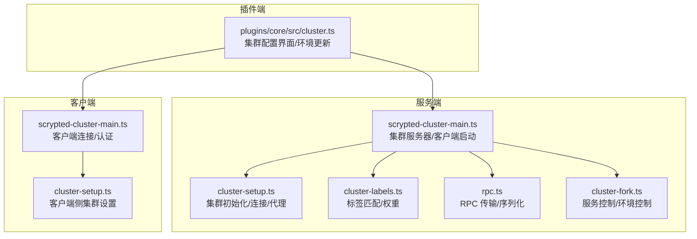
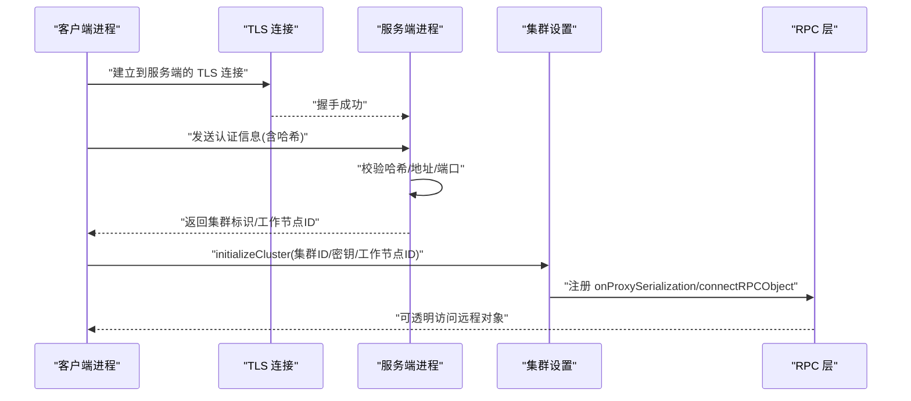
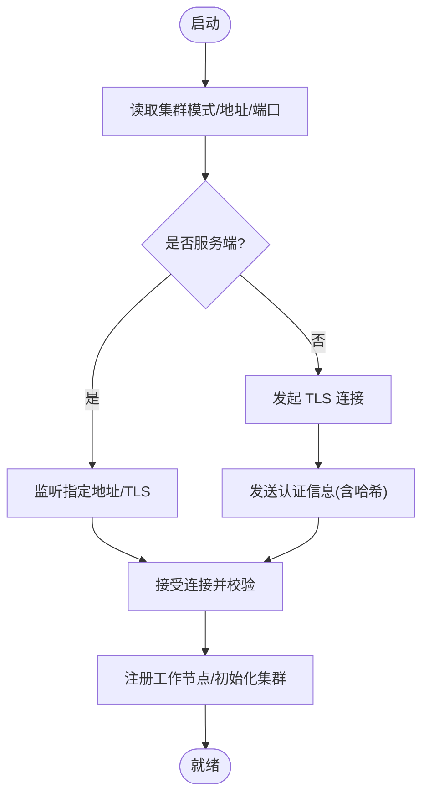
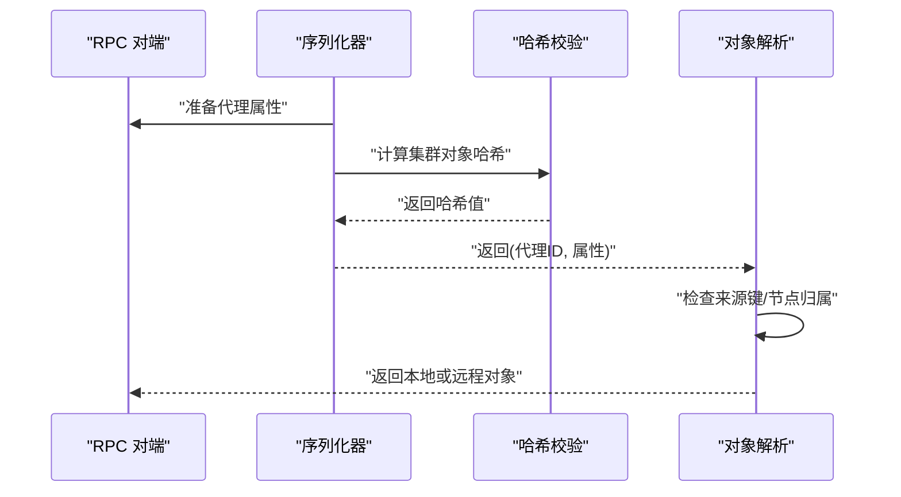
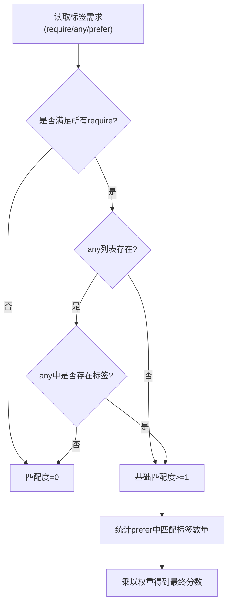
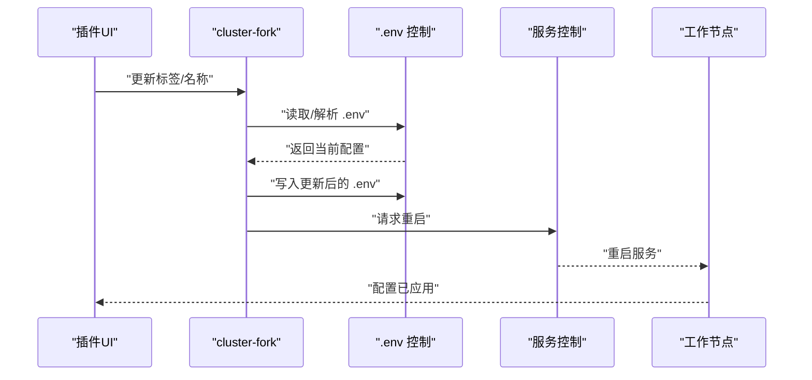
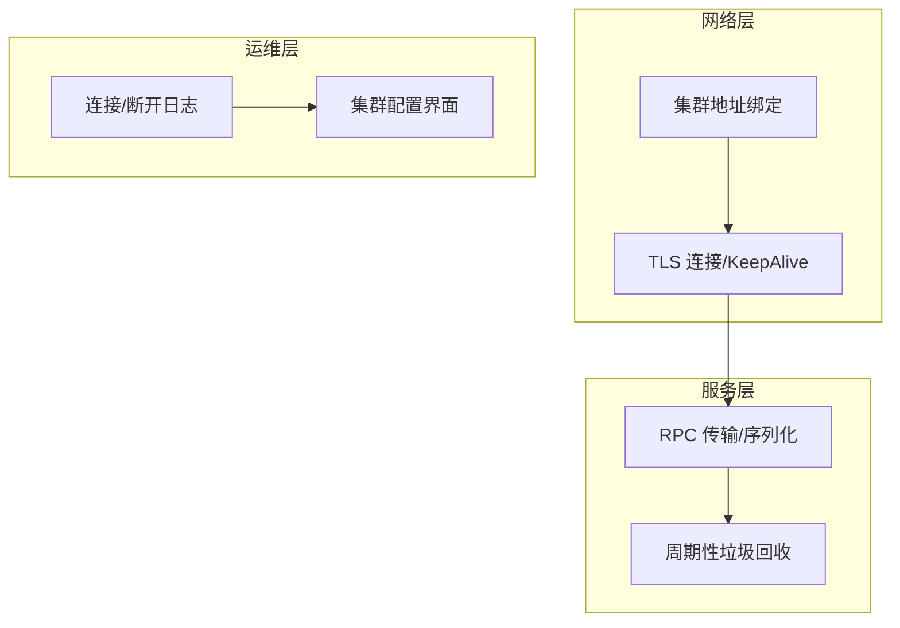
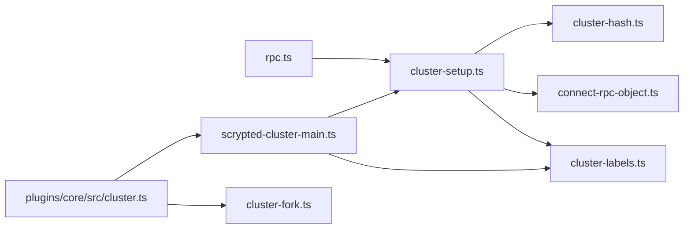

# 集群管理架构

<cite>
**本文引用的文件**   
- [cluster.ts](file://plugins/core/src/cluster.ts)
- [cluster-setup.ts](file://server/src/cluster/cluster-setup.ts)
- [connect-rpc-object.ts](file://server/src/cluster/connect-rpc-object.ts)
- [cluster-hash.ts](file://server/src/cluster/cluster-hash.ts)
- [scrypted-cluster-main.ts](file://server/src/scrypted-cluster-main.ts)
- [cluster-labels.ts](file://server/src/cluster/cluster-labels.ts)
- [rpc.ts](file://server/src/rpc.ts)
- [docker-compose.yml](file://install/docker/docker-compose.yml)
- [cluster-fork.ts](file://server/src/services/cluster-fork.ts)
- [plugin_remote.py](file://server/python/plugin_remote.py)
</cite>

## 目录
1. [引言](#引言)
2. [项目结构](#项目结构)
3. [核心组件](#核心组件)
4. [架构总览](#架构总览)
5. [详细组件分析](#详细组件分析)
6. [依赖关系分析](#依赖关系分析)
7. [性能考量](#性能考量)
8. [故障排查指南](#故障排查指南)
9. [结论](#结论)
10. [附录](#附录)

## 引言
本文件面向 Scrypted 的集群管理架构，系统性阐述其分布式设计理念与实现细节，覆盖以下主题：
- 节点发现与连接：主节点协调、工作节点接入、客户端节点认证与注册
- 负载均衡与标签选择：基于标签匹配与权重的调度策略
- 故障转移与容错：TLS 连接、心跳与重连、对象代理与安全校验
- 配置同步与一致性：.env 环境变量更新、重启触发与一致性保障
- RPC 对象集群化：远程对象代理、透明通信、网络分区处理
- 部署拓扑与运维：高可用、性能调优、监控告警
- 扩缩容、迁移与灾备：动态扩缩容、跨节点迁移、灾难恢复

## 项目结构
Scrypted 的集群能力由服务端与插件端协同实现：
- 服务端负责集群模式初始化、TLS 监听、节点认证、RPC 对象分发与代理
- 客户端（工作节点）通过 TLS 连接到服务端，完成认证后参与集群
- 插件端提供集群配置界面与环境变量控制，支持按标签选择计算节点
- RPC 层抽象了本地与远程对象的透明访问

**图表来源**
- [scrypted-cluster-main.ts:332-409](file://server/src/scrypted-cluster-main.ts#L332-L409)
- [cluster-setup.ts:38-399](file://server/src/cluster/cluster-setup.ts#L38-L399)
- [cluster-labels.ts:1-58](file://server/src/cluster/cluster-labels.ts#L1-L58)
- [rpc.ts:29-200](file://server/src/rpc.ts#L29-L200)
- [cluster-fork.ts:124-155](file://server/src/services/cluster-fork.ts#L124-L155)
- [cluster.ts:1-163](file://plugins/core/src/cluster.ts#L1-L163)

**章节来源**
- [scrypted-cluster-main.ts:332-409](file://server/src/scrypted-cluster-main.ts#L332-L409)
- [cluster-setup.ts:38-399](file://server/src/cluster/cluster-setup.ts#L38-L399)
- [cluster-labels.ts:1-58](file://server/src/cluster/cluster-labels.ts#L1-L58)
- [rpc.ts:29-200](file://server/src/rpc.ts#L29-L200)
- [cluster-fork.ts:124-155](file://server/src/services/cluster-fork.ts#L124-L155)
- [cluster.ts:1-163](file://plugins/core/src/cluster.ts#L1-L163)

## 核心组件
- 集群模式与监听
  - 通过环境变量控制集群模式、地址与端口，服务端监听指定地址，客户端发起 TLS 连接并完成认证
- RPC 对象代理与安全
  - 每个被序列化的对象携带集群标识与哈希，确保对象归属与完整性校验
- 标签与权重调度
  - 基于标签集合进行“必须/任选/偏好”匹配，结合权重返回匹配度，用于 fork 选择
- 配置同步与重启
  - 通过 .env 更新标签与名称，触发目标节点服务重启以应用新配置

**章节来源**
- [scrypted-cluster-main.ts:213-330](file://server/src/scrypted-cluster-main.ts#L213-L330)
- [cluster-setup.ts:38-399](file://server/src/cluster/cluster-setup.ts#L38-L399)
- [connect-rpc-object.ts:1-29](file://server/src/cluster/connect-rpc-object.ts#L1-L29)
- [cluster-hash.ts:1-8](file://server/src/cluster/cluster-hash.ts#L1-L8)
- [cluster-labels.ts:1-58](file://server/src/cluster/cluster-labels.ts#L1-L58)
- [cluster.ts:103-155](file://plugins/core/src/cluster.ts#L103-L155)

## 架构总览
下图展示集群的启动、认证、RPC 对象分发与代理的关键流程。

**图表来源**
- [scrypted-cluster-main.ts:294-329](file://server/src/scrypted-cluster-main.ts#L294-L329)
- [cluster-setup.ts:336-399](file://server/src/cluster/cluster-setup.ts#L336-L399)

**章节来源**
- [scrypted-cluster-main.ts:294-329](file://server/src/scrypted-cluster-main.ts#L294-L329)
- [cluster-setup.ts:336-399](file://server/src/cluster/cluster-setup.ts#L336-L399)

## 详细组件分析

### 组件一：集群模式与节点角色
- 角色分工
  - 主节点（服务端）：负责监听、认证、维护工作节点列表、提供 fork 参数与服务控制
  - 工作节点（客户端）：连接服务端、完成认证、参与 RPC 对象代理、可作为计算/存储节点
  - 客户端节点（插件端 UI）：提供集群配置界面，更新标签与名称，触发重启
- 启动与认证
  - 服务端创建 TLS 服务器，接收客户端连接；客户端使用 TLS 连接服务端，发送认证信息（含哈希）
  - 服务端校验哈希、地址与端口，生成工作节点 ID 并注册到运行时

**图表来源**
- [scrypted-cluster-main.ts:213-330](file://server/src/scrypted-cluster-main.ts#L213-L330)
- [scrypted-cluster-main.ts:332-409](file://server/src/scrypted-cluster-main.ts#L332-L409)

**章节来源**
- [scrypted-cluster-main.ts:213-330](file://server/src/scrypted-cluster-main.ts#L213-L330)
- [scrypted-cluster-main.ts:332-409](file://server/src/scrypted-cluster-main.ts#L332-L409)

### 组件二：RPC 对象的集群化实现
- 对象代理与透明通信
  - 序列化阶段为每个对象附加集群元数据（集群ID、地址、端口、代理ID、来源键、哈希）
  - 反序列化阶段根据来源键与代理ID解析对象，优先在本地查找，否则通过 RPC 远程获取
- 安全校验与防回环
  - 使用共享密钥对集群元数据进行哈希校验，防止伪造与篡改
  - 若对象属于当前节点但来源键不一致，丢弃旧条目，避免竞态
- 网络分区处理
  - 连接断开时清理远端代理映射，失败时回退到本地对象或抛出错误

**图表来源**
- [cluster-setup.ts:302-335](file://server/src/cluster/cluster-setup.ts#L302-L335)
- [connect-rpc-object.ts:1-29](file://server/src/cluster/connect-rpc-object.ts#L1-L29)
- [cluster-hash.ts:1-8](file://server/src/cluster/cluster-hash.ts#L1-L8)

**章节来源**
- [cluster-setup.ts:302-335](file://server/src/cluster/cluster-setup.ts#L302-L335)
- [connect-rpc-object.ts:1-29](file://server/src/cluster/connect-rpc-object.ts#L1-L29)
- [cluster-hash.ts:1-8](file://server/src/cluster/cluster-hash.ts#L1-L8)

### 组件三：标签匹配与负载均衡
- 标签匹配规则
  - 必须满足 require 列表中的全部标签
  - 任选 any 列表中至少一个标签（若未设置则视为满足）
  - 偏好 prefer 列表中的标签计数计入匹配度
- 权重与调度
  - 结合权重返回非零匹配度，用于 fork 选择与任务分配
- 环境变量与自动识别
  - 从环境变量读取标签与权重，自动添加架构、平台与主机名

**图表来源**
- [cluster-labels.ts:4-35](file://server/src/cluster/cluster-labels.ts#L4-L35)

**章节来源**
- [cluster-labels.ts:1-58](file://server/src/cluster/cluster-labels.ts#L1-L58)

### 组件四：配置同步与一致性
- 配置入口
  - 插件端提供设置项：工作节点名称、标签列表
- 写入与更新
  - 通过系统组件获取环境控制，读取 .env，解析键值，更新目标键后写回
  - 写入后延时触发服务重启，使新标签生效
- 一致性保障
  - 哈希校验确保对象归属正确；RPC 对象代理避免跨节点竞态

**图表来源**
- [cluster.ts:103-155](file://plugins/core/src/cluster.ts#L103-L155)
- [cluster-fork.ts:135-147](file://server/src/services/cluster-fork.ts#L135-L147)

**章节来源**
- [cluster.ts:103-155](file://plugins/core/src/cluster.ts#L103-L155)
- [cluster-fork.ts:135-147](file://server/src/services/cluster-fork.ts#L135-L147)

### 组件五：部署拓扑与运维
- 高可用与网络
  - 服务端监听指定地址与端口，支持同时绑定集群地址与本地回环地址
  - 客户端通过 IPv4、KeepAlive 与 TLS 保证连接稳定
- 性能调优
  - RPC 层具备周期性垃圾回收触发条件，降低内存压力
  - 通过标签与权重实现资源感知的负载均衡
- 监控与告警
  - 客户端连接/断开日志输出，便于监控
  - 插件端提供集群配置界面，便于运维查看与调整

**图表来源**
- [scrypted-cluster-main.ts:242-293](file://server/src/scrypted-cluster-main.ts#L242-L293)
- [rpc.ts:1-27](file://server/src/rpc.ts#L1-L27)
- [cluster.ts:157-162](file://plugins/core/src/cluster.ts#L157-L162)

**章节来源**
- [scrypted-cluster-main.ts:242-293](file://server/src/scrypted-cluster-main.ts#L242-L293)
- [rpc.ts:1-27](file://server/src/rpc.ts#L1-L27)
- [cluster.ts:157-162](file://plugins/core/src/cluster.ts#L157-L162)

## 依赖关系分析
- 组件耦合
  - 服务端与客户端通过 TLS 与 RPC 对象代理耦合，认证与哈希校验确保安全性
  - 标签匹配与权重调度解耦于具体业务，仅影响 fork 选择
- 外部依赖
  - 网络与 TLS 依赖操作系统与 Node.js 套接字
  - RPC 序列化依赖自定义协议与对象属性标记

**图表来源**
- [rpc.ts:29-200](file://server/src/rpc.ts#L29-L200)
- [cluster-setup.ts:38-399](file://server/src/cluster/cluster-setup.ts#L38-L399)
- [cluster-hash.ts:1-8](file://server/src/cluster/cluster-hash.ts#L1-L8)
- [connect-rpc-object.ts:1-29](file://server/src/cluster/connect-rpc-object.ts#L1-L29)
- [cluster-labels.ts:1-58](file://server/src/cluster/cluster-labels.ts#L1-L58)
- [scrypted-cluster-main.ts:332-409](file://server/src/scrypted-cluster-main.ts#L332-L409)
- [cluster.ts:1-163](file://plugins/core/src/cluster.ts#L1-L163)
- [cluster-fork.ts:124-155](file://server/src/services/cluster-fork.ts#L124-L155)

**章节来源**
- [rpc.ts:29-200](file://server/src/rpc.ts#L29-L200)
- [cluster-setup.ts:38-399](file://server/src/cluster/cluster-setup.ts#L38-L399)
- [cluster-hash.ts:1-8](file://server/src/cluster/cluster-hash.ts#L1-L8)
- [connect-rpc-object.ts:1-29](file://server/src/cluster/connect-rpc-object.ts#L1-L29)
- [cluster-labels.ts:1-58](file://server/src/cluster/cluster-labels.ts#L1-L58)
- [scrypted-cluster-main.ts:332-409](file://server/src/scrypted-cluster-main.ts#L332-L409)
- [cluster.ts:1-163](file://plugins/core/src/cluster.ts#L1-L163)
- [cluster-fork.ts:124-155](file://server/src/services/cluster-fork.ts#L124-L155)

## 性能考量
- RPC 传输与序列化
  - 采用双向 RPC 通道与对象属性标记，减少不必要的拷贝
  - 支持一次性方法与迭代器优化，降低内存占用
- 垃圾回收
  - 周期性触发全局 GC，缓解长生命周期进程的内存增长
- 负载均衡
  - 标签与权重提升资源利用率，避免热点节点过载

**章节来源**
- [rpc.ts:1-27](file://server/src/rpc.ts#L1-L27)
- [cluster-labels.ts:44-46](file://server/src/cluster/cluster-labels.ts#L44-L46)

## 故障排查指南
- 认证失败
  - 检查哈希是否与共享密钥一致；确认地址与端口匹配
- 连接异常
  - 查看 TLS 握手与 KeepAlive 设置；确认网络可达与防火墙放行
- 对象代理问题
  - 检查来源键与节点归属；确认哈希校验通过
- 配置未生效
  - 确认 .env 更新成功且触发了服务重启

**章节来源**
- [scrypted-cluster-main.ts:360-404](file://server/src/scrypted-cluster-main.ts#L360-L404)
- [cluster-setup.ts:28-76](file://server/src/cluster/cluster-setup.ts#L28-L76)
- [cluster.ts:135-155](file://plugins/core/src/cluster.ts#L135-L155)

## 结论
Scrypted 的集群管理架构以安全的 RPC 对象代理为核心，结合标签匹配与权重调度实现资源感知的负载均衡；通过 TLS 连接与哈希校验保障节点间通信的安全与一致性；配合插件端配置界面与服务控制，形成完整的运维闭环。该架构既满足高可用与性能要求，又便于扩展与迁移。

## 附录
- 部署建议
  - 使用 Docker Compose 以 host 网络模式部署，简化集群地址绑定
  - 在多节点环境中，合理设置标签与权重，避免热点与资源浪费
- 扩缩容与迁移
  - 新增节点：设置标签与权重，加入集群后自动参与调度
  - 迁移：通过标签切换与重启实现平滑迁移
- 灾难恢复
  - 保留 .env 与证书备份；服务端重启后重新认证并恢复 RPC 代理

**章节来源**
- [docker-compose.yml:121-121](file://install/docker/docker-compose.yml#L121-L121)
- [cluster.ts:145-154](file://plugins/core/src/cluster.ts#L145-L154)
- [plugin_remote.py:233-249](file://server/python/plugin_remote.py#L233-L249)