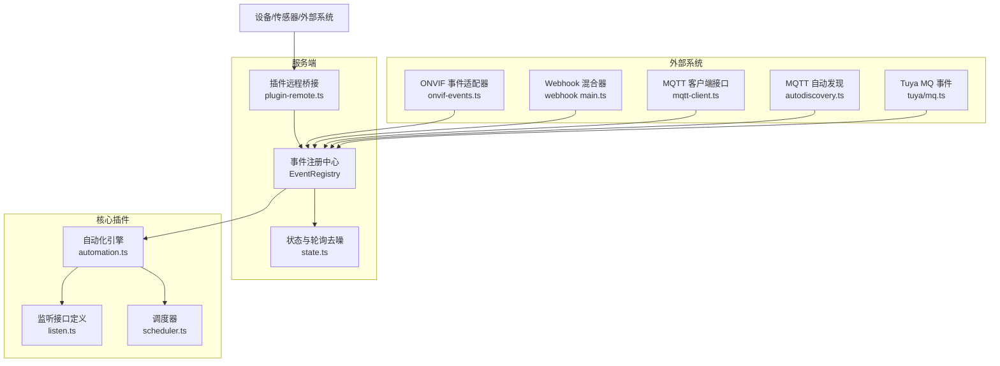
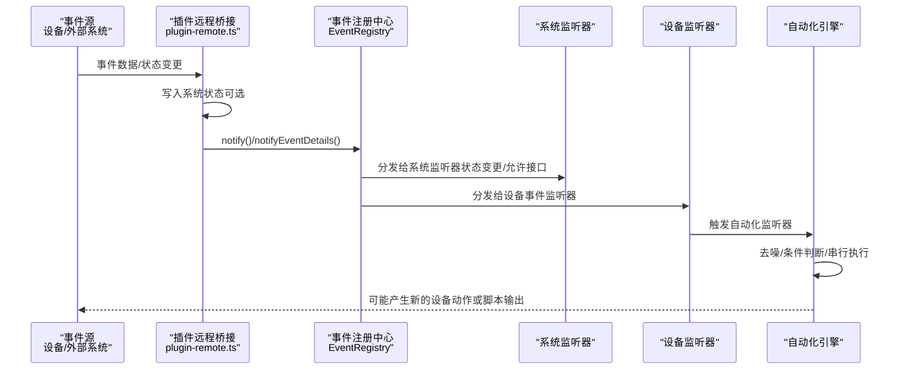
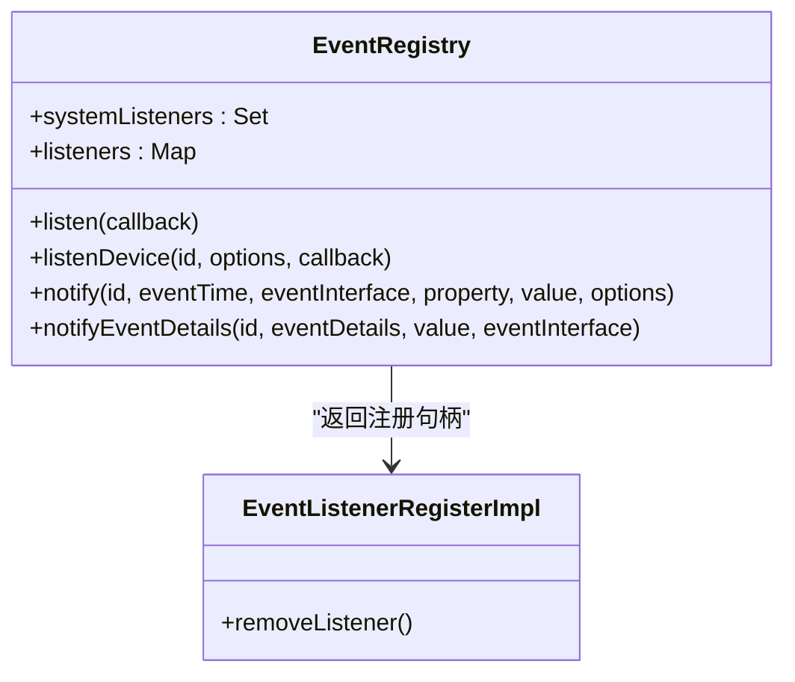
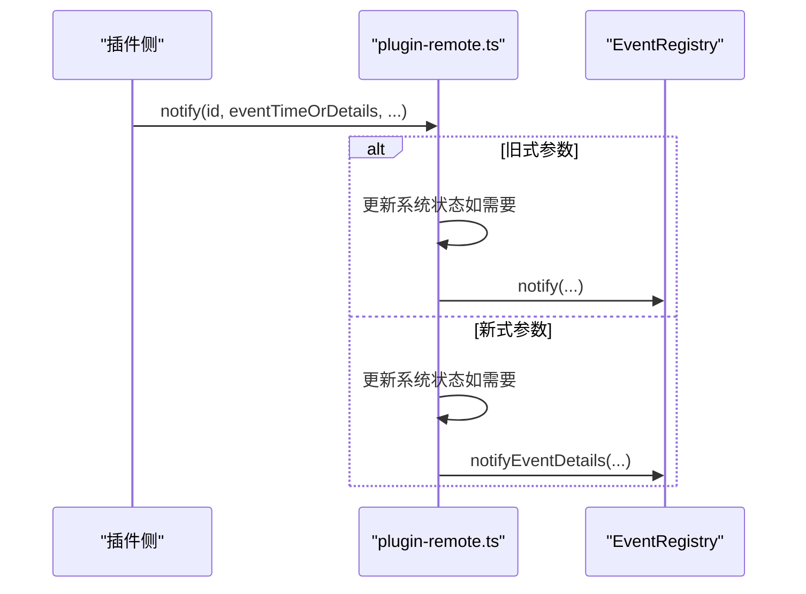
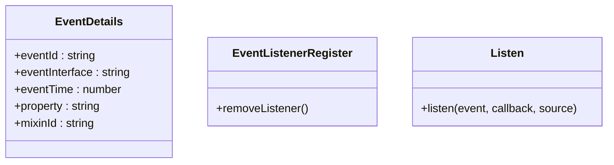
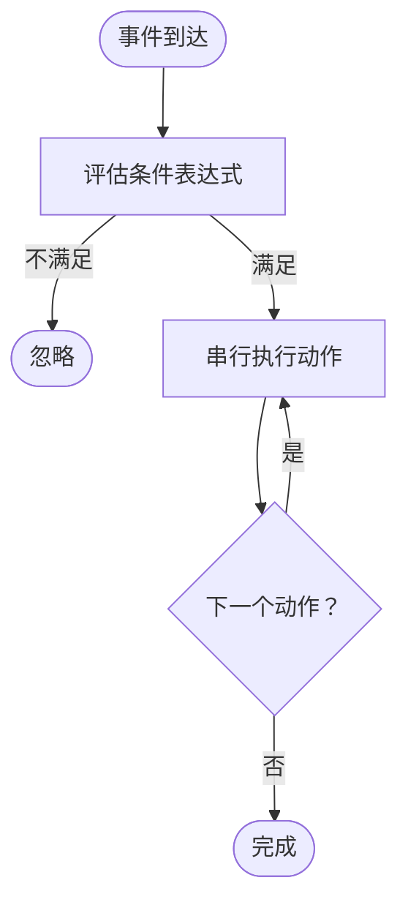
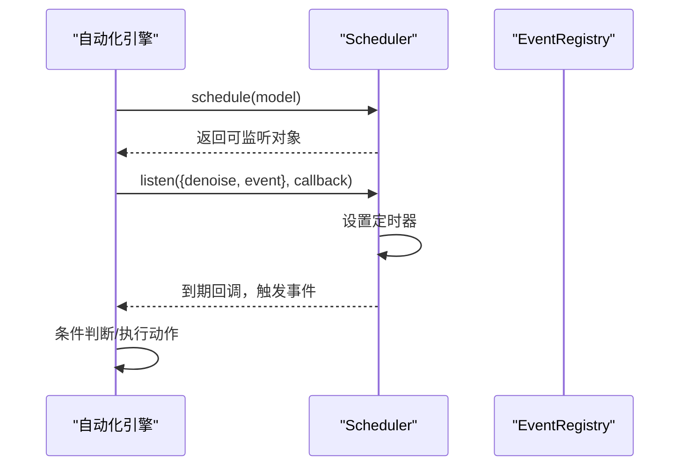
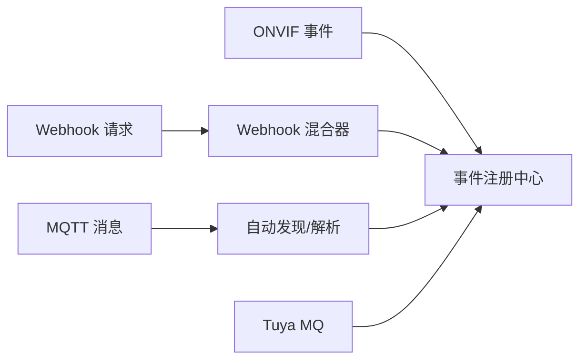
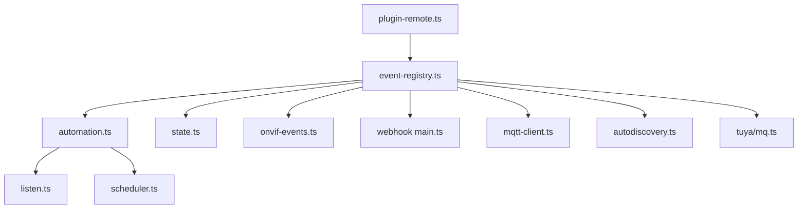

# 事件处理机制

<cite>
**本文引用的文件**
- [event-registry.ts](file://server/src/event-registry.ts)
- [plugin-remote.ts](file://server/src/plugin/plugin-remote.ts)
- [types.input.ts](file://sdk/types/src/types.input.ts)
- [automation.ts](file://plugins/core/src/automation.ts)
- [listen.ts](file://plugins/core/src/builtins/listen.ts)
- [scheduler.ts](file://plugins/core/src/builtins/scheduler.ts)
- [state.ts](file://server/src/state.ts)
- [onvif-events.ts](file://plugins/onvif/src/onvif-events.ts)
- [main.ts（Webhook 插件）](file://plugins/webhook/src/main.ts)
- [mqtt-client.ts](file://plugins/mqtt/src/api/mqtt-client.ts)
- [autodiscovery.ts](file://plugins/mqtt/src/autodiscovery.ts)
- [tuya/mq.ts](file://plugins/tuya/src/tuya/mq.ts)
- [async-queue.ts](file://common/src/async-queue.ts)
</cite>

## 目录
1. [引言](#引言)
2. [项目结构](#项目结构)
3. [核心组件](#核心组件)
4. [架构总览](#架构总览)
5. [详细组件分析](#详细组件分析)
6. [依赖关系分析](#依赖关系分析)
7. [性能考量](#性能考量)
8. [故障排查指南](#故障排查指南)
9. [结论](#结论)
10. [附录：事件处理最佳实践与示例](#附录事件处理最佳实践与示例)

## 引言
本文件系统性阐述 Scrypted 的事件驱动架构与事件处理机制，覆盖事件模型、事件传播、事件过滤、生命周期管理、执行模型（同步/异步/批量）、与设备管理、自动化引擎及外部系统的集成方式。通过源码级分析与图示，帮助开发者在理解内部实现的同时，构建稳定高效的事件处理应用。

## 项目结构
Scrypted 的事件处理由服务端事件注册中心、插件侧事件通知桥接、以及核心插件中的自动化引擎共同组成。事件从设备或外部系统产生，经由事件注册中心分发到系统监听器与设备特定监听器；自动化引擎对事件进行去噪、条件判断与动作执行；外部系统（如 MQTT、ONVIF、Webhook）以适配器形式接入事件体系。

**图表来源**
- [event-registry.ts:26-104](file://server/src/event-registry.ts#L26-L104)
- [plugin-remote.ts:238-273](file://server/src/plugin/plugin-remote.ts#L238-L273)
- [automation.ts:30-596](file://plugins/core/src/automation.ts#L30-L596)
- [listen.ts:3-5](file://plugins/core/src/builtins/listen.ts#L3-L5)
- [scheduler.ts:16-100](file://plugins/core/src/builtins/scheduler.ts#L16-L100)
- [state.ts:160-191](file://server/src/state.ts#L160-L191)
- [onvif-events.ts:74-95](file://plugins/onvif/src/onvif-events.ts#L74-L95)
- [main.ts（Webhook 插件）:95-253](file://plugins/webhook/src/main.ts#L95-L253)
- [mqtt-client.ts:17-20](file://plugins/mqtt/src/api/mqtt-client.ts#L17-L20)
- [autodiscovery.ts:237-284](file://plugins/mqtt/src/autodiscovery.ts#L237-L284)
- [tuya/mq.ts:22-54](file://plugins/tuya/src/tuya/mq.ts#L22-L54)

**章节来源**
- [event-registry.ts:1-105](file://server/src/event-registry.ts#L1-L105)
- [plugin-remote.ts:238-273](file://server/src/plugin/plugin-remote.ts#L238-L273)
- [automation.ts:1-597](file://plugins/core/src/automation.ts#L1-L597)

## 核心组件
- 事件注册中心（EventRegistry）
  - 提供系统级与设备级事件监听注册与通知分发。
  - 支持 mixin 事件命名扩展，过滤无变化的状态属性事件，仅向系统监听器推送状态变更事件。
- 插件远程桥接（plugin-remote.ts）
  - 将插件侧的事件通知转换为统一的事件细节对象，写入系统状态并调用事件注册中心进行分发。
- 事件类型与监听器接口（types.input.ts）
  - 定义事件详情（EventDetails）与监听器回调签名，确保跨模块契约一致。
- 自动化引擎（automation.ts）
  - 基于监听器注册事件，支持去噪、条件判断、串行执行与并发控制，触发设备动作或脚本。
- 监听接口与调度器（listen.ts、scheduler.ts）
  - 统一监听器接口，调度器提供基于时间的周期性事件源。
- 状态与去噪（state.ts）
  - 对刷新/轮询类事件进行去噪，避免重复事件触发。
- 外部系统适配器
  - ONVIF、Webhook、MQTT、Tuya 等通过事件注册中心接入系统。

**章节来源**
- [event-registry.ts:26-104](file://server/src/event-registry.ts#L26-L104)
- [plugin-remote.ts:238-273](file://server/src/plugin/plugin-remote.ts#L238-L273)
- [types.input.ts:80-100](file://sdk/types/src/types.input.ts#L80-L100)
- [automation.ts:30-596](file://plugins/core/src/automation.ts#L30-L596)
- [listen.ts:3-5](file://plugins/core/src/builtins/listen.ts#L3-L5)
- [scheduler.ts:16-100](file://plugins/core/src/builtins/scheduler.ts#L16-L100)
- [state.ts:160-191](file://server/src/state.ts#L160-L191)

## 架构总览
事件从产生到消费的全链路如下：

**图表来源**
- [plugin-remote.ts:238-273](file://server/src/plugin/plugin-remote.ts#L238-L273)
- [event-registry.ts:55-103](file://server/src/event-registry.ts#L55-L103)
- [automation.ts:482-590](file://plugins/core/src/automation.ts#L482-L590)

## 详细组件分析

### 事件注册中心（EventRegistry）
- 设计要点
  - 系统监听器集合与设备监听映射表，键为“设备ID#事件名”，支持通配与 mixin 扩展。
  - 事件去噪：当事件为属性事件且未标记 changed 时直接丢弃，减少噪声。
  - 分发策略：优先系统监听器（状态变更/允许接口），再按事件接口分发至设备监听器，最后兜底分发至所有事件监听器。
- 关键路径
  - 注册：listenDevice() 构造 token 并加入集合。
  - 通知：notify()/notifyEventDetails() 生成事件 ID，按策略分发。
- 性能与健壮性
  - 使用 Set 存储监听器，O(1) 添加/删除。
  - 允许接口白名单限制系统监听器接收的事件类型，降低系统负载。

**图表来源**
- [event-registry.ts:26-104](file://server/src/event-registry.ts#L26-L104)

**章节来源**
- [event-registry.ts:26-104](file://server/src/event-registry.ts#L26-L104)

### 插件远程桥接（plugin-remote.ts）
- 职责
  - 将插件侧事件转换为统一格式，必要时更新系统状态，然后调用事件注册中心进行分发。
  - 兼容旧式参数签名与新式 EventDetails 格式。
- 关键点
  - 属性事件且非 mixin 时，若未标记 changed 则不通知，避免噪声。
  - 当存在 property 且非 mixin 时，先写入系统状态，再通知事件细节。

**图表来源**
- [plugin-remote.ts:238-273](file://server/src/plugin/plugin-remote.ts#L238-L273)
- [event-registry.ts:55-103](file://server/src/event-registry.ts#L55-L103)

**章节来源**
- [plugin-remote.ts:238-273](file://server/src/plugin/plugin-remote.ts#L238-L273)

### 事件类型与监听器接口（types.input.ts）
- EventDetails
  - 包含事件唯一标识、事件接口、事件时间、属性名、mixin 标识等。
- EventListenerRegister
  - 提供 removeListener() 用于取消订阅。
- Listen 接口
  - 统一的监听器注册入口，支持字符串接口、事件接口或选项对象。

**图表来源**
- [types.input.ts:80-100](file://sdk/types/src/types.input.ts#L80-L100)
- [listen.ts:3-5](file://plugins/core/src/builtins/listen.ts#L3-L5)

**章节来源**
- [types.input.ts:80-100](file://sdk/types/src/types.input.ts#L80-L100)
- [listen.ts:3-5](file://plugins/core/src/builtins/listen.ts#L3-L5)

### 自动化引擎（automation.ts）
- 功能
  - 配置化触发器（设备事件、定时器）与动作（脚本、设备操作、等待、插件更新）。
  - 去噪、条件判断、串行执行、并发控制（runToCompletion、staticEvents）。
- 流程
  - 解析触发器与动作配置，构造监听器注册。
  - 事件到达后，评估条件表达式，串行执行动作，支持中断与超时。
- 关键设置
  - denoiseEvents：抑制连续相同事件。
  - runToCompletion：正在运行的自动化不会被新事件重置。
  - staticEvents：对所有事件重置运行中的计时器。

**图表来源**
- [automation.ts:482-590](file://plugins/core/src/automation.ts#L482-L590)

**章节来源**
- [automation.ts:30-596](file://plugins/core/src/automation.ts#L30-L596)

### 监听接口与调度器（listen.ts、scheduler.ts）
- Listen 接口
  - 统一监听器注册方法，支持事件过滤选项（如 denoise）。
- Scheduler
  - 基于日程配置生成周期性事件源，内部维护定时器并在到期时回调。

**图表来源**
- [scheduler.ts:16-100](file://plugins/core/src/builtins/scheduler.ts#L16-L100)
- [automation.ts:544-590](file://plugins/core/src/automation.ts#L544-L590)

**章节来源**
- [listen.ts:3-5](file://plugins/core/src/builtins/listen.ts#L3-L5)
- [scheduler.ts:16-100](file://plugins/core/src/builtins/scheduler.ts#L16-L100)
- [automation.ts:544-590](file://plugins/core/src/automation.ts#L544-L590)

### 状态与去噪（state.ts）
- 在轮询/刷新场景中，对事件数据进行去噪，避免重复回调。
- 通过包装回调函数，比较上一次数据与当前数据，相同则跳过。

**章节来源**
- [state.ts:160-191](file://server/src/state.ts#L160-L191)

### 外部系统适配器
- ONVIF 事件适配器
  - 订阅 ONVIF 事件，封装为事件源，最终通过事件注册中心分发。
- Webhook 混合器
  - 为设备提供 HTTP/Webhook 接口，解析请求并调用设备接口或读取属性，同时可触发设备事件。
- MQTT 客户端与自动发现
  - 提供订阅/发布接口，消息到达时解析为事件并分发；自动发现模块对主题进行去抖与绑定。
- Tuya MQ 事件
  - 基于 MQTT 连接事件流，封装为事件源供系统使用。

**图表来源**
- [onvif-events.ts:74-95](file://plugins/onvif/src/onvif-events.ts#L74-L95)
- [main.ts（Webhook 插件）:95-253](file://plugins/webhook/src/main.ts#L95-L253)
- [mqtt-client.ts:17-20](file://plugins/mqtt/src/api/mqtt-client.ts#L17-L20)
- [autodiscovery.ts:237-284](file://plugins/mqtt/src/autodiscovery.ts#L237-L284)
- [tuya/mq.ts:22-54](file://plugins/tuya/src/tuya/mq.ts#L22-L54)

**章节来源**
- [onvif-events.ts:74-95](file://plugins/onvif/src/onvif-events.ts#L74-L95)
- [main.ts（Webhook 插件）:95-253](file://plugins/webhook/src/main.ts#L95-L253)
- [mqtt-client.ts:17-20](file://plugins/mqtt/src/api/mqtt-client.ts#L17-L20)
- [autodiscovery.ts:237-284](file://plugins/mqtt/src/autodiscovery.ts#L237-L284)
- [tuya/mq.ts:22-54](file://plugins/tuya/src/tuya/mq.ts#L22-L54)

## 依赖关系分析
- 事件注册中心是事件分发的核心枢纽，被系统监听器、设备监听器与自动化引擎广泛依赖。
- 插件远程桥接负责将插件侧事件转换为系统可用的事件细节，是连接插件与系统的关键。
- 自动化引擎依赖监听接口与调度器，形成“触发器—动作”的闭环。
- 外部系统通过各自适配器接入事件体系，最终统一走事件注册中心。

**图表来源**
- [plugin-remote.ts:238-273](file://server/src/plugin/plugin-remote.ts#L238-L273)
- [event-registry.ts:26-104](file://server/src/event-registry.ts#L26-L104)
- [automation.ts:30-596](file://plugins/core/src/automation.ts#L30-L596)
- [listen.ts:3-5](file://plugins/core/src/builtins/listen.ts#L3-L5)
- [scheduler.ts:16-100](file://plugins/core/src/builtins/scheduler.ts#L16-L100)
- [state.ts:160-191](file://server/src/state.ts#L160-L191)
- [onvif-events.ts:74-95](file://plugins/onvif/src/onvif-events.ts#L74-L95)
- [main.ts（Webhook 插件）:95-253](file://plugins/webhook/src/main.ts#L95-L253)
- [mqtt-client.ts:17-20](file://plugins/mqtt/src/api/mqtt-client.ts#L17-L20)
- [autodiscovery.ts:237-284](file://plugins/mqtt/src/autodiscovery.ts#L237-L284)
- [tuya/mq.ts:22-54](file://plugins/tuya/src/tuya/mq.ts#L22-L54)

**章节来源**
- [event-registry.ts:26-104](file://server/src/event-registry.ts#L26-L104)
- [plugin-remote.ts:238-273](file://server/src/plugin/plugin-remote.ts#L238-L273)
- [automation.ts:30-596](file://plugins/core/src/automation.ts#L30-L596)

## 性能考量
- 事件去噪
  - 属性事件未标记 changed 时直接丢弃，避免系统噪声。
  - 自动化引擎支持 denoiseEvents 与 runToCompletion，减少重复执行与资源竞争。
- 分发路径优化
  - 系统监听器仅接收状态变更与允许接口，降低广播压力。
  - 设备监听映射采用“设备ID#事件名”键，快速定位目标监听器集合。
- 异步与批处理
  - 自动化动作串行执行，避免并发冲突；可通过外部系统消息队列（如 MQTT）实现异步解耦。
  - 通用异步队列工具可用于外部系统消息的顺序化处理。

**章节来源**
- [event-registry.ts:55-103](file://server/src/event-registry.ts#L55-L103)
- [automation.ts:35-56](file://plugins/core/src/automation.ts#L35-L56)
- [async-queue.ts:6-170](file://common/src/async-queue.ts#L6-L170)

## 故障排查指南
- 事件未到达
  - 检查是否为属性事件且未标记 changed，此类事件会被去噪丢弃。
  - 确认监听器注册是否正确，设备事件监听需匹配“设备ID#事件名”键。
- 自动化未触发
  - 核对触发器配置与事件接口是否一致。
  - 若启用 runToCompletion，检查是否存在未完成的 pending 任务导致忽略新事件。
- 外部系统接入问题
  - ONVIF：确认订阅成功与销毁逻辑。
  - Webhook：核对 token 与路径段是否匹配。
  - MQTT：确认主题匹配与消息解析。
- 状态不同步
  - 插件远程桥接在属性事件且非 mixin 时会先写入系统状态，再通知事件细节，确保状态一致性。

**章节来源**
- [event-registry.ts:55-103](file://server/src/event-registry.ts#L55-L103)
- [automation.ts:480-590](file://plugins/core/src/automation.ts#L480-L590)
- [onvif-events.ts:74-95](file://plugins/onvif/src/onvif-events.ts#L74-L95)
- [main.ts（Webhook 插件）:175-208](file://plugins/webhook/src/main.ts#L175-L208)
- [plugin-remote.ts:238-273](file://server/src/plugin/plugin-remote.ts#L238-L273)

## 结论
Scrypted 的事件处理机制以事件注册中心为核心，结合插件远程桥接、自动化引擎与外部系统适配器，形成了高内聚、低耦合的事件驱动架构。通过事件去噪、系统监听器过滤、串行执行与并发控制等策略，系统在保证实时性的同时兼顾稳定性与性能。开发者可基于统一的监听接口与事件详情模型，快速构建设备状态监控、异常检测与自动响应等场景。

## 附录：事件处理最佳实践与示例
- 最佳实践
  - 明确事件类型：区分状态变更事件与无状态事件，合理使用 changed 标记与允许接口白名单。
  - 合理使用去噪：对高频事件启用 denoiseEvents，避免自动化频繁触发。
  - 控制并发：启用 runToCompletion，防止自动化在执行中被新事件打断。
  - 异步解耦：对外部系统消息使用异步队列顺序化处理，避免竞态。
  - 清理资源：在销毁或切换监听器时调用 removeListener，释放资源。
- 示例场景
  - 设备状态监控：使用系统监听器捕获状态变更事件，记录日志或上报。
  - 异常检测：在自动化中对事件数据进行条件判断，触发告警或回滚动作。
  - 自动响应：基于 ONVIF 或 MQTT 事件，联动设备执行预设动作（如开关灯、录像）。
  - Webhook 集成：为设备暴露 Webhook 接口，通过 HTTP 请求触发设备动作或读取状态。

**章节来源**
- [automation.ts:35-56](file://plugins/core/src/automation.ts#L35-L56)
- [state.ts:160-191](file://server/src/state.ts#L160-L191)
- [async-queue.ts:6-170](file://common/src/async-queue.ts#L6-L170)
- [main.ts（Webhook 插件）:95-253](file://plugins/webhook/src/main.ts#L95-L253)