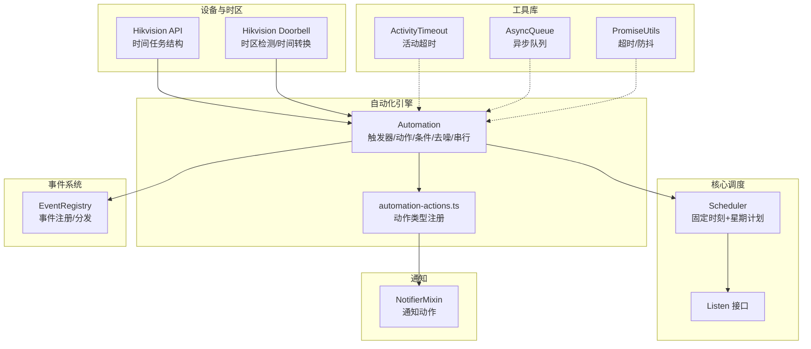
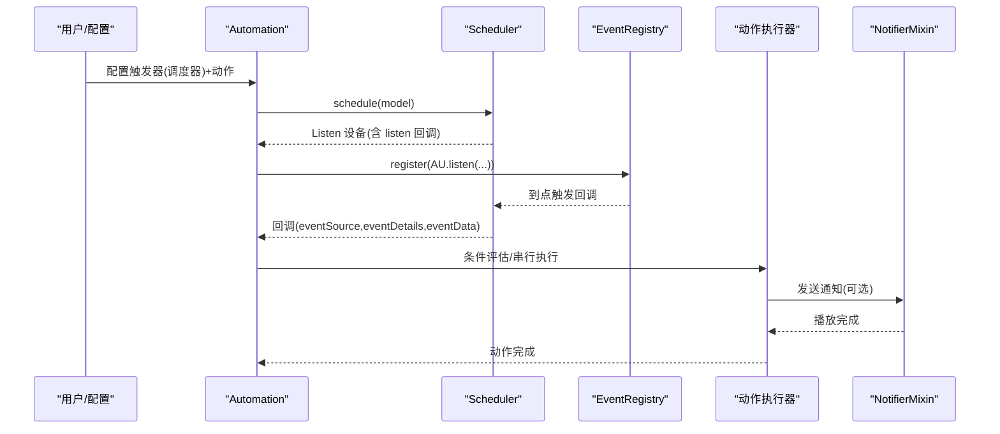
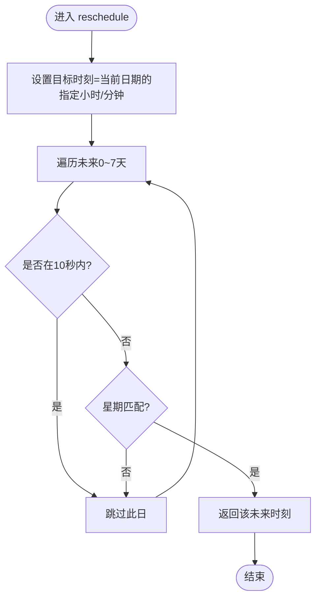
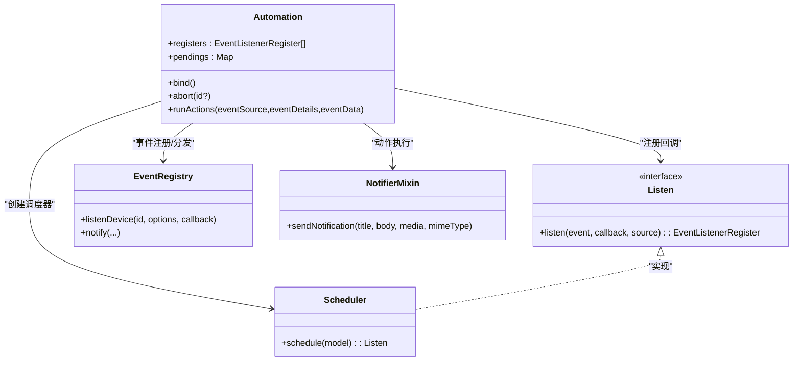
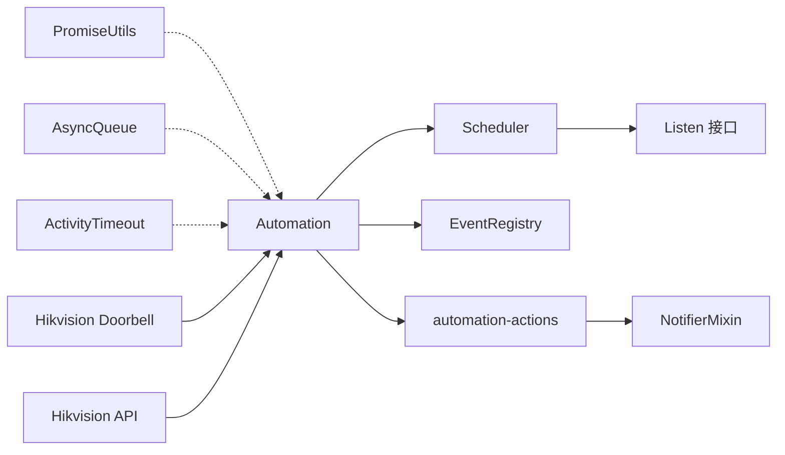

# 时间调度系统

<cite>
**本文引用的文件**
- [plugins/core/src/builtins/scheduler.ts](file://plugins/core/src/builtins/scheduler.ts)
- [plugins/core/src/builtins/listen.ts](file://plugins/core/src/builtins/listen.ts)
- [plugins/core/src/automation.ts](file://plugins/core/src/automation.ts)
- [plugins/core/src/automation-actions.ts](file://plugins/core/src/automation-actions.ts)
- [plugins/notifier-mixin/src/main.ts](file://plugins/notifier-mixin/src/main.ts)
- [server/src/event-registry.ts](file://server/src/event-registry.ts)
- [server/src/promise-utils.ts](file://server/src/promise-utils.ts)
- [common/src/activity-timeout.ts](file://common/src/activity-timeout.ts)
- [common/src/async-queue.ts](file://common/src/async-queue.ts)
- [plugins/hikvision-doorbell/src/doorbell-api.ts](file://plugins/hikvision-doorbell/src/doorbell-api.ts)
- [plugins/hikvision/src/hikvision-api-capabilities.ts](file://plugins/hikvision/src/hikvision-api-capabilities.ts)
- [plugins/core/src/update-plugins.ts](file://plugins/core/src/update-plugins.ts)
</cite>

## 目录
1. [引言](#引言)
2. [项目结构](#项目结构)
3. [核心组件](#核心组件)
4. [架构总览](#架构总览)
5. [详细组件分析](#详细组件分析)
6. [依赖关系分析](#依赖关系分析)
7. [性能考量](#性能考量)
8. [故障排查指南](#故障排查指南)
9. [结论](#结论)
10. [附录：调度示例与最佳实践](#附录调度示例与最佳实践)

## 引言
本技术文档聚焦 Scrypted 的时间调度系统，围绕定时任务的调度机制、周期性执行原理、调度器配置项、与日历/设备时区与时钟的集成、以及与自动化引擎、事件系统、通知机制的协作进行深入解析。文档同时提供可操作的调度示例与最佳实践，帮助开发者在保证性能与稳定性的同时，构建可靠的自动化场景。

## 项目结构
时间调度系统主要由以下模块构成：
- 调度器（Scheduler）：基于每日固定时刻与星期选择的简单周期调度。
- 自动化引擎（Automation）：统一编排触发器与动作，支持条件过滤、去噪、串行执行与中断。
- 事件系统（EventRegistry）：设备事件与系统事件的注册与分发。
- 通知混合器（NotifierMixin）：将通知作为自动化动作之一执行。
- 工具库（PromiseUtils、AsyncQueue、ActivityTimeout）：超时、防抖、串行队列与活动超时等通用能力。
- 设备时区与时钟（Hikvision Doorbell/Hikvision）：设备端时区获取与本地时间到 UTC 的转换。

**图表来源**
- [plugins/core/src/builtins/scheduler.ts:16-101](file://plugins/core/src/builtins/scheduler.ts#L16-L101)
- [plugins/core/src/builtins/listen.ts:3-5](file://plugins/core/src/builtins/listen.ts#L3-L5)
- [plugins/core/src/automation.ts:544-590](file://plugins/core/src/automation.ts#L544-L590)
- [plugins/core/src/automation-actions.ts:70-104](file://plugins/core/src/automation-actions.ts#L70-L104)
- [server/src/event-registry.ts:26-104](file://server/src/event-registry.ts#L26-L104)
- [plugins/notifier-mixin/src/main.ts:19-47](file://plugins/notifier-mixin/src/main.ts#L19-L47)
- [server/src/promise-utils.ts:30-54](file://server/src/promise-utils.ts#L30-L54)
- [common/src/async-queue.ts:6-57](file://common/src/async-queue.ts#L6-L57)
- [common/src/activity-timeout.ts:1-28](file://common/src/activity-timeout.ts#L1-L28)
- [plugins/hikvision-doorbell/src/doorbell-api.ts:854-899](file://plugins/hikvision-doorbell/src/doorbell-api.ts#L854-L899)
- [plugins/hikvision/src/hikvision-api-capabilities.ts:507-538](file://plugins/hikvision/src/hikvision-api-capabilities.ts#L507-L538)

**章节来源**
- [plugins/core/src/builtins/scheduler.ts:16-101](file://plugins/core/src/builtins/scheduler.ts#L16-L101)
- [plugins/core/src/automation.ts:544-590](file://plugins/core/src/automation.ts#L544-L590)
- [server/src/event-registry.ts:26-104](file://server/src/event-registry.ts#L26-L104)

## 核心组件
- 调度器（Scheduler）
  - 输入：小时、分钟、每周各天布尔开关。
  - 输出：一个实现 Listen 接口的设备对象，通过 listen 注册回调。
  - 关键逻辑：从当前时刻起最多推8天，寻找下一个满足星期条件的时刻；使用 NodeJS 定时器触发回调，并在每次回调后重新计算下一次触发时间。
- 自动化引擎（Automation）
  - 触发器：支持“设备事件”和“调度器”两类；可选条件表达式；支持去噪与串行执行。
  - 动作：脚本、Shell 脚本、等待、更新插件、设备动作等。
  - 并发控制：通过 pending 集合与可选的 runToCompletion 控制重复触发。
- 事件系统（EventRegistry）
  - 统一注册设备事件与系统事件，按 token 分发给监听者。
- 通知混合器（NotifierMixin）
  - 将文本转音频并播放，或加载图片/视频媒体，作为自动化动作执行。
- 工具库
  - PromiseUtils：超时包装、函数超时执行、单次 Promise 缓存。
  - AsyncQueue：生产者-消费者队列，支持阻塞与非阻塞提交。
  - ActivityTimeout：基于时间的活动超时检测与清理。

**章节来源**
- [plugins/core/src/builtins/scheduler.ts:16-101](file://plugins/core/src/builtins/scheduler.ts#L16-L101)
- [plugins/core/src/automation.ts:30-122](file://plugins/core/src/automation.ts#L30-L122)
- [server/src/event-registry.ts:26-104](file://server/src/event-registry.ts#L26-L104)
- [plugins/notifier-mixin/src/main.ts:19-47](file://plugins/notifier-mixin/src/main.ts#L19-L47)
- [server/src/promise-utils.ts:30-54](file://server/src/promise-utils.ts#L30-L54)
- [common/src/async-queue.ts:6-57](file://common/src/async-queue.ts#L6-L57)
- [common/src/activity-timeout.ts:1-28](file://common/src/activity-timeout.ts#L1-L28)

## 架构总览
调度系统以“调度器 + 自动化引擎 + 事件系统 + 通知混合器”的组合工作。调度器产生事件，自动化引擎根据配置对事件进行条件过滤与动作编排，事件系统负责事件的注册与分发，通知混合器提供通知动作的具体实现。

**图表来源**
- [plugins/core/src/automation.ts:544-590](file://plugins/core/src/automation.ts#L544-L590)
- [plugins/core/src/builtins/scheduler.ts:34-90](file://plugins/core/src/builtins/scheduler.ts#L34-L90)
- [server/src/event-registry.ts:39-53](file://server/src/event-registry.ts#L39-L53)
- [plugins/notifier-mixin/src/main.ts:24-46](file://plugins/notifier-mixin/src/main.ts#L24-L46)

## 详细组件分析

### 调度器（Scheduler）分析
- 数据模型
  - Schedule：包含 hour、minute 与每周七天布尔开关。
- 执行流程
  - 计算未来最多8天内的下一个满足星期条件的时间点。
  - 使用 setTimeout 在该时刻触发回调，并在回调中再次计算下一次触发时间，形成循环。
  - 对于“10秒内”的未来时间点直接跳过，避免过于频繁的重调度。
- 事件接口
  - 返回的设备实现 listen 方法，回调参数包含事件源、事件详情与事件数据（包含上一次触发时间）。

**图表来源**
- [plugins/core/src/builtins/scheduler.ts:35-54](file://plugins/core/src/builtins/scheduler.ts#L35-L54)

**章节来源**
- [plugins/core/src/builtins/scheduler.ts:4-14](file://plugins/core/src/builtins/scheduler.ts#L4-L14)
- [plugins/core/src/builtins/scheduler.ts:34-90](file://plugins/core/src/builtins/scheduler.ts#L34-L90)

### 自动化引擎（Automation）分析
- 触发器配置
  - 支持“调度器”与“设备事件”，并允许为每个触发器配置星期集合、具体时间、可选条件表达式。
- 去噪与串行
  - denoiseEvents：抑制连续相同事件。
  - runToCompletion：正在执行时阻止重复触发。
  - staticEvents：对所有事件重置定时器。
- 动作类型
  - 脚本、Shell 脚本、等待、更新插件、设备动作等。
- 事件注册与回调
  - 通过 Listen.listen 注册回调，回调中先评估条件表达式，再顺序执行动作。

**图表来源**
- [plugins/core/src/automation.ts:30-122](file://plugins/core/src/automation.ts#L30-L122)
- [plugins/core/src/builtins/scheduler.ts:16-101](file://plugins/core/src/builtins/scheduler.ts#L16-L101)
- [plugins/core/src/builtins/listen.ts:3-5](file://plugins/core/src/builtins/listen.ts#L3-L5)
- [server/src/event-registry.ts:26-104](file://server/src/event-registry.ts#L26-L104)
- [plugins/notifier-mixin/src/main.ts:19-47](file://plugins/notifier-mixin/src/main.ts#L19-L47)

**章节来源**
- [plugins/core/src/automation.ts:136-596](file://plugins/core/src/automation.ts#L136-L596)
- [plugins/core/src/builtins/listen.ts:3-5](file://plugins/core/src/builtins/listen.ts#L3-L5)

### 事件系统（EventRegistry）分析
- 事件注册
  - listen：系统级事件监听。
  - listenDevice：按设备与事件类型注册监听。
- 事件分发
  - notify/notifyEventDetails：根据事件接口与 token 分发给监听者。
  - 系统事件仅向系统监听者广播，状态变更事件向设备监听者广播。
- 性能与噪声控制
  - 对无属性的状态事件进行过滤，减少噪声。

**章节来源**
- [server/src/event-registry.ts:26-104](file://server/src/event-registry.ts#L26-L104)

### 通知混合器（NotifierMixin）分析
- 能力
  - 将文本转音频并通过 MediaPlayer 播放，或加载图片/视频媒体。
  - 使用 memoizeOne 缓存文本转音频结果，避免重复转换。
- 适用场景
  - 将通知作为自动化动作执行，实现语音播报、媒体推送等。

**章节来源**
- [plugins/notifier-mixin/src/main.ts:19-47](file://plugins/notifier-mixin/src/main.ts#L19-L47)

### 工具库（PromiseUtils/AsyncQueue/ActivityTimeout）
- PromiseUtils
  - timeoutPromise：为任意 Promise 设置超时。
  - timeoutFunction：以函数形式执行并在超时后拒绝。
  - singletonPromise：缓存 Promise，按缓存时长自动失效。
- AsyncQueue
  - 提供阻塞/非阻塞提交、出队、等待与索引等待能力，适合串行化处理。
- ActivityTimeout
  - 周期检查最近活动时间，超时则回调，常用于空闲清理。

**章节来源**
- [server/src/promise-utils.ts:30-54](file://server/src/promise-utils.ts#L30-L54)
- [server/src/promise-utils.ts:68-96](file://server/src/promise-utils.ts#L68-L96)
- [common/src/async-queue.ts:6-57](file://common/src/async-queue.ts#L6-L57)
- [common/src/activity-timeout.ts:1-28](file://common/src/activity-timeout.ts#L1-L28)

### 设备时区与时钟集成
- Hikvision Doorbell
  - 从设备读取时区字符串，转换为 GMT 偏移；失败时回退到系统时区。
  - 将设备本地时间字符串与设备时区拼接后转换为 UTC。
- Hikvision API
  - 提供时间任务列表的数据结构定义，便于与设备侧的定时任务联动。

**章节来源**
- [plugins/hikvision-doorbell/src/doorbell-api.ts:854-899](file://plugins/hikvision-doorbell/src/doorbell-api.ts#L854-L899)
- [plugins/hikvision/src/hikvision-api-capabilities.ts:507-538](file://plugins/hikvision/src/hikvision-api-capabilities.ts#L507-L538)

## 依赖关系分析
- Scheduler 依赖 Listen 接口，返回可被 Automation 注册的事件源。
- Automation 依赖 EventRegistry 进行事件注册与分发。
- NotifierMixin 作为动作类型之一被 automation-actions 注册，供自动化引擎调用。
- PromiseUtils/AsyncQueue/ActivityTimeout 为自动化引擎与调度器提供通用能力支撑。
- 设备时区与时钟能力为需要精确时间的自动化场景提供基础。

**图表来源**
- [plugins/core/src/builtins/scheduler.ts:16-101](file://plugins/core/src/builtins/scheduler.ts#L16-L101)
- [plugins/core/src/automation.ts:544-590](file://plugins/core/src/automation.ts#L544-L590)
- [server/src/event-registry.ts:26-104](file://server/src/event-registry.ts#L26-L104)
- [plugins/core/src/automation-actions.ts:70-104](file://plugins/core/src/automation-actions.ts#L70-L104)
- [plugins/notifier-mixin/src/main.ts:19-47](file://plugins/notifier-mixin/src/main.ts#L19-L47)
- [server/src/promise-utils.ts:30-54](file://server/src/promise-utils.ts#L30-L54)
- [common/src/async-queue.ts:6-57](file://common/src/async-queue.ts#L6-L57)
- [common/src/activity-timeout.ts:1-28](file://common/src/activity-timeout.ts#L1-L28)
- [plugins/hikvision-doorbell/src/doorbell-api.ts:854-899](file://plugins/hikvision-doorbell/src/doorbell-api.ts#L854-L899)
- [plugins/hikvision/src/hikvision-api-capabilities.ts:507-538](file://plugins/hikvision/src/hikvision-api-capabilities.ts#L507-L538)

**章节来源**
- [plugins/core/src/automation.ts:544-590](file://plugins/core/src/automation.ts#L544-L590)
- [plugins/core/src/builtins/scheduler.ts:16-101](file://plugins/core/src/builtins/scheduler.ts#L16-L101)

## 性能考量
- 调度器
  - 未来8天范围内查找下一个触发点，避免无限循环；对“10秒内”的未来时间直接跳过，降低频繁重调度开销。
  - 使用一次性定时器，回调中重新计算下次触发，确保长期运行的稳定性。
- 自动化引擎
  - runToCompletion 可避免重复触发导致的并发风暴。
  - denoiseEvents 抑制连续相同事件，减少不必要的动作执行。
  - pending 集合与 abort 机制保证串行与可中断。
- 通知与媒体
  - 文本转音频使用 memoizeOne 缓存，避免重复转换带来的 CPU 与 I/O 开销。
- 通用工具
  - PromiseUtils 的超时与单次 Promise 缓存有助于避免重复请求与长时间占用。
  - AsyncQueue 适合串行化高代价任务，防止资源争用。

[本节为通用性能建议，不直接分析特定文件，故无“章节来源”]

## 故障排查指南
- 调度器未触发
  - 检查 Schedule 的星期开关是否覆盖当前星期；确认目标时刻在未来且未被“10秒内”短路。
  - 查看日志中“event will fire at”与“event will fire in X minutes.”提示。
- 自动化未执行
  - 确认 Automation 已开启；检查 denoiseEvents 与 staticEvents 配置是否导致定时器被重置。
  - 检查条件表达式是否始终为假；查看条件评估日志。
- 通知未播放
  - 确认 NotifierMixin 已正确挂载到 MediaPlayer；检查文本转音频过程是否报错并触发缓存清理。
- 时区问题
  - 若设备时区获取失败，将回退到系统时区；检查设备时间字符串格式与时区偏移转换逻辑。

**章节来源**
- [plugins/core/src/builtins/scheduler.ts:34-90](file://plugins/core/src/builtins/scheduler.ts#L34-L90)
- [plugins/core/src/automation.ts:480-542](file://plugins/core/src/automation.ts#L480-L542)
- [plugins/notifier-mixin/src/main.ts:24-46](file://plugins/notifier-mixin/src/main.ts#L24-L46)
- [plugins/hikvision-doorbell/src/doorbell-api.ts:854-899](file://plugins/hikvision-doorbell/src/doorbell-api.ts#L854-L899)

## 结论
Scrypted 的时间调度系统以“调度器 + 自动化引擎 + 事件系统 + 通知混合器”为核心，结合 PromiseUtils、AsyncQueue、ActivityTimeout 等工具库，提供了稳定、可控且易于扩展的自动化能力。通过星期与固定时刻的组合，系统能够覆盖常见的定时开关、周期检查、条件触发等场景；通过去噪、串行与超时控制，保障了在复杂环境下的可靠性与性能。

[本节为总结性内容，不直接分析特定文件，故无“章节来源”]

## 附录：调度示例与最佳实践

### 示例一：定时开关（固定时刻+星期）
- 配置
  - 触发器类型：调度器
  - 时间：例如 06:00
  - 星期：周一至周五
  - 动作：对某个开关设备执行“打开”
- 实现要点
  - Scheduler 会从当前时刻起查找下一个满足条件的时刻；Automation 的条件表达式可选填。
  - 建议开启 runToCompletion，避免重复触发导致的并发问题。

**章节来源**
- [plugins/core/src/builtins/scheduler.ts:16-101](file://plugins/core/src/builtins/scheduler.ts#L16-L101)
- [plugins/core/src/automation.ts:544-590](file://plugins/core/src/automation.ts#L544-L590)

### 示例二：周期检查（固定间隔）
- 配置
  - 触发器类型：调度器
  - 时间：每小时整点（例如 00分），星期不限
  - 动作：执行脚本或 Shell 脚本，检查传感器状态并记录日志
- 实现要点
  - 使用 Scheduler 的固定小时/分钟与不限星期，实现“每小时一次”的周期检查。
  - 建议配合 denoiseEvents，避免同一小时内重复触发。

**章节来源**
- [plugins/core/src/builtins/scheduler.ts:16-101](file://plugins/core/src/builtins/scheduler.ts#L16-L101)
- [plugins/core/src/automation.ts:36-50](file://plugins/core/src/automation.ts#L36-L50)

### 示例三：条件触发（带条件表达式）
- 配置
  - 触发器类型：调度器
  - 时间：每天 18:00
  - 星期：不限
  - 触发条件：例如“天气湿度大于 80 或 PM2.5 大于 50”
  - 动作：发送通知或执行设备动作
- 实现要点
  - 条件表达式在回调中动态求值；若为假则跳过动作执行。
  - 建议将条件表达式写得尽量简洁，避免在回调中做昂贵计算。

**章节来源**
- [plugins/core/src/automation.ts:574-583](file://plugins/core/src/automation.ts#L574-L583)

### 示例四：与通知机制协作
- 配置
  - 触发器：调度器（例如 08:00）
  - 动作：通知（标题、正文、媒体）
- 实现要点
  - NotifierMixin 将文本转音频并播放；媒体可来自摄像头截图或视频流。
  - 使用 memoizeOne 缓存文本转音频，避免重复转换。

**章节来源**
- [plugins/notifier-mixin/src/main.ts:19-47](file://plugins/notifier-mixin/src/main.ts#L19-L47)
- [plugins/core/src/automation-actions.ts:70-104](file://plugins/core/src/automation-actions.ts#L70-L104)

### 示例五：与日历/设备时区集成
- 场景
  - 设备上报本地时间，需转换为 UTC 再与系统时间比较。
- 实现要点
  - 通过设备 API 获取时区偏移；将本地时间字符串与偏移拼接后转换为 UTC。
  - 若获取失败，回退到系统时区。

**章节来源**
- [plugins/hikvision-doorbell/src/doorbell-api.ts:854-899](file://plugins/hikvision-doorbell/src/doorbell-api.ts#L854-L899)

### 最佳实践
- 调度器
  - 合理设置星期开关，避免跨夜或跨周的边界问题。
  - 对于高频触发（如每分钟），建议使用“固定间隔”而非“固定时刻+多星期”，减少调度复杂度。
- 自动化引擎
  - 开启 runToCompletion 以避免重复触发；必要时开启 denoiseEvents。
  - 将条件表达式保持轻量，避免在回调中执行耗时操作。
- 通知与媒体
  - 使用 NotifierMixin 的文本转音频缓存；媒体路径尽量使用本地或受信地址。
- 资源管理
  - 使用 PromiseUtils 的超时包装，避免动作执行卡死。
  - 使用 AsyncQueue 串行化高代价任务，避免资源争用。
- 错误处理
  - 对设备时区获取失败进行回退；对通知播放异常进行日志记录与缓存清理。

**章节来源**
- [server/src/promise-utils.ts:30-54](file://server/src/promise-utils.ts#L30-L54)
- [common/src/async-queue.ts:6-57](file://common/src/async-queue.ts#L6-L57)
- [plugins/notifier-mixin/src/main.ts:24-46](file://plugins/notifier-mixin/src/main.ts#L24-L46)
- [plugins/hikvision-doorbell/src/doorbell-api.ts:854-899](file://plugins/hikvision-doorbell/src/doorbell-api.ts#L854-L899)