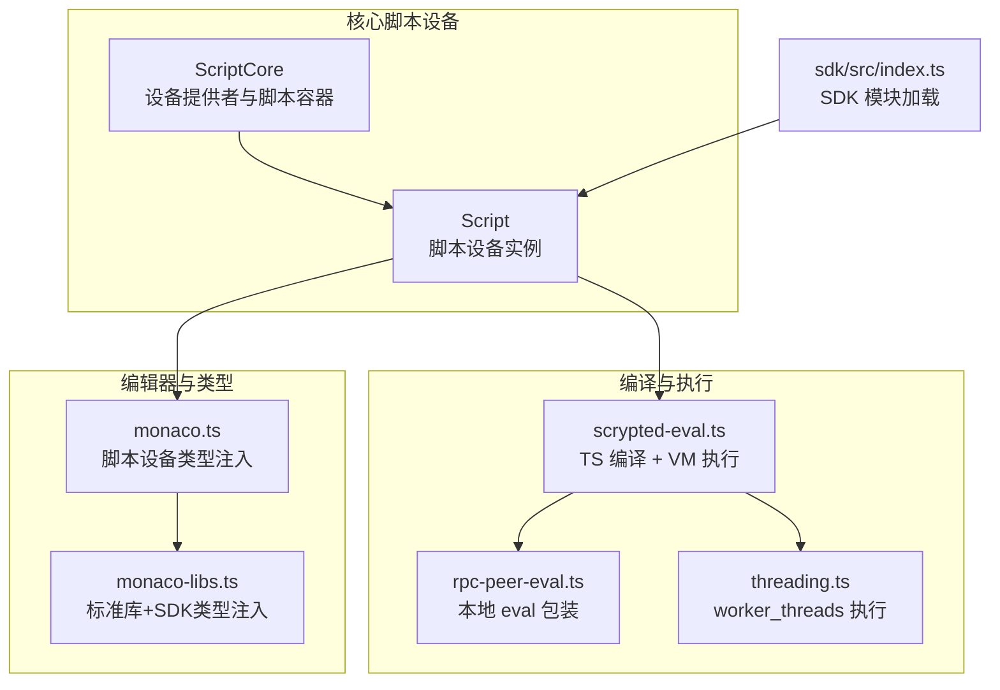
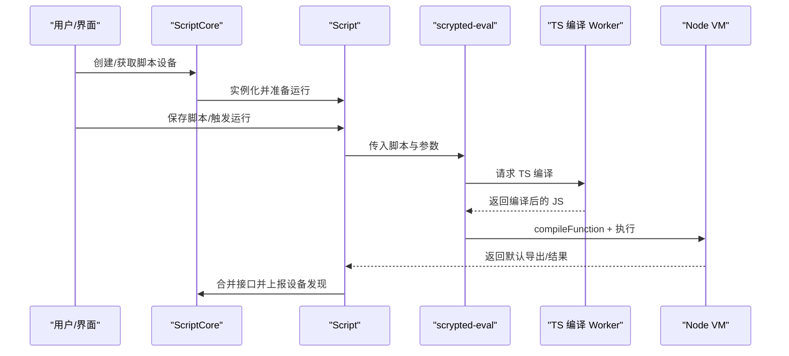
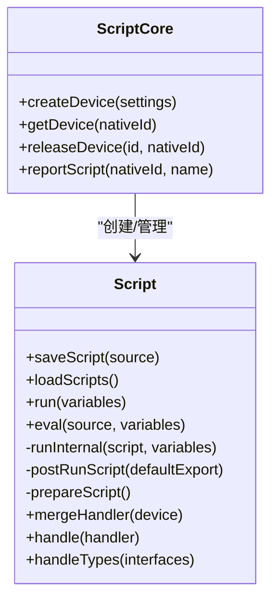
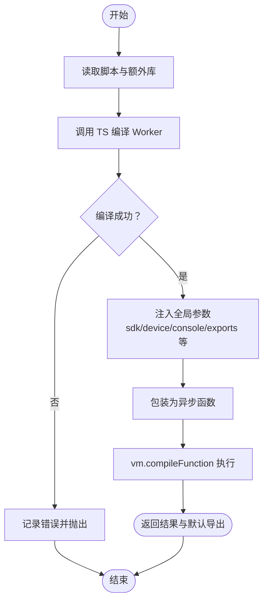
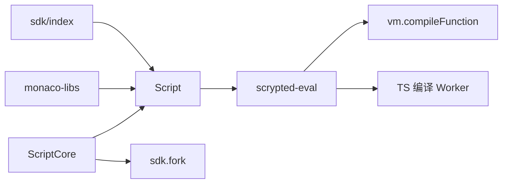

# 脚本执行系统

<cite>
**本文引用的文件**
- [plugins/core/src/script.ts](file://plugins/core/src/script.ts)
- [plugins/core/src/script-core.ts](file://plugins/core/src/script-core.ts)
- [plugins/core/src/monaco.ts](file://plugins/core/src/monaco.ts)
- [common/src/eval/scrypted-eval.ts](file://common/src/eval/scrypted-eval.ts)
- [common/src/eval/monaco-libs.ts](file://common/src/eval/monaco-libs.ts)
- [server/src/rpc-peer-eval.ts](file://server/src/rpc-peer-eval.ts)
- [server/src/threading.ts](file://server/src/threading.ts)
- [sdk/src/index.ts](file://sdk/src/index.ts)
- [plugins/core/fs/examples/switch-trigger-webhook.ts](file://plugins/core/fs/examples/switch-trigger-webhook.ts)
- [plugins/core/fs/examples/webhook-motion-sensor.ts](file://plugins/core/fs/examples/webhook-motion-sensor.ts)
- [plugins/core/fs/examples/chromecast-view-camera.ts](file://plugins/core/fs/examples/chromecast-view-camera.ts)
- [plugins/core/fs/examples/webhook-thermometer.ts](file://plugins/core/fs/examples/webhook-thermometer.ts)
</cite>

## 目录
1. [引言](#引言)
2. [项目结构](#项目结构)
3. [核心组件](#核心组件)
4. [架构总览](#架构总览)
5. [详细组件分析](#详细组件分析)
6. [依赖关系分析](#依赖关系分析)
7. [性能考量](#性能考量)
8. [故障排查指南](#故障排查指南)
9. [结论](#结论)
10. [附录：脚本示例与最佳实践](#附录脚本示例与最佳实践)

## 引言
本文件面向 Scrypted 的“脚本执行系统”，系统性阐述 JavaScript/TypeScript 脚本在 Scrypted 中的运行环境设计、沙箱隔离、安全限制、资源管理、生命周期（编译、加载、执行、销毁）、内置函数库与 API、安全机制（权限、内存、超时）、最佳实践以及与设备系统的交互方式。文档同时提供可直接参考的示例路径，帮助开发者快速上手并编写高质量脚本。

## 项目结构
脚本执行系统主要由以下模块构成：
- 核心脚本设备与生命周期管理：位于插件 core 的 Script 与 ScriptCore 类
- 编译与运行时执行：位于公共模块 common 的 scrypted-eval.ts
- Monaco 编辑器类型提示与默认库注入：monaco-libs.ts 与 core 插件的 monaco.ts
- 运行时参数注入与 VM 执行：server 端的 rpc-peer-eval.ts 与 threading.ts
- SDK 模块加载与运行时桥接：sdk/src/index.ts

图表来源
- [plugins/core/src/script-core.ts:16-149](file://plugins/core/src/script-core.ts#L16-L149)
- [plugins/core/src/script.ts:9-117](file://plugins/core/src/script.ts#L9-L117)
- [common/src/eval/scrypted-eval.ts:41-114](file://common/src/eval/scrypted-eval.ts#L41-L114)
- [server/src/rpc-peer-eval.ts:22-31](file://server/src/rpc-peer-eval.ts#L22-L31)
- [server/src/threading.ts:49-99](file://server/src/threading.ts#L49-L99)
- [common/src/eval/monaco-libs.ts:22-97](file://common/src/eval/monaco-libs.ts#L22-L97)
- [plugins/core/src/monaco.ts:1-9](file://plugins/core/src/monaco.ts#L1-L9)
- [sdk/src/index.ts:214-256](file://sdk/src/index.ts#L214-L256)

章节来源
- [plugins/core/src/script-core.ts:16-149](file://plugins/core/src/script-core.ts#L16-L149)
- [plugins/core/src/script.ts:9-117](file://plugins/core/src/script.ts#L9-L117)
- [common/src/eval/scrypted-eval.ts:41-114](file://common/src/eval/scrypted-eval.ts#L41-L114)
- [server/src/rpc-peer-eval.ts:22-31](file://server/src/rpc-peer-eval.ts#L22-L31)
- [server/src/threading.ts:49-99](file://server/src/threading.ts#L49-L99)
- [common/src/eval/monaco-libs.ts:22-97](file://common/src/eval/monaco-libs.ts#L22-L97)
- [plugins/core/src/monaco.ts:1-9](file://plugins/core/src/monaco.ts#L1-L9)
- [sdk/src/index.ts:214-256](file://sdk/src/index.ts#L214-L256)

## 核心组件
- Script：脚本设备类，负责保存/加载脚本、运行脚本、后置处理（合并接口、上报设备发现）以及对外暴露 eval/run 接口。
- ScriptCore：脚本提供者，负责创建/获取脚本设备、fork 子进程隔离运行、设备发现上报、生命周期管理。
- scrypted-eval：核心执行引擎，负责 TypeScript 编译（通过 worker）、VM 执行、参数注入（sdk、device、console、localStorage 等）。
- Monaco 类型注入：为编辑器提供全局类型声明与额外库，提升开发体验。
- 运行时包装：rpc-peer-eval 提供本地 eval 包装；threading 使用 worker_threads 执行复杂表达式或隔离计算。

章节来源
- [plugins/core/src/script.ts:9-117](file://plugins/core/src/script.ts#L9-L117)
- [plugins/core/src/script-core.ts:16-149](file://plugins/core/src/script-core.ts#L16-L149)
- [common/src/eval/scrypted-eval.ts:41-114](file://common/src/eval/scrypted-eval.ts#L41-L114)
- [common/src/eval/monaco-libs.ts:22-97](file://common/src/eval/monaco-libs.ts#L22-L97)
- [server/src/rpc-peer-eval.ts:22-31](file://server/src/rpc-peer-eval.ts#L22-L31)
- [server/src/threading.ts:49-99](file://server/src/threading.ts#L49-L99)

## 架构总览
脚本从“保存/加载”到“编译执行”的整体流程如下：

图表来源
- [plugins/core/src/script-core.ts:43-82](file://plugins/core/src/script-core.ts#L43-L82)
- [plugins/core/src/script.ts:78-104](file://plugins/core/src/script.ts#L78-L104)
- [common/src/eval/scrypted-eval.ts:41-114](file://common/src/eval/scrypted-eval.ts#L41-L114)

## 详细组件分析

### 组件一：脚本设备与生命周期（Script）
- 职责
  - 保存脚本源码至存储
  - 加载脚本并返回给编辑器
  - 运行脚本并处理默认导出（支持类/函数/实例）
  - 合并脚本处理器到设备，动态上报设备发现
- 关键点
  - runInternal 会构造参数对象（含 device、sdk、console、localStorage 等），交由 scrypted-eval 执行
  - postRunScript 处理默认导出，调用 handle 合并接口
  - prepareScript 基于 createScriptDevice 注入接口能力

图表来源
- [plugins/core/src/script.ts:9-117](file://plugins/core/src/script.ts#L9-L117)
- [plugins/core/src/script-core.ts:16-149](file://plugins/core/src/script-core.ts#L16-L149)

章节来源
- [plugins/core/src/script.ts:9-117](file://plugins/core/src/script.ts#L9-L117)
- [plugins/core/src/script-core.ts:16-149](file://plugins/core/src/script-core.ts#L16-L149)

### 组件二：脚本核心容器（ScriptCore）
- 职责
  - 设备创建与模板初始化
  - 脚本设备的 fork 隔离运行
  - 设备发现上报与刷新
  - 生命周期回收（worker 终止）
- 关键点
  - 使用 sdk.fork 创建子进程，避免主进程阻塞
  - 当脚本导出的接口数量超过基础接口时，进入 fork 模式
  - 退出回调中触发设备刷新，保证 UI 与状态一致性

章节来源
- [plugins/core/src/script-core.ts:16-149](file://plugins/core/src/script-core.ts#L16-L149)

### 组件三：编译与执行引擎（scrypted-eval）
- 职责
  - 将 TypeScript 源码编译为 JavaScript（通过独立 worker）
  - 使用 vm.compileFunction 在受限上下文中执行
  - 注入全局参数（sdk、device、console、localStorage、exports 等）
- 安全与隔离
  - 使用 vm.compileFunction 限制作用域
  - 通过 __non_webpack_require__ 注入模块解析
  - 编译阶段在 worker 内完成，减少对主线程影响

图表来源
- [common/src/eval/scrypted-eval.ts:41-114](file://common/src/eval/scrypted-eval.ts#L41-L114)

章节来源
- [common/src/eval/scrypted-eval.ts:41-114](file://common/src/eval/scrypted-eval.ts#L41-L114)

### 组件四：Monaco 类型注入与编辑器体验（monaco-libs 与 monaco）
- 职责
  - 注入 Node 标准库与 Scrypted SDK 类型
  - 为脚本设备提供全局声明（log、deviceManager、endpointManager、mediaManager、systemManager、eventSource、eventDetails、eventData 等）
  - 通过额外库扩展脚本可用的类型与 API
- 影响
  - 提升开发效率与准确性，减少运行期错误

章节来源
- [common/src/eval/monaco-libs.ts:22-97](file://common/src/eval/monaco-libs.ts#L22-L97)
- [plugins/core/src/monaco.ts:1-9](file://plugins/core/src/monaco.ts#L1-L9)

### 组件五：运行时包装与线程执行（rpc-peer-eval 与 threading）
- rpc-peer-eval
  - 通过全局注入 compileFunctionShim，规避闭包捕获大代码块导致的源映射错位问题
  - 支持在本地以 peer 参数为上下文执行脚本
- threading
  - 使用 worker_threads 执行复杂表达式
  - 通过序列化/反序列化消息传递参数与结果
  - 执行完成后终止 worker，释放资源

章节来源
- [server/src/rpc-peer-eval.ts:1-31](file://server/src/rpc-peer-eval.ts#L1-L31)
- [server/src/threading.ts:49-99](file://server/src/threading.ts#L49-L99)

## 依赖关系分析
- Script 依赖 scrypted-eval 进行编译与执行
- ScriptCore 通过 sdk.fork 与 Script 协作，实现隔离运行
- Monaco 类型注入为脚本开发提供强类型支持
- SDK 模块加载在运行时桥接不同模块格式（ES/CJS）

图表来源
- [plugins/core/src/script.ts:9-117](file://plugins/core/src/script.ts#L9-L117)
- [plugins/core/src/script-core.ts:16-149](file://plugins/core/src/script-core.ts#L16-L149)
- [common/src/eval/scrypted-eval.ts:41-114](file://common/src/eval/scrypted-eval.ts#L41-L114)
- [common/src/eval/monaco-libs.ts:22-97](file://common/src/eval/monaco-libs.ts#L22-L97)
- [sdk/src/index.ts:214-256](file://sdk/src/index.ts#L214-L256)

章节来源
- [plugins/core/src/script.ts:9-117](file://plugins/core/src/script.ts#L9-L117)
- [plugins/core/src/script-core.ts:16-149](file://plugins/core/src/script-core.ts#L16-L149)
- [common/src/eval/scrypted-eval.ts:41-114](file://common/src/eval/scrypted-eval.ts#L41-L114)
- [common/src/eval/monaco-libs.ts:22-97](file://common/src/eval/monaco-libs.ts#L22-L97)
- [sdk/src/index.ts:214-256](file://sdk/src/index.ts#L214-L256)

## 性能考量
- 编译隔离：TypeScript 编译在独立 worker 中进行，避免阻塞主线程
- VM 执行：使用 vm.compileFunction 限制作用域，降低全局污染风险
- 线程执行：复杂表达式通过 worker_threads 执行并在完成后终止，释放资源
- 资源回收：ScriptCore 在设备释放或 worker 退出时清理资源，确保系统稳定
- 类型注入：仅在编辑器侧生效，不影响运行时性能

章节来源
- [common/src/eval/scrypted-eval.ts:41-114](file://common/src/eval/scrypted-eval.ts#L41-L114)
- [server/src/threading.ts:49-99](file://server/src/threading.ts#L49-L99)
- [plugins/core/src/script-core.ts:144-149](file://plugins/core/src/script-core.ts#L144-L149)

## 故障排查指南
- 编译失败
  - 现象：日志显示“编译 TypeScript 错误”
  - 排查：检查脚本语法与类型；确认额外库是否正确注入
  - 参考：[common/src/eval/scrypted-eval.ts:55-59](file://common/src/eval/scrypted-eval.ts#L55-L59)
- 执行异常
  - 现象：日志显示“执行脚本错误”
  - 排查：查看 console 输出；确认 exports/default 导出是否正确；检查参数注入
  - 参考：[common/src/eval/scrypted-eval.ts:95-113](file://common/src/eval/scrypted-eval.ts#L95-L113)
- 设备未发现
  - 现象：脚本导出接口后设备未出现在系统中
  - 排查：确认 mergeHandler 是否被调用；检查 postRunScript 流程
  - 参考：[plugins/core/src/script.ts:47-69](file://plugins/core/src/script.ts#L47-L69)
- 资源泄漏
  - 现象：worker 未退出或设备刷新异常
  - 排查：确认 ScriptCore 的 releaseDevice 与 worker 退出回调
  - 参考：[plugins/core/src/script-core.ts:144-149](file://plugins/core/src/script-core.ts#L144-L149)

章节来源
- [common/src/eval/scrypted-eval.ts:55-59](file://common/src/eval/scrypted-eval.ts#L55-L59)
- [common/src/eval/scrypted-eval.ts:95-113](file://common/src/eval/scrypted-eval.ts#L95-L113)
- [plugins/core/src/script.ts:47-69](file://plugins/core/src/script.ts#L47-L69)
- [plugins/core/src/script-core.ts:144-149](file://plugins/core/src/script-core.ts#L144-L149)

## 结论
Scrypted 的脚本执行系统通过“隔离编译 + VM 执行 + 动态接口合并 + 设备发现上报”的设计，在保证安全性的同时提供了强大的扩展能力。借助 Monaco 类型注入与 SDK 模块加载，开发者可以高效地编写设备控制、事件处理与系统集成脚本，并通过 fork 与 worker_threads 实现资源与性能的可控管理。

## 附录：脚本示例与最佳实践

### 示例清单与用途
- 开关触发 Webhook 示例
  - 场景：开关切换时发起网络请求并记录外部 IP
  - 示例路径：[plugins/core/fs/examples/switch-trigger-webhook.ts:1-21](file://plugins/core/fs/examples/switch-trigger-webhook.ts#L1-L21)
- Motion Sensor Webhook 示例
  - 场景：HTTP 请求触发运动传感器状态变化，随后自动复位
  - 示例路径：[plugins/core/fs/examples/webhook-motion-sensor.ts:1-24](file://plugins/core/fs/examples/webhook-motion-sensor.ts#L1-L24)
- Chromecast 视频播放示例
  - 场景：启动/停止将摄像头视频流加载到 Chromecast
  - 示例路径：[plugins/core/fs/examples/chromecast-view-camera.ts:1-37](file://plugins/core/fs/examples/chromecast-view-camera.ts#L1-L37)
- 温度计 Webhook 示例
  - 场景：HTTP 请求携带温度值，写入设备属性
  - 示例路径：[plugins/core/fs/examples/webhook-thermometer.ts:1-26](file://plugins/core/fs/examples/webhook-thermometer.ts#L1-L26)

### 最佳实践
- 代码组织
  - 使用默认导出类/函数/实例，便于 Script.postRunScript 自动处理
  - 明确接口声明（如 HttpRequestHandler、MotionSensor、MediaPlayer 等），减少运行期错误
- 错误处理
  - 使用 console 记录关键信息；在 try/catch 中包裹易错逻辑
  - 对外暴露的接口应具备健壮的输入校验
- 性能优化
  - 避免长时间阻塞操作；必要时使用 worker_threads 或定时器拆分任务
  - 合理使用缓存（localStorage）与状态复位（如 setTimeout 清除）
- 安全建议
  - 不要直接暴露敏感系统调用；通过 SDK 提供的受控接口访问设备与系统
  - 谨慎使用 require 与动态导入，避免引入不受信任模块