# 自动化引擎

<cite>
**本文引用的文件**
- [plugins/core/src/automation.ts](file://plugins/core/src/automation.ts)
- [plugins/core/src/automations-core.ts](file://plugins/core/src/automations-core.ts)
- [plugins/core/src/builtins/scheduler.ts](file://plugins/core/src/builtins/scheduler.ts)
- [plugins/core/src/builtins/listen.ts](file://plugins/core/src/builtins/listen.ts)
- [plugins/core/src/builtins/javascript.ts](file://plugins/core/src/builtins/javascript.ts)
- [plugins/core/src/builtins/shellscript.ts](file://plugins/core/src/builtins/shellscript.ts)
- [plugins/core/src/script.ts](file://plugins/core/src/script.ts)
- [plugins/core/src/script-core.ts](file://plugins/core/src/script-core.ts)
- [common/src/eval/scrypted-eval.ts](file://common/src/eval/scrypted-eval.ts)
- [plugins/mqtt/src/main.ts](file://plugins/mqtt/src/main.ts)
- [plugins/webhook/src/main.ts](file://plugins/webhook/src/main.ts)
</cite>

## 目录
1. [简介](#简介)
2. [项目结构](#项目结构)
3. [核心组件](#核心组件)
4. [架构总览](#架构总览)
5. [详细组件分析](#详细组件分析)
6. [依赖关系分析](#依赖关系分析)
7. [性能考量](#性能考量)
8. [故障排查指南](#故障排查指南)
9. [结论](#结论)
10. [附录：自动化示例与最佳实践](#附录自动化示例与最佳实践)

## 简介
本文件系统性阐述 Scrypted 自动化引擎的设计与实现，覆盖规则引擎、事件驱动机制、脚本执行环境、时间调度、事件处理链路、与外部系统（Webhook、MQTT）的集成方式，并提供性能优化、错误处理与调试建议。

## 项目结构
自动化能力主要由核心插件提供，围绕“自动化设备”“脚本设备”“内置监听器/调度器”“脚本执行沙箱”等模块协作完成。MQTT 与 Webhook 插件作为外部集成入口，将外部事件/命令注入到 Scrypted 事件总线，从而触发自动化。

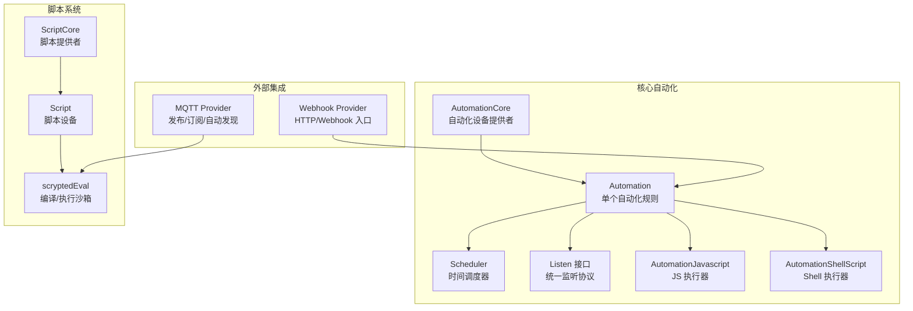

图示来源
- [plugins/core/src/automations-core.ts:9-82](file://plugins/core/src/automations-core.ts#L9-L82)
- [plugins/core/src/automation.ts:30-596](file://plugins/core/src/automation.ts#L30-L596)
- [plugins/core/src/builtins/scheduler.ts:16-100](file://plugins/core/src/builtins/scheduler.ts#L16-L100)
- [plugins/core/src/builtins/javascript.ts:5-24](file://plugins/core/src/builtins/javascript.ts#L5-L24)
- [plugins/core/src/builtins/shellscript.ts:5-29](file://plugins/core/src/builtins/shellscript.ts#L5-L29)
- [plugins/core/src/script-core.ts:16-149](file://plugins/core/src/script-core.ts#L16-L149)
- [plugins/core/src/script.ts:9-116](file://plugins/core/src/script.ts#L9-L116)
- [common/src/eval/scrypted-eval.ts:41-114](file://common/src/eval/scrypted-eval.ts#L41-L114)
- [plugins/mqtt/src/main.ts:349-619](file://plugins/mqtt/src/main.ts#L349-L619)
- [plugins/webhook/src/main.ts:95-252](file://plugins/webhook/src/main.ts#L95-L252)

章节来源
- [plugins/core/src/automation.ts:1-597](file://plugins/core/src/automation.ts#L1-L597)
- [plugins/core/src/automations-core.ts:1-83](file://plugins/core/src/automations-core.ts#L1-L83)
- [plugins/core/src/script.ts:1-117](file://plugins/core/src/script.ts#L1-L117)
- [plugins/core/src/script-core.ts:1-156](file://plugins/core/src/script-core.ts#L1-L156)
- [common/src/eval/scrypted-eval.ts:1-173](file://common/src/eval/scrypted-eval.ts#L1-L173)
- [plugins/core/src/builtins/scheduler.ts:1-101](file://plugins/core/src/builtins/scheduler.ts#L1-L101)
- [plugins/core/src/builtins/javascript.ts:1-25](file://plugins/core/src/builtins/javascript.ts#L1-L25)
- [plugins/core/src/builtins/shellscript.ts:1-30](file://plugins/core/src/builtins/shellscript.ts#L1-L30)
- [plugins/mqtt/src/main.ts:1-629](file://plugins/mqtt/src/main.ts#L1-L629)
- [plugins/webhook/src/main.ts:1-253](file://plugins/webhook/src/main.ts#L1-L253)

## 核心组件
- 自动化设备（Automation）：封装触发器、动作、运行控制与事件绑定，负责在事件发生时按顺序执行动作。
- 自动化核心（AutomationCore）：自动化设备的提供者与生命周期管理，支持动态创建与上报。
- 时间调度器（Scheduler）：基于小时/分钟/星期几生成未来触发时间，模拟设备事件供统一监听。
- 监听接口（Listen）：统一的事件监听协议，兼容设备事件与自定义调度事件。
- JS 执行器（AutomationJavascript）：将事件上下文注入到 TypeScript/JavaScript 执行环境中。
- Shell 执行器（AutomationShellScript）：通过子进程执行 Shell 脚本，传递事件数据。
- 脚本设备（Script/ScriptCore）：可运行独立脚本，支持模板、多语言、默认导出设备/插件实例。
- 脚本执行沙箱（scryptedEval）：类型编译、参数注入、VM 执行、默认导出处理。

章节来源
- [plugins/core/src/automation.ts:30-596](file://plugins/core/src/automation.ts#L30-L596)
- [plugins/core/src/automations-core.ts:9-82](file://plugins/core/src/automations-core.ts#L9-L82)
- [plugins/core/src/builtins/scheduler.ts:16-100](file://plugins/core/src/builtins/scheduler.ts#L16-L100)
- [plugins/core/src/builtins/listen.ts:3-5](file://plugins/core/src/builtins/listen.ts#L3-L5)
- [plugins/core/src/builtins/javascript.ts:5-24](file://plugins/core/src/builtins/javascript.ts#L5-L24)
- [plugins/core/src/builtins/shellscript.ts:5-29](file://plugins/core/src/builtins/shellscript.ts#L5-L29)
- [plugins/core/src/script.ts:9-116](file://plugins/core/src/script.ts#L9-L116)
- [plugins/core/src/script-core.ts:16-149](file://plugins/core/src/script-core.ts#L16-L149)
- [common/src/eval/scrypted-eval.ts:41-114](file://common/src/eval/scrypted-eval.ts#L41-L114)

## 架构总览
自动化引擎采用“事件驱动 + 规则编排”的模式：
- 触发器可以是设备事件或时间调度事件；
- 条件表达式对事件进行二次过滤；
- 动作串行执行，支持 JS 脚本、Shell 脚本、等待、更新插件、设备动作；
- 外部系统（MQTT/Webhook）通过 HTTP/MQTT 注入事件，进入统一事件通道；
- 脚本系统提供独立的可执行单元，支持模板与默认导出设备。

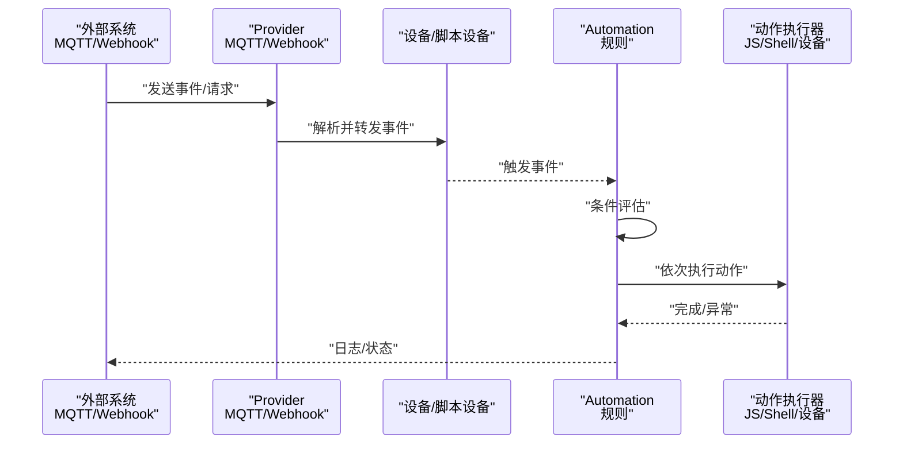

图示来源
- [plugins/mqtt/src/main.ts:349-619](file://plugins/mqtt/src/main.ts#L349-L619)
- [plugins/webhook/src/main.ts:95-252](file://plugins/webhook/src/main.ts#L95-L252)
- [plugins/core/src/automation.ts:544-590](file://plugins/core/src/automation.ts#L544-L590)
- [plugins/core/src/builtins/javascript.ts:17-23](file://plugins/core/src/builtins/javascript.ts#L17-L23)
- [plugins/core/src/builtins/shellscript.ts:17-28](file://plugins/core/src/builtins/shellscript.ts#L17-L28)

## 详细组件分析

### 自动化规则（Automation）
- 数据模型：触发器数组、动作数组、运行参数（去噪、运行至完成、静态事件重置）。
- 绑定流程：根据开关状态与配置重建监听注册；支持设备事件与调度事件两类触发器。
- 条件过滤：可选的 JavaScript 表达式，基于事件源、事件详情、事件数据进行判定。
- 动作执行：串行执行，支持 JS 脚本、Shell 脚本、等待、更新插件、设备动作；支持中断与并发控制。
- 运行控制：runToCompletion 防止重复触发；staticEvents 控制是否对所有事件重置计时器；denoiseEvents 抑制连续相同事件。

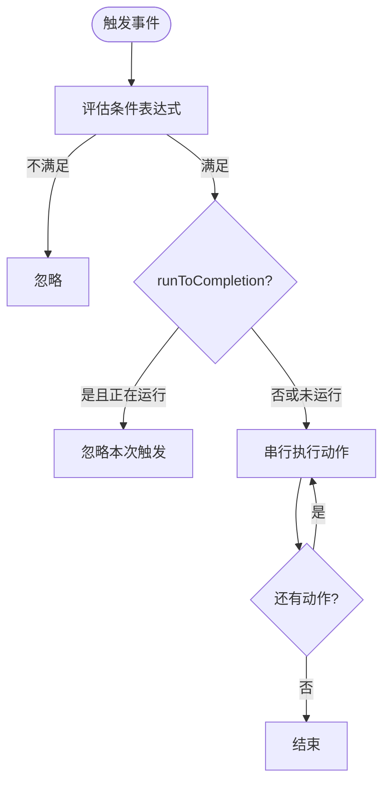

图示来源
- [plugins/core/src/automation.ts:482-542](file://plugins/core/src/automation.ts#L482-L542)
- [plugins/core/src/automation.ts:574-586](file://plugins/core/src/automation.ts#L574-L586)

章节来源
- [plugins/core/src/automation.ts:15-596](file://plugins/core/src/automation.ts#L15-L596)

### 自动化核心（AutomationCore）
- 设备提供者：动态发现与上报自动化设备，支持创建新自动化。
- 内置自动化：自动创建“自动更新插件”自动化，确保系统维护。

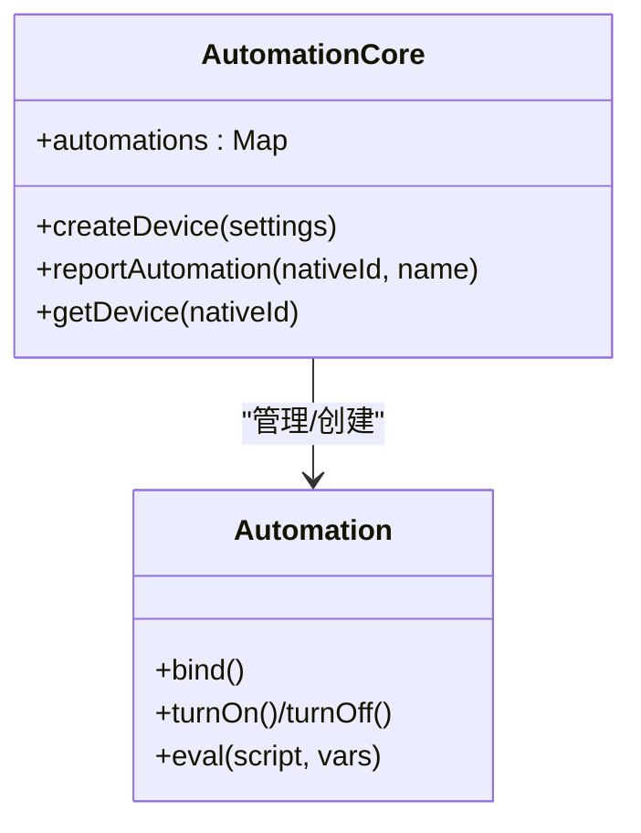

图示来源
- [plugins/core/src/automations-core.ts:9-82](file://plugins/core/src/automations-core.ts#L9-L82)
- [plugins/core/src/automation.ts:30-130](file://plugins/core/src/automation.ts#L30-L130)

章节来源
- [plugins/core/src/automations-core.ts:1-83](file://plugins/core/src/automations-core.ts#L1-L83)

### 时间调度（Scheduler）
- 周期性触发：按小时/分钟/星期几计算下一次触发时间，返回一个“虚拟设备”，其 listen 返回未来时刻的事件。
- 定时器管理：内部维护超时句柄，回调时携带事件时间与事件标识。

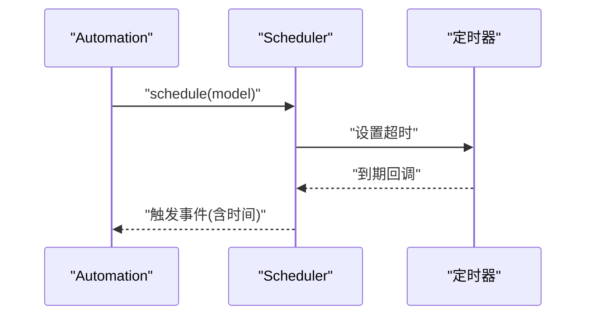

图示来源
- [plugins/core/src/builtins/scheduler.ts:16-100](file://plugins/core/src/builtins/scheduler.ts#L16-L100)
- [plugins/core/src/automation.ts:557-566](file://plugins/core/src/automation.ts#L557-L566)

章节来源
- [plugins/core/src/builtins/scheduler.ts:1-101](file://plugins/core/src/builtins/scheduler.ts#L1-L101)

### 事件监听协议（Listen）
- 统一接口：listen 接收事件选项（事件接口、去噪、事件类型），返回移除监听的句柄。
- 与自动化结合：设备事件与调度事件均通过该接口接入。

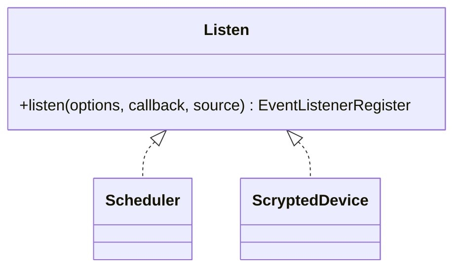

图示来源
- [plugins/core/src/builtins/listen.ts:3-5](file://plugins/core/src/builtins/listen.ts#L3-L5)
- [plugins/core/src/builtins/scheduler.ts:34-96](file://plugins/core/src/builtins/scheduler.ts#L34-L96)

章节来源
- [plugins/core/src/builtins/listen.ts:1-6](file://plugins/core/src/builtins/listen.ts#L1-L6)

### 脚本执行系统（JS/Shell）
- JS 脚本：通过 AutomationJavascript 将事件上下文注入，交由 scryptedEval 编译与执行。
- Shell 脚本：通过 AutomationShellScript 启动 sh 子进程，将事件数据写入 stdin，标准输出/错误转发到自动化控制台。

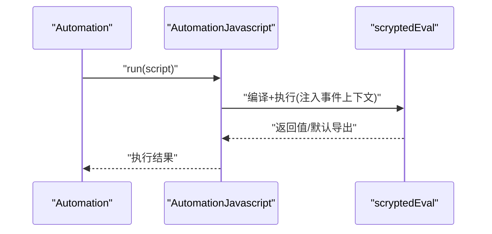

图示来源
- [plugins/core/src/builtins/javascript.ts:17-23](file://plugins/core/src/builtins/javascript.ts#L17-L23)
- [common/src/eval/scrypted-eval.ts:41-114](file://common/src/eval/scrypted-eval.ts#L41-L114)
- [plugins/core/src/automation.ts:509-512](file://plugins/core/src/automation.ts#L509-L512)

章节来源
- [plugins/core/src/builtins/javascript.ts:1-25](file://plugins/core/src/builtins/javascript.ts#L1-L25)
- [plugins/core/src/builtins/shellscript.ts:1-30](file://plugins/core/src/builtins/shellscript.ts#L1-L30)
- [common/src/eval/scrypted-eval.ts:1-173](file://common/src/eval/scrypted-eval.ts#L1-L173)

### 脚本设备与脚本核心（Script/ScriptCore）
- Script：保存/加载脚本，运行后可合并处理器接口并上报设备。
- ScriptCore：提供脚本设备的创建、模板选择、工作线程隔离与刷新策略。

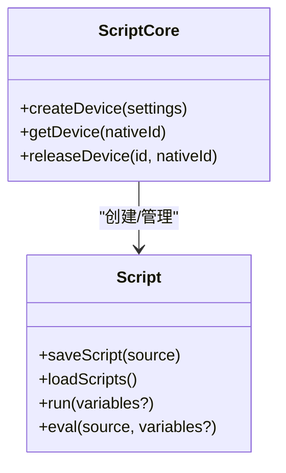

图示来源
- [plugins/core/src/script-core.ts:16-149](file://plugins/core/src/script-core.ts#L16-L149)
- [plugins/core/src/script.ts:9-116](file://plugins/core/src/script.ts#L9-L116)

章节来源
- [plugins/core/src/script.ts:1-117](file://plugins/core/src/script.ts#L1-L117)
- [plugins/core/src/script-core.ts:1-156](file://plugins/core/src/script-core.ts#L1-L156)

### 外部集成：MQTT
- 设备脚本：MQTT 设备可保存/加载脚本，订阅主题并在消息到达时执行脚本。
- 发布/订阅：支持连接外部或内置 Broker，自动发现 Home Assistant，发布设备属性与方法调用。
- 混入发布器：为任意设备添加 MQTT 发布/订阅能力，自动发布状态变更与接收命令。

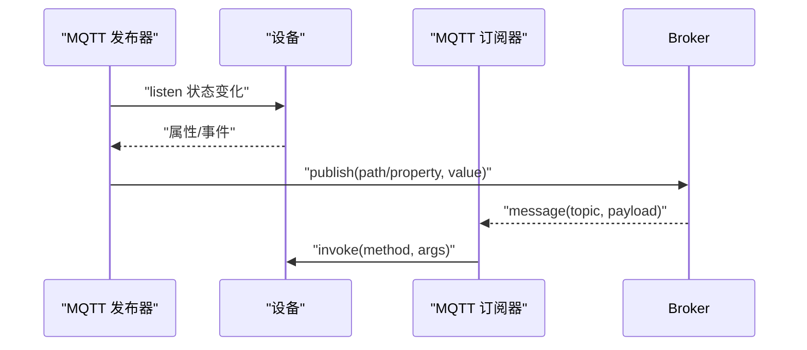

图示来源
- [plugins/mqtt/src/main.ts:160-347](file://plugins/mqtt/src/main.ts#L160-L347)
- [plugins/mqtt/src/main.ts:349-619](file://plugins/mqtt/src/main.ts#L349-L619)

章节来源
- [plugins/mqtt/src/main.ts:1-629](file://plugins/mqtt/src/main.ts#L1-L629)

### 外部集成：Webhook
- 混入式 Webhook：为设备启用 Webhook，生成带令牌的本地访问地址，支持 GET（属性）与 POST（方法）。
- 参数传递：方法调用可通过查询参数 parameters 传入 JSON 数组。
- 媒体对象：对特定方法自动转换媒体对象为图片响应。

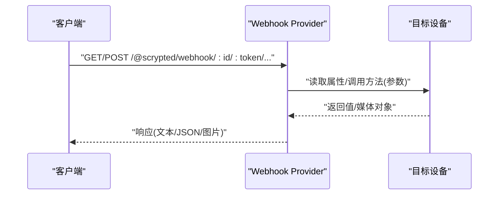

图示来源
- [plugins/webhook/src/main.ts:95-252](file://plugins/webhook/src/main.ts#L95-L252)

章节来源
- [plugins/webhook/src/main.ts:1-253](file://plugins/webhook/src/main.ts#L1-L253)

## 依赖关系分析
- Automation 依赖：
  - Scheduler（调度事件）
  - Listen（统一监听）
  - AutomationJavascript/ShellScript（动作执行器）
  - scryptedEval（脚本编译与执行）
- Script/ScriptCore 依赖：
  - scryptedEval（脚本编译与执行）
  - worker_threads（可选的隔离执行）
- MQTT/Webhook 作为外部事件源，通过系统设备管理器注入事件，被 Automation 统一消费。

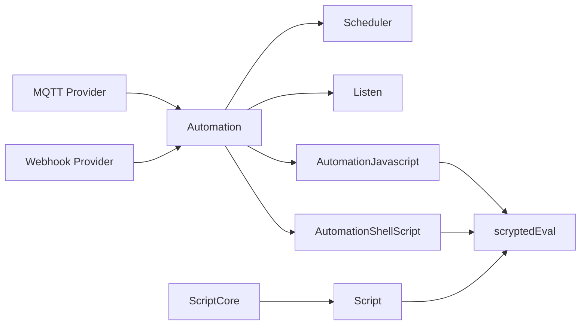

图示来源
- [plugins/core/src/automation.ts:544-590](file://plugins/core/src/automation.ts#L544-L590)
- [plugins/core/src/builtins/javascript.ts:17-23](file://plugins/core/src/builtins/javascript.ts#L17-L23)
- [plugins/core/src/builtins/shellscript.ts:17-28](file://plugins/core/src/builtins/shellscript.ts#L17-L28)
- [common/src/eval/scrypted-eval.ts:41-114](file://common/src/eval/scrypted-eval.ts#L41-L114)
- [plugins/core/src/script.ts:78-95](file://plugins/core/src/script.ts#L78-L95)
- [plugins/core/src/script-core.ts:113-124](file://plugins/core/src/script-core.ts#L113-L124)
- [plugins/mqtt/src/main.ts:349-619](file://plugins/mqtt/src/main.ts#L349-L619)
- [plugins/webhook/src/main.ts:95-252](file://plugins/webhook/src/main.ts#L95-L252)

章节来源
- [plugins/core/src/automation.ts:1-597](file://plugins/core/src/automation.ts#L1-L597)
- [common/src/eval/scrypted-eval.ts:1-173](file://common/src/eval/scrypted-eval.ts#L1-L173)
- [plugins/core/src/script.ts:1-117](file://plugins/core/src/script.ts#L1-L117)
- [plugins/core/src/script-core.ts:1-156](file://plugins/core/src/script-core.ts#L1-L156)
- [plugins/mqtt/src/main.ts:1-629](file://plugins/mqtt/src/main.ts#L1-L629)
- [plugins/webhook/src/main.ts:1-253](file://plugins/webhook/src/main.ts#L1-L253)

## 性能考量
- 去噪与重置策略
  - denoiseEvents：抑制连续相同事件，降低重复触发成本。
  - staticEvents：对所有事件重置计时器，避免频繁触发。
- 并发与中断
  - runToCompletion：防止自动化在执行中被再次触发，减少竞态。
  - pending 管理：同一触发键仅保留一个执行实例，必要时可中止旧实例。
- 调度效率
  - Scheduler 使用最小延迟计算下一次触发时间，避免高频轮询。
- 脚本执行
  - scryptedEval 在工作线程中编译 TS，主 VM 中执行，降低阻塞风险。
  - 脚本设备支持默认导出设备/插件，减少重复初始化开销。

章节来源
- [plugins/core/src/automation.ts:35-56](file://plugins/core/src/automation.ts#L35-L56)
- [plugins/core/src/automation.ts:482-542](file://plugins/core/src/automation.ts#L482-L542)
- [plugins/core/src/builtins/scheduler.ts:34-77](file://plugins/core/src/builtins/scheduler.ts#L34-L77)
- [common/src/eval/scrypted-eval.ts:47-62](file://common/src/eval/scrypted-eval.ts#L47-L62)

## 故障排查指南
- 脚本编译/执行错误
  - 检查 TypeScript 编译与 VM 执行日志，定位语法/类型问题。
  - 参考：[common/src/eval/scrypted-eval.ts:56-59](file://common/src/eval/scrypted-eval.ts#L56-L59)、[common/src/eval/scrypted-eval.ts:95-99](file://common/src/eval/scrypted-eval.ts#L95-L99)、[common/src/eval/scrypted-eval.ts:109-113](file://common/src/eval/scrypted-eval.ts#L109-L113)
- 事件未触发
  - 确认 Automation 开关、触发器类型、条件表达式、去噪设置。
  - 参考：[plugins/core/src/automation.ts:130-134](file://plugins/core/src/automation.ts#L130-L134)、[plugins/core/src/automation.ts:574-583](file://plugins/core/src/automation.ts#L574-L583)
- 动作未执行
  - 检查动作类型与设备接口映射、设备是否存在、动作参数。
  - 参考：[plugins/core/src/automation.ts:524-534](file://plugins/core/src/automation.ts#L524-L534)
- MQTT/Webhook 无法连接/无响应
  - 校验 Broker 地址/凭据、端口、订阅主题、令牌。
  - 参考：[plugins/mqtt/src/main.ts:246-286](file://plugins/mqtt/src/main.ts#L246-L286)、[plugins/webhook/src/main.ts:119-124](file://plugins/webhook/src/main.ts#L119-L124)

章节来源
- [common/src/eval/scrypted-eval.ts:56-59](file://common/src/eval/scrypted-eval.ts#L56-L59)
- [common/src/eval/scrypted-eval.ts:95-99](file://common/src/eval/scrypted-eval.ts#L95-L99)
- [common/src/eval/scrypted-eval.ts:109-113](file://common/src/eval/scrypted-eval.ts#L109-L113)
- [plugins/core/src/automation.ts:130-134](file://plugins/core/src/automation.ts#L130-L134)
- [plugins/core/src/automation.ts:574-583](file://plugins/core/src/automation.ts#L574-L583)
- [plugins/core/src/automation.ts:524-534](file://plugins/core/src/automation.ts#L524-L534)
- [plugins/mqtt/src/main.ts:246-286](file://plugins/mqtt/src/main.ts#L246-L286)
- [plugins/webhook/src/main.ts:119-124](file://plugins/webhook/src/main.ts#L119-L124)

## 结论
Scrypted 的自动化引擎以事件驱动为核心，通过统一监听协议与规则编排实现灵活的触发与动作链路；借助脚本执行沙箱与外部集成（MQTT/Webhook），可无缝对接各类设备与平台，满足从简单到复杂的智能场景需求。通过合理的去噪、并发控制与调度策略，可在保证实时性的同时兼顾性能与稳定性。

## 附录：自动化示例与最佳实践
- 示例场景（思路型，非代码）
  - 早晨定时：在指定时间触发灯光渐亮与播放音乐。
  - 传感器联动：门磁打开触发录像并发送通知。
  - 周期维护：每周固定时间检查并更新插件。
  - 外部联动：MQTT 主题触发自动化执行脚本，或通过 Webhook 远程调用设备方法。
- 最佳实践
  - 使用条件表达式进行二次过滤，避免误触发。
  - 对频繁事件开启去噪，对关键事件关闭去噪。
  - 大量 IO 或长耗时操作放入脚本或 Shell，避免阻塞自动化主线程。
  - 使用 runToCompletion 保护关键流程，配合等待动作实现有序执行。
  - 利用脚本设备的默认导出能力，复用设备/插件逻辑。
- 调试技巧
  - 查看自动化控制台日志，关注触发键与执行状态。
  - 分步验证条件表达式与动作执行结果。
  - 对脚本使用最小化复现，逐步增加复杂度。
  - 对 MQTT/Webhook，先验证连通性与订阅/发布路径，再验证业务逻辑。