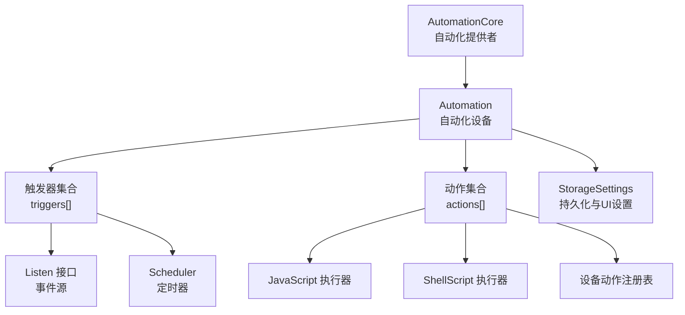
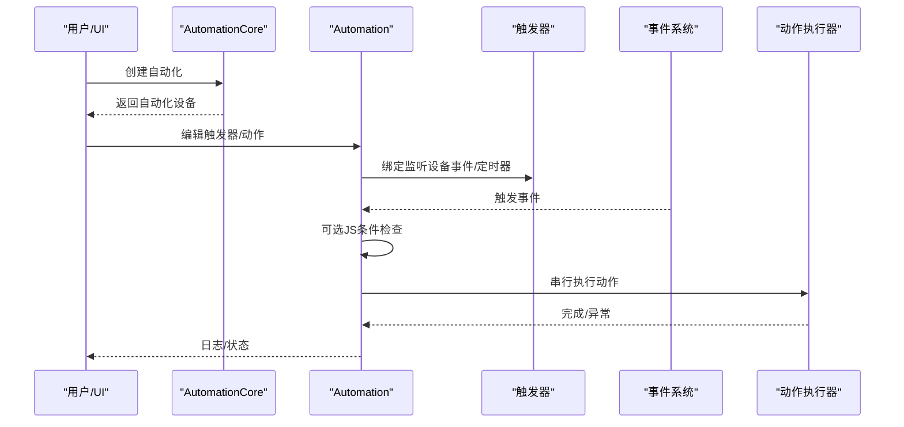
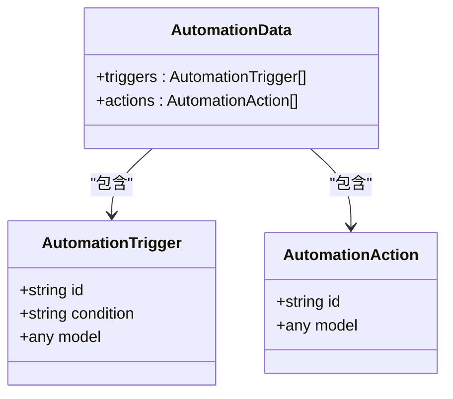
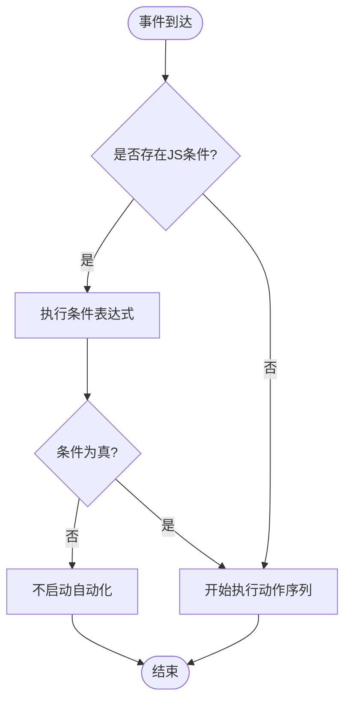
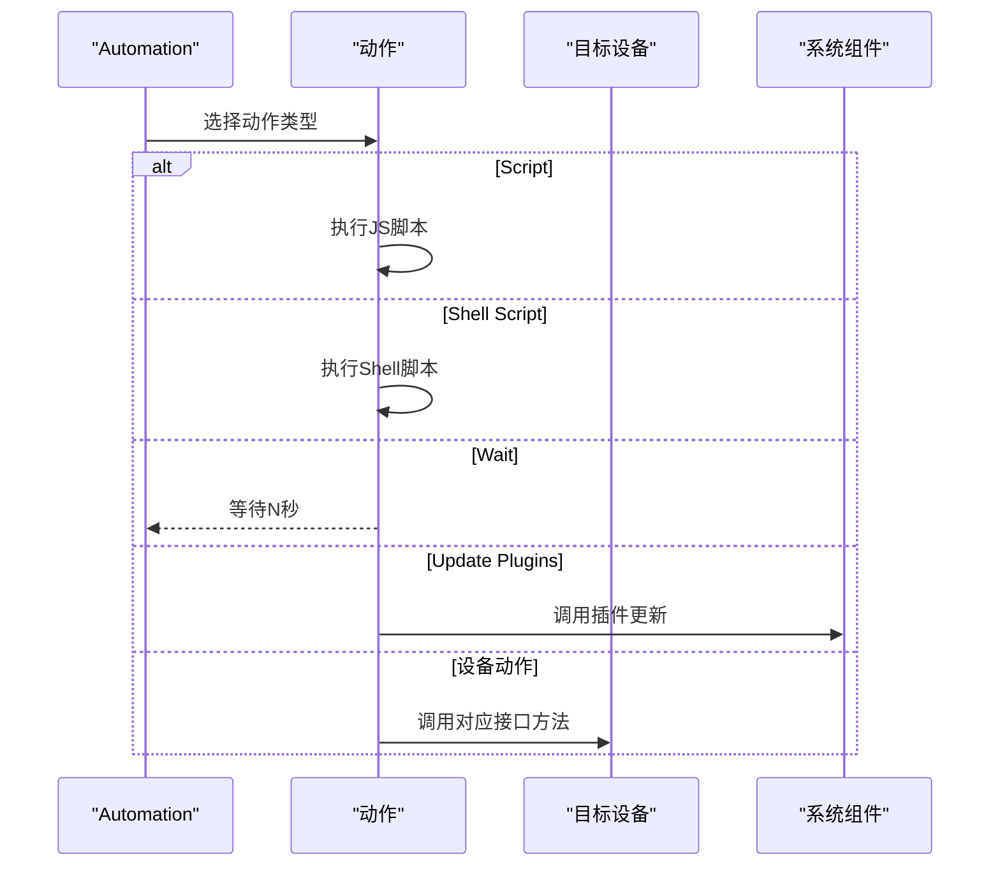
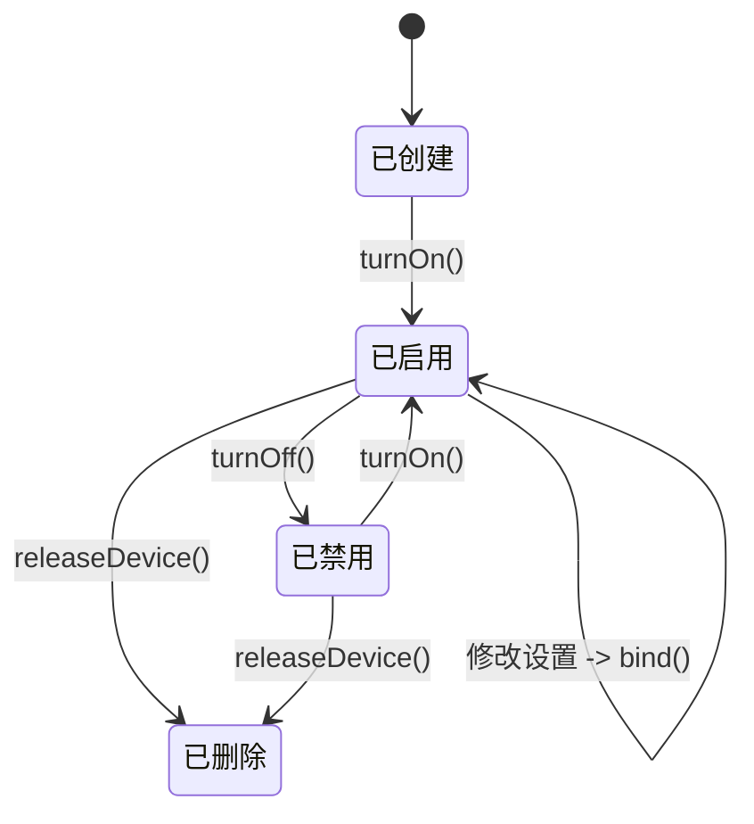
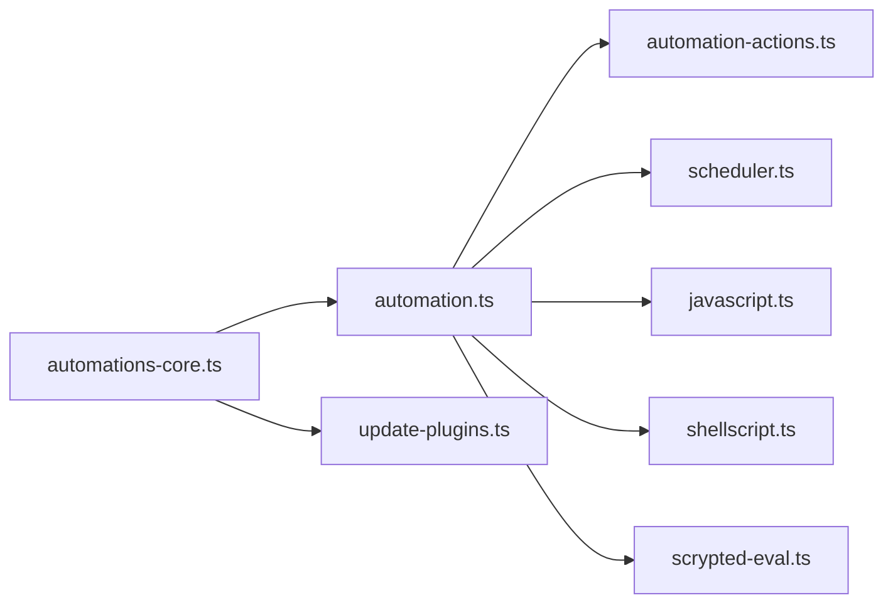

# 规则引擎

<cite>
**本文引用的文件**
- [plugins/core/src/automation.ts](file://plugins/core/src/automation.ts)
- [plugins/core/src/automations-core.ts](file://plugins/core/src/automations-core.ts)
- [plugins/core/src/automation-actions.ts](file://plugins/core/src/automation-actions.ts)
- [plugins/core/src/builtins/listen.ts](file://plugins/core/src/builtins/listen.ts)
- [plugins/core/src/builtins/scheduler.ts](file://plugins/core/src/builtins/scheduler.ts)
- [plugins/core/src/builtins/javascript.ts](file://plugins/core/src/builtins/javascript.ts)
- [plugins/core/src/builtins/shellscript.ts](file://plugins/core/src/builtins/shellscript.ts)
- [plugins/core/src/scrypted-eval.ts](file://plugins/core/src/scrypted-eval.ts)
- [plugins/core/src/update-plugins.ts](file://plugins/core/src/update-plugins.ts)
</cite>

## 目录
1. [简介](#简介)
2. [项目结构](#项目结构)
3. [核心组件](#核心组件)
4. [架构总览](#架构总览)
5. [详细组件分析](#详细组件分析)
6. [依赖关系分析](#依赖关系分析)
7. [性能考量](#性能考量)
8. [故障排查指南](#故障排查指南)
9. [结论](#结论)
10. [附录：规则编写与最佳实践](#附录规则编写与最佳实践)

## 简介
本文件面向 Scrypted 规则引擎（自动化）的技术文档，系统性阐述自动化规则的数据模型、触发条件解析、动作执行机制与生命周期管理。内容覆盖：
- 规则数据模型与持久化
- 触发条件定义与匹配（设备事件、定时器、可选 JS 条件）
- 动作配置与执行链（串行、等待、脚本、设备动作）
- 生命周期管理（创建、启用/禁用、删除、重绑定）
- 与系统组件的集成（设备管理、事件系统、存储）
- 性能优化、错误处理与调试技巧
- 常见与复杂场景的规则示例思路

## 项目结构
规则引擎位于 core 插件中，核心由以下模块组成：
- 自动化设备与生命周期：automation.ts
- 自动化设备提供者与创建：automations-core.ts
- 设备动作注册表：automation-actions.ts
- 触发监听接口：builtins/listen.ts
- 定时器调度器：builtins/scheduler.ts
- 脚本执行器（JS/Shell）：builtins/javascript.ts、builtins/shellscript.ts
- 表达式求值封装：scrypted-eval.ts
- 内置“自动更新插件”规则模板：update-plugins.ts

图表来源
- [plugins/core/src/automations-core.ts:19-38](file://plugins/core/src/automations-core.ts#L19-L38)
- [plugins/core/src/automation.ts:123-595](file://plugins/core/src/automation.ts#L123-L595)
- [plugins/core/src/builtins/listen.ts:3-5](file://plugins/core/src/builtins/listen.ts#L3-L5)
- [plugins/core/src/builtins/scheduler.ts:16-100](file://plugins/core/src/builtins/scheduler.ts#L16-L100)
- [plugins/core/src/builtins/javascript.ts:5-24](file://plugins/core/src/builtins/javascript.ts#L5-L24)
- [plugins/core/src/builtins/shellscript.ts:5-29](file://plugins/core/src/builtins/shellscript.ts#L5-L29)
- [plugins/core/src/automation-actions.ts:10-104](file://plugins/core/src/automation-actions.ts#L10-L104)

章节来源
- [plugins/core/src/automations-core.ts:12-38](file://plugins/core/src/automations-core.ts#L12-L38)
- [plugins/core/src/automation.ts:15-58](file://plugins/core/src/automation.ts#L15-L58)

## 核心组件
- Automation（自动化设备）
  - 负责规则的加载、绑定、触发、动作执行与生命周期管理
  - 提供 Settings 接口以在 UI 中动态编辑触发器与动作
- AutomationCore（自动化提供者）
  - 创建、发现与管理自动化设备实例
  - 预置“自动更新插件”规则
- automation-actions（设备动作注册表）
  - 将设备接口映射到可配置的动作参数与执行函数
- Scheduler（定时器）
  - 基于小时/分钟/星期几生成未来触发时间并回调
- Listen（事件监听接口）
  - 统一设备事件与定时器事件的订阅协议
- AutomationJavascript / AutomationShellScript（脚本执行器）
  - 在触发上下文中运行 JS/Shell 脚本
- scrypted-eval（表达式求值）
  - 安全地在沙箱中执行用户脚本

章节来源
- [plugins/core/src/automation.ts:30-121](file://plugins/core/src/automation.ts#L30-L121)
- [plugins/core/src/automations-core.ts:9-82](file://plugins/core/src/automations-core.ts#L9-L82)
- [plugins/core/src/automation-actions.ts:10-104](file://plugins/core/src/automation-actions.ts#L10-L104)
- [plugins/core/src/builtins/scheduler.ts:16-100](file://plugins/core/src/builtins/scheduler.ts#L16-L100)
- [plugins/core/src/builtins/listen.ts:3-5](file://plugins/core/src/builtins/listen.ts#L3-L5)
- [plugins/core/src/builtins/javascript.ts:5-24](file://plugins/core/src/builtins/javascript.ts#L5-L24)
- [plugins/core/src/builtins/shellscript.ts:5-29](file://plugins/core/src/builtins/shellscript.ts#L5-L29)
- [plugins/core/src/scrypted-eval.ts:4-6](file://plugins/core/src/scrypted-eval.ts#L4-L6)

## 架构总览
规则引擎采用“事件驱动 + 可配置动作”的架构：
- 规则由一组触发器与一组动作组成
- 触发器支持两类来源：设备事件与定时器
- 每个触发器可附加一个可选的 JS 条件表达式进行二次过滤
- 动作为串行执行，支持等待、脚本、设备动作、插件更新等类型
- 运行控制通过 OnOff 开关与若干运行策略（去噪、串行完成、全局重置）实现

图表来源
- [plugins/core/src/automations-core.ts:55-62](file://plugins/core/src/automations-core.ts#L55-L62)
- [plugins/core/src/automation.ts:123-595](file://plugins/core/src/automation.ts#L123-L595)

## 详细组件分析

### 数据模型与持久化
- AutomationData
  - triggers: 触发器数组
  - actions: 动作数组
- AutomationTrigger
  - id: 触发器标识（设备接口或 scheduler）
  - condition: 可选 JS 条件字符串
  - model: 触发器配置对象（如定时器的小时/分钟/星期）
- AutomationAction
  - id: 动作标识（如 scriptable、shell-scriptable、timer、设备接口等）
  - model: 动作配置对象（如脚本内容、等待秒数、设备动作参数）

图表来源
- [plugins/core/src/automation.ts:15-28](file://plugins/core/src/automation.ts#L15-L28)

章节来源
- [plugins/core/src/automation.ts:15-28](file://plugins/core/src/automation.ts#L15-L28)

### 触发条件解析与匹配
- 支持两类触发器：
  - 设备事件：通过设备接口订阅事件
  - 定时器：基于小时/分钟/星期几的周期性触发
- 可选 JS 条件：在事件到达后，对 eventSource、eventDetails、eventData 进行判断
- 去噪策略：可抑制连续重复事件
- 运行策略：
  - Run Automations to Completion：正在运行的自动化被新事件触发时，是否等待其完成
  - Reset Automation on All Events：是否对所有事件重置计时器

图表来源
- [plugins/core/src/automation.ts:544-590](file://plugins/core/src/automation.ts#L544-L590)
- [plugins/core/src/automation.ts:574-583](file://plugins/core/src/automation.ts#L574-L583)

章节来源
- [plugins/core/src/automation.ts:480-595](file://plugins/core/src/automation.ts#L480-L595)

### 动作执行机制
- 串行执行：按顺序依次执行每个动作
- 动作类型：
  - Script：运行 JS 脚本
  - Shell Script：运行 Shell 脚本
  - Wait：等待指定秒数
  - Update Plugins：调用系统插件更新组件
  - 设备动作：根据设备接口选择具体参数并调用对应方法
- 设备动作注册：
  - 通过 automation-actions.ts 注册不同接口的动作（如 OnOff、StartStop、Lock、Brightness、Program、Notifier）
  - 每个动作提供 UI 设置项与 invoke 函数

图表来源
- [plugins/core/src/automation.ts:500-542](file://plugins/core/src/automation.ts#L500-L542)
- [plugins/core/src/builtins/javascript.ts:17-23](file://plugins/core/src/builtins/javascript.ts#L17-L23)
- [plugins/core/src/builtins/shellscript.ts:17-28](file://plugins/core/src/builtins/shellscript.ts#L17-L28)
- [plugins/core/src/automation-actions.ts:22-104](file://plugins/core/src/automation-actions.ts#L22-L104)

章节来源
- [plugins/core/src/automation.ts:500-542](file://plugins/core/src/automation.ts#L500-L542)
- [plugins/core/src/automation-actions.ts:10-104](file://plugins/core/src/automation-actions.ts#L10-L104)

### 生命周期管理
- 创建：AutomationCore 生成随机 nativeId 并上报设备
- 启用/禁用：通过 OnOff 控制自动化是否绑定监听
- 重绑定：修改设置后调用 bind() 重新解析与绑定
- 删除：释放设备（当前实现为空，实际删除需结合设备管理）
- 运行中控制：
  - abort() 可取消正在进行的自动化执行
  - pendingKey 用于区分同一设备同接口的并发控制

图表来源
- [plugins/core/src/automations-core.ts:55-62](file://plugins/core/src/automations-core.ts#L55-L62)
- [plugins/core/src/automation.ts:97-121](file://plugins/core/src/automation.ts#L97-L121)
- [plugins/core/src/automation.ts:123-134](file://plugins/core/src/automation.ts#L123-L134)

章节来源
- [plugins/core/src/automations-core.ts:55-82](file://plugins/core/src/automations-core.ts#L55-L82)
- [plugins/core/src/automation.ts:97-121](file://plugins/core/src/automation.ts#L97-L121)

### 与系统组件的集成
- 设备管理：通过 systemManager 获取设备与组件
- 事件系统：统一通过 Listen.listen 订阅事件
- 存储：通过 StorageSettings 持久化规则数据与 UI 设置
- 调试：console.log 输出日志，便于定位问题

章节来源
- [plugins/core/src/automation.ts:520-523](file://plugins/core/src/automation.ts#L520-L523)
- [plugins/core/src/automation.ts:568-587](file://plugins/core/src/automation.ts#L568-L587)
- [plugins/core/src/automation.ts:35-56](file://plugins/core/src/automation.ts#L35-L56)

## 依赖关系分析
- Automation 依赖：
  - automation-actions：设备动作注册
  - builtins/scheduler：定时器触发
  - builtins/javascript、builtins/shellscript：脚本执行
  - scrypted-eval：JS 表达式求值
- AutomationCore 依赖：
  - Automation：实例化与管理
  - update-plugins.ts：内置规则模板

图表来源
- [plugins/core/src/automation.ts:1-8](file://plugins/core/src/automation.ts#L1-L8)
- [plugins/core/src/automations-core.ts:2-4](file://plugins/core/src/automations-core.ts#L2-L4)

章节来源
- [plugins/core/src/automation.ts:1-8](file://plugins/core/src/automation.ts#L1-L8)
- [plugins/core/src/automations-core.ts:2-4](file://plugins/core/src/automations-core.ts#L2-L4)

## 性能考量
- 去噪事件：避免重复事件导致的抖动与重复执行
- 串行完成：防止频繁触发造成资源争用
- 全局重置：在多事件源场景下确保计时器行为一致
- 脚本执行：JS/Shell 为同步阻塞，建议合理设置等待与超时
- 定时器调度：仅在需要时创建定时器，避免过多定时任务

## 故障排查指南
- 触发无响应
  - 检查 OnOff 是否开启
  - 检查触发器类型与设备接口是否正确
  - 查看日志输出定位绑定阶段错误
- 条件不生效
  - 确认 JS 条件语法与变量名（eventSource、eventDetails、eventData）
- 动作未执行
  - 检查动作类型与设备接口是否匹配
  - 查看设备动作注册表是否包含该接口
- 并发冲突
  - 使用“Run Automations to Completion”避免竞态
  - 使用 abort() 主动中断长时间运行的任务

章节来源
- [plugins/core/src/automation.ts:574-583](file://plugins/core/src/automation.ts#L574-L583)
- [plugins/core/src/automation.ts:536-541](file://plugins/core/src/automation.ts#L536-L541)
- [plugins/core/src/automation.ts:107-121](file://plugins/core/src/automation.ts#L107-L121)

## 结论
Scrypted 规则引擎以简洁的数据模型与事件驱动架构实现了灵活的自动化能力。通过统一的触发器与动作抽象，用户可以快速组合出从简单到复杂的自动化场景；同时，完善的运行策略与错误处理保障了系统的稳定性与可观测性。

## 附录：规则编写与最佳实践

### 规则生命周期
- 创建：通过 AutomationCore 创建自动化设备
- 配置：在 UI 中添加触发器与动作，保存至 StorageSettings
- 启用：turnOn() 绑定监听，开始接收事件
- 运行：事件触发后按序执行动作
- 禁用/删除：turnOff()/releaseDevice() 清理监听与实例

章节来源
- [plugins/core/src/automations-core.ts:55-82](file://plugins/core/src/automations-core.ts#L55-L82)
- [plugins/core/src/automation.ts:97-121](file://plugins/core/src/automation.ts#L97-L121)

### 触发器类型与示例思路
- 设备事件
  - 适用：门磁开关、人体感应、温湿度变化
  - 示例：当 MotionSensor 报告 true 时触发
- 定时器
  - 适用：每日定时、每周固定时间
  - 示例：周一至周五 08:00 开灯
- 可选 JS 条件
  - 适用：多条件组合、阈值判断
  - 示例：温度高于阈值且光照低于阈值时才触发

章节来源
- [plugins/core/src/automation.ts:220-280](file://plugins/core/src/automation.ts#L220-L280)
- [plugins/core/src/automation.ts:544-590](file://plugins/core/src/automation.ts#L544-L590)

### 动作类型与示例思路
- Script：执行自定义逻辑，访问事件上下文
- Shell Script：调用系统命令或外部工具
- Wait：延时，常用于分步执行
- Update Plugins：自动更新插件
- 设备动作：控制设备状态（开/关、启动/停止、亮度、锁状态、通知）

章节来源
- [plugins/core/src/automation.ts:500-542](file://plugins/core/src/automation.ts#L500-L542)
- [plugins/core/src/automation-actions.ts:22-104](file://plugins/core/src/automation-actions.ts#L22-L104)

### 最佳实践
- 性能
  - 合理使用去噪与串行完成策略
  - 避免在脚本中做重 IO 或长耗时操作
- 错误处理
  - 在动作执行失败时记录日志并考虑回滚
  - 对未知设备/接口进行防御性检查
- 调试
  - 利用 console.log 输出关键路径信息
  - 分步验证触发器与动作，逐步合并复杂逻辑

### 复杂场景示例思路
- 多触发器聚合：多个设备事件与定时器共同决定最终动作
- 条件分支：在 JS 条件中根据环境变量选择不同动作
- 并发控制：使用 runToCompletion 与 abort() 控制并发执行
- 通知联动：通过 Notifier 发送图片/视频附件

章节来源
- [plugins/core/src/automation.ts:480-595](file://plugins/core/src/automation.ts#L480-L595)
- [plugins/core/src/automation-actions.ts:70-104](file://plugins/core/src/automation-actions.ts#L70-L104)