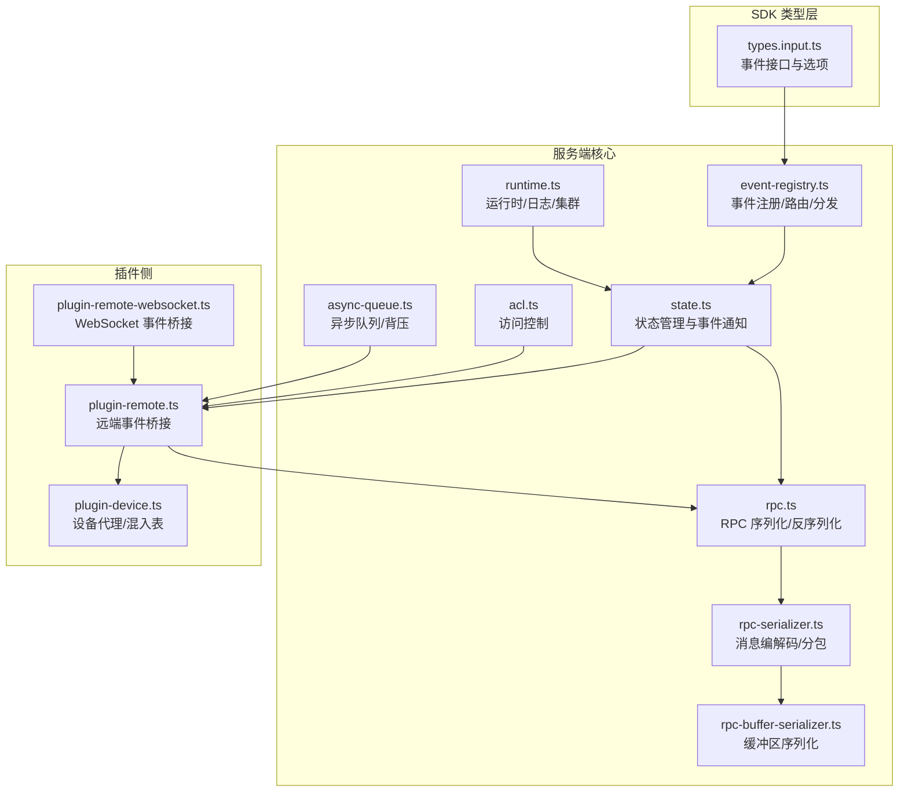
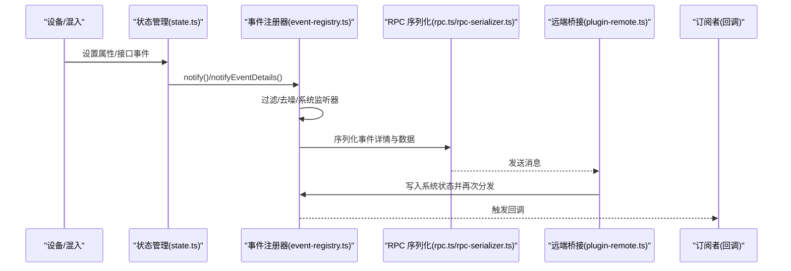
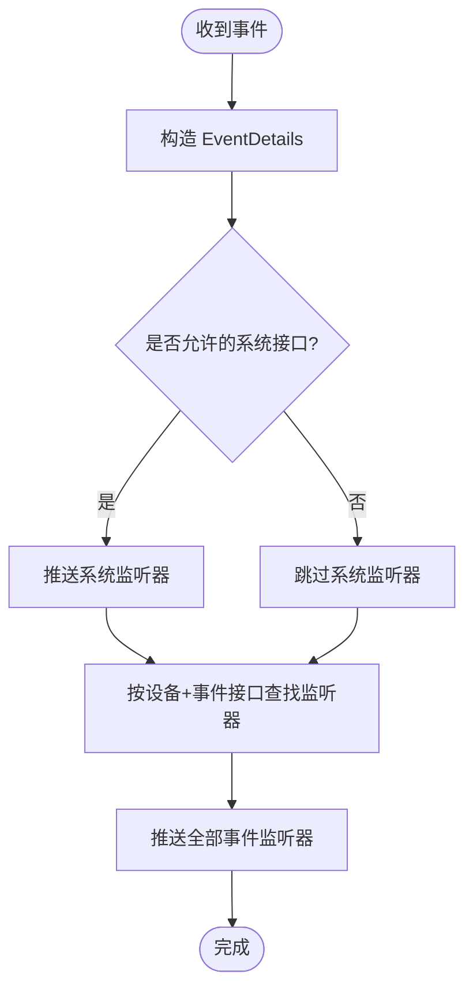
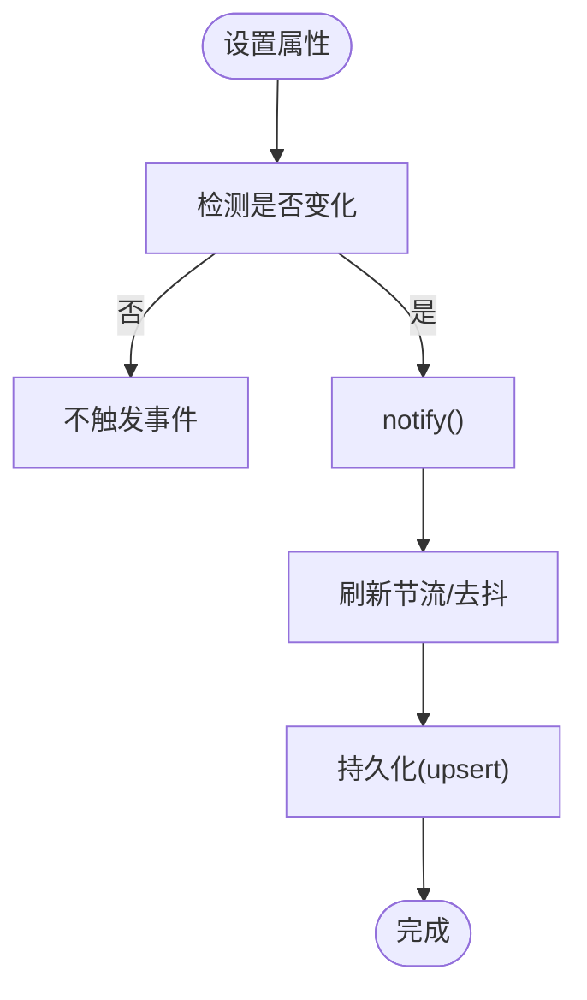
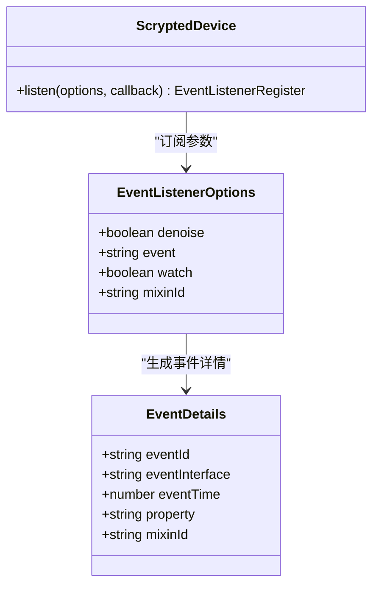
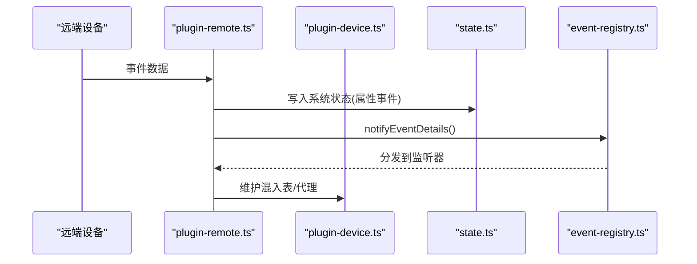
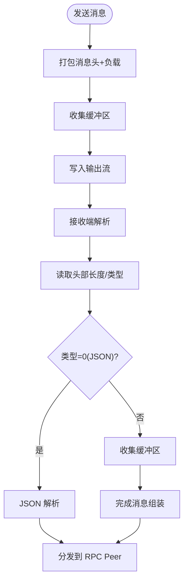
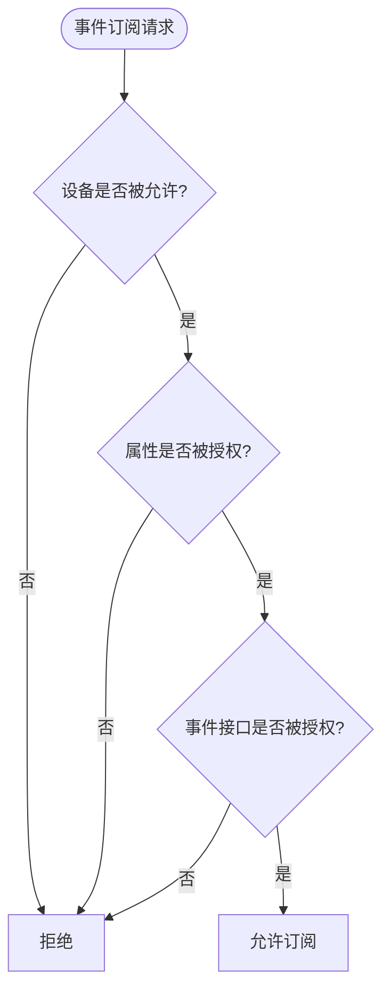
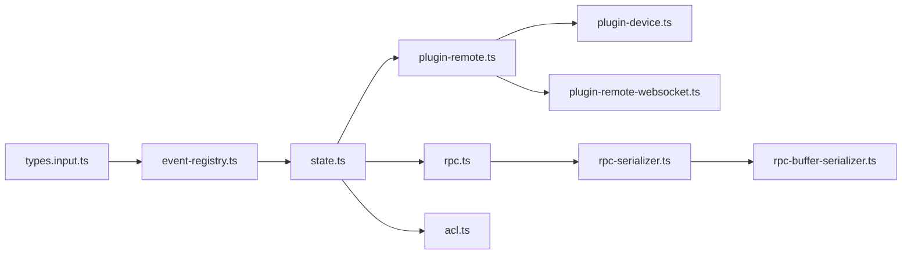

# 设备事件处理

<cite>
**本文引用的文件**
- [event-registry.ts](file://server/src/event-registry.ts)
- [state.ts](file://server/src/state.ts)
- [types.input.ts](file://sdk/types/src/types.input.ts)
- [rpc.ts](file://server/src/rpc.ts)
- [rpc-serializer.ts](file://server/src/rpc-serializer.ts)
- [rpc-buffer-serializer.ts](file://server/src/rpc-buffer-serializer.ts)
- [plugin-remote.ts](file://server/src/plugin/plugin-remote.ts)
- [plugin-device.ts](file://server/src/plugin/plugin-device.ts)
- [runtime.ts](file://server/src/runtime.ts)
- [acl.ts](file://server/src/plugin/acl.ts)
- [async-queue.ts](file://common/src/async-queue.ts)
- [plugin-remote-websocket.ts](file://server/src/plugin/plugin-remote-websocket.ts)
</cite>

## 目录
1. [简介](#简介)
2. [项目结构](#项目结构)
3. [核心组件](#核心组件)
4. [架构总览](#架构总览)
5. [详细组件分析](#详细组件分析)
6. [依赖关系分析](#依赖关系分析)
7. [性能考量](#性能考量)
8. [故障排查指南](#故障排查指南)
9. [结论](#结论)
10. [附录](#附录)

## 简介
本文件系统性梳理 Scrypted 的设备事件处理体系，覆盖事件产生机制与类型（状态变更、传感器、用户操作等）、事件注册与路由、事件分发与订阅、事件序列化与反序列化、性能优化（批量、异步、背压）、错误恢复（重试、降级、隔离）、调试与监控工具，以及安全与最佳实践。目标是帮助开发者快速理解并高效构建可靠的事件驱动型自动化与集成。

## 项目结构
围绕事件处理的核心代码主要分布在以下模块：
- 事件注册与分发：server/src/event-registry.ts、server/src/state.ts
- 类型与接口定义：sdk/types/src/types.input.ts
- 远程过程调用与序列化：server/src/rpc.ts、server/src/rpc-serializer.ts、server/src/rpc-buffer-serializer.ts
- 插件侧事件桥接：server/src/plugin/plugin-remote.ts、server/src/plugin/plugin-device.ts
- 运行时与系统事件：server/src/runtime.ts
- 访问控制：server/src/plugin/acl.ts
- 异步队列与背压：common/src/async-queue.ts
- WebSocket 事件桥接：server/src/plugin/plugin-remote-websocket.ts

**图表来源**
- [types.input.ts:80-100](file://sdk/types/src/types.input.ts#L80-L100)
- [event-registry.ts:26-104](file://server/src/event-registry.ts#L26-L104)
- [state.ts:10-135](file://server/src/state.ts#L10-L135)
- [rpc.ts:375-546](file://server/src/rpc.ts#L375-L546)
- [rpc-serializer.ts:1-240](file://server/src/rpc-serializer.ts#L1-L240)
- [rpc-buffer-serializer.ts:1-31](file://server/src/rpc-buffer-serializer.ts#L1-L31)
- [plugin-remote.ts:260-273](file://server/src/plugin/plugin-remote.ts#L260-L273)
- [plugin-device.ts:1-200](file://server/src/plugin/plugin-device.ts#L1-L200)
- [runtime.ts:1-200](file://server/src/runtime.ts#L1-L200)
- [acl.ts:1-49](file://server/src/plugin/acl.ts#L1-L49)
- [async-queue.ts:1-190](file://common/src/async-queue.ts#L1-L190)
- [plugin-remote-websocket.ts:1-55](file://server/src/plugin/plugin-remote-websocket.ts#L1-L55)

**章节来源**
- [event-registry.ts:1-105](file://server/src/event-registry.ts#L1-L105)
- [state.ts:1-287](file://server/src/state.ts#L1-L287)
- [types.input.ts:80-100](file://sdk/types/src/types.input.ts#L80-L100)
- [rpc.ts:375-546](file://server/src/rpc.ts#L375-L546)
- [rpc-serializer.ts:1-240](file://server/src/rpc-serializer.ts#L1-L240)
- [rpc-buffer-serializer.ts:1-31](file://server/src/rpc-buffer-serializer.ts#L1-L31)
- [plugin-remote.ts:260-273](file://server/src/plugin/plugin-remote.ts#L260-L273)
- [plugin-device.ts:1-200](file://server/src/plugin/plugin-device.ts#L1-L200)
- [runtime.ts:1-200](file://server/src/runtime.ts#L1-L200)
- [acl.ts:1-49](file://server/src/plugin/acl.ts#L1-L49)
- [async-queue.ts:1-190](file://common/src/async-queue.ts#L1-L190)
- [plugin-remote-websocket.ts:1-55](file://server/src/plugin/plugin-remote-websocket.ts#L1-L55)

## 核心组件
- 事件注册与路由
  - 事件注册器：用于注册系统级与设备级事件监听器，支持按设备 ID 与事件接口维度进行路由。
  - 混入事件命名：支持通过 mixinId 对事件进行命名空间隔离，避免同名事件冲突。
- 事件分发
  - 系统监听器：仅接收允许的事件接口（如 ScryptedDevice、Logger）的状态变更事件，降低噪声。
  - 设备级监听器：按设备 ID 与事件接口分发；同时支持“全部事件”通配分发。
- 状态管理与事件通知
  - 状态变更检测：比较新旧值，仅在变化时触发事件，减少无效通知。
  - 刷新节流：对支持 Refresh 接口的设备进行刷新去抖与节流，避免频繁轮询。
- 序列化与反序列化
  - RPC 层提供通用序列化/反序列化框架，支持对象代理、错误包装、属性标记等。
  - 缓冲区序列化：支持二进制数据的边带传输与按需复制，提升大对象传输效率。
- 插件侧桥接
  - 远端事件桥接：将远端设备或混入产生的事件转换为本地事件，写入系统状态并触发分发。
  - 设备代理与混入表：维护设备与混入之间的接口映射，确保事件来源可追溯。
- 访问控制
  - 基于用户权限的设备、属性与事件访问控制，拒绝未授权的事件订阅与读取。
- 异步队列与背压
  - 提供异步队列与取消信号，支持事件处理的背压与有序消费。

**章节来源**
- [event-registry.ts:26-104](file://server/src/event-registry.ts#L26-L104)
- [state.ts:102-135](file://server/src/state.ts#L102-L135)
- [rpc.ts:375-546](file://server/src/rpc.ts#L375-L546)
- [rpc-buffer-serializer.ts:1-31](file://server/src/rpc-buffer-serializer.ts#L1-L31)
- [plugin-remote.ts:260-273](file://server/src/plugin/plugin-remote.ts#L260-L273)
- [plugin-device.ts:1-200](file://server/src/plugin/plugin-device.ts#L1-L200)
- [acl.ts:1-49](file://server/src/plugin/acl.ts#L1-L49)
- [async-queue.ts:1-190](file://common/src/async-queue.ts#L1-L190)

## 架构总览
事件从设备或混入产生，经由状态管理与事件注册器完成去噪与路由，再通过 RPC 序列化在进程间传输，最终到达订阅者回调。系统还内置访问控制与刷新节流，保证性能与安全。

**图表来源**
- [state.ts:102-135](file://server/src/state.ts#L102-L135)
- [event-registry.ts:55-103](file://server/src/event-registry.ts#L55-L103)
- [rpc.ts:375-546](file://server/src/rpc.ts#L375-L546)
- [rpc-serializer.ts:1-240](file://server/src/rpc-serializer.ts#L1-L240)
- [plugin-remote.ts:260-273](file://server/src/plugin/plugin-remote.ts#L260-L273)

## 详细组件分析

### 事件注册与路由（EventRegistry）
- 注册系统监听器与设备监听器，支持按事件接口与设备维度分发。
- 混入事件命名规则：当存在 mixinId 时，事件名称附加后缀以区分来源。
- 分发策略：
  - 允许的事件接口（如 ScryptedDevice、Logger）优先推送给系统监听器。
  - 按设备+事件接口匹配监听器集合。
  - 支持“全部事件”通配分发。

**图表来源**
- [event-registry.ts:55-103](file://server/src/event-registry.ts#L55-L103)

**章节来源**
- [event-registry.ts:11-21](file://server/src/event-registry.ts#L11-L21)
- [event-registry.ts:26-104](file://server/src/event-registry.ts#L26-L104)

### 状态管理与事件通知（ScryptedStateManager）
- 状态变更检测：比较新旧值，仅在变化时触发事件与日志。
- 刷新节流：对 Refresh 接口设备进行节流与尾调用合并，避免频繁轮询。
- 混入事件屏蔽：根据实现者 ID 决定事件是否应由混入直接上报，否则进行掩蔽与命名空间转换。
- 设备移除与描述符更新：提供删除与描述符变更的事件通知入口。

**图表来源**
- [state.ts:102-135](file://server/src/state.ts#L102-L135)
- [state.ts:193-255](file://server/src/state.ts#L193-L255)

**章节来源**
- [state.ts:10-135](file://server/src/state.ts#L10-L135)
- [state.ts:193-255](file://server/src/state.ts#L193-L255)

### 事件类型与订阅选项（EventDetails 与 EventListenerOptions）
- EventDetails：包含事件唯一标识、事件接口、时间戳、属性键、混入 ID。
- EventListenerOptions：支持 denoise（仅变化事件）、event（事件接口）、watch（被动观察不主动轮询）、mixinId（混入来源）。

**图表来源**
- [types.input.ts:80-100](file://sdk/types/src/types.input.ts#L80-L100)

**章节来源**
- [types.input.ts:61-100](file://sdk/types/src/types.input.ts#L61-L100)

### 插件侧事件桥接（plugin-remote.ts 与 plugin-device.ts）
- 远端桥接：当远端设备产生属性事件时，写入本地系统状态并再次触发事件分发；非属性事件则直接分发。
- 设备代理与混入表：维护设备与混入的接口映射，确保事件来源可追溯与混入生命周期管理。

**图表来源**
- [plugin-remote.ts:260-273](file://server/src/plugin/plugin-remote.ts#L260-L273)
- [plugin-device.ts:1-200](file://server/src/plugin/plugin-device.ts#L1-L200)
- [state.ts:102-135](file://server/src/state.ts#L102-L135)
- [event-registry.ts:75-103](file://server/src/event-registry.ts#L75-L103)

**章节来源**
- [plugin-remote.ts:260-273](file://server/src/plugin/plugin-remote.ts#L260-L273)
- [plugin-device.ts:1-200](file://server/src/plugin/plugin-device.ts#L1-L200)

### 序列化与反序列化（RPC 与 Serializer）
- RPC 层提供统一的序列化/反序列化框架，支持：
  - 错误对象包装与还原
  - 远端/本地代理对象识别与重建
  - 属性标记（如 __remote_proxy_id）用于跨进程对象传递
- 消息编解码：
  - 双工序列化器：基于头部长度与类型字段的分包协议，支持缓冲区与 JSON 消息混合。
  - 边带缓冲区序列化：将大对象作为独立缓冲区发送，减少拷贝成本。
- 数据通道序列化：针对 WebRTC 数据通道的 16KB 分包与去抖发送。

**图表来源**
- [rpc-serializer.ts:87-182](file://server/src/rpc-serializer.ts#L87-L182)
- [rpc-buffer-serializer.ts:1-31](file://server/src/rpc-buffer-serializer.ts#L1-L31)
- [rpc.ts:494-546](file://server/src/rpc.ts#L494-L546)

**章节来源**
- [rpc.ts:375-546](file://server/src/rpc.ts#L375-L546)
- [rpc-serializer.ts:1-240](file://server/src/rpc-serializer.ts#L1-L240)
- [rpc-buffer-serializer.ts:1-31](file://server/src/rpc-buffer-serializer.ts#L1-L31)

### 访问控制（ACL）
- 设备级访问控制：拒绝未授权设备的事件订阅。
- 属性级访问控制：仅允许订阅被授权的属性事件。
- 事件级访问控制：根据事件接口与属性决定是否放行。

**图表来源**
- [acl.ts:16-49](file://server/src/plugin/acl.ts#L16-L49)

**章节来源**
- [acl.ts:1-49](file://server/src/plugin/acl.ts#L1-L49)

### 异步队列与背压（Async Queue）
- 提供生产者-消费者模型，支持：
  - 立即出队/等待出队
  - 取消信号与中断
  - 管道式消费与清空
- 在事件处理中可用于削峰填谷与有序处理。

**章节来源**
- [async-queue.ts:1-190](file://common/src/async-queue.ts#L1-L190)

### WebSocket 事件桥接
- 提供基于 WebSocket 的事件派发目标与事件监听器集合，便于前端或外部客户端订阅事件。

**章节来源**
- [plugin-remote-websocket.ts:1-55](file://server/src/plugin/plugin-remote-websocket.ts#L1-L55)

## 依赖关系分析
- 低耦合高内聚：事件注册器与状态管理分离，职责清晰。
- 外部依赖：
  - RPC 序列化依赖消息头协议与缓冲区管理。
  - 插件侧依赖设备代理与混入表，确保事件来源可追踪。
- 安全边界：ACL 在事件订阅阶段进行拦截，防止越权访问。

**图表来源**
- [types.input.ts:80-100](file://sdk/types/src/types.input.ts#L80-L100)
- [event-registry.ts:26-104](file://server/src/event-registry.ts#L26-L104)
- [state.ts:10-135](file://server/src/state.ts#L10-L135)
- [plugin-remote.ts:260-273](file://server/src/plugin/plugin-remote.ts#L260-L273)
- [plugin-device.ts:1-200](file://server/src/plugin/plugin-device.ts#L1-L200)
- [rpc.ts:375-546](file://server/src/rpc.ts#L375-L546)
- [rpc-serializer.ts:1-240](file://server/src/rpc-serializer.ts#L1-L240)
- [rpc-buffer-serializer.ts:1-31](file://server/src/rpc-buffer-serializer.ts#L1-L31)
- [acl.ts:1-49](file://server/src/plugin/acl.ts#L1-L49)
- [plugin-remote-websocket.ts:1-55](file://server/src/plugin/plugin-remote-websocket.ts#L1-L55)

**章节来源**
- [runtime.ts:1-200](file://server/src/runtime.ts#L1-L200)

## 性能考量
- 批量与去抖
  - 状态变更去噪：仅在值变化时触发事件，减少无效广播。
  - 刷新节流：对 Refresh 接口设备进行节流与尾调用合并，避免频繁轮询。
- 异步与背压
  - 使用异步队列进行事件堆积与有序消费，结合取消信号支持中断。
- 序列化优化
  - 边带缓冲区序列化：大对象通过独立缓冲区传输，减少拷贝与内存压力。
  - 数据通道分包：WebRTC 场景下按 16KB 分片发送，配合去抖提升吞吐。
- 路由与过滤
  - 系统监听器仅接收允许的事件接口，降低噪声与处理开销。

**章节来源**
- [state.ts:102-135](file://server/src/state.ts#L102-L135)
- [state.ts:193-255](file://server/src/state.ts#L193-L255)
- [rpc-buffer-serializer.ts:1-31](file://server/src/rpc-buffer-serializer.ts#L1-L31)
- [rpc-serializer.ts:184-240](file://server/src/rpc-serializer.ts#L184-L240)
- [event-registry.ts:79-86](file://server/src/event-registry.ts#L79-L86)
- [async-queue.ts:1-190](file://common/src/async-queue.ts#L1-L190)

## 故障排查指南
- 事件未到达
  - 检查事件接口是否在允许列表中（系统监听器仅接收特定接口）。
  - 确认订阅选项是否正确（denoise/watch/event/mixinId）。
  - 核对 ACL 是否拒绝该设备/属性/事件。
- 事件风暴
  - 启用 denoise 选项，仅订阅变化事件。
  - 对高频事件使用异步队列进行背压。
- 序列化异常
  - 检查消息头协议与缓冲区数量是否一致。
  - 确认远端/本地代理对象标识是否正确。
- 远端事件不同步
  - 查看远端桥接是否写入系统状态并再次分发。
  - 确认混入表是否完整且代理有效。

**章节来源**
- [event-registry.ts:79-103](file://server/src/event-registry.ts#L79-L103)
- [state.ts:102-135](file://server/src/state.ts#L102-L135)
- [plugin-remote.ts:260-273](file://server/src/plugin/plugin-remote.ts#L260-L273)
- [rpc-serializer.ts:117-182](file://server/src/rpc-serializer.ts#L117-L182)
- [rpc.ts:515-546](file://server/src/rpc.ts#L515-L546)
- [acl.ts:16-49](file://server/src/plugin/acl.ts#L16-L49)

## 结论
Scrypted 的事件处理体系通过“状态管理 + 事件注册器 + RPC 序列化 + 访问控制”的组合，在保证安全性与性能的同时，提供了灵活的事件订阅与分发能力。借助去噪、节流、异步队列与边带序列化等优化手段，能够在复杂场景下稳定运行。建议在实际开发中充分利用订阅选项与 ACL，结合异步队列实现高吞吐与低延迟的事件处理。

## 附录
- 事件类型与订阅选项参考路径：[types.input.ts:61-100](file://sdk/types/src/types.input.ts#L61-L100)
- 事件注册与分发参考路径：[event-registry.ts:26-104](file://server/src/event-registry.ts#L26-L104)
- 状态管理与事件通知参考路径：[state.ts:102-135](file://server/src/state.ts#L102-L135)
- 序列化与反序列化参考路径：[rpc.ts:375-546](file://server/src/rpc.ts#L375-L546)、[rpc-serializer.ts:1-240](file://server/src/rpc-serializer.ts#L1-L240)、[rpc-buffer-serializer.ts:1-31](file://server/src/rpc-buffer-serializer.ts#L1-L31)
- 插件侧桥接参考路径：[plugin-remote.ts:260-273](file://server/src/plugin/plugin-remote.ts#L260-L273)、[plugin-device.ts:1-200](file://server/src/plugin/plugin-device.ts#L1-L200)
- 访问控制参考路径：[acl.ts:1-49](file://server/src/plugin/acl.ts#L1-L49)
- 异步队列参考路径：[async-queue.ts:1-190](file://common/src/async-queue.ts#L1-L190)
- WebSocket 事件桥接参考路径：[plugin-remote-websocket.ts:1-55](file://server/src/plugin/plugin-remote-websocket.ts#L1-L55)