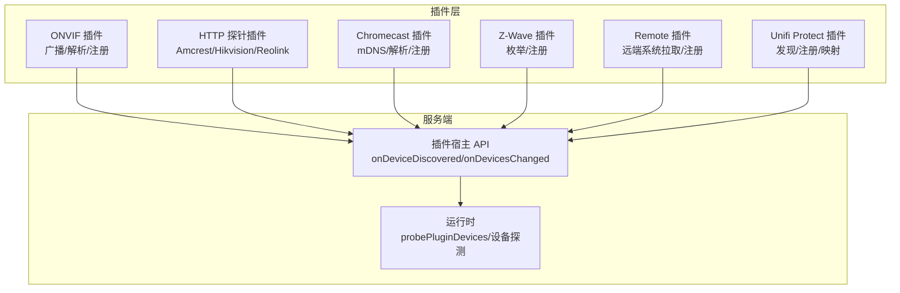
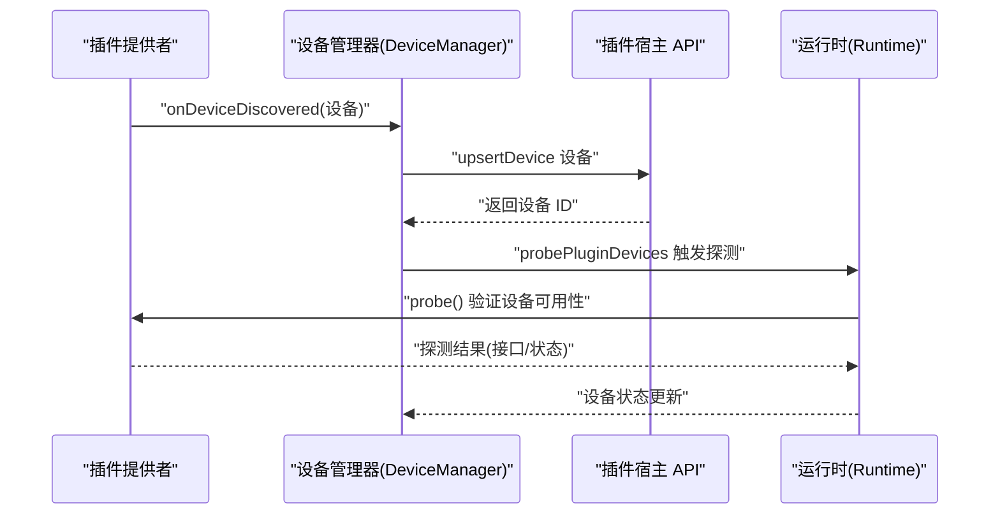
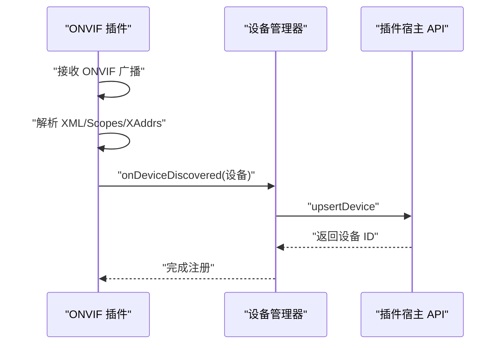
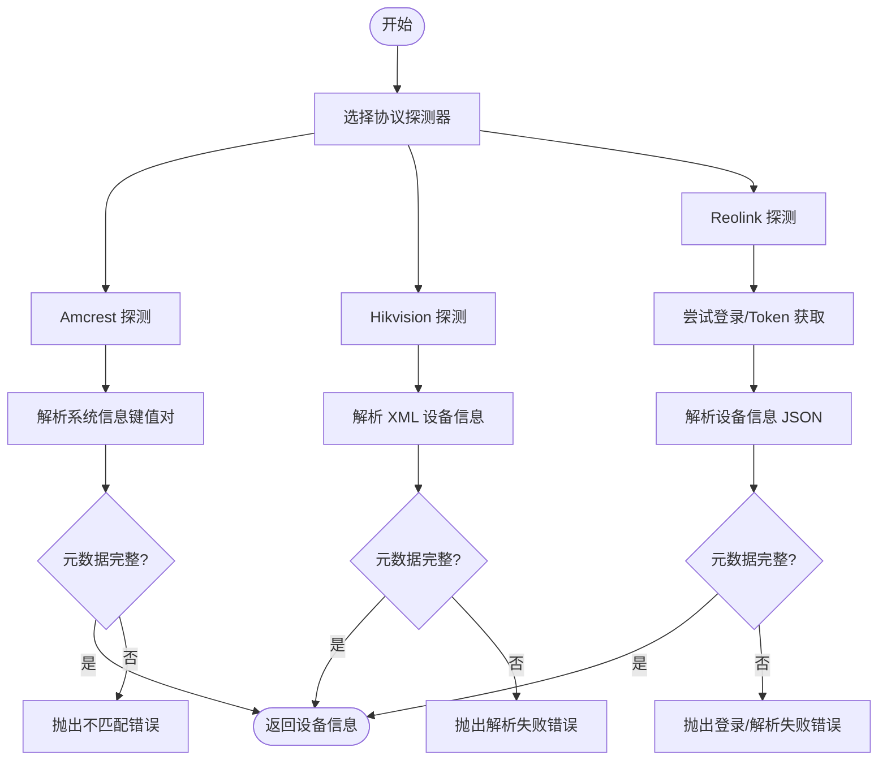
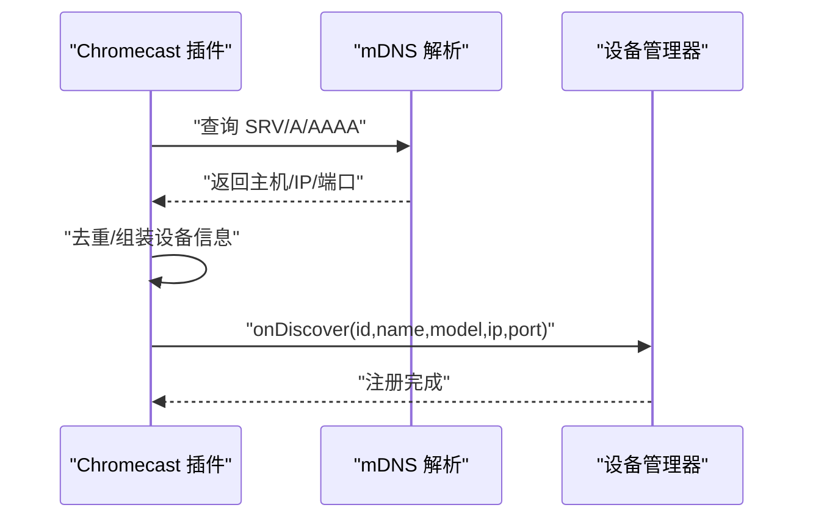
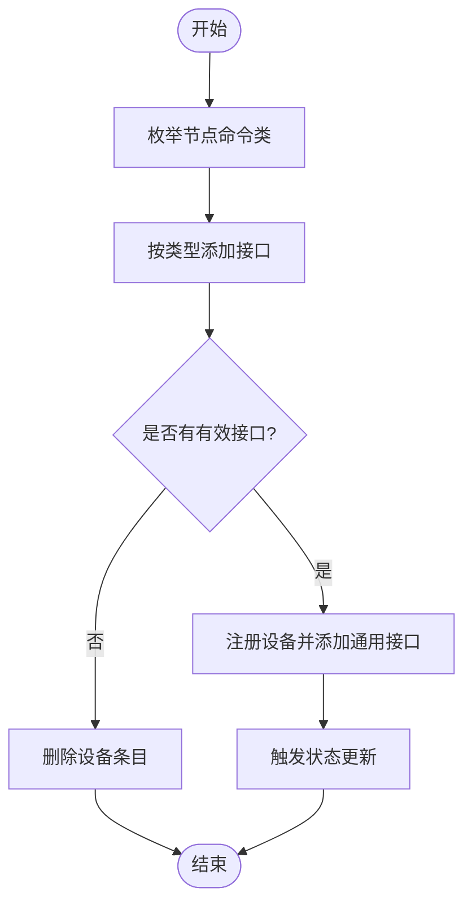
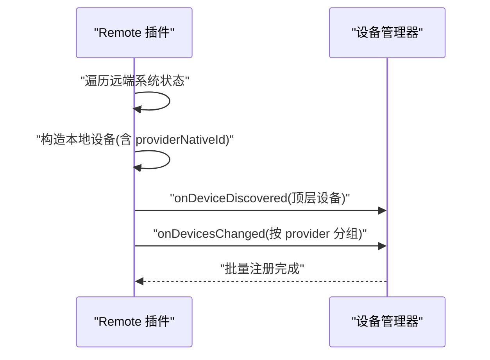
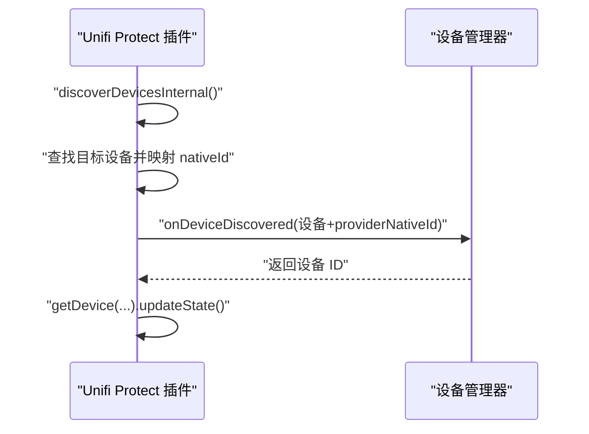
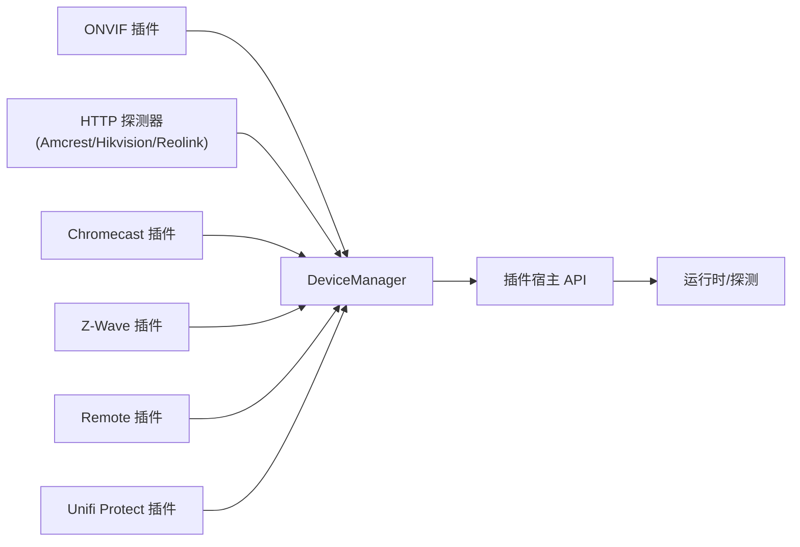

# 设备发现与注册

<cite>
**本文引用的文件**
- [plugins/onvif/src/main.ts](file://plugins/onvif/src/main.ts)
- [plugins/onvif/src/onvif-api.ts](file://plugins/onvif/src/onvif-api.ts)
- [plugins/remote/src/main.ts](file://plugins/remote/src/main.ts)
- [plugins/unifi-protect/src/main.ts](file://plugins/unifi-protect/src/main.ts)
- [plugins/amcrest/src/probe.ts](file://plugins/amcrest/src/probe.ts)
- [plugins/hikvision/src/probe.ts](file://plugins/hikvision/src/probe.ts)
- [plugins/reolink/src/probe.ts](file://plugins/reolink/src/probe.ts)
- [server/src/plugin/plugin-host-api.ts](file://server/src/plugin/plugin-host-api.ts)
- [server/src/runtime.ts](file://server/src/runtime.ts)
- [plugins/chromecast/src/main.ts](file://plugins/chromecast/src/main.ts)
- [plugins/zwave/src/main.ts](file://plugins/zwave/src/main.ts)
- [plugins/diagnostics/src/main.ts](file://plugins/diagnostics/src/main.ts)
</cite>

## 目录
1. [简介](#简介)
2. [项目结构](#项目结构)
3. [核心组件](#核心组件)
4. [架构总览](#架构总览)
5. [详细组件分析](#详细组件分析)
6. [依赖关系分析](#依赖关系分析)
7. [性能考量](#性能考量)
8. [故障排查指南](#故障排查指南)
9. [结论](#结论)
10. [附录](#附录)

## 简介
本章节概述 Scrypted 的设备发现与注册系统：如何通过网络扫描、协议探测与设备识别，完成从“发现”到“注册”的全流程；如何针对不同协议（如 ONVIF、RTSP、HTTP、mDNS/Chromecast、Z-Wave 等）制定差异化策略；以及如何通过设备提供者扩展新的发现能力。同时涵盖设备元数据采集与验证、配置项与性能优化建议，以及常见问题的排查方法。

## 项目结构
Scrypted 的设备发现与注册由“插件侧发现 + 服务端统一接入”两部分组成：
- 插件侧负责具体协议的发现与探测，例如 ONVIF 广播、HTTP 探测、mDNS/Chromecast 解析、Z-Wave 枚举等。
- 服务端通过 DeviceManager 统一接收设备发现事件，调用 upsertDevice 完成设备注册，并触发后续探测与状态更新。

图示来源
- [server/src/plugin/plugin-host-api.ts:135-160](file://server/src/plugin/plugin-host-api.ts#L135-L160)
- [server/src/runtime.ts:722-745](file://server/src/runtime.ts#L722-L745)

章节来源
- [server/src/plugin/plugin-host-api.ts:135-160](file://server/src/plugin/plugin-host-api.ts#L135-L160)
- [server/src/runtime.ts:722-745](file://server/src/runtime.ts#L722-L745)

## 核心组件
- 设备提供者（DeviceProvider）：在插件中实现，负责执行网络扫描、协议探测与设备识别，并通过 deviceManager.onDeviceDiscovered/onDevicesChanged 注册设备。
- 设备管理器（DeviceManager）：服务端入口，接收来自插件的设备发现事件，完成设备 Upsert、接口排序与混入解析，随后触发探测（probe）以验证设备可用性。
- 协议探测器（Protocol Probes）：针对不同厂商或协议的 HTTP 探测函数，用于采集设备元数据（型号、序列号、固件等），并进行有效性校验。
- 远端系统桥接（Remote Provider）：从远端系统拉取设备清单，过滤后批量注册。

章节来源
- [plugins/onvif/src/main.ts:358-438](file://plugins/onvif/src/main.ts#L358-L438)
- [plugins/remote/src/main.ts:256-318](file://plugins/remote/src/main.ts#L256-L318)
- [server/src/plugin/plugin-host-api.ts:135-160](file://server/src/plugin/plugin-host-api.ts#L135-L160)
- [server/src/runtime.ts:722-745](file://server/src/runtime.ts#L722-L745)

## 架构总览
下图展示了从“发现”到“注册”的关键交互路径，以及服务端对设备的探测与状态更新：

图示来源
- [server/src/plugin/plugin-host-api.ts:152-156](file://server/src/plugin/plugin-host-api.ts#L152-L156)
- [server/src/runtime.ts:722-745](file://server/src/runtime.ts#L722-L745)

章节来源
- [server/src/plugin/plugin-host-api.ts:152-156](file://server/src/plugin/plugin-host-api.ts#L152-L156)
- [server/src/runtime.ts:722-745](file://server/src/runtime.ts#L722-L745)

## 详细组件分析

### ONVIF 设备发现与注册
- 发现机制：监听 ONVIF Discovery 广播，解析 ProbeMatches/XAddrs/Scopes，提取设备名称、硬件信息等，去重后进入注册流程。
- 注册流程：若设备未重复发现，则通过 deviceManager.onDeviceDiscovered 注册；随后可自动探测 PTZ 能力、Intercom 可用性等。
- 元数据与验证：注册前可基于 HTTP API 获取设备信息（序列号、厂商、固件、型号等），并根据服务能力动态添加接口。

图示来源
- [plugins/onvif/src/main.ts:358-438](file://plugins/onvif/src/main.ts#L358-L438)
- [server/src/plugin/plugin-host-api.ts:152-156](file://server/src/plugin/plugin-host-api.ts#L152-L156)

章节来源
- [plugins/onvif/src/main.ts:358-438](file://plugins/onvif/src/main.ts#L358-L438)
- [plugins/onvif/src/onvif-api.ts:44-79](file://plugins/onvif/src/onvif-api.ts#L44-L79)

### HTTP 协议探测（Amcrest/Hikvision/Reolink）
- Amcrest：通过 CGI 接口获取系统信息，解析键值对，提取设备类型、序列号等。
- Hikvision：访问 ISAPI 设备信息接口，解析 XML 中的设备模型、名称、序列号、MAC、固件版本等。
- Reolink：支持登录参数优先（用户/密码）或 Token 方案，统一返回设备信息对象。

图示来源
- [plugins/amcrest/src/probe.ts:12-42](file://plugins/amcrest/src/probe.ts#L12-L42)
- [plugins/hikvision/src/probe.ts:4-35](file://plugins/hikvision/src/probe.ts#L4-L35)
- [plugins/reolink/src/probe.ts:53-124](file://plugins/reolink/src/probe.ts#L53-L124)

章节来源
- [plugins/amcrest/src/probe.ts:12-42](file://plugins/amcrest/src/probe.ts#L12-L42)
- [plugins/hikvision/src/probe.ts:4-35](file://plugins/hikvision/src/probe.ts#L4-L35)
- [plugins/reolink/src/probe.ts:53-124](file://plugins/reolink/src/probe.ts#L53-L124)

### mDNS/Chromecast 设备发现与注册
- 解析 mDNS TXT/A/AAAA 记录，提取设备 ID、模型、名称、主机与端口，去重后调用 onDiscover 注册。
- 若设备已存在则仅更新存储信息（如 IP 地址）。

图示来源
- [plugins/chromecast/src/main.ts:488-527](file://plugins/chromecast/src/main.ts#L488-L527)

章节来源
- [plugins/chromecast/src/main.ts:488-527](file://plugins/chromecast/src/main.ts#L488-L527)

### Z-Wave 设备发现与注册
- 枚举节点命令类，按类型添加设备接口；若无有效接口则移除该设备；否则注册并添加 Refresh/Online/Settings 等通用接口，随后触发状态更新。

图示来源
- [plugins/zwave/src/main.ts:409-440](file://plugins/zwave/src/main.ts#L409-L440)

章节来源
- [plugins/zwave/src/main.ts:409-440](file://plugins/zwave/src/main.ts#L409-L440)

### 远端系统桥接（Remote Provider）与批量注册
- 从远端系统获取设备状态，构造本地设备对象（含 providerNativeId），先注册顶层设备，再按 provider 分组批量 onDevicesChanged，避免覆盖。

图示来源
- [plugins/remote/src/main.ts:256-318](file://plugins/remote/src/main.ts#L256-L318)

章节来源
- [plugins/remote/src/main.ts:256-318](file://plugins/remote/src/main.ts#L256-L318)

### Unifi Protect 设备发现与注册（含 ID 映射）
- 通过内部发现流程获取设备列表，按需映射 nativeId，调用 deviceManager.onDeviceDiscovered 完成注册，并触发设备状态更新。

图示来源
- [plugins/unifi-protect/src/main.ts:526-539](file://plugins/unifi-protect/src/main.ts#L526-L539)

章节来源
- [plugins/unifi-protect/src/main.ts:526-539](file://plugins/unifi-protect/src/main.ts#L526-L539)

## 依赖关系分析
- 插件提供者通过 DeviceManager 的 onDeviceDiscovered/onDevicesChanged 与服务端交互，服务端在宿主 API 层完成 upsertDevice，并在运行时对设备执行探测（probe）以验证可用性。
- 不同协议的探测器相互独立，但都服务于“设备元数据采集与验证”，最终驱动注册流程。

图示来源
- [server/src/plugin/plugin-host-api.ts:135-160](file://server/src/plugin/plugin-host-api.ts#L135-L160)
- [server/src/runtime.ts:722-745](file://server/src/runtime.ts#L722-L745)

章节来源
- [server/src/plugin/plugin-host-api.ts:135-160](file://server/src/plugin/plugin-host-api.ts#L135-L160)
- [server/src/runtime.ts:722-745](file://server/src/runtime.ts#L722-L745)

## 性能考量
- 并发与去重：ONVIF/Chromecast 等发现流程中应避免重复注册（基于 nativeId 或集合去重），减少不必要的探测与状态更新。
- 批量注册：Remote 插件按 providerNativeId 分组批量 onDevicesChanged，有助于降低频繁 upsert 带来的开销。
- 探测策略：运行时会对新注册设备执行 probe，建议在插件侧尽量提供轻量级探测接口，避免阻塞注册主流程。
- 超时与重试：HTTP 探测器与 ONVIF API 访问应设置合理超时与失败回退策略，避免长时间阻塞。

章节来源
- [plugins/onvif/src/main.ts:358-438](file://plugins/onvif/src/main.ts#L358-L438)
- [plugins/remote/src/main.ts:256-318](file://plugins/remote/src/main.ts#L256-L318)
- [server/src/runtime.ts:722-745](file://server/src/runtime.ts#L722-L745)

## 故障排查指南
- 设备未出现或重复注册
  - 检查是否已在 deviceManager.getNativeIds 或本地集合中去重。
  - 确认 providerNativeId 设置正确，避免跨 provider 冲突。
- 设备信息缺失或不准确
  - 使用诊断插件对摄像头进行快照与流媒体验证，检查分辨率、子码流数量、云流等提示。
  - 对于特定厂商（如 Unifi Protect），确认设备映射与 nativeId 是否正确。
- ONVIF 设备无法注册
  - 确认广播可达与防火墙放行；检查解析的 XAddrs/Scopes 是否包含预期地址。
  - 在注册前使用 HTTP API 获取设备信息，核对序列号、厂商、固件等字段。
- Chromecast 设备解析失败
  - 检查 mDNS TXT/A/AAAA 记录是否存在；确认 SRV 目标与 A/AAAA 记录匹配。
- Z-Wave 设备未注册
  - 确认节点命令类枚举是否产生有效接口；若无接口则会被移除。

章节来源
- [plugins/diagnostics/src/main.ts:177-321](file://plugins/diagnostics/src/main.ts#L177-L321)
- [plugins/onvif/src/main.ts:358-438](file://plugins/onvif/src/main.ts#L358-L438)
- [plugins/chromecast/src/main.ts:488-527](file://plugins/chromecast/src/main.ts#L488-L527)
- [plugins/zwave/src/main.ts:409-440](file://plugins/zwave/src/main.ts#L409-L440)
- [plugins/unifi-protect/src/main.ts:526-539](file://plugins/unifi-protect/src/main.ts#L526-L539)

## 结论
Scrypted 的设备发现与注册体系以“插件协议适配 + 服务端统一接入”为核心，既保证了对多协议的灵活支持，又通过 DeviceManager 与运行时的探测机制确保设备信息的准确性与稳定性。通过合理的去重、批量注册与探测策略，可在保证性能的同时提升用户体验。

## 附录
- 设备提供者扩展建议
  - 实现 discoverDevices 方法，输出符合 Device 结构的设备清单。
  - 在发现阶段尽可能采集元数据（厂商、型号、序列号、固件版本等），并在注册前进行最小化验证。
  - 对外暴露必要的设置项（如 IP、端口、用户名/密码等），并提供“跳过验证”选项以加速首次注册。
- 配置项与优化建议
  - 超时：为 HTTP 探测与 ONVIF API 访问设置合理超时时间。
  - 并发：批量注册时按 provider 分组，避免频繁 upsert。
  - 去重：基于 nativeId 或集合去重，防止重复注册。
  - 探测：优先提供轻量探测接口，复杂探测延后执行。