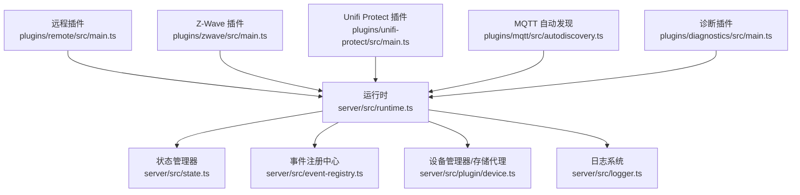
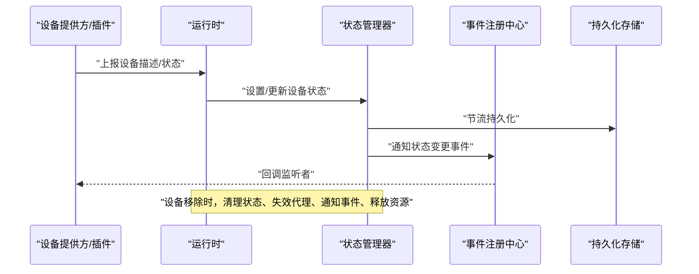
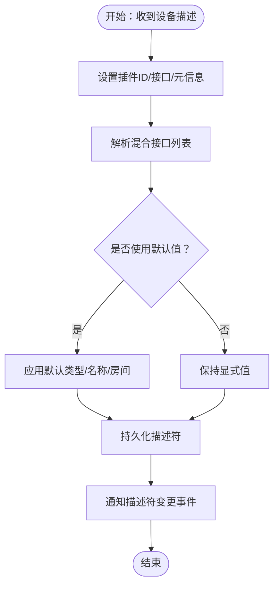
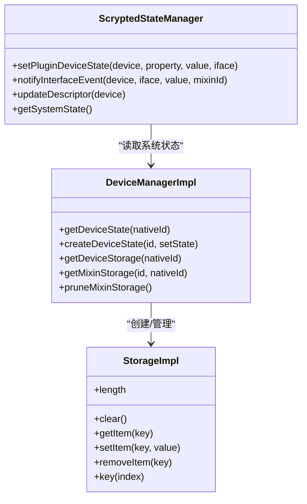
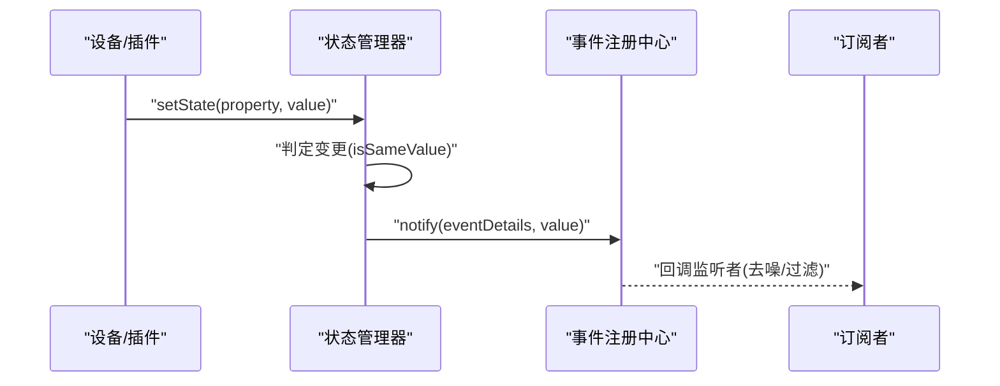
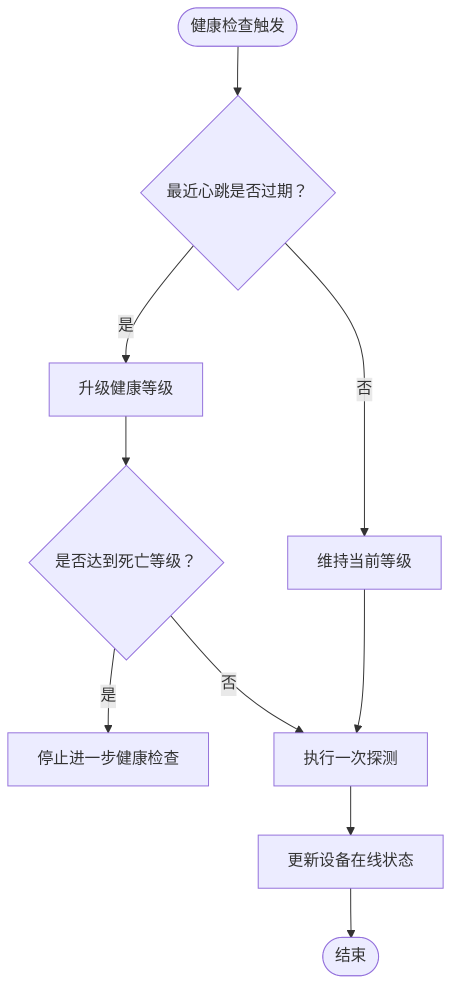
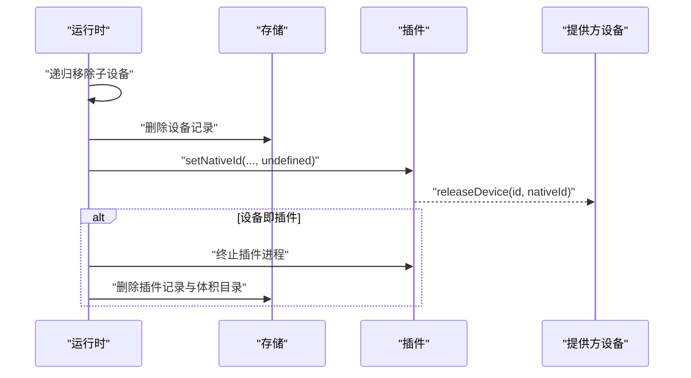
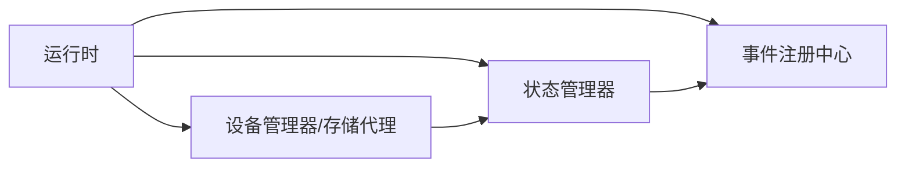

# 设备生命周期管理

<cite>
**本文引用的文件**
- [runtime.ts](file://server/src/runtime.ts)
- [state.ts](file://server/src/state.ts)
- [device.ts](file://server/src/plugin/device.ts)
- [event-registry.ts](file://server/src/event-registry.ts)
- [logger.ts](file://server/src/logger.ts)
- [main.ts（远程插件）](file://plugins/remote/src/main.ts)
- [main.ts（Z-Wave 插件）](file://plugins/zwave/src/main.ts)
- [main.ts（Unifi Protect 插件）](file://plugins/unifi-protect/src/main.ts)
- [autodiscovery.ts（MQTT 插件）](file://plugins/mqtt/src/autodiscovery.ts)
- [main.ts（Diagnostics 插件）](file://plugins/diagnostics/src/main.ts)
- [devices.ts（通用工具）](file://common/src/devices.ts)
</cite>

## 目录
1. [简介](#简介)
2. [项目结构](#项目结构)
3. [核心组件](#核心组件)
4. [架构总览](#架构总览)
5. [详细组件分析](#详细组件分析)
6. [依赖关系分析](#依赖关系分析)
7. [性能考量](#性能考量)
8. [故障排查指南](#故障排查指南)
9. [结论](#结论)
10. [附录](#附录)

## 简介
本文件系统性阐述 Scrypted 的设备生命周期管理：从设备创建、初始化、运行期状态维护与变更、上下线检测、到最终移除与清理的全链路机制。重点覆盖以下方面：
- 设备状态管理与持久化策略
- 状态变更触发与事件通知机制
- 上下线检测与健康检查策略
- 设备移除与资源清理流程
- 生命周期监控与诊断工具使用
- 最佳实践与性能优化建议

## 项目结构
围绕设备生命周期的关键代码分布在服务端运行时、状态管理、事件分发、日志与插件侧实现等模块中。下图给出与设备生命周期强相关的模块关系。

图表来源
- [runtime.ts:64-176](file://server/src/runtime.ts#L64-L176)
- [state.ts:10-35](file://server/src/state.ts#L10-L35)
- [event-registry.ts:26-53](file://server/src/event-registry.ts#L26-L53)
- [device.ts:86-170](file://server/src/plugin/device.ts#L86-L170)
- [logger.ts:19-31](file://server/src/logger.ts#L19-L31)
- [main.ts（远程插件）:256-318](file://plugins/remote/src/main.ts#L256-L318)
- [main.ts（Z-Wave 插件）:409-440](file://plugins/zwave/src/main.ts#L409-L440)
- [main.ts（Unifi Protect 插件）:526-539](file://plugins/unifi-protect/src/main.ts#L526-L539)
- [autodiscovery.ts（MQTT 插件）:97-129](file://plugins/mqtt/src/autodiscovery.ts#L97-L129)
- [main.ts（Diagnostics 插件）:25-64](file://plugins/diagnostics/src/main.ts#L25-L64)

章节来源
- [runtime.ts:64-176](file://server/src/runtime.ts#L64-L176)
- [state.ts:10-35](file://server/src/state.ts#L10-L35)
- [event-registry.ts:26-53](file://server/src/event-registry.ts#L26-L53)
- [device.ts:86-170](file://server/src/plugin/device.ts#L86-L170)
- [logger.ts:19-31](file://server/src/logger.ts#L19-L31)

## 核心组件
- 运行时（ScryptedRuntime）
  - 负责设备注册、描述符更新、插件加载与失效、设备移除与清理、刷新与心跳等。
  - 关键职责：设备创建/更新、状态持久化、事件广播、插件生命周期管理。
- 状态管理器（ScryptedStateManager）
  - 维护设备状态字典、去重与变更判断、事件通知、状态持久化节流。
- 事件注册中心（EventRegistry）
  - 统一监听与通知入口，支持系统级与设备级事件订阅。
- 设备管理器与存储代理（DeviceManagerImpl/StorageImpl）
  - 提供设备状态代理、写入与持久化、Mixin 存储隔离与清理。
- 日志系统（Logger）
  - 设备日志聚合、告警生成与持久化、日志轮转与查询。

章节来源
- [runtime.ts:64-176](file://server/src/runtime.ts#L64-L176)
- [state.ts:10-35](file://server/src/state.ts#L10-L35)
- [event-registry.ts:26-53](file://server/src/event-registry.ts#L26-L53)
- [device.ts:86-170](file://server/src/plugin/device.ts#L86-L170)
- [logger.ts:19-31](file://server/src/logger.ts#L19-L31)

## 架构总览
下图展示设备从“被发现/创建”到“移除/清理”的端到端流程，以及状态变更与事件通知路径。

图表来源
- [runtime.ts:804-847](file://server/src/runtime.ts#L804-L847)
- [state.ts:102-119](file://server/src/state.ts#L102-L119)
- [event-registry.ts:55-73](file://server/src/event-registry.ts#L55-L73)

## 详细组件分析

### 设备创建与初始化
- 描述符与接口
  - 运行时在设备首次出现时，会设置插件 ID、提供的接口列表、类型/名称/房间等元信息，并触发描述符更新事件。
- 混合接口解析
  - 运行时根据设备提供的接口与已启用的 Mixin 计算最终接口集合，并进行排序与去重。
- 默认值与推断
  - 若未显式提供类型/名称/房间，系统会基于默认规则进行推断并写入状态。

图表来源
- [runtime.ts:849-923](file://server/src/runtime.ts#L849-L923)

章节来源
- [runtime.ts:849-923](file://server/src/runtime.ts#L849-L923)

### 设备状态管理与持久化
- 状态结构与变更检测
  - 状态以属性名映射到包含值的对象；变更通过严格相等或 JSON 字符串比较判定。
- 写入与代理
  - 通过设备状态代理写入时，先校验属性合法性，再写入系统状态并调用底层 setState。
- 存储代理与 Mixin 隔离
  - StorageImpl 提供命名空间前缀隔离，支持按前缀清空、遍历与持久化。
- 持久化节流
  - 状态变更后加入 upsert 队列，使用节流器批量写入数据库，降低写放大。

图表来源
- [device.ts:86-170](file://server/src/plugin/device.ts#L86-L170)
- [device.ts:182-261](file://server/src/plugin/device.ts#L182-L261)
- [state.ts:10-35](file://server/src/state.ts#L10-L35)
- [state.ts:102-119](file://server/src/state.ts#L102-L119)

章节来源
- [device.ts:86-170](file://server/src/plugin/device.ts#L86-L170)
- [device.ts:182-261](file://server/src/plugin/device.ts#L182-L261)
- [state.ts:102-119](file://server/src/state.ts#L102-L119)

### 状态变更处理与事件通知
- 变更判定与去噪
  - 仅当值发生实际变化时才触发事件；支持按需去噪，避免重复回调。
- 事件广播
  - 支持系统级与设备级事件订阅；允许按 mixin 标识区分事件来源。
- 刷新与轮询
  - 对实现 Refresh 接口的设备，提供频率控制与尾部刷新合并，避免频繁轮询。

图表来源
- [state.ts:265-286](file://server/src/state.ts#L265-L286)
- [event-registry.ts:55-73](file://server/src/event-registry.ts#L55-L73)
- [state.ts:193-255](file://server/src/state.ts#L193-L255)

章节来源
- [state.ts:265-286](file://server/src/state.ts#L265-L286)
- [event-registry.ts:55-73](file://server/src/event-registry.ts#L55-L73)
- [state.ts:193-255](file://server/src/state.ts#L193-L255)

### 上下线检测与健康检查
- 在线接口与健康检查
  - 多数设备在接口中包含 Online/Refresh 等能力，用于周期性健康检查与状态刷新。
- 健康等级与降级
  - 以时间窗口为基础，对节点健康状态进行降级评估，避免无效探测。
- 自动发现与在线标记
  - MQTT 自动发现等场景会在设备接口中追加 Online 标记，便于统一处理。

图表来源
- [main.ts（Z-Wave 插件）:478-509](file://plugins/zwave/src/main.ts#L478-L509)
- [autodiscovery.ts（MQTT 插件）:97-129](file://plugins/mqtt/src/autodiscovery.ts#L97-L129)

章节来源
- [main.ts（Z-Wave 插件）:478-509](file://plugins/zwave/src/main.ts#L478-L509)
- [autodiscovery.ts（MQTT 插件）:97-129](file://plugins/mqtt/src/autodiscovery.ts#L97-L129)

### 设备移除与清理
- 递归移除子设备
  - 若设备提供其他子设备，先递归移除这些子设备。
- 代理失效与状态清理
  - 使对应设备代理失效，删除运行时中的设备与插件设备映射。
- 插件侧清理
  - 通知插件该 nativeId 已被移除，并调用提供方的 releaseDevice。
- 插件卸载
  - 若设备本身代表一个插件，会终止插件进程、删除插件记录与体积目录。

图表来源
- [runtime.ts:804-847](file://server/src/runtime.ts#L804-L847)

章节来源
- [runtime.ts:804-847](file://server/src/runtime.ts#L804-L847)

### 设备发现与动态接入
- 远程插件发现
  - 将远端系统状态转换为本地设备描述，按父设备分组后逐个上报。
- ONVIF/Z-Wave/Unifi Protect 等插件
  - 通过各自的发现逻辑生成设备描述，添加必要的接口（如 Online/Refresh），并通过 deviceManager.onDeviceDiscovered 上报。
- MQTT 自动发现
  - 解析主题与配置，构造设备 nativeId 与接口列表，追加 Online 接口。

章节来源
- [main.ts（远程插件）:256-318](file://plugins/remote/src/main.ts#L256-L318)
- [main.ts（Z-Wave 插件）:409-440](file://plugins/zwave/src/main.ts#L409-L440)
- [main.ts（Unifi Protect 插件）:526-539](file://plugins/unifi-protect/src/main.ts#L526-L539)
- [autodiscovery.ts（MQTT 插件）:97-129](file://plugins/mqtt/src/autodiscovery.ts#L97-L129)

### 生命周期监控与诊断
- 日志与告警
  - Logger 聚合设备日志，支持告警生成与持久化；可按路径清理与查询。
- 诊断插件
  - 提供系统与设备验证按钮，监听系统事件并输出诊断结果。
- 获取所有设备
  - 通过通用工具遍历系统状态，辅助诊断与巡检。

章节来源
- [logger.ts:19-92](file://server/src/logger.ts#L19-L92)
- [main.ts（Diagnostics 插件）:25-64](file://plugins/diagnostics/src/main.ts#L25-L64)
- [devices.ts（通用工具）:1-5](file://common/src/devices.ts#L1-L5)

## 依赖关系分析
- 运行时依赖状态管理器与事件注册中心，负责设备生命周期的中枢控制。
- 设备管理器与存储代理为状态写入与持久化提供基础能力。
- 插件侧通过设备管理器上报设备与状态，参与生命周期各阶段。

图表来源
- [runtime.ts:64-176](file://server/src/runtime.ts#L64-L176)
- [state.ts:10-35](file://server/src/state.ts#L10-L35)
- [event-registry.ts:26-53](file://server/src/event-registry.ts#L26-L53)
- [device.ts:86-170](file://server/src/plugin/device.ts#L86-L170)

章节来源
- [runtime.ts:64-176](file://server/src/runtime.ts#L64-L176)
- [state.ts:10-35](file://server/src/state.ts#L10-L35)
- [event-registry.ts:26-53](file://server/src/event-registry.ts#L26-L53)
- [device.ts:86-170](file://server/src/plugin/device.ts#L86-L170)

## 性能考量
- 状态持久化节流
  - 使用 upsertThrottle 批量写入，减少频繁 I/O。
- 事件去噪
  - 同值事件不广播，降低订阅者负担。
- 刷新合并
  - Refresh 接口采用尾部刷新与频率控制，避免过度轮询。
- 存储前缀隔离
  - Mixin 存储使用前缀隔离，便于清理与回收。
- 插件自动重启
  - 插件异常退出后定时重启，提升稳定性。

章节来源
- [state.ts:13-30](file://server/src/state.ts#L13-L30)
- [state.ts:176-191](file://server/src/state.ts#L176-L191)
- [state.ts:193-255](file://server/src/state.ts#L193-L255)
- [device.ts:137-151](file://server/src/plugin/device.ts#L137-L151)
- [runtime.ts:644-689](file://server/src/runtime.ts#L644-L689)

## 故障排查指南
- 查看日志
  - 使用 Logger 查询设备日志与告警，定位异常时间点与路径。
- 观察事件流
  - 通过系统事件监听，确认设备状态变更是否按预期触发。
- 验证设备健康
  - 对实现 Online/Refresh 的设备，检查刷新频率与心跳是否正常。
- 插件异常
  - 若插件崩溃，运行时会自动重启；若无法启动，检查插件版本与依赖。

章节来源
- [logger.ts:64-92](file://server/src/logger.ts#L64-L92)
- [state.ts:193-255](file://server/src/state.ts#L193-L255)
- [runtime.ts:644-689](file://server/src/runtime.ts#L644-L689)

## 结论
Scrypted 的设备生命周期管理以“运行时中枢 + 状态管理 + 事件分发 + 存储代理”为核心，实现了从设备发现、初始化、状态维护、上下线检测到移除清理的闭环。通过节流持久化、事件去噪、刷新合并与插件自动重启等机制，兼顾了可靠性与性能。配合日志与诊断工具，能够有效支撑开发与运维的监控与排障需求。

## 附录
- 最佳实践
  - 明确设备接口与能力边界，合理使用 Mixin。
  - 实现 Refresh 接口并提供合理的刷新频率，避免频繁轮询。
  - 使用 StorageImpl 的前缀隔离管理 Mixin 级配置，避免冲突。
  - 在设备移除时主动释放资源并通知提供方，确保一致性。
- 性能优化建议
  - 合理设置状态变更频率，利用节流与去噪减少事件风暴。
  - 对大规模设备采用分批上报与增量更新策略。
  - 使用系统事件监听替代高频轮询，降低网络与 CPU 开销。