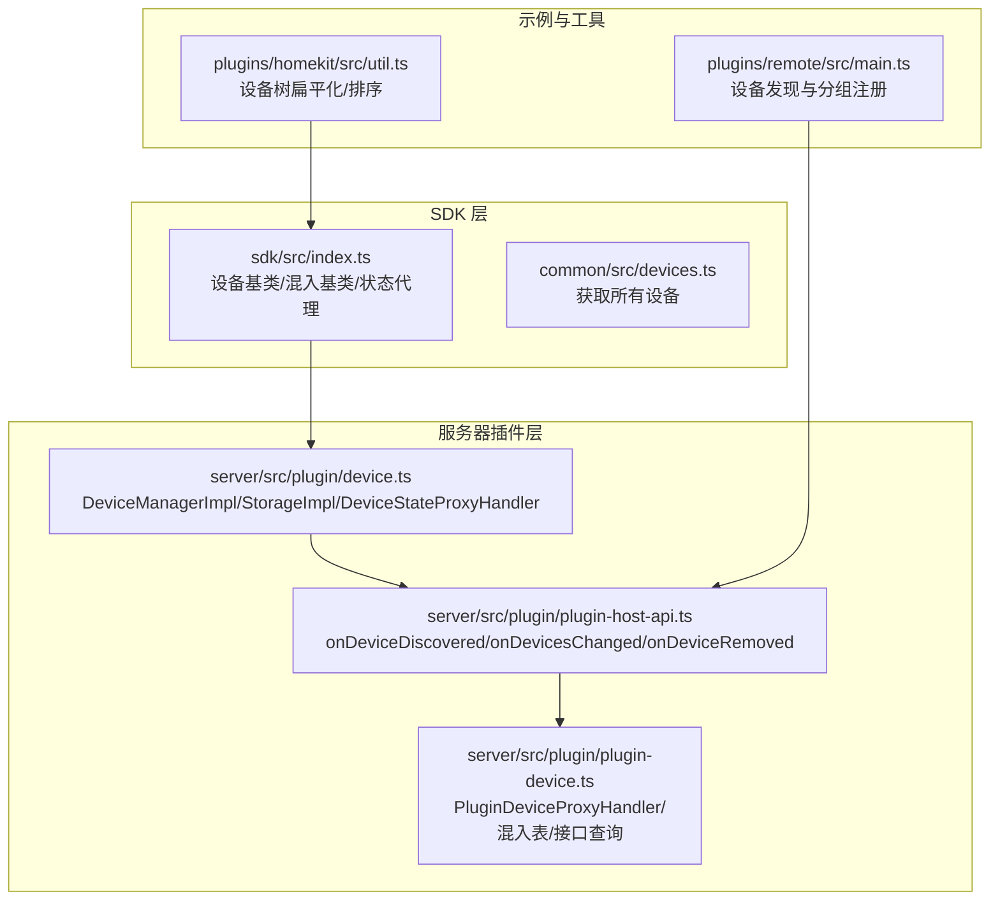
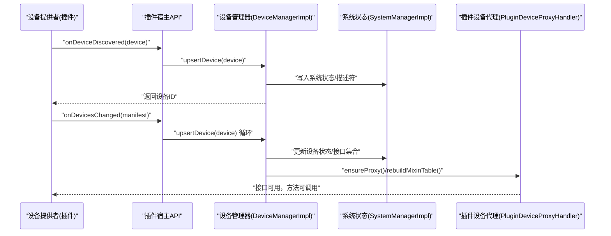
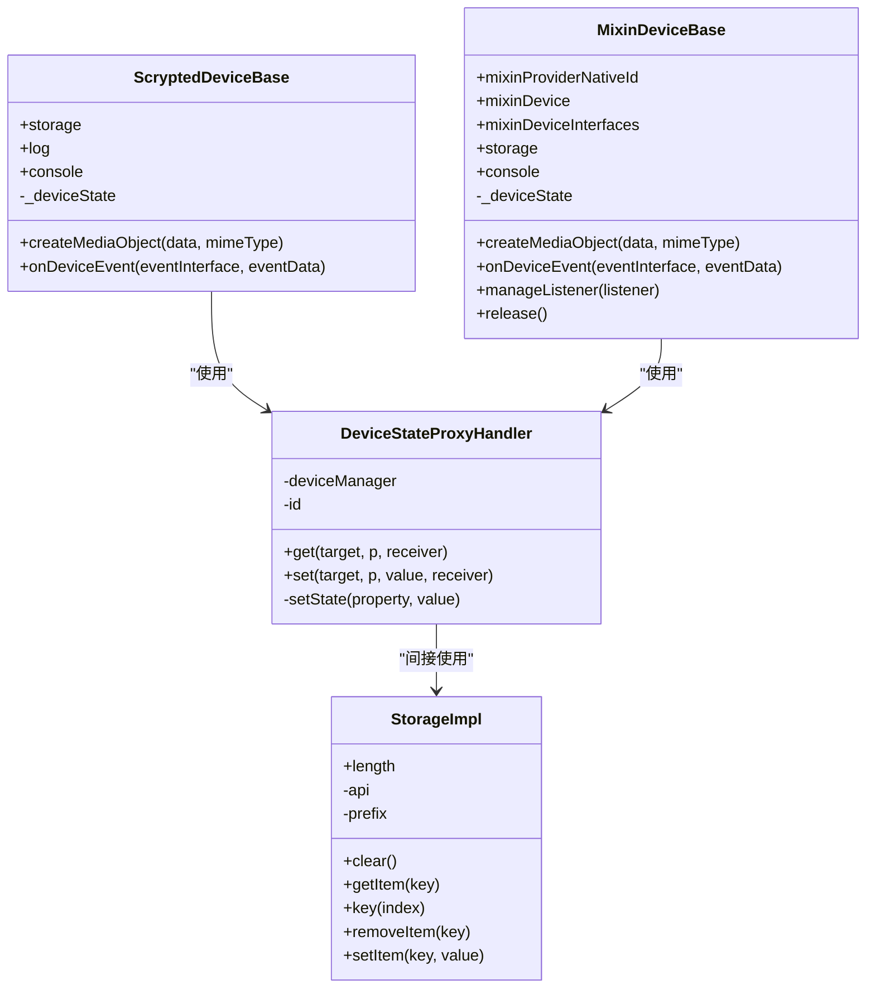
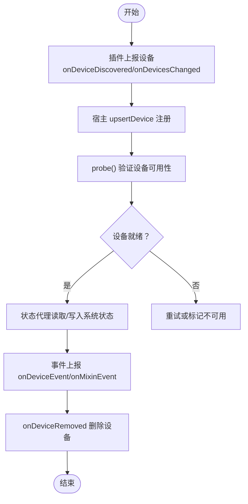
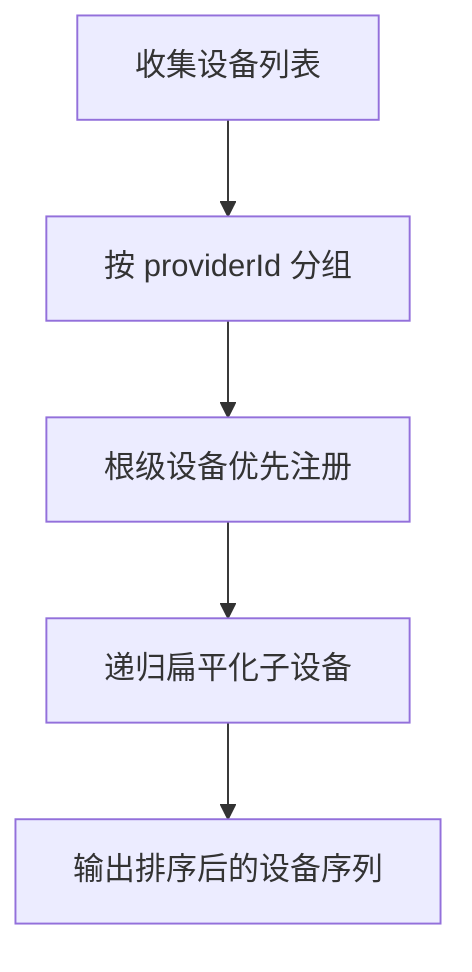
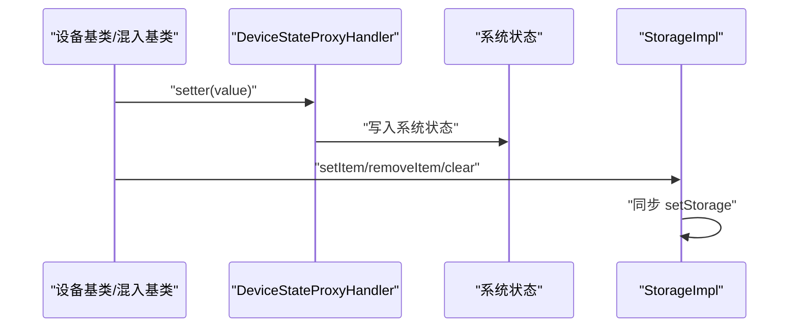
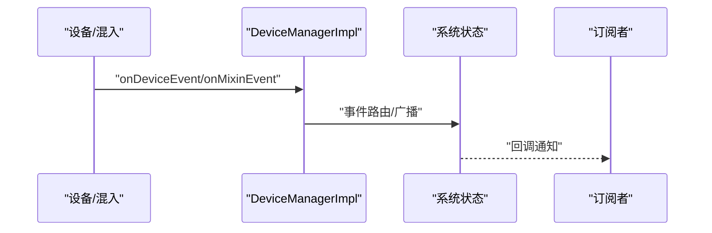
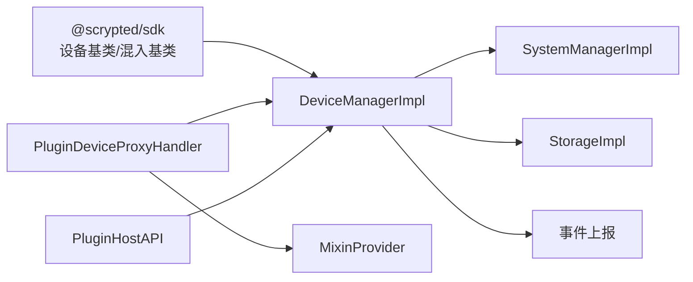

# 设备管理

<cite>
**本文引用的文件**
- [common/src/devices.ts](file://common/src/devices.ts)
- [sdk/src/index.ts](file://sdk/src/index.ts)
- [server/src/plugin/device.ts](file://server/src/plugin/device.ts)
- [server/src/plugin/plugin-device.ts](file://server/src/plugin/plugin-device.ts)
- [server/src/plugin/plugin-host-api.ts](file://server/src/plugin/plugin-host-api.ts)
- [plugins/remote/src/main.ts](file://plugins/remote/src/main.ts)
- [plugins/homekit/src/util.ts](file://plugins/homekit/src/util.ts)
- [sdk/types/scrypted_python/scrypted_sdk/types.py](file://sdk/types/scrypted_python/scrypted_sdk/types.py)
</cite>

## 目录
1. [简介](#简介)
2. [项目结构](#项目结构)
3. [核心组件](#核心组件)
4. [架构总览](#架构总览)
5. [详细组件分析](#详细组件分析)
6. [依赖分析](#依赖分析)
7. [性能考虑](#性能考虑)
8. [故障排查指南](#故障排查指南)
9. [结论](#结论)
10. [附录](#附录)

## 简介
本文件面向 Scrypted 的设备管理系统，系统性阐述设备抽象层设计、设备生命周期（发现、注册、状态跟踪、事件处理、移除）、设备类型分类与特殊处理、状态缓存与持久化、事件过滤与订阅、配置管理最佳实践，以及性能优化与故障诊断方法。文档以代码为依据，结合可视化图示帮助读者从高层到实现细节全面理解。

## 项目结构
围绕设备管理的关键模块分布如下：
- SDK 层：提供设备基类、混入基类、状态代理、日志与媒体对象创建等能力，统一对外暴露设备接口。
- 服务器插件层：实现设备管理器、设备状态代理、存储封装、事件上报与设备变更分发。
- 插件宿主层：负责设备发现、设备变更、设备移除的桥接与调用。
- 示例插件：演示设备发现与分组注册流程。
- 工具函数：提供设备树扁平化与排序工具，辅助设备组织与展示。

**图表来源**
- [sdk/src/index.ts:10-71](file://sdk/src/index.ts#L10-L71)
- [server/src/plugin/device.ts:86-170](file://server/src/plugin/device.ts#L86-L170)
- [server/src/plugin/plugin-device.ts:31-485](file://server/src/plugin/plugin-device.ts#L31-L485)
- [server/src/plugin/plugin-host-api.ts:135-160](file://server/src/plugin/plugin-host-api.ts#L135-L160)
- [plugins/remote/src/main.ts:288-318](file://plugins/remote/src/main.ts#L288-L318)
- [plugins/homekit/src/util.ts:12-43](file://plugins/homekit/src/util.ts#L12-L43)

**章节来源**
- [sdk/src/index.ts:10-71](file://sdk/src/index.ts#L10-L71)
- [server/src/plugin/device.ts:86-170](file://server/src/plugin/device.ts#L86-L170)
- [server/src/plugin/plugin-device.ts:31-485](file://server/src/plugin/plugin-device.ts#L31-L485)
- [server/src/plugin/plugin-host-api.ts:135-160](file://server/src/plugin/plugin-host-api.ts#L135-L160)
- [plugins/remote/src/main.ts:288-318](file://plugins/remote/src/main.ts#L288-L318)
- [plugins/homekit/src/util.ts:12-43](file://plugins/homekit/src/util.ts#L12-L43)

## 核心组件
- 设备基类与混入基类
  - 提供 storage、log、console 的延迟加载与设备状态访问。
  - 统一事件上报接口 onDeviceEvent/onMixinEvent。
  - 自动为状态属性生成 getter/setter，确保在发现后才可写入。
- 设备状态代理
  - 将设备状态读取与写入映射到系统状态，并通过 RPC setState 回传。
  - 写入时进行属性校验，保证类型安全。
- 存储封装
  - StorageImpl 实现浏览器 Storage 接口，支持前缀隔离（设备/混入）。
  - 持久化通过 setStorage 同步回插件宿主。
- 设备管理器
  - 负责设备发现、设备变更、事件上报、设备移除、日志与存储获取。
  - 提供 createDeviceState 以支持混入状态写入。
- 插件设备代理
  - 动态构建混入链表，按需加载混入提供者，合并接口集合。
  - 查询接口实现、方法分派、刷新与描述符更新。
- 插件宿主 API
  - onDeviceDiscovered/onDevicesChanged/onDeviceRemoved 将设备变更同步至系统。

**章节来源**
- [sdk/src/index.ts:10-71](file://sdk/src/index.ts#L10-L71)
- [server/src/plugin/device.ts:56-79](file://server/src/plugin/device.ts#L56-L79)
- [server/src/plugin/device.ts:105-114](file://server/src/plugin/device.ts#L105-L114)
- [server/src/plugin/device.ts:182-261](file://server/src/plugin/device.ts#L182-L261)
- [server/src/plugin/device.ts:158-169](file://server/src/plugin/device.ts#L158-L169)
- [server/src/plugin/plugin-device.ts:31-485](file://server/src/plugin/plugin-device.ts#L31-L485)
- [server/src/plugin/plugin-host-api.ts:135-160](file://server/src/plugin/plugin-host-api.ts#L135-L160)

## 架构总览
下图展示了从插件发起设备发现，到系统状态更新、事件广播与混入应用的完整流程。

**图表来源**
- [server/src/plugin/plugin-host-api.ts:152-156](file://server/src/plugin/plugin-host-api.ts#L152-L156)
- [server/src/plugin/plugin-host-api.ts:135-150](file://server/src/plugin/plugin-host-api.ts#L135-L150)
- [server/src/plugin/device.ts:158-169](file://server/src/plugin/device.ts#L158-L169)
- [server/src/plugin/plugin-device.ts:136-218](file://server/src/plugin/plugin-device.ts#L136-L218)

**章节来源**
- [server/src/plugin/plugin-host-api.ts:135-160](file://server/src/plugin/plugin-host-api.ts#L135-L160)
- [server/src/plugin/device.ts:158-169](file://server/src/plugin/device.ts#L158-L169)
- [server/src/plugin/plugin-device.ts:136-218](file://server/src/plugin/plugin-device.ts#L136-L218)

## 详细组件分析

### 设备抽象层与状态代理
- 设备基类与混入基类
  - 延迟初始化 storage/log/console，避免未就绪时的访问。
  - 通过状态属性 getter/setter 将读写映射到系统状态，写入前检查设备是否已发现。
  - 提供 onDeviceEvent/onMixinEvent 用于事件上报。
- 状态代理
  - DeviceStateProxyHandler 在 get 时从系统状态读取，在 set 时调用 setState 并写回系统状态。
  - 写入前进行属性校验，防止非法字段进入系统状态。
- 存储封装
  - StorageImpl 支持前缀隔离，区分设备存储与混入存储；clear/removeItem/setItem 会同步 setStorage。

**图表来源**
- [sdk/src/index.ts:10-71](file://sdk/src/index.ts#L10-L71)
- [sdk/src/index.ts:87-167](file://sdk/src/index.ts#L87-L167)
- [server/src/plugin/device.ts:56-79](file://server/src/plugin/device.ts#L56-L79)
- [server/src/plugin/device.ts:182-261](file://server/src/plugin/device.ts#L182-L261)

**章节来源**
- [sdk/src/index.ts:10-71](file://sdk/src/index.ts#L10-L71)
- [server/src/plugin/device.ts:56-79](file://server/src/plugin/device.ts#L56-L79)
- [server/src/plugin/device.ts:182-261](file://server/src/plugin/device.ts#L182-L261)

### 设备生命周期管理
- 发现与注册
  - 插件通过 onDeviceDiscovered/onDevicesChanged 上报设备，宿主调用 upsertDevice 完成注册。
  - 对于远程插件，先逐个注册顶层设备，再批量注册其余设备，避免父设备缺失导致的层级错乱。
- 状态跟踪
  - 设备状态通过系统状态映射，状态代理负责读取与写回。
  - 混入状态通过 createDeviceState 创建，写入由宿主转发到对应设备。
- 事件处理
  - onDeviceEvent/onMixinEvent 将事件上报给宿主，由系统进行路由与广播。
- 移除流程
  - onDeviceRemoved 触发删除插件设备条目，并触发后续清理。

**图表来源**
- [plugins/remote/src/main.ts:310-318](file://plugins/remote/src/main.ts#L310-L318)
- [server/src/plugin/plugin-host-api.ts:152-160](file://server/src/plugin/plugin-host-api.ts#L152-L160)
- [server/src/plugin/device.ts:158-169](file://server/src/plugin/device.ts#L158-L169)

**章节来源**
- [plugins/remote/src/main.ts:288-318](file://plugins/remote/src/main.ts#L288-L318)
- [server/src/plugin/plugin-host-api.ts:135-160](file://server/src/plugin/plugin-host-api.ts#L135-L160)
- [server/src/plugin/device.ts:158-169](file://server/src/plugin/device.ts#L158-L169)

### 设备类型分类与特殊处理
- 类型与显示
  - 通过工具函数对设备树进行扁平化与排序，确保根级设备优先于子设备，便于展示与组织。
- 分类建议
  - 摄像头/传感器/开关/安全设备等类型可通过 type 字段标识，并在混入中扩展相应接口集。
  - 对于需要特殊 UI 或行为的设备，可在混入中声明特定接口并实现对应方法。

**图表来源**
- [plugins/homekit/src/util.ts:27-43](file://plugins/homekit/src/util.ts#L27-L43)

**章节来源**
- [plugins/homekit/src/util.ts:12-43](file://plugins/homekit/src/util.ts#L12-L43)

### 设备状态管理机制
- 状态缓存
  - 系统状态保存在内存中，状态代理直接读取，降低 IO 开销。
- 变更通知
  - 写入时通过 setState 回调，触发系统状态更新与后续通知。
- 持久化策略
  - StorageImpl 在 setItem/removeItem/clear 后调用 setStorage 同步持久化。
  - 混入存储通过前缀区分，避免与设备存储冲突。

**图表来源**
- [server/src/plugin/device.ts:61-78](file://server/src/plugin/device.ts#L61-L78)
- [server/src/plugin/device.ts:240-260](file://server/src/plugin/device.ts#L240-L260)

**章节来源**
- [server/src/plugin/device.ts:61-78](file://server/src/plugin/device.ts#L61-L78)
- [server/src/plugin/device.ts:240-260](file://server/src/plugin/device.ts#L240-L260)

### 设备事件处理系统
- 过滤与路由
  - 事件通过 onDeviceEvent/onMixinEvent 上报，由系统进行路由与广播。
- 订阅机制
  - 插件设备代理提供 listen 方法，将事件转换为回调，便于上层订阅。

**图表来源**
- [server/src/plugin/device.ts:164-166](file://server/src/plugin/device.ts#L164-L166)
- [server/src/plugin/plugin-device.ts:337-339](file://server/src/plugin/plugin-device.ts#L337-L339)

**章节来源**
- [server/src/plugin/device.ts:164-166](file://server/src/plugin/device.ts#L164-L166)
- [server/src/plugin/plugin-device.ts:337-339](file://server/src/plugin/plugin-device.ts#L337-L339)

### 设备配置管理最佳实践
- 设置项定义
  - 使用 SDK 的设置混入接口定义设置项，结合接口描述符进行统一管理。
- 验证规则
  - 写入状态前进行属性校验，避免非法值进入系统状态。
- 默认值处理
  - 在首次写入或初始化时设置默认值，确保设备具备合理初始状态。

**章节来源**
- [sdk/src/index.ts:169-204](file://sdk/src/index.ts#L169-L204)
- [server/src/plugin/device.ts:71-78](file://server/src/plugin/device.ts#L71-L78)

## 依赖分析
- 组件耦合
  - SDK 设备基类依赖 DeviceManager/SystemManager/MediaManager；Server 端实现 DeviceManagerImpl。
  - 插件设备代理依赖混入提供者与系统状态，动态构建混入链。
- 外部依赖
  - 插件宿主 API 作为桥接层，连接插件与系统。
- 循环依赖
  - 通过接口与延迟初始化避免循环依赖问题。

**图表来源**
- [sdk/src/index.ts:10-71](file://sdk/src/index.ts#L10-L71)
- [server/src/plugin/device.ts:86-170](file://server/src/plugin/device.ts#L86-L170)
- [server/src/plugin/plugin-device.ts:31-485](file://server/src/plugin/plugin-device.ts#L31-L485)
- [server/src/plugin/plugin-host-api.ts:135-160](file://server/src/plugin/plugin-host-api.ts#L135-L160)

**章节来源**
- [sdk/src/index.ts:10-71](file://sdk/src/index.ts#L10-L71)
- [server/src/plugin/device.ts:86-170](file://server/src/plugin/device.ts#L86-L170)
- [server/src/plugin/plugin-device.ts:31-485](file://server/src/plugin/plugin-device.ts#L31-L485)
- [server/src/plugin/plugin-host-api.ts:135-160](file://server/src/plugin/plugin-host-api.ts#L135-L160)

## 性能考虑
- 状态访问
  - 使用状态代理直接读取系统状态，减少跨进程通信开销。
- 存储写入
  - 批量写入时尽量合并 setItem 操作，减少 setStorage 调用次数。
- 混入构建
  - 仅在需要时加载混入提供者，避免不必要的初始化成本。
- 事件处理
  - 事件路由集中化，避免重复广播与无效订阅。

## 故障排查指南
- 设备未发现
  - 检查 onDeviceDiscovered/onDevicesChanged 是否被正确调用，确认 upsertDevice 返回有效 ID。
- 状态无法写入
  - 确认设备已通过 onDeviceDiscovered/onDevicesChanged 注册，且状态代理已初始化。
- 存储异常
  - 检查 setItem/removeItem/clear 是否正确调用 setStorage，确认前缀隔离无冲突。
- 事件未到达
  - 确认 onDeviceEvent/onMixinEvent 调用路径，检查订阅者是否正确注册。

**章节来源**
- [server/src/plugin/plugin-host-api.ts:152-160](file://server/src/plugin/plugin-host-api.ts#L152-L160)
- [server/src/plugin/device.ts:182-261](file://server/src/plugin/device.ts#L182-L261)
- [server/src/plugin/device.ts:164-166](file://server/src/plugin/device.ts#L164-L166)

## 结论
Scrypted 的设备管理通过 SDK 抽象层与服务器插件层的协同，实现了对多协议、多品牌设备的统一接入与管理。其核心在于：
- 统一的设备基类与混入机制，屏蔽底层差异；
- 基于系统状态的状态代理与存储封装，确保一致性与持久化；
- 事件路由与订阅机制，支撑丰富的交互场景；
- 生命周期管理与混入链构建，满足设备类型多样化需求。

## 附录
- 获取所有设备
  - 通过 SystemManager 的系统状态遍历并获取设备实例，便于全量操作与监控。

**章节来源**
- [common/src/devices.ts:3-5](file://common/src/devices.ts#L3-L5)