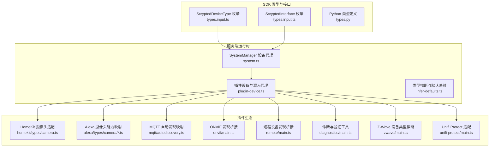
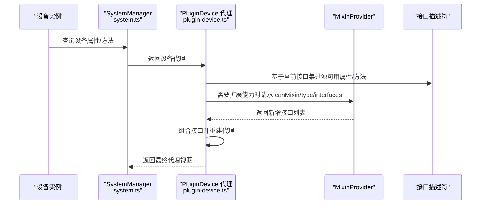
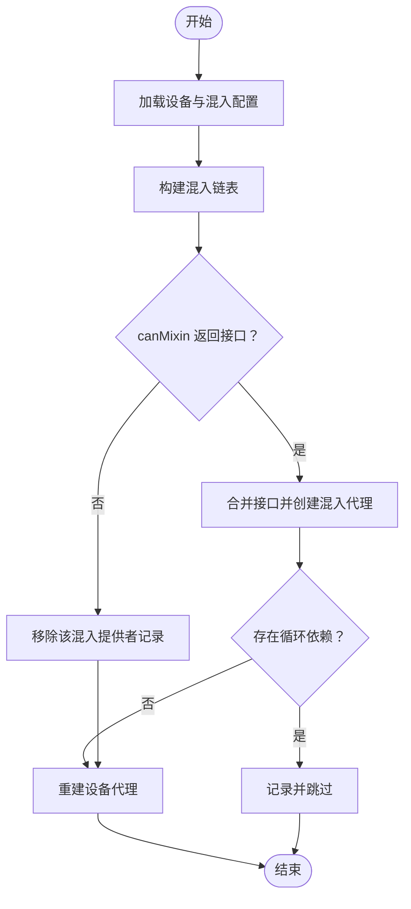
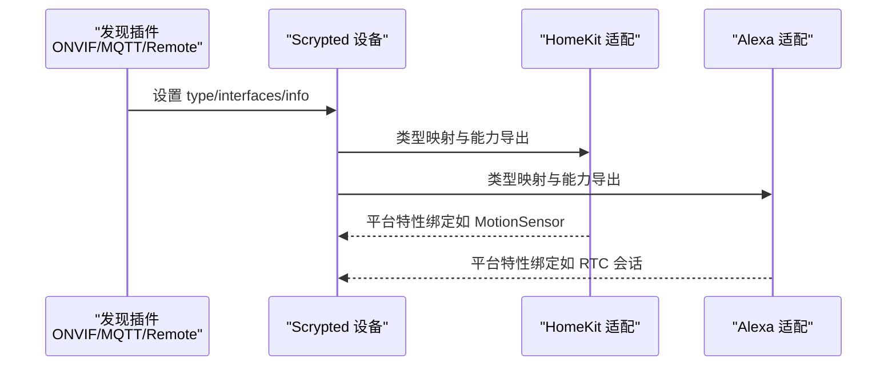
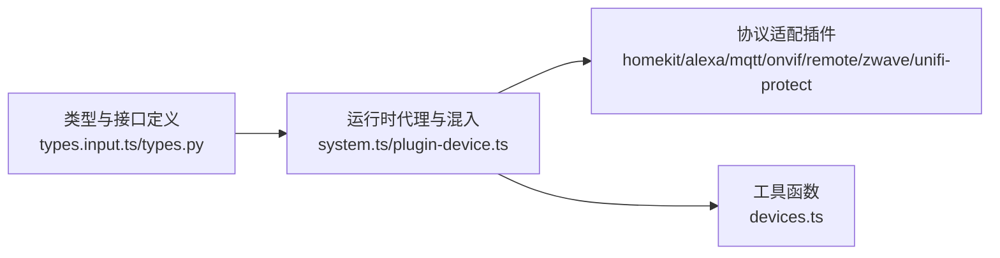

# 设备类型系统

<cite>
**本文引用的文件**
- [types.input.ts](file://sdk/types/src/types.input.ts)
- [types.py](file://sdk/types/scrypted_python/scrypted_sdk/types.py)
- [system.ts](file://server/src/plugin/system.ts)
- [plugin-device.ts](file://server/src/plugin/plugin-device.ts)
- [infer-defaults.ts](file://server/src/infer-defaults.ts)
- [mixin.ts](file://sdk/src/settings-mixin.ts)
- [settings-mixin.ts](file://common/src/settings-mixin.ts)
- [camera.ts（HomeKit）](file://plugins/homekit/src/types/camera.ts)
- [util.ts（HomeKit）](file://plugins/homekit/src/util.ts)
- [hap-utils.ts](file://plugins/homekit/src/hap-utils.ts)
- [camera.ts（Alexa）](file://plugins/alexa/src/types/camera.ts)
- [capabilities.ts（Alexa 摄像头）](file://plugins/alexa/src/types/camera/capabilities.ts)
- [main.ts（MQTT 自动发现）](file://plugins/mqtt/src/autodiscovery.ts)
- [main.ts（ONVIF 插件）](file://plugins/onvif/src/main.ts)
- [main.ts（远程插件）](file://plugins/remote/src/main.ts)
- [main.ts（诊断插件）](file://plugins/diagnostics/src/main.ts)
- [main.ts（Z-Wave 插件）](file://plugins/zwave/src/main.ts)
- [main.ts（Unifi Protect 插件）](file://plugins/unifi-protect/src/main.ts)
- [devices.ts](file://common/src/devices.ts)
</cite>

## 目录
1. [引言](#引言)
2. [项目结构](#项目结构)
3. [核心组件](#核心组件)
4. [架构总览](#架构总览)
5. [详细组件分析](#详细组件分析)
6. [依赖关系分析](#依赖关系分析)
7. [性能考量](#性能考量)
8. [故障排查指南](#故障排查指南)
9. [结论](#结论)
10. [附录：设备类型与接口速查](#附录设备类型与接口速查)

## 引言
本文件系统化梳理 Scrypted 的“设备类型系统”，围绕以下目标展开：
- 设备类型抽象层的设计原理与统一不同设备功能/属性的方法
- 设备类型分类体系与各主要类别的特点
- 设备功能接口的定义与实现（通用与特定）
- 设备类型继承与组合（混入）机制
- 设备类型转换与适配策略（协议/功能/属性映射）
- 设备类型注册与发现机制（动态扩展）
- 开发最佳实践与测试验证策略

## 项目结构
Scrypted 将“设备类型”与“接口”作为核心抽象，分别在 SDK 类型定义中集中管理，并由服务端运行时在系统态下进行代理、混入与事件分发；同时，生态插件负责具体协议适配、发现与桥接。

图示来源
- [types.input.ts:105-162](file://sdk/types/src/types.input.ts#L105-L162)
- [types.py:72-116](file://sdk/types/scrypted_python/scrypted_sdk/types.py#L72-L116)
- [system.ts:160-244](file://server/src/plugin/system.ts#L160-L244)
- [plugin-device.ts:31-200](file://server/src/plugin/plugin-device.ts#L31-L200)
- [infer-defaults.ts:1-17](file://server/src/infer-defaults.ts#L1-L17)
- [camera.ts（HomeKit）:15-281](file://plugins/homekit/src/types/camera.ts#L15-L281)
- [capabilities.ts（Alexa 摄像头）:116-126](file://plugins/alexa/src/types/camera/capabilities.ts#L116-L126)
- [autodiscovery.ts:97-129](file://plugins/mqtt/src/autodiscovery.ts#L97-L129)
- [main.ts（ONVIF 插件）:390-405](file://plugins/onvif/src/main.ts#L390-L405)
- [main.ts（远程插件）:256-318](file://plugins/remote/src/main.ts#L256-L318)
- [main.ts（诊断插件）:25-228](file://plugins/diagnostics/src/main.ts#L25-L228)
- [main.ts（Z-Wave 插件）:409-440](file://plugins/zwave/src/main.ts#L409-L440)
- [main.ts（Unifi Protect 插件）:526-539](file://plugins/unifi-protect/src/main.ts#L526-L539)

章节来源
- [types.input.ts:105-162](file://sdk/types/src/types.input.ts#L105-L162)
- [system.ts:160-244](file://server/src/plugin/system.ts#L160-L244)
- [plugin-device.ts:31-200](file://server/src/plugin/plugin-device.ts#L31-L200)

## 核心组件
- 设备类型枚举：统一设备分类，如摄像头、传感器、开关、门铃、显示/智能显示器、扬声器/智能扬声器、安全系统、温控、锁、水阀、百叶窗、空气净化器、网络/互联网、桥接、未知等。
- 接口集合：统一设备能力抽象，如 OnOff、Brightness、ColorSettingTemperature/Rgb/Hsv、Thermometer、HumiditySensor、Camera、VideoCamera、Microphone、AudioVolumeControl、Display、VideoCameraMask、VideoRecorder、PanTiltZoom、EventRecorder、VideoClips、VideoCameraConfiguration、Intercom、Lock、PasswordStore、Scene、Entry、EntrySensor、DeviceProvider、DeviceDiscovery、DeviceCreator、Battery、Charger、Reboot、Refresh、MediaPlayer、Online、BufferConverter、MediaConverter、Settings、BinarySensor、TamperSensor、Sleep、PowerSensor、AudioSensor、MotionSensor、AmbientLightSensor、OccupancySensor、FloodSensor、UltravioletSensor、LuminanceSensor、PositionSensor、SecuritySystem、PM10Sensor、PM25Sensor、VOCSensor、NOXSensor、CO2Sensor、AirQualitySensor、AirPurifier、FilterMaintenance、Readme、OauthClient、MixinProvider、HttpRequestHandler、EngineIOHandler、PushHandler、Program、Scriptable、ClusterForkInterface、ObjectDetector、ObjectDetection、ObjectDetectionPreview、ObjectDetectionGenerator、HumiditySetting、Fan、RTCSignalingChannel、RTCSignalingClient、LauncherApplication、ScryptedUser、VideoFrameGenerator、StreamService、TTY、TTYSettings、ChatCompletion、TextEmbedding、ImageEmbedding、LLMTools、ScryptedSystemDevice、ScryptedDeviceCreator、ScryptedSettings 等。
- 设备代理与系统管理：SystemManager 将设备属性与接口方法暴露为可观察、可调用的代理对象，按设备当前接口集动态呈现可用属性与方法。
- 混入与组合：PluginDevice 支持将 MixinProvider 动态注入到设备上，形成“叠加式”的能力组合，且具备循环检测与失效重建机制。
- 类型推断与默认映射：基于接口集合对设备类型进行推断与默认映射，例如将 MediaPlayer 映射到 Display/Speaker 等类型。

章节来源
- [types.input.ts:105-162](file://sdk/types/src/types.input.ts#L105-L162)
- [types.input.ts:2382-2486](file://sdk/types/src/types.input.ts#L2382-L2486)
- [system.ts:160-244](file://server/src/plugin/system.ts#L160-L244)
- [plugin-device.ts:31-200](file://server/src/plugin/plugin-device.ts#L31-L200)
- [infer-defaults.ts:1-17](file://server/src/infer-defaults.ts#L1-L17)

## 架构总览
Scrypted 的设备类型系统以“类型 + 接口”的双轴抽象为核心，通过运行时代理与混入机制实现“同一类型设备在不同协议下的统一能力表达”。

图示来源
- [system.ts:160-244](file://server/src/plugin/system.ts#L160-L244)
- [plugin-device.ts:136-218](file://server/src/plugin/plugin-device.ts#L136-L218)

## 详细组件分析

### 设备类型抽象层与统一机制
- 设备类型枚举集中定义于 SDK 类型文件，确保跨语言一致的类型语义。
- SystemManager 在运行时根据设备当前接口集动态呈现属性与方法，屏蔽底层协议差异。
- infer-defaults 提供从接口到类型的默认映射，保证设备在未显式设置类型时也能获得合理默认值。

章节来源
- [types.input.ts:105-162](file://sdk/types/src/types.input.ts#L105-L162)
- [system.ts:22-95](file://server/src/plugin/system.ts#L22-L95)
- [infer-defaults.ts:1-17](file://server/src/infer-defaults.ts#L1-L17)

### 设备类型分类体系与特点
- 摄像头/门铃：具备视频采集、音频、双向对讲、移动侦测、录制等能力，常与 HomeKit/Alexa 等平台对接。
- 传感器：温度、湿度、光照、占用、水浸、紫外线、空气质量、PM2.5/PM10、噪声等。
- 开关/灯/插座：OnOff/Brightness/ColorSettingTemperature/Rgb/Hsv 等。
- 安全设备：门锁、密码锁、安全系统、入侵/震动/倾倒传感器、门窗传感器等。
- 媒体播放器：Display/SmartDisplay/SmartSpeaker/Speaker 等，支持媒体输出与控制。
- 其他：风扇、温控、水阀、百叶窗、空气净化器、网络/互联网、桥接、未知等。

章节来源
- [types.input.ts:105-162](file://sdk/types/src/types.input.ts#L105-L162)
- [types.py:72-116](file://sdk/types/scrypted_python/scrypted_sdk/types.py#L72-L116)

### 设备功能接口定义与实现
- 通用接口：OnOff、Brightness、Thermometer、HumiditySensor、MotionSensor、AudioSensor、MediaPlayer、Online、Settings、Refresh、DeviceProvider、DeviceDiscovery、MixinProvider 等。
- 特定接口：Camera、VideoCamera、Microphone、AudioVolumeControl、Display、VideoCameraMask、VideoRecorder、PanTiltZoom、EventRecorder、VideoClips、VideoCameraConfiguration、Intercom、Lock、PasswordStore、Scene、Entry、EntrySensor、Battery、Charger、Reboot、BufferConverter、MediaConverter、BinarySensor、TamperSensor、Sleep、PowerSensor、AmbientLightSensor、OccupancySensor、FloodSensor、UltravioletSensor、LuminanceSensor、PositionSensor、SecuritySystem、PM10Sensor、PM25Sensor、VOCSensor、NOXSensor、CO2Sensor、AirQualitySensor、AirPurifier、FilterMaintenance、Readme、OauthClient、HttpRequestHandler、EngineIOHandler、PushHandler、Program、Scriptable、ClusterForkInterface、ObjectDetector、ObjectDetection、ObjectDetectionPreview、ObjectDetectionGenerator、HumiditySetting、Fan、RTCSignalingChannel、RTCSignalingClient、LauncherApplication、ScryptedUser、VideoFrameGenerator、StreamService、TTY、TTYSettings、ChatCompletion、TextEmbedding、ImageEmbedding、LLMTools、ScryptedSystemDevice、ScryptedDeviceCreator、ScryptedSettings 等。
- 实现方式：设备提供者实现具体协议，系统通过接口描述符将方法/属性暴露给上层。

章节来源
- [types.input.ts:2382-2486](file://sdk/types/src/types.input.ts#L2382-L2486)

### 设备类型继承与组合（混入）机制
- 混入提供者（MixinProvider）通过 canMixin 判定是否能为目标设备类型与现有接口集注入新接口。
- PluginDevice 负责构建“混入链表”，按顺序组合多个 MixinProvider 的能力，并在变更时重建代理。
- 循环依赖检测：通过遍历混入链判断是否存在回路，避免死循环。
- 失效与重建：当混入提供者不可用或返回不兼容接口时，自动移除并重建混入表。

图示来源
- [plugin-device.ts:136-218](file://server/src/plugin/plugin-device.ts#L136-L218)
- [mixin-cycle.ts:1-32](file://server/src/mixin/mixin-cycle.ts#L1-L32)

章节来源
- [plugin-device.ts:31-200](file://server/src/plugin/plugin-device.ts#L31-L200)
- [plugin-device.ts:220-279](file://server/src/plugin/plugin-device.ts#L220-L279)
- [mixin-cycle.ts:1-32](file://server/src/mixin/mixin-cycle.ts#L1-L32)

### 设备类型转换与适配策略
- 协议转换与发现：ONVIF、MQTT 自动发现、远程桥接等插件将外部设备映射为 Scrypted 设备，设置 type、interfaces、info 等元信息。
- 功能映射：HomeKit/Alexa 插件将 Scrypted 设备类型映射到平台能力模型，例如摄像头映射到 CAMERA/VIDEO_DOORBELL 等类别，或 Alexa 的摄像头能力集。
- 属性转换：通过 Settings/MixinSettings 将设备属性与 UI 设置项绑定，实现跨平台一致的用户界面体验。

图示来源
- [main.ts（ONVIF 插件）:390-405](file://plugins/onvif/src/main.ts#L390-L405)
- [autodiscovery.ts:97-129](file://plugins/mqtt/src/autodiscovery.ts#L97-L129)
- [main.ts（远程插件）:256-318](file://plugins/remote/src/main.ts#L256-L318)
- [camera.ts（HomeKit）:15-281](file://plugins/homekit/src/types/camera.ts#L15-L281)
- [capabilities.ts（Alexa 摄像头）:116-126](file://plugins/alexa/src/types/camera/capabilities.ts#L116-L126)

章节来源
- [main.ts（ONVIF 插件）:390-405](file://plugins/onvif/src/main.ts#L390-L405)
- [autodiscovery.ts:97-129](file://plugins/mqtt/src/autodiscovery.ts#L97-L129)
- [main.ts（远程插件）:256-318](file://plugins/remote/src/main.ts#L256-L318)
- [camera.ts（HomeKit）:15-281](file://plugins/homekit/src/types/camera.ts#L15-L281)
- [capabilities.ts（Alexa 摄像头）:116-126](file://plugins/alexa/src/types/camera/capabilities.ts#L116-L126)

### 设备类型注册与发现机制
- 设备提供者（DeviceProvider）通过 onDeviceDiscovered/onDevicesChanged 注册设备，设置 nativeId、providerNativeId、type、interfaces、info 等。
- 远程插件支持从远端系统拉取设备清单并进行过滤与重定向。
- ONVIF 插件通过广播/组播响应进行设备发现。
- MQTT 插件通过 Home Assistant MQTT Autodiscovery 主题解析设备类型与接口。
- Z-Wave/Unifi Protect 等插件通过各自协议解析设备命令类与值 ID，推断设备类型并注册。

章节来源
- [main.ts（远程插件）:256-318](file://plugins/remote/src/main.ts#L256-L318)
- [main.ts（ONVIF 插件）:390-405](file://plugins/onvif/src/main.ts#L390-L405)
- [autodiscovery.ts:97-129](file://plugins/mqtt/src/autodiscovery.ts#L97-L129)
- [main.ts（Z-Wave 插件）:409-440](file://plugins/zwave/src/main.ts#L409-L440)
- [main.ts（Unifi Protect 插件）:526-539](file://plugins/unifi-protect/src/main.ts#L526-L539)

### 设备类型开发最佳实践
- 类型与接口选择：优先使用标准接口，避免过度自定义；必要时通过 MixinProvider 扩展能力。
- 混入设计：确保 canMixin 的判定逻辑稳定，避免频繁变更导致混入链反复重建。
- 设置与 UI：使用 Settings/MixinSettings 提供统一的设置入口，便于 HomeKit/Alexa 等平台映射。
- 性能优化：减少不必要的属性监听与事件风暴，使用 denoise/watch 等选项降低开销。
- 兼容性：遵循 infer-defaults 的默认映射规则，避免与平台期望类型冲突。

章节来源
- [plugin-device.ts:220-279](file://server/src/plugin/plugin-device.ts#L220-L279)
- [mixin.ts:1-28](file://sdk/src/settings-mixin.ts#L1-L28)
- [settings-mixin.ts:1-29](file://common/src/settings-mixin.ts#L1-L29)

### 测试与验证策略
- 诊断插件提供系统与设备级验证流程，包括 NVR 插件检查、检测插件执行设备检查、通知器测试、摄像头流测试等。
- 使用 deviceFilter 限制可选设备类型，便于针对性验证。
- 通过 onDeviceEvent/onMixinEvent 触发事件路径验证，结合日志与控制台输出定位问题。

章节来源
- [main.ts（诊断插件）:25-228](file://plugins/diagnostics/src/main.ts#L25-L228)

## 依赖关系分析
- 类型与接口：types.input.ts 与 types.py 提供一致的类型与接口定义，确保 TypeScript 与 Python 生态一致性。
- 运行时：system.ts 与 plugin-device.ts 负责设备代理与混入组合，依赖接口描述符与状态管理。
- 插件：HomeKit/Alexa/MQTT/ONVIF/Remote/Z-Wave/Unifi Protect 等插件通过发现与适配实现协议到类型的映射。
- 工具：devices.ts 提供系统内设备遍历辅助函数。

图示来源
- [types.input.ts:105-162](file://sdk/types/src/types.input.ts#L105-L162)
- [types.py:72-116](file://sdk/types/scrypted_python/scrypted_sdk/types.py#L72-L116)
- [system.ts:160-244](file://server/src/plugin/system.ts#L160-L244)
- [plugin-device.ts:31-200](file://server/src/plugin/plugin-device.ts#L31-L200)
- [devices.ts:1-6](file://common/src/devices.ts#L1-L6)

章节来源
- [types.input.ts:105-162](file://sdk/types/src/types.input.ts#L105-L162)
- [system.ts:160-244](file://server/src/plugin/system.ts#L160-L244)
- [plugin-device.ts:31-200](file://server/src/plugin/plugin-device.ts#L31-L200)
- [devices.ts:1-6](file://common/src/devices.ts#L1-L6)

## 性能考量
- 混入链长度与重建成本：混入数量过多或频繁变更会导致代理重建开销增大，应尽量保持稳定的混入策略。
- 事件风暴抑制：使用 EventListenerOptions 的 denoise/watch 选项，避免轮询与重复事件带来的性能损耗。
- 接口过滤：SystemManager 仅暴露当前接口集内的属性与方法，减少无效访问。
- 缓存与懒加载：设备状态与混入代理采用懒加载与缓存策略，降低初始化成本。

## 故障排查指南
- 设备类型不正确：检查 infer-defaults 的映射与设备实际接口，必要时手动 setType。
- 混入失败或循环：查看混入链与循环检测日志，确认 canMixin 返回值与混入提供者可用性。
- 平台映射异常：核对 HomeKit/Alexa 的类型映射与能力导出，确保接口齐全。
- 发现失败：检查 ONVIF/MQTT/远程桥接插件的日志与网络连通性。

章节来源
- [infer-defaults.ts:1-17](file://server/src/infer-defaults.ts#L1-L17)
- [plugin-device.ts:50-85](file://server/src/plugin/plugin-device.ts#L50-L85)
- [camera.ts（HomeKit）:15-281](file://plugins/homekit/src/types/camera.ts#L15-L281)
- [capabilities.ts（Alexa 摄像头）:116-126](file://plugins/alexa/src/types/camera/capabilities.ts#L116-L126)
- [main.ts（ONVIF 插件）:390-405](file://plugins/onvif/src/main.ts#L390-L405)
- [autodiscovery.ts:97-129](file://plugins/mqtt/src/autodiscovery.ts#L97-L129)
- [main.ts（远程插件）:256-318](file://plugins/remote/src/main.ts#L256-L318)

## 结论
Scrypted 的设备类型系统通过“类型 + 接口”的双轴抽象，配合运行时代理与混入机制，实现了对多协议设备的统一建模与能力表达。借助标准化的类型枚举、接口集合与平台适配插件，开发者可以快速扩展新的设备类型与协议支持，同时通过诊断与验证工具保障稳定性与兼容性。

## 附录：设备类型与接口速查
- 设备类型（部分）：Camera、Doorbell、Sensor、Switch、Outlet、Light、Fan、Thermostat、Lock、PasswordControl、Display、SmartDisplay、Speaker、SmartSpeaker、MediaPlayer、SecuritySystem、Vacuum、Notifier、Irrigation、Valve、WindowCovering、AirPurifier、Internet、Network、Bridge、Unknown、Internal、Builtin、API、Buttons、DataSource、DeviceProvider、Event、Entry、Garage、Scene、Program、Automation、RemoteDesktop、Person、LLM 等。
- 接口（部分）：OnOff、Brightness、ColorSettingTemperature、ColorSettingRgb、ColorSettingHsv、Thermometer、HumiditySensor、MotionSensor、AudioSensor、OccupancySensor、FloodSensor、UltravioletSensor、LuminanceSensor、PositionSensor、PM10Sensor、PM25Sensor、VOCSensor、NOXSensor、CO2Sensor、AirQualitySensor、AirPurifier、FilterMaintenance、Camera、VideoCamera、Microphone、AudioVolumeControl、Display、VideoCameraMask、VideoRecorder、PanTiltZoom、EventRecorder、VideoClips、VideoCameraConfiguration、Intercom、Lock、PasswordStore、Scene、Entry、EntrySensor、DeviceProvider、DeviceDiscovery、DeviceCreator、Battery、Charger、Reboot、Refresh、Online、BufferConverter、MediaConverter、Settings、BinarySensor、TamperSensor、Sleep、PowerSensor、Sensors、StartStop、Pause、Dock、TemperatureSetting、HumiditySetting、Fan、RTCSignalingChannel、RTCSignalingClient、LauncherApplication、ScryptedUser、VideoFrameGenerator、StreamService、TTY、TTYSettings、ChatCompletion、TextEmbedding、ImageEmbedding、LLMTools、ScryptedSystemDevice、ScryptedDeviceCreator、ScryptedSettings 等。

章节来源
- [types.input.ts:105-162](file://sdk/types/src/types.input.ts#L105-L162)
- [types.input.ts:2382-2486](file://sdk/types/src/types.input.ts#L2382-L2486)
- [types.py:72-116](file://sdk/types/scrypted_python/scrypted_sdk/types.py#L72-L116)
- [types.py:116-218](file://sdk/types/scrypted_python/scrypted_sdk/types.py#L116-L218)