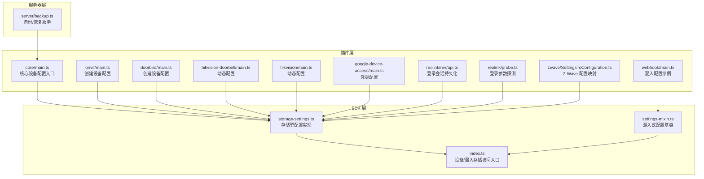
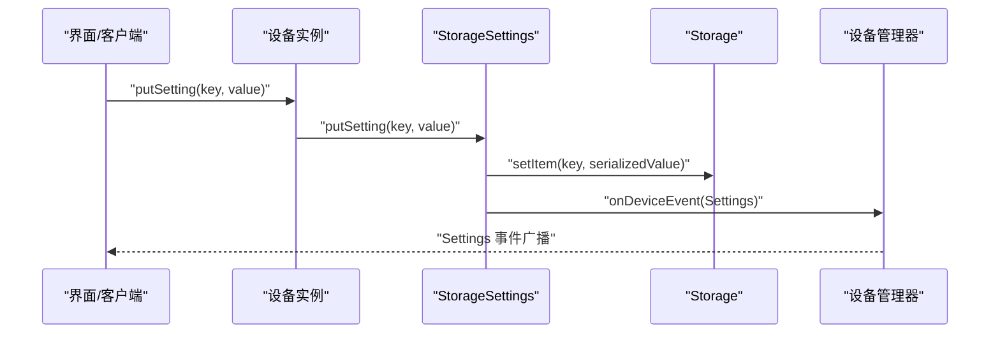
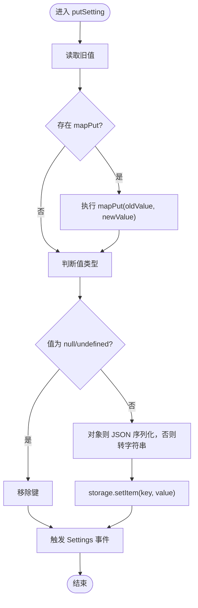
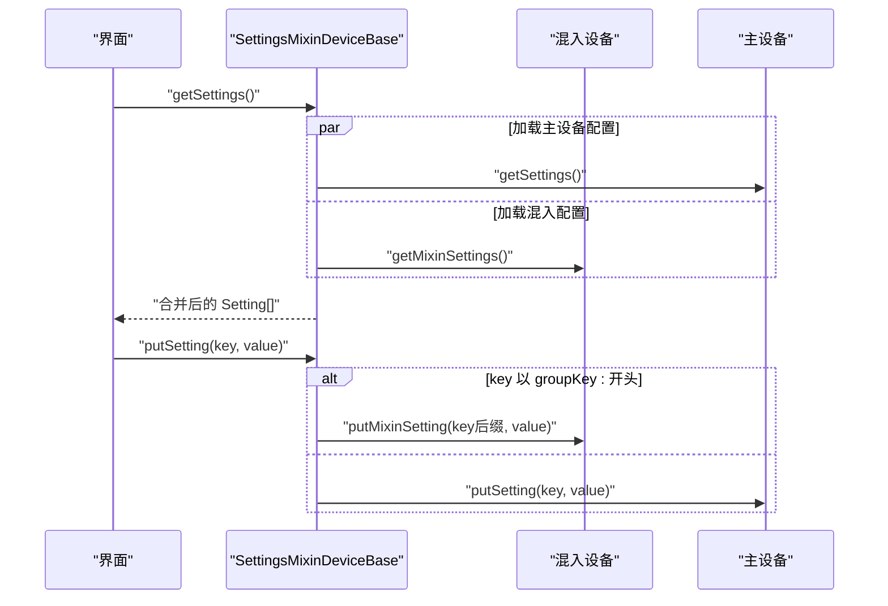
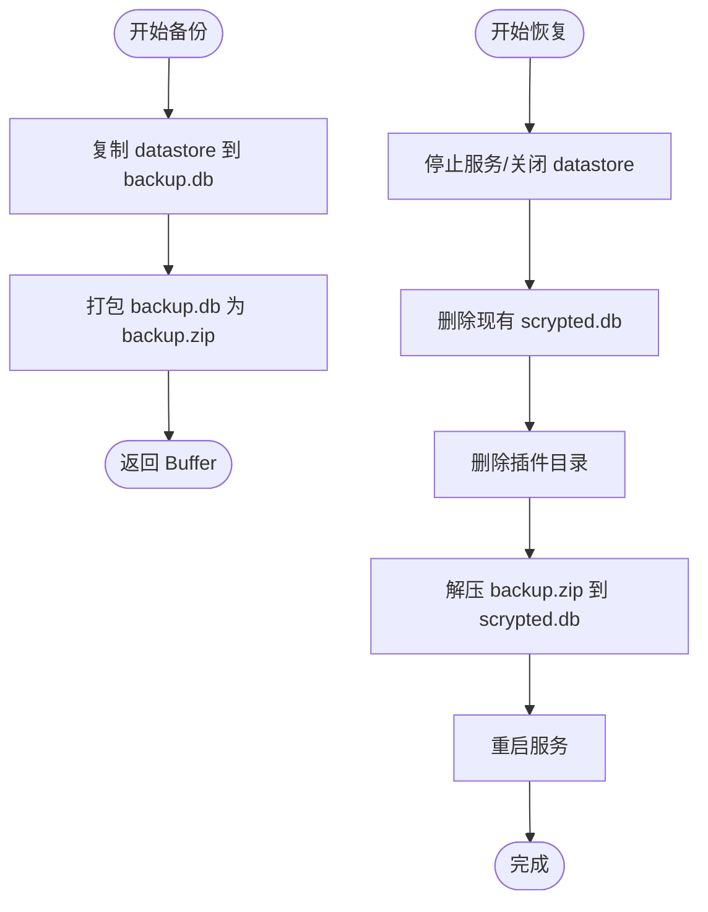
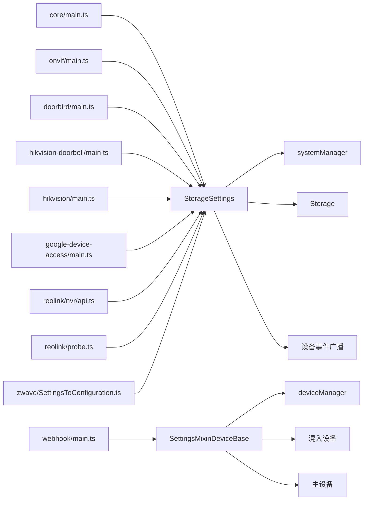

# 设备配置管理

<cite>
**本文引用的文件**   
- [storage-settings.ts](file://sdk/src/storage-settings.ts)
- [settings-mixin.ts](file://sdk/src/settings-mixin.ts)
- [settings-mixin.ts（common）](file://common/src/settings-mixin.ts)
- [index.ts](file://sdk/src/index.ts)
- [main.ts（core 插件）](file://plugins/core/src/main.ts)
- [main.ts（webhook 插件）](file://plugins/webhook/src/main.ts)
- [main.ts（onvif 插件）](file://plugins/onvif/src/main.ts)
- [main.ts（doorbird 插件）](file://plugins/doorbird/src/main.ts)
- [main.ts（hikvision 门铃插件）](file://plugins/hikvision-doorbell/src/main.ts)
- [main.ts（hikvision 插件）](file://plugins/hikvision/src/main.ts)
- [main.ts（google-device-access 插件）](file://plugins/google-device-access/src/main.ts)
- [api.ts（reolink NVR）](file://plugins/reolink/src/nvr/api.ts)
- [probe.ts（reolink）](file://plugins/reolink/src/probe.ts)
- [credentials-settings.ts（common）](file://common/src/credentials-settings.ts)
- [backup.ts（server）](file://server/src/services/backup.ts)
- [SettingsToConfiguration.ts（zwave）](file://plugins/zwave/src/CommandClasses/SettingsToConfiguration.ts)
</cite>

## 目录
1. [简介](#简介)
2. [项目结构](#项目结构)
3. [核心组件](#核心组件)
4. [架构总览](#架构总览)
5. [详细组件分析](#详细组件分析)
6. [依赖关系分析](#依赖关系分析)
7. [性能考量](#性能考量)
8. [故障排查指南](#故障排查指南)
9. [结论](#结论)
10. [附录：API 接口与最佳实践](#附录api-接口与最佳实践)

## 简介
本文件系统性梳理 Scrypted 的设备配置管理系统，覆盖数据模型与存储机制、配置读取/写入/变更通知、层次化配置（全局/设备/用户）、验证与约束、导入导出与备份恢复、安全与访问控制、以及 API 使用与最佳实践。目标是帮助开发者与运维人员在不深入源码的情况下，也能高效理解并正确使用配置管理能力。

## 项目结构
配置管理相关代码主要分布在以下位置：
- SDK 层：通用的配置抽象与存储封装（SDK 源码）
- 插件层：各设备/服务插件对配置的声明、读取、写入与事件通知
- 服务器层：备份与恢复服务，实现配置的导入导出与迁移

**图表来源**
- [storage-settings.ts:81-196](file://sdk/src/storage-settings.ts#L81-L196)
- [settings-mixin.ts:10-86](file://sdk/src/settings-mixin.ts#L10-L86)
- [index.ts:20-25](file://sdk/src/index.ts#L20-L25)
- [main.ts（core 插件）:282-294](file://plugins/core/src/main.ts#L282-L294)
- [main.ts（webhook 插件）:28-48](file://plugins/webhook/src/main.ts#L28-L48)
- [main.ts（onvif 插件）:545-578](file://plugins/onvif/src/main.ts#L545-L578)
- [main.ts（doorbird 插件）:710-739](file://plugins/doorbird/src/main.ts#L710-L739)
- [main.ts（hikvision 门铃插件）:848-872](file://plugins/hikvision-doorbell/src/main.ts#L848-L872)
- [main.ts（hikvision 插件）:530-552](file://plugins/hikvision/src/main.ts#L530-L552)
- [main.ts（google-device-access 插件）:556-577](file://plugins/google-device-access/src/main.ts#L556-L577)
- [api.ts（reolink NVR）:215-225](file://plugins/reolink/src/nvr/api.ts#L215-L225)
- [probe.ts（reolink）:53-99](file://plugins/reolink/src/probe.ts#L53-L99)
- [SettingsToConfiguration.ts（zwave）:5-73](file://plugins/zwave/src/CommandClasses/SettingsToConfiguration.ts#L5-L73)
- [backup.ts（server）:12-75](file://server/src/services/backup.ts#L12-L75)

**章节来源**
- [storage-settings.ts:1-196](file://sdk/src/storage-settings.ts#L1-L196)
- [settings-mixin.ts:1-87](file://sdk/src/settings-mixin.ts#L1-L87)
- [index.ts:1-297](file://sdk/src/index.ts#L1-L297)

## 核心组件
- 存储型配置（StorageSettings）
  - 提供统一的配置项定义、类型解析、默认值处理、事件通知与持久化写入
  - 支持 onGet/onPut/mapPut/mapGet 等扩展钩子，便于动态生成或转换配置
- 混入式配置（SettingsMixinDeviceBase）
  - 将“主设备配置”与“混入配置”合并展示，自动为混入键加上前缀，避免冲突
  - 写入时区分主设备与混入设置，分别路由到对应 putSetting
- 设备/混入存储访问入口（SDK 入口）
  - 通过设备/混入的 storage 属性访问本地持久化存储，实现键空间隔离
- 备份/恢复服务（Backup）
  - 基于 LevelDB 数据库进行全量备份与恢复，支持配置迁移

**章节来源**
- [storage-settings.ts:81-196](file://sdk/src/storage-settings.ts#L81-L196)
- [settings-mixin.ts:10-86](file://sdk/src/settings-mixin.ts#L10-L86)
- [index.ts:20-25](file://sdk/src/index.ts#L20-L25)
- [backup.ts（server）:9-76](file://server/src/services/backup.ts#L9-L76)

## 架构总览
配置管理采用“声明式配置 + 存储型实现 + 事件驱动”的架构模式：
- 配置声明：插件通过 getSettings/getCreateDeviceSettings/getMixinSettings 等方法返回 Setting[]
- 存储实现：StorageSettings 负责从 Storage 读取/写入键值，解析类型与默认值
- 事件通知：写入后触发 Settings 事件，UI/其他组件可订阅
- 层次化：设备配置、用户配置、全局配置通过不同存储键空间隔离；混入配置通过前缀隔离

**图表来源**
- [storage-settings.ts:154-177](file://sdk/src/storage-settings.ts#L154-L177)
- [index.ts:68-70](file://sdk/src/index.ts#L68-L70)

**章节来源**
- [storage-settings.ts:129-177](file://sdk/src/storage-settings.ts#L129-L177)
- [index.ts:68-70](file://sdk/src/index.ts#L68-L70)

## 详细组件分析

### 存储型配置（StorageSettings）
- 数据模型与类型解析
  - 支持布尔、数字、整数、数组、设备引用、JSON 字符串等类型
  - defaultValue/persistedDefaultValue 提供默认值回退策略
  - mapPut/mapGet 可在写入/读取时进行自定义转换
- 存储机制
  - 对象值序列化为 JSON；nullish 值移除键，避免存储异常
  - 通过 device.storage 或 mixin storage 实现键空间隔离
- 事件通知
  - 写入成功后触发 Settings 事件，用于刷新 UI 或触发副作用

**图表来源**
- [storage-settings.ts:162-177](file://sdk/src/storage-settings.ts#L162-L177)

**章节来源**
- [storage-settings.ts:5-58](file://sdk/src/storage-settings.ts#L5-L58)
- [storage-settings.ts:81-196](file://sdk/src/storage-settings.ts#L81-L196)

### 混入式配置（SettingsMixinDeviceBase）
- 合并主设备与混入配置
  - 主设备配置直接透传；混入配置统一加前缀 groupKey:
  - 组名 group 未设置时使用混入组名
- 写入路由
  - 以 groupKey: 开头的键交由 putMixinSetting 处理；否则走主设备 putSetting
- 错误兜底
  - 若加载失败，注入只读错误项提示

**图表来源**
- [settings-mixin.ts:25-81](file://sdk/src/settings-mixin.ts#L25-L81)
- [settings-mixin.ts（common）:26-82](file://common/src/settings-mixin.ts#L26-L82)

**章节来源**
- [settings-mixin.ts:10-86](file://sdk/src/settings-mixin.ts#L10-L86)
- [settings-mixin.ts（common）:11-87](file://common/src/settings-mixin.ts#L11-L87)

### 设备/混入存储访问入口（SDK）
- 设备存储：通过 deviceManager.getDeviceStorage 获取
- 混入存储：通过 deviceManager.getMixinStorage 获取，键空间为 id:suffix
- 日志/控制台：通过 deviceManager.getDeviceConsole/getMixinConsole 获取

**章节来源**
- [index.ts:20-25](file://sdk/src/index.ts#L20-L25)
- [index.ts:116-123](file://sdk/src/index.ts#L116-L123)
- [index.ts:125-134](file://sdk/src/index.ts#L125-L134)

### 配置层次与优先级
- 设备配置：存储于设备自身的 storage，键空间隔离
- 混入配置：存储于混入专用 storage，键空间为 id:suffix
- 用户配置：可通过用户设备或用户服务实现，结合 admin 权限控制可见性
- 全局配置：可通过系统组件或服务实现，如核心服务地址、更新通道等

**章节来源**
- [index.ts:20-25](file://sdk/src/index.ts#L20-L25)
- [index.ts:116-123](file://sdk/src/index.ts#L116-L123)
- [main.ts（core 插件）:282-294](file://plugins/core/src/main.ts#L282-L294)

### 配置验证与约束检查
- 插件侧声明式校验
  - 在 getCreateDeviceSettings 中定义字段类型、占位符、描述、分组等
  - 示例：用户名/密码、IP/端口、布尔开关、高级选项等
- 运行时约束
  - onGet 可动态调整配置项属性（如隐藏、choices、默认值）
  - mapPut 可在写入前进行格式化或范围检查
- 动态配置
  - 根据设备状态或外部条件动态增删配置项（如 ONVIF/Hikvision 的两步音频/PTZ 等）

**章节来源**
- [main.ts（onvif 插件）:545-578](file://plugins/onvif/src/main.ts#L545-L578)
- [main.ts（doorbird 插件）:710-739](file://plugins/doorbird/src/main.ts#L710-L739)
- [main.ts（hikvision 门铃插件）:848-872](file://plugins/hikvision-doorbell/src/main.ts#L848-L872)
- [main.ts（hikvision 插件）:530-552](file://plugins/hikvision/src/main.ts#L530-L552)
- [storage-settings.ts:129-152](file://sdk/src/storage-settings.ts#L129-L152)
- [storage-settings.ts:162-177](file://sdk/src/storage-settings.ts#L162-L177)

### 导入导出与备份恢复
- 备份
  - 复制运行时 datastore（LevelDB）为临时备份数据库
  - 打包为 zip 返回二进制
- 恢复
  - 关闭服务、删除现有数据库与插件目录
  - 解压恢复数据库，重启服务

**图表来源**
- [backup.ts（server）:12-75](file://server/src/services/backup.ts#L12-L75)

**章节来源**
- [backup.ts（server）:9-76](file://server/src/services/backup.ts#L9-L76)

### 安全管理与敏感信息保护
- 凭据配置模板
  - 提供用户名/密码的标准配置项，便于统一管理
- OAuth/令牌持久化
  - 登录参数与会话信息可持久化，减少重复认证
- 访问控制
  - 管理员用户可查看/修改更全面的配置项（如隐藏/显示策略）
- 加密存储
  - 当前实现基于本地存储；建议在需要时对敏感字段进行应用层加密或使用系统级加密卷

**章节来源**
- [credentials-settings.ts（common）:11-36](file://common/src/credentials-settings.ts#L11-L36)
- [main.ts（google-device-access 插件）:556-577](file://plugins/google-device-access/src/main.ts#L556-L577)
- [api.ts（reolink NVR）:215-225](file://plugins/reolink/src/nvr/api.ts#L215-L225)
- [main.ts（core 插件）:31-47](file://plugins/core/src/main.ts#L31-L47)

## 依赖关系分析
- StorageSettings 依赖：
  - SDK 的 systemManager（设备引用解析）
  - 设备/混入的 storage
  - 设备事件广播（Settings 事件）
- SettingsMixinDeviceBase 依赖：
  - 设备管理器（deviceManager）进行事件广播
  - 混入设备与主设备的 getSettings/putSetting
- 插件侧依赖：
  - 各插件通过 getSettings/getCreateDeviceSettings/getMixinSettings 声明配置
  - 通过 storage/item* 方法读写配置

**图表来源**
- [storage-settings.ts:1-10](file://sdk/src/storage-settings.ts#L1-L10)
- [settings-mixin.ts:3-4](file://sdk/src/settings-mixin.ts#L3-L4)
- [main.ts（core 插件）:282-294](file://plugins/core/src/main.ts#L282-L294)
- [main.ts（webhook 插件）:28-48](file://plugins/webhook/src/main.ts#L28-L48)
- [main.ts（onvif 插件）:545-578](file://plugins/onvif/src/main.ts#L545-L578)
- [main.ts（doorbird 插件）:710-739](file://plugins/doorbird/src/main.ts#L710-L739)
- [main.ts（hikvision 门铃插件）:848-872](file://plugins/hikvision-doorbell/src/main.ts#L848-L872)
- [main.ts（hikvision 插件）:530-552](file://plugins/hikvision/src/main.ts#L530-L552)
- [main.ts（google-device-access 插件）:556-577](file://plugins/google-device-access/src/main.ts#L556-L577)
- [api.ts（reolink NVR）:215-225](file://plugins/reolink/src/nvr/api.ts#L215-L225)
- [probe.ts（reolink）:53-99](file://plugins/reolink/src/probe.ts#L53-L99)
- [SettingsToConfiguration.ts（zwave）:5-73](file://plugins/zwave/src/CommandClasses/SettingsToConfiguration.ts#L5-L73)

**章节来源**
- [storage-settings.ts:1-10](file://sdk/src/storage-settings.ts#L1-L10)
- [settings-mixin.ts:3-4](file://sdk/src/settings-mixin.ts#L3-L4)

## 性能考量
- 类型解析与序列化
  - 数组/对象写入前序列化，读取时反序列化；应避免频繁大对象写入
- 事件风暴
  - 多处 putSetting 触发 Settings 事件，批量写入建议合并或去抖
- 默认值回退
  - persistedDefaultValue 会在首次读取时写入持久化，避免重复计算
- 存储键空间
  - 混入存储键空间隔离，避免命名冲突；合理选择 suffix

[本节为通用指导，无需特定文件引用]

## 故障排查指南
- 配置项不显示或被隐藏
  - 检查 hide/onGet 动态隐藏逻辑
  - 确认 getSettings 返回的 Setting[] 是否包含该键
- 写入无效或丢失
  - 检查 noStore、mapPut、nullish 值是否导致移除键
  - 确认键空间是否正确（设备 vs 混入）
- 事件未触发
  - 确认写入路径是否经过 StorageSettings.putSetting
  - 检查 hide 标记是否导致事件抑制
- 凭据/令牌异常
  - 检查凭据配置项是否存在且类型正确
  - 对于 OAuth/令牌，确认持久化是否过期或参数是否匹配

**章节来源**
- [storage-settings.ts:129-177](file://sdk/src/storage-settings.ts#L129-L177)
- [settings-mixin.ts:73-81](file://sdk/src/settings-mixin.ts#L73-L81)
- [credentials-settings.ts（common）:11-36](file://common/src/credentials-settings.ts#L11-L36)

## 结论
Scrypted 的配置管理以“声明式 + 存储型 + 事件驱动”为核心，通过 StorageSettings 与 SettingsMixinDeviceBase 提供一致的配置体验，结合插件侧的动态配置与服务器侧的备份恢复，形成完整的配置生命周期管理。建议在实际开发中充分利用 onGet/onPut/mapPut/mapGet 等钩子，遵循键空间隔离与事件通知规范，确保配置的一致性与可观测性。

[本节为总结，无需特定文件引用]

## 附录：API 接口与最佳实践

### API 接口清单
- 配置读取
  - getSettings(): Promise<Setting[]>
  - getItem(key): any
- 配置写入
  - putSetting(key: string, value: SettingValue): Promise<void>
- 配置监听
  - Settings 事件：写入后触发，UI/其他组件可订阅
- 混入配置
  - getMixinSettings(): Promise<Setting[]>
  - putMixinSetting(key: string, value: SettingValue): Promise<boolean|void>
  - putSetting(key: string, value: SettingValue): Promise<void>（内部路由）

**章节来源**
- [storage-settings.ts:129-196](file://sdk/src/storage-settings.ts#L129-L196)
- [settings-mixin.ts:22-81](file://sdk/src/settings-mixin.ts#L22-L81)
- [index.ts:68-70](file://sdk/src/index.ts#L68-L70)

### 最佳实践
- 明确配置层次
  - 设备配置用于设备专属参数；混入配置用于扩展功能；用户/全局配置用于系统级参数
- 合理使用默认值
  - 使用 defaultValue/persistedDefaultValue 提供回退；避免在 onGet 中频繁写入
- 类型与校验
  - 在 getSettings 中严格声明类型与约束；必要时在 mapPut 中做预处理
- 事件与副作用
  - 写入后触发 Settings 事件；若需副作用，放在 onPut 中或监听 Settings 事件
- 安全与迁移
  - 凭据与令牌建议持久化；定期使用备份/恢复进行迁移与灾难恢复

[本节为通用指导，无需特定文件引用]