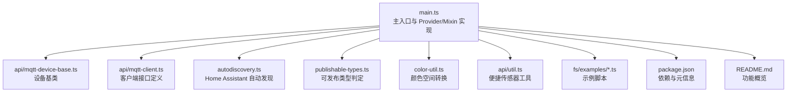
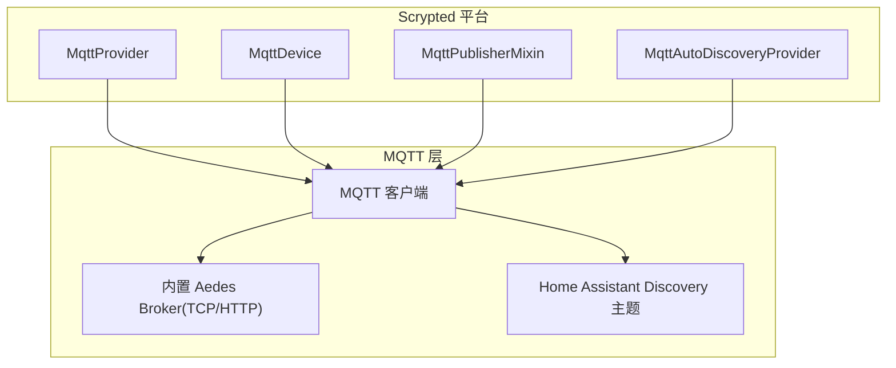
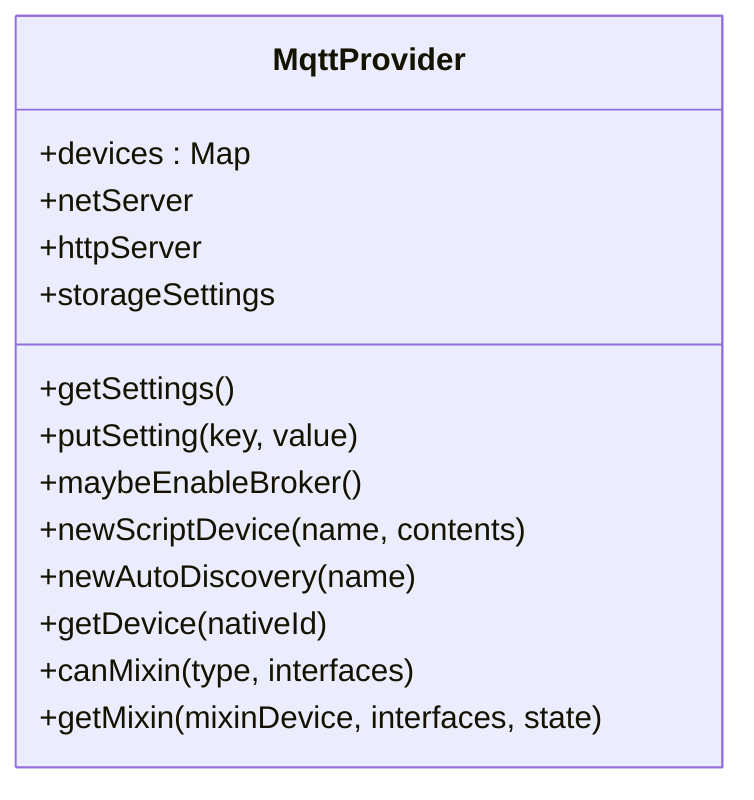
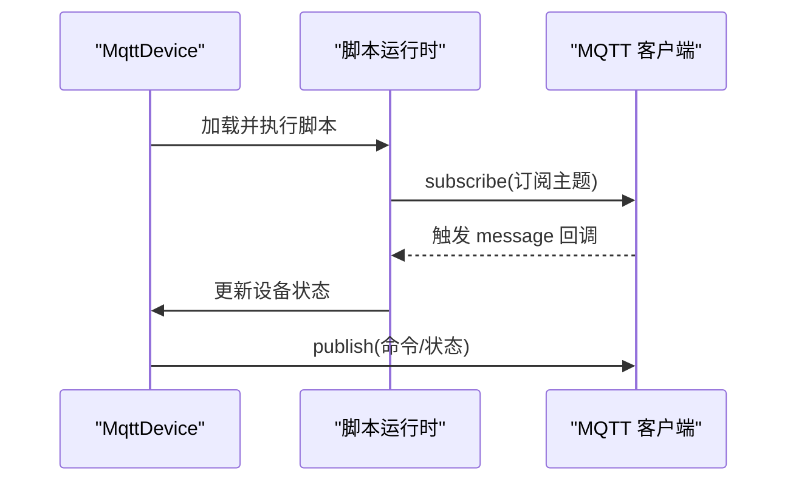
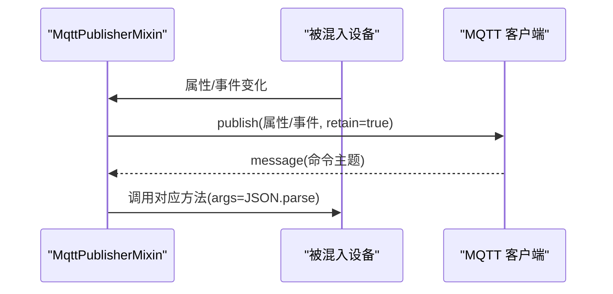
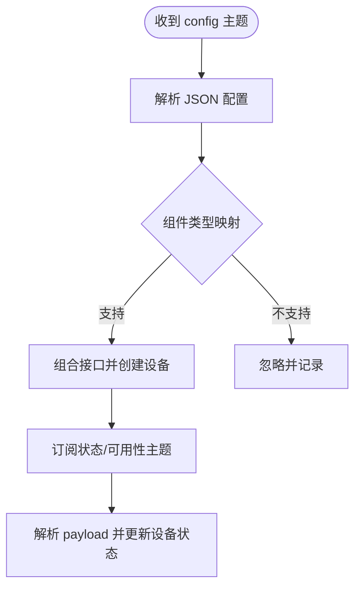
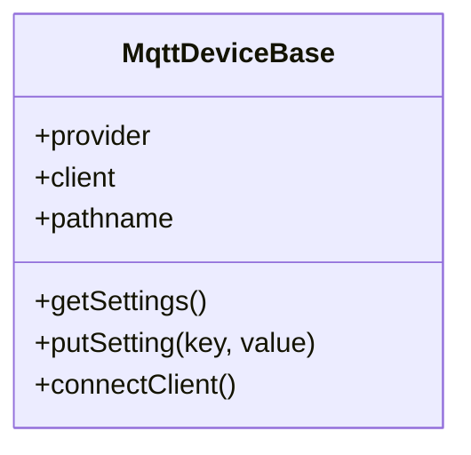
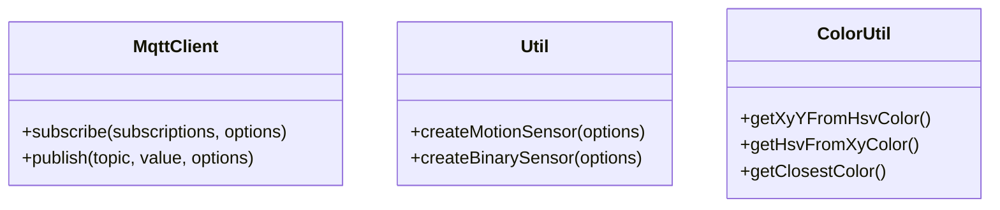
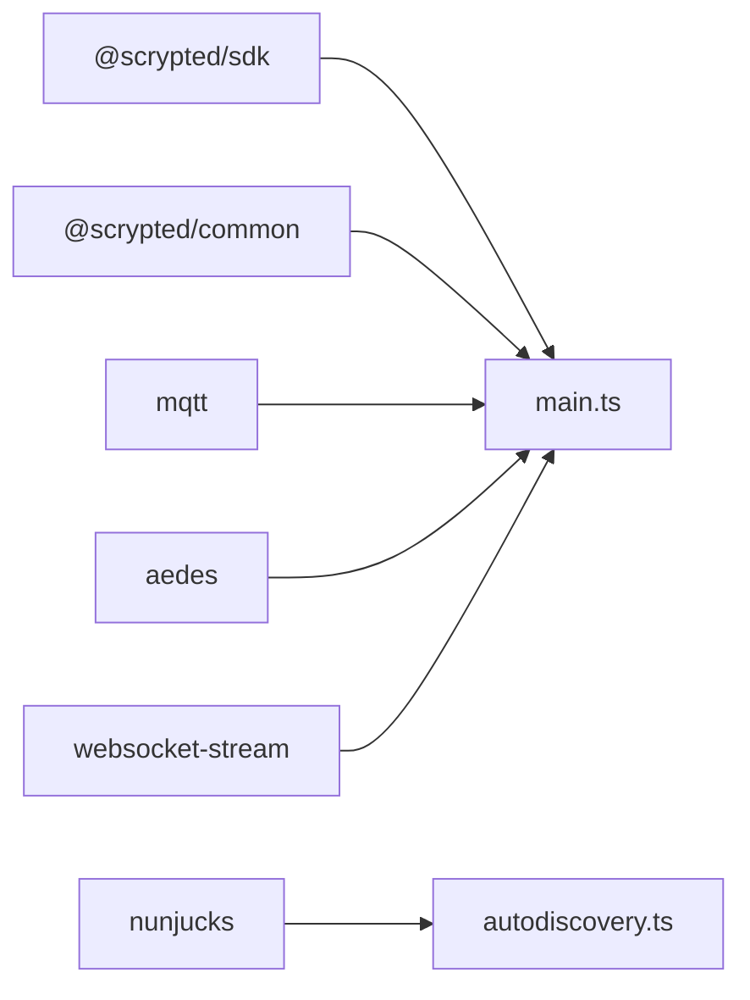

# MQTT 协议适配器

<cite>
**本文引用的文件**   
- [plugins/mqtt/src/main.ts](file://plugins/mqtt/src/main.ts)
- [plugins/mqtt/src/autodiscovery.ts](file://plugins/mqtt/src/autodiscovery.ts)
- [plugins/mqtt/src/api/mqtt-client.ts](file://plugins/mqtt/src/api/mqtt-client.ts)
- [plugins/mqtt/src/api/mqtt-device-base.ts](file://plugins/mqtt/src/api/mqtt-device-base.ts)
- [plugins/mqtt/src/api/util.ts](file://plugins/mqtt/src/api/util.ts)
- [plugins/mqtt/src/publishable-types.ts](file://plugins/mqtt/src/publishable-types.ts)
- [plugins/mqtt/src/color-util.ts](file://plugins/mqtt/src/color-util.ts)
- [plugins/mqtt/fs/examples/loopback-light.ts](file://plugins/mqtt/fs/examples/loopback-light.ts)
- [plugins/mqtt/fs/examples/button.ts](file://plugins/mqtt/fs/examples/button.ts)
- [plugins/mqtt/fs/examples/motion-sensor.ts](file://plugins/mqtt/fs/examples/motion-sensor.ts)
- [plugins/mqtt/README.md](file://plugins/mqtt/README.md)
- [plugins/mqtt/package.json](file://plugins/mqtt/package.json)
</cite>

## 目录
1. [简介](#简介)
2. [项目结构](#项目结构)
3. [核心组件](#核心组件)
4. [架构总览](#架构总览)
5. [详细组件分析](#详细组件分析)
6. [依赖关系分析](#依赖关系分析)
7. [性能考虑](#性能考虑)
8. [故障排除指南](#故障排除指南)
9. [结论](#结论)
10. [附录](#附录)

## 简介
本技术文档面向 Scrypted 的 MQTT 协议适配器，系统性阐述其在物联网通信中的实现与使用方式，覆盖以下关键主题：
- MQTT 客户端与服务端：连接建立、断线重连、心跳与日志记录
- 主题订阅与消息发布：主题路径拼接、消息解析（文本/JSON/Buffer）、QoS 与保留消息
- 设备状态更新：事件监听、属性变更上报、Home Assistant 自动发现与双向映射
- 设备基类与混入：MqttDeviceBase、MqttPublisherMixin 的职责与交互
- 配置参数：Broker 开关、外部 Broker、认证信息、端口设置
- 安全与权限：TLS 认证、用户名密码、ACL（基于内置 Aedes）
- 集成示例：Home Assistant MQTT Discovery、IoT 传感器数据上报
- 故障排除：连接失败、消息丢失、主题订阅异常等

## 项目结构
该插件位于 plugins/mqtt，核心源码集中在 src 目录，包含主入口、自动发现、API 接口、工具函数与示例脚本。

**图表来源**
- [plugins/mqtt/src/main.ts:349-619](file://plugins/mqtt/src/main.ts#L349-L619)
- [plugins/mqtt/src/api/mqtt-device-base.ts:6-102](file://plugins/mqtt/src/api/mqtt-device-base.ts#L6-L102)
- [plugins/mqtt/src/api/mqtt-client.ts:1-21](file://plugins/mqtt/src/api/mqtt-client.ts#L1-L21)
- [plugins/mqtt/src/autodiscovery.ts:76-209](file://plugins/mqtt/src/autodiscovery.ts#L76-L209)
- [plugins/mqtt/src/publishable-types.ts:1-39](file://plugins/mqtt/src/publishable-types.ts#L1-L39)
- [plugins/mqtt/src/color-util.ts:1-345](file://plugins/mqtt/src/color-util.ts#L1-L345)
- [plugins/mqtt/src/api/util.ts:1-64](file://plugins/mqtt/src/api/util.ts#L1-L64)
- [plugins/mqtt/package.json:1-48](file://plugins/mqtt/package.json#L1-L48)
- [plugins/mqtt/README.md:1-9](file://plugins/mqtt/README.md#L1-L9)

**章节来源**
- [plugins/mqtt/src/main.ts:349-619](file://plugins/mqtt/src/main.ts#L349-L619)
- [plugins/mqtt/README.md:1-9](file://plugins/mqtt/README.md#L1-L9)
- [plugins/mqtt/package.json:1-48](file://plugins/mqtt/package.json#L1-L48)

## 核心组件
- MqttProvider：提供者与设置界面，支持内置 Aedes Broker 启用/禁用、外部 Broker 切换、用户名密码认证、TCP/HTTP 端口配置；负责设备发现与脚本设备创建。
- MqttDevice：脚本化设备，封装 MQTT 客户端，提供 subscribe/publish 能力，绑定脚本以响应消息与执行命令。
- MqttPublisherMixin：混入设备，将 Scrypted 设备的状态与事件自动发布到 MQTT，同时订阅命令主题以接收外部控制指令。
- MqttAutoDiscoveryProvider：订阅 Home Assistant Discovery 主题，自动发现并组合设备接口，完成双向状态同步。
- MqttDeviceBase：通用 MQTT 基类，统一连接逻辑、路径拼接与设置项。
- API 接口与工具：MqttClient 接口、便捷传感器工具、颜色空间转换工具。

**章节来源**
- [plugins/mqtt/src/main.ts:349-619](file://plugins/mqtt/src/main.ts#L349-L619)
- [plugins/mqtt/src/api/mqtt-device-base.ts:6-102](file://plugins/mqtt/src/api/mqtt-device-base.ts#L6-L102)
- [plugins/mqtt/src/api/mqtt-client.ts:1-21](file://plugins/mqtt/src/api/mqtt-client.ts#L1-L21)
- [plugins/mqtt/src/autodiscovery.ts:76-209](file://plugins/mqtt/src/autodiscovery.ts#L76-L209)
- [plugins/mqtt/src/api/util.ts:1-64](file://plugins/mqtt/src/api/util.ts#L1-L64)

## 架构总览
MQTT 适配器同时承担“客户端”和“服务端”的角色：
- 作为客户端：订阅外部或内置 Broker 的主题，解析消息并驱动设备状态；发布设备状态与事件。
- 作为服务端：内置 Aedes Broker，提供 TCP/HTTP 接入，支持认证与日志预览。
- 自动发现：订阅 Home Assistant Discovery 主题，动态创建设备并映射接口。

**图表来源**
- [plugins/mqtt/src/main.ts:349-619](file://plugins/mqtt/src/main.ts#L349-L619)
- [plugins/mqtt/src/autodiscovery.ts:76-209](file://plugins/mqtt/src/autodiscovery.ts#L76-L209)

## 详细组件分析

### 组件一：MqttProvider（提供者与 Broker 管理）
- 职责
  - 提供设置项：启用内置 Broker、外部 Broker 地址、用户名/密码、TCP/HTTP 端口。
  - 内置 Broker：根据配置启动 Aedes，支持用户名密码认证回调；监听 TCP/HTTP 端口；对发布消息进行日志预览。
  - 设备管理：脚本设备与自动发现设备的创建与缓存；混入能力判定与实例化。
- 连接策略
  - 设备特定 URL > 外部 Broker（当内置未启用）> 内置 Broker（默认路径含设备 id）。
- 关键行为
  - 变更 Broker 相关设置时自动重启服务；触发设置事件以刷新 UI。
  - 新建脚本设备与自动发现设备后通过通知提示用户继续配置。

**图表来源**
- [plugins/mqtt/src/main.ts:349-619](file://plugins/mqtt/src/main.ts#L349-L619)

**章节来源**
- [plugins/mqtt/src/main.ts:349-619](file://plugins/mqtt/src/main.ts#L349-L619)

### 组件二：MqttDevice（脚本化 MQTT 设备）
- 职责
  - 将脚本注入到运行时，暴露 mqtt.subscribe/mqtt.publish 等 API。
  - 在脚本中订阅主题并解析消息（text/json/buffer），更新设备状态；向主题发布命令。
- 生命周期
  - 初始化时加载脚本，绑定后执行；错误时输出告警到控制台。
- 路径拼接
  - 所有 publish/subscribe 主题均基于 pathname（来自 URL 或默认路径）。

**图表来源**
- [plugins/mqtt/src/main.ts:33-155](file://plugins/mqtt/src/main.ts#L33-L155)

**章节来源**
- [plugins/mqtt/src/main.ts:33-155](file://plugins/mqtt/src/main.ts#L33-L155)

### 组件三：MqttPublisherMixin（设备状态发布与命令订阅）
- 职责
  - 将设备的属性与事件自动发布到 MQTT（retain 标记用于状态持久）。
  - 订阅命令主题，解析 JSON 参数并调用设备对应方法。
  - 支持 Home Assistant Discovery：首次连接时发布配置，监听 homeassistant/status 以重发。
- 连接与路径
  - 优先使用设备设置的 URL；否则使用外部 Broker；最后回退到内置 Broker。
- 错误处理
  - 对未知主题与方法进行告警，避免崩溃。

**图表来源**
- [plugins/mqtt/src/main.ts:160-347](file://plugins/mqtt/src/main.ts#L160-L347)

**章节来源**
- [plugins/mqtt/src/main.ts:160-347](file://plugins/mqtt/src/main.ts#L160-L347)

### 组件四：MqttAutoDiscoveryProvider（Home Assistant 自动发现）
- 职责
  - 订阅 homeassistant/**/config，解析设备配置，动态创建设备并组合接口。
  - 将设备接口映射为 Home Assistant 组件（如 switch/light/sensor/lock 等）。
- 映射规则
  - 基于 typeMap 将组件类型映射到 Scrypted 接口集合；按配置中的 color_mode 动态添加 HSV/色温接口。
- 状态同步
  - 依据配置中的 state_topic/availability 等字段订阅并更新设备状态；支持模板渲染与亮度缩放。

**图表来源**
- [plugins/mqtt/src/autodiscovery.ts:76-209](file://plugins/mqtt/src/autodiscovery.ts#L76-L209)

**章节来源**
- [plugins/mqtt/src/autodiscovery.ts:76-209](file://plugins/mqtt/src/autodiscovery.ts#L76-L209)

### 组件五：MqttDeviceBase（通用设备基类）
- 职责
  - 统一连接逻辑：根据设置选择 URL/外部 Broker/内置 Broker，拼接 pathname。
  - 提供设置项：订阅 URL、用户名、密码。
- 连接与事件
  - 连接成功/断开/错误事件日志输出；setMaxListeners 防止内存泄漏。

**图表来源**
- [plugins/mqtt/src/api/mqtt-device-base.ts:6-102](file://plugins/mqtt/src/api/mqtt-device-base.ts#L6-L102)

**章节来源**
- [plugins/mqtt/src/api/mqtt-device-base.ts:6-102](file://plugins/mqtt/src/api/mqtt-device-base.ts#L6-L102)

### 组件六：API 接口与工具
- MqttClient 接口
  - subscribe：订阅主题映射，回调接收 text/json/buffer。
  - publish：发布消息，支持 retain 选项。
- 便捷工具
  - createMotionSensor/createBinarySensor：基于 createSensor 封装常用传感器模式。
- 颜色工具
  - HSV/XY/RGB 与色域映射、最近点投影，支持 Hue 不同色域模型。

**图表来源**
- [plugins/mqtt/src/api/mqtt-client.ts:1-21](file://plugins/mqtt/src/api/mqtt-client.ts#L1-L21)
- [plugins/mqtt/src/api/util.ts:1-64](file://plugins/mqtt/src/api/util.ts#L1-L64)
- [plugins/mqtt/src/color-util.ts:1-345](file://plugins/mqtt/src/color-util.ts#L1-L345)

**章节来源**
- [plugins/mqtt/src/api/mqtt-client.ts:1-21](file://plugins/mqtt/src/api/mqtt-client.ts#L1-L21)
- [plugins/mqtt/src/api/util.ts:1-64](file://plugins/mqtt/src/api/util.ts#L1-L64)
- [plugins/mqtt/src/color-util.ts:1-345](file://plugins/mqtt/src/color-util.ts#L1-L345)

## 依赖关系分析
- 外部库
  - mqtt：MQTT 客户端库，提供连接、订阅、发布、事件处理。
  - aedes + websocket-stream：内置 MQTT Broker，支持 TCP 与 WebSocket。
  - nunjucks：模板渲染，用于 Home Assistant Discovery 配置与命令 payload。
- 内部模块
  - @scrypted/sdk：设备接口、类型、系统管理器、事件注册等。
  - @scrypted/common：脚本运行时与编译工具。

**图表来源**
- [plugins/mqtt/src/main.ts:1-18](file://plugins/mqtt/src/main.ts#L1-L18)
- [plugins/mqtt/package.json:33-39](file://plugins/mqtt/package.json#L33-L39)

**章节来源**
- [plugins/mqtt/package.json:33-39](file://plugins/mqtt/package.json#L33-L39)

## 性能考虑
- 连接与事件
  - 使用 setMaxListeners(Infinity) 以支持多主题订阅，但需注意在大量设备场景下可能增加内存占用。
- 发布策略
  - retain 标记用于状态持久化，减少新订阅者等待时间；但需合理清理过期状态。
- 模板渲染
  - Home Assistant Discovery 中的模板渲染在消息到达时执行，建议避免复杂计算与大对象序列化。
- Broker 性能
  - 内置 Aedes 在开发/小规模场景足够；生产环境建议使用独立高可用 Broker。

[本节为通用指导，无需具体文件引用]

## 故障排除指南
- 连接失败
  - 检查 Broker 地址与端口设置；确认用户名/密码正确；若使用外部 Broker，确保内置 Broker 未冲突。
  - 查看 Provider 设置变更是否触发了 Broker 重启。
- 断线重连
  - 客户端会持续尝试连接；若认证失败，Aedes 会拒绝连接。检查认证回调与凭据。
- 消息丢失
  - 确认主题路径拼接是否正确（pathname 前缀）；检查 retain 标记与 QoS 设置。
  - 对于 Home Assistant Discovery，确认 config 主题格式与 unique_id 唯一性。
- 主题订阅问题
  - 若出现“未知主题”，通常表示未映射到已知方法或属性；检查设备接口与命令主题命名。
  - 对于自动发现设备，确认 availability/state_topic 等字段完整且可解析。

**章节来源**
- [plugins/mqtt/src/main.ts:349-619](file://plugins/mqtt/src/main.ts#L349-L619)
- [plugins/mqtt/src/autodiscovery.ts:76-209](file://plugins/mqtt/src/autodiscovery.ts#L76-L209)

## 结论
该 MQTT 协议适配器在 Scrypted 生态中提供了完整的“客户端+服务端”能力：既能作为外部 Broker 的客户端订阅/发布，也能作为内置 Broker 为其他设备提供服务；通过 Home Assistant 自动发现实现即插即用的设备集成，并提供脚本化扩展与便捷工具，满足从简单传感器到复杂灯控的多样化需求。

[本节为总结，无需具体文件引用]

## 附录

### 配置参数说明
- 启用内置 Broker：布尔值，开启后监听 TCP/HTTP 端口。
- 外部 Broker：字符串，指定外部 Broker 地址（如 mqtt://host:port/base）。
- 用户名/密码：字符串，用于内置 Broker 认证与外部 Broker 连接。
- TCP 端口/HTTP 端口：数字，分别用于 TCP 与 WebSocket 接入。
- 订阅 URL/发布 URL：字符串，用于设备级自定义 Broker 与路径前缀。
- Autodiscovery ID：随机生成，用于 Home Assistant Discovery 的节点标识。

**章节来源**
- [plugins/mqtt/src/main.ts:412-480](file://plugins/mqtt/src/main.ts#L412-L480)
- [plugins/mqtt/src/api/mqtt-device-base.ts:15-51](file://plugins/mqtt/src/api/mqtt-device-base.ts#L15-L51)

### 安全与权限
- TLS 与证书
  - 客户端连接时 rejectUnauthorized 默认关闭，便于本地测试；生产环境建议启用严格校验。
- 认证
  - 内置 Broker 支持用户名/密码认证回调；外部 Broker 使用连接参数认证。
- ACL 权限控制
  - 代码未显式实现细粒度 ACL；可通过外部 Broker 配置或网络隔离实现。

**章节来源**
- [plugins/mqtt/src/main.ts:495-504](file://plugins/mqtt/src/main.ts#L495-L504)
- [plugins/mqtt/src/api/mqtt-device-base.ts:89-93](file://plugins/mqtt/src/api/mqtt-device-base.ts#L89-L93)

### 与智能家居平台集成示例
- Home Assistant MQTT Discovery
  - 自动发现：订阅 homeassistant/**/config，解析并创建设备；发布配置到 homeassistant/{component}/{node}/{iface}/config。
  - 命令下发：订阅 {prefix}/{iface}/set 主题，解析 JSON 并调用设备方法。
- IoT 传感器数据上报
  - 使用示例脚本：button.ts、motion-sensor.ts、loopback-light.ts，演示订阅/发布、状态更新与命令处理。
- 可发布类型
  - 通过 isPublishable 判定设备类型与接口集合，过滤掉不可发布的接口（如 DeviceProvider、Camera 等）。

**章节来源**
- [plugins/mqtt/src/autodiscovery.ts:705-756](file://plugins/mqtt/src/autodiscovery.ts#L705-L756)
- [plugins/mqtt/fs/examples/button.ts:1-15](file://plugins/mqtt/fs/examples/button.ts#L1-L15)
- [plugins/mqtt/fs/examples/motion-sensor.ts:1-16](file://plugins/mqtt/fs/examples/motion-sensor.ts#L1-L16)
- [plugins/mqtt/fs/examples/loopback-light.ts:1-42](file://plugins/mqtt/fs/examples/loopback-light.ts#L1-L42)
- [plugins/mqtt/src/publishable-types.ts:1-39](file://plugins/mqtt/src/publishable-types.ts#L1-L39)