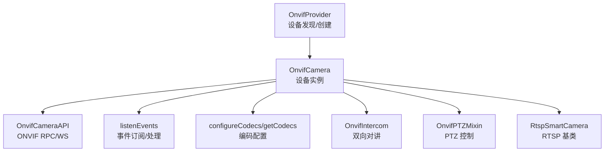
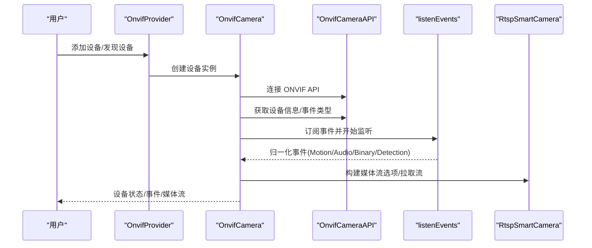
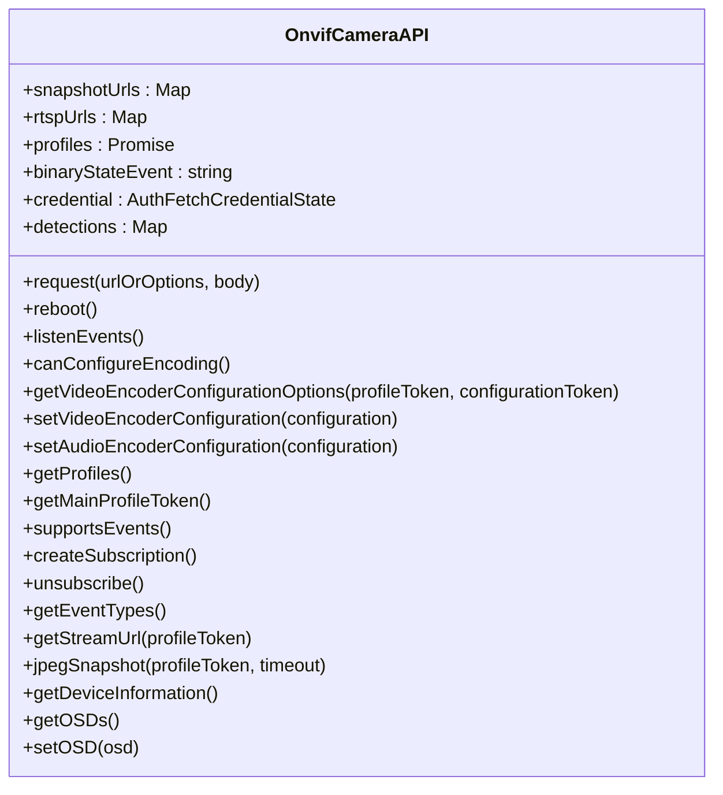
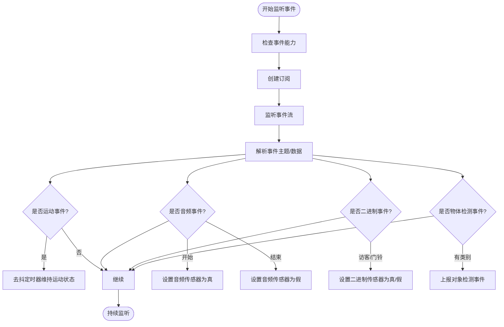
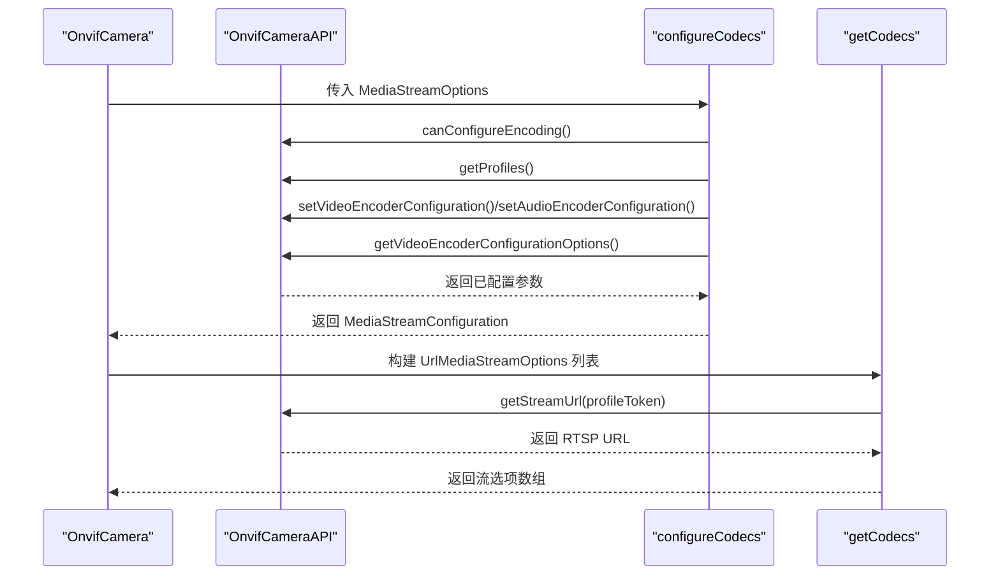
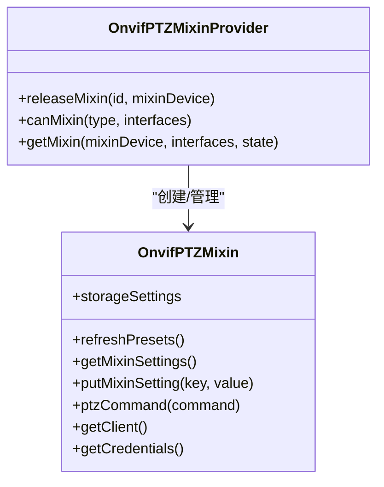
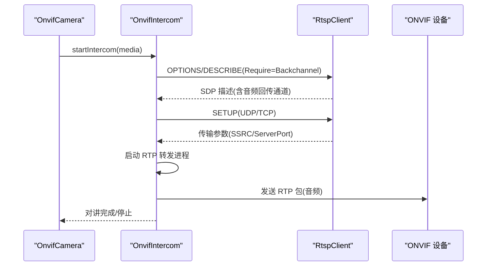
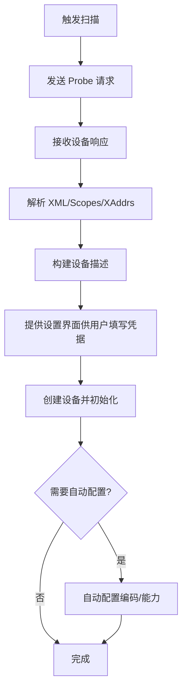
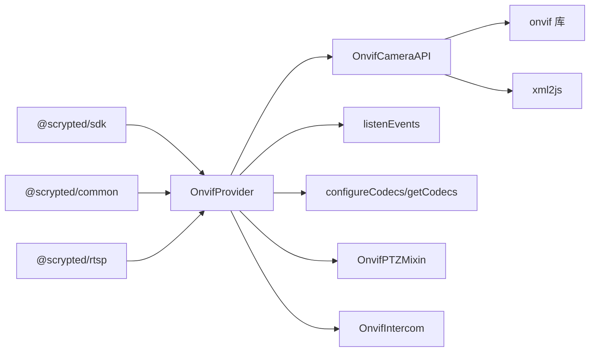

# ONVIF 协议适配器

<cite>
**本文引用的文件列表**
- [main.ts](file://plugins/onvif/src/main.ts)
- [onvif-api.ts](file://plugins/onvif/src/onvif-api.ts)
- [onvif-events.ts](file://plugins/onvif/src/onvif-events.ts)
- [onvif-configure.ts](file://plugins/onvif/src/onvif-configure.ts)
- [onvif-ptz.ts](file://plugins/onvif/src/onvif-ptz.ts)
- [onvif-intercom.ts](file://plugins/onvif/src/onvif-intercom.ts)
- [rtsp.ts](file://plugins/rtsp/src/rtsp.ts)
- [package.json](file://plugins/onvif/package.json)
- [README.md](file://plugins/onvif/README.md)
</cite>

## 目录
1. [简介](#简介)
2. [项目结构](#项目结构)
3. [核心组件](#核心组件)
4. [架构总览](#架构总览)
5. [详细组件分析](#详细组件分析)
6. [依赖关系分析](#依赖关系分析)
7. [性能考量](#性能考量)
8. [故障排除指南](#故障排除指南)
9. [结论](#结论)
10. [附录](#附录)

## 简介
本技术文档面向 ONVIF 协议适配器，系统性阐述其在 Scrypted 平台中的实现与使用，覆盖设备发现、RTSP 流媒体传输、事件订阅与处理、设备配置管理、PTZ 控制、双向对讲（Intercom）以及 OSD 字幕设置等能力。文档特别聚焦 OnvifCameraAPI 类的核心功能，包括设备信息获取、媒体配置、事件监听、编码参数设置等；同时解释 ONVIF 事件系统的实现，涵盖运动检测、音频检测、二进制状态变化、物体检测等事件类型；并说明 RTSP 流 URL 获取、JPEG 快照获取、OSD 字幕设置等媒体功能的实现原理。最后提供配置参数说明、协议兼容性与厂商差异处理建议，以及常见问题的诊断与解决方法。

## 项目结构
ONVIF 适配器位于 plugins/onvif 目录，采用模块化设计：
- 主入口与设备提供者：OnvifProvider、OnvifCamera
- ONVIF API 封装：OnvifCameraAPI
- 事件处理：listenEvents
- 编码配置：configureCodecs、getCodecs、autoconfigureSettings
- PTZ 混入：OnvifPTZMixin、OnvifPTZMixinProvider
- 双向对讲：OnvifIntercom
- 基于 RTSP 的通用能力：继承自 RtspSmartCamera

图表来源
- [main.ts:334-622](file://plugins/onvif/src/main.ts#L334-L622)
- [onvif-api.ts:53-399](file://plugins/onvif/src/onvif-api.ts#L53-L399)
- [onvif-events.ts:1-96](file://plugins/onvif/src/onvif-events.ts#L1-L96)
- [onvif-configure.ts:1-216](file://plugins/onvif/src/onvif-configure.ts#L1-L216)
- [onvif-intercom.ts:1-195](file://plugins/onvif/src/onvif-intercom.ts#L1-L195)
- [onvif-ptz.ts:1-247](file://plugins/onvif/src/onvif-ptz.ts#L1-L247)
- [rtsp.ts:153-383](file://plugins/rtsp/src/rtsp.ts#L153-L383)

章节来源
- [main.ts:1-622](file://plugins/onvif/src/main.ts#L1-L622)
- [package.json:1-54](file://plugins/onvif/package.json#L1-L54)
- [README.md:1-9](file://plugins/onvif/README.md#L1-L9)

## 核心组件
- OnvifProvider：负责设备发现、创建与设备信息初始化，支持通过网络扫描或手动输入 IP/端口添加设备，并自动探测 PTZ 能力。
- OnvifCamera：具体设备实例，继承自 RtspSmartCamera，提供设备信息、媒体配置、事件监听、快照、OSD、双向对讲、重启等能力。
- OnvifCameraAPI：封装 onvif 库的 RPC/WS 接口，提供设备信息、事件属性、订阅、流 URL、快照、OSD、编码配置等。
- listenEvents：事件订阅与归一化处理，将 ONVIF 事件映射为 Scrypted 设备传感器状态与对象检测事件。
- configureCodecs/getCodecs：从 ONVIF Profile 构建 RTSP 流媒体选项，支持编码参数配置与回读校验。
- OnvifPTZMixin/OnvifPTZMixinProvider：提供 PTZ 能力的混入与设置项，支持绝对/相对/连续/预置位控制。
- OnvifIntercom：基于 ONVIF 双向音频回传通道（Backchannel）实现对讲，支持 UDP/TCP 传输协商与 RTP 打包转发。
- RtspSmartCamera：RTSP 基类，提供事件监听循环、传感器重置、URL 设置、凭据注入等通用能力。

章节来源
- [main.ts:16-332](file://plugins/onvif/src/main.ts#L16-L332)
- [onvif-api.ts:53-399](file://plugins/onvif/src/onvif-api.ts#L53-L399)
- [onvif-events.ts:1-96](file://plugins/onvif/src/onvif-events.ts#L1-L96)
- [onvif-configure.ts:1-216](file://plugins/onvif/src/onvif-configure.ts#L1-L216)
- [onvif-ptz.ts:1-247](file://plugins/onvif/src/onvif-ptz.ts#L1-L247)
- [onvif-intercom.ts:1-195](file://plugins/onvif/src/onvif-intercom.ts#L1-L195)
- [rtsp.ts:153-383](file://plugins/rtsp/src/rtsp.ts#L153-L383)

## 架构总览
ONVIF 适配器以 OnvifProvider 为入口，通过 onvif 库进行设备发现与 RPC/WS 交互，结合 RtspSmartCamera 提供统一的 RTSP 流媒体与事件处理能力。事件处理层将 ONVIF 事件标准化为 Scrypted 设备状态与对象检测事件；配置层负责从 ONVIF Profile 生成媒体流选项并可选地修改编码参数。

图表来源
- [main.ts:334-622](file://plugins/onvif/src/main.ts#L334-L622)
- [onvif-api.ts:248-399](file://plugins/onvif/src/onvif-api.ts#L248-L399)
- [onvif-events.ts:1-96](file://plugins/onvif/src/onvif-events.ts#L1-L96)
- [rtsp.ts:153-383](file://plugins/rtsp/src/rtsp.ts#L153-L383)

## 详细组件分析

### OnvifCameraAPI 类详解
- 设备信息与能力查询：getDeviceInformation、getCapabilities、getEventProperties。
- 事件系统：supportsEvents、createSubscription、unsubscribe、listenEvents（事件主题解析、厂商特例处理）。
- 流媒体：getProfiles、getStreamUrl、getSnapshotUri、jpegSnapshot。
- OSD：getOSDs、setOSD。
- 编码配置：getVideoEncoderConfigurationOptions、setVideoEncoderConfiguration、setAudioEncoderConfiguration、canConfigureEncoding。
- HTTP 请求：request 封装认证与超时。

图表来源
- [onvif-api.ts:53-399](file://plugins/onvif/src/onvif-api.ts#L53-L399)

章节来源
- [onvif-api.ts:53-399](file://plugins/onvif/src/onvif-api.ts#L53-L399)

### 事件系统与处理流程
- 事件订阅：先检查支持 WSPullPoint，再创建订阅。
- 事件归一化：
  - 运动事件：处理“短时运动”与“无结束事件”的厂商差异，使用去抖定时器维持运动状态。
  - 音频事件：起止事件映射到音频传感器。
  - 二进制事件：支持 Reolink Visitor 与 Mobotix Bell 事件，以及自定义事件名。
  - 物体检测：从 RuleEngine/ObjectDetector 中提取检测类别并上报对象检测事件。
- 事件源解析：stripNamespaces 清理命名空间，按主题片段匹配。

图表来源
- [onvif-events.ts:1-96](file://plugins/onvif/src/onvif-events.ts#L1-L96)
- [onvif-api.ts:94-169](file://plugins/onvif/src/onvif-api.ts#L94-L169)

章节来源
- [onvif-events.ts:1-96](file://plugins/onvif/src/onvif-events.ts#L1-L96)
- [onvif-api.ts:94-169](file://plugins/onvif/src/onvif-api.ts#L94-L169)

### 编码配置与媒体流构建
- 自动配置：autoconfigureSettings 通过 getCodecs 与 configureCodecs 组合，自动推断并应用最佳编码参数。
- 编码映射：视频/音频编解码器名称转换（如 h264/h265/aac/PCM 等）。
- 参数应用：根据 MediaStreamOptions 修改视频编码（编码、分辨率、帧率、GOP、码率、CBR/VBR）、音频编码（采样率、比特率）。
- 回读校验：调用 getVideoEncoderConfigurationOptions 获取实际生效参数，用于返回给上层。

图表来源
- [onvif-configure.ts:63-176](file://plugins/onvif/src/onvif-configure.ts#L63-L176)
- [onvif-configure.ts:178-216](file://plugins/onvif/src/onvif-configure.ts#L178-L216)
- [onvif-api.ts:171-291](file://plugins/onvif/src/onvif-api.ts#L171-L291)

章节来源
- [onvif-configure.ts:1-216](file://plugins/onvif/src/onvif-configure.ts#L1-L216)
- [onvif-api.ts:171-291](file://plugins/onvif/src/onvif-api.ts#L171-L291)

### PTZ 控制与预设管理
- 能力声明：通过设置项选择支持的轴（Pan/Tilt/Zoom），并缓存预设。
- 命令执行：支持绝对、相对、连续、Home、Preset 等移动模式，速度与超时可配置。
- 预设刷新：周期性从设备获取预设列表并缓存。

图表来源
- [onvif-ptz.ts:6-247](file://plugins/onvif/src/onvif-ptz.ts#L6-L247)

章节来源
- [onvif-ptz.ts:1-247](file://plugins/onvif/src/onvif-ptz.ts#L1-L247)

### 双向对讲（Intercom）
- 能力探测：通过 RTSP DESCRIBE 发现 ONVIF Backchannel 的音频通道。
- 传输协商：优先 UDP unicast，失败则回退 TCP interleaved。
- RTP 打包：将 FFmpeg 输入的音频打包为 RTP，按设备支持的 payloadType 与 SSRC 发送至设备。
- 错误处理：UDP 失败自动切换 TCP，异常时安全关闭会话。

图表来源
- [onvif-intercom.ts:45-195](file://plugins/onvif/src/onvif-intercom.ts#L45-L195)

章节来源
- [onvif-intercom.ts:1-195](file://plugins/onvif/src/onvif-intercom.ts#L1-L195)

### 设备发现与创建
- 设备发现：基于 onvif.Discovery 的 Probe 流程，解析 XML 响应，提取 XAddrs、Scopes 等信息，生成设备描述。
- 设备创建：支持自动配置、跳过验证、PTZ 能力探测、两步式添加（先探测后创建）。
- 适配设置：HTTP 端口覆盖、自动配置按钮、厂商特性开关（如门铃事件名）。

图表来源
- [main.ts:358-438](file://plugins/onvif/src/main.ts#L358-L438)
- [main.ts:465-543](file://plugins/onvif/src/main.ts#L465-L543)

章节来源
- [main.ts:334-622](file://plugins/onvif/src/main.ts#L334-L622)

## 依赖关系分析
- 内部依赖
  - @scrypted/sdk：设备接口、媒体对象、设置项、事件系统。
  - @scrypted/common：HTTP 认证、RTSP 工具、SDP 解析、集群绑定等。
  - @scrypted/rtsp：RTSP 基类与通用能力。
- 外部依赖
  - onvif：ONVIF RPC/WS 客户端。
  - xml2js：XML 解析。
  - base-64、md5：工具库。

图表来源
- [package.json:40-47](file://plugins/onvif/package.json#L40-L47)
- [main.ts:1-14](file://plugins/onvif/src/main.ts#L1-L14)

章节来源
- [package.json:1-54](file://plugins/onvif/package.json#L1-L54)

## 性能考量
- 事件监听循环：RtspSmartCamera 提供事件监听循环，具备空闲超时与自动重启机制，避免长时间无活动导致的资源泄漏。
- 编码配置：仅在参数变更时更新配置，避免重复写入；回读配置用于一致性校验。
- RTSP URL 缓存：OnvifCameraAPI 对 RTSP 与快照 URL 进行缓存，减少重复请求。
- 对讲转发：RTP 打包与转发在独立进程内进行，降低主线程阻塞风险。

章节来源
- [rtsp.ts:173-226](file://plugins/rtsp/src/rtsp.ts#L173-L226)
- [onvif-api.ts:54-56](file://plugins/onvif/src/onvif-api.ts#L54-L56)
- [onvif-api.ts:325-334](file://plugins/onvif/src/onvif-api.ts#L325-L334)

## 故障排除指南
- 连接失败
  - 检查 IP 地址与 HTTP 端口是否正确，必要时使用“HTTP 端口覆盖”。
  - 确认用户名/密码正确，尝试“跳过验证”快速添加后逐步排查。
  - 查看日志中 onvif.Discovery 的输出，确认设备是否可达。
- 事件订阅失败
  - 部分设备不显示 WSPullPointSupport，仍可尝试订阅；若失败，检查网络策略与防火墙。
  - 对于运动事件无结束信号的设备，系统已内置去抖逻辑；若仍异常，检查设备事件主题是否被正确识别。
- 流媒体传输问题
  - 若 RTSP URL 无法获取，检查设备是否支持 ONVIF-T Profile；尝试更换 Profile 或使用“RTSP URL 覆盖”。
  - 对讲失败时，确认设备支持 Backchannel；UDP 失败会自动回退 TCP，若仍失败，检查网络连通性与端口。
- 快照不可用
  - 部分设备不支持快照 URI；当快照为空时，系统会回退到视频流作为图片源。
- 编码配置失败
  - 部分设备不支持编码配置，系统会发出警告但仍继续；可通过“自动配置”按钮重新尝试。

章节来源
- [main.ts:465-543](file://plugins/onvif/src/main.ts#L465-L543)
- [onvif-api.ts:336-364](file://plugins/onvif/src/onvif-api.ts#L336-L364)
- [onvif-events.ts:15-20](file://plugins/onvif/src/onvif-events.ts#L15-L20)
- [rtsp.ts:200-226](file://plugins/rtsp/src/rtsp.ts#L200-L226)

## 结论
ONVIF 协议适配器在 Scrypted 中提供了完整的 ONVIF 设备接入能力，覆盖发现、事件、媒体、配置、PTZ、对讲与 OSD 等关键场景。通过 OnvifCameraAPI 统一封装 ONVIF RPC/WS，配合 RtspSmartCamera 的事件循环与媒体能力，实现了跨厂商设备的兼容与稳定运行。针对不同厂商的事件差异（如 Reolink、Mobotix），适配器内置了事件主题映射与去抖策略，确保行为一致。对于编码配置与流媒体传输，系统提供了自动配置与回读校验，兼顾易用性与可靠性。

## 附录

### 配置参数说明
- 用户名/密码：设备登录凭据。
- IP 地址：设备 IP。
- HTTP 端口覆盖：覆盖默认 80 端口。
- 自动配置：一键自动推断并应用最佳编码参数。
- ONVIF 自动配置：专用自动配置按钮。
- 跳过验证：添加设备时不进行凭据与网络验证。
- ONVIF 门铃：标记设备为门铃，启用二进制传感器与门铃事件。
- ONVIF 门铃事件名：自定义门铃事件主题名。
- 两步音频：启用 ONVIF 双向对讲能力。
- RTSP URL 覆盖：强制使用指定 RTSP URL（高级用户）。

章节来源
- [main.ts:227-276](file://plugins/onvif/src/main.ts#L227-L276)
- [main.ts:545-578](file://plugins/onvif/src/main.ts#L545-L578)
- [rtsp.ts:252-277](file://plugins/rtsp/src/rtsp.ts#L252-L277)

### 协议兼容性与厂商差异
- 事件差异
  - Reolink：访客事件（Visitor）映射为二进制事件。
  - Mobotix：视频报警/门铃事件映射为二进制事件。
  - 通用规则引擎：从 RuleEngine/ObjectDetector 中提取检测类别。
- 编码能力
  - 部分设备不支持编码配置，系统会发出警告但仍继续。
- 快照能力
  - 部分设备不支持快照 URI，系统回退到视频流作为图片源。

章节来源
- [onvif-api.ts:121-147](file://plugins/onvif/src/onvif-api.ts#L121-L147)
- [onvif-api.ts:336-364](file://plugins/onvif/src/onvif-api.ts#L336-L364)
- [main.ts:147-159](file://plugins/onvif/src/main.ts#L147-L159)