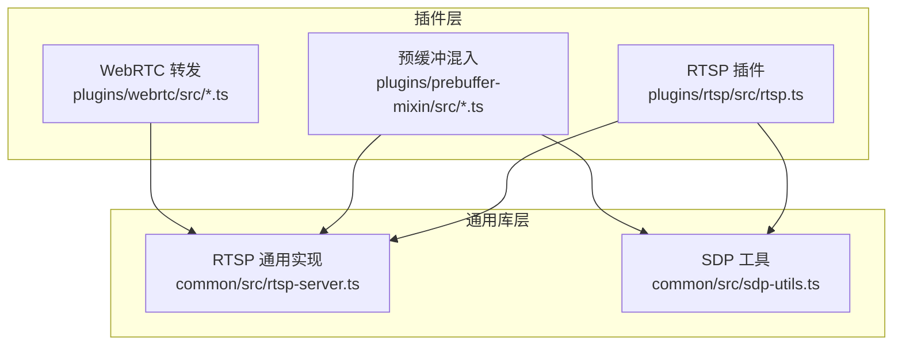
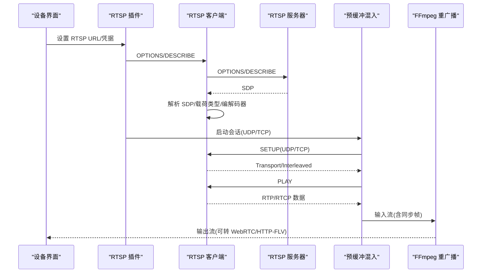
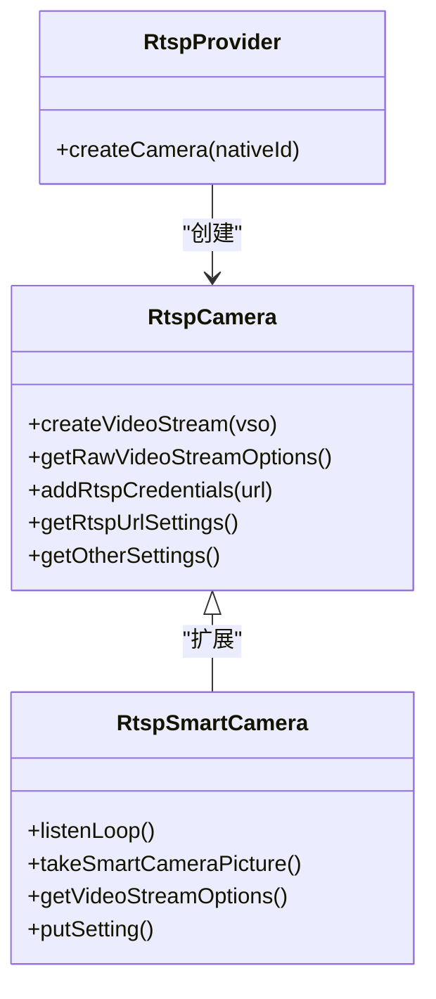
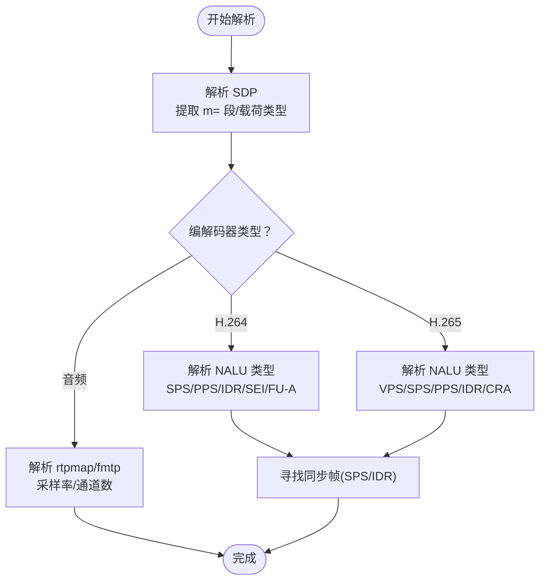
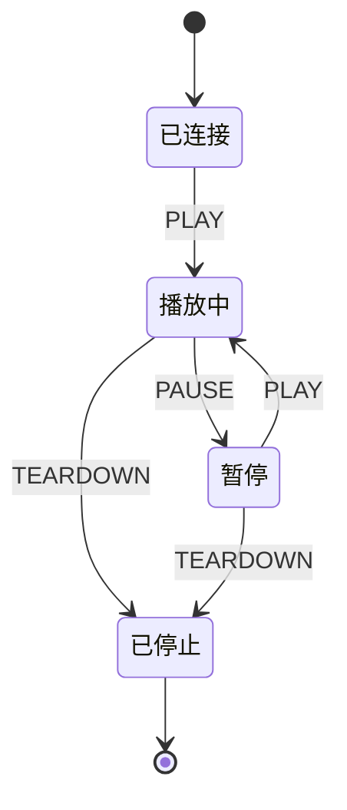
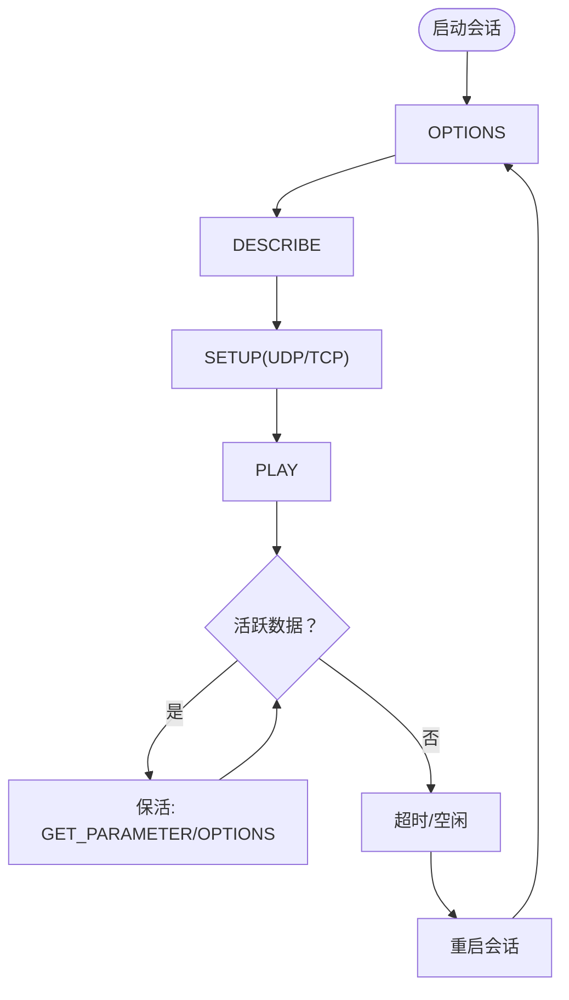
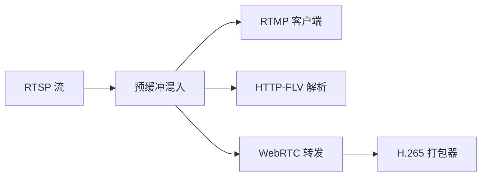
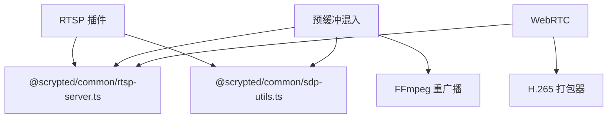

# RTSP 协议适配器

<cite>
**本文档引用的文件**
- [plugins/rtsp/src/main.ts](file://plugins/rtsp/src/main.ts)
- [plugins/rtsp/src/rtsp.ts](file://plugins/rtsp/src/rtsp.ts)
- [common/src/rtsp-server.ts](file://common/src/rtsp-server.ts)
- [common/src/sdp-utils.ts](file://common/src/sdp-utils.ts)
- [plugins/prebuffer-mixin/src/rtsp-session.ts](file://plugins/prebuffer-mixin/src/rtsp-session.ts)
- [plugins/prebuffer-mixin/src/ffmpeg-rebroadcast.ts](file://plugins/prebuffer-mixin/src/ffmpeg-rebroadcast.ts)
- [plugins/prebuffer-mixin/src/rfc4571.ts](file://plugins/prebuffer-mixin/src/rfc4571.ts)
- [plugins/prebuffer-mixin/src/flv.ts](file://plugins/prebuffer-mixin/src/flv.ts)
- [plugins/prebuffer-mixin/src/rtmp-client.ts](file://plugins/prebuffer-mixin/src/rtmp-client.ts)
- [plugins/webrtc/src/rtp-forwarders.ts](file://plugins/webrtc/src/rtp-forwarders.ts)
- [plugins/webrtc/src/h265-packetizer.ts](file://plugins/webrtc/src/h265-packetizer.ts)
- [plugins/rtsp/package.json](file://plugins/rtsp/package.json)
- [common/package.json](file://common/package.json)
</cite>

## 目录
1. [简介](#简介)
2. [项目结构](#项目结构)
3. [核心组件](#核心组件)
4. [架构总览](#架构总览)
5. [详细组件分析](#详细组件分析)
6. [依赖关系分析](#依赖关系分析)
7. [性能考虑](#性能考虑)
8. [故障排除指南](#故障排除指南)
9. [结论](#结论)
10. [附录](#附录)

## 简介
本技术文档面向 RTSP 协议适配器，系统性阐述其在 Scrypted 生态中的实现与使用方式。内容覆盖 RTSP 会话建立流程（DESCRIBE、SETUP、PLAY）、SDP 协商与媒体格式解析、H.264/H.265 视频与 PCM/AAC 音频处理、会话状态管理（暂停/恢复/停止）、配置参数（超时、缓冲、重连策略）、性能优化（带宽自适应、延迟控制、丢包处理）、与其他协议（RTMP、HTTP-FLV、WebRTC）的集成，以及常见问题的诊断与修复。

## 项目结构
该适配器由“插件层”和“通用库层”组成：
- 插件层：提供设备接入与 UI 设置，负责将 RTSP URL 暴露为 Scrypted 设备流。
- 通用库层：提供 RTSP 客户端/服务器、SDP 解析、RTSP 会话管理、FFmpeg 重广播、RFC4571 解析、RTMP 客户端等能力。



图表来源
- [plugins/rtsp/src/rtsp.ts:1-383](file://plugins/rtsp/src/rtsp.ts#L1-L383)
- [common/src/rtsp-server.ts:1-1235](file://common/src/rtsp-server.ts#L1-L1235)
- [common/src/sdp-utils.ts:1-411](file://common/src/sdp-utils.ts#L1-L411)

章节来源
- [plugins/rtsp/src/main.ts:1-8](file://plugins/rtsp/src/main.ts#L1-L8)
- [plugins/rtsp/src/rtsp.ts:1-383](file://plugins/rtsp/src/rtsp.ts#L1-L383)
- [plugins/rtsp/package.json:1-48](file://plugins/rtsp/package.json#L1-L48)
- [common/package.json:1-25](file://common/package.json#L1-L25)

## 核心组件
- RTSP 插件：提供 RTSP 设备接入与设置项（URL 列表、调试开关），将 RTSP URL 包装为可消费的媒体流。
- RTSP 通用客户端/服务器：封装 RTSP 请求/响应、认证、SETUP/PLAY/TEARDOWN、TCP/UDP 传输、RTCP 处理。
- SDP 工具：解析 SDP、提取编解码器、载荷类型、音频采样率、视频分辨率等信息。
- 预缓冲混入：管理 RTSP 会话生命周期、超时与重连、FFmpeg 重广播、RFC4571 解析、RTMP 客户端。
- WebRTC 集成：将 RTSP 流转发到 WebRTC，支持多路音视频轨道与打包。

章节来源
- [plugins/rtsp/src/rtsp.ts:1-383](file://plugins/rtsp/src/rtsp.ts#L1-L383)
- [common/src/rtsp-server.ts:1-1235](file://common/src/rtsp-server.ts#L1-L1235)
- [common/src/sdp-utils.ts:1-411](file://common/src/sdp-utils.ts#L1-L411)
- [plugins/prebuffer-mixin/src/rtsp-session.ts:1-235](file://plugins/prebuffer-mixin/src/rtsp-session.ts#L1-L235)
- [plugins/prebuffer-mixin/src/ffmpeg-rebroadcast.ts:1-290](file://plugins/prebuffer-mixin/src/ffmpeg-rebroadcast.ts#L1-L290)
- [plugins/prebuffer-mixin/src/rfc4571.ts:1-222](file://plugins/prebuffer-mixin/src/rfc4571.ts#L1-L222)
- [plugins/prebuffer-mixin/src/flv.ts:1-405](file://plugins/prebuffer-mixin/src/flv.ts#L1-L405)
- [plugins/prebuffer-mixin/src/rtmp-client.ts:1-630](file://plugins/prebuffer-mixin/src/rtmp-client.ts#L1-L630)
- [plugins/webrtc/src/rtp-forwarders.ts:248-268](file://plugins/webrtc/src/rtp-forwarders.ts#L248-L268)

## 架构总览
RTSP 适配器通过以下路径工作：
- 插件层读取用户配置（RTSP URL 列表、用户名/密码、调试开关）。
- 通用库层发起 RTSP 会话（OPTIONS/DESCRIBE/SETUP/PLAY），解析 SDP 并协商传输方式（TCP/UDP）。
- 预缓冲混入层启动会话，按需选择 UDP 或 TCP 解析器，进行 FFmpeg 重广播或 RFC4571 解析。
- WebRTC 层将 RTSP 流转发为 WebRTC 媒体轨道。



图表来源
- [plugins/rtsp/src/rtsp.ts:79-85](file://plugins/rtsp/src/rtsp.ts#L79-L85)
- [common/src/rtsp-server.ts:779-878](file://common/src/rtsp-server.ts#L779-L878)
- [plugins/prebuffer-mixin/src/rtsp-session.ts:63-190](file://plugins/prebuffer-mixin/src/rtsp-session.ts#L63-L190)
- [plugins/prebuffer-mixin/src/ffmpeg-rebroadcast.ts:107-237](file://plugins/prebuffer-mixin/src/ffmpeg-rebroadcast.ts#L107-L237)

## 详细组件分析

### RTSP 插件与设备接入
- 提供 RTSP URL 列表设置、用户名/密码注入、调试开关。
- 将 RTSP URL 包装为媒体流对象，供上层消费。



图表来源
- [plugins/rtsp/src/rtsp.ts:378-383](file://plugins/rtsp/src/rtsp.ts#L378-L383)
- [plugins/rtsp/src/rtsp.ts:21-145](file://plugins/rtsp/src/rtsp.ts#L21-L145)
- [plugins/rtsp/src/rtsp.ts:153-376](file://plugins/rtsp/src/rtsp.ts#L153-L376)

章节来源
- [plugins/rtsp/src/main.ts:1-8](file://plugins/rtsp/src/main.ts#L1-L8)
- [plugins/rtsp/src/rtsp.ts:1-383](file://plugins/rtsp/src/rtsp.ts#L1-L383)

### RTSP 会话建立与 SDP 协商
- 会话建立顺序：OPTIONS → DESCRIBE → SETUP → PLAY。
- 支持 Basic/Digest 认证；自动解析 WWW-Authenticate 并重试。
- 传输方式：UDP（RTP/AVP;unicast;client_port=...）或 TCP（RTP/AVP/TCP;interleaved=...）。
- SDP 解析：提取 m= 段、rtpmap、fmtp、载荷类型、编解码器、音频采样率、视频分辨率等。

```mermaid
sequenceDiagram
participant C as "RTSP 客户端"
participant S as "RTSP 服务器"
C->>S : OPTIONS
S-->>C : Public : OPTIONS, DESCRIBE, SETUP, PLAY...
C->>S : DESCRIBE
S-->>C : 200 OK + SDP
C->>S : SETUP(video) + Transport : RTP/AVP/TCP; interleaved=0-1
S-->>C : Session + Transport : interleaved=0-1
C->>S : SETUP(audio) + Transport : RTP/AVP/TCP; interleaved=2-3
S-->>C : Session + Transport : interleaved=2-3
C->>S : PLAY
S-->>C : RTP 流
```

图表来源
- [common/src/rtsp-server.ts:779-878](file://common/src/rtsp-server.ts#L779-L878)
- [common/src/rtsp-server.ts:813-866](file://common/src/rtsp-server.ts#L813-L866)
- [common/src/sdp-utils.ts:316-353](file://common/src/sdp-utils.ts#L316-L353)

章节来源
- [common/src/rtsp-server.ts:779-878](file://common/src/rtsp-server.ts#L779-L878)
- [common/src/sdp-utils.ts:175-312](file://common/src/sdp-utils.ts#L175-L312)

### 媒体格式处理（H.264/H.265、PCM/AAC）
- H.264/H.265：解析 NALU 类型（SPS/PPS/IDR/SEI/FU-A 等），用于关键帧检测与分辨率推断。
- 音频：根据 rtpmap 推断编解码器（AAC/Opus/G.711/L16/Speex 等），提取采样率与通道数。
- SDP 参数：从 fmtp 中提取 sps/pps/vps、采样参数等。



图表来源
- [common/src/rtsp-server.ts:106-276](file://common/src/rtsp-server.ts#L106-L276)
- [common/src/sdp-utils.ts:175-274](file://common/src/sdp-utils.ts#L175-L274)

章节来源
- [common/src/rtsp-server.ts:106-276](file://common/src/rtsp-server.ts#L106-L276)
- [common/src/sdp-utils.ts:355-411](file://common/src/sdp-utils.ts#L355-L411)

### 会话状态管理（暂停/恢复/停止）
- 暂停/恢复：通过 PAUSE/PLAY 控制时间戳范围（Range: npt=...-...）。
- 停止：TEARDOWN 清理会话与资源。
- 超时与保活：OPTIONS/GET_PARAMETER 轮询维持会话活性；UDP 会话可带 timeout 参数。



图表来源
- [common/src/rtsp-server.ts:868-878](file://common/src/rtsp-server.ts#L868-L878)
- [common/src/rtsp-server.ts:457-472](file://common/src/rtsp-server.ts#L457-L472)

章节来源
- [common/src/rtsp-server.ts:868-878](file://common/src/rtsp-server.ts#L868-L878)
- [common/src/rtsp-server.ts:457-472](file://common/src/rtsp-server.ts#L457-L472)

### RTSP 会话生命周期与错误重连
- 生命周期：启动（OPTIONS/DESCRIBE/SETUP/PLAY）→ 数据流 → 结束（TEARDOWN）。
- 错误重连：监听 close/error 事件，指数退避与固定间隔重启；5 分钟空闲超时自动销毁。
- 超时控制：请求超时、活动超时、UDP 会话超时。



图表来源
- [plugins/prebuffer-mixin/src/rtsp-session.ts:61-190](file://plugins/prebuffer-mixin/src/rtsp-session.ts#L61-L190)
- [plugins/prebuffer-mixin/src/ffmpeg-rebroadcast.ts:95-105](file://plugins/prebuffer-mixin/src/ffmpeg-rebroadcast.ts#L95-L105)

章节来源
- [plugins/prebuffer-mixin/src/rtsp-session.ts:173-227](file://plugins/prebuffer-mixin/src/rtsp-session.ts#L173-L227)
- [plugins/prebuffer-mixin/src/ffmpeg-rebroadcast.ts:95-105](file://plugins/prebuffer-mixin/src/ffmpeg-rebroadcast.ts#L95-L105)

### 与其他协议的集成
- RTMP：RTMP 客户端实现握手、命令（connect/createStream/play）与音视频分片读取。
- HTTP-FLV：FLV 解析器支持 H.264/AVC 与 AAC 的标签解析，提取 SPS/PPS、AudioSpecificConfig 等。
- WebRTC：将 RTSP 流转发为 WebRTC 轨道，支持多轨与打包（H.265 打包器）。



图表来源
- [plugins/prebuffer-mixin/src/rtmp-client.ts:67-152](file://plugins/prebuffer-mixin/src/rtmp-client.ts#L67-L152)
- [plugins/prebuffer-mixin/src/flv.ts:272-366](file://plugins/prebuffer-mixin/src/flv.ts#L272-L366)
- [plugins/webrtc/src/rtp-forwarders.ts:248-268](file://plugins/webrtc/src/rtp-forwarders.ts#L248-L268)
- [plugins/webrtc/src/h265-packetizer.ts:322-361](file://plugins/webrtc/src/h265-packetizer.ts#L322-L361)

章节来源
- [plugins/prebuffer-mixin/src/rtmp-client.ts:1-630](file://plugins/prebuffer-mixin/src/rtmp-client.ts#L1-L630)
- [plugins/prebuffer-mixin/src/flv.ts:1-405](file://plugins/prebuffer-mixin/src/flv.ts#L1-L405)
- [plugins/webrtc/src/rtp-forwarders.ts:248-268](file://plugins/webrtc/src/rtp-forwarders.ts#L248-L268)
- [plugins/webrtc/src/h265-packetizer.ts:322-361](file://plugins/webrtc/src/h265-packetizer.ts#L322-L361)

## 依赖关系分析
- 插件依赖通用库：RTSP 插件依赖 common/src/rtsp-server.ts 与 sdp-utils.ts。
- 预缓冲混入依赖通用库：RTSP 会话、FFmpeg 重广播、RFC4571 解析。
- WebRTC 依赖 RTSP 会话与打包器：将 RTSP 转为 WebRTC。



图表来源
- [plugins/rtsp/package.json:35-38](file://plugins/rtsp/package.json#L35-L38)
- [common/package.json:13-17](file://common/package.json#L13-L17)

章节来源
- [plugins/rtsp/package.json:1-48](file://plugins/rtsp/package.json#L1-L48)
- [common/package.json:1-25](file://common/package.json#L1-L25)

## 性能考虑
- 带宽自适应：根据上游 SDP 的编解码器与参数动态调整输出码率与分辨率。
- 延迟控制：启用 -reorder_queue_size 0 降低队列重排延迟；合理设置预缓冲时长。
- 丢包处理：UDP 传输下，RTSP 会话可带 timeout 参数以维持会话；必要时切换 TCP。
- 关键帧检测：优先从 SPS/IDR 获取同步帧，确保 FFmpeg 正确初始化。
- 缓冲区管理：当下游阻塞超过阈值（>100MB）主动断开，避免内存膨胀。

章节来源
- [plugins/prebuffer-mixin/src/ffmpeg-rebroadcast.ts:107-237](file://plugins/prebuffer-mixin/src/ffmpeg-rebroadcast.ts#L107-L237)
- [plugins/prebuffer-mixin/src/main.ts:851-862](file://plugins/prebuffer-mixin/src/main.ts#L851-L862)
- [plugins/prebuffer-mixin/src/main.ts:1078-1084](file://plugins/prebuffer-mixin/src/main.ts#L1078-L1084)

## 故障排除指南
- 连接超时：检查请求超时设置与网络连通性；确认服务器支持 GET_PARAMETER 或回退 OPTIONS。
- 认证失败：确认 Basic/Digest 参数完整；检查 realm/nonce 是否正确。
- 流媒体中断：查看会话超时与保活策略；确认 UDP 端口可达且未被防火墙拦截。
- 格式不支持：核对 SDP 中的编解码器与载荷类型；必要时在 WebRTC 层选择兼容编解码器。
- 日志定位：开启调试开关，观察 RTSP 报文与事件日志。

章节来源
- [common/src/rtsp-server.ts:742-777](file://common/src/rtsp-server.ts#L742-L777)
- [plugins/rtsp/src/rtsp.ts:110-124](file://plugins/rtsp/src/rtsp.ts#L110-L124)
- [plugins/prebuffer-mixin/src/rtsp-session.ts:61-67](file://plugins/prebuffer-mixin/src/rtsp-session.ts#L61-L67)

## 结论
该 RTSP 协议适配器通过模块化设计实现了从 RTSP 会话建立、SDP 协商、媒体格式解析到多协议输出（RTMP/HTTP-FLV/WebRTC）的全链路能力。配合超时与重连机制、关键帧检测与缓冲区管理，能够在复杂网络环境中稳定提供实时流媒体服务。

## 附录

### 配置参数说明
- RTSP URL 列表：支持多路流，便于冗余与切换。
- 用户名/密码：自动注入到 URL，避免空密码导致的认证异常。
- 调试开关：输出所有 RTSP 事件日志，便于问题排查。
- 请求超时：控制 RTSP 请求等待时间。
- UDP/TCP 选择：根据网络条件选择更稳定的传输方式。
- 预缓冲时长与字节数：影响首帧到达速度与播放延迟。

章节来源
- [plugins/rtsp/src/rtsp.ts:97-144](file://plugins/rtsp/src/rtsp.ts#L97-L144)
- [plugins/prebuffer-mixin/src/rtsp-session.ts:17-31](file://plugins/prebuffer-mixin/src/rtsp-session.ts#L17-L31)
- [plugins/prebuffer-mixin/src/main.ts:1064-1084](file://plugins/prebuffer-mixin/src/main.ts#L1064-L1084)