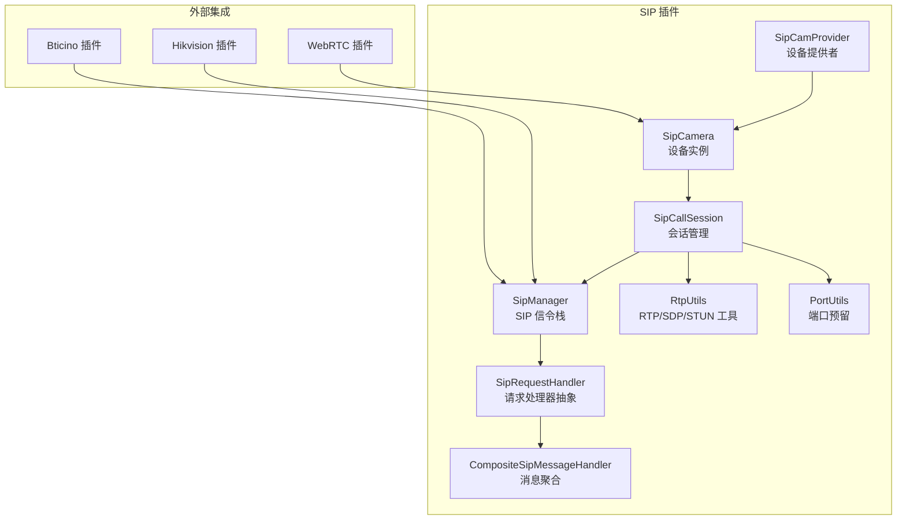
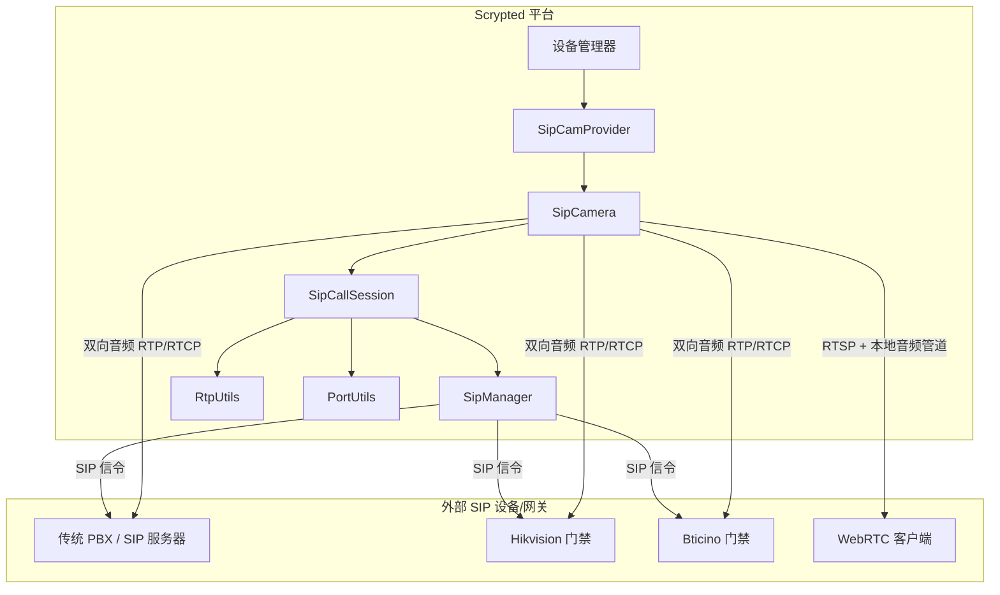
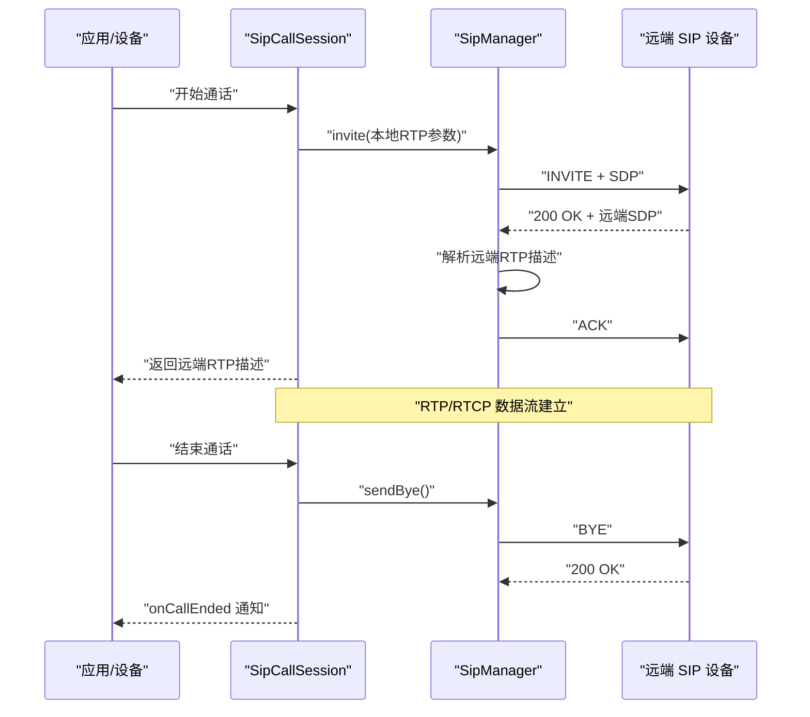
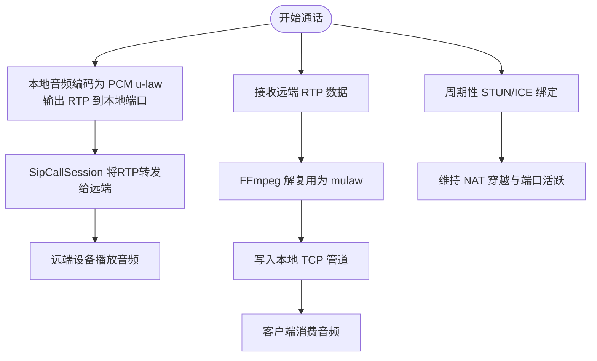
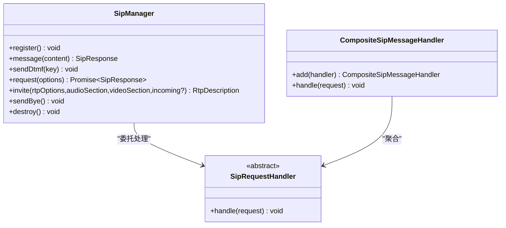
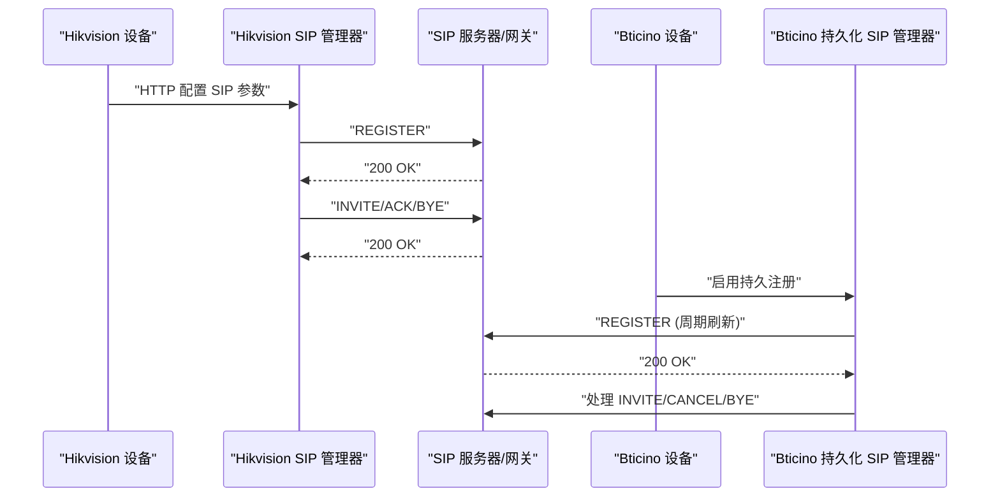
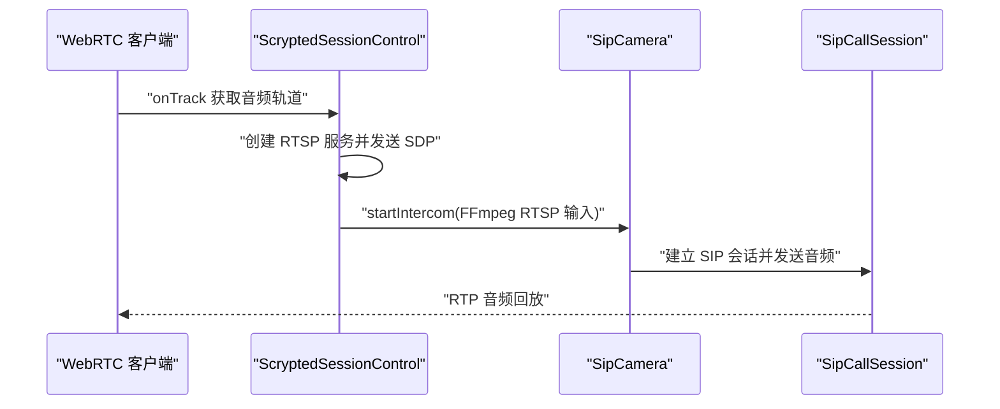
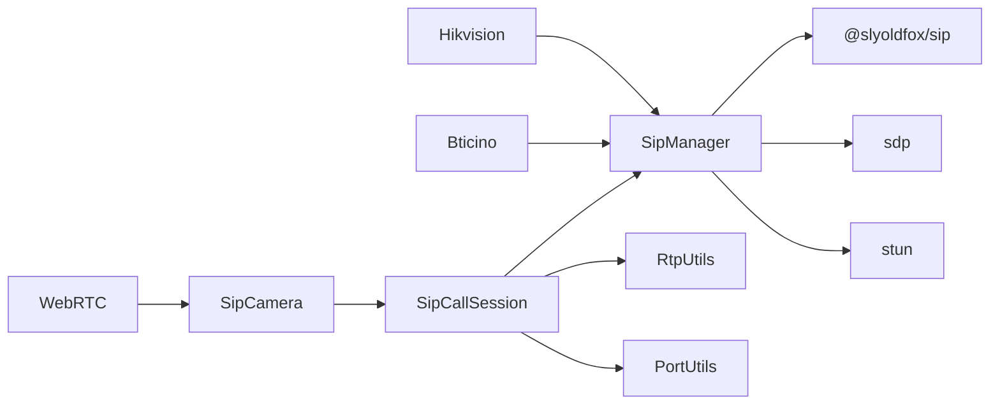

# SIP 协议适配器

<cite>
**本文引用的文件**
- [plugins/sip/src/main.ts](file://plugins/sip/src/main.ts)
- [plugins/sip/src/sip-manager.ts](file://plugins/sip/src/sip-manager.ts)
- [plugins/sip/src/sip-call-session.ts](file://plugins/sip/src/sip-call-session.ts)
- [plugins/sip/src/rtp-utils.ts](file://plugins/sip/src/rtp-utils.ts)
- [plugins/sip/src/util.ts](file://plugins/sip/src/util.ts)
- [plugins/sip/src/port-utils.ts](file://plugins/sip/src/port-utils.ts)
- [plugins/sip/src/compositeSipMessageHandler.ts](file://plugins/sip/src/compositeSipMessageHandler.ts)
- [plugins/sip/src/subscribed.ts](file://plugins/sip/src/subscribed.ts)
- [plugins/sip/package.json](file://plugins/sip/package.json)
- [plugins/sip/README.md](file://plugins/sip/README.md)
- [plugins/bticino/src/bticino-inviteHandler.ts](file://plugins/bticino/src/bticino-inviteHandler.ts)
- [plugins/bticino/src/persistent-sip-manager.ts](file://plugins/bticino/src/persistent-sip-manager.ts)
- [plugins/bticino/src/sip-helper.ts](file://plugins/bticino/src/sip-helper.ts)
- [plugins/hikvision-doorbell/src/doorbell-api.ts](file://plugins/hikvision-doorbell/src/doorbell-api.ts)
- [plugins/hikvision-doorbell/src/sip-manager.ts](file://plugins/hikvision-doorbell/src/sip-manager.ts)
- [plugins/webrtc/src/session-control.ts](file://plugins/webrtc/src/session-control.ts)
- [plugins/webrtc/src/werift.ts](file://plugins/webrtc/src/werift.ts)
</cite>

## 目录
1. [简介](#简介)
2. [项目结构](#项目结构)
3. [核心组件](#核心组件)
4. [架构总览](#架构总览)
5. [详细组件分析](#详细组件分析)
6. [依赖关系分析](#依赖关系分析)
7. [性能考量](#性能考量)
8. [故障排除指南](#故障排除指南)
9. [结论](#结论)
10. [附录](#附录)

## 简介
本技术文档面向 SIP 协议适配器，系统性阐述其在 VoIP 通信、信令处理、RTP 流传输与双向音频方面的实现细节。文档覆盖 SIP 会话建立流程（INVITE、ACK、BYE）、RTP 媒体协商与传输、DTMF 信令、注册与状态管理、配置参数、与传统 PBX/网关的集成示例，以及与 WebRTC 的结合使用路径。内容以代码为依据，辅以图示帮助理解。

## 项目结构
SIP 插件位于 plugins/sip，核心模块包括：
- 主设备类：SipCamera、SipCamProvider，负责设备发现、设置、双向音频转发与媒体流生成
- 会话管理：SipCallSession，封装一次 SIP 通话的生命周期与 RTP/RTCP 分发
- 信令栈：SipManager，封装 SIP 请求发送、响应处理、注册、消息、DTMF 等
- RTP 工具：rtp-utils，解析 SDP、STUN/ICE 绑定、序列号与载荷类型判断
- 资源工具：port-utils，连续端口预留；util 提供随机数与 UUID
- 消息聚合：CompositeSipMessageHandler，组合多个 SIP 处理器
- 集成示例：Bticino/Hikvision Doorbell 插件展示了与厂商设备的对接与持久化注册策略

**图表来源**
- [plugins/sip/src/main.ts:427-495](file://plugins/sip/src/main.ts#L427-L495)
- [plugins/sip/src/sip-call-session.ts:12-93](file://plugins/sip/src/sip-call-session.ts#L12-L93)
- [plugins/sip/src/sip-manager.ts:148-530](file://plugins/sip/src/sip-manager.ts#L148-L530)
- [plugins/sip/src/rtp-utils.ts:1-131](file://plugins/sip/src/rtp-utils.ts#L1-L131)
- [plugins/sip/src/port-utils.ts:1-63](file://plugins/sip/src/port-utils.ts#L1-L63)
- [plugins/sip/src/compositeSipMessageHandler.ts:1-15](file://plugins/sip/src/compositeSipMessageHandler.ts#L1-L15)
- [plugins/bticino/src/persistent-sip-manager.ts:1-78](file://plugins/bticino/src/persistent-sip-manager.ts#L1-L78)
- [plugins/hikvision-doorbell/src/sip-manager.ts:102-440](file://plugins/hikvision-doorbell/src/sip-manager.ts#L102-L440)
- [plugins/webrtc/src/session-control.ts:1-120](file://plugins/webrtc/src/session-control.ts#L1-L120)

**章节来源**
- [plugins/sip/src/main.ts:1-498](file://plugins/sip/src/main.ts#L1-L498)
- [plugins/sip/src/sip-manager.ts:1-533](file://plugins/sip/src/sip-manager.ts#L1-L533)
- [plugins/sip/src/sip-call-session.ts:1-206](file://plugins/sip/src/sip-call-session.ts#L1-L206)
- [plugins/sip/src/rtp-utils.ts:1-131](file://plugins/sip/src/rtp-utils.ts#L1-L131)
- [plugins/sip/src/port-utils.ts:1-63](file://plugins/sip/src/port-utils.ts#L1-L63)
- [plugins/sip/src/compositeSipMessageHandler.ts:1-15](file://plugins/sip/src/compositeSipMessageHandler.ts#L1-L15)
- [plugins/sip/package.json:1-50](file://plugins/sip/package.json#L1-L50)
- [plugins/sip/README.md:1-4](file://plugins/sip/README.md#L1-L4)

## 核心组件
- SipCamera：作为门铃设备，提供双向音频（Intercom）能力，内部通过 FFmpeg 将 RTP 音频转码并写入本地 TCP 管道，同时从客户端读取音频数据并通过 RTP 发送至远端
- SipCallSession：封装一次 SIP 通话，负责 INVITE/ACK/BYE、RTP/RTCP 分发、STUN/ICE 绑定、端口预留与会话生命周期管理
- SipManager：封装 SIP 事务，支持 REGISTER、INVITE、ACK、BYE、MESSAGE、INFO(DTMF) 等，内置日志与 GRUU/域名重写、TCP 优先等特性
- RtpUtils：解析 SDP 中的媒体段、ICE/加密参数，判断 RTP/RTCP、序列号与 STUN 消息，发送 STUN 绑定请求与响应
- PortUtils：顺序保留连续 UDP 端口，避免 FFmpeg 默认占用下一个端口导致冲突
- CompositeSipMessageHandler：聚合多个 SIP 请求处理器，便于扩展不同厂商或场景的消息处理逻辑

**章节来源**
- [plugins/sip/src/main.ts:15-425](file://plugins/sip/src/main.ts#L15-L425)
- [plugins/sip/src/sip-call-session.ts:12-206](file://plugins/sip/src/sip-call-session.ts#L12-L206)
- [plugins/sip/src/sip-manager.ts:148-530](file://plugins/sip/src/sip-manager.ts#L148-L530)
- [plugins/sip/src/rtp-utils.ts:1-131](file://plugins/sip/src/rtp-utils.ts#L1-L131)
- [plugins/sip/src/port-utils.ts:1-63](file://plugins/sip/src/port-utils.ts#L1-L63)
- [plugins/sip/src/compositeSipMessageHandler.ts:1-15](file://plugins/sip/src/compositeSipMessageHandler.ts#L1-L15)

## 架构总览
下图展示 SIP 适配器在系统中的位置与交互关系，以及与外部系统的对接方式。

**图表来源**
- [plugins/sip/src/main.ts:427-495](file://plugins/sip/src/main.ts#L427-L495)
- [plugins/sip/src/sip-call-session.ts:12-93](file://plugins/sip/src/sip-call-session.ts#L12-L93)
- [plugins/sip/src/sip-manager.ts:148-530](file://plugins/sip/src/sip-manager.ts#L148-L530)
- [plugins/hikvision-doorbell/src/sip-manager.ts:102-440](file://plugins/hikvision-doorbell/src/sip-manager.ts#L102-L440)
- [plugins/bticino/src/persistent-sip-manager.ts:1-78](file://plugins/bticino/src/persistent-sip-manager.ts#L1-L78)
- [plugins/webrtc/src/session-control.ts:1-120](file://plugins/webrtc/src/session-control.ts#L1-L120)

## 详细组件分析

### SIP 会话建立流程（INVITE/ACK/BYE）
- 会话发起：SipCallSession 调用 SipManager.invite，构造 SDP 并发送 INVITE；收到 200 OK 后自动发送 ACK
- 远端挂断：SipManager 监听 BYE，回复 200 OK 并触发 onEndedByRemote
- 本地挂断：SipCallSession.stop 调用 SipManager.sendBye 并清理资源
- 会话状态：ReplaySubject onCallEnded 用于通知上层会话结束事件

**图表来源**
- [plugins/sip/src/sip-call-session.ts:95-174](file://plugins/sip/src/sip-call-session.ts#L95-L174)
- [plugins/sip/src/sip-manager.ts:413-478](file://plugins/sip/src/sip-manager.ts#L413-L478)
- [plugins/sip/src/sip-manager.ts:517-522](file://plugins/sip/src/sip-manager.ts#L517-L522)

**章节来源**
- [plugins/sip/src/sip-call-session.ts:95-174](file://plugins/sip/src/sip-call-session.ts#L95-L174)
- [plugins/sip/src/sip-manager.ts:310-386](file://plugins/sip/src/sip-manager.ts#L310-L386)
- [plugins/sip/src/sip-manager.ts:517-522](file://plugins/sip/src/sip-manager.ts#L517-L522)

### RTP 流媒体与双向音频
- 本地音频采集：SipCamera 通过 FFmpeg 将外部音频输入编码为 PCM u-law（8kHz、单声道），输出到本地 RTP 端口
- 远端音频播放：SipCallSession 将远端 RTP 数据经 FFmpeg 解复用后写入本地 TCP 管道，由 SipCamera 的网络服务推送至客户端
- 端口预留：使用 PortUtils 顺序预留 RTP/RTCP 端口，避免 FFmpeg 默认占用下一个端口导致冲突
- STUN/ICE：若远端 SDP 支持 ICE，则发送 STUN Binding 请求维持 NAT 穿越；否则周期性发送 STUN 保持端口活跃

**图表来源**
- [plugins/sip/src/main.ts:106-264](file://plugins/sip/src/main.ts#L106-L264)
- [plugins/sip/src/sip-call-session.ts:111-174](file://plugins/sip/src/sip-call-session.ts#L111-L174)
- [plugins/sip/src/rtp-utils.ts:51-101](file://plugins/sip/src/rtp-utils.ts#L51-L101)
- [plugins/sip/src/port-utils.ts:6-50](file://plugins/sip/src/port-utils.ts#L6-L50)

**章节来源**
- [plugins/sip/src/main.ts:106-264](file://plugins/sip/src/main.ts#L106-L264)
- [plugins/sip/src/sip-call-session.ts:111-174](file://plugins/sip/src/sip-call-session.ts#L111-L174)
- [plugins/sip/src/rtp-utils.ts:51-101](file://plugins/sip/src/rtp-utils.ts#L51-L101)
- [plugins/sip/src/port-utils.ts:6-50](file://plugins/sip/src/port-utils.ts#L6-L50)

### SIP 信令管理（注册、消息、DTMF）
- 注册：SipManager.register 发送 REGISTER，支持自定义过期时间与 TCP 传输
- 消息：SipManager.message 发送 MESSAGE 文本消息
- DTMF：SipManager.sendDtmf 使用 INFO + application/dtmf-relay
- 请求处理：SipManager 内置对 INVITE（响铃/应答）、CANCEL、BYE、MESSAGE 的处理，并可注入自定义 SipRequestHandler

**图表来源**
- [plugins/sip/src/sip-manager.ts:483-515](file://plugins/sip/src/sip-manager.ts#L483-L515)
- [plugins/sip/src/sip-manager.ts:400-408](file://plugins/sip/src/sip-manager.ts#L400-L408)
- [plugins/sip/src/sip-manager.ts:310-386](file://plugins/sip/src/sip-manager.ts#L310-L386)
- [plugins/sip/src/compositeSipMessageHandler.ts:1-15](file://plugins/sip/src/compositeSipMessageHandler.ts#L1-L15)

**章节来源**
- [plugins/sip/src/sip-manager.ts:483-515](file://plugins/sip/src/sip-manager.ts#L483-L515)
- [plugins/sip/src/sip-manager.ts:400-408](file://plugins/sip/src/sip-manager.ts#L400-L408)
- [plugins/sip/src/compositeSipMessageHandler.ts:1-15](file://plugins/sip/src/compositeSipMessageHandler.ts#L1-L15)

### 与传统 PBX/网关的集成示例
- Hikvision 门铃：通过 HTTP 接口配置 SIP 服务器参数（本地端口、代理地址、用户名等），并在本地启动 SIP 服务作为网关模式，支持注册与来电处理
- Bticino 门禁：采用 PersistentSipManager 持续注册，周期性刷新；通过 SipHelper 统一构建 SipOptions，启用 TCP、GRUU 与调试日志

**图表来源**
- [plugins/hikvision-doorbell/src/doorbell-api.ts:605-642](file://plugins/hikvision-doorbell/src/doorbell-api.ts#L605-L642)
- [plugins/hikvision-doorbell/src/sip-manager.ts:102-440](file://plugins/hikvision-doorbell/src/sip-manager.ts#L102-L440)
- [plugins/bticino/src/persistent-sip-manager.ts:32-62](file://plugins/bticino/src/persistent-sip-manager.ts#L32-L62)
- [plugins/bticino/src/sip-helper.ts:6-40](file://plugins/bticino/src/sip-helper.ts#L6-L40)

**章节来源**
- [plugins/hikvision-doorbell/src/doorbell-api.ts:605-642](file://plugins/hikvision-doorbell/src/doorbell-api.ts#L605-L642)
- [plugins/hikvision-doorbell/src/sip-manager.ts:102-440](file://plugins/hikvision-doorbell/src/sip-manager.ts#L102-L440)
- [plugins/bticino/src/persistent-sip-manager.ts:32-62](file://plugins/bticino/src/persistent-sip-manager.ts#L32-L62)
- [plugins/bticino/src/sip-helper.ts:6-40](file://plugins/bticino/src/sip-helper.ts#L6-L40)

### 与 WebRTC 的结合使用
- WebRTC 插件通过 RTSP 推送音频轨道，SipCamera 可将本地音频管道与 WebRTC 音频轨道进行桥接，实现“通话回放”与“对讲”
- ScryptedSessionControl 在 WebRTC 侧监听音频轨道，将 RTP 包转换为 RTSP 并推送到本地，再通过 SipCamera.startIntercom 输出到 SIP 对讲通道

**图表来源**
- [plugins/webrtc/src/session-control.ts:29-109](file://plugins/webrtc/src/session-control.ts#L29-L109)
- [plugins/sip/src/main.ts:106-143](file://plugins/sip/src/main.ts#L106-L143)

**章节来源**
- [plugins/webrtc/src/session-control.ts:1-120](file://plugins/webrtc/src/session-control.ts#L1-L120)
- [plugins/sip/src/main.ts:106-143](file://plugins/sip/src/main.ts#L106-L143)

## 依赖关系分析
- 内部依赖：SipCamera 依赖 SipCallSession；SipCallSession 依赖 SipManager、RtpUtils、PortUtils；SipManager 依赖 @slyoldfox/sip、sdp、stun
- 外部集成：Bticino/Hikvision 插件通过各自的 SIP 管理器与平台对接；WebRTC 插件通过 werift 提供 WebRTC 能力

**图表来源**
- [plugins/sip/src/main.ts:1-498](file://plugins/sip/src/main.ts#L1-L498)
- [plugins/sip/src/sip-call-session.ts:1-206](file://plugins/sip/src/sip-call-session.ts#L1-L206)
- [plugins/sip/src/sip-manager.ts:1-533](file://plugins/sip/src/sip-manager.ts#L1-L533)
- [plugins/sip/package.json:36-44](file://plugins/sip/package.json#L36-L44)

**章节来源**
- [plugins/sip/package.json:36-44](file://plugins/sip/package.json#L36-L44)

## 性能考量
- 端口预留：顺序保留连续端口，避免 FFmpeg 默认占用下一个端口导致失败
- STUN/ICE：在支持 ICE 的情况下使用正式 STUN 绑定，否则周期性发送 STUN 保持 NAT 穿越
- 编解码：本地音频采用 PCM u-law（8kHz、单声道），降低 CPU 开销并保证兼容性
- 日志与超时：SipManager 对关键 SIP 事务设置超时与调试日志，便于定位问题

[本节为通用指导，不直接分析具体文件]

## 故障排除指南
- SIP 注册失败
  - 检查 SipOptions 的 from/to/domain/expiry/localIp/localPort 是否正确
  - 确认 useTcp 与 GRUU 配置是否符合远端要求
  - 查看调试日志中 SIP 报文与错误码
  - 参考 Bticino/Hikvision 插件的注册流程与参数校验
- 音频质量问题或无声
  - 确认 FFmpeg 输入/输出参数与采样率、声道一致
  - 检查 RTP/RTCP 端口是否被占用，必要时更换端口范围
  - 若为 NAT 环境，确认 STUN/ICE 是否正常工作
- 通话中断或无法接听
  - 检查 BYE/ACK 流程是否完整，确保 onEndedByRemote 正常触发
  - 留意 CANCEL/MESSAGE 等非标准流程对会话的影响
- DTMF 无效
  - 确认 INFO + application/dtmf-relay 的 Content-Type 与格式
  - 检查远端是否支持该 DTMF 信令

**章节来源**
- [plugins/sip/src/sip-manager.ts:483-496](file://plugins/sip/src/sip-manager.ts#L483-L496)
- [plugins/sip/src/sip-manager.ts:501-515](file://plugins/sip/src/sip-manager.ts#L501-L515)
- [plugins/sip/src/main.ts:106-264](file://plugins/sip/src/main.ts#L106-L264)
- [plugins/bticino/src/persistent-sip-manager.ts:32-62](file://plugins/bticino/src/persistent-sip-manager.ts#L32-L62)

## 结论
SIP 协议适配器通过清晰的分层设计实现了完整的 VoIP 能力：SIP 信令、RTP 媒体、双向音频与会话生命周期管理。配合 Bticino/Hikvision 等插件的集成实践，可快速对接传统 PBX/网关；结合 WebRTC 插件，进一步拓展实时通信场景。建议在生产环境中开启调试日志、合理配置端口与编解码参数，并根据网络环境选择合适的 STUN/ICE 方案。

[本节为总结性内容，不直接分析具体文件]

## 附录

### 配置参数说明（基于现有实现）
- SIP 设备设置（SipCamera）
  - username/password：可选的快照 HTTP 认证
  - sipfrom：SIP From URI，包含本地监听 IP 与可选端口
  - sipto：SIP To URI，目标号码
  - ffmpegInputs：RTSP 流 URL 列表（多路）
- SIP 选项（SipOptions）
  - from/to：SIP URI
  - domain：域名重写，用于修正 SIP 头部
  - expire：注册过期时间
  - localIp/localPort：本地绑定 IP 与端口
  - debugSip：是否打印 SIP 日志
  - useTcp：是否使用 TCP 传输
  - gruuInstanceId：GRUU 实例 ID
  - sipRequestHandler：自定义请求处理器
- Bticino/Hikvision 扩展
  - Bticino：sipdomain、sipexpiration、sipdebug、useTcp、gruuInstanceId
  - Hikvision：通过 HTTP 接口配置 SIP 服务器参数（本地端口、代理、用户名等）

**章节来源**
- [plugins/sip/src/main.ts:71-104](file://plugins/sip/src/main.ts#L71-L104)
- [plugins/sip/src/sip-manager.ts:11-22](file://plugins/sip/src/sip-manager.ts#L11-L22)
- [plugins/bticino/src/sip-helper.ts:6-40](file://plugins/bticino/src/sip-helper.ts#L6-L40)
- [plugins/hikvision-doorbell/src/doorbell-api.ts:605-642](file://plugins/hikvision-doorbell/src/doorbell-api.ts#L605-L642)