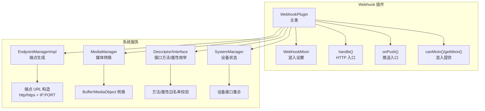
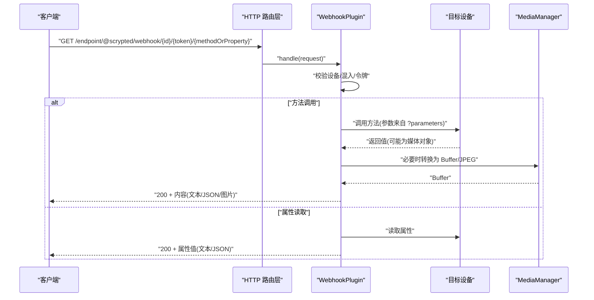
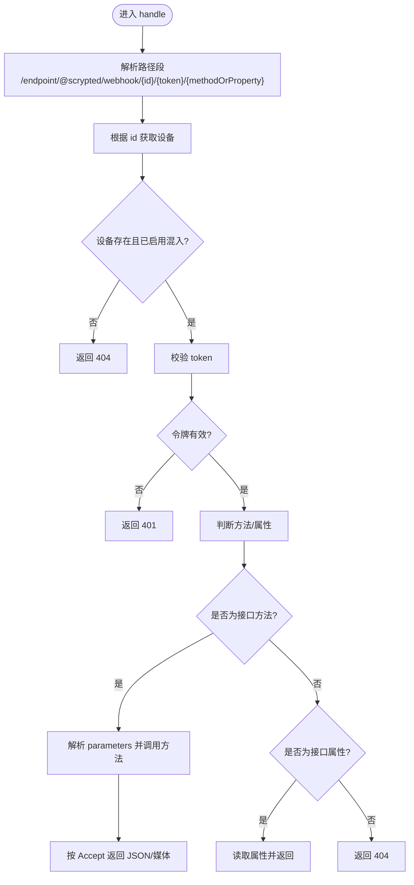
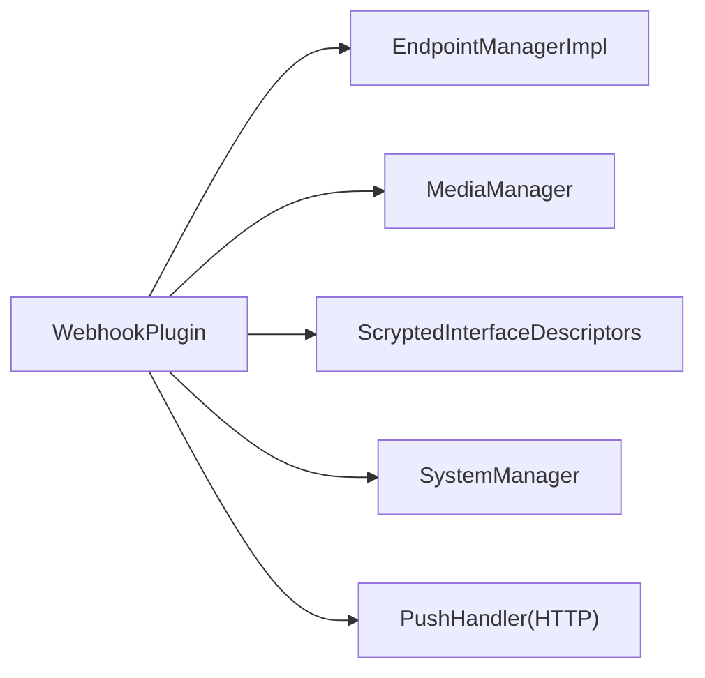

# Webhook 协议适配器

<cite>
**本文引用的文件**
- [plugins/webhook/src/main.ts](file://plugins/webhook/src/main.ts)
- [plugins/webhook/package.json](file://plugins/webhook/package.json)
- [plugins/webhook/README.md](file://plugins/webhook/README.md)
- [plugins/mqtt/src/publishable-types.ts](file://plugins/mqtt/src/publishable-types.ts)
- [server/src/plugin/endpoint.ts](file://server/src/plugin/endpoint.ts)
- [server/src/plugin/plugin-http.ts](file://server/src/plugin/plugin-http.ts)
- [server/src/plugin/media.ts](file://server/src/plugin/media.ts)
- [sdk/types/src/types.input.ts](file://sdk/types/src/types.input.ts)
- [common/src/settings-mixin.ts](file://common/src/settings-mixin.ts)
- [server/src/plugin/descriptor.ts](file://server/src/plugin/descriptor.ts)
- [server/src/plugin/system.ts](file://server/src/plugin/system.ts)
- [plugins/bticino/src/bticino-camera.ts](file://plugins/bticino/src/bticino-camera.ts)
</cite>

## 目录
1. [简介](#简介)
2. [项目结构](#项目结构)
3. [核心组件](#核心组件)
4. [架构总览](#架构总览)
5. [详细组件分析](#详细组件分析)
6. [依赖关系分析](#依赖关系分析)
7. [性能考量](#性能考量)
8. [故障排除指南](#故障排除指南)
9. [结论](#结论)
10. [附录](#附录)

## 简介
本技术文档面向 Webhook 协议适配器（Scrypted 插件），系统性阐述其在 Scrypted 生态中的实现方式与使用方法。该适配器通过 HTTP 回调的方式，为设备提供“状态查询”“媒体获取”“动作调用”的统一入口，支持本地与云端公开端点生成，并内置基于令牌的访问控制。文档覆盖以下主题：
- Webhook 事件与触发机制：设备状态变化、传感器数据更新、用户操作等事件如何驱动回调。
- 请求发送流程：HTTP 方法、请求头、请求体、响应处理。
- 安全机制：签名验证、HTTPS 加密、访问控制。
- 配置参数：回调 URL、事件类型过滤、重试策略、超时设置。
- 外部系统集成：第三方应用通知、云服务数据同步、自动化系统触发。
- 调试与监控：请求日志、错误处理、性能监控。
- 故障排除：回调失败、格式错误、网络问题等。

## 项目结构
Webhook 协议适配器位于插件目录中，核心实现集中在主入口文件，配合系统提供的端点管理器、媒体管理器与类型描述符，完成端点生成、路由分发与媒体转换。

图示来源
- [plugins/webhook/src/main.ts:95-250](file://plugins/webhook/src/main.ts#L95-L250)
- [server/src/plugin/endpoint.ts:54-81](file://server/src/plugin/endpoint.ts#L54-L81)
- [server/src/plugin/media.ts:264-340](file://server/src/plugin/media.ts#L264-L340)
- [server/src/plugin/descriptor.ts:3-35](file://server/src/plugin/descriptor.ts#L3-L35)
- [server/src/plugin/system.ts:18-50](file://server/src/plugin/system.ts#L18-L50)

章节来源
- [plugins/webhook/src/main.ts:1-253](file://plugins/webhook/src/main.ts#L1-L253)
- [plugins/webhook/package.json:1-40](file://plugins/webhook/package.json#L1-L40)
- [plugins/webhook/README.md:1-8](file://plugins/webhook/README.md#L1-L8)

## 核心组件
- WebhookPlugin：实现 HttpRequestHandler 与 PushHandler，作为 HTTP 与推送请求的统一入口；负责解析路径、鉴权、分发到具体设备接口的方法或属性读取。
- WebhookMixin：为设备添加“创建 Webhook”的设置项，动态输出本地与云端公开端点，列出可调用的方法与可读取的属性，并提示参数传递方式。
- EndpointManager：生成本地/公共端点 URL，支持 http/https、IPv6 安全转义、端口获取。
- MediaManager：将媒体对象转换为 Buffer 或 URL，用于图片等二进制响应。
- 发布类型判定：仅对可发布的设备类型启用 Webhook 混入，避免 API/Builtin/Internal 等内部设备暴露。
- 接口描述符：从类型系统中提取设备接口的方法与属性，用于校验请求路径是否合法。

章节来源
- [plugins/webhook/src/main.ts:28-93](file://plugins/webhook/src/main.ts#L28-L93)
- [plugins/webhook/src/main.ts:95-250](file://plugins/webhook/src/main.ts#L95-L250)
- [plugins/mqtt/src/publishable-types.ts:3-38](file://plugins/mqtt/src/publishable-types.ts#L3-L38)
- [server/src/plugin/endpoint.ts:54-81](file://server/src/plugin/endpoint.ts#L54-L81)
- [server/src/plugin/media.ts:264-340](file://server/src/plugin/media.ts#L264-L340)
- [server/src/plugin/descriptor.ts:3-35](file://server/src/plugin/descriptor.ts#L3-L35)

## 架构总览
Webhook 的请求生命周期如下：
- 客户端向端点发起 HTTP 请求，路径形如 /endpoint/@scrypted/webhook/{deviceId}/{token}/{methodOrProperty}。
- 服务器匹配路由并交由 WebhookPlugin.handle 处理。
- 校验设备存在性、混入启用状态与访问令牌。
- 若为方法：解析 parameters 查询参数（JSON 数组）并调用设备对应方法，按 Accept 响应 JSON 或媒体缓冲。
- 若为属性：直接返回属性值，按 Accept 响应 JSON 或字符串。
- 若为媒体方法：通过 MediaManager 将结果转换为 JPEG 并设置 Content-Type 返回。

图示来源
- [server/src/plugin/plugin-http.ts:30-42](file://server/src/plugin/plugin-http.ts#L30-L42)
- [plugins/webhook/src/main.ts:175-208](file://plugins/webhook/src/main.ts#L175-L208)
- [plugins/webhook/src/main.ts:110-173](file://plugins/webhook/src/main.ts#L110-L173)
- [server/src/plugin/media.ts:264-340](file://server/src/plugin/media.ts#L264-L340)

## 详细组件分析

### WebhookPlugin 类
- 职责
  - 提供 HTTP 请求入口与推送入口，统一处理 Webhook 请求。
  - 解析路径段，定位目标设备与方法/属性，执行调用并构造响应。
  - 对媒体方法进行特殊处理，确保图片等媒体正确返回。
- 关键流程
  - 路径解析与设备查找。
  - 混入启用校验与令牌校验。
  - 方法调用与参数解析（parameters 查询参数为 JSON 数组）。
  - 属性读取与响应格式化。
  - 错误处理与状态码返回。

图示来源
- [plugins/webhook/src/main.ts:175-208](file://plugins/webhook/src/main.ts#L175-L208)
- [plugins/webhook/src/main.ts:110-173](file://plugins/webhook/src/main.ts#L110-L173)

章节来源
- [plugins/webhook/src/main.ts:95-250](file://plugins/webhook/src/main.ts#L95-L250)

### WebhookMixin 类
- 职责
  - 为设备添加“创建 Webhook”设置项，允许用户选择设备接口（如 OnOff、Camera 等）。
  - 输出本地与云端公开端点，展示可调用方法与可读取属性列表。
  - 提示参数传递方式（parameters 查询参数为 JSON 数组）。
- 令牌管理
  - 使用持久化存储生成随机 token，用于访问控制。

章节来源
- [plugins/webhook/src/main.ts:28-93](file://plugins/webhook/src/main.ts#L28-L93)
- [common/src/settings-mixin.ts:1-88](file://common/src/settings-mixin.ts#L1-L88)

### 端点生成与访问控制
- 端点协议与地址
  - 支持 http/https 协议，自动对 IPv6 地址加方括号以保证 URL 安全。
  - 通过环境变量获取端口，拼接 /endpoint/{owner}/{pkg}/public 或普通路径。
- 访问控制
  - WebhookPlugin 在处理请求前会校验设备是否启用了该混入，以及 token 是否匹配。
  - 可结合系统提供的跨域控制接口进行 CORS 配置（类型定义中提供相关接口）。

章节来源
- [server/src/plugin/endpoint.ts:54-81](file://server/src/plugin/endpoint.ts#L54-L81)
- [plugins/webhook/src/main.ts:175-208](file://plugins/webhook/src/main.ts#L175-L208)
- [sdk/types/src/types.input.ts:2047-2063](file://sdk/types/src/types.input.ts#L2047-L2063)

### 媒体对象与响应
- 媒体方法识别
  - 对特定方法（如 takePicture、getVideoStream）进行特殊处理。
- 媒体转换
  - 使用 MediaManager 将媒体对象转换为 Buffer（例如 image/jpeg），并设置 Content-Type。
- 非媒体方法
  - 按字符串或 JSON 格式返回。

章节来源
- [plugins/webhook/src/main.ts:96-108](file://plugins/webhook/src/main.ts#L96-L108)
- [server/src/plugin/media.ts:264-340](file://server/src/plugin/media.ts#L264-L340)

### 接口方法与属性校验
- 方法/属性枚举
  - 从类型描述符中聚合所有接口的方法与属性，形成白名单。
- 合法性校验
  - 请求路径中的 methodOrProperty 必须存在于白名单中，否则返回 404。

章节来源
- [server/src/plugin/descriptor.ts:3-35](file://server/src/plugin/descriptor.ts#L3-L35)
- [server/src/plugin/system.ts:18-50](file://server/src/plugin/system.ts#L18-L50)
- [plugins/webhook/src/main.ts:6-9](file://plugins/webhook/src/main.ts#L6-L9)

### 设备类型与混入启用
- 发布类型判定
  - 仅对可发布的设备类型启用 Webhook 混入，排除 API/Builtin/Internal/DataSource/Unknown 等内部类型。
- 混入提供
  - canMixin 返回 Settings 接口，getMixin 创建 WebhookMixin 实例。

章节来源
- [plugins/mqtt/src/publishable-types.ts:3-38](file://plugins/mqtt/src/publishable-types.ts#L3-L38)
- [plugins/webhook/src/main.ts:227-246](file://plugins/webhook/src/main.ts#L227-L246)

### 与外部系统的集成示例
- 第三方应用通知
  - 通过公开端点向外部系统推送设备状态变更或事件。
- 云服务数据同步
  - 利用公开端点将设备状态或媒体数据同步至云平台。
- 自动化系统触发
  - 将 Webhook 端点作为自动化触发器，结合 parameters 参数传入动作所需参数。

章节来源
- [plugins/webhook/README.md:1-8](file://plugins/webhook/README.md#L1-L8)
- [plugins/bticino/src/bticino-camera.ts:657-670](file://plugins/bticino/src/bticino-camera.ts#L657-L670)

## 依赖关系分析
Webhook 插件与系统服务之间的依赖关系如下：

图示来源
- [plugins/webhook/src/main.ts:95-250](file://plugins/webhook/src/main.ts#L95-L250)
- [server/src/plugin/endpoint.ts:54-81](file://server/src/plugin/endpoint.ts#L54-L81)
- [server/src/plugin/media.ts:264-340](file://server/src/plugin/media.ts#L264-L340)
- [server/src/plugin/descriptor.ts:3-35](file://server/src/plugin/descriptor.ts#L3-L35)
- [server/src/plugin/system.ts:18-50](file://server/src/plugin/system.ts#L18-L50)

章节来源
- [plugins/webhook/src/main.ts:1-253](file://plugins/webhook/src/main.ts#L1-L253)

## 性能考量
- 媒体转换成本
  - 对媒体方法进行转换会产生额外开销，建议在需要时才调用，避免频繁拉取大体积媒体。
- 路由与鉴权
  - 路由层与鉴权逻辑简单高效，瓶颈通常不在 WebhookPlugin 本身。
- 并发与超时
  - 插件未内置并发限制与超时控制，建议在上游网关或反向代理层进行限流与超时设置。

## 故障排除指南
- 回调失败（404）
  - 设备不存在或未启用 Webhook 混入；检查设备 id 与混入状态。
- 访问被拒绝（401）
  - token 不匹配；确认生成的端点 URL 中 token 正确。
- 方法未知（404）
  - methodOrProperty 不在设备接口方法/属性白名单中；参考控制台输出的可用方法与属性列表。
- 内部错误（500）
  - 设备方法执行异常；查看控制台日志定位具体错误。
- 媒体无法显示
  - 确认请求 Accept 头与实际返回内容一致；媒体方法需返回图片数据。
- 网络问题
  - 端点协议与地址不正确；确认 http/https 与端口，IPv6 地址需方括号包裹。

章节来源
- [plugins/webhook/src/main.ts:175-208](file://plugins/webhook/src/main.ts#L175-L208)
- [plugins/webhook/src/main.ts:110-173](file://plugins/webhook/src/main.ts#L110-L173)

## 结论
Webhook 协议适配器通过简洁的端点设计与严格的访问控制，为 Scrypted 设备提供了统一的 HTTP 回调能力。它支持状态查询、媒体获取与动作调用，并与系统端点管理器、媒体管理器及接口描述符紧密协作。在生产环境中，建议结合 HTTPS、CORS、限流与超时策略，确保安全性与稳定性。

## 附录

### 配置参数与使用要点
- 回调 URL
  - 本地公开端点与不安全本地端点均可生成；优先使用 HTTPS。
- 事件类型过滤
  - 通过选择设备接口来限定可用方法与属性，减少无效请求。
- 重试策略与超时
  - 插件未内置重试与超时；建议在外部系统或网关层实现。
- 参数传递
  - 动作调用可通过 ?parameters 传递 JSON 数组参数。

章节来源
- [plugins/webhook/src/main.ts:53-89](file://plugins/webhook/src/main.ts#L53-L89)
- [plugins/webhook/src/main.ts:127-133](file://plugins/webhook/src/main.ts#L127-L133)