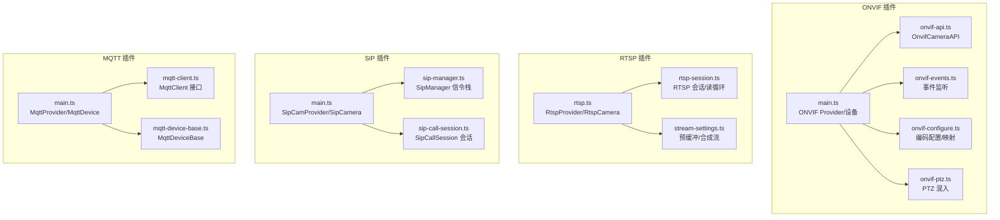
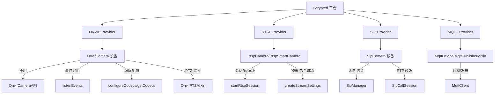
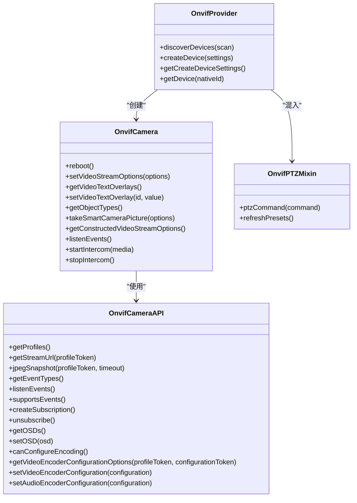
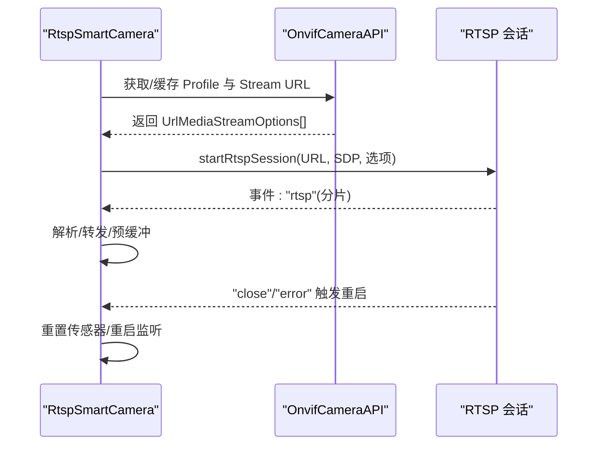
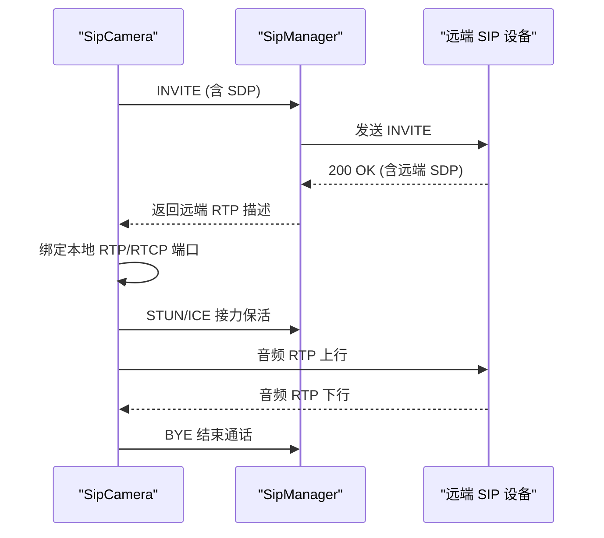
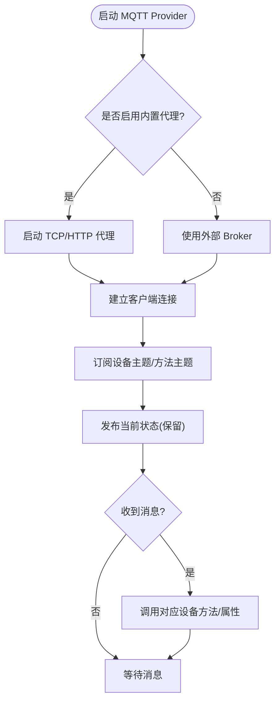
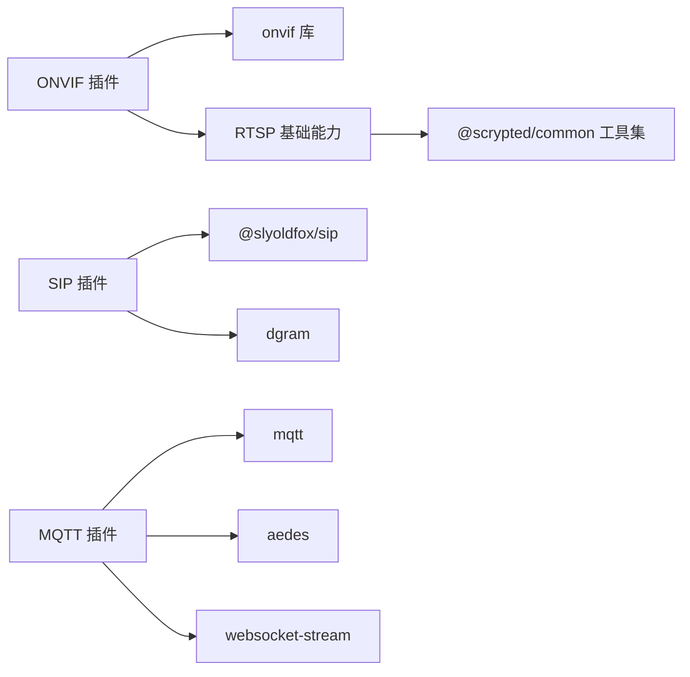

# 协议适配器

<cite>
**本文引用的文件**
- [plugins/onvif/src/main.ts](file://plugins/onvif/src/main.ts)
- [plugins/onvif/src/onvif-api.ts](file://plugins/onvif/src/onvif-api.ts)
- [plugins/onvif/src/onvif-events.ts](file://plugins/onvif/src/onvif-events.ts)
- [plugins/onvif/src/onvif-configure.ts](file://plugins/onvif/src/onvif-configure.ts)
- [plugins/onvif/src/onvif-ptz.ts](file://plugins/onvif/src/onvif-ptz.ts)
- [plugins/rtsp/src/rtsp.ts](file://plugins/rtsp/src/rtsp.ts)
- [plugins/rtsp/src/main.ts](file://plugins/rtsp/src/main.ts)
- [plugins/prebuffer-mixin/src/rtsp-session.ts](file://plugins/prebuffer-mixin/src/rtsp-session.ts)
- [plugins/prebuffer-mixin/src/stream-settings.ts](file://plugins/prebuffer-mixin/src/stream-settings.ts)
- [plugins/sip/src/main.ts](file://plugins/sip/src/main.ts)
- [plugins/sip/src/sip-manager.ts](file://plugins/sip/src/sip-manager.ts)
- [plugins/sip/src/sip-call-session.ts](file://plugins/sip/src/sip-call-session.ts)
- [plugins/mqtt/src/main.ts](file://plugins/mqtt/src/main.ts)
- [plugins/mqtt/src/api/mqtt-client.ts](file://plugins/mqtt/src/api/mqtt-client.ts)
- [plugins/mqtt/src/api/mqtt-device-base.ts](file://plugins/mqtt/src/api/mqtt-device-base.ts)
</cite>

## 目录
1. [简介](#简介)
2. [项目结构](#项目结构)
3. [核心组件](#核心组件)
4. [架构总览](#架构总览)
5. [详细组件分析](#详细组件分析)
6. [依赖关系分析](#依赖关系分析)
7. [性能考量](#性能考量)
8. [故障排除指南](#故障排除指南)
9. [结论](#结论)
10. [附录](#附录)

## 简介
本文件系统化梳理 Scrypted 中的协议适配器实现，重点覆盖以下协议与能力：
- ONVIF：设备发现、事件订阅与处理、配置管理（编码参数、OSD 文字叠加）、PTZ 控制、双向对讲（Intercom）。
- RTSP：流媒体处理（实时流、会话管理、媒体格式映射、错误重连与活动心跳）、预缓冲与多路流管理。
- SIP：VoIP 信令（INVITE/ACK/BYE）、RTP 音频传输、双向音频、DTMF 发送、STUN/ICE 接力保活。
- MQTT：物联网消息通信（订阅/发布、QoS、保留消息、自动发现 Home Assistant）、内置/外部代理、脚本化处理。

文档同时提供配置参数、性能优化建议、安全注意事项、兼容性说明以及自定义协议开发方法论。

## 项目结构
Scrypted 将协议适配器以插件形式组织在 plugins/* 下，每个协议适配器通常包含 Provider、设备类、API 客户端、事件处理、配置工具等模块。ONVIF、RTSP、SIP、MQTT 均采用统一的 Provider/Device 模式，并通过 SDK 的接口契约（如 VideoCamera、Intercom、Settings、PanTiltZoom 等）对外暴露能力。

图示来源
- [plugins/onvif/src/main.ts:334-622](file://plugins/onvif/src/main.ts#L334-L622)
- [plugins/onvif/src/onvif-api.ts:53-399](file://plugins/onvif/src/onvif-api.ts#L53-L399)
- [plugins/onvif/src/onvif-events.ts:5-96](file://plugins/onvif/src/onvif-events.ts#L5-L96)
- [plugins/onvif/src/onvif-configure.ts:63-216](file://plugins/onvif/src/onvif-configure.ts#L63-L216)
- [plugins/onvif/src/onvif-ptz.ts:6-247](file://plugins/onvif/src/onvif-ptz.ts#L6-L247)
- [plugins/rtsp/src/rtsp.ts:153-383](file://plugins/rtsp/src/rtsp.ts#L153-L383)
- [plugins/prebuffer-mixin/src/rtsp-session.ts:17-235](file://plugins/prebuffer-mixin/src/rtsp-session.ts#L17-L235)
- [plugins/prebuffer-mixin/src/stream-settings.ts:43-268](file://plugins/prebuffer-mixin/src/stream-settings.ts#L43-L268)
- [plugins/sip/src/main.ts:15-498](file://plugins/sip/src/main.ts#L15-L498)
- [plugins/sip/src/sip-manager.ts:148-533](file://plugins/sip/src/sip-manager.ts#L148-L533)
- [plugins/sip/src/sip-call-session.ts:12-206](file://plugins/sip/src/sip-call-session.ts#L12-L206)
- [plugins/mqtt/src/main.ts:349-621](file://plugins/mqtt/src/main.ts#L349-L621)
- [plugins/mqtt/src/api/mqtt-client.ts:3-21](file://plugins/mqtt/src/api/mqtt-client.ts#L3-L21)
- [plugins/mqtt/src/api/mqtt-device-base.ts:6-103](file://plugins/mqtt/src/api/mqtt-device-base.ts#L6-L103)

章节来源
- [plugins/onvif/src/main.ts:1-622](file://plugins/onvif/src/main.ts#L1-L622)
- [plugins/rtsp/src/rtsp.ts:1-383](file://plugins/rtsp/src/rtsp.ts#L1-L383)
- [plugins/sip/src/main.ts:1-498](file://plugins/sip/src/main.ts#L1-L498)
- [plugins/mqtt/src/main.ts:1-629](file://plugins/mqtt/src/main.ts#L1-L629)

## 核心组件
- ONVIF Provider/设备：负责设备发现（基于 onvif 库的 Discovery）、设备信息获取、事件订阅、编码配置、OSD 文字叠加、PTZ 混入、双向对讲 Intercom。
- RTSP Provider/设备：提供 RTSP 流接入、URL 设置、凭据注入、会话生命周期管理、错误重连与活动心跳、预缓冲与合成流策略。
- SIP Provider/设备：提供 SIP 信令栈、RTP 音频转发、双向音频、DTMF、STUN/ICE 保活、来电/去电流程。
- MQTT Provider/设备：提供 MQTT 订阅/发布、自动发现（Home Assistant）、内置/外部代理、脚本化处理与事件绑定。

章节来源
- [plugins/onvif/src/main.ts:16-332](file://plugins/onvif/src/main.ts#L16-L332)
- [plugins/rtsp/src/rtsp.ts:21-146](file://plugins/rtsp/src/rtsp.ts#L21-L146)
- [plugins/sip/src/main.ts:15-425](file://plugins/sip/src/main.ts#L15-L425)
- [plugins/mqtt/src/main.ts:33-155](file://plugins/mqtt/src/main.ts#L33-L155)

## 架构总览
ONVIF 与 RTSP 在 ONVIF Provider 内复用 RTSP 提供的基础能力；SIP 与 MQTT 各自独立实现协议栈并通过 Scrypted SDK 的接口进行设备能力暴露与事件绑定。

图示来源
- [plugins/onvif/src/main.ts:334-622](file://plugins/onvif/src/main.ts#L334-L622)
- [plugins/onvif/src/onvif-api.ts:53-399](file://plugins/onvif/src/onvif-api.ts#L53-L399)
- [plugins/onvif/src/onvif-events.ts:5-96](file://plugins/onvif/src/onvif-events.ts#L5-L96)
- [plugins/onvif/src/onvif-configure.ts:63-216](file://plugins/onvif/src/onvif-configure.ts#L63-L216)
- [plugins/onvif/src/onvif-ptz.ts:6-247](file://plugins/onvif/src/onvif-ptz.ts#L6-L247)
- [plugins/rtsp/src/rtsp.ts:153-383](file://plugins/rtsp/src/rtsp.ts#L153-L383)
- [plugins/prebuffer-mixin/src/rtsp-session.ts:17-235](file://plugins/prebuffer-mixin/src/rtsp-session.ts#L17-L235)
- [plugins/prebuffer-mixin/src/stream-settings.ts:43-268](file://plugins/prebuffer-mixin/src/stream-settings.ts#L43-L268)
- [plugins/sip/src/main.ts:15-425](file://plugins/sip/src/main.ts#L15-L425)
- [plugins/sip/src/sip-manager.ts:148-533](file://plugins/sip/src/sip-manager.ts#L148-L533)
- [plugins/sip/src/sip-call-session.ts:12-206](file://plugins/sip/src/sip-call-session.ts#L12-L206)
- [plugins/mqtt/src/main.ts:33-155](file://plugins/mqtt/src/main.ts#L33-L155)
- [plugins/mqtt/src/api/mqtt-client.ts:3-21](file://plugins/mqtt/src/api/mqtt-client.ts#L3-L21)

## 详细组件分析

### ONVIF 协议适配器
- 设备发现：基于 onvif 库的 Discovery，解析 ProbeMatches，提取 XAddrs、Scopes，生成 DiscoveredDevice 列表。
- 事件处理：支持 Motion/Audio/Binary/RuleEngine/ObjectDetector 等事件类型，内置去抖动与门铃事件归一化。
- 配置管理：动态获取 Profiles，映射编码参数（视频/H264/H265、音频/aac/PCMU/PCMA、分辨率、帧率、码率、GOP），支持设置编码配置与回读校验。
- OSD 文字叠加：查询/设置 OSD 文本，支持位置与只读属性。
- PTZ 控制：通过 Mixin 提供 Pan/Tilt/Zoom、预设位、连续运动、绝对/相对/回家/预设移动。
- 双向对讲：通过 OnvifIntercom 使用 RTSP 流作为音频输入通道。

图示来源
- [plugins/onvif/src/main.ts:16-332](file://plugins/onvif/src/main.ts#L16-L332)
- [plugins/onvif/src/onvif-api.ts:53-399](file://plugins/onvif/src/onvif-api.ts#L53-L399)
- [plugins/onvif/src/onvif-ptz.ts:6-247](file://plugins/onvif/src/onvif-ptz.ts#L6-L247)

章节来源
- [plugins/onvif/src/main.ts:334-622](file://plugins/onvif/src/main.ts#L334-L622)
- [plugins/onvif/src/onvif-api.ts:53-399](file://plugins/onvif/src/onvif-api.ts#L53-L399)
- [plugins/onvif/src/onvif-events.ts:5-96](file://plugins/onvif/src/onvif-events.ts#L5-L96)
- [plugins/onvif/src/onvif-configure.ts:63-216](file://plugins/onvif/src/onvif-configure.ts#L63-L216)
- [plugins/onvif/src/onvif-ptz.ts:6-247](file://plugins/onvif/src/onvif-ptz.ts#L6-L247)

### RTSP 协议适配器
- 流媒体处理：支持单 URL 或多 URL 输入，凭据注入（避免空密码被 WHATWG URL 去除导致认证失败），创建 MediaStreamUrl。
- 会话管理：RtspSmartCamera 维护 listenLoop，自动重启监听器，处理 close/error/idle 超时，触发传感器状态复位。
- 错误重连与心跳：通过 timeoutPromise 限制构造流选项超时，结合活动计时器与错误回调实现健壮的重连策略。
- 预缓冲与合成流：通过 createStreamSettings 管理本地/远程/低分辨率/录制等流偏好，支持启用预缓冲与合成流。

图示来源
- [plugins/rtsp/src/rtsp.ts:153-383](file://plugins/rtsp/src/rtsp.ts#L153-L383)
- [plugins/prebuffer-mixin/src/rtsp-session.ts:17-235](file://plugins/prebuffer-mixin/src/rtsp-session.ts#L17-L235)
- [plugins/prebuffer-mixin/src/stream-settings.ts:43-268](file://plugins/prebuffer-mixin/src/stream-settings.ts#L43-L268)

章节来源
- [plugins/rtsp/src/rtsp.ts:21-146](file://plugins/rtsp/src/rtsp.ts#L21-L146)
- [plugins/rtsp/src/rtsp.ts:153-383](file://plugins/rtsp/src/rtsp.ts#L153-L383)
- [plugins/prebuffer-mixin/src/rtsp-session.ts:17-235](file://plugins/prebuffer-mixin/src/rtsp-session.ts#L17-L235)
- [plugins/prebuffer-mixin/src/stream-settings.ts:43-268](file://plugins/prebuffer-mixin/src/stream-settings.ts#L43-L268)

### SIP 协议适配器
- 信令处理：SipManager 实现 INVITE/ACK/BYE/REGISTER/MESSAGE/INFO 等，支持 GRUU、域替换、日志记录。
- RTP 流传输：SipCallSession 管理音频/视频 RTP/RTCP 分离端口，支持 STUN/ICE 接力保活，确保 NAT 穿越与长连维持。
- 双向音频：SipCamera 通过 ffmpeg 将本地音频流转发到远端 RTP，同时接收远端音频写入本地 TCP 端口，实现通话。
- DTMF 发送：通过 INFO 请求发送 DTMF。

图示来源
- [plugins/sip/src/main.ts:106-264](file://plugins/sip/src/main.ts#L106-L264)
- [plugins/sip/src/sip-manager.ts:413-478](file://plugins/sip/src/sip-manager.ts#L413-L478)
- [plugins/sip/src/sip-call-session.ts:99-174](file://plugins/sip/src/sip-call-session.ts#L99-L174)

章节来源
- [plugins/sip/src/main.ts:15-425](file://plugins/sip/src/main.ts#L15-L425)
- [plugins/sip/src/sip-manager.ts:148-533](file://plugins/sip/src/sip-manager.ts#L148-L533)
- [plugins/sip/src/sip-call-session.ts:12-206](file://plugins/sip/src/sip-call-session.ts#L12-L206)

### MQTT 协议适配器
- 订阅/发布：MqttClient 提供 subscribe/publish 接口，支持 retain 选项；MqttDeviceBase 统一连接逻辑与路径前缀。
- 自动发现：支持 Home Assistant 自动发现，设备状态变更自动发布 retain 消息；支持 HA 状态主题重连后重新发布。
- 内置/外部代理：可启用内置 Aedes 代理（TCP/HTTP WebSocket），或连接外部 MQTT Broker；支持用户名/密码认证。
- 脚本化处理：MqttDevice 支持脚本加载与执行，通过 eval 注入 mqtt 对象，实现灵活的消息处理。

图示来源
- [plugins/mqtt/src/main.ts:482-521](file://plugins/mqtt/src/main.ts#L482-L521)
- [plugins/mqtt/src/main.ts:599-619](file://plugins/mqtt/src/main.ts#L599-L619)
- [plugins/mqtt/src/api/mqtt-device-base.ts:53-102](file://plugins/mqtt/src/api/mqtt-device-base.ts#L53-L102)
- [plugins/mqtt/src/api/mqtt-client.ts:3-21](file://plugins/mqtt/src/api/mqtt-client.ts#L3-L21)

章节来源
- [plugins/mqtt/src/main.ts:33-155](file://plugins/mqtt/src/main.ts#L33-L155)
- [plugins/mqtt/src/main.ts:349-621](file://plugins/mqtt/src/main.ts#L349-L621)
- [plugins/mqtt/src/api/mqtt-device-base.ts:6-103](file://plugins/mqtt/src/api/mqtt-device-base.ts#L6-L103)
- [plugins/mqtt/src/api/mqtt-client.ts:3-21](file://plugins/mqtt/src/api/mqtt-client.ts#L3-L21)

## 依赖关系分析
- ONVIF 依赖 onvif 库进行设备发现与信令交互，依赖 RTSP 提供的流能力与事件监听。
- RTSP 依赖 @scrypted/common 的 rtsp-server、sdp-utils、stream-parser 等工具，配合预缓冲混入实现稳定播放。
- SIP 依赖 @slyoldfox/sip 进行 SIP 信令，依赖 dgram 进行 RTP/RTCP 转发，依赖 STUN/ICE 保持连接活跃。
- MQTT 依赖 mqtt、aedes、websocket-stream 实现客户端与内置代理，依赖 Home Assistant 自动发现规范。

图示来源
- [plugins/onvif/src/main.ts:1-14](file://plugins/onvif/src/main.ts#L1-L14)
- [plugins/rtsp/src/rtsp.ts:1-6](file://plugins/rtsp/src/rtsp.ts#L1-L6)
- [plugins/sip/src/sip-manager.ts:9-11](file://plugins/sip/src/sip-manager.ts#L9-L11)
- [plugins/mqtt/src/main.ts:8-11](file://plugins/mqtt/src/main.ts#L8-L11)

章节来源
- [plugins/onvif/src/main.ts:1-14](file://plugins/onvif/src/main.ts#L1-L14)
- [plugins/rtsp/src/rtsp.ts:1-6](file://plugins/rtsp/src/rtsp.ts#L1-L6)
- [plugins/sip/src/sip-manager.ts:9-11](file://plugins/sip/src/sip-manager.ts#L9-L11)
- [plugins/mqtt/src/main.ts:8-11](file://plugins/mqtt/src/main.ts#L8-L11)

## 性能考量
- ONVIF 编码配置：优先使用 canConfigureEncoding 判断能力，批量读取 Profiles 后缓存，避免重复请求；设置编码参数时仅在必要时调用 setVideoEncoderConfiguration/setAudioEncoderConfiguration。
- RTSP 会话：使用 timeoutPromise 控制构造流选项超时；listenLoop 结合活动计时器与错误回调实现快速重连；UDP/TCP 传输模式按需选择，减少 NAT 穿越开销。
- SIP：RTP/RTCP 分离端口，STUN/ICE 接力保活降低丢包；音频采样率/声道固定为 8kHz/单声道，降低带宽占用。
- MQTT：HA 自动发现仅在连接时发布一次，后续通过 retain 状态消息维持；限制日志量，避免高噪声影响性能。

## 故障排除指南
- ONVIF
  - 设备未显示事件：确认 supportsEvents 与 createSubscription 成功；检查 getEventTypes 是否返回检测类别。
  - 编码配置不生效：确认 canConfigureEncoding；若 ConstantBitRate 与期望不一致，需在设备 Web 管理中手动调整。
  - OSD 设置失败：确认 OSD 类型为 Plain 文本且存在 token。
- RTSP
  - 连接超时：检查 RTSP URL、凭据、端口；查看 listenLoop 的错误与关闭事件，确认重连策略生效。
  - 网络中断：依赖活动计时器与错误回调自动重启；必要时切换 UDP/TCP 传输模式。
  - 预缓冲异常：检查 enabledStreams 与合成流配置，避免 MJPEG 等不兼容编码。
- SIP
  - 无法建立通话：检查 SIP From/To URI、本地 IP/端口；确认 SDP 解析成功并正确绑定本地 RTP 端口。
  - 音频断续：关注序列号丢失统计（aseen/aseq/alost），必要时启用 STUN/ICE 接力保活。
  - DTMF 不生效：确认 INFO 请求内容格式与 Duration。
- MQTT
  - 无法连接：检查 enableBroker/externalBroker、用户名/密码；查看内置代理端口与 HA 状态主题。
  - 消息未触发：确认订阅的主题前缀与设备属性/方法名称匹配；检查 retain 与 QoS 设置。

章节来源
- [plugins/onvif/src/onvif-events.ts:5-96](file://plugins/onvif/src/onvif-events.ts#L5-L96)
- [plugins/onvif/src/onvif-configure.ts:63-176](file://plugins/onvif/src/onvif-configure.ts#L63-L176)
- [plugins/rtsp/src/rtsp.ts:173-226](file://plugins/rtsp/src/rtsp.ts#L173-L226)
- [plugins/sip/src/main.ts:167-264](file://plugins/sip/src/main.ts#L167-L264)
- [plugins/mqtt/src/main.ts:482-521](file://plugins/mqtt/src/main.ts#L482-L521)

## 结论
Scrypted 的协议适配器通过统一的 Provider/Device 模式与 SDK 接口契约，实现了 ONVIF、RTSP、SIP、MQTT 的标准化接入。ONVIF 提供完善的设备发现、事件与配置能力；RTSP 提供稳健的流媒体会话与预缓冲策略；SIP 提供可靠的 VoIP 信令与双向音频；MQTT 提供灵活的消息订阅/发布与自动发现。这些组件共同构成了可扩展、可维护、可诊断的协议适配体系。

## 附录
- 自定义协议开发方法
  - 协议解析器：参考 ONVIF API 客户端封装，使用 Promise 包装异步回调，统一错误处理与缓存策略。
  - 消息处理：参考 SIP Manager 的请求/响应处理与日志记录，确保关键消息（INVITE/ACK/BYE）的完整性。
  - 状态管理：参考 MQTT Provider 的连接与订阅管理，结合设备事件与属性变更自动发布消息。
  - 会话管理：参考 RTSP 会话与 SIP 会话，实现超时、重连、保活与资源清理。
  - 安全与兼容：统一凭据注入、域名替换、NAT/防火墙穿透（STUN/ICE）、编码兼容映射（H264/H265/aac/PCMU）。