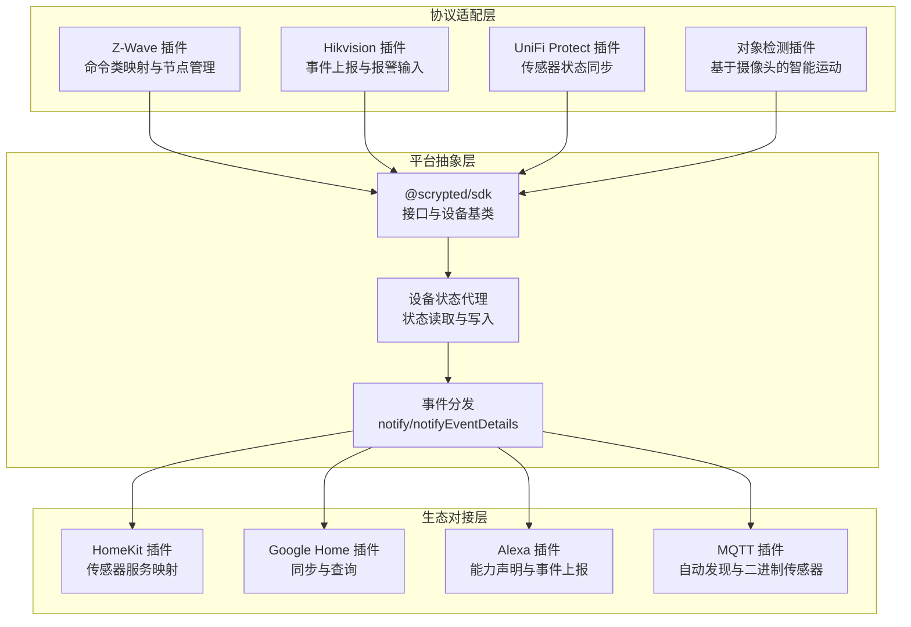
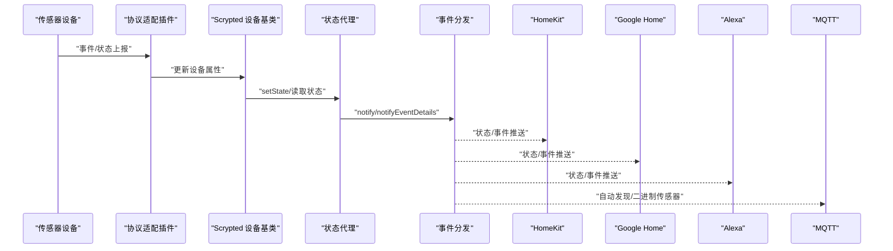
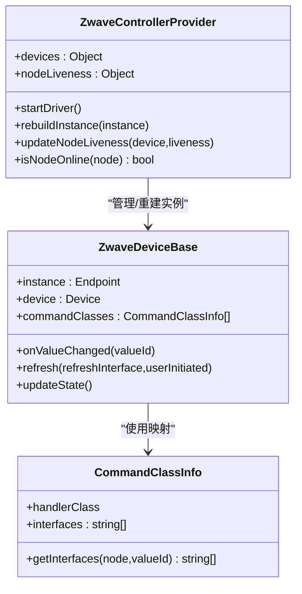
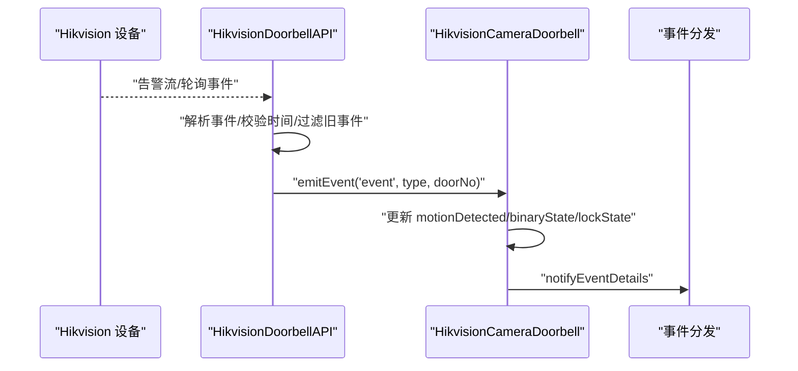
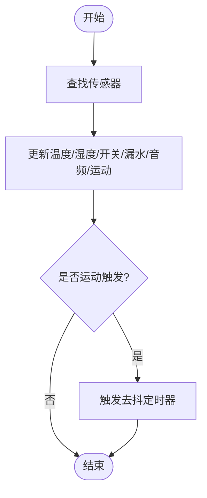
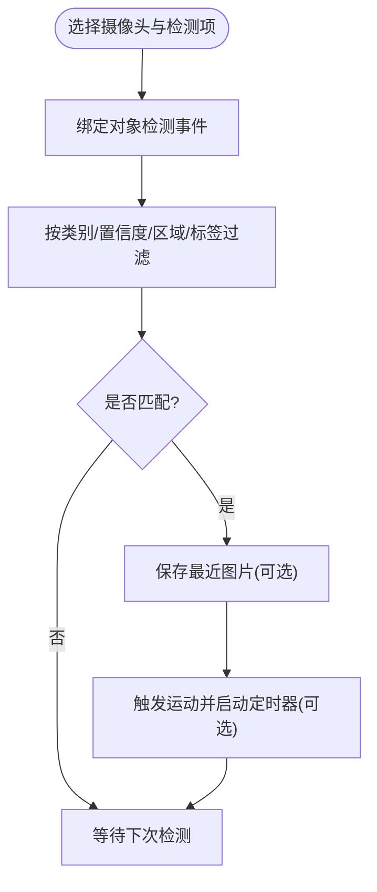
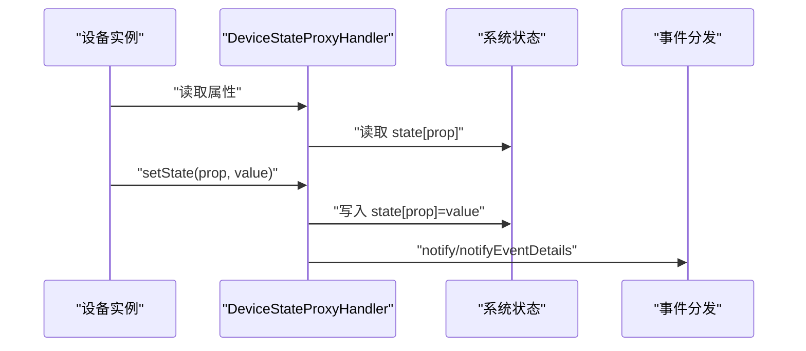
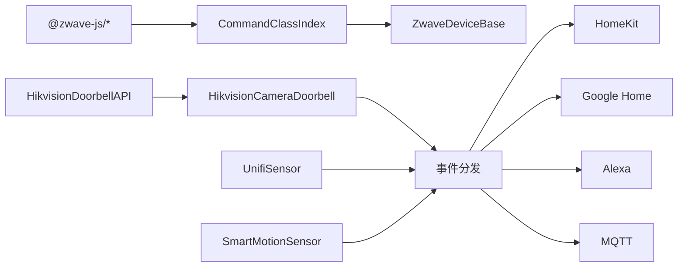

# 传感器设备集成

<cite>
**本文引用的文件**
- [plugins/zwave/src/main.ts](file://plugins/zwave/src/main.ts)
- [plugins/zwave/src/CommandClasses/index.ts](file://plugins/zwave/src/CommandClasses/index.ts)
- [plugins/zwave/src/CommandClasses/ZwaveDeviceBase.ts](file://plugins/zwave/src/CommandClasses/ZwaveDeviceBase.ts)
- [plugins/hikvision-doorbell/src/main.ts](file://plugins/hikvision-doorbell/src/main.ts)
- [plugins/hikvision-doorbell/src/doorbell-api.ts](file://plugins/hikvision-doorbell/src/doorbell-api.ts)
- [plugins/hikvision/src/hikvision-camera-api.ts](file://plugins/hikvision/src/hikvision-camera-api.ts)
- [plugins/unifi-protect/src/sensor.ts](file://plugins/unifi-protect/src/sensor.ts)
- [plugins/objectdetector/src/smart-motionsensor.ts](file://plugins/objectdetector/src/smart-motionsensor.ts)
- [plugins/homekit/src/types/sensor.ts](file://plugins/homekit/src/types/sensor.ts)
- [plugins/alexa/src/types/sensor.ts](file://plugins/alexa/src/types/sensor.ts)
- [plugins/google-home/src/types/sensor.ts](file://plugins/google-home/src/types/sensor.ts)
- [plugins/mqtt/src/autodiscovery.ts](file://plugins/mqtt/src/autodiscovery.ts)
- [plugins/core/src/aggregate.ts](file://plugins/core/src/aggregate.ts)
- [server/src/plugin/device.ts](file://server/src/plugin/device.ts)
- [server/src/plugin/plugin-remote.ts](file://server/src/plugin/plugin-remote.ts)
- [plugins/hikvision/src/probe.ts](file://plugins/hikvision/src/probe.ts)
</cite>

## 目录
1. [简介](#简介)
2. [项目结构](#项目结构)
3. [核心组件](#核心组件)
4. [架构总览](#架构总览)
5. [详细组件分析](#详细组件分析)
6. [依赖关系分析](#依赖关系分析)
7. [性能考量](#性能考量)
8. [故障排除指南](#故障排除指南)
9. [结论](#结论)
10. [附录](#附录)

## 简介
本技术文档面向 Scrypted 平台的传感器设备集成，系统性梳理了多种安全与环境传感器（门窗传感器、运动传感器、烟雾报警器、水浸传感器、温度/湿度传感器、音频传感器、空气质量传感器等）在平台中的接入方式、通信协议、状态管理、数据处理与配置参数，并提供故障排除建议。重点覆盖以下方面：
- 有线/无线协议适配：Hikvision 事件上报、Z-Wave 命令类映射、MQTT 自动发现、智能摄像头对象检测联动等
- 状态管理：状态检测、事件上报、状态缓存、异常处理与健康检查
- 数据处理：类型转换、数值范围处理、报警阈值、历史数据记录与聚合
- 配置参数：传感器编号、检测范围、灵敏度、报警延迟、休眠模式等
- 故障排除：传感器不响应、误报、信号不稳定等问题的诊断与解决

## 项目结构
Scrypted 的传感器集成由多插件协同完成：
- 协议适配层：Hikvision、Z-Wave、UniFi Protect、ONVIF 等
- 平台抽象层：统一的 Scrypted 接口与设备模型
- 生态对接层：HomeKit、Google Home、Alexa、MQTT 等第三方平台
- 核心服务：事件分发、状态代理、聚合与通知

图示来源
- [plugins/zwave/src/main.ts:39-176](file://plugins/zwave/src/main.ts#L39-L176)
- [plugins/hikvision-doorbell/src/main.ts:161-275](file://plugins/hikvision-doorbell/src/main.ts#L161-L275)
- [plugins/unifi-protect/src/sensor.ts:6-42](file://plugins/unifi-protect/src/sensor.ts#L6-L42)
- [plugins/objectdetector/src/smart-motionsensor.ts:8-133](file://plugins/objectdetector/src/smart-motionsensor.ts#L8-L133)
- [plugins/homekit/src/types/sensor.ts:23-105](file://plugins/homekit/src/types/sensor.ts#L23-L105)
- [plugins/google-home/src/types/sensor.ts:4-20](file://plugins/google-home/src/types/sensor.ts#L4-L20)
- [plugins/alexa/src/types/sensor.ts:28-133](file://plugins/alexa/src/types/sensor.ts#L28-L133)
- [plugins/mqtt/src/autodiscovery.ts:634-669](file://plugins/mqtt/src/autodiscovery.ts#L634-L669)
- [server/src/plugin/device.ts:23-69](file://server/src/plugin/device.ts#L23-L69)
- [server/src/plugin/plugin-remote.ts:238-273](file://server/src/plugin/plugin-remote.ts#L238-L273)

章节来源
- [plugins/zwave/src/main.ts:39-176](file://plugins/zwave/src/main.ts#L39-L176)
- [plugins/hikvision-doorbell/src/main.ts:161-275](file://plugins/hikvision-doorbell/src/main.ts#L161-L275)
- [plugins/unifi-protect/src/sensor.ts:6-42](file://plugins/unifi-protect/src/sensor.ts#L6-L42)
- [plugins/objectdetector/src/smart-motionsensor.ts:8-133](file://plugins/objectdetector/src/smart-motionsensor.ts#L8-L133)
- [plugins/homekit/src/types/sensor.ts:23-105](file://plugins/homekit/src/types/sensor.ts#L23-L105)
- [plugins/google-home/src/types/sensor.ts:4-20](file://plugins/google-home/src/types/sensor.ts#L4-L20)
- [plugins/alexa/src/types/sensor.ts:28-133](file://plugins/alexa/src/types/sensor.ts#L28-L133)
- [plugins/mqtt/src/autodiscovery.ts:634-669](file://plugins/mqtt/src/autodiscovery.ts#L634-L669)
- [server/src/plugin/device.ts:23-69](file://server/src/plugin/device.ts#L23-L69)
- [server/src/plugin/plugin-remote.ts:238-273](file://server/src/plugin/plugin-remote.ts#L238-L273)

## 核心组件
- Z-Wave 控制器与命令类映射：通过命令类索引将设备属性映射到 Scrypted 接口（如 BinarySensor、Thermometer、FloodSensor、CO2Sensor 等），并维护节点在线状态与健康检查。
- Hikvision 门铃/摄像头：支持事件流与轮询结合的事件上报，处理门禁、运动、通话等事件；同时支持报警输入配置。
- UniFi Protect 传感器：从设备 API 同步温度、湿度、开关、漏水、音频告警等状态。
- 智能运动传感器：基于摄像头对象检测结果，按类别、置信度、区域、标签等条件触发运动传感器。
- 平台状态与事件：设备状态代理负责读取/写入状态；远程插件通过 notify/notifyEventDetails 分发事件。
- 生态对接：HomeKit、Google Home、Alexa、MQTT 将传感器状态映射为各自平台的服务或能力。

章节来源
- [plugins/zwave/src/CommandClasses/index.ts:25-98](file://plugins/zwave/src/CommandClasses/index.ts#L25-L98)
- [plugins/zwave/src/CommandClasses/ZwaveDeviceBase.ts:33-125](file://plugins/zwave/src/CommandClasses/ZwaveDeviceBase.ts#L33-L125)
- [plugins/hikvision-doorbell/src/doorbell-api.ts:16-63](file://plugins/hikvision-doorbell/src/doorbell-api.ts#L16-L63)
- [plugins/hikvision/src/hikvision-camera-api.ts:612-647](file://plugins/hikvision/src/hikvision-camera-api.ts#L612-L647)
- [plugins/unifi-protect/src/sensor.ts:25-42](file://plugins/unifi-protect/src/sensor.ts#L25-L42)
- [plugins/objectdetector/src/smart-motionsensor.ts:148-260](file://plugins/objectdetector/src/smart-motionsensor.ts#L148-L260)
- [server/src/plugin/device.ts:56-69](file://server/src/plugin/device.ts#L56-L69)
- [server/src/plugin/plugin-remote.ts:238-273](file://server/src/plugin/plugin-remote.ts#L238-L273)

## 架构总览
下图展示传感器从设备到平台再到生态系统的端到端流程。

图示来源
- [plugins/zwave/src/main.ts:135-143](file://plugins/zwave/src/main.ts#L135-L143)
- [plugins/hikvision-doorbell/src/main.ts:172-272](file://plugins/hikvision-doorbell/src/main.ts#L172-L272)
- [plugins/unifi-protect/src/sensor.ts:25-42](file://plugins/unifi-protect/src/sensor.ts#L25-L42)
- [server/src/plugin/plugin-remote.ts:238-273](file://server/src/plugin/plugin-remote.ts#L238-L273)
- [plugins/homekit/src/types/sensor.ts:51-105](file://plugins/homekit/src/types/sensor.ts#L51-L105)
- [plugins/google-home/src/types/sensor.ts:9-19](file://plugins/google-home/src/types/sensor.ts#L9-L19)
- [plugins/alexa/src/types/sensor.ts:81-123](file://plugins/alexa/src/types/sensor.ts#L81-L123)
- [plugins/mqtt/src/autodiscovery.ts:634-669](file://plugins/mqtt/src/autodiscovery.ts#L634-L669)

## 详细组件分析

### Z-Wave 传感器集成
- 命令类映射：通过 CommandClassIndex 将 Z-Wave 命令类属性映射到 Scrypted 接口，如 BinarySensor、Thermometer、HumiditySensor、FloodSensor、CO2Sensor、PowerSensor、TamperSensor 等。
- 节点生命周期与健康检查：维护节点在线状态，定期健康检查，区分 Live/Query/Dead 状态并下发 online 状态。
- 设备刷新：支持按接口刷新特定命令类，避免频繁昂贵操作。

图示来源
- [plugins/zwave/src/main.ts:39-176](file://plugins/zwave/src/main.ts#L39-L176)
- [plugins/zwave/src/CommandClasses/ZwaveDeviceBase.ts:33-125](file://plugins/zwave/src/CommandClasses/ZwaveDeviceBase.ts#L33-L125)
- [plugins/zwave/src/CommandClasses/index.ts:25-98](file://plugins/zwave/src/CommandClasses/index.ts#L25-L98)

章节来源
- [plugins/zwave/src/CommandClasses/index.ts:75-98](file://plugins/zwave/src/CommandClasses/index.ts#L75-L98)
- [plugins/zwave/src/CommandClasses/ZwaveDeviceBase.ts:67-116](file://plugins/zwave/src/CommandClasses/ZwaveDeviceBase.ts#L67-L116)
- [plugins/zwave/src/main.ts:459-527](file://plugins/zwave/src/main.ts#L459-L527)

### Hikvision 门铃/摄像头传感器
- 事件上报：优先使用告警流（Alert Stream），若不可用则回退轮询；支持运动、门禁状态、通话邀请/挂断/通话中、门锁状态变更等事件。
- 事件过滤与时间校验：对事件进行去重、年龄校验与门号解析，确保事件时效性与准确性。
- 报警输入：可配置 IO 输入端口的报警触发策略，用于联动闪光灯/蜂鸣器等。

图示来源
- [plugins/hikvision-doorbell/src/doorbell-api.ts:244-288](file://plugins/hikvision-doorbell/src/doorbell-api.ts#L244-L288)
- [plugins/hikvision-doorbell/src/doorbell-api.ts:958-985](file://plugins/hikvision-doorbell/src/doorbell-api.ts#L958-L985)
- [plugins/hikvision-doorbell/src/main.ts:172-272](file://plugins/hikvision-doorbell/src/main.ts#L172-L272)
- [plugins/hikvision/src/hikvision-camera-api.ts:612-647](file://plugins/hikvision/src/hikvision-camera-api.ts#L612-L647)

章节来源
- [plugins/hikvision-doorbell/src/doorbell-api.ts:16-63](file://plugins/hikvision-doorbell/src/doorbell-api.ts#L16-L63)
- [plugins/hikvision-doorbell/src/doorbell-api.ts:244-288](file://plugins/hikvision-doorbell/src/doorbell-api.ts#L244-L288)
- [plugins/hikvision-doorbell/src/doorbell-api.ts:958-985](file://plugins/hikvision-doorbell/src/doorbell-api.ts#L958-L985)
- [plugins/hikvision-doorbell/src/main.ts:161-275](file://plugins/hikvision-doorbell/src/main.ts#L161-L275)
- [plugins/hikvision/src/hikvision-camera-api.ts:612-647](file://plugins/hikvision/src/hikvision-camera-api.ts#L612-L647)

### UniFi Protect 传感器
- 状态同步：从 Protect API bootstrap 中查找对应传感器，同步温度、湿度、开关、漏水、音频告警、运动状态等。
- 运动去抖：使用去抖函数控制运动状态持续时间。

图示来源
- [plugins/unifi-protect/src/sensor.ts:16-42](file://plugins/unifi-protect/src/sensor.ts#L16-L42)

章节来源
- [plugins/unifi-protect/src/sensor.ts:6-42](file://plugins/unifi-protect/src/sensor.ts#L6-L42)

### 智能运动传感器（基于摄像头对象检测）
- 触发条件：可配置检测类别、最小置信度、区域、标签与编辑距离、是否需要图片、是否仅接受 Scrypted NVR 检测等。
- 行为控制：支持设定运动持续时长，到期自动复位；支持仅在运动停止时复位。
- 动态绑定：根据选择的摄像头动态填充可用类别与区域。

图示来源
- [plugins/objectdetector/src/smart-motionsensor.ts:159-260](file://plugins/objectdetector/src/smart-motionsensor.ts#L159-L260)

章节来源
- [plugins/objectdetector/src/smart-motionsensor.ts:8-133](file://plugins/objectdetector/src/smart-motionsensor.ts#L8-L133)
- [plugins/objectdetector/src/smart-motionsensor.ts:159-260](file://plugins/objectdetector/src/smart-motionsensor.ts#L159-L260)

### 平台状态与事件分发
- 设备状态代理：通过 Proxy 读取系统状态，提供 setState 回调以写入状态。
- 事件分发：支持两种 notify 形式，分别处理传统属性事件与 EventDetails 事件，确保 mixinId 与属性正确传递。

图示来源
- [server/src/plugin/device.ts:56-69](file://server/src/plugin/device.ts#L56-L69)
- [server/src/plugin/plugin-remote.ts:238-273](file://server/src/plugin/plugin-remote.ts#L238-L273)

章节来源
- [server/src/plugin/device.ts:23-69](file://server/src/plugin/device.ts#L23-L69)
- [server/src/plugin/plugin-remote.ts:238-273](file://server/src/plugin/plugin-remote.ts#L238-L273)

### 生态对接（HomeKit、Google Home、Alexa、MQTT）
- HomeKit：将 Thermometer、HumiditySensor、FloodSensor、AudioSensor、MotionSensor、EntrySensor 等映射为对应服务；支持 TamperSensor 的状态篡改提示。
- Google Home：将 BinarySensor 映射为 OpenClose 查询能力。
- Alexa：声明 ContactSensor/MotionSensor/TemperatureSensor 能力并上报检测状态。
- MQTT：自动发现二进制传感器（Motion/Binary/Occupancy/Flood/Audio/Online），以及温度传感器。

章节来源
- [plugins/homekit/src/types/sensor.ts:23-105](file://plugins/homekit/src/types/sensor.ts#L23-L105)
- [plugins/homekit/src/types/sensor.ts:131-137](file://plugins/homekit/src/types/sensor.ts#L131-L137)
- [plugins/google-home/src/types/sensor.ts:4-20](file://plugins/google-home/src/types/sensor.ts#L4-L20)
- [plugins/alexa/src/types/sensor.ts:28-133](file://plugins/alexa/src/types/sensor.ts#L28-L133)
- [plugins/mqtt/src/autodiscovery.ts:634-669](file://plugins/mqtt/src/autodiscovery.ts#L634-L669)

## 依赖关系分析
- Z-Wave 插件内部依赖 @zwave-js 与 @zwave-js/core，通过 CommandClassIndex 统一映射。
- Hikvision 插件依赖 ISAPI 协议与事件轮询，门铃插件扩展了门禁控制与 SIP 集成。
- 生态对接插件均依赖 @scrypted/sdk 的接口定义与设备模型。
- 核心服务依赖事件分发与状态代理，保证跨插件一致性。

图示来源
- [plugins/zwave/src/CommandClasses/index.ts:1-98](file://plugins/zwave/src/CommandClasses/index.ts#L1-L98)
- [plugins/zwave/src/CommandClasses/ZwaveDeviceBase.ts:1-225](file://plugins/zwave/src/CommandClasses/ZwaveDeviceBase.ts#L1-L225)
- [plugins/hikvision-doorbell/src/doorbell-api.ts:1-131](file://plugins/hikvision-doorbell/src/doorbell-api.ts#L1-L131)
- [plugins/hikvision-doorbell/src/main.ts:1-120](file://plugins/hikvision-doorbell/src/main.ts#L1-L120)
- [plugins/unifi-protect/src/sensor.ts:1-43](file://plugins/unifi-protect/src/sensor.ts#L1-L43)
- [plugins/objectdetector/src/smart-motionsensor.ts:1-133](file://plugins/objectdetector/src/smart-motionsensor.ts#L1-L133)
- [server/src/plugin/plugin-remote.ts:238-273](file://server/src/plugin/plugin-remote.ts#L238-L273)

章节来源
- [plugins/zwave/src/CommandClasses/index.ts:1-98](file://plugins/zwave/src/CommandClasses/index.ts#L1-L98)
- [plugins/hikvision-doorbell/src/doorbell-api.ts:1-131](file://plugins/hikvision-doorbell/src/doorbell-api.ts#L1-L131)
- [plugins/hikvision-doorbell/src/main.ts:1-120](file://plugins/hikvision-doorbell/src/main.ts#L1-L120)
- [plugins/unifi-protect/src/sensor.ts:1-43](file://plugins/unifi-protect/src/sensor.ts#L1-L43)
- [plugins/objectdetector/src/smart-motionsensor.ts:1-133](file://plugins/objectdetector/src/smart-motionsensor.ts#L1-L133)
- [server/src/plugin/plugin-remote.ts:238-273](file://server/src/plugin/plugin-remote.ts#L238-L273)

## 性能考量
- Z-Wave 刷新策略：非用户主动触发的 refresh 将被忽略，避免频繁昂贵的 CC 值刷新；仅刷新与目标接口相关的命令类。
- Hikvision 事件轮询：采用告警流优先、轮询兜底的策略，并对事件进行去重与时间校验，减少无效事件处理。
- 智能运动传感器：支持按需去抖与定时复位，避免长时间占用资源。
- 平台事件分发：notify/notifyEventDetails 仅在必要时更新状态，降低广播开销。

章节来源
- [plugins/zwave/src/CommandClasses/ZwaveDeviceBase.ts:88-110](file://plugins/zwave/src/CommandClasses/ZwaveDeviceBase.ts#L88-L110)
- [plugins/hikvision-doorbell/src/doorbell-api.ts:244-288](file://plugins/hikvision-doorbell/src/doorbell-api.ts#L244-L288)
- [plugins/objectdetector/src/smart-motionsensor.ts:143-157](file://plugins/objectdetector/src/smart-motionsensor.ts#L143-L157)

## 故障排除指南
- 传感器不响应
  - Z-Wave：确认节点在线状态与健康检查；必要时执行“强制移除节点”与“刷新信息”；检查网络密钥与安全等级。
  - Hikvision：确认设备已激活并通过探测接口返回设备信息；检查告警流是否可用，必要时启用轮询；核对事件时间与时区。
  - UniFi Protect：确认 API 可访问且传感器存在；检查去抖设置与运动触发条件。
- 误报
  - Z-Wave：调整命令类刷新频率与阈值；检查节点睡眠唤醒行为。
  - Hikvision：调整运动脉冲计数与超时；检查门禁事件与通话事件的并发处理。
  - 智能运动传感器：提高最小置信度、启用区域过滤、限制标签编辑距离与分数。
- 信号不稳定
  - Z-Wave：执行网络修复（Heal Network）；检查路由与中继；关注节点降级与健康检查。
  - Hikvision：检查网络连通性与认证；确认设备时间与本地时区一致；避免长时间阻塞请求队列。
- 日志与诊断
  - 使用诊断插件查看系统日志；关注设备状态代理与事件分发的错误输出。

章节来源
- [plugins/zwave/src/main.ts:170-176](file://plugins/zwave/src/main.ts#L170-L176)
- [plugins/zwave/src/CommandClasses/ZwaveDeviceBase.ts:208-223](file://plugins/zwave/src/CommandClasses/ZwaveDeviceBase.ts#L208-L223)
- [plugins/hikvision/src/probe.ts:4-36](file://plugins/hikvision/src/probe.ts#L4-L36)
- [plugins/hikvision-doorbell/src/main.ts:874-911](file://plugins/hikvision-doorbell/src/main.ts#L874-L911)
- [plugins/objectdetector/src/smart-motionsensor.ts:159-260](file://plugins/objectdetector/src/smart-motionsensor.ts#L159-L260)

## 结论
Scrypted 在传感器集成方面提供了完善的协议适配、状态管理与生态对接能力。通过 Z-Wave 命令类映射、Hikvision 事件上报、UniFi Protect 状态同步与智能运动传感器联动，能够覆盖多种安全与环境监测场景。配合 HomeKit、Google Home、Alexa、MQTT 等生态平台，用户可以构建灵活的自动化体系。在实际部署中，应重点关注事件过滤、健康检查与阈值配置，以获得稳定可靠的传感器体验。

## 附录

### 传感器类型与接口映射概览
- 门禁/接触：EntrySensor → HomeKit ContactSensor；Alexa ContactSensor；MQTT binary_sensor
- 运动：MotionSensor → HomeKit MotionSensor；Alexa MotionSensor；MQTT binary_sensor
- 温度/湿度：Thermometer/HumiditySensor → HomeKit Temperature/Humidity；MQTT sensor
- 水浸：FloodSensor → HomeKit LeakSensor；MQTT binary_sensor
- 音频：AudioSensor → HomeKit ContactSensor；MQTT binary_sensor
- 空气质量：CO2Sensor → HomeKit CO2Sensor；PM25/PM10/VOCSensor/NOXSensor → HomeKit/AirQualitySensor；MQTT sensor
- 其他：OccupancySensor → HomeKit/OccupancySensor；MQTT binary_sensor；Online → MQTT binary_sensor

章节来源
- [plugins/homekit/src/types/sensor.ts:23-105](file://plugins/homekit/src/types/sensor.ts#L23-L105)
- [plugins/alexa/src/types/sensor.ts:28-133](file://plugins/alexa/src/types/sensor.ts#L28-L133)
- [plugins/mqtt/src/autodiscovery.ts:634-669](file://plugins/mqtt/src/autodiscovery.ts#L634-L669)

### 配置参数参考
- Z-Wave
  - 网络密钥与 S2 安全密钥：网络安全性与加密要求
  - 软复位、串口、网络密钥、S2 密钥组
  - 包含/排除设备、网络修复
- Hikvision 门铃
  - SIP 模式、客户端/网关参数、房间号、代理电话、门铃电话、按钮号
  - 运动超时、运动脉冲计数
- 智能运动传感器
  - 关联摄像头、检测类别、区域、标签、最小置信度、是否需要图片、是否仅接受 Scrypted NVR 检测
  - 运动持续时长、运动停止即复位

章节来源
- [plugins/zwave/src/main.ts:178-266](file://plugins/zwave/src/main.ts#L178-L266)
- [plugins/hikvision-doorbell/src/main.ts:874-911](file://plugins/hikvision-doorbell/src/main.ts#L874-L911)
- [plugins/objectdetector/src/smart-motionsensor.ts:8-76](file://plugins/objectdetector/src/smart-motionsensor.ts#L8-L76)