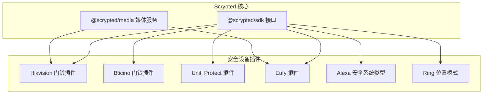
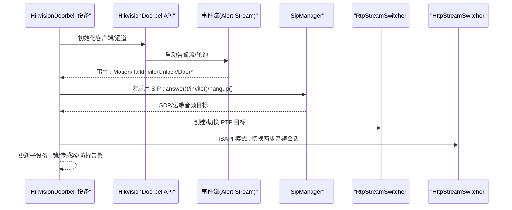
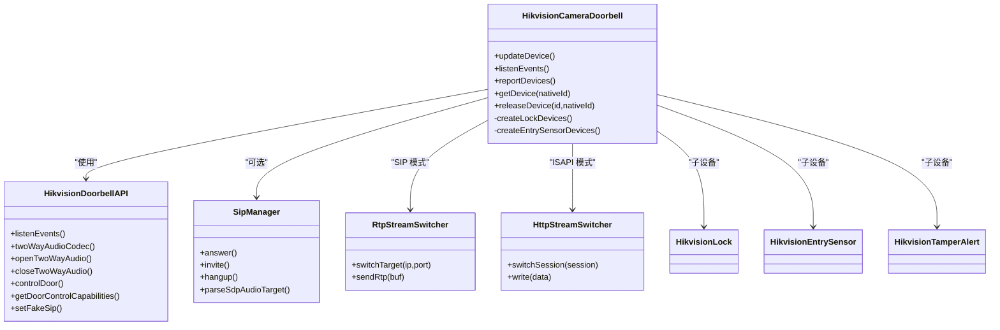
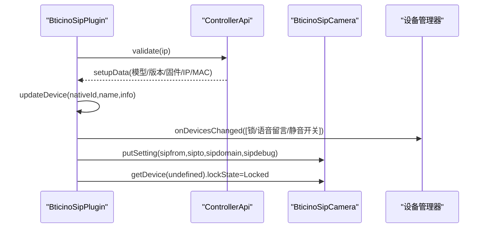
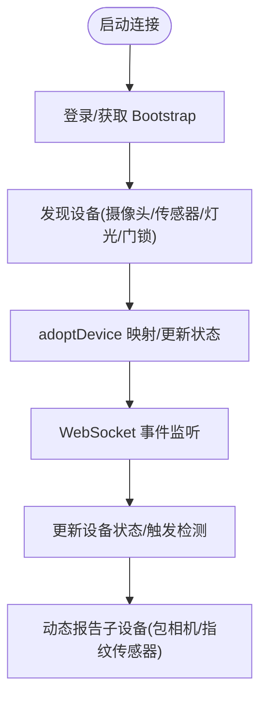
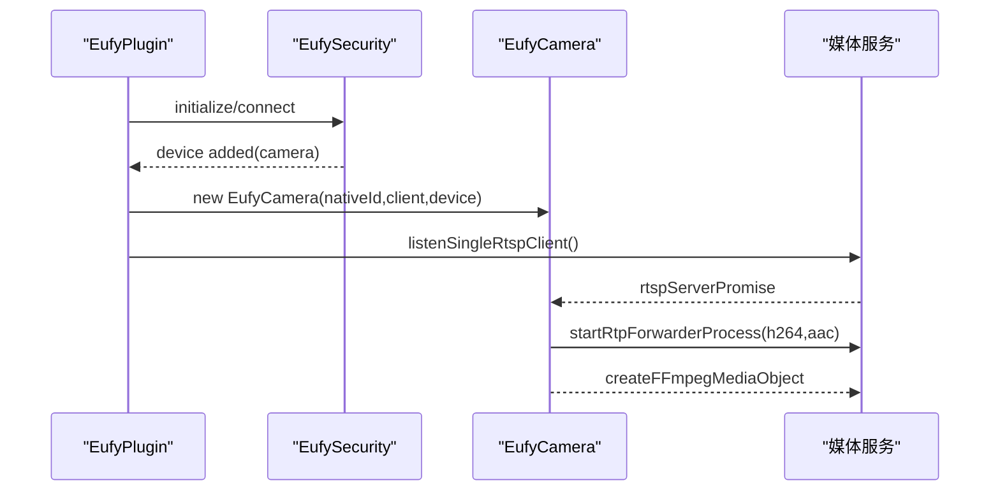
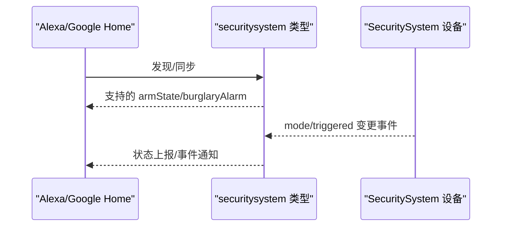
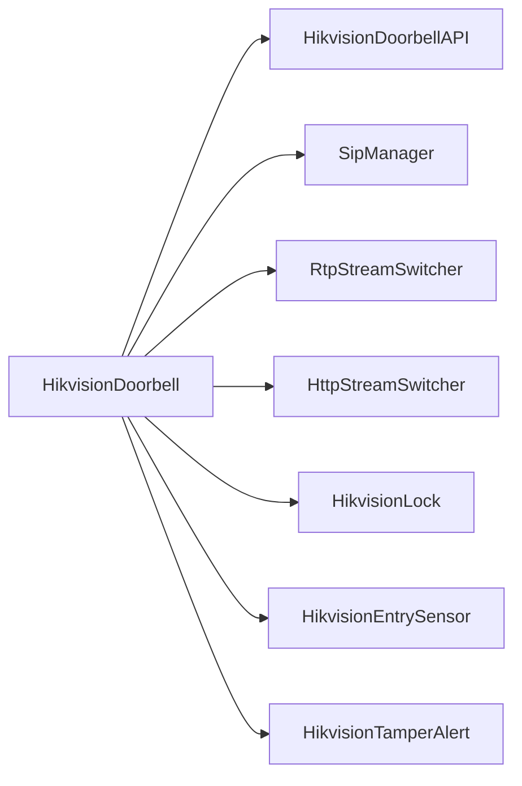

# 安全设备集成

<cite>
**本文引用的文件**
- [plugins/hikvision-doorbell/src/main.ts](file://plugins/hikvision-doorbell/src/main.ts)
- [plugins/hikvision-doorbell/src/doorbell-api.ts](file://plugins/hikvision-doorbell/src/doorbell-api.ts)
- [plugins/hikvision-doorbell/src/sip-manager.ts](file://plugins/hikvision-doorbell/src/sip-manager.ts)
- [plugins/hikvision-doorbell/src/lock.ts](file://plugins/hikvision-doorbell/src/lock.ts)
- [plugins/hikvision-doorbell/src/entry-sensor.ts](file://plugins/hikvision-doorbell/src/entry-sensor.ts)
- [plugins/hikvision-doorbell/src/tamper-alert.ts](file://plugins/hikvision-doorbell/src/tamper-alert.ts)
- [plugins/hikvision-doorbell/src/rtp-stream-switcher.ts](file://plugins/hikvision-doorbell/src/rtp-stream-switcher.ts)
- [plugins/hikvision-doorbell/src/http-stream-switcher.ts](file://plugins/hikvision-doorbell/src/http-stream-switcher.ts)
- [plugins/bticino/src/main.ts](file://plugins/bticino/src/main.ts)
- [plugins/bticino/src/bticino-camera.ts](file://plugins/bticino/src/bticino-camera.ts)
- [plugins/unifi-protect/src/main.ts](file://plugins/unifi-protect/src/main.ts)
- [plugins/eufy/src/main.ts](file://plugins/eufy/src/main.ts)
- [plugins/alexa/src/types/securitysystem.ts](file://plugins/alexa/src/types/securitysystem.ts)
- [plugins/ring/src/location.ts](file://plugins/ring/src/location.ts)
</cite>

## 目录
1. [简介](#简介)
2. [项目结构](#项目结构)
3. [核心组件](#核心组件)
4. [架构总览](#架构总览)
5. [详细组件分析](#详细组件分析)
6. [依赖关系分析](#依赖关系分析)
7. [性能考虑](#性能考虑)
8. [故障排除指南](#故障排除指南)
9. [结论](#结论)
10. [附录](#附录)

## 简介
本技术文档面向 Scrypted 平台的安全设备集成，系统性梳理了门铃、门锁、传感器等安全相关设备的接入与控制方案。重点覆盖以下方面：
- 门铃设备：SIP 双向对讲、事件监听（访客按铃、通话状态）、无缝重连、访客记录联动
- 门锁设备：远程开锁/闭锁、开锁记录、电池状态监控、异常报警处理
- 传感器设备：门窗传感器、运动传感器、烟雾报警器等数据获取与状态上报
- 配置参数、通信协议、设备发现与自动配置
- 故障排除与常见问题诊断
- 与自动化系统的集成：安全模式切换、紧急报警、远程控制

## 项目结构
围绕安全设备集成，Scrypted 在多个插件中提供了统一的设备接口与协议适配层：
- Hikvision 门铃插件：基于 ISAPI 与 SIP 的完整双向对讲与事件处理
- Bticino 摄像门铃插件：通过 HTTP API 与 SIP 实现门铃与锁控
- Ubiquiti Unifi Protect 插件：摄像头、传感器、门锁等统一接入与事件分发
- Eufy 插件：P2P 推流与本地转码，支持运动检测等传感器能力
- Alexa/Google Home 等生态对接：安全系统模式与状态上报

图表来源
- [plugins/hikvision-doorbell/src/main.ts:61-105](file://plugins/hikvision-doorbell/src/main.ts#L61-L105)
- [plugins/bticino/src/main.ts:9-18](file://plugins/bticino/src/main.ts#L9-L18)
- [plugins/unifi-protect/src/main.ts:34-59](file://plugins/unifi-protect/src/main.ts#L34-L59)
- [plugins/eufy/src/main.ts:14-23](file://plugins/eufy/src/main.ts#L14-L23)
- [plugins/alexa/src/types/securitysystem.ts:18-27](file://plugins/alexa/src/types/securitysystem.ts#L18-L27)
- [plugins/ring/src/location.ts:352-375](file://plugins/ring/src/location.ts#L352-L375)

章节来源
- [plugins/hikvision-doorbell/src/main.ts:61-105](file://plugins/hikvision-doorbell/src/main.ts#L61-L105)
- [plugins/bticino/src/main.ts:9-18](file://plugins/bticino/src/main.ts#L9-L18)
- [plugins/unifi-protect/src/main.ts:34-59](file://plugins/unifi-protect/src/main.ts#L34-L59)
- [plugins/eufy/src/main.ts:14-23](file://plugins/eufy/src/main.ts#L14-L23)
- [plugins/alexa/src/types/securitysystem.ts:18-27](file://plugins/alexa/src/types/securitysystem.ts#L18-L27)
- [plugins/ring/src/location.ts:352-375](file://plugins/ring/src/location.ts#L352-L375)

## 核心组件
- 设备抽象与接口
  - 门铃：Camera、VideoCamera、Intercom、BinarySensor、DeviceProvider、HttpRequestHandler、VideoClips、Reboot
  - 门锁：Lock
  - 传感器：BinarySensor、MotionSensor、Thermometer、HumiditySensor、AudioSensor、FloodSensor 等
  - 安全系统：SecuritySystem（用于与 Alexa/Google Home 等生态对接）
- 通信与协议
  - Hikvision：ISAPI（HTTP/XML）、RTSP、SIP（双向音频/视频）、RTP/UDP 转发
  - Bticino：HTTP API（重启、静音开关）、SIP 对讲
  - Unifi Protect：WebSocket 事件、HTTP API、设备发现
  - Eufy：P2P 连接、本地 RTSP 转发
- 自动化与生态集成
  - Alexa Security Panel Controller：armState、burglaryAlarm 上报
  - Ring 位置模式映射到安全系统模式

章节来源
- [plugins/hikvision-doorbell/src/main.ts:596-614](file://plugins/hikvision-doorbell/src/main.ts#L596-L614)
- [plugins/bticino/src/main.ts:109-127](file://plugins/bticino/src/main.ts#L109-L127)
- [plugins/unifi-protect/src/main.ts:370-397](file://plugins/unifi-protect/src/main.ts#L370-L397)
- [plugins/alexa/src/types/securitysystem.ts:18-68](file://plugins/alexa/src/types/securitysystem.ts#L18-L68)

## 架构总览
下图展示了门铃设备在 Hikvision 插件中的关键交互：事件监听、SIP 对讲、RTP/HTTP 流切换与设备子资源（门锁、传感器）的动态发现。

图表来源
- [plugins/hikvision-doorbell/src/main.ts:161-275](file://plugins/hikvision-doorbell/src/main.ts#L161-L275)
- [plugins/hikvision-doorbell/src/doorbell-api.ts:244-288](file://plugins/hikvision-doorbell/src/doorbell-api.ts#L244-L288)
- [plugins/hikvision-doorbell/src/sip-manager.ts:149-320](file://plugins/hikvision-doorbell/src/sip-manager.ts#L149-L320)
- [plugins/hikvision-doorbell/src/rtp-stream-switcher.ts:31-65](file://plugins/hikvision-doorbell/src/rtp-stream-switcher.ts#L31-L65)
- [plugins/hikvision-doorbell/src/http-stream-switcher.ts:54-91](file://plugins/hikvision-doorbell/src/http-stream-switcher.ts#L54-L91)

章节来源
- [plugins/hikvision-doorbell/src/main.ts:161-275](file://plugins/hikvision-doorbell/src/main.ts#L161-L275)
- [plugins/hikvision-doorbell/src/doorbell-api.ts:244-288](file://plugins/hikvision-doorbell/src/doorbell-api.ts#L244-L288)
- [plugins/hikvision-doorbell/src/sip-manager.ts:149-320](file://plugins/hikvision-doorbell/src/sip-manager.ts#L149-L320)
- [plugins/hikvision-doorbell/src/rtp-stream-switcher.ts:31-65](file://plugins/hikvision-doorbell/src/rtp-stream-switcher.ts#L31-L65)
- [plugins/hikvision-doorbell/src/http-stream-switcher.ts:54-91](file://plugins/hikvision-doorbell/src/http-stream-switcher.ts#L54-L91)

## 详细组件分析

### Hikvision 门铃设备
- 事件处理
  - 使用告警流与可选轮询获取事件，解析事件码映射到 Motion、TalkInvite、TalkOnCall、TalkHangup、Unlock、Lock、DoorOpened/DoorClosed/DoorAbnormalOpened、CaseTamperAlert 等
  - 防拆告警优先级处理：若无独立防拆设备则回退为 Motion
- 双向对讲
  - SIP 模式：answer()/invite()/hangup()，解析 SDP 获取远端音频目标，使用 RTP 转发器进行无缝切换
  - ISAPI 模式：通过 HTTP 两步音频通道 open/close，配合 HttpStreamSwitcher 实现无缝会话切换
- 子设备发现与管理
  - 支持动态报告锁、接触式门传感器、防拆告警开关
  - 门控能力查询与命令校验，确保 doorNo 与命令在设备能力范围内
- 配置与自动安装 SIP 设置
  - 在网关模式下自动向设备写入 SIP 服务器配置、电话号码记录与按键配置

图表来源
- [plugins/hikvision-doorbell/src/main.ts:61-105](file://plugins/hikvision-doorbell/src/main.ts#L61-L105)
- [plugins/hikvision-doorbell/src/doorbell-api.ts:88-131](file://plugins/hikvision-doorbell/src/doorbell-api.ts#L88-L131)
- [plugins/hikvision-doorbell/src/sip-manager.ts:52-66](file://plugins/hikvision-doorbell/src/sip-manager.ts#L52-L66)
- [plugins/hikvision-doorbell/src/rtp-stream-switcher.ts:17-25](file://plugins/hikvision-doorbell/src/rtp-stream-switcher.ts#L17-L25)
- [plugins/hikvision-doorbell/src/http-stream-switcher.ts:15-24](file://plugins/hikvision-doorbell/src/http-stream-switcher.ts#L15-L24)
- [plugins/hikvision-doorbell/src/lock.ts:7-15](file://plugins/hikvision-doorbell/src/lock.ts#L7-L15)
- [plugins/hikvision-doorbell/src/entry-sensor.ts:7-13](file://plugins/hikvision-doorbell/src/entry-sensor.ts#L7-L13)
- [plugins/hikvision-doorbell/src/tamper-alert.ts:7-15](file://plugins/hikvision-doorbell/src/tamper-alert.ts#L7-L15)

章节来源
- [plugins/hikvision-doorbell/src/main.ts:161-275](file://plugins/hikvision-doorbell/src/main.ts#L161-L275)
- [plugins/hikvision-doorbell/src/doorbell-api.ts:486-558](file://plugins/hikvision-doorbell/src/doorbell-api.ts#L486-L558)
- [plugins/hikvision-doorbell/src/sip-manager.ts:181-280](file://plugins/hikvision-doorbell/src/sip-manager.ts#L181-L280)
- [plugins/hikvision-doorbell/src/rtp-stream-switcher.ts:31-65](file://plugins/hikvision-doorbell/src/rtp-stream-switcher.ts#L31-L65)
- [plugins/hikvision-doorbell/src/http-stream-switcher.ts:54-91](file://plugins/hikvision-doorbell/src/http-stream-switcher.ts#L54-L91)
- [plugins/hikvision-doorbell/src/lock.ts:48-58](file://plugins/hikvision-doorbell/src/lock.ts#L48-L58)
- [plugins/hikvision-doorbell/src/entry-sensor.ts:22-24](file://plugins/hikvision-doorbell/src/entry-sensor.ts#L22-L24)
- [plugins/hikvision-doorbell/src/tamper-alert.ts:23-31](file://plugins/hikvision-doorbell/src/tamper-alert.ts#L23-L31)

### Bticino 摄像门铃与锁控
- 设备创建与信息采集：通过控制器 API 校验并生成设备信息，声明门铃接口与子设备（锁、语音留言开关、静音开关）
- SIP 设置注入：设置 sipfrom/sipto/sipdomain/sipdebug，初始化锁状态为锁定
- 设备接口：Camera、VideoCamera、Intercom、BinarySensor、MotionSensor、DeviceProvider、HttpRequestHandler、VideoClips、Reboot

图表来源
- [plugins/bticino/src/main.ts:47-106](file://plugins/bticino/src/main.ts#L47-L106)
- [plugins/bticino/src/main.ts:109-127](file://plugins/bticino/src/main.ts#L109-L127)
- [plugins/bticino/src/main.ts:130-139](file://plugins/bticino/src/main.ts#L130-L139)
- [plugins/bticino/src/bticino-camera.ts:69-104](file://plugins/bticino/src/bticino-camera.ts#L69-L104)

章节来源
- [plugins/bticino/src/main.ts:47-106](file://plugins/bticino/src/main.ts#L47-L106)
- [plugins/bticino/src/main.ts:109-127](file://plugins/bticino/src/main.ts#L109-L127)
- [plugins/bticino/src/main.ts:130-139](file://plugins/bticino/src/main.ts#L130-L139)
- [plugins/bticino/src/bticino-camera.ts:69-104](file://plugins/bticino/src/bticino-camera.ts#L69-L104)

### Unifi Protect 摄像头/传感器/门锁
- 设备发现：根据 Bootstrap 信息识别摄像头、传感器、灯光、门锁，按特性添加接口（BinarySensor、MotionSensor、Lock 等）
- 事件监听：WebSocket 消息分发，更新设备状态；ring/motion/fingerprint 等事件触发检测
- 自动化：支持包相机子设备、指纹传感器子设备的动态发现与上报

图表来源
- [plugins/unifi-protect/src/main.ts:298-502](file://plugins/unifi-protect/src/main.ts#L298-L502)
- [plugins/unifi-protect/src/main.ts:625-719](file://plugins/unifi-protect/src/main.ts#L625-L719)
- [plugins/unifi-protect/src/main.ts:137-277](file://plugins/unifi-protect/src/main.ts#L137-L277)

章节来源
- [plugins/unifi-protect/src/main.ts:298-502](file://plugins/unifi-protect/src/main.ts#L298-L502)
- [plugins/unifi-protect/src/main.ts:625-719](file://plugins/unifi-protect/src/main.ts#L625-L719)
- [plugins/unifi-protect/src/main.ts:137-277](file://plugins/unifi-protect/src/main.ts#L137-L277)

### Eufy 摄像头与运动检测
- 登录与设备发现：初始化客户端，监听设备添加事件，过滤非摄像头设备
- 接口与能力：根据设备属性添加 VideoCamera、Battery、MotionSensor 等接口
- 推流与转码：本地监听 RTSP 客户端，使用 RTP Forwarder 将 H.264/AAC 转发至 RTSP 客户端

图表来源
- [plugins/eufy/src/main.ts:151-194](file://plugins/eufy/src/main.ts#L151-L194)
- [plugins/eufy/src/main.ts:258-290](file://plugins/eufy/src/main.ts#L258-L290)
- [plugins/eufy/src/main.ts:74-148](file://plugins/eufy/src/main.ts#L74-L148)

章节来源
- [plugins/eufy/src/main.ts:151-194](file://plugins/eufy/src/main.ts#L151-L194)
- [plugins/eufy/src/main.ts:258-290](file://plugins/eufy/src/main.ts#L258-L290)
- [plugins/eufy/src/main.ts:74-148](file://plugins/eufy/src/main.ts#L74-L148)

### 安全系统与自动化集成
- Alexa 安全面板：支持 armState、burglaryAlarm 属性上报，映射安全系统模式
- Ring 位置模式：将 away/home/disabled 映射为 AwayArmed/HomeArmed/Disarmed，并支持夜间模式旁路

图表来源
- [plugins/alexa/src/types/securitysystem.ts:18-68](file://plugins/alexa/src/types/securitysystem.ts#L18-L68)
- [plugins/alexa/src/types/securitysystem.ts:78-104](file://plugins/alexa/src/types/securitysystem.ts#L78-L104)
- [plugins/ring/src/location.ts:352-397](file://plugins/ring/src/location.ts#L352-L397)

章节来源
- [plugins/alexa/src/types/securitysystem.ts:18-68](file://plugins/alexa/src/types/securitysystem.ts#L18-L68)
- [plugins/alexa/src/types/securitysystem.ts:78-104](file://plugins/alexa/src/types/securitysystem.ts#L78-L104)
- [plugins/ring/src/location.ts:352-397](file://plugins/ring/src/location.ts#L352-L397)

## 依赖关系分析
- 组件耦合
  - HikvisionDoorbell 主类与 API、SIP、RTP/HTTP 切换器松耦合，通过接口与事件解耦
  - 子设备（锁、传感器、防拆告警）通过设备管理器动态注册，避免强绑定
- 外部依赖
  - SIP 协议栈、RTP/UDP 套接字、HTTP/XML 解析、WebSocket 事件
- 循环依赖
  - 未见循环导入；各模块职责清晰，通过 SDK 设备管理器进行交互

图表来源
- [plugins/hikvision-doorbell/src/main.ts:61-105](file://plugins/hikvision-doorbell/src/main.ts#L61-L105)
- [plugins/hikvision-doorbell/src/doorbell-api.ts:88-131](file://plugins/hikvision-doorbell/src/doorbell-api.ts#L88-L131)
- [plugins/hikvision-doorbell/src/sip-manager.ts:52-66](file://plugins/hikvision-doorbell/src/sip-manager.ts#L52-L66)
- [plugins/hikvision-doorbell/src/rtp-stream-switcher.ts:17-25](file://plugins/hikvision-doorbell/src/rtp-stream-switcher.ts#L17-L25)
- [plugins/hikvision-doorbell/src/http-stream-switcher.ts:15-24](file://plugins/hikvision-doorbell/src/http-stream-switcher.ts#L15-L24)
- [plugins/hikvision-doorbell/src/lock.ts:7-15](file://plugins/hikvision-doorbell/src/lock.ts#L7-L15)
- [plugins/hikvision-doorbell/src/entry-sensor.ts:7-13](file://plugins/hikvision-doorbell/src/entry-sensor.ts#L7-L13)
- [plugins/hikvision-doorbell/src/tamper-alert.ts:7-15](file://plugins/hikvision-doorbell/src/tamper-alert.ts#L7-L15)

章节来源
- [plugins/hikvision-doorbell/src/main.ts:61-105](file://plugins/hikvision-doorbell/src/main.ts#L61-L105)
- [plugins/hikvision-doorbell/src/doorbell-api.ts:88-131](file://plugins/hikvision-doorbell/src/doorbell-api.ts#L88-L131)
- [plugins/hikvision-doorbell/src/sip-manager.ts:52-66](file://plugins/hikvision-doorbell/src/sip-manager.ts#L52-L66)
- [plugins/hikvision-doorbell/src/rtp-stream-switcher.ts:17-25](file://plugins/hikvision-doorbell/src/rtp-stream-switcher.ts#L17-L25)
- [plugins/hikvision-doorbell/src/http-stream-switcher.ts:15-24](file://plugins/hikvision-doorbell/src/http-stream-switcher.ts#L15-L24)
- [plugins/hikvision-doorbell/src/lock.ts:7-15](file://plugins/hikvision-doorbell/src/lock.ts#L7-L15)
- [plugins/hikvision-doorbell/src/entry-sensor.ts:7-13](file://plugins/hikvision-doorbell/src/entry-sensor.ts#L7-L13)
- [plugins/hikvision-doorbell/src/tamper-alert.ts:7-15](file://plugins/hikvision-doorbell/src/tamper-alert.ts#L7-L15)

## 性能考虑
- 流媒体转发
  - RTP/UDP 转发采用单源多目标切换，减少对上层的中断时间
  - HTTP 两步音频通道切换时严格先关闭旧会话再打开新会话，避免设备端错误
- 事件处理
  - 事件流采用“心跳超时”机制，长时间无心跳自动停止告警流以节省资源
  - 请求队列串行化，失败不阻塞后续请求
- 认证与注册
  - SIP 注册采用一次性认证上下文，减少重复握手成本
- 电池与网络
  - Eufy 插件在弱网场景下提供低分辨率选项，降低带宽占用

## 故障排除指南
- 设备离线
  - 检查网络连通性与端口可达性；确认 ISAPI/SIP 端口开放
  - 查看 WebSocket/HTTP 超时日志，必要时重启连接
- 通信失败
  - SIP 注册失败：检查 realm、用户名/密码、本地端口是否被占用
  - RTP 目标不可达：确认 SDP 中的 IP/端口正确，IPv4/IPv6 兼容性
- 误报处理
  - 门铃 Motion 事件脉冲式触发：通过阈值与超时合并，避免频繁误报
  - 防拆告警与 Motion 回退：无独立防拆设备时自动回退为 Motion
- 开锁/闭锁异常
  - 校验门控能力范围与命令合法性；若设备不支持 close，回退到 resume
- 电池状态与报警
  - Eufy 设备可通过 Battery 接口读取；门锁状态变化需结合设备能力与命令返回

章节来源
- [plugins/hikvision-doorbell/src/main.ts:161-275](file://plugins/hikvision-doorbell/src/main.ts#L161-L275)
- [plugins/hikvision-doorbell/src/doorbell-api.ts:486-558](file://plugins/hikvision-doorbell/src/doorbell-api.ts#L486-L558)
- [plugins/hikvision-doorbell/src/sip-manager.ts:653-722](file://plugins/hikvision-doorbell/src/sip-manager.ts#L653-L722)
- [plugins/eufy/src/main.ts:151-194](file://plugins/eufy/src/main.ts#L151-L194)

## 结论
Scrypted 的安全设备集成通过标准化的设备接口与协议适配层，实现了门铃、门锁、传感器等设备的统一接入与控制。Hikvision 门铃插件提供了完善的 SIP 对讲、事件处理与子设备管理能力；Bticino 插件补充了 HTTP/SIP 的门铃与锁控；Unifi Protect 与 Eufy 提供了生态与本地化的扩展路径；Alexa/Ring 等生态对接则实现了与自动化系统的无缝集成。整体架构具备良好的可扩展性与稳定性，适合在家庭与小型商业环境中部署。

## 附录
- 配置参数示例（按插件）
  - Hikvision 门铃：SIP 模式选择、两步音频开关、事件节流参数、设备能力缓存
  - Bticino：IP 地址、相机名称、SIP 参数
  - Unifi Protect：IP、用户名、密码、调试日志
  - Eufy：邮箱/密码、国家、两步验证码、验证码缓存
- 通信协议要点
  - Hikvision：ISAPI(HTTP/XML)、RTSP、SIP、RTP/UDP
  - Bticino：HTTP API、SIP
  - Unifi Protect：WebSocket、HTTP API
  - Eufy：P2P、RTSP、本地转发