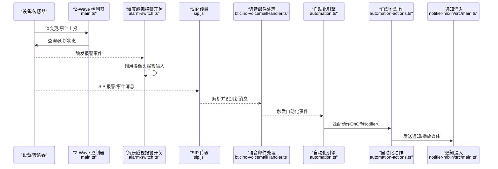
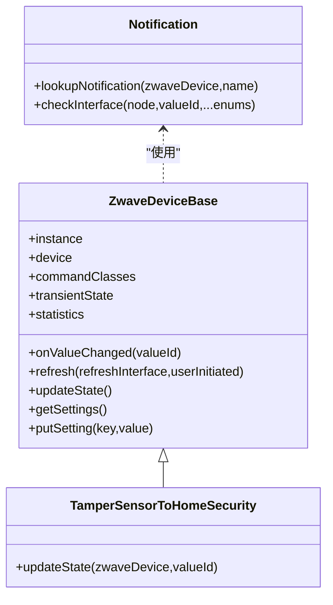
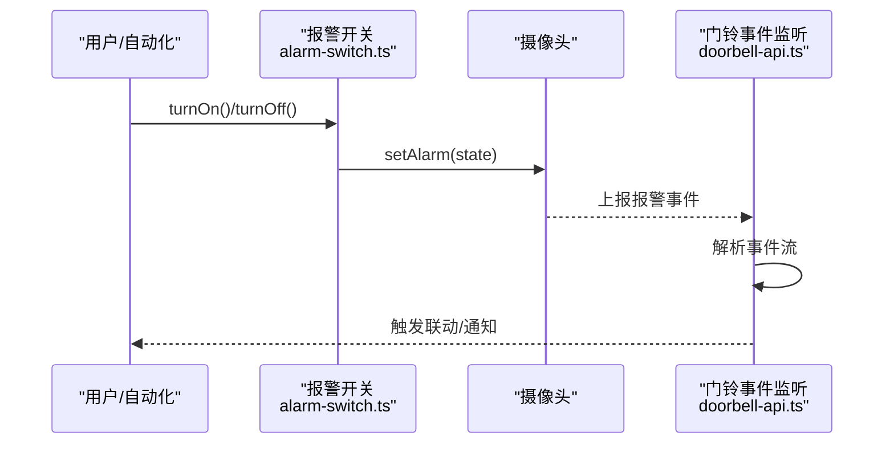
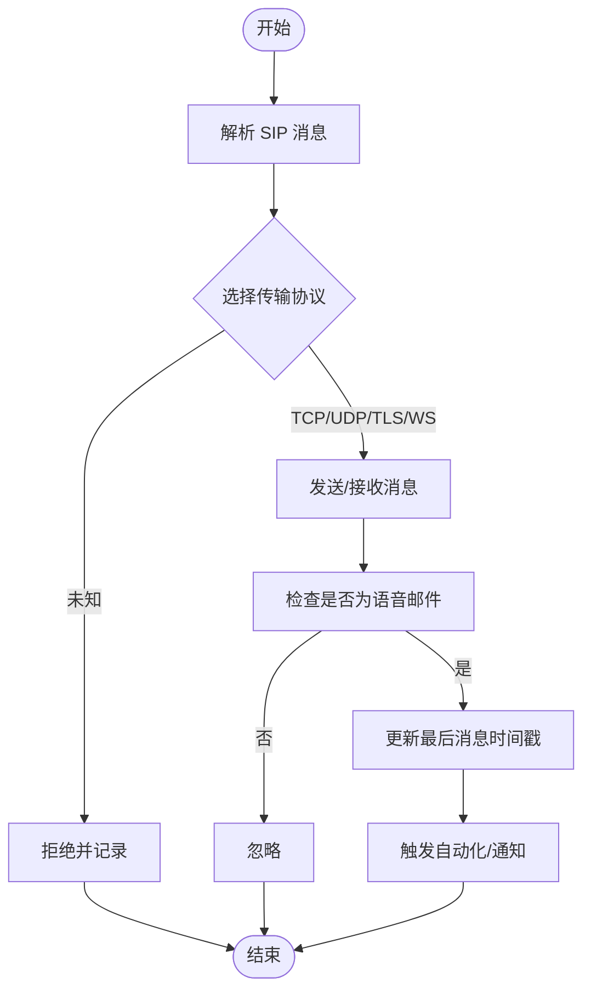
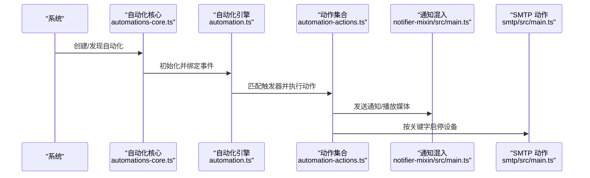
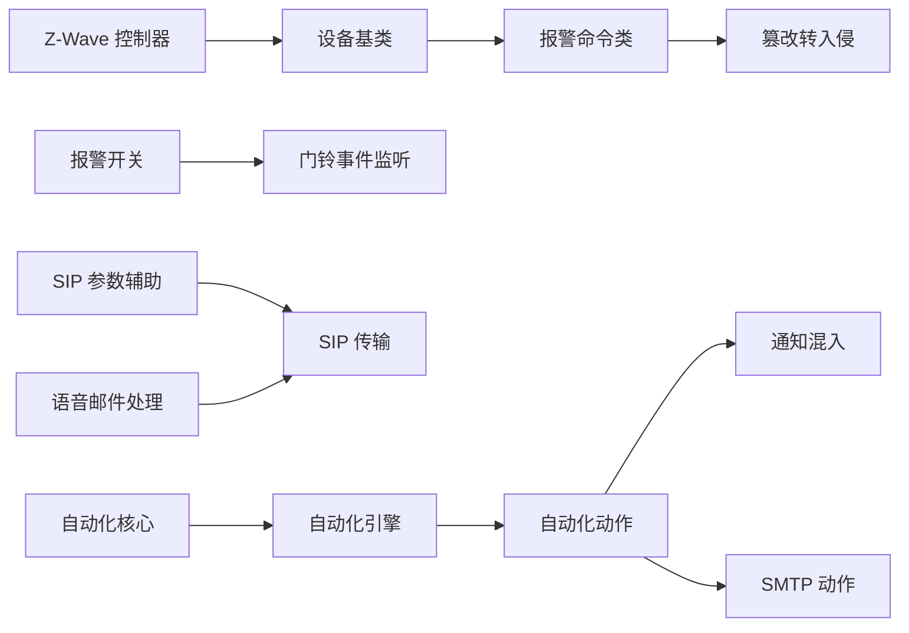

# 报警系统集成

<cite>
**本文引用的文件**
- [plugins/zwave/src/CommandClasses/Notification.ts](file://plugins/zwave/src/CommandClasses/Notification.ts)
- [plugins/zwave/src/CommandClasses/TamperSensorToHomeSecurity.ts](file://plugins/zwave/src/CommandClasses/TamperSensorToHomeSecurity.ts)
- [plugins/zwave/src/CommandClasses/ZwaveDeviceBase.ts](file://plugins/zwave/src/CommandClasses/ZwaveDeviceBase.ts)
- [plugins/zwave/src/main.ts](file://plugins/zwave/src/main.ts)
- [plugins/hikvision/src/alarm-switch.ts](file://plugins/hikvision/src/alarm-switch.ts)
- [plugins/hikvision-doorbell/src/doorbell-api.ts](file://plugins/hikvision-doorbell/src/doorbell-api.ts)
- [plugins/hikvision-doorbell/src/sip/sip.js](file://plugins/hikvision-doorbell/src/sip/sip.js)
- [plugins/bticino/src/sip-helper.ts](file://plugins/bticino/src/sip-helper.ts)
- [plugins/bticino/src/bticino-voicemailHandler.ts](file://plugins/bticino/src/bticino-voicemailHandler.ts)
- [plugins/core/src/automation.ts](file://plugins/core/src/automation.ts)
- [plugins/core/src/automation-actions.ts](file://plugins/core/src/automation-actions.ts)
- [plugins/core/src/automations-core.ts](file://plugins/core/src/automations-core.ts)
- [plugins/notifier-mixin/src/main.ts](file://plugins/notifier-mixin/src/main.ts)
- [plugins/smtp/src/main.ts](file://plugins/smtp/src/main.ts)
- [sdk/types/src/types.input.ts](file://sdk/types/src/types.input.ts)
</cite>

## 目录
1. [简介](#简介)
2. [项目结构](#项目结构)
3. [核心组件](#核心组件)
4. [架构总览](#架构总览)
5. [详细组件分析](#详细组件分析)
6. [依赖关系分析](#依赖关系分析)
7. [性能考虑](#性能考虑)
8. [故障排除指南](#故障排除指南)
9. [结论](#结论)
10. [附录](#附录)

## 简介
本技术文档面向 Scrypted 的报警系统集成，覆盖报警器控制、报警状态监控、报警事件处理与报警联动等能力。重点说明以下方面：
- 报警通信协议：SIP 报警通知（含 Hikvision 门铃与 Bticino SIP 设备）、Z-Wave 报警事件（水浸、入侵、紧急等）。
- 报警状态管理：触发检测、状态确认、历史记录与解除处理。
- 报警联动逻辑：触发后自动化动作、通知发送、日志记录与状态同步。
- 配置参数：报警级别、延迟、通知方式、联动规则等。
- 故障排除：误报、不触发、通知失败等常见问题诊断与解决。

## 项目结构
围绕报警系统的关键模块分布于多个插件与核心模块中：
- Z-Wave 报警与状态：通过命令类解析与状态映射，实现报警类型识别与篡改告警转换。
- 海康威视报警联动：通过报警开关触发摄像头报警输入，联动闪光灯与音频告警。
- 门铃与 SIP：Hikvision 门铃与 Bticino SIP 摄像头通过 SIP 协议进行双向通信与事件处理。
- 自动化与通知：核心自动化引擎与通知混入，支持基于事件的联动与多通道通知。

```mermaid
graph TB
subgraph "Z-Wave 报警"
ZWMain["Z-Wave 控制器<br/>main.ts"]
ZWBase["设备基类<br/>ZwaveDeviceBase.ts"]
ZWNoti["报警命令类<br/>Notification.ts"]
ZWTamper["篡改转入侵<br/>TamperSensorToHomeSecurity.ts"]
end
subgraph "海康威视报警"
HKAlarm["报警开关<br/>alarm-switch.ts"]
HKAPI["门铃事件监听<br/>doorbell-api.ts"]
end
subgraph "SIP 通信"
SIPJS["SIP 解析与传输<br/>sip.js"]
SipHelper["SIP 参数辅助<br/>sip-helper.ts"]
VMHandler["语音邮件处理<br/>bticino-voicemailHandler.ts"]
end
subgraph "自动化与通知"
AutoCore["自动化核心<br/>automations-core.ts"]
AutoEngine["自动化引擎<br/>automation.ts"]
AutoActions["自动化动作<br/>automation-actions.ts"]
NotifierMixin["通知混入<br/>notifier-mixin/src/main.ts"]
SMTP["SMTP 邮件动作<br/>smtp/src/main.ts"]
end
ZWMain --> ZWBase --> ZWNoti --> ZWTamper
HKAlarm --> HKAPI
SipHelper --> SIPJS
VMHandler --> SIPJS
AutoCore --> AutoEngine --> AutoActions
AutoActions --> NotifierMixin
AutoActions --> SMTP
```

**图表来源**
- [plugins/zwave/src/main.ts:113-168](file://plugins/zwave/src/main.ts#L113-L168)
- [plugins/zwave/src/CommandClasses/ZwaveDeviceBase.ts:33-124](file://plugins/zwave/src/CommandClasses/ZwaveDeviceBase.ts#L33-L124)
- [plugins/zwave/src/CommandClasses/Notification.ts:15-34](file://plugins/zwave/src/CommandClasses/Notification.ts#L15-L34)
- [plugins/zwave/src/CommandClasses/TamperSensorToHomeSecurity.ts:7-14](file://plugins/zwave/src/CommandClasses/TamperSensorToHomeSecurity.ts#L7-L14)
- [plugins/hikvision/src/alarm-switch.ts:4-25](file://plugins/hikvision/src/alarm-switch.ts#L4-L25)
- [plugins/hikvision-doorbell/src/doorbell-api.ts:1096-1116](file://plugins/hikvision-doorbell/src/doorbell-api.ts#L1096-L1116)
- [plugins/hikvision-doorbell/src/sip/sip.js:1-800](file://plugins/hikvision-doorbell/src/sip/sip.js#L1-L800)
- [plugins/bticino/src/sip-helper.ts:6-40](file://plugins/bticino/src/sip-helper.ts#L6-L40)
- [plugins/bticino/src/bticino-voicemailHandler.ts:52-77](file://plugins/bticino/src/bticino-voicemailHandler.ts#L52-L77)
- [plugins/core/src/automations-core.ts:9-83](file://plugins/core/src/automations-core.ts#L9-L83)
- [plugins/core/src/automation.ts:97-566](file://plugins/core/src/automation.ts#L97-L566)
- [plugins/core/src/automation-actions.ts:10-104](file://plugins/core/src/automation-actions.ts#L10-L104)
- [plugins/notifier-mixin/src/main.ts:19-47](file://plugins/notifier-mixin/src/main.ts#L19-L47)
- [plugins/smtp/src/main.ts:9-72](file://plugins/smtp/src/main.ts#L9-L72)

**章节来源**
- [plugins/zwave/src/main.ts:113-168](file://plugins/zwave/src/main.ts#L113-L168)
- [plugins/zwave/src/CommandClasses/ZwaveDeviceBase.ts:33-124](file://plugins/zwave/src/CommandClasses/ZwaveDeviceBase.ts#L33-L124)
- [plugins/zwave/src/CommandClasses/Notification.ts:15-34](file://plugins/zwave/src/CommandClasses/Notification.ts#L15-L34)
- [plugins/zwave/src/CommandClasses/TamperSensorToHomeSecurity.ts:7-14](file://plugins/zwave/src/CommandClasses/TamperSensorToHomeSecurity.ts#L7-L14)
- [plugins/hikvision/src/alarm-switch.ts:4-25](file://plugins/hikvision/src/alarm-switch.ts#L4-L25)
- [plugins/hikvision-doorbell/src/doorbell-api.ts:1096-1116](file://plugins/hikvision-doorbell/src/doorbell-api.ts#L1096-L1116)
- [plugins/hikvision-doorbell/src/sip/sip.js:1-800](file://plugins/hikvision-doorbell/src/sip/sip.js#L1-L800)
- [plugins/bticino/src/sip-helper.ts:6-40](file://plugins/bticino/src/sip-helper.ts#L6-L40)
- [plugins/bticino/src/bticino-voicemailHandler.ts:52-77](file://plugins/bticino/src/bticino-voicemailHandler.ts#L52-L77)
- [plugins/core/src/automations-core.ts:9-83](file://plugins/core/src/automations-core.ts#L9-L83)
- [plugins/core/src/automation.ts:97-566](file://plugins/core/src/automation.ts#L97-L566)
- [plugins/core/src/automation-actions.ts:10-104](file://plugins/core/src/automation-actions.ts#L10-L104)
- [plugins/notifier-mixin/src/main.ts:19-47](file://plugins/notifier-mixin/src/main.ts#L19-L47)
- [plugins/smtp/src/main.ts:9-72](file://plugins/smtp/src/main.ts#L9-L72)

## 核心组件
- Z-Wave 报警与状态
  - 报警命令类：解析报警类型（如水浸、入侵、紧急、断电），并根据设备配置查找对应通知项。
  - 篡改传感器到入侵状态：将篡改事件映射为“家庭安全”报警状态，驱动 tampered 属性。
  - 设备基类：统一值变更回调、刷新策略、统计信息与设置项。
  - 控制器：驱动启动、节点事件绑定、网络维护与设置更新。

- 海康威视报警联动
  - 报警开关：通过 API 控制摄像头报警输入，联动闪光灯与音频告警。
  - 门铃事件流：订阅 ISAPI 事件流，解析报警消息并触发联动。

- SIP 报警通知
  - SIP 解析与传输：支持 TCP/UDP/WebSocket/TLS 传输，消息解析与序列化。
  - SIP 参数辅助：生成 From/To/Domain/Expire 等参数，校验必要字段。
  - 语音邮件处理：轮询并识别新语音邮件，记录时间戳并触发通知。

- 自动化与通知
  - 自动化核心：自动化设备发现、创建与生命周期管理。
  - 自动化引擎：事件注册、条件判断、动作执行与并发控制。
  - 自动化动作：OnOff、StartStop、Lock、亮度、程序、通知等。
  - 通知混入：将媒体播放器作为通知器，支持文本转语音与媒体加载。
  - SMTP 动作：按邮件内容关键字启停设备或触发动作。

**章节来源**
- [plugins/zwave/src/CommandClasses/Notification.ts:7-34](file://plugins/zwave/src/CommandClasses/Notification.ts#L7-L34)
- [plugins/zwave/src/CommandClasses/TamperSensorToHomeSecurity.ts:7-14](file://plugins/zwave/src/CommandClasses/TamperSensorToHomeSecurity.ts#L7-L14)
- [plugins/zwave/src/CommandClasses/ZwaveDeviceBase.ts:33-124](file://plugins/zwave/src/CommandClasses/ZwaveDeviceBase.ts#L33-L124)
- [plugins/zwave/src/main.ts:113-168](file://plugins/zwave/src/main.ts#L113-L168)
- [plugins/hikvision/src/alarm-switch.ts:4-25](file://plugins/hikvision/src/alarm-switch.ts#L4-L25)
- [plugins/hikvision-doorbell/src/doorbell-api.ts:1096-1116](file://plugins/hikvision-doorbell/src/doorbell-api.ts#L1096-L1116)
- [plugins/hikvision-doorbell/src/sip/sip.js:1-800](file://plugins/hikvision-doorbell/src/sip/sip.js#L1-L800)
- [plugins/bticino/src/sip-helper.ts:6-40](file://plugins/bticino/src/sip-helper.ts#L6-L40)
- [plugins/bticino/src/bticino-voicemailHandler.ts:52-77](file://plugins/bticino/src/bticino-voicemailHandler.ts#L52-L77)
- [plugins/core/src/automations-core.ts:9-83](file://plugins/core/src/automations-core.ts#L9-L83)
- [plugins/core/src/automation.ts:97-566](file://plugins/core/src/automation.ts#L97-L566)
- [plugins/core/src/automation-actions.ts:10-104](file://plugins/core/src/automation-actions.ts#L10-L104)
- [plugins/notifier-mixin/src/main.ts:19-47](file://plugins/notifier-mixin/src/main.ts#L19-L47)
- [plugins/smtp/src/main.ts:9-72](file://plugins/smtp/src/main.ts#L9-L72)

## 架构总览
下图展示报警系统从设备事件到自动化联动与通知的整体流程：

**图表来源**
- [plugins/zwave/src/main.ts:113-168](file://plugins/zwave/src/main.ts#L113-L168)
- [plugins/zwave/src/CommandClasses/ZwaveDeviceBase.ts:67-78](file://plugins/zwave/src/CommandClasses/ZwaveDeviceBase.ts#L67-L78)
- [plugins/hikvision/src/alarm-switch.ts:12-25](file://plugins/hikvision/src/alarm-switch.ts#L12-L25)
- [plugins/hikvision-doorbell/src/sip/sip.js:1-800](file://plugins/hikvision-doorbell/src/sip/sip.js#L1-L800)
- [plugins/bticino/src/bticino-voicemailHandler.ts:52-77](file://plugins/bticino/src/bticino-voicemailHandler.ts#L52-L77)
- [plugins/core/src/automation.ts:544-566](file://plugins/core/src/automation.ts#L544-L566)
- [plugins/core/src/automation-actions.ts:10-104](file://plugins/core/src/automation-actions.ts#L10-L104)
- [plugins/notifier-mixin/src/main.ts:24-46](file://plugins/notifier-mixin/src/main.ts#L24-L46)

## 详细组件分析

### Z-Wave 报警与状态管理
- 报警类型枚举与查找：通过配置管理器定位通知项，支持水浸、门禁、家庭安全、电源管理等类型。
- 状态映射与接口检查：依据数值元数据 states 列表判断是否满足特定报警状态。
- 篡改到入侵：当“家庭安全”通知值存在时，设置 tampered 属性以反映入侵状态。
- 设备刷新与统计：按需刷新命令类值，记录 RX/TX 统计，支持强制移除节点与重新面试。

**图表来源**
- [plugins/zwave/src/CommandClasses/ZwaveDeviceBase.ts:33-124](file://plugins/zwave/src/CommandClasses/ZwaveDeviceBase.ts#L33-L124)
- [plugins/zwave/src/CommandClasses/Notification.ts:15-34](file://plugins/zwave/src/CommandClasses/Notification.ts#L15-L34)
- [plugins/zwave/src/CommandClasses/TamperSensorToHomeSecurity.ts:7-14](file://plugins/zwave/src/CommandClasses/TamperSensorToHomeSecurity.ts#L7-L14)

**章节来源**
- [plugins/zwave/src/CommandClasses/Notification.ts:7-34](file://plugins/zwave/src/CommandClasses/Notification.ts#L7-L34)
- [plugins/zwave/src/CommandClasses/TamperSensorToHomeSecurity.ts:7-14](file://plugins/zwave/src/CommandClasses/TamperSensorToHomeSecurity.ts#L7-L14)
- [plugins/zwave/src/CommandClasses/ZwaveDeviceBase.ts:33-124](file://plugins/zwave/src/CommandClasses/ZwaveDeviceBase.ts#L33-L124)
- [plugins/zwave/src/main.ts:113-168](file://plugins/zwave/src/main.ts#L113-L168)

### 海康威视报警联动（报警开关与门铃事件）
- 报警开关：切换摄像头报警输入，联动闪光灯与音频告警；提供配置说明与操作指引。
- 门铃事件流：建立 ISAPI 事件流连接，持续读取报警事件，解析并触发后续动作。

**图表来源**
- [plugins/hikvision/src/alarm-switch.ts:12-25](file://plugins/hikvision/src/alarm-switch.ts#L12-L25)
- [plugins/hikvision-doorbell/src/doorbell-api.ts:1096-1116](file://plugins/hikvision-doorbell/src/doorbell-api.ts#L1096-L1116)

**章节来源**
- [plugins/hikvision/src/alarm-switch.ts:4-25](file://plugins/hikvision/src/alarm-switch.ts#L4-L25)
- [plugins/hikvision-doorbell/src/doorbell-api.ts:1096-1116](file://plugins/hikvision-doorbell/src/doorbell-api.ts#L1096-L1116)

### SIP 报警通知与语音邮件处理
- SIP 解析与传输：支持多种传输协议，解析/序列化 SIP 消息，处理洪水攻击防护与流控。
- SIP 参数辅助：生成 From/To/Domain/Expire 等参数，校验必要字段并抛出错误。
- 语音邮件处理：扫描新消息，记录最后消息时间戳，触发报警或通知。

**图表来源**
- [plugins/hikvision-doorbell/src/sip/sip.js:1-800](file://plugins/hikvision-doorbell/src/sip/sip.js#L1-L800)
- [plugins/bticino/src/sip-helper.ts:6-40](file://plugins/bticino/src/sip-helper.ts#L6-L40)
- [plugins/bticino/src/bticino-voicemailHandler.ts:52-77](file://plugins/bticino/src/bticino-voicemailHandler.ts#L52-L77)

**章节来源**
- [plugins/hikvision-doorbell/src/sip/sip.js:1-800](file://plugins/hikvision-doorbell/src/sip/sip.js#L1-L800)
- [plugins/bticino/src/sip-helper.ts:6-40](file://plugins/bticino/src/sip-helper.ts#L6-L40)
- [plugins/bticino/src/bticino-voicemailHandler.ts:52-77](file://plugins/bticino/src/bticino-voicemailHandler.ts#L52-L77)

### 自动化与通知联动
- 自动化核心：发现/创建自动化设备，报告设备信息，管理生命周期。
- 自动化引擎：事件注册、条件匹配、动作执行、并发与超时控制。
- 自动化动作：OnOff、StartStop、Lock、亮度、程序、通知等。
- 通知混入：将媒体播放器作为通知器，支持文本转语音与媒体加载。
- SMTP 动作：按邮件内容关键字启停设备或触发动作。

**图表来源**
- [plugins/core/src/automations-core.ts:9-83](file://plugins/core/src/automations-core.ts#L9-L83)
- [plugins/core/src/automation.ts:97-566](file://plugins/core/src/automation.ts#L97-L566)
- [plugins/core/src/automation-actions.ts:10-104](file://plugins/core/src/automation-actions.ts#L10-L104)
- [plugins/notifier-mixin/src/main.ts:19-47](file://plugins/notifier-mixin/src/main.ts#L19-L47)
- [plugins/smtp/src/main.ts:9-72](file://plugins/smtp/src/main.ts#L9-L72)

**章节来源**
- [plugins/core/src/automations-core.ts:9-83](file://plugins/core/src/automations-core.ts#L9-L83)
- [plugins/core/src/automation.ts:97-566](file://plugins/core/src/automation.ts#L97-L566)
- [plugins/core/src/automation-actions.ts:10-104](file://plugins/core/src/automation-actions.ts#L10-L104)
- [plugins/notifier-mixin/src/main.ts:19-47](file://plugins/notifier-mixin/src/main.ts#L19-L47)
- [plugins/smtp/src/main.ts:9-72](file://plugins/smtp/src/main.ts#L9-L72)

## 依赖关系分析
- Z-Wave 插件内部依赖：
  - 控制器负责驱动初始化、节点事件绑定与网络维护。
  - 设备基类提供统一的状态更新与刷新逻辑。
  - 报警命令类与篡改传感器类依赖配置管理器与数值元数据。
- 海康威视插件依赖：
  - 报警开关依赖摄像头客户端 API。
  - 门铃事件监听依赖 ISAPI 事件流。
- SIP 插件依赖：
  - 传输层支持多种协议，参数辅助确保 URI/域/过期等字段正确。
  - 语音邮件处理器依赖消息解析与时间戳记录。
- 自动化与通知：
  - 自动化动作依赖通知接口与媒体管理。
  - SMTP 动作依赖邮件解析与关键字匹配。

**图表来源**
- [plugins/zwave/src/main.ts:113-168](file://plugins/zwave/src/main.ts#L113-L168)
- [plugins/zwave/src/CommandClasses/ZwaveDeviceBase.ts:33-124](file://plugins/zwave/src/CommandClasses/ZwaveDeviceBase.ts#L33-L124)
- [plugins/zwave/src/CommandClasses/Notification.ts:15-34](file://plugins/zwave/src/CommandClasses/Notification.ts#L15-L34)
- [plugins/zwave/src/CommandClasses/TamperSensorToHomeSecurity.ts:7-14](file://plugins/zwave/src/CommandClasses/TamperSensorToHomeSecurity.ts#L7-L14)
- [plugins/hikvision/src/alarm-switch.ts:4-25](file://plugins/hikvision/src/alarm-switch.ts#L4-L25)
- [plugins/hikvision-doorbell/src/doorbell-api.ts:1096-1116](file://plugins/hikvision-doorbell/src/doorbell-api.ts#L1096-L1116)
- [plugins/bticino/src/sip-helper.ts:6-40](file://plugins/bticino/src/sip-helper.ts#L6-L40)
- [plugins/bticino/src/bticino-voicemailHandler.ts:52-77](file://plugins/bticino/src/bticino-voicemailHandler.ts#L52-L77)
- [plugins/hikvision-doorbell/src/sip/sip.js:1-800](file://plugins/hikvision-doorbell/src/sip/sip.js#L1-L800)
- [plugins/core/src/automations-core.ts:9-83](file://plugins/core/src/automations-core.ts#L9-L83)
- [plugins/core/src/automation.ts:97-566](file://plugins/core/src/automation.ts#L97-L566)
- [plugins/core/src/automation-actions.ts:10-104](file://plugins/core/src/automation-actions.ts#L10-L104)
- [plugins/notifier-mixin/src/main.ts:19-47](file://plugins/notifier-mixin/src/main.ts#L19-L47)
- [plugins/smtp/src/main.ts:9-72](file://plugins/smtp/src/main.ts#L9-L72)

**章节来源**
- [plugins/zwave/src/main.ts:113-168](file://plugins/zwave/src/main.ts#L113-L168)
- [plugins/zwave/src/CommandClasses/ZwaveDeviceBase.ts:33-124](file://plugins/zwave/src/CommandClasses/ZwaveDeviceBase.ts#L33-L124)
- [plugins/zwave/src/CommandClasses/Notification.ts:15-34](file://plugins/zwave/src/CommandClasses/Notification.ts#L15-L34)
- [plugins/zwave/src/CommandClasses/TamperSensorToHomeSecurity.ts:7-14](file://plugins/zwave/src/CommandClasses/TamperSensorToHomeSecurity.ts#L7-L14)
- [plugins/hikvision/src/alarm-switch.ts:4-25](file://plugins/hikvision/src/alarm-switch.ts#L4-L25)
- [plugins/hikvision-doorbell/src/doorbell-api.ts:1096-1116](file://plugins/hikvision-doorbell/src/doorbell-api.ts#L1096-L1116)
- [plugins/bticino/src/sip-helper.ts:6-40](file://plugins/bticino/src/sip-helper.ts#L6-L40)
- [plugins/bticino/src/bticino-voicemailHandler.ts:52-77](file://plugins/bticino/src/bticino-voicemailHandler.ts#L52-L77)
- [plugins/hikvision-doorbell/src/sip/sip.js:1-800](file://plugins/hikvision-doorbell/src/sip/sip.js#L1-L800)
- [plugins/core/src/automations-core.ts:9-83](file://plugins/core/src/automations-core.ts#L9-L83)
- [plugins/core/src/automation.ts:97-566](file://plugins/core/src/automation.ts#L97-L566)
- [plugins/core/src/automation-actions.ts:10-104](file://plugins/core/src/automation-actions.ts#L10-L104)
- [plugins/notifier-mixin/src/main.ts:19-47](file://plugins/notifier-mixin/src/main.ts#L19-L47)
- [plugins/smtp/src/main.ts:9-72](file://plugins/smtp/src/main.ts#L9-L72)

## 性能考虑
- Z-Wave 刷新策略：仅在用户主动触发时刷新命令类值，避免频繁查询导致的网络压力；跳过昂贵的用户码与配置命令类。
- 事件处理去抖：节点在线性检查采用去抖策略，降低频繁查询带来的开销。
- SIP 传输优化：优先使用 TCP 以提升可靠性；限制头部与内容长度，防止洪水攻击。
- 自动化并发控制：动作执行前进行条件判断与去重，避免重复触发与资源争用。

**章节来源**
- [plugins/zwave/src/CommandClasses/ZwaveDeviceBase.ts:88-110](file://plugins/zwave/src/CommandClasses/ZwaveDeviceBase.ts#L88-L110)
- [plugins/zwave/src/main.ts:512-518](file://plugins/zwave/src/main.ts#L512-L518)
- [plugins/hikvision-doorbell/src/sip/sip.js:441-507](file://plugins/hikvision-doorbell/src/sip/sip.js#L441-L507)

## 故障排除指南
- 报警误报
  - Z-Wave：检查“家庭安全”通知值映射，确认非入侵状态不会误触发 tampered。
  - 海康威视：确认报警开关仅在需要时启用，避免误触闪光灯/音频。
  - SIP：核对 SIP From/To/Domain/Expire 参数，确保 URI 正确且过期时间合理。

- 报警不触发
  - Z-Wave：确认节点在线状态与健康检查结果；必要时强制刷新信息或重新面试。
  - 海康威视：检查摄像头报警输入配置与联动设置；确认事件流已建立。
  - SIP：验证传输端口与协议，确保防火墙放行；检查消息解析是否成功。

- 报警通知失败
  - 自动化动作：检查动作配置（OnOff/Notifier/SMTP），确认目标设备接口与权限。
  - 通知混入：确认媒体播放器可用，文本转语音服务可达。
  - SMTP：核对邮箱关键字设置，确保邮件内容匹配触发条件。

**章节来源**
- [plugins/zwave/src/CommandClasses/TamperSensorToHomeSecurity.ts:7-14](file://plugins/zwave/src/CommandClasses/TamperSensorToHomeSecurity.ts#L7-L14)
- [plugins/zwave/src/CommandClasses/ZwaveDeviceBase.ts:208-223](file://plugins/zwave/src/CommandClasses/ZwaveDeviceBase.ts#L208-L223)
- [plugins/hikvision/src/alarm-switch.ts:12-25](file://plugins/hikvision/src/alarm-switch.ts#L12-L25)
- [plugins/hikvision-doorbell/src/doorbell-api.ts:1096-1116](file://plugins/hikvision-doorbell/src/doorbell-api.ts#L1096-L1116)
- [plugins/bticino/src/sip-helper.ts:21-24](file://plugins/bticino/src/sip-helper.ts#L21-L24)
- [plugins/core/src/automation-actions.ts:10-104](file://plugins/core/src/automation-actions.ts#L10-L104)
- [plugins/notifier-mixin/src/main.ts:24-46](file://plugins/notifier-mixin/src/main.ts#L24-L46)
- [plugins/smtp/src/main.ts:44-72](file://plugins/smtp/src/main.ts#L44-L72)

## 结论
Scrypted 的报警系统通过多协议与多插件协同，实现了从设备事件采集、状态管理、事件处理到自动化联动与通知的完整闭环。Z-Wave 提供标准化的报警类型与状态映射，海康威视与 SIP 插件扩展了本地与网络化的报警与通知能力，核心自动化与通知模块则提供了灵活可配置的联动与分发机制。结合合理的配置与故障排除策略，可构建稳定可靠的智能报警体系。

## 附录
- 配置参数建议
  - 报警级别：按场景设置（如入侵、水浸、紧急）。
  - 延迟配置：为误报过滤设置合理延迟。
  - 通知方式：邮件、短信、推送、语音播报等组合使用。
  - 联动规则：基于事件类型与设备接口定义动作链路。

- 数据模型与接口参考
  - 通知选项与媒体参数：参见通知接口定义。

**章节来源**
- [sdk/types/src/types.input.ts:259-285](file://sdk/types/src/types.input.ts#L259-L285)