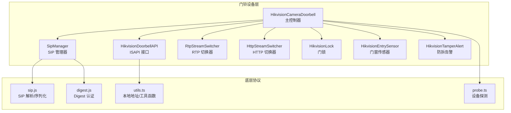
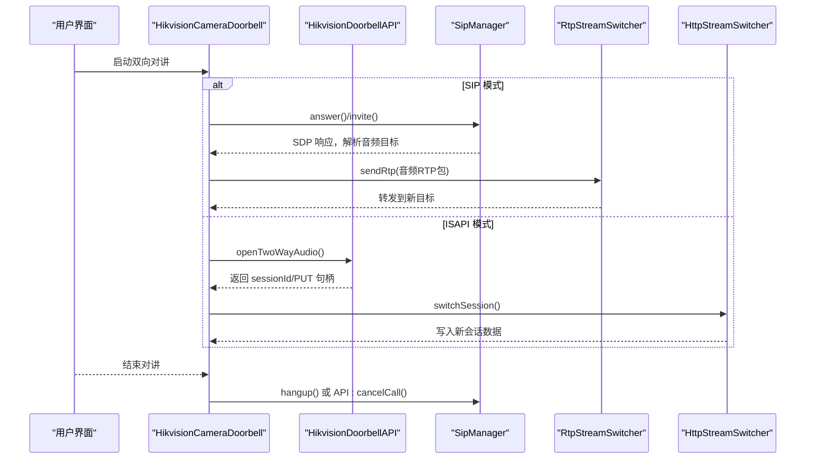
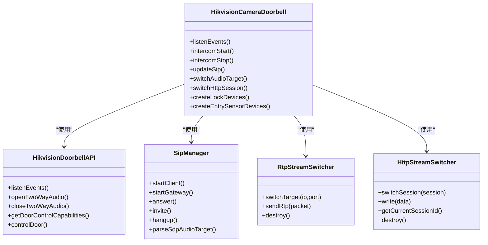
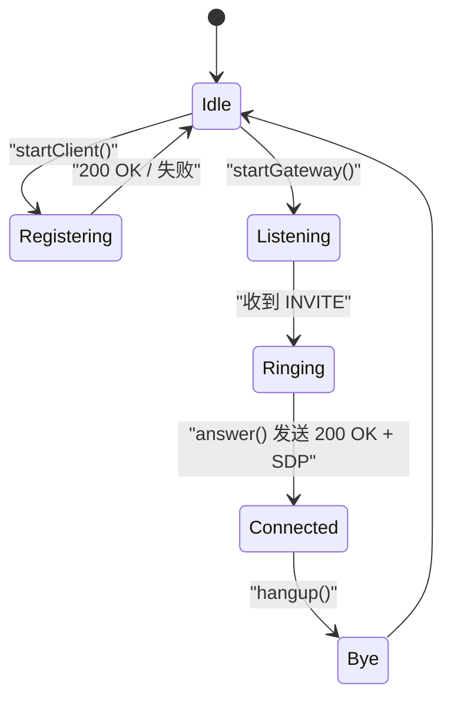
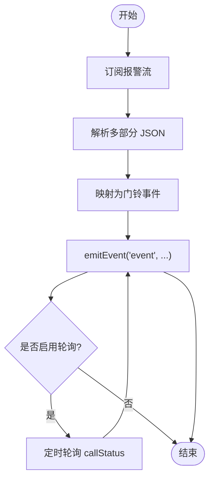
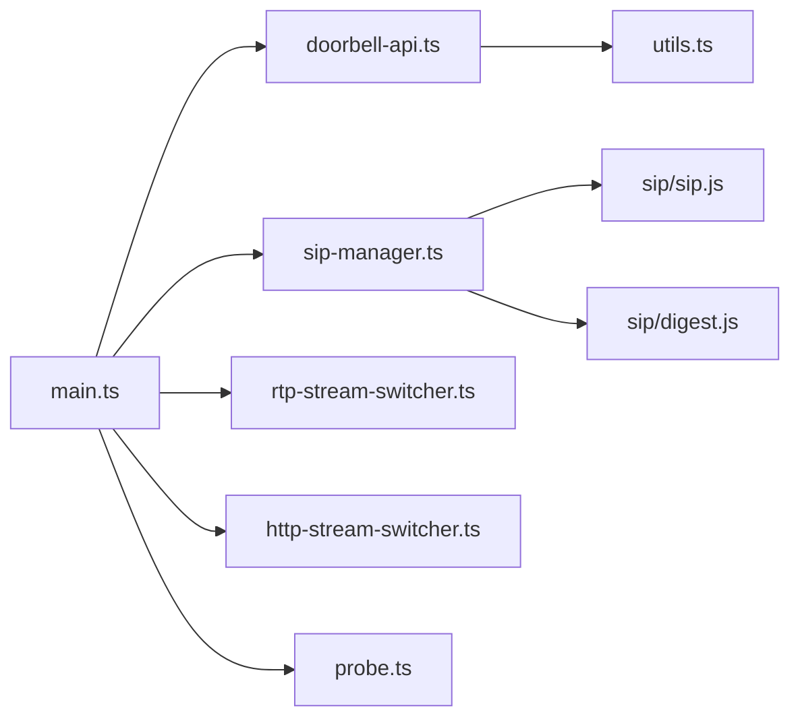

# 门铃设备集成

<cite>
**本文档引用的文件**
- [plugins/hikvision-doorbell/src/main.ts](file://plugins/hikvision-doorbell/src/main.ts)
- [plugins/hikvision-doorbell/src/sip-manager.ts](file://plugins/hikvision-doorbell/src/sip-manager.ts)
- [plugins/hikvision-doorbell/src/doorbell-api.ts](file://plugins/hikvision-doorbell/src/doorbell-api.ts)
- [plugins/hikvision-doorbell/src/rtp-stream-switcher.ts](file://plugins/hikvision-doorbell/src/rtp-stream-switcher.ts)
- [plugins/hikvision-doorbell/src/http-stream-switcher.ts](file://plugins/hikvision-doorbell/src/http-stream-switcher.ts)
- [plugins/hikvision-doorbell/src/sip/sip.js](file://plugins/hikvision-doorbell/src/sip/sip.js)
- [plugins/hikvision-doorbell/src/sip/digest.js](file://plugins/hikvision-doorbell/src/sip/digest.js)
- [plugins/hikvision-doorbell/src/entry-sensor.ts](file://plugins/hikvision-doorbell/src/entry-sensor.ts)
- [plugins/hikvision-doorbell/src/lock.ts](file://plugins/hikvision-doorbell/src/lock.ts)
- [plugins/hikvision-doorbell/src/tamper-alert.ts](file://plugins/hikvision-doorbell/src/tamper-alert.ts)
- [plugins/hikvision-doorbell/src/probe.ts](file://plugins/hikvision-doorbell/src/probe.ts)
- [plugins/hikvision-doorbell/src/utils.ts](file://plugins/hikvision-doorbell/src/utils.ts)
</cite>

## 目录
1. [简介](#简介)
2. [项目结构](#项目结构)
3. [核心组件](#核心组件)
4. [架构总览](#架构总览)
5. [详细组件分析](#详细组件分析)
6. [依赖关系分析](#依赖关系分析)
7. [性能考虑](#性能考虑)
8. [故障排除指南](#故障排除指南)
9. [结论](#结论)
10. [附录](#附录)

## 简介
本文件面向 Scrypted 平台中 Hikvision 门铃设备的集成与使用，系统性阐述双向对讲（Intercom）、SIP 通信协议、RTP 音频流处理、HTTP 会话切换等核心技术，并详细说明三种工作模式（SIP 客户端模式、SIP 代理模式、ISAPI 模式）的配置参数与适用场景。同时覆盖门铃事件处理机制（按钮触发、访客呼叫、门锁状态变化、门窗传感器状态等），音频对讲的实现原理（编码格式、RTP 包处理、目标切换、无缝重连），以及配置与故障排除指南。

## 项目结构
Hikvision 门铃插件位于 plugins/hikvision-doorbell，核心模块包括：
- 主控制器：HikvisionCameraDoorbell（继承自通用 Hikvision 摄像头基类）
- SIP 管理器：SipManager（封装 SIP 协议栈与认证）
- 门铃 API：HikvisionDoorbellAPI（封装 ISAPI 事件与双向对讲接口）
- RTP/HTTP 切换器：RtpStreamSwitcher、HttpStreamSwitcher（支持无缝切换）
- 设备子组件：HikvisionLock、HikvisionEntrySensor、HikvisionTamperAlert
- 工具与探测：utils.ts、probe.ts

**图表来源**
- [plugins/hikvision-doorbell/src/main.ts](file://plugins/hikvision-doorbell/src/main.ts)
- [plugins/hikvision-doorbell/src/doorbell-api.ts](file://plugins/hikvision-doorbell/src/doorbell-api.ts)
- [plugins/hikvision-doorbell/src/sip-manager.ts](file://plugins/hikvision-doorbell/src/sip-manager.ts)
- [plugins/hikvision-doorbell/src/rtp-stream-switcher.ts](file://plugins/hikvision-doorbell/src/rtp-stream-switcher.ts)
- [plugins/hikvision-doorbell/src/http-stream-switcher.ts](file://plugins/hikvision-doorbell/src/http-stream-switcher.ts)
- [plugins/hikvision-doorbell/src/sip/sip.js](file://plugins/hikvision-doorbell/src/sip/sip.js)
- [plugins/hikvision-doorbell/src/sip/digest.js](file://plugins/hikvision-doorbell/src/sip/digest.js)
- [plugins/hikvision-doorbell/src/utils.ts](file://plugins/hikvision-doorbell/src/utils.ts)
- [plugins/hikvision-doorbell/src/probe.ts](file://plugins/hikvision-doorbell/src/probe.ts)

**章节来源**
- [plugins/hikvision-doorbell/src/main.ts](file://plugins/hikvision-doorbell/src/main.ts)
- [plugins/hikvision-doorbell/src/doorbell-api.ts](file://plugins/hikvision-doorbell/src/doorbell-api.ts)
- [plugins/hikvision-doorbell/src/sip-manager.ts](file://plugins/hikvision-doorbell/src/sip-manager.ts)
- [plugins/hikvision-doorbell/src/rtp-stream-switcher.ts](file://plugins/hikvision-doorbell/src/rtp-stream-switcher.ts)
- [plugins/hikvision-doorbell/src/http-stream-switcher.ts](file://plugins/hikvision-doorbell/src/http-stream-switcher.ts)
- [plugins/hikvision-doorbell/src/sip/sip.js](file://plugins/hikvision-doorbell/src/sip/sip.js)
- [plugins/hikvision-doorbell/src/sip/digest.js](file://plugins/hikvision-doorbell/src/sip/digest.js)
- [plugins/hikvision-doorbell/src/utils.ts](file://plugins/hikvision-doorbell/src/utils.ts)
- [plugins/hikvision-doorbell/src/probe.ts](file://plugins/hikvision-doorbell/src/probe.ts)

## 核心组件
- HikvisionCameraDoorbell：负责设备生命周期、事件监听、双向对讲控制、SIP/HTTP 模式切换、子设备（门锁、传感器、防拆告警）管理。
- HikvisionDoorbellAPI：封装 ISAPI 事件订阅（报警流）、通话状态轮询、双向对讲通道打开/关闭、门禁控制能力查询与命令下发。
- SipManager：封装 SIP 注册、INVITE/ACK/BYE、SDP 解析与音频目标提取、客户端/代理两种模式。
- RtpStreamSwitcher：接收 RTP 数据包并转发到当前目标，支持无缝切换与错误清理。
- HttpStreamSwitcher：在长连接 HTTP PUT 通道上进行会话切换，保证音频转发不中断。
- 子设备：HikvisionLock、HikvisionEntrySensor、HikvisionTamperAlert，作为独立可发现设备提供状态与控制。

**章节来源**
- [plugins/hikvision-doorbell/src/main.ts](file://plugins/hikvision-doorbell/src/main.ts)
- [plugins/hikvision-doorbell/src/doorbell-api.ts](file://plugins/hikvision-doorbell/src/doorbell-api.ts)
- [plugins/hikvision-doorbell/src/sip-manager.ts](file://plugins/hikvision-doorbell/src/sip-manager.ts)
- [plugins/hikvision-doorbell/src/rtp-stream-switcher.ts](file://plugins/hikvision-doorbell/src/rtp-stream-switcher.ts)
- [plugins/hikvision-doorbell/src/http-stream-switcher.ts](file://plugins/hikvision-doorbell/src/http-stream-switcher.ts)
- [plugins/hikvision-doorbell/src/lock.ts](file://plugins/hikvision-doorbell/src/lock.ts)
- [plugins/hikvision-doorbell/src/entry-sensor.ts](file://plugins/hikvision-doorbell/src/entry-sensor.ts)
- [plugins/hikvision-doorbell/src/tamper-alert.ts](file://plugins/hikvision-doorbell/src/tamper-alert.ts)

## 架构总览
下图展示门铃设备在不同模式下的交互流程与关键组件：

**图表来源**
- [plugins/hikvision-doorbell/src/main.ts](file://plugins/hikvision-doorbell/src/main.ts)
- [plugins/hikvision-doorbell/src/doorbell-api.ts](file://plugins/hikvision-doorbell/src/doorbell-api.ts)
- [plugins/hikvision-doorbell/src/sip-manager.ts](file://plugins/hikvision-doorbell/src/sip-manager.ts)
- [plugins/hikvision-doorbell/src/rtp-stream-switcher.ts](file://plugins/hikvision-doorbell/src/rtp-stream-switcher.ts)
- [plugins/hikvision-doorbell/src/http-stream-switcher.ts](file://plugins/hikvision-doorbell/src/http-stream-switcher.ts)

## 详细组件分析

### 组件一：HikvisionCameraDoorbell（主控制器）
职责与特性：
- 设备生命周期管理、事件监听、双向对讲控制、SIP/HTTP 模式切换。
- 事件处理：运动、门铃邀请/挂断/通话中、门锁开/关、门磁开关、防拆告警等。
- 对讲音频路径：SIP 模式通过 RTP 切换器；ISAPI 模式通过 HTTP 切换器。
- 子设备管理：门锁、门窗传感器、防拆告警。

关键实现要点：
- SIP 模式选择与初始化：根据存储的模式键值启动 SipManager，客户端模式注册，代理模式监听。
- 事件监听：优先使用报警流（alertStream），辅以通话状态轮询（callStatusPolling）。
- 无缝重连：SIP 模式使用“宽限期”+INVITE 重连；ISAPI 模式使用 HTTP 会话切换。
- 音频目标切换：解析 SDP 中的音频目标 IP/端口，RTP 切换器无缝切换。

**图表来源**
- [plugins/hikvision-doorbell/src/main.ts](file://plugins/hikvision-doorbell/src/main.ts)
- [plugins/hikvision-doorbell/src/doorbell-api.ts](file://plugins/hikvision-doorbell/src/doorbell-api.ts)
- [plugins/hikvision-doorbell/src/sip-manager.ts](file://plugins/hikvision-doorbell/src/sip-manager.ts)
- [plugins/hikvision-doorbell/src/rtp-stream-switcher.ts](file://plugins/hikvision-doorbell/src/rtp-stream-switcher.ts)
- [plugins/hikvision-doorbell/src/http-stream-switcher.ts](file://plugins/hikvision-doorbell/src/http-stream-switcher.ts)

**章节来源**
- [plugins/hikvision-doorbell/src/main.ts](file://plugins/hikvision-doorbell/src/main.ts)

### 组件二：SipManager（SIP 管理器）
职责与特性：
- 支持客户端模式（向 SIP 代理注册）与代理模式（监听来电）。
- INVITE/ACK/BYE 流程，SDP 解析提取音频目标（IP/端口）。
- Digest 认证支持，自动处理 401/407 挑战。
- 状态机驱动：Idle/Ringing/Connected/Bye 等状态转换。

**图表来源**
- [plugins/hikvision-doorbell/src/sip-manager.ts](file://plugins/hikvision-doorbell/src/sip-manager.ts)
- [plugins/hikvision-doorbell/src/sip/sip.js](file://plugins/hikvision-doorbell/src/sip/sip.js)
- [plugins/hikvision-doorbell/src/sip/digest.js](file://plugins/hikvision-doorbell/src/sip/digest.js)

**章节来源**
- [plugins/hikvision-doorbell/src/sip-manager.ts](file://plugins/hikvision-doorbell/src/sip-manager.ts)
- [plugins/hikvision-doorbell/src/sip/sip.js](file://plugins/hikvision-doorbell/src/sip/sip.js)
- [plugins/hikvision-doorbell/src/sip/digest.js](file://plugins/hikvision-doorbell/src/sip/digest.js)

### 组件三：HikvisionDoorbellAPI（ISAPI 接口）
职责与特性：
- 报警流监听：订阅 /ISAPI/Event/notification/alertStream，解析多部分 JSON。
- 通话状态轮询：周期性查询 /ISAPI/VideoIntercom/callStatus。
- 双向对讲：openTwoWayAudio/closeTwoWayAudio，返回 sessionId 并保持长连接 PUT。
- 门禁控制：查询门控能力、下发开/关/常开/常关门令。
- 设备能力缓存：视频通道、门编号范围、可用命令等。

**图表来源**
- [plugins/hikvision-doorbell/src/doorbell-api.ts](file://plugins/hikvision-doorbell/src/doorbell-api.ts)

**章节来源**
- [plugins/hikvision-doorbell/src/doorbell-api.ts](file://plugins/hikvision-doorbell/src/doorbell-api.ts)

### 组件四：RtpStreamSwitcher（RTP 切换器）
职责与特性：
- 接收来自编码器的 RTP 数据包，发送到当前目标（IP/端口）。
- 支持无缝切换：旧目标优雅关闭，新目标建立，计数统计与错误处理。
- IPv4/IPv6 自适应。

**章节来源**
- [plugins/hikvision-doorbell/src/rtp-stream-switcher.ts](file://plugins/hikvision-doorbell/src/rtp-stream-switcher.ts)

### 组件五：HttpStreamSwitcher（HTTP 会话切换器）
职责与特性：
- 在长连接 HTTP PUT 通道上进行会话切换，避免停止音频转发。
- 严格顺序：先关闭旧会话，等待短暂延迟，再开启新会话。
- 提供当前会话 ID 与 Promise 关联，确保只清理当前活跃会话。

**章节来源**
- [plugins/hikvision-doorbell/src/http-stream-switcher.ts](file://plugins/hikvision-doorbell/src/http-stream-switcher.ts)

### 组件六：子设备（门锁、门窗传感器、防拆告警）
职责与特性：
- HikvisionLock：根据设备能力选择 close/resume 命令初始化状态，提供 lock/unlock。
- HikvisionEntrySensor：基于门磁事件更新 binaryState。
- HikvisionTamperAlert：OnOff 开关，持久化存储状态。

**章节来源**
- [plugins/hikvision-doorbell/src/lock.ts](file://plugins/hikvision-doorbell/src/lock.ts)
- [plugins/hikvision-doorbell/src/entry-sensor.ts](file://plugins/hikvision-doorbell/src/entry-sensor.ts)
- [plugins/hikvision-doorbell/src/tamper-alert.ts](file://plugins/hikvision-doorbell/src/tamper-alert.ts)

## 依赖关系分析
- HikvisionCameraDoorbell 依赖 HikvisionDoorbellAPI（ISAPI）、SipManager（SIP）、RtpStreamSwitcher（RTP）、HttpStreamSwitcher（HTTP）。
- SipManager 内部依赖 sip.js（消息解析/序列化）、digest.js（Digest 认证）。
- 事件与能力探测依赖 utils.ts（本地地址选择）、probe.ts（设备信息获取）。

**图表来源**
- [plugins/hikvision-doorbell/src/main.ts](file://plugins/hikvision-doorbell/src/main.ts)
- [plugins/hikvision-doorbell/src/doorbell-api.ts](file://plugins/hikvision-doorbell/src/doorbell-api.ts)
- [plugins/hikvision-doorbell/src/sip-manager.ts](file://plugins/hikvision-doorbell/src/sip-manager.ts)
- [plugins/hikvision-doorbell/src/rtp-stream-switcher.ts](file://plugins/hikvision-doorbell/src/rtp-stream-switcher.ts)
- [plugins/hikvision-doorbell/src/http-stream-switcher.ts](file://plugins/hikvision-doorbell/src/http-stream-switcher.ts)
- [plugins/hikvision-doorbell/src/sip/sip.js](file://plugins/hikvision-doorbell/src/sip/sip.js)
- [plugins/hikvision-doorbell/src/sip/digest.js](file://plugins/hikvision-doorbell/src/sip/digest.js)
- [plugins/hikvision-doorbell/src/utils.ts](file://plugins/hikvision-doorbell/src/utils.ts)
- [plugins/hikvision-doorbell/src/probe.ts](file://plugins/hikvision-doorbell/src/probe.ts)

**章节来源**
- [plugins/hikvision-doorbell/src/main.ts](file://plugins/hikvision-doorbell/src/main.ts)
- [plugins/hikvision-doorbell/src/sip-manager.ts](file://plugins/hikvision-doorbell/src/sip-manager.ts)
- [plugins/hikvision-doorbell/src/doorbell-api.ts](file://plugins/hikvision-doorbell/src/doorbell-api.ts)
- [plugins/hikvision-doorbell/src/rtp-stream-switcher.ts](file://plugins/hikvision-doorbell/src/rtp-stream-switcher.ts)
- [plugins/hikvision-doorbell/src/http-stream-switcher.ts](file://plugins/hikvision-doorbell/src/http-stream-switcher.ts)
- [plugins/hikvision-doorbell/src/sip/sip.js](file://plugins/hikvision-doorbell/src/sip/sip.js)
- [plugins/hikvision-doorbell/src/sip/digest.js](file://plugins/hikvision-doorbell/src/sip/digest.js)
- [plugins/hikvision-doorbell/src/utils.ts](file://plugins/hikvision-doorbell/src/utils.ts)
- [plugins/hikvision-doorbell/src/probe.ts](file://plugins/hikvision-doorbell/src/probe.ts)

## 性能考虑
- 事件处理：优先使用报警流（长连接），减少轮询开销；对过期事件进行时间过滤，避免重复处理。
- 音频转发：RTP 切换器与 HTTP 切换器均采用“先关后开”的顺序，配合固定延迟，降低设备侧会话切换抖动。
- 请求队列：ISAPI 请求采用串行队列，失败不阻塞后续请求，提升稳定性。
- 超时与重试：SIP INVITE 设置超时，失败后回退到 ISAPI 轮询或直接停止对讲。
- 缓存策略：视频通道、门控能力等关键信息进行本地缓存，降低频繁查询成本。

[本节为通用指导，无需特定文件引用]

## 故障排除指南
常见问题与定位建议：
- 音频中断
  - 检查 SIP 模式下是否成功解析 SDP 音频目标；确认 RTP 切换器目标切换日志。
  - ISAPI 模式检查 HTTP 会话切换是否按“先关后开”顺序执行，确认 sessionId 正确传递。
  - 查看设备网络可达性与端口连通性。
- 视频卡顿
  - 确认报警流未被意外关闭；检查设备时间与时区配置，避免事件时间戳异常导致丢弃。
  - 适当调整轮询间隔与缓冲策略。
- SIP 连接失败
  - 检查 Digest 认证挑战响应是否正确；确认本地服务 IP 与端口绑定。
  - 若设备不支持 Digest，需确认代理模式下是否正确处理 401/407。
- 门锁/门磁状态异常
  - 确认门控能力查询成功；检查命令是否在有效门编号范围内。
  - 门磁事件可能延迟，结合运动事件与门状态综合判断。

**章节来源**
- [plugins/hikvision-doorbell/src/main.ts](file://plugins/hikvision-doorbell/src/main.ts)
- [plugins/hikvision-doorbell/src/doorbell-api.ts](file://plugins/hikvision-doorbell/src/doorbell-api.ts)
- [plugins/hikvision-doorbell/src/sip-manager.ts](file://plugins/hikvision-doorbell/src/sip-manager.ts)
- [plugins/hikvision-doorbell/src/rtp-stream-switcher.ts](file://plugins/hikvision-doorbell/src/rtp-stream-switcher.ts)
- [plugins/hikvision-doorbell/src/http-stream-switcher.ts](file://plugins/hikvision-doorbell/src/http-stream-switcher.ts)

## 结论
该集成方案通过 ISAPI 与 SIP 双通道实现门铃事件与双向对讲，具备良好的兼容性与鲁棒性。SIP 模式提供标准协议互通能力，ISAPI 模式则利用设备原生 HTTP 通道实现稳定音频转发。RTP/HTTP 切换器确保在目标变更或会话切换时的无缝体验。通过合理的事件过滤、请求队列与缓存策略，整体性能与可靠性得到保障。

[本节为总结，无需特定文件引用]

## 附录

### 三种工作模式与配置参数
- SIP 客户端模式
  - 适用：对接企业 PBX 或云 SIP 代理。
  - 关键参数：代理 IP/端口、用户名/密码、本地监听端口、远端门铃号码、注册过期间隔。
  - 实现：SipManager.startClient()，自动 REGISTER/Digest 认证，INVITE/ACK/BYE。
- SIP 代理模式
  - 适用：Scrypted 作为门铃代理，设备直连本机。
  - 关键参数：本地监听端口、本地电话号码（门牌号）、设备远端 IP/端口。
  - 实现：SipManager.startGateway()，监听 REGISTER/INVITE，answer() 回应并解析 SDP。
- ISAPI 模式
  - 适用：设备不支持 SIP 或网络环境限制。
  - 关键参数：HTTP 端口、双向对讲通道、会话切换延迟。
  - 实现：HikvisionDoorbellAPI.openTwoWayAudio()/closeTwoWayAudio()，配合 HttpStreamSwitcher。

**章节来源**
- [plugins/hikvision-doorbell/src/main.ts](file://plugins/hikvision-doorbell/src/main.ts)
- [plugins/hikvision-doorbell/src/sip-manager.ts](file://plugins/hikvision-doorbell/src/sip-manager.ts)
- [plugins/hikvision-doorbell/src/doorbell-api.ts](file://plugins/hikvision-doorbell/src/doorbell-api.ts)

### 事件处理机制
- 报警流（alertStream）：长连接订阅，解析多部分 JSON，映射为门铃事件枚举。
- 通话状态轮询：定期查询 callStatus，补充 SIP 模式下无法即时感知的挂断/响铃。
- 事件过滤：按设备时区转换时间戳，忽略过期事件，避免重复处理。

**章节来源**
- [plugins/hikvision-doorbell/src/doorbell-api.ts](file://plugins/hikvision-doorbell/src/doorbell-api.ts)

### 音频对讲实现原理
- 编码格式：支持 PCMU/PCMA（8kHz 单声道），由 SDP 动态协商。
- RTP 包处理：编码器输出 RTP，RtpStreamSwitcher 转发至当前音频目标。
- 目标切换：解析 SDP 中 c=IN IP4/IPv6 与 m=audio port，无缝切换而不中断转发。
- 无缝重连：SIP 模式使用“宽限期”+INVITE 重连；ISAPI 模式使用 HTTP 会话切换。

**章节来源**
- [plugins/hikvision-doorbell/src/sip-manager.ts](file://plugins/hikvision-doorbell/src/sip-manager.ts)
- [plugins/hikvision-doorbell/src/rtp-stream-switcher.ts](file://plugins/hikvision-doorbell/src/rtp-stream-switcher.ts)
- [plugins/hikvision-doorbell/src/http-stream-switcher.ts](file://plugins/hikvision-doorbell/src/http-stream-switcher.ts)

### 配置指南（示例参数）
- IP 地址与端口：设备 HTTP 地址与端口（默认 80）。
- SIP 参数（客户端模式）：代理 IP/端口、用户名/密码、本地监听端口、远端门铃号码。
- SIP 参数（代理模式）：本地监听端口、本地电话号码、设备远端 IP/端口。
- 房间号与按键：用于 SIP 服务器配置与按键映射。
- 门控参数：门编号范围、可用命令（open/close/alwaysOpen/alwaysClose）。

**章节来源**
- [plugins/hikvision-doorbell/src/main.ts](file://plugins/hikvision-doorbell/src/main.ts)
- [plugins/hikvision-doorbell/src/doorbell-api.ts](file://plugins/hikvision-doorbell/src/doorbell-api.ts)