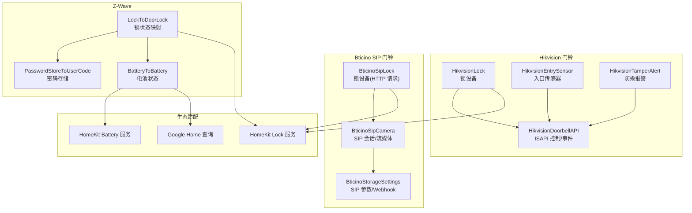
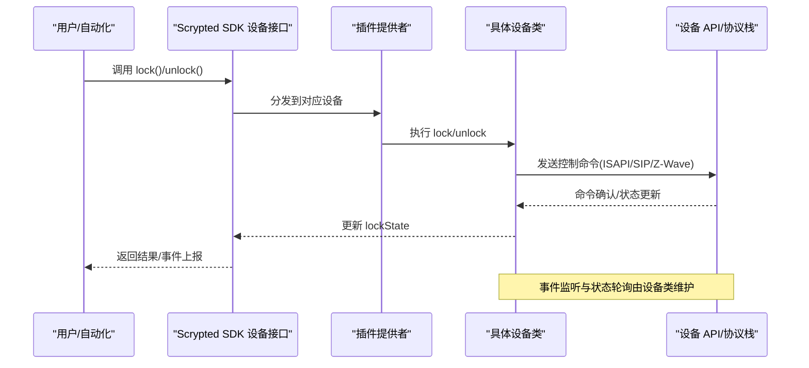
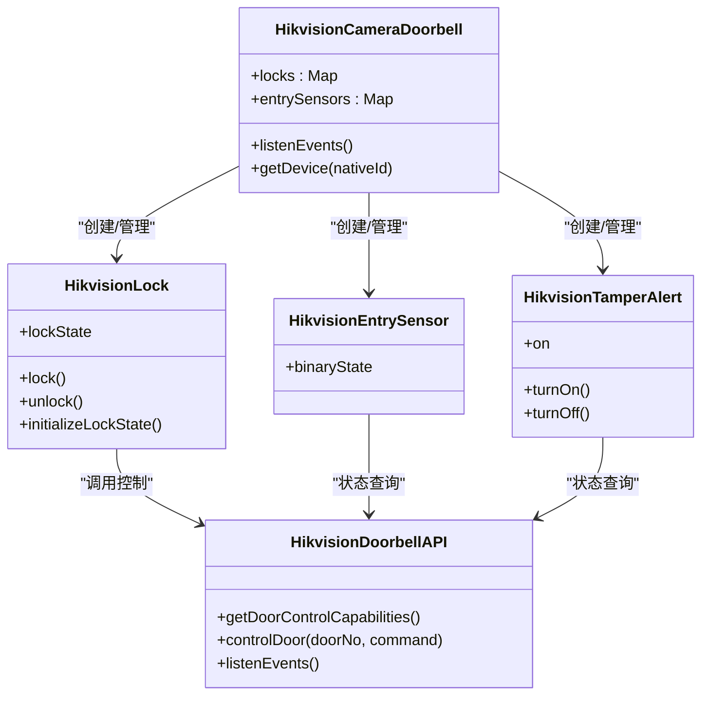
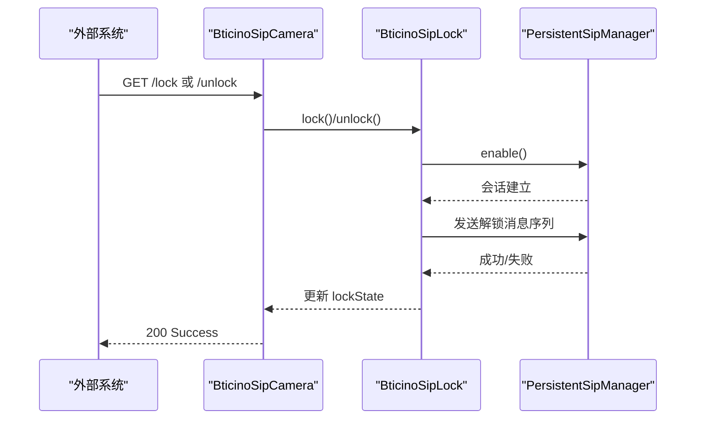
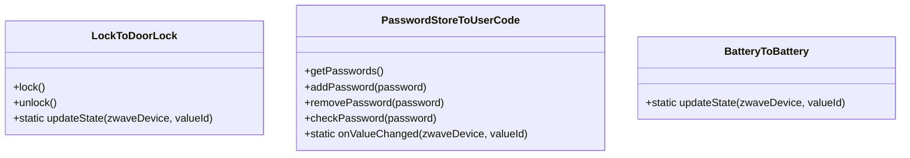
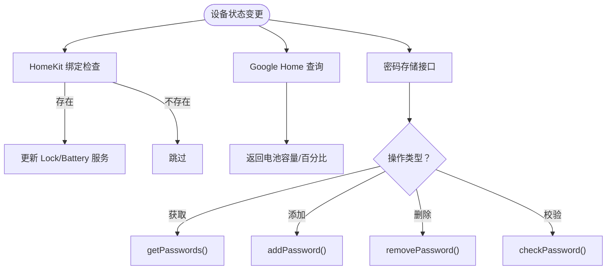
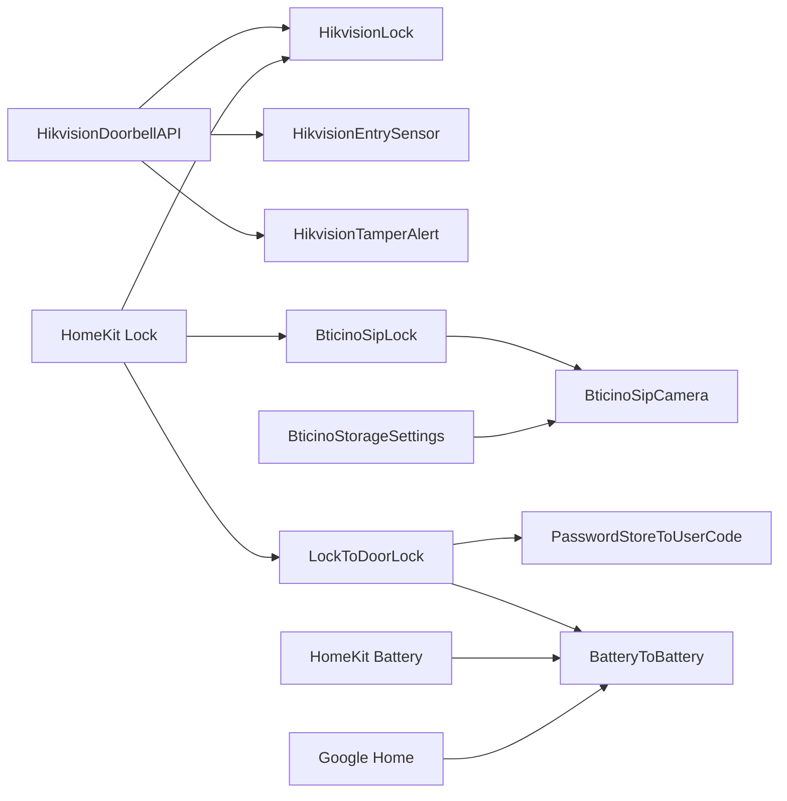

# 门锁设备集成

<cite>
**本文引用的文件**
- [plugins/hikvision-doorbell/src/main.ts](file://plugins/hikvision-doorbell/src/main.ts)
- [plugins/hikvision-doorbell/src/lock.ts](file://plugins/hikvision-doorbell/src/lock.ts)
- [plugins/hikvision-doorbell/src/entry-sensor.ts](file://plugins/hikvision-doorbell/src/entry-sensor.ts)
- [plugins/hikvision-doorbell/src/tamper-alert.ts](file://plugins/hikvision-doorbell/src/tamper-alert.ts)
- [plugins/hikvision-doorbell/src/doorbell-api.ts](file://plugins/hikvision-doorbell/src/doorbell-api.ts)
- [plugins/hikvision-doorbell/fs/LOCK_README.md](file://plugins/hikvision-doorbell/fs/LOCK_README.md)
- [plugins/bticino/src/main.ts](file://plugins/bticino/src/main.ts)
- [plugins/bticino/src/bticino-lock.ts](file://plugins/bticino/src/bticino-lock.ts)
- [plugins/bticino/src/bticino-camera.ts](file://plugins/bticino/src/bticino-camera.ts)
- [plugins/bticino/src/storage-settings.ts](file://plugins/bticino/src/storage-settings.ts)
- [plugins/zwave/src/CommandClasses/LockToDoorLock.ts](file://plugins/zwave/src/CommandClasses/LockToDoorLock.ts)
- [plugins/zwave/src/CommandClasses/PasswordStoreToUserCode.ts](file://plugins/zwave/src/CommandClasses/PasswordStoreToUserCode.ts)
- [plugins/zwave/src/CommandClasses/BatteryToBattery.ts](file://plugins/zwave/src/CommandClasses/BatteryToBattery.ts)
- [plugins/homekit/src/types/lock.ts](file://plugins/homekit/src/types/lock.ts)
- [plugins/homekit/src/battery.ts](file://plugins/homekit/src/battery.ts)
- [plugins/google-home/src/common.ts](file://plugins/google-home/src/common.ts)
</cite>

## 目录
1. [简介](#简介)
2. [项目结构](#项目结构)
3. [核心组件](#核心组件)
4. [架构总览](#架构总览)
5. [详细组件分析](#详细组件分析)
6. [依赖关系分析](#依赖关系分析)
7. [性能考量](#性能考量)
8. [故障排除指南](#故障排除指南)
9. [结论](#结论)
10. [附录](#附录)

## 简介
本技术文档面向 Scrypted 平台的门锁设备集成，系统性梳理了多种智能门锁与门铃联动的实现方案，覆盖以下关键能力：
- 电子门锁控制：Hikvision 门锁的 ISAPI 远程控制、Bticino SIP 语音解锁、Z-Wave 锁状态映射
- 开锁记录与事件：门锁事件监听、开锁/闭锁事件上报、异常报警（撬装）联动
- 电池状态监控：通过电池服务在 HomeKit/Google Home 等生态中展示
- 安全机制：密码存储与校验（Z-Wave 用户码）、临时密码、指纹/卡片识别（由设备侧支持）
- 配置参数：门锁编号、控制地址、状态轮询间隔、报警阈值等
- 故障排除：常见问题如无法控制、状态不同步、电池低电量等的诊断与解决

## 项目结构
围绕门锁集成的相关模块主要分布在如下插件中：
- Hikvision 门铃联动门锁：提供 ISAPI 门锁控制、事件监听、入口传感器与防撬报警
- Bticino SIP 门铃联动门锁：通过 SIP 发送解锁指令，提供 Webhook 接收门锁状态
- Z-Wave 锁与密码：将 Z-Wave 锁状态映射为 Scrypted Lock，并提供密码存储接口
- HomeKit/Google Home：将门锁状态与电池状态映射到生态服务

**图表来源**
- [plugins/hikvision-doorbell/src/main.ts:61-105](file://plugins/hikvision-doorbell/src/main.ts#L61-L105)
- [plugins/hikvision-doorbell/src/lock.ts:7-68](file://plugins/hikvision-doorbell/src/lock.ts#L7-L68)
- [plugins/hikvision-doorbell/src/entry-sensor.ts:7-30](file://plugins/hikvision-doorbell/src/entry-sensor.ts#L7-L30)
- [plugins/hikvision-doorbell/src/tamper-alert.ts:7-38](file://plugins/hikvision-doorbell/src/tamper-alert.ts#L7-L38)
- [plugins/bticino/src/bticino-lock.ts:4-55](file://plugins/bticino/src/bticino-lock.ts#L4-L55)
- [plugins/bticino/src/bticino-camera.ts:34-632](file://plugins/bticino/src/bticino-camera.ts#L34-L632)
- [plugins/zwave/src/CommandClasses/LockToDoorLock.ts:6-22](file://plugins/zwave/src/CommandClasses/LockToDoorLock.ts#L6-L22)
- [plugins/zwave/src/CommandClasses/PasswordStoreToUserCode.ts:12-128](file://plugins/zwave/src/CommandClasses/PasswordStoreToUserCode.ts#L12-L128)
- [plugins/zwave/src/CommandClasses/BatteryToBattery.ts:5-11](file://plugins/zwave/src/CommandClasses/BatteryToBattery.ts#L5-L11)
- [plugins/homekit/src/types/lock.ts:27-62](file://plugins/homekit/src/types/lock.ts#L27-L62)
- [plugins/homekit/src/battery.ts:5-19](file://plugins/homekit/src/battery.ts#L5-L19)
- [plugins/google-home/src/common.ts:73-87](file://plugins/google-home/src/common.ts#L73-L87)

**章节来源**
- [plugins/hikvision-doorbell/src/main.ts:61-105](file://plugins/hikvision-doorbell/src/main.ts#L61-L105)
- [plugins/bticino/src/main.ts:9-107](file://plugins/bticino/src/main.ts#L9-L107)
- [plugins/zwave/src/CommandClasses/LockToDoorLock.ts:6-22](file://plugins/zwave/src/CommandClasses/LockToDoorLock.ts#L6-L22)

## 核心组件
- Hikvision 门锁控制与事件
  - 通过 ISAPI 获取门锁能力、执行开/闭锁命令
  - 事件监听解析门锁状态变化、异常报警
- Bticino SIP 门锁
  - 通过 SIP 发送解锁消息；提供 HTTP 请求接口用于外部状态同步
  - 支持 Webhook 回调以接收门锁状态
- Z-Wave 锁与安全
  - 将 Z-Wave 锁状态映射为 Scrypted Lock
  - 密码存储接口用于管理用户码
  - 电池状态映射到生态服务
- 生态适配
  - HomeKit：锁目标/当前状态绑定、电池服务
  - Google Home：查询电池容量

**章节来源**
- [plugins/hikvision-doorbell/src/lock.ts:7-68](file://plugins/hikvision-doorbell/src/lock.ts#L7-L68)
- [plugins/hikvision-doorbell/src/doorbell-api.ts:88-137](file://plugins/hikvision-doorbell/src/doorbell-api.ts#L88-L137)
- [plugins/bticino/src/bticino-lock.ts:4-55](file://plugins/bticino/src/bticino-lock.ts#L4-L55)
- [plugins/bticino/src/bticino-camera.ts:244-253](file://plugins/bticino/src/bticino-camera.ts#L244-L253)
- [plugins/zwave/src/CommandClasses/LockToDoorLock.ts:6-22](file://plugins/zwave/src/CommandClasses/LockToDoorLock.ts#L6-L22)
- [plugins/zwave/src/CommandClasses/PasswordStoreToUserCode.ts:22-128](file://plugins/zwave/src/CommandClasses/PasswordStoreToUserCode.ts#L22-L128)
- [plugins/homekit/src/types/lock.ts:27-62](file://plugins/homekit/src/types/lock.ts#L27-L62)
- [plugins/homekit/src/battery.ts:5-19](file://plugins/homekit/src/battery.ts#L5-L19)
- [plugins/google-home/src/common.ts:73-87](file://plugins/google-home/src/common.ts#L73-L87)

## 架构总览
下图展示了门锁设备在 Scrypted 中的端到端交互流程，涵盖控制、事件、状态同步与生态适配。

**图表来源**
- [plugins/hikvision-doorbell/src/lock.ts:48-58](file://plugins/hikvision-doorbell/src/lock.ts#L48-L58)
- [plugins/bticino/src/bticino-lock.ts:11-27](file://plugins/bticino/src/bticino-lock.ts#L11-L27)
- [plugins/zwave/src/CommandClasses/LockToDoorLock.ts:7-16](file://plugins/zwave/src/CommandClasses/LockToDoorLock.ts#L7-L16)

## 详细组件分析

### Hikvision 门锁与门铃联动
- 门锁控制
  - 初始化时尝试发送闭锁命令以确定初始状态
  - 根据设备能力选择使用 close 或 resume 命令
- 事件驱动的状态更新
  - 解析门锁事件（开/闭、异常开启），更新锁状态
  - 同步入口传感器状态（门开关）
- 异常报警
  - 撬装事件可转为防撬报警设备
- 文档与帮助
  - 提供 README 文件用于说明门锁开锁机制

**图表来源**
- [plugins/hikvision-doorbell/src/main.ts:61-105](file://plugins/hikvision-doorbell/src/main.ts#L61-L105)
- [plugins/hikvision-doorbell/src/lock.ts:7-68](file://plugins/hikvision-doorbell/src/lock.ts#L7-L68)
- [plugins/hikvision-doorbell/src/entry-sensor.ts:7-30](file://plugins/hikvision-doorbell/src/entry-sensor.ts#L7-L30)
- [plugins/hikvision-doorbell/src/tamper-alert.ts:7-38](file://plugins/hikvision-doorbell/src/tamper-alert.ts#L7-L38)
- [plugins/hikvision-doorbell/src/doorbell-api.ts:88-137](file://plugins/hikvision-doorbell/src/doorbell-api.ts#L88-L137)

**章节来源**
- [plugins/hikvision-doorbell/src/lock.ts:22-40](file://plugins/hikvision-doorbell/src/lock.ts#L22-L40)
- [plugins/hikvision-doorbell/src/main.ts:232-252](file://plugins/hikvision-doorbell/src/main.ts#L232-L252)
- [plugins/hikvision-doorbell/fs/LOCK_README.md:1-3](file://plugins/hikvision-doorbell/fs/LOCK_README.md#L1-L3)

### Bticino SIP 门锁与门铃
- SIP 解锁
  - 通过持久化 SIP 会话发送特定消息序列实现开锁
- HTTP 请求接口
  - 提供 /lock、/unlock、/locked、/unlocked 端点，便于外部系统同步状态
- Webhook
  - 生成门铃与门锁状态回调地址，便于设备侧主动上报
- 设置项
  - SIP From/To、域、UA 过期时间、缩略图缓存、调试开关、设备地址等

**图表来源**
- [plugins/bticino/src/bticino-lock.ts:23-27](file://plugins/bticino/src/bticino-lock.ts#L23-L27)
- [plugins/bticino/src/bticino-camera.ts:244-253](file://plugins/bticino/src/bticino-camera.ts#L244-L253)
- [plugins/bticino/src/storage-settings.ts:9-98](file://plugins/bticino/src/storage-settings.ts#L9-L98)

**章节来源**
- [plugins/bticino/src/bticino-lock.ts:29-55](file://plugins/bticino/src/bticino-lock.ts#L29-L55)
- [plugins/bticino/src/bticino-camera.ts:640-670](file://plugins/bticino/src/bticino-camera.ts#L640-L670)
- [plugins/bticino/src/storage-settings.ts:70-87](file://plugins/bticino/src/storage-settings.ts#L70-L87)

### Z-Wave 门锁与安全
- 锁状态映射
  - 将 Z-Wave Door Lock 命令类映射为 Scrypted Lock，支持锁定/解锁
- 密码存储
  - 实现 PasswordStore 接口，管理用户码列表、添加/删除/校验
- 电池状态
  - 将电池信息映射到 Battery 服务，供生态查询与展示

**图表来源**
- [plugins/zwave/src/CommandClasses/LockToDoorLock.ts:6-22](file://plugins/zwave/src/CommandClasses/LockToDoorLock.ts#L6-L22)
- [plugins/zwave/src/CommandClasses/PasswordStoreToUserCode.ts:12-128](file://plugins/zwave/src/CommandClasses/PasswordStoreToUserCode.ts#L12-L128)
- [plugins/zwave/src/CommandClasses/BatteryToBattery.ts:5-11](file://plugins/zwave/src/CommandClasses/BatteryToBattery.ts#L5-L11)

**章节来源**
- [plugins/zwave/src/CommandClasses/LockToDoorLock.ts:7-16](file://plugins/zwave/src/CommandClasses/LockToDoorLock.ts#L7-L16)
- [plugins/zwave/src/CommandClasses/PasswordStoreToUserCode.ts:22-128](file://plugins/zwave/src/CommandClasses/PasswordStoreToUserCode.ts#L22-L128)
- [plugins/zwave/src/CommandClasses/BatteryToBattery.ts:5-11](file://plugins/zwave/src/CommandClasses/BatteryToBattery.ts#L5-L11)

### 生态适配与安全机制
- HomeKit
  - 将 Lock 当前/目标状态与服务绑定，支持 SET 操作触发 lock/unlock
  - 将 Battery 映射为电池服务，显示电量与低电量状态
- Google Home
  - 在查询响应中返回容量剩余与百分比
- 安全机制
  - 密码存储与校验（Z-Wave 用户码）
  - 临时密码：可通过插件或设备侧策略实现（需结合具体设备能力）

**图表来源**
- [plugins/homekit/src/types/lock.ts:27-62](file://plugins/homekit/src/types/lock.ts#L27-L62)
- [plugins/homekit/src/battery.ts:5-19](file://plugins/homekit/src/battery.ts#L5-L19)
- [plugins/google-home/src/common.ts:73-87](file://plugins/google-home/src/common.ts#L73-L87)
- [plugins/zwave/src/CommandClasses/PasswordStoreToUserCode.ts:22-128](file://plugins/zwave/src/CommandClasses/PasswordStoreToUserCode.ts#L22-L128)

**章节来源**
- [plugins/homekit/src/types/lock.ts:27-62](file://plugins/homekit/src/types/lock.ts#L27-L62)
- [plugins/homekit/src/battery.ts:5-19](file://plugins/homekit/src/battery.ts#L5-L19)
- [plugins/google-home/src/common.ts:73-87](file://plugins/google-home/src/common.ts#L73-L87)
- [plugins/zwave/src/CommandClasses/PasswordStoreToUserCode.ts:22-128](file://plugins/zwave/src/CommandClasses/PasswordStoreToUserCode.ts#L22-L128)

## 依赖关系分析
- Hikvision 门锁依赖 ISAPI 协议与事件流，具备能力探测与命令校验
- Bticino 门锁依赖 SIP 会话与 HTTP/Webhook，具备参数化配置
- Z-Wave 门锁依赖 Z-Wave 命令类与用户码 CC，具备本地安全能力
- 生态适配通过标准接口绑定，降低耦合度

**图表来源**
- [plugins/hikvision-doorbell/src/doorbell-api.ts:88-137](file://plugins/hikvision-doorbell/src/doorbell-api.ts#L88-L137)
- [plugins/bticino/src/bticino-lock.ts:4-55](file://plugins/bticino/src/bticino-lock.ts#L4-L55)
- [plugins/bticino/src/bticino-camera.ts:34-632](file://plugins/bticino/src/bticino-camera.ts#L34-L632)
- [plugins/zwave/src/CommandClasses/LockToDoorLock.ts:6-22](file://plugins/zwave/src/CommandClasses/LockToDoorLock.ts#L6-L22)
- [plugins/zwave/src/CommandClasses/PasswordStoreToUserCode.ts:12-128](file://plugins/zwave/src/CommandClasses/PasswordStoreToUserCode.ts#L12-L128)
- [plugins/zwave/src/CommandClasses/BatteryToBattery.ts:5-11](file://plugins/zwave/src/CommandClasses/BatteryToBattery.ts#L5-L11)

**章节来源**
- [plugins/hikvision-doorbell/src/main.ts:61-105](file://plugins/hikvision-doorbell/src/main.ts#L61-L105)
- [plugins/bticino/src/main.ts:9-107](file://plugins/bticino/src/main.ts#L9-L107)
- [plugins/zwave/src/CommandClasses/LockToDoorLock.ts:6-22](file://plugins/zwave/src/CommandClasses/LockToDoorLock.ts#L6-L22)

## 性能考量
- 请求队列与并发控制：Hikvision API 使用请求队列避免阻塞，提升稳定性
- 事件去重与时序：对事件年龄进行限制，避免过期事件干扰状态
- 流媒体与 RTP 切换：Bticino 采用 RTP 切换器实现无缝切换，减少中断
- 缓存与预取：Bticino 支持缩略图缓存，降低频繁抓拍带来的负载

**章节来源**
- [plugins/hikvision-doorbell/src/doorbell-api.ts:139-183](file://plugins/hikvision-doorbell/src/doorbell-api.ts#L139-L183)
- [plugins/hikvision-doorbell/src/main.ts:460-529](file://plugins/hikvision-doorbell/src/main.ts#L460-L529)
- [plugins/bticino/src/bticino-camera.ts:38-632](file://plugins/bticino/src/bticino-camera.ts#L38-L632)

## 故障排除指南
- 门锁无法控制
  - Hikvision：检查门锁能力范围与可用命令，确保 doorNo 与命令合法
  - Bticino：确认 SIP 参数配置正确，会话是否已建立
  - Z-Wave：确认节点在线与命令类支持
- 状态不同步
  - Hikvision：启用事件监听并检查事件解析逻辑
  - Bticino：使用 Webhook 或 HTTP 接口主动同步状态
  - Z-Wave：触发刷新或等待通知事件
- 电池电量低
  - 通过 Battery 服务在生态中查看与告警
  - 设置低电量阈值并在 HomeKit/Google Home 中接收提醒

**章节来源**
- [plugins/hikvision-doorbell/src/doorbell-api.ts:506-516](file://plugins/hikvision-doorbell/src/doorbell-api.ts#L506-L516)
- [plugins/hikvision-doorbell/src/main.ts:161-275](file://plugins/hikvision-doorbell/src/main.ts#L161-L275)
- [plugins/bticino/src/bticino-lock.ts:29-55](file://plugins/bticino/src/bticino-lock.ts#L29-L55)
- [plugins/homekit/src/battery.ts:5-19](file://plugins/homekit/src/battery.ts#L5-L19)
- [plugins/google-home/src/common.ts:73-87](file://plugins/google-home/src/common.ts#L73-L87)

## 结论
Scrypted 通过多协议插件化架构，实现了对 Hikvision、Bticino、Z-Wave 等多种门锁与门铃设备的统一接入与控制。借助事件驱动与生态适配，系统能够稳定地提供门锁控制、状态同步、异常报警与电池监控等核心能力。建议在部署时根据设备特性合理配置参数与轮询策略，以获得最佳体验。

## 附录
- 配置参数示例（节选）
  - Hikvision：HTTP 端口、两向音频开关、提供的子设备清单
  - Bticino：SIP From/To、域、UA 过期时间、缩略图缓存、调试开关、设备地址、Webhook 地址
  - Z-Wave：用户码数量与条目管理、电池阈值（由生态服务决定）

**章节来源**
- [plugins/hikvision-doorbell/src/main.ts:23-48](file://plugins/hikvision-doorbell/src/main.ts#L23-L48)
- [plugins/bticino/src/storage-settings.ts:9-98](file://plugins/bticino/src/storage-settings.ts#L9-L98)
- [plugins/zwave/src/CommandClasses/PasswordStoreToUserCode.ts:22-128](file://plugins/zwave/src/CommandClasses/PasswordStoreToUserCode.ts#L22-L128)
- [plugins/homekit/src/battery.ts:5-19](file://plugins/homekit/src/battery.ts#L5-L19)