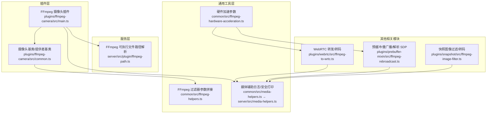
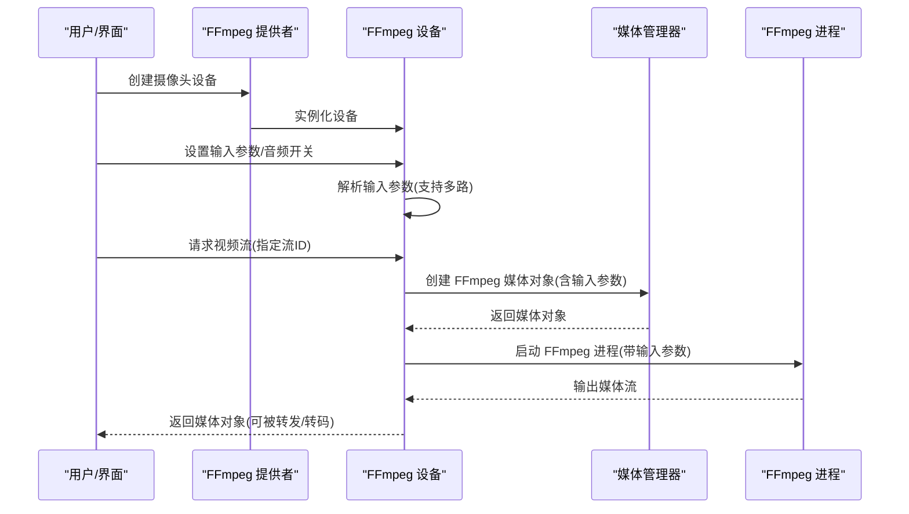
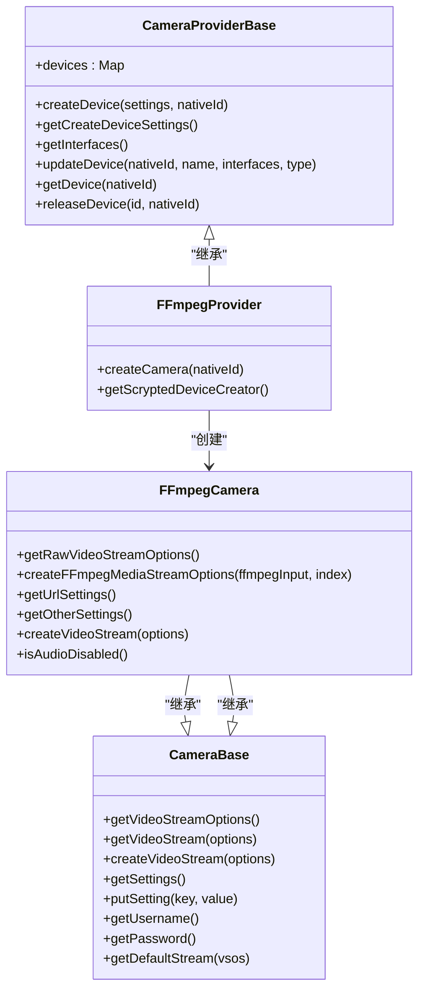
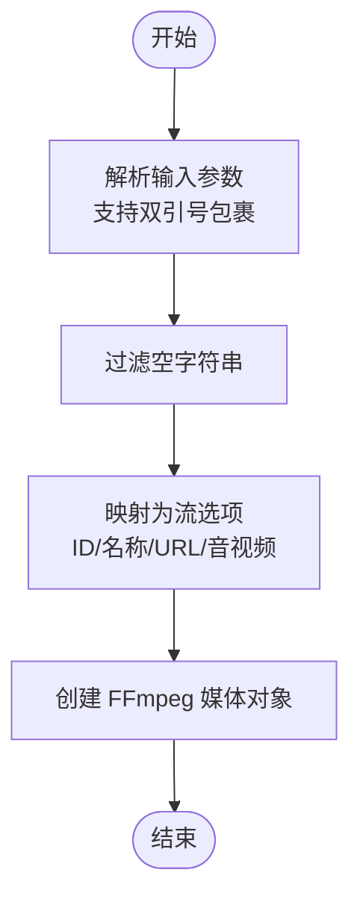
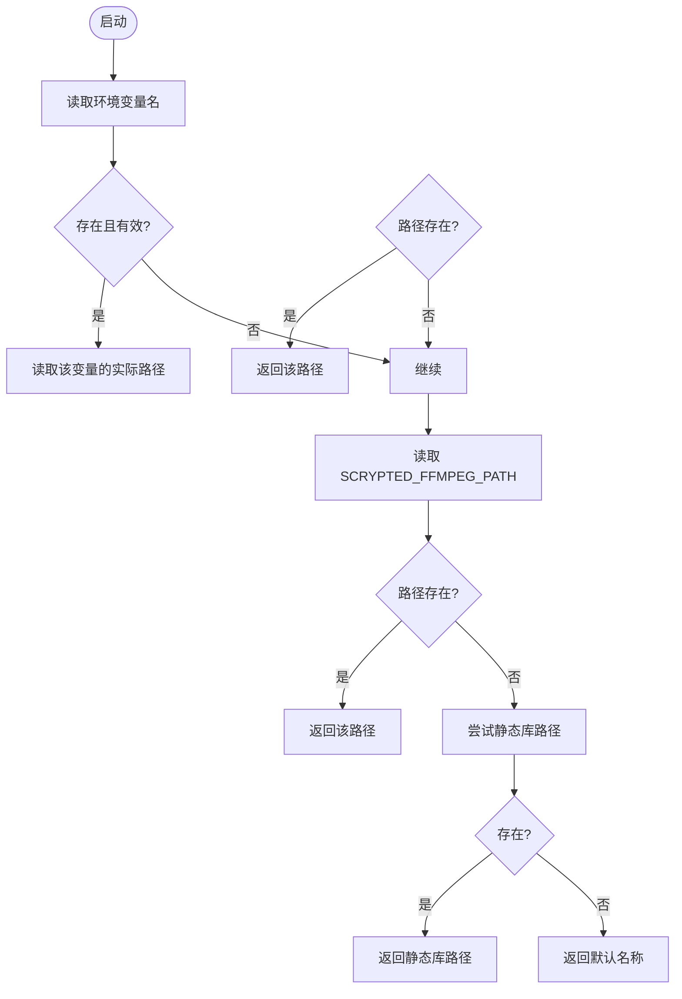
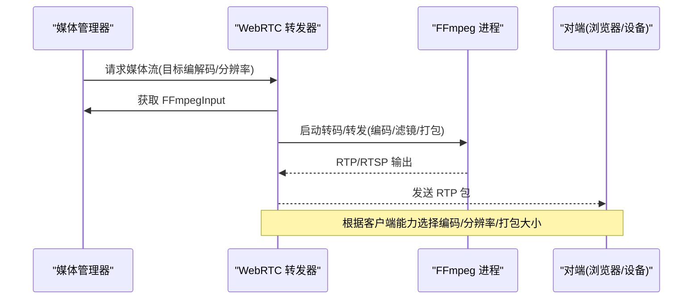
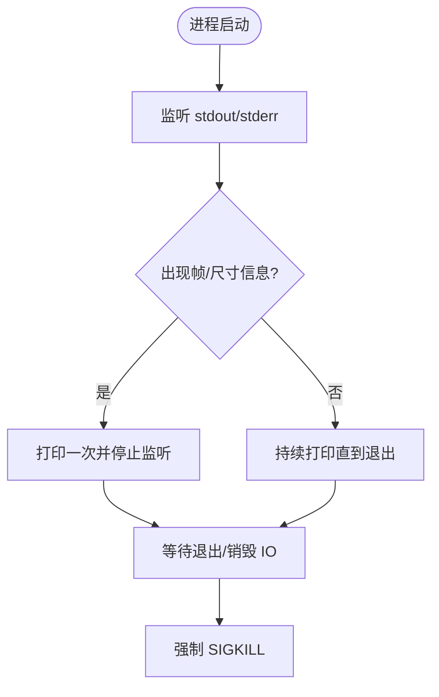
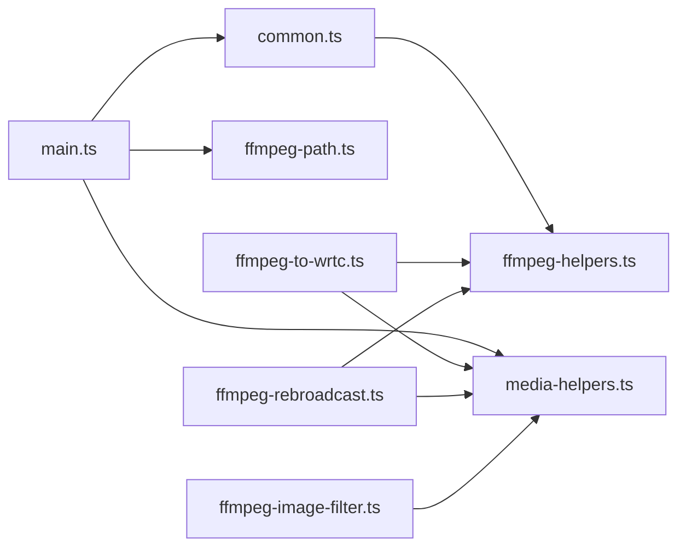

# FFmpeg 摄像头集成

<cite>
**本文引用的文件**
- [plugins/ffmpeg-camera/src/main.ts](file://plugins/ffmpeg-camera/src/main.ts)
- [plugins/ffmpeg-camera/src/common.ts](file://plugins/ffmpeg-camera/src/common.ts)
- [common/src/ffmpeg-hardware-acceleration.ts](file://common/src/ffmpeg-hardware-acceleration.ts)
- [common/src/ffmpeg-helpers.ts](file://common/src/ffmpeg-helpers.ts)
- [common/src/media-helpers.ts](file://common/src/media-helpers.ts)
- [server/src/media-helpers.ts](file://server/src/media-helpers.ts)
- [server/src/plugin/ffmpeg-path.ts](file://server/src/plugin/ffmpeg-path.ts)
- [plugins/webrtc/src/ffmpeg-to-wrtc.ts](file://plugins/webrtc/src/ffmpeg-to-wrtc.ts)
- [plugins/prebuffer-mixin/src/ffmpeg-rebroadcast.ts](file://plugins/prebuffer-mixin/src/ffmpeg-rebroadcast.ts)
- [plugins/snapshot/src/ffmpeg-image-filter.ts](file://plugins/snapshot/src/ffmpeg-image-filter.ts)
</cite>

## 目录
1. [简介](#简介)
2. [项目结构](#项目结构)
3. [核心组件](#核心组件)
4. [架构总览](#架构总览)
5. [详细组件分析](#详细组件分析)
6. [依赖关系分析](#依赖关系分析)
7. [性能考量](#性能考量)
8. [故障排除指南](#故障排除指南)
9. [结论](#结论)
10. [附录](#附录)

## 简介
本技术文档面向 Scrypted 的 FFmpeg 摄像头集成，系统性阐述 FFmpeg 在摄像头场景中的作用与优势：多媒体处理能力、编解码支持、格式转换；并围绕 FFmpeg 摄像头的配置方法（可执行文件路径、输入参数、输出格式、命令行构建）、核心功能实现（摄像头捕获、视频流生成、音频处理、时间戳管理）、媒体处理能力（多路流输出、实时转码、格式适配、分辨率变换）、性能优化策略（并发处理、内存管理、CPU 利用率优化、硬件加速集成）以及故障排除与最佳实践进行深入说明。

## 项目结构
FFmpeg 摄像头集成由“插件层”和“通用工具层/服务层”共同组成：
- 插件层：提供设备发现、设置、流选项与媒体对象创建等能力
- 通用工具层：提供硬件加速、过滤器参数拼接、日志与安全打印等工具
- 服务层：提供 FFmpeg 可执行文件路径解析、进程安全控制等基础设施

**图表来源**
- [plugins/ffmpeg-camera/src/main.ts:1-155](file://plugins/ffmpeg-camera/src/main.ts#L1-L155)
- [plugins/ffmpeg-camera/src/common.ts:1-185](file://plugins/ffmpeg-camera/src/common.ts#L1-L185)
- [common/src/ffmpeg-hardware-acceleration.ts:1-147](file://common/src/ffmpeg-hardware-acceleration.ts#L1-L147)
- [common/src/ffmpeg-helpers.ts:1-8](file://common/src/ffmpeg-helpers.ts#L1-L8)
- [common/src/media-helpers.ts:1-2](file://common/src/media-helpers.ts#L1-L2)
- [server/src/media-helpers.ts:1-98](file://server/src/media-helpers.ts#L1-L98)
- [server/src/plugin/ffmpeg-path.ts:1-38](file://server/src/plugin/ffmpeg-path.ts#L1-L38)
- [plugins/webrtc/src/ffmpeg-to-wrtc.ts:1-783](file://plugins/webrtc/src/ffmpeg-to-wrtc.ts#L1-L783)
- [plugins/prebuffer-mixin/src/ffmpeg-rebroadcast.ts:1-290](file://plugins/prebuffer-mixin/src/ffmpeg-rebroadcast.ts#L1-L290)
- [plugins/snapshot/src/ffmpeg-image-filter.ts:1-222](file://plugins/snapshot/src/ffmpeg-image-filter.ts#L1-L222)

**章节来源**
- [plugins/ffmpeg-camera/src/main.ts:1-155](file://plugins/ffmpeg-camera/src/main.ts#L1-L155)
- [plugins/ffmpeg-camera/src/common.ts:1-185](file://plugins/ffmpeg-camera/src/common.ts#L1-L185)
- [server/src/plugin/ffmpeg-path.ts:1-38](file://server/src/plugin/ffmpeg-path.ts#L1-L38)

## 核心组件
- FFmpeg 摄像头提供者与设备
  - 提供者负责设备创建、接口声明与系统设备注册
  - 设备负责设置项、流选项、媒体对象创建与音频开关
- 基类抽象
  - 统一用户名/密码、默认流选择、设置事件通知等行为
- FFmpeg 输入参数解析
  - 支持多路输入参数，按索引映射到不同视频流
- FFmpeg 可执行文件路径
  - 优先从环境变量或静态库获取，回退至系统默认名称

**章节来源**
- [plugins/ffmpeg-camera/src/main.ts:17-142](file://plugins/ffmpeg-camera/src/main.ts#L17-L142)
- [plugins/ffmpeg-camera/src/common.ts:10-115](file://plugins/ffmpeg-camera/src/common.ts#L10-L115)
- [server/src/plugin/ffmpeg-path.ts:5-37](file://server/src/plugin/ffmpeg-path.ts#L5-L37)

## 架构总览
下图展示从用户配置到媒体对象生成、再到转发/转码的关键流程：

**图表来源**
- [plugins/ffmpeg-camera/src/main.ts:77-125](file://plugins/ffmpeg-camera/src/main.ts#L77-L125)
- [plugins/ffmpeg-camera/src/common.ts:23-36](file://plugins/ffmpeg-camera/src/common.ts#L23-L36)
- [server/src/media-helpers.ts:40-71](file://server/src/media-helpers.ts#L40-L71)

## 详细组件分析

### FFmpeg 摄像头设备与提供者
- 多输入参数支持：每个摄像头可配置多个输入参数，分别对应不同码率/分辨率的流
- 流选项生成：根据输入参数列表生成对应的流选项（ID/名称/URL/音视频）
- 音频开关：通过存储项控制是否禁用音频
- 媒体对象创建：将输入参数封装为 FFmpegInput 并交由媒体管理器创建媒体对象

**图表来源**
- [plugins/ffmpeg-camera/src/common.ts:117-184](file://plugins/ffmpeg-camera/src/common.ts#L117-L184)
- [plugins/ffmpeg-camera/src/main.ts:144-155](file://plugins/ffmpeg-camera/src/main.ts#L144-L155)
- [plugins/ffmpeg-camera/src/main.ts:17-142](file://plugins/ffmpeg-camera/src/main.ts#L17-L142)

**章节来源**
- [plugins/ffmpeg-camera/src/main.ts:17-142](file://plugins/ffmpeg-camera/src/main.ts#L17-L142)
- [plugins/ffmpeg-camera/src/common.ts:10-115](file://plugins/ffmpeg-camera/src/common.ts#L10-L115)

### FFmpeg 输入参数解析与命令行构建
- 输入参数解析：支持双引号包裹的参数，按空格拆分并去除引号
- 多路输入：每条输入参数对应一个流，索引映射到流 ID/名称
- 媒体对象创建：将 URL、输入参数、媒体流选项封装为 FFmpegInput，并交由媒体管理器创建媒体对象

**图表来源**
- [plugins/ffmpeg-camera/src/main.ts:7-15](file://plugins/ffmpeg-camera/src/main.ts#L7-L15)
- [plugins/ffmpeg-camera/src/main.ts:77-89](file://plugins/ffmpeg-camera/src/main.ts#L77-L89)
- [plugins/ffmpeg-camera/src/main.ts:110-125](file://plugins/ffmpeg-camera/src/main.ts#L110-L125)

**章节来源**
- [plugins/ffmpeg-camera/src/main.ts:7-15](file://plugins/ffmpeg-camera/src/main.ts#L7-L15)
- [plugins/ffmpeg-camera/src/main.ts:77-125](file://plugins/ffmpeg-camera/src/main.ts#L77-L125)

### FFmpeg 可执行文件路径解析
- 优先级：环境变量名 -> 环境变量值 -> 静态库路径 -> 默认名称
- 容器/平台差异：Windows 使用 ffmpeg.exe，其他平台使用 ffmpeg

**图表来源**
- [server/src/plugin/ffmpeg-path.ts:5-37](file://server/src/plugin/ffmpeg-path.ts#L5-L37)

**章节来源**
- [server/src/plugin/ffmpeg-path.ts:5-37](file://server/src/plugin/ffmpeg-path.ts#L5-L37)

### 媒体处理与转码能力（WebRTC/重广播）
- WebRTC 转发/转码：根据客户端能力选择 H264/H265、音频 Opus/PCM，必要时进行转码与打包
- 重广播/解析：解析 SDP、识别音视频编解码类型，按容器输出并建立管道/套接字解析
- 快照图像过滤：支持裁剪、缩放、亮度、模糊、文字叠加等滤镜链拼接

**图表来源**
- [plugins/webrtc/src/ffmpeg-to-wrtc.ts:69-95](file://plugins/webrtc/src/ffmpeg-to-wrtc.ts#L69-L95)
- [plugins/webrtc/src/ffmpeg-to-wrtc.ts:184-255](file://plugins/webrtc/src/ffmpeg-to-wrtc.ts#L184-L255)
- [plugins/prebuffer-mixin/src/ffmpeg-rebroadcast.ts:107-289](file://plugins/prebuffer-mixin/src/ffmpeg-rebroadcast.ts#L107-L289)

**章节来源**
- [plugins/webrtc/src/ffmpeg-to-wrtc.ts:69-255](file://plugins/webrtc/src/ffmpeg-to-wrtc.ts#L69-L255)
- [plugins/prebuffer-mixin/src/ffmpeg-rebroadcast.ts:107-289](file://plugins/prebuffer-mixin/src/ffmpeg-rebroadcast.ts#L107-L289)
- [plugins/snapshot/src/ffmpeg-image-filter.ts:46-95](file://plugins/snapshot/src/ffmpeg-image-filter.ts#L46-L95)

### 时间戳管理与日志/安全打印
- 进程安全退出：先写入退出指令，等待优雅退出，再强制终止
- 初始输出日志：过滤噪声，仅在检测到帧/尺寸信息后停止持续打印
- 参数安全打印：隐藏输入 URL 的敏感部分（如密码）

**图表来源**
- [server/src/media-helpers.ts:40-71](file://server/src/media-helpers.ts#L40-L71)

**章节来源**
- [server/src/media-helpers.ts:11-38](file://server/src/media-helpers.ts#L11-L38)
- [server/src/media-helpers.ts:40-71](file://server/src/media-helpers.ts#L40-L71)
- [common/src/media-helpers.ts:1-2](file://common/src/media-helpers.ts#L1-L2)

## 依赖关系分析
- FFmpeg 摄像头插件依赖：
  - 提供者/设备基类（统一设置与流选项）
  - FFmpeg 可执行文件路径解析（运行时定位）
  - 媒体辅助（日志/安全打印）
  - 过滤器参数拼接（滤镜链构建）
  - 其他模块（WebRTC/重广播/快照）共享相同工具

**图表来源**
- [plugins/ffmpeg-camera/src/main.ts:1-155](file://plugins/ffmpeg-camera/src/main.ts#L1-L155)
- [plugins/ffmpeg-camera/src/common.ts:1-185](file://plugins/ffmpeg-camera/src/common.ts#L1-L185)
- [server/src/plugin/ffmpeg-path.ts:1-38](file://server/src/plugin/ffmpeg-path.ts#L1-L38)
- [server/src/media-helpers.ts:1-98](file://server/src/media-helpers.ts#L1-L98)
- [common/src/ffmpeg-helpers.ts:1-8](file://common/src/ffmpeg-helpers.ts#L1-L8)
- [plugins/webrtc/src/ffmpeg-to-wrtc.ts:1-783](file://plugins/webrtc/src/ffmpeg-to-wrtc.ts#L1-L783)
- [plugins/prebuffer-mixin/src/ffmpeg-rebroadcast.ts:1-290](file://plugins/prebuffer-mixin/src/ffmpeg-rebroadcast.ts#L1-L290)
- [plugins/snapshot/src/ffmpeg-image-filter.ts:1-222](file://plugins/snapshot/src/ffmpeg-image-filter.ts#L1-L222)

**章节来源**
- [plugins/ffmpeg-camera/src/main.ts:1-155](file://plugins/ffmpeg-camera/src/main.ts#L1-L155)
- [plugins/ffmpeg-camera/src/common.ts:1-185](file://plugins/ffmpeg-camera/src/common.ts#L1-L185)
- [plugins/webrtc/src/ffmpeg-to-wrtc.ts:1-783](file://plugins/webrtc/src/ffmpeg-to-wrtc.ts#L1-L783)
- [plugins/prebuffer-mixin/src/ffmpeg-rebroadcast.ts:1-290](file://plugins/prebuffer-mixin/src/ffmpeg-rebroadcast.ts#L1-L290)
- [plugins/snapshot/src/ffmpeg-image-filter.ts:1-222](file://plugins/snapshot/src/ffmpeg-image-filter.ts#L1-L222)

## 性能考量
- 硬件加速
  - 自动识别平台与设备（如 Raspberry Pi、NVIDIA、Intel、macOS），选择合适的解码/编码器参数
  - 解码：CUDA/CUVID/VAAPI/V4L2/QuickSync/VideoToolbox
  - 编码：libx264（软件）、NVIDIA NVENC、Intel QuickSync、AMD AMF、VAAPI、VideoToolbox
- 转码与分辨率适配
  - 根据客户端能力与网络状况动态选择 H264/H265、分辨率与码率
  - 使用滤镜链进行缩放、裁剪、亮度/模糊、文字叠加等
- 并发与资源管理
  - 进程安全退出与 IO 销毁，避免僵尸进程与句柄泄漏
  - 活动超时与自动清理，防止长时间无数据导致的资源占用

**章节来源**
- [common/src/ffmpeg-hardware-acceleration.ts:49-131](file://common/src/ffmpeg-hardware-acceleration.ts#L49-L131)
- [plugins/webrtc/src/ffmpeg-to-wrtc.ts:184-255](file://plugins/webrtc/src/ffmpeg-to-wrtc.ts#L184-L255)
- [plugins/prebuffer-mixin/src/ffmpeg-rebroadcast.ts:95-105](file://plugins/prebuffer-mixin/src/ffmpeg-rebroadcast.ts#L95-L105)
- [server/src/media-helpers.ts:11-38](file://server/src/media-helpers.ts#L11-L38)

## 故障排除指南
- FFmpeg 启动失败
  - 检查可执行文件路径是否正确（环境变量/静态库/默认名称）
  - 查看初始输出日志，过滤常见噪声后定位错误
  - 使用安全打印输出命令行参数，确认输入 URL 与参数拼接正确
- 摄像头无响应
  - 确认输入参数中包含正确的输入源（URL/协议）
  - 检查活动超时与会话生命周期，确保解析器/转发器未提前退出
  - 对于快照/图像过滤，确认超时与退出码处理逻辑
- 视频输出异常
  - 核对客户端能力（H264/H265、分辨率、打包大小），必要时进行转码
  - 检查滤镜链拼接顺序与参数，避免冲突
  - 关注硬件加速参数与平台兼容性

**章节来源**
- [server/src/plugin/ffmpeg-path.ts:5-37](file://server/src/plugin/ffmpeg-path.ts#L5-L37)
- [server/src/media-helpers.ts:40-71](file://server/src/media-helpers.ts#L40-L71)
- [plugins/prebuffer-mixin/src/ffmpeg-rebroadcast.ts:107-289](file://plugins/prebuffer-mixin/src/ffmpeg-rebroadcast.ts#L107-L289)
- [plugins/snapshot/src/ffmpeg-image-filter.ts:176-221](file://plugins/snapshot/src/ffmpeg-image-filter.ts#L176-L221)

## 结论
Scrypted 的 FFmpeg 摄像头集成以插件化架构为核心，结合通用工具层与服务层的能力，实现了灵活的多路输入、跨平台硬件加速、动态转码与分辨率适配、以及完善的日志与安全控制。通过合理配置输入参数、选择合适的硬件加速与转码策略，并遵循故障排除流程，可在多种部署环境下稳定地提供高质量的视频流服务。

## 附录
- 配置模板与建议
  - 输入参数：每条输入对应一路流，建议按分辨率/码率区分
  - 音频开关：若摄像头无音频或需静音，启用“禁用音频”
  - 硬件加速：优先使用平台原生加速（CUDA/CUVID/NVENC、QuickSync、VideoToolbox、VAAPI）
  - 转码策略：根据客户端能力与网络状况选择 H264/H265、分辨率与码率
- 最佳实践
  - 使用安全打印输出命令行参数，便于调试
  - 启用初始输出日志过滤，减少噪声干扰
  - 合理设置超时与清理逻辑，避免资源泄漏
  - 对滤镜链进行最小化组合，降低转码开销