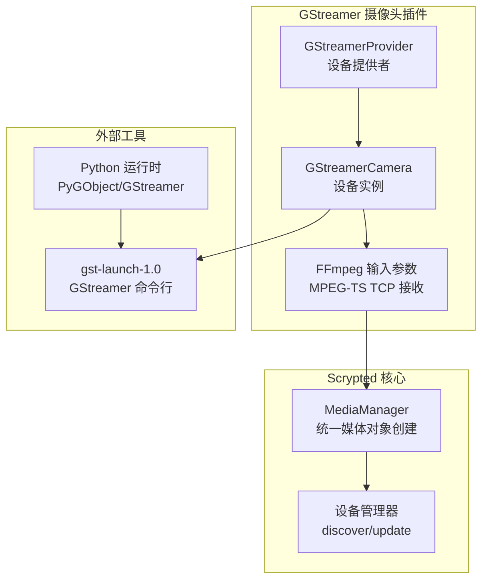
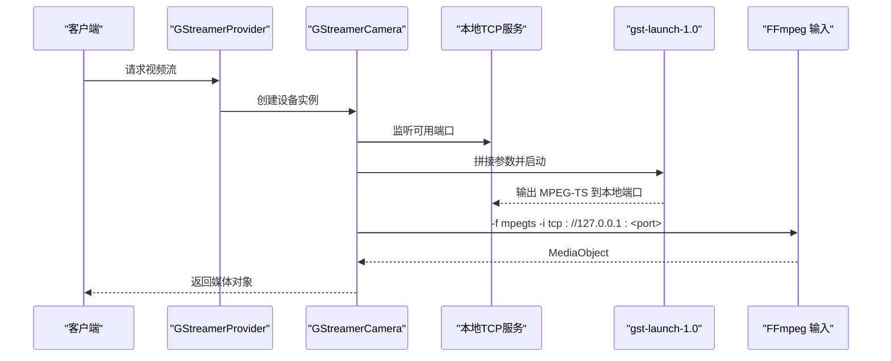
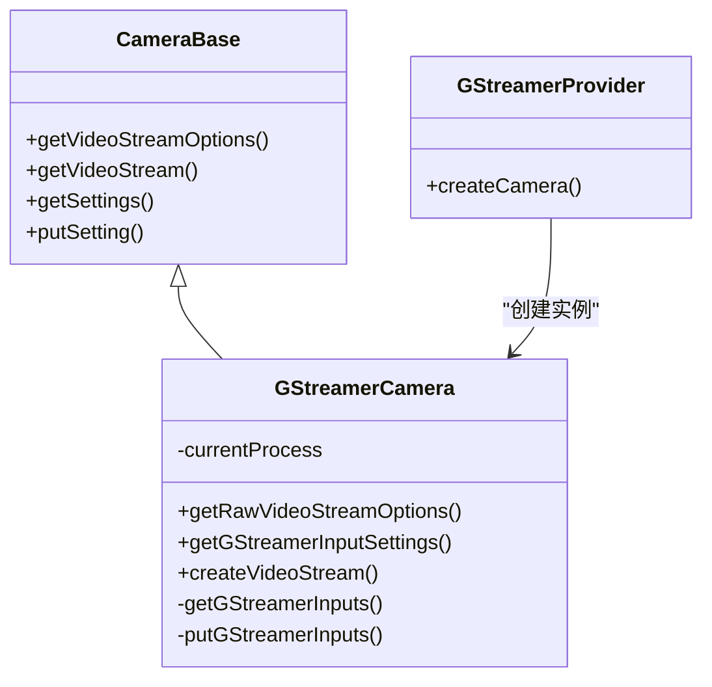
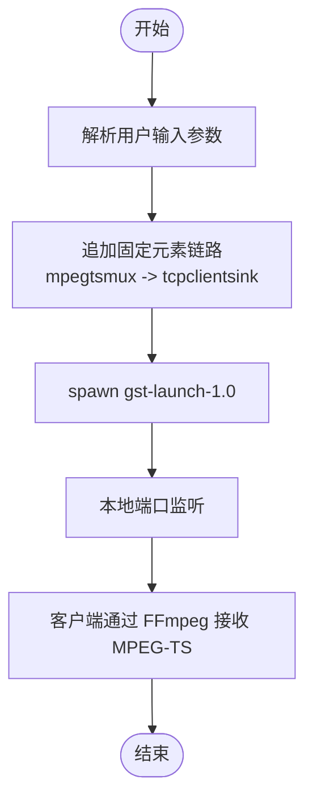
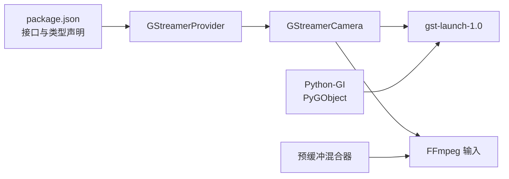

# GStreamer 摄像头集成

<cite>
**本文引用的文件**
- [plugins/gstreamer-camera/src/main.ts](file://plugins/gstreamer-camera/src/main.ts)
- [plugins/gstreamer-camera/src/recommend.ts](file://plugins/gstreamer-camera/src/recommend.ts)
- [plugins/gstreamer-camera/README.md](file://plugins/gstreamer-camera/README.md)
- [plugins/gstreamer-camera/package.json](file://plugins/gstreamer-camera/package.json)
- [plugins/ffmpeg-camera/src/common.ts](file://plugins/ffmpeg-camera/src/common.ts)
- [plugins/ffmpeg-camera/src/main.ts](file://plugins/ffmpeg-camera/src/main.ts)
- [plugins/python-codecs/src/gst_generator.py](file://plugins/python-codecs/src/gst_generator.py)
- [plugins/python-codecs/src/gstreamer.py](file://plugins/python-codecs/src/gstreamer.py)
- [server/src/plugin/runtime/python-worker.ts](file://server/src/plugin/runtime/python-worker.ts)
- [plugins/prebuffer-mixin/src/main.ts](file://plugins/prebuffer-mixin/src/main.ts)
</cite>

## 目录
1. [简介](#简介)
2. [项目结构](#项目结构)
3. [核心组件](#核心组件)
4. [架构总览](#架构总览)
5. [详细组件分析](#详细组件分析)
6. [依赖关系分析](#依赖关系分析)
7. [性能考量](#性能考量)
8. [故障排除指南](#故障排除指南)
9. [结论](#结论)
10. [附录](#附录)

## 简介
本文件面向 Scrypted 的 GStreamer 摄像头集成，系统化阐述其在摄像头接入与实时流处理中的应用与优势。该插件通过命令行工具 gst-launch-1.0 构建 GStreamer 管道，将最终输出适配为 MPEG-TS 流，并由 Scrypted 内部的 FFmpeg 管线进行统一接收与分发。文档覆盖管道架构、元素链路、实时处理能力、配置方法、核心功能实现、媒体处理能力、推荐配置、故障排除以及扩展开发建议。

## 项目结构
- 插件入口与设备提供者位于 GStreamer 摄像头插件目录，负责将外部 GStreamer 管道输出桥接为 Scrypted 摄像头设备。
- 通用摄像头基类来自 FFmpeg 摄像头插件，提供统一的设备生命周期、设置项与流选项管理。
- Python 扩展模块提供基于 PyGObject/GStreamer 的高级管线生成与图像处理能力（可选）。
- 服务器侧运行时对 macOS 平台下的 GStreamer 插件路径进行了兼容处理，确保 Python-GI 能正确加载插件库。
- 推荐使用预缓冲混合器以提升播放体验与稳定性。

图表来源
- [plugins/gstreamer-camera/src/main.ts:149-155](file://plugins/gstreamer-camera/src/main.ts#L149-L155)
- [plugins/gstreamer-camera/src/main.ts:88-145](file://plugins/gstreamer-camera/src/main.ts#L88-L145)
- [plugins/ffmpeg-camera/src/common.ts:117-184](file://plugins/ffmpeg-camera/src/common.ts#L117-L184)
- [plugins/python-codecs/src/gst_generator.py:17-32](file://plugins/python-codecs/src/gst_generator.py#L17-L32)

章节来源
- [plugins/gstreamer-camera/src/main.ts:1-156](file://plugins/gstreamer-camera/src/main.ts#L1-L156)
- [plugins/ffmpeg-camera/src/common.ts:1-185](file://plugins/ffmpeg-camera/src/common.ts#L1-L185)
- [plugins/gstreamer-camera/README.md:1-4](file://plugins/gstreamer-camera/README.md#L1-L4)

## 核心组件
- 设备提供者与设备实例：GStreamerProvider 负责创建 GStreamerCamera 实例；GStreamerCamera 继承自通用 CameraBase，实现多路输入、设置项、流创建等逻辑。
- 设置项：支持多路 GStreamer 输入参数、单实例模式等关键配置。
- 流创建：为每个请求建立本地 TCP 服务，动态拼接 gst-launch-1.0 参数，注入 MPEG-TS 复用与客户端输出，并通过 FFmpeg 接收。
- 依赖与运行时：依赖系统安装的 GStreamer 工具链与 Python-GI（用于 Python 扩展模块），服务器侧对 macOS 的 GST_PLUGIN_PATH 进行自动探测。

章节来源
- [plugins/gstreamer-camera/src/main.ts:11-155](file://plugins/gstreamer-camera/src/main.ts#L11-L155)
- [plugins/ffmpeg-camera/src/common.ts:10-115](file://plugins/ffmpeg-camera/src/common.ts#L10-L115)
- [plugins/gstreamer-camera/package.json:26-41](file://plugins/gstreamer-camera/package.json#L26-L41)

## 架构总览
GStreamer 摄像头集成采用“外部管道 + 内部转发”的架构：
- 客户端发起视频流请求后，设备实例启动本地 TCP 服务监听端口；
- 将用户配置的 GStreamer 输入参数与固定元素链路拼接，调用 gst-launch-1.0 启动子进程；
- 子进程将输出复用为 MPEG-TS 并通过 tcpclientsink 发送到本地端口；
- 设备实例再通过 FFmpeg 以 MPEG-TS 输入方式接收数据，统一交由 Scrypted 的 MediaManager 管理。

图表来源
- [plugins/gstreamer-camera/src/main.ts:96-145](file://plugins/gstreamer-camera/src/main.ts#L96-L145)

## 详细组件分析

### GStreamerCamera 类
- 多路输入管理：从存储中读取 gstreamerInputs 数组，过滤空串后映射为流选项。
- 设置项：gstreamerInputs（多值）、singleInstance（布尔）。
- 流创建：为每个请求建立两层 TCP 服务，内层服务由 gst-launch-1.0 监听，外层服务向客户端提供 MPEG-TS 输入。
- 单实例保护：当启用 singleInstance 时，同一设备仅允许一个 gst-launch-1.0 子进程运行，避免资源竞争。

图表来源
- [plugins/gstreamer-camera/src/main.ts:11-155](file://plugins/gstreamer-camera/src/main.ts#L11-L155)
- [plugins/ffmpeg-camera/src/common.ts:10-115](file://plugins/ffmpeg-camera/src/common.ts#L10-L115)

章节来源
- [plugins/gstreamer-camera/src/main.ts:35-86](file://plugins/gstreamer-camera/src/main.ts#L35-L86)
- [plugins/gstreamer-camera/src/main.ts:88-145](file://plugins/gstreamer-camera/src/main.ts#L88-L145)

### 管道构建与元素链路
- 用户输入：gstreamerInputs 中的字符串会被按空白分割为参数数组。
- 固定链路：在用户参数后追加“! mpegtsmux ! tcpclientsink port=<动态端口> sync=false”，确保输出为 MPEG-TS 并通过 TCP 客户端发送到本地端口。
- 启动命令：调用 gst-launch-1.0，传入拼接后的参数列表。

图表来源
- [plugins/gstreamer-camera/src/main.ts:110-118](file://plugins/gstreamer-camera/src/main.ts#L110-L118)

章节来源
- [plugins/gstreamer-camera/src/main.ts:110-118](file://plugins/gstreamer-camera/src/main.ts#L110-L118)

### 设置项与配置
- gstreamerInputs：多值输入，每条记录为一条 gst-launch-1.0 的参数串，可配置多路不同码率或来源的流。
- singleInstance：启用后，设备仅允许单一 gst-launch-1.0 子进程运行，适合物理直连摄像头等场景。
- noAudio（继承自通用基类）：可禁用音频，减少不必要的处理开销。

章节来源
- [plugins/gstreamer-camera/src/main.ts:49-86](file://plugins/gstreamer-camera/src/main.ts#L49-L86)
- [plugins/ffmpeg-camera/src/main.ts:131-141](file://plugins/ffmpeg-camera/src/main.ts#L131-L141)

### 与 FFmpeg 的对接
- 设备实例通过 FFmpegInput 的形式返回媒体对象，输入格式为 MPEG-TS，输入源为本地 TCP 地址。
- 该设计使 Scrypted 能够统一调度与转码，同时保持 GStreamer 管道的灵活性。

章节来源
- [plugins/gstreamer-camera/src/main.ts:133-144](file://plugins/gstreamer-camera/src/main.ts#L133-L144)

### Python 扩展与 GStreamer 集成
- Python 模块提供基于 PyGObject 的 GStreamer 管线生成与迭代器封装，便于在 Python 层面直接操作管线与采样。
- 服务器运行时对 macOS 的 GST_PLUGIN_PATH 进行自动探测，确保 Python-GI 能找到 GStreamer 插件库。

章节来源
- [plugins/python-codecs/src/gst_generator.py:17-32](file://plugins/python-codecs/src/gst_generator.py#L17-L32)
- [server/src/plugin/runtime/python-worker.ts:70-86](file://server/src/plugin/runtime/python-worker.ts#L70-L86)

## 依赖关系分析
- 插件元数据与接口声明：package.json 明确了设备提供者类型与所需接口。
- 运行时环境：需要系统安装 GStreamer 工具链（gst-launch-1.0）与 Python-GI（PyGObject），以便使用 Python 扩展模块。
- 推荐依赖：建议配合预缓冲混合器使用，以改善播放体验与网络抖动适应性。

图表来源
- [plugins/gstreamer-camera/package.json:26-41](file://plugins/gstreamer-camera/package.json#L26-L41)
- [plugins/gstreamer-camera/src/main.ts:118](file://plugins/gstreamer-camera/src/main.ts#L118)
- [plugins/gstreamer-camera/src/recommend.ts:3-7](file://plugins/gstreamer-camera/src/recommend.ts#L3-L7)

章节来源
- [plugins/gstreamer-camera/package.json:1-42](file://plugins/gstreamer-camera/package.json#L1-L42)
- [plugins/gstreamer-camera/src/recommend.ts:1-8](file://plugins/gstreamer-camera/src/recommend.ts#L1-L8)

## 性能考量
- 单实例模式：启用 singleInstance 可避免多路并发导致的资源争用，适合物理直连摄像头等场景。
- 同步策略：管道中使用 sync=false，降低同步带来的延迟与阻塞风险。
- 预缓冲：结合预缓冲混合器，可在网络波动时提供更稳定的播放体验。
- 码率与分辨率：通过多路输入参数分别配置不同码率/分辨率的流，满足不同场景需求。

章节来源
- [plugins/gstreamer-camera/src/main.ts:113-121](file://plugins/gstreamer-camera/src/main.ts#L113-L121)
- [plugins/gstreamer-camera/src/recommend.ts:3-7](file://plugins/gstreamer-camera/src/recommend.ts#L3-L7)

## 故障排除指南
- 管道构建失败
  - 症状：日志显示 gst-launch-1.0 启动失败或立即退出。
  - 排查要点：检查 gstreamerInputs 是否为空、参数是否合法、末尾是否缺少必要的输出元素链路。
  - 参考位置：[plugins/gstreamer-camera/src/main.ts:110-118](file://plugins/gstreamer-camera/src/main.ts#L110-L118)
- 元素缺失
  - 症状：提示找不到特定元素（如 mpegtsmux、tcpclientsink）。
  - 排查要点：确认系统已安装对应 GStreamer 插件包；macOS 下检查 GST_PLUGIN_PATH 是否正确。
  - 参考位置：[server/src/plugin/runtime/python-worker.ts:70-86](file://server/src/plugin/runtime/python-worker.ts#L70-L86)
- 性能问题
  - 症状：播放卡顿、延迟高。
  - 排查要点：启用 singleInstance、关闭 sync、适当降低分辨率/码率；结合预缓冲混合器。
  - 参考位置：[plugins/gstreamer-camera/src/main.ts:113-121](file://plugins/gstreamer-camera/src/main.ts#L113-L121)
- 超时
  - 症状：等待客户端或 GStreamer 连接超时。
  - 排查要点：检查本地端口监听与防火墙设置；确认网络可达性。
  - 参考位置：[plugins/gstreamer-camera/src/main.ts:96-131](file://plugins/gstreamer-camera/src/main.ts#L96-L131)

## 结论
GStreamer 摄像头集成通过灵活的管道配置与稳定的 MPEG-TS 输出，实现了对多种来源与格式的摄像头流接入。借助 Scrypted 的统一媒体管理与 FFmpeg 管线，系统能够在保证实时性的前提下提供良好的兼容性与可扩展性。推荐在生产环境中启用 singleInstance、合理配置多路输入，并结合预缓冲混合器以获得更佳的用户体验。

## 附录

### 推荐配置与最佳实践
- 使用多路输入参数分别配置不同码率/分辨率的流，满足不同带宽与画质需求。
- 在物理直连摄像头等单实例场景启用 singleInstance，避免并发冲突。
- 启用预缓冲混合器以提升播放稳定性。
- macOS 用户需确保 GST_PLUGIN_PATH 正确指向 GStreamer 插件库。

章节来源
- [plugins/gstreamer-camera/src/main.ts:49-86](file://plugins/gstreamer-camera/src/main.ts#L49-L86)
- [plugins/gstreamer-camera/src/recommend.ts:3-7](file://plugins/gstreamer-camera/src/recommend.ts#L3-L7)
- [server/src/plugin/runtime/python-worker.ts:70-86](file://server/src/plugin/runtime/python-worker.ts#L70-L86)

### 扩展开发指南
- 自定义元素与管道：在 gstreamerInputs 中添加所需的 GStreamer 元素与参数，确保最终输出为 MPEG-TS。
- Python 扩展：利用 Python 模块提供的管线生成能力，在 Python 层面直接控制 GStreamer 管线与采样。
- 与预缓冲混合器集成：通过混合器接口提升播放体验与稳定性。

章节来源
- [plugins/python-codecs/src/gst_generator.py:17-32](file://plugins/python-codecs/src/gst_generator.py#L17-L32)
- [plugins/prebuffer-mixin/src/main.ts:1670-1692](file://plugins/prebuffer-mixin/src/main.ts#L1670-L1692)