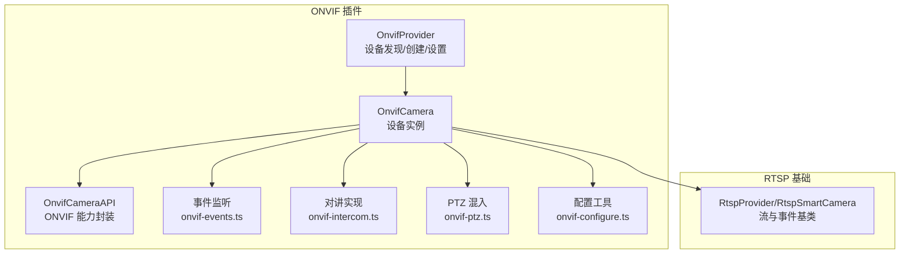
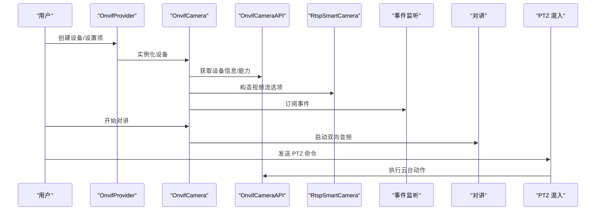
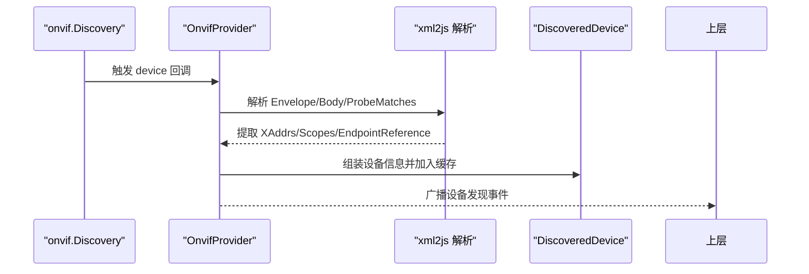
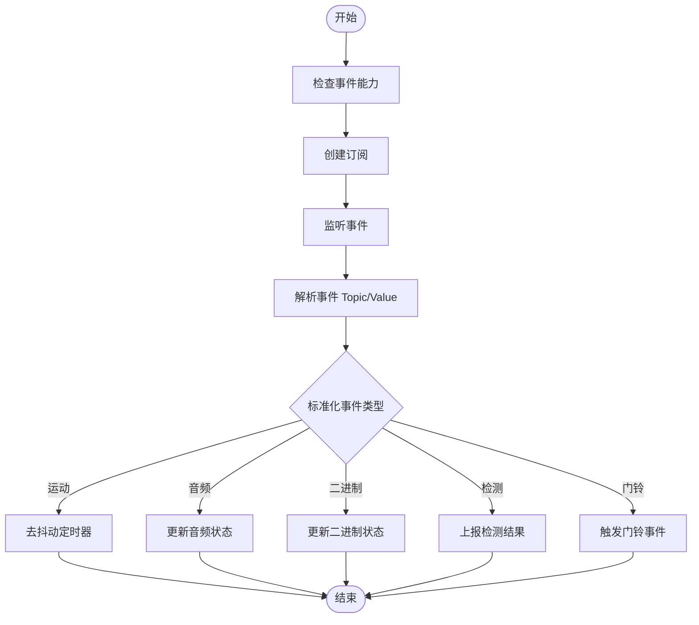
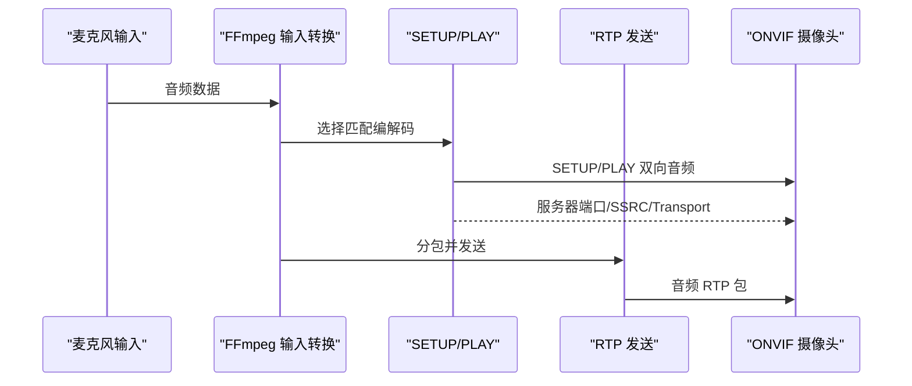
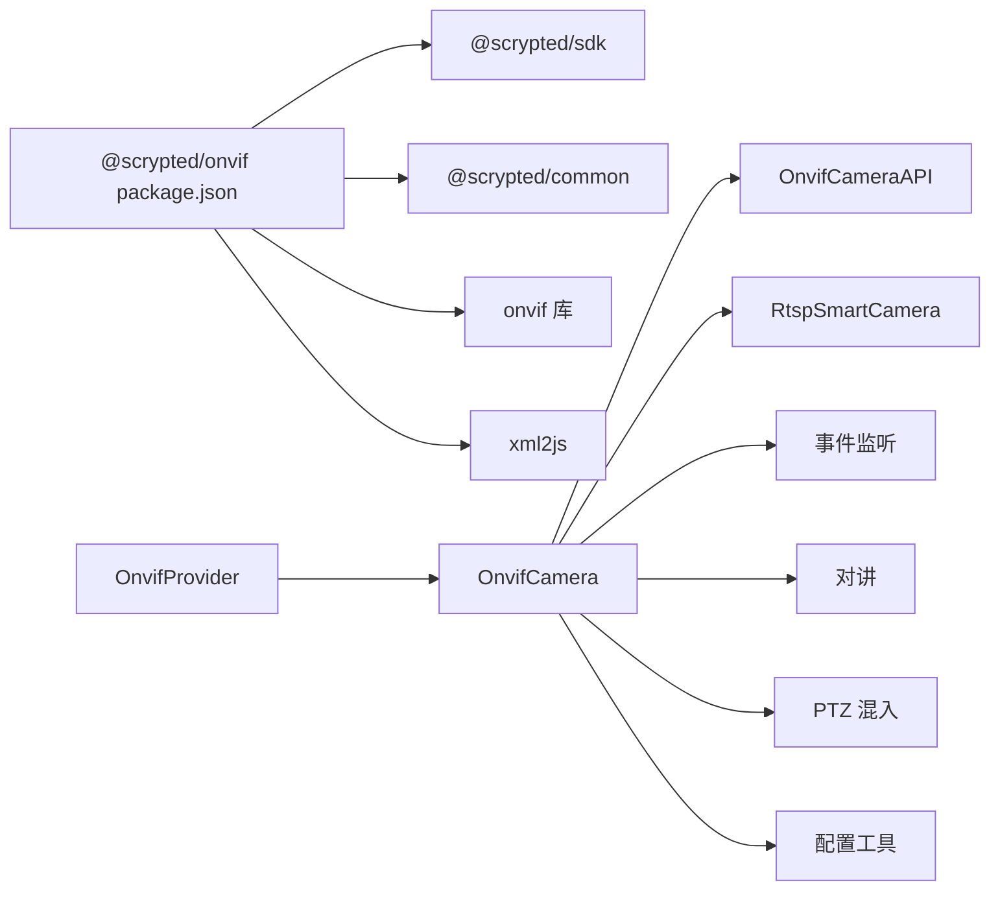

# ONVIF 摄像头集成

<cite>
**本文引用的文件列表**
- [main.ts](file://plugins/onvif/src/main.ts)
- [onvif-api.ts](file://plugins/onvif/src/onvif-api.ts)
- [onvif-events.ts](file://plugins/onvif/src/onvif-events.ts)
- [onvif-intercom.ts](file://plugins/onvif/src/onvif-intercom.ts)
- [onvif-ptz.ts](file://plugins/onvif/src/onvif-ptz.ts)
- [onvif-configure.ts](file://plugins/onvif/src/onvif-configure.ts)
- [rtsp.ts](file://plugins/rtsp/src/rtsp.ts)
- [autoconfigure-codecs.ts](file://common/src/autoconfigure-codecs.ts)
- [package.json](file://plugins/onvif/package.json)
- [README.md](file://plugins/onvif/README.md)
</cite>

## 目录
1. [简介](#简介)
2. [项目结构](#项目结构)
3. [核心组件](#核心组件)
4. [架构总览](#架构总览)
5. [详细组件分析](#详细组件分析)
6. [依赖关系分析](#依赖关系分析)
7. [性能考量](#性能考量)
8. [故障排除指南](#故障排除指南)
9. [结论](#结论)
10. [附录](#附录)

## 简介
本文件面向 Scrypted 的 ONVIF 摄像头集成，系统性阐述 ONVIF 协议在 Scrypted 中的实现方式与使用方法，覆盖设备发现、XML 解析、网络发现流程；摄像头配置（用户名密码、HTTP 端口、RTSP 地址）；核心功能（视频流、JPEG 快照、设备信息、重启）；事件系统（订阅、报警、门铃事件）；双向音频对讲（音频流、编解码、延迟优化）；PTZ 控制（云台运动、预置位、速度）；自动配置（编码器、分辨率、帧率）；以及常见问题排查（认证失败、网络超时、事件订阅失败）等主题。

## 项目结构
ONVIF 插件位于 plugins/onvif，核心由 Provider 和多个子模块组成：
- Provider：负责设备发现、创建、设置项管理、接口扩展
- API 层：封装 onvif 库调用，提供能力查询、事件订阅、快照、OSD、重启等
- 事件层：统一事件分发与去抖动处理
- 对讲层：基于 RTSP/ONVIF 双向音频回传通道
- PTZ 层：云台控制与预置位管理
- 配置层：自动配置与编码参数映射
- 基础层：继承自 RTSP 提供者，复用 RTSP 流与通用能力

图表来源
- [main.ts:334-622](file://plugins/onvif/src/main.ts#L334-L622)
- [rtsp.ts:378-383](file://plugins/rtsp/src/rtsp.ts#L378-L383)

章节来源
- [main.ts:1-622](file://plugins/onvif/src/main.ts#L1-L622)
- [package.json:1-54](file://plugins/onvif/package.json#L1-L54)
- [README.md:1-9](file://plugins/onvif/README.md#L1-L9)

## 核心组件
- OnvifProvider：实现设备发现、创建、设置项、接口扩展（重启、相机、传感器、视频配置、文本叠加）
- OnvifCamera：设备实例，继承自 RtspSmartCamera，提供视频流、快照、设备信息、重启、事件监听、对讲、文本叠加、自动配置入口
- OnvifCameraAPI：封装 onvif 库调用，提供能力查询、事件订阅、快照、OSD、重启、编码配置
- 事件系统：统一事件分发与去抖动，支持运动、音频、二进制状态、检测事件
- 对讲系统：通过 ONVIF 双向音频回传通道，结合 RTP/RTCP 与 FFmpeg 编解码
- PTZ 混入：提供绝对/相对/连续/预置位/主页等控制，并支持预置位缓存与设置
- 配置工具：自动配置编码参数，映射 ONVIF 与 FFmpeg 编解码名称，计算关键帧间隔

章节来源
- [main.ts:16-332](file://plugins/onvif/src/main.ts#L16-L332)
- [onvif-api.ts:53-399](file://plugins/onvif/src/onvif-api.ts#L53-L399)
- [onvif-events.ts:1-96](file://plugins/onvif/src/onvif-events.ts#L1-L96)
- [onvif-intercom.ts:15-195](file://plugins/onvif/src/onvif-intercom.ts#L15-L195)
- [onvif-ptz.ts:6-247](file://plugins/onvif/src/onvif-ptz.ts#L6-L247)
- [onvif-configure.ts:1-216](file://plugins/onvif/src/onvif-configure.ts#L1-L216)

## 架构总览
ONVIF 插件采用“Provider + 设备实例 + API 封装 + 事件/对讲/PTZ/配置”的分层设计。Provider 负责发现与创建，设备实例负责具体能力，API 封装负责与 onvif 库交互，事件/对讲/PTZ/配置分别处理各自领域逻辑，RTSP 基类提供流与事件基础设施。

图表来源
- [main.ts:465-543](file://plugins/onvif/src/main.ts#L465-L543)
- [onvif-api.ts:325-399](file://plugins/onvif/src/onvif-api.ts#L325-L399)
- [onvif-events.ts:5-96](file://plugins/onvif/src/onvif-events.ts#L5-L96)
- [onvif-intercom.ts:45-195](file://plugins/onvif/src/onvif-intercom.ts#L45-L195)
- [onvif-ptz.ts:111-198](file://plugins/onvif/src/onvif-ptz.ts#L111-L198)

## 详细组件分析

### 设备发现与网络发现
- 使用 onvif.Discovery 进行 SSDP 设备探测，解析 ProbeMatches 中的 XAddrs、Scopes、EndpointReference 等字段，提取设备 IP、端口、厂商/型号等信息
- 解析 XML 时去除命名空间前缀，提取已知 Scopes（名称、MAC、硬件），并构造 DiscoveredDevice 列表
- 支持主动扫描（probe），并将发现的设备通过设备发现事件广播给上层

图表来源
- [main.ts:358-437](file://plugins/onvif/src/main.ts#L358-L437)

章节来源
- [main.ts:358-437](file://plugins/onvif/src/main.ts#L358-L437)

### ONVIF 设备配置与认证
- 设置项包括用户名、密码、IP、HTTP 端口、跳过验证、自动配置按钮等
- 创建设备时可进行自动配置，先连接 API 获取设备信息与 PTZ 能力，再根据能力决定是否启用 PTZ 混入
- 支持对讲能力探测：尝试 SETUP/PLAY 双向音频通道，若成功则启用 Intercom 接口

章节来源
- [main.ts:465-543](file://plugins/onvif/src/main.ts#L465-L543)
- [main.ts:545-578](file://plugins/onvif/src/main.ts#L545-L578)
- [main.ts:518-531](file://plugins/onvif/src/main.ts#L518-L531)

### 视频流与 JPEG 快照
- 视频流：通过 OnvifCameraAPI 获取 Profiles，生成 UrlMediaStreamOptions，包含 id、容器、URL、视频/音频元数据
- 快照：优先使用 ONVIF JPEG 快照 URI；若设备不支持，则回退到当前视频流抓拍
- 设备信息：优先从 ONVIF 查询序列号、厂商、固件、型号，否则回退到本地存储

章节来源
- [onvif-configure.ts:178-216](file://plugins/onvif/src/onvif-configure.ts#L178-L216)
- [main.ts:134-159](file://plugins/onvif/src/main.ts#L134-L159)
- [onvif-api.ts:325-364](file://plugins/onvif/src/onvif-api.ts#L325-L364)
- [main.ts:41-65](file://plugins/onvif/src/main.ts#L41-L65)

### 设备信息查询与重启
- 设备信息：getDeviceInformation 返回序列号、厂商、固件版本、型号等
- 重启：调用 systemReboot 完成设备重启

章节来源
- [onvif-api.ts:366-370](file://plugins/onvif/src/onvif-api.ts#L366-L370)
- [onvif-api.ts:81-92](file://plugins/onvif/src/onvif-api.ts#L81-L92)
- [main.ts:29-32](file://plugins/onvif/src/main.ts#L29-L32)

### ONVIF 事件系统
- 能力探测：getCapabilities 检查事件支持（WSPullPointSupport）
- 订阅：createPullPointSubscription 建立订阅
- 事件分发：解析事件 Topic，标准化事件类型（运动开始/停止、音频、二进制、检测、门铃 Ring）
- 去抖动：运动事件采用定时器去抖，避免短脉冲误报
- 门铃事件：支持自定义事件名或内置门铃事件类型

图表来源
- [onvif-api.ts:94-169](file://plugins/onvif/src/onvif-api.ts#L94-L169)
- [onvif-events.ts:5-96](file://plugins/onvif/src/onvif-events.ts#L5-L96)

章节来源
- [onvif-api.ts:248-323](file://plugins/onvif/src/onvif-api.ts#L248-L323)
- [onvif-events.ts:5-96](file://plugins/onvif/src/onvif-events.ts#L5-L96)

### ONVIF 双向音频对讲
- 能力探测：通过 RTSP DESCRIBE 检查 Require: www.onvif.org/ver20/backchannel，确认音频回传通道
- SETUP/PLAY：建立会话，协商 RTP/AVP 或 RTP/AVP/TCP 传输
- 音频转发：FFmpeg 输入转换为匹配的编解码（如 PCMU/PCMA/aac），按 RTP 分包发送，支持 UDP/TCP
- 延迟优化：RTP 分包合并、SSRC 序列号管理、定时发送

图表来源
- [onvif-intercom.ts:45-195](file://plugins/onvif/src/onvif-intercom.ts#L45-L195)

章节来源
- [onvif-intercom.ts:15-195](file://plugins/onvif/src/onvif-intercom.ts#L15-L195)

### ONVIF PTZ 控制
- 能力与设置：支持 Pan/Tilt/Zoom 选择、运动类型（绝对/相对/连续/预置位/主页）、预置位缓存与映射
- 命令执行：根据运动类型调用 onvif 的 absoluteMove/relativeMove/continuousMove/gotoPreset/gotoHomePosition
- 速度控制：支持按轴的速度缩放

章节来源
- [onvif-ptz.ts:6-247](file://plugins/onvif/src/onvif-ptz.ts#L6-L247)

### 自动配置与编码器
- 自动配置策略：遍历所有可用 Profile，按分辨率/帧率/质量选择最优组合，分别配置本地/远程/低分辨率流
- 参数映射：ONVIF 与 FFmpeg 编解码名称互转（h264/h265/aac/PCMU/PCMA 等）
- 关键帧间隔：根据 FPS 与 GOV Length 计算
- 编码参数：分辨率、比特率、帧率、GOP、Profile、码控模式（恒定/可变）

章节来源
- [onvif-configure.ts:63-176](file://plugins/onvif/src/onvif-configure.ts#L63-L176)
- [autoconfigure-codecs.ts:43-200](file://common/src/autoconfigure-codecs.ts#L43-L200)

## 依赖关系分析
- 插件声明：作为 DeviceProvider，支持设备发现、创建、设备创建器
- 外部依赖：onvif（ONVIF 协议库）、xml2js（XML 解析）、@scrypted/common/@scrypted/sdk（框架能力）
- 继承关系：OnvifCamera 继承 RtspSmartCamera，复用 RTSP 流与事件循环
- 混入关系：PTZ 功能通过 MixinProvider 注入

图表来源
- [package.json:26-47](file://plugins/onvif/package.json#L26-L47)
- [main.ts:16-332](file://plugins/onvif/src/main.ts#L16-L332)

章节来源
- [package.json:26-47](file://plugins/onvif/package.json#L26-L47)
- [main.ts:16-332](file://plugins/onvif/src/main.ts#L16-L332)

## 性能考量
- 事件去抖动：运动事件采用定时器去抖，减少短脉冲误报
- 自动配置：按分辨率/帧率/质量选择最优组合，降低带宽占用
- 对讲延迟：RTP 分包合并与定时发送，减少抖动
- 资源回收：事件监听空闲超时自动销毁，避免资源泄漏

章节来源
- [onvif-events.ts:5-96](file://plugins/onvif/src/onvif-events.ts#L5-L96)
- [rtsp.ts:200-226](file://plugins/rtsp/src/rtsp.ts#L200-L226)

## 故障排除指南
- 认证失败
  - 检查用户名/密码是否正确，HTTP 端口是否为设备实际端口
  - 若设备需要跳过验证，可在创建时勾选“跳过验证”
- 网络连接超时
  - 确认 IP 地址与端口可达，防火墙未阻断
  - 使用设备发现功能进行网络扫描
- 事件订阅失败
  - 某些设备可能不显示明确的事件支持标志，仍可尝试订阅
  - 若订阅失败，可手动配置事件类型或关闭自动检测
- 快照不可用
  - 部分设备不支持 JPEG 快照，将回退到视频流抓拍
- 对讲失败
  - 确认设备支持 ONVIF 双向音频回传通道
  - 若 UDP SETUP 失败，插件会自动回退到 TCP 模式
- PTZ 不可用
  - 确认设备具备 PTZ 能力，或在创建后启用 PTZ 混入

章节来源
- [main.ts:501-505](file://plugins/onvif/src/main.ts#L501-L505)
- [onvif-api.ts:248-290](file://plugins/onvif/src/onvif-api.ts#L248-L290)
- [onvif-api.ts:336-364](file://plugins/onvif/src/onvif-api.ts#L336-L364)
- [onvif-intercom.ts:77-96](file://plugins/onvif/src/onvif-intercom.ts#L77-L96)
- [onvif-ptz.ts:90-101](file://plugins/onvif/src/onvif-ptz.ts#L90-L101)

## 结论
ONVIF 插件通过清晰的分层设计，将 ONVIF 协议能力与 Scrypted 的通用能力（流、事件、设置、混入）有机结合，提供了完整的 ONVIF 摄像头接入方案。其自动配置与事件去抖、对讲延迟优化、PTZ 预置位管理等功能，显著提升了用户体验与兼容性。建议在部署时优先使用自动配置，并根据设备能力启用事件与对讲功能。

## 附录
- 设备准备与 ONVIF NVR 注意事项：ONVIF NVR 当前未直接支持，需逐个添加 NVR 下的摄像头通道
- 插件类型与接口：DeviceProvider、DeviceCreator、DeviceDiscovery、Reboot、Camera、AudioSensor、MotionSensor、VideoCameraConfiguration、VideoTextOverlays、PanTiltZoom、Intercom、Settings

章节来源
- [README.md:6-9](file://plugins/onvif/README.md#L6-L9)
- [main.ts:450-459](file://plugins/onvif/src/main.ts#L450-L459)