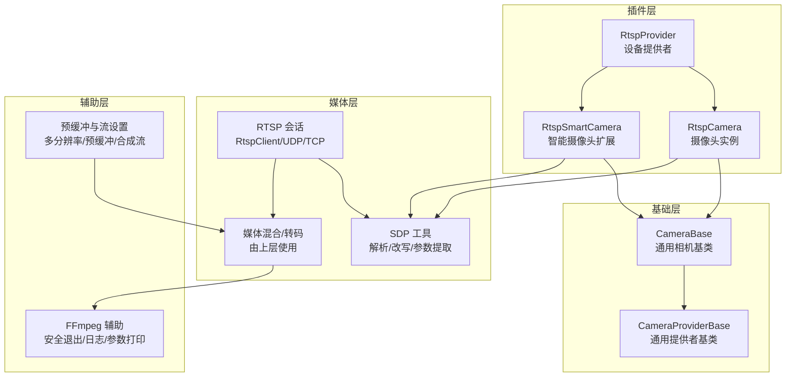
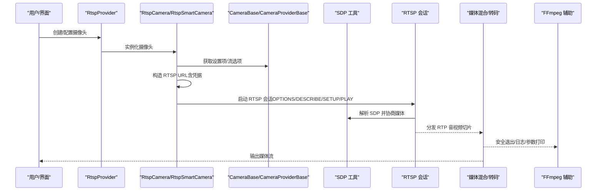
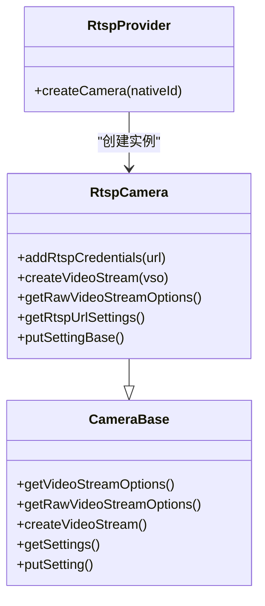
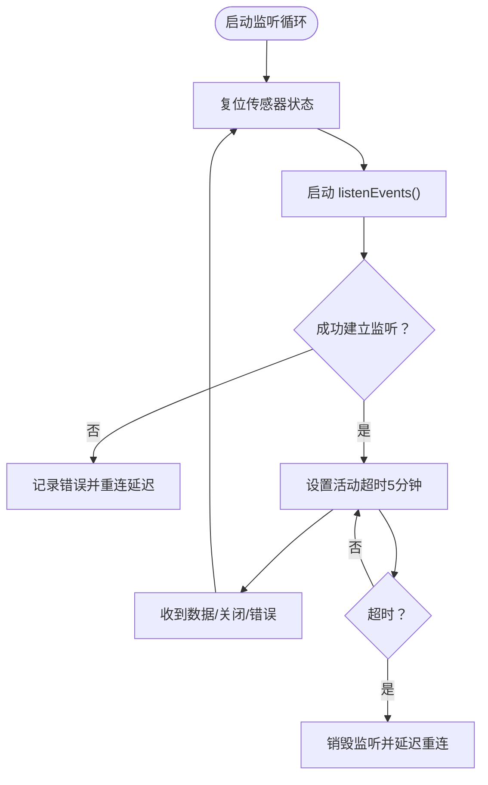
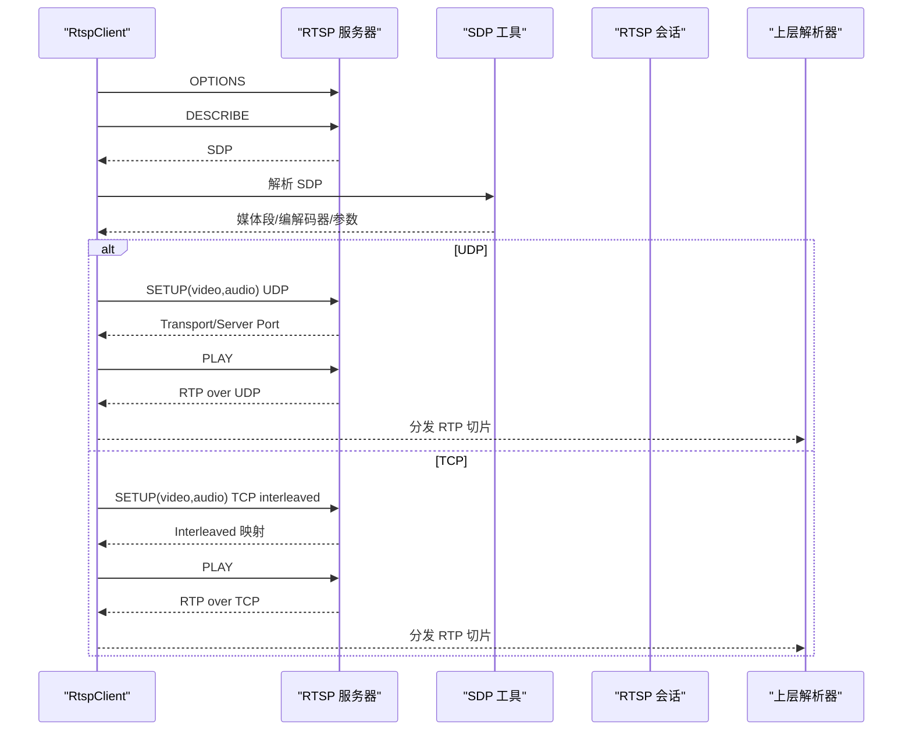
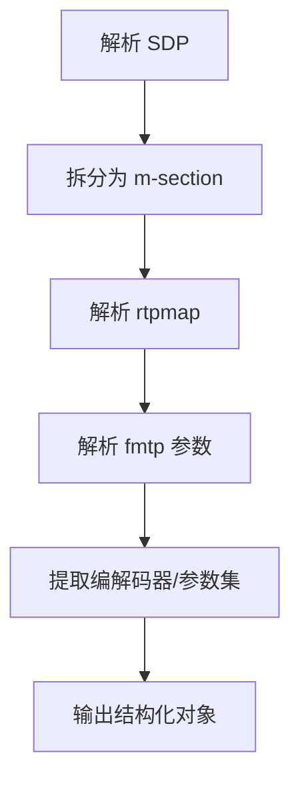
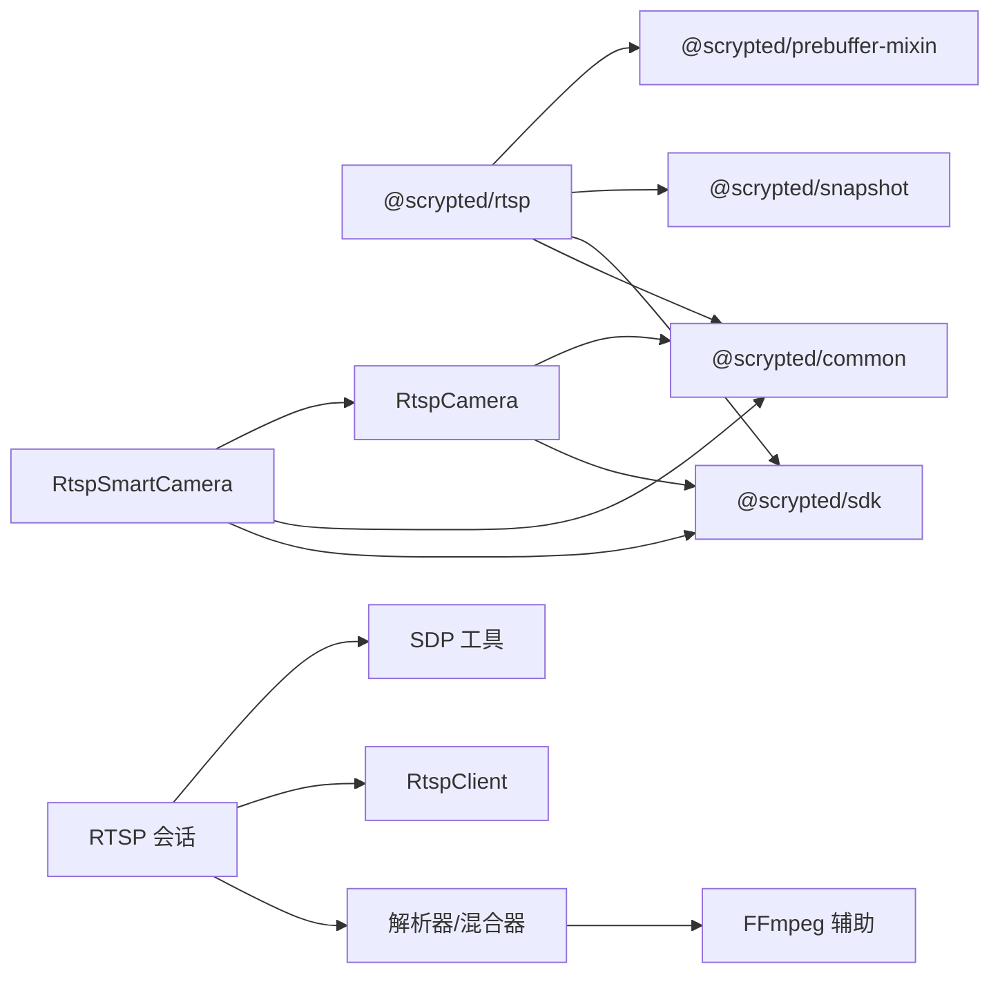

# RTSP 摄像头集成

<cite>
**本文引用的文件**
- [plugins/rtsp/src/main.ts](file://plugins/rtsp/src/main.ts)
- [plugins/rtsp/src/rtsp.ts](file://plugins/rtsp/src/rtsp.ts)
- [plugins/ffmpeg-camera/src/common.ts](file://plugins/ffmpeg-camera/src/common.ts)
- [common/src/sdp-utils.ts](file://common/src/sdp-utils.ts)
- [server/src/media-helpers.ts](file://server/src/media-helpers.ts)
- [plugins/prebuffer-mixin/src/stream-settings.ts](file://plugins/prebuffer-mixin/src/stream-settings.ts)
- [plugins/prebuffer-mixin/src/rtsp-session.ts](file://plugins/prebuffer-mixin/src/rtsp-session.ts)
- [plugins/rtsp/package.json](file://plugins/rtsp/package.json)
</cite>

## 目录
1. [简介](#简介)
2. [项目结构](#项目结构)
3. [核心组件](#核心组件)
4. [架构总览](#架构总览)
5. [详细组件分析](#详细组件分析)
6. [依赖关系分析](#依赖关系分析)
7. [性能考虑](#性能考虑)
8. [故障排除指南](#故障排除指南)
9. [结论](#结论)
10. [附录](#附录)

## 简介
本技术文档面向 Scrypted 的 RTSP 摄像头集成，系统性阐述 RTSP 协议与流媒体传输机制（RTSP 控制信令、RTP 音视频传输、SDP 描述），并结合代码实现说明 RTSP 摄像头的配置方法、核心功能实现、媒体处理能力、连接管理策略以及性能优化与故障排除建议。读者可据此在 Scrypted 中正确接入与优化 RTSP 摄像头。

## 项目结构
RTSP 摄像头集成由以下关键模块组成：
- 插件入口与提供者：定义设备提供者与具体摄像头类，负责设备发现、设置项与流选项暴露。
- 基础相机基类：统一处理用户名/密码、URL 设置、默认流选择等通用逻辑。
- SDP 工具：解析与改写 SDP，提取编解码器、载荷类型、参数集等，支撑媒体协商与转码。
- RTSP 会话与解析：基于 RtspClient 完成 OPTIONS/DESCRIBE/SETUP/PLAY 等控制流程，建立 UDP/TCP RTP 接收通道，并将数据分发给上层解析器。
- 预缓冲与流管理：提供多分辨率/预缓冲流配置、云端/本地区分、合成流等高级能力。
- FFmpeg 辅助：安全退出、日志过滤与参数打印，保障稳定性与可观测性。

图表来源
- [plugins/rtsp/src/rtsp.ts:21-145](file://plugins/rtsp/src/rtsp.ts#L21-L145)
- [plugins/ffmpeg-camera/src/common.ts:10-115](file://plugins/ffmpeg-camera/src/common.ts#L10-L115)
- [common/src/sdp-utils.ts:316-353](file://common/src/sdp-utils.ts#L316-L353)
- [plugins/prebuffer-mixin/src/rtsp-session.ts:17-234](file://plugins/prebuffer-mixin/src/rtsp-session.ts#L17-L234)
- [plugins/prebuffer-mixin/src/stream-settings.ts:43-267](file://plugins/prebuffer-mixin/src/stream-settings.ts#L43-L267)
- [server/src/media-helpers.ts:11-97](file://server/src/media-helpers.ts#L11-L97)

章节来源
- [plugins/rtsp/src/main.ts:1-8](file://plugins/rtsp/src/main.ts#L1-L8)
- [plugins/rtsp/src/rtsp.ts:21-145](file://plugins/rtsp/src/rtsp.ts#L21-L145)
- [plugins/ffmpeg-camera/src/common.ts:10-115](file://plugins/ffmpeg-camera/src/common.ts#L10-L115)
- [common/src/sdp-utils.ts:316-353](file://common/src/sdp-utils.ts#L316-L353)
- [plugins/prebuffer-mixin/src/rtsp-session.ts:17-234](file://plugins/prebuffer-mixin/src/rtsp-session.ts#L17-L234)
- [plugins/prebuffer-mixin/src/stream-settings.ts:43-267](file://plugins/prebuffer-mixin/src/stream-settings.ts#L43-L267)
- [server/src/media-helpers.ts:11-97](file://server/src/media-helpers.ts#L11-L97)

## 核心组件
- 设备提供者与入口
  - 提供者类负责创建摄像头实例、声明设备接口与插件依赖。
  - 入口导出具体提供者子类，标识“RTSP Camera”。

- 摄像头类与智能扩展
  - RtspCamera：负责 RTSP URL 管理、凭据注入、流选项生成与媒体对象创建。
  - RtspSmartCamera：在 RtspCamera 基础上增加事件监听循环、超时与重连、URL/端口覆盖、构造流选项等能力。

- 通用基类
  - CameraBase：统一处理用户名/密码、设置项合并、默认流选择、视频流创建等。
  - CameraProviderBase：设备发现、创建、更新与释放生命周期管理。

- SDP 工具
  - 解析 SDP、提取编解码器、载荷类型、参数集（SPS/PPS/VPS）、媒体方向与控制标识，支撑媒体协商与转码。

- RTSP 会话
  - 使用 RtspClient 完成控制信令交互；根据是否启用 UDP，分别建立 UDP 或 TCP（RTP/TCP）接收通道；将音视频切片分发给上层解析器。

- 预缓冲与流设置
  - 多分辨率流选择、本地/远程/录制场景流偏好、预缓冲开关、合成流（转码）等。

- FFmpeg 辅助
  - 安全终止 FFmpeg 进程、仅输出关键日志、敏感参数脱敏打印，提升稳定性与可观测性。

章节来源
- [plugins/rtsp/src/main.ts:1-8](file://plugins/rtsp/src/main.ts#L1-L8)
- [plugins/rtsp/src/rtsp.ts:21-145](file://plugins/rtsp/src/rtsp.ts#L21-L145)
- [plugins/ffmpeg-camera/src/common.ts:10-115](file://plugins/ffmpeg-camera/src/common.ts#L10-L115)
- [common/src/sdp-utils.ts:316-353](file://common/src/sdp-utils.ts#L316-L353)
- [plugins/prebuffer-mixin/src/rtsp-session.ts:17-234](file://plugins/prebuffer-mixin/src/rtsp-session.ts#L17-L234)
- [plugins/prebuffer-mixin/src/stream-settings.ts:43-267](file://plugins/prebuffer-mixin/src/stream-settings.ts#L43-L267)
- [server/src/media-helpers.ts:11-97](file://server/src/media-helpers.ts#L11-L97)

## 架构总览
下图展示从用户配置到媒体流播放的关键路径：设置项下发 -> 构造 RTSP URL -> 建立 RTSP 会话 -> SDP 解析与媒体协商 -> 音视频 RTP 接收 -> 上层解析与输出。

图表来源
- [plugins/rtsp/src/rtsp.ts:79-85](file://plugins/rtsp/src/rtsp.ts#L79-L85)
- [plugins/prebuffer-mixin/src/rtsp-session.ts:63-190](file://plugins/prebuffer-mixin/src/rtsp-session.ts#L63-L190)
- [common/src/sdp-utils.ts:316-353](file://common/src/sdp-utils.ts#L316-L353)
- [server/src/media-helpers.ts:11-97](file://server/src/media-helpers.ts#L11-L97)

## 详细组件分析

### 组件一：RTSP 摄像头类（RtspCamera）
职责与行为
- 管理多路 RTSP 流 URL（支持单个或多个通道），并将其转换为流选项。
- 注入用户名/密码到 RTSP URL，避免空密码导致的兼容性问题。
- 将流选项封装为媒体对象，供上层消费。

关键点
- URL 构建与凭据注入：解析原始 URL，若存在用户名则强制保留冒号以确保空密码传递正确。
- 多流支持：从存储中读取 URL 数组，过滤空串后映射为流选项。
- 媒体对象创建：将容器、URL 与流选项组合为媒体对象。

图表来源
- [plugins/rtsp/src/rtsp.ts:21-145](file://plugins/rtsp/src/rtsp.ts#L21-L145)
- [plugins/ffmpeg-camera/src/common.ts:10-115](file://plugins/ffmpeg-camera/src/common.ts#L10-L115)

章节来源
- [plugins/rtsp/src/rtsp.ts:21-145](file://plugins/rtsp/src/rtsp.ts#L21-L145)
- [plugins/ffmpeg-camera/src/common.ts:10-115](file://plugins/ffmpeg-camera/src/common.ts#L10-L115)

### 组件二：智能 RTSP 摄像头（RtspSmartCamera）
职责与行为
- 维护传感器状态（运动/音频/遮挡/二进制状态）并在重启监听时复位。
- 启动事件监听循环，具备超时与错误处理，自动重连。
- 支持 IP/HTTP/RTSP 端口覆盖、URL 覆盖、动态构造流选项与设置变更触发重建。
- 提供调试开关，输出事件日志。

关键点
- 监听循环：设置活动超时（默认 5 分钟），在错误/关闭/数据到达时重置计时器；超时后销毁并延迟重连。
- 设置变更：修改设置会向监听器发出错误信号，触发重新连接。
- 动态流选项：首次请求时通过超时包装调用构造函数，避免阻塞；构造完成后缓存结果并在下次设置变更时清除。

图表来源
- [plugins/rtsp/src/rtsp.ts:173-226](file://plugins/rtsp/src/rtsp.ts#L173-L226)

章节来源
- [plugins/rtsp/src/rtsp.ts:153-376](file://plugins/rtsp/src/rtsp.ts#L153-L376)

### 组件三：RTSP 会话与媒体协商（rtsp-session）
职责与行为
- 使用 RtspClient 发送 OPTIONS/DESCRIBE，获取 SDP。
- 解析 SDP，过滤多余媒体段（仅保留首个视频段，按需过滤音频），建立 SETUP（UDP/TCP）通道。
- 在 UDP 模式下发送探测包，确保服务器端口可达；在 TCP 模式下通过 interleaved 字段映射通道。
- 将 RTP 切片封装为统一格式并分发给上层解析器；提供活动计时器与清理逻辑。

关键点
- SDP 过滤：仅保留首个视频段与必要音频段（软静音时可剔除音频）。
- UDP/TCP：根据 useUdp 参数选择传输模式；TCP 下通过 interleaved 映射通道。
- 活动检测：基于 RTSP 请求超时与读循环心跳，防止空闲挂起。

图表来源
- [plugins/prebuffer-mixin/src/rtsp-session.ts:63-190](file://plugins/prebuffer-mixin/src/rtsp-session.ts#L63-L190)
- [common/src/sdp-utils.ts:316-353](file://common/src/sdp-utils.ts#L316-L353)

章节来源
- [plugins/prebuffer-mixin/src/rtsp-session.ts:17-234](file://plugins/prebuffer-mixin/src/rtsp-session.ts#L17-L234)
- [common/src/sdp-utils.ts:316-353](file://common/src/sdp-utils.ts#L316-L353)

### 组件四：SDP 工具（sdp-utils）
职责与行为
- 解析 SDP 为结构化对象，提取头部、媒体段（m-section）、rtpmap/fmtp、方向与控制标识。
- 提取 H.264/H.265 的 SPS/PPS/VPS 参数集，用于编码初始化。
- 改写 SDP 中的媒体端口与控制标识，便于本地回环或转发场景。

关键点
- 编解码器识别：根据 rtpmap 识别 h264/h265/aac/opus 等编解码器及对应编码器名称。
- 参数集提取：从 fmtp 中解析 sprop-parameter-sets/sprop-sps/pps/vps，用于后续转码/拼接。

图表来源
- [common/src/sdp-utils.ts:316-353](file://common/src/sdp-utils.ts#L316-L353)
- [common/src/sdp-utils.ts:355-411](file://common/src/sdp-utils.ts#L355-L411)

章节来源
- [common/src/sdp-utils.ts:316-353](file://common/src/sdp-utils.ts#L316-L353)
- [common/src/sdp-utils.ts:355-411](file://common/src/sdp-utils.ts#L355-L411)

### 组件五：预缓冲与流设置（prebuffer-mixin）
职责与行为
- 提供多场景流选择：本地/远程/低分辨率/录制/远程录制等。
- 支持预缓冲开关、合成流（转码）与隐私模式禁流。
- 自动推断可用流并生成设置项，允许用户选择默认流与启用的预缓冲流。

关键点
- 场景化推荐：根据分辨率目标自动挑选最接近的可用流。
- 合成流：通过转码创建额外分辨率/码率流，满足不同客户端需求。

章节来源
- [plugins/prebuffer-mixin/src/stream-settings.ts:43-267](file://plugins/prebuffer-mixin/src/stream-settings.ts#L43-L267)

### 组件六：FFmpeg 辅助（media-helpers）
职责与行为
- 安全终止 FFmpeg 进程：先尝试优雅退出，再逐步销毁 stdio 并强制 SIGKILL。
- 日志过滤：仅输出关键帧/尺寸信息，避免噪声；支持环境变量或存储项控制。
- 参数脱敏打印：对输入 URL 的敏感信息进行脱敏显示。

章节来源
- [server/src/media-helpers.ts:11-97](file://server/src/media-helpers.ts#L11-L97)

## 依赖关系分析
- 插件依赖
  - RTSP 插件声明依赖预缓冲混入与快照插件，用于增强流管理与抓拍能力。
- 内部依赖
  - RtspCamera 依赖通用相机基类与 URL 媒体流选项；RtspSmartCamera 扩展智能事件监听与动态流选项。
  - RTSP 会话依赖 SDP 工具进行媒体协商；媒体混合层可配合 FFmpeg 辅助完成稳定输出。

图表来源
- [plugins/rtsp/package.json:35-38](file://plugins/rtsp/package.json#L35-L38)
- [plugins/rtsp/src/rtsp.ts:1-6](file://plugins/rtsp/src/rtsp.ts#L1-L6)
- [plugins/prebuffer-mixin/src/rtsp-session.ts:1-9](file://plugins/prebuffer-mixin/src/rtsp-session.ts#L1-L9)

章节来源
- [plugins/rtsp/package.json:35-38](file://plugins/rtsp/package.json#L35-L38)
- [plugins/rtsp/src/rtsp.ts:1-6](file://plugins/rtsp/src/rtsp.ts#L1-L6)
- [plugins/prebuffer-mixin/src/rtsp-session.ts:1-9](file://plugins/prebuffer-mixin/src/rtsp-session.ts#L1-L9)

## 性能考虑
- 缓冲与预缓冲
  - 对于本地高分辨率流与录制场景启用预缓冲，可显著降低首帧延迟；远程场景建议低码率流并谨慎启用预缓冲。
- 网络带宽适配
  - 根据网络状况选择合适分辨率与码率；必要时启用合成流进行转码降级。
- 传输模式
  - UDP 可降低协议开销但可能丢包；TCP 更稳定但有额外开销。根据网络质量选择。
- FFmpeg 稳定性
  - 使用安全退出与日志过滤，避免异常退出与噪声日志影响系统稳定性。
- 参数优化
  - 通过 SDP 工具识别编解码器与参数集，合理配置转码参数，减少 CPU 占用。

## 故障排除指南
- 连接失败
  - 检查 RTSP URL 是否正确，确认用户名/密码格式；确保空密码时保留冒号以避免兼容性问题。
  - 若使用 UDP，确认服务器返回的端口非 0，并验证网络可达性。
- 视频卡顿
  - 切换到 TCP 传输模式；降低分辨率或码率；启用预缓冲；检查网络带宽与丢包情况。
- 音频不同步
  - 若摄像头无音频或不需要音频，可在设置中禁用音频；或在软静音模式下剔除音频段。
- 超时与重连
  - 智能摄像头具备 5 分钟空闲超时与自动重连机制；若频繁断开，检查网络稳定性与服务器端会话超时设置。
- 日志与诊断
  - 开启调试开关输出事件日志；使用 FFmpeg 日志过滤仅关注关键帧/尺寸信息；对输入 URL 参数进行脱敏打印以便排查。

章节来源
- [plugins/rtsp/src/rtsp.ts:48-67](file://plugins/rtsp/src/rtsp.ts#L48-L67)
- [plugins/prebuffer-mixin/src/rtsp-session.ts:74-79](file://plugins/prebuffer-mixin/src/rtsp-session.ts#L74-L79)
- [plugins/prebuffer-mixin/src/rtsp-session.ts:202-208](file://plugins/prebuffer-mixin/src/rtsp-session.ts#L202-L208)
- [server/src/media-helpers.ts:40-71](file://server/src/media-helpers.ts#L40-L71)

## 结论
Scrypted 的 RTSP 摄像头集成通过清晰的层次化设计实现了从 RTSP 控制信令、SDP 解析、RTP 接收与媒体混合的完整链路。配合智能事件监听、预缓冲与多场景流设置，能够在复杂网络环境中提供稳定、可配置且高性能的视频流服务。建议在部署时优先评估网络质量与带宽，合理选择传输模式与分辨率，并利用调试与日志工具快速定位问题。

## 附录
- 插件元信息
  - 名称与类型：RTSP Camera Plugin（设备提供者）
  - 依赖：预缓冲混入、快照插件
  - 接口：系统设备、设备创建、设备提供、设备创建

章节来源
- [plugins/rtsp/package.json:26-39](file://plugins/rtsp/package.json#L26-L39)