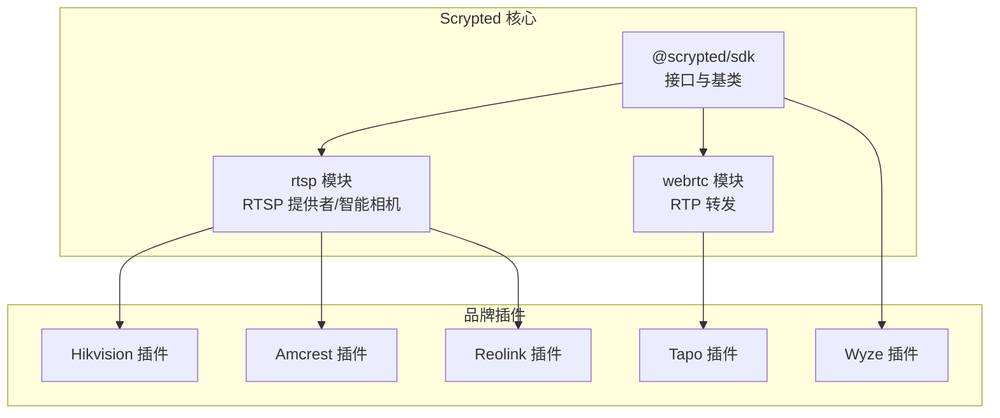
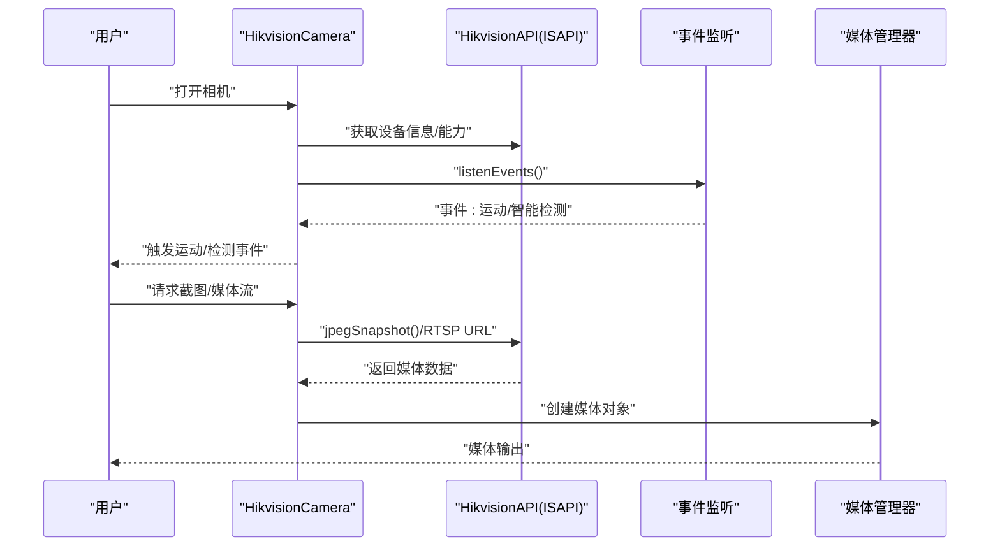
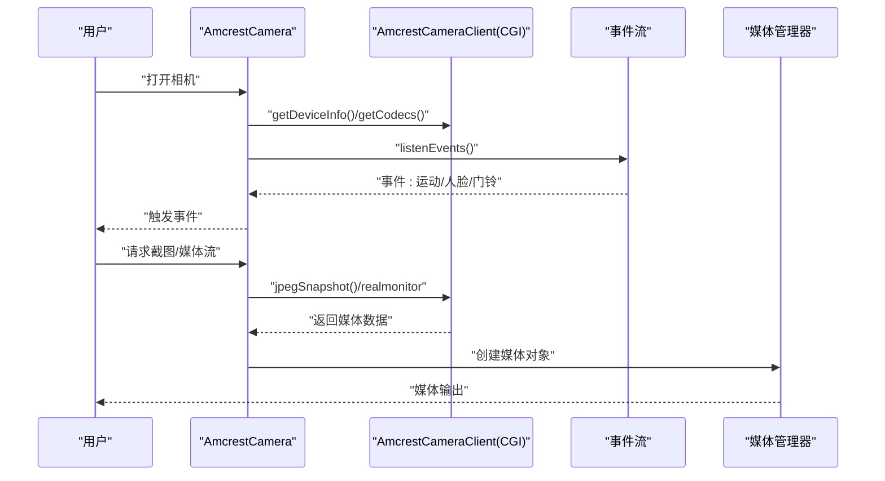
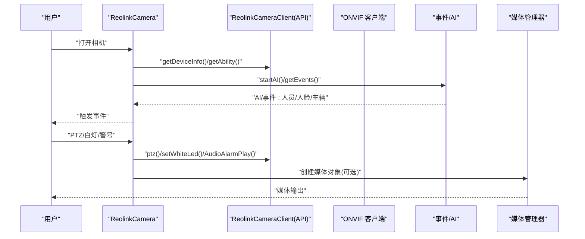
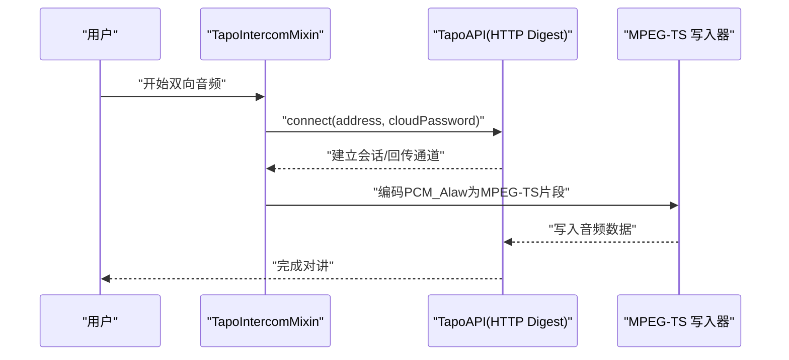
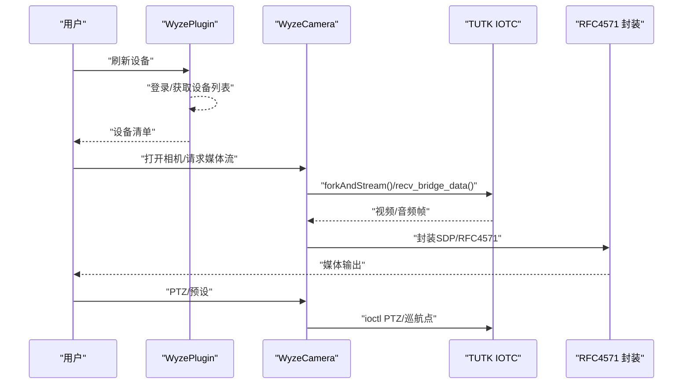
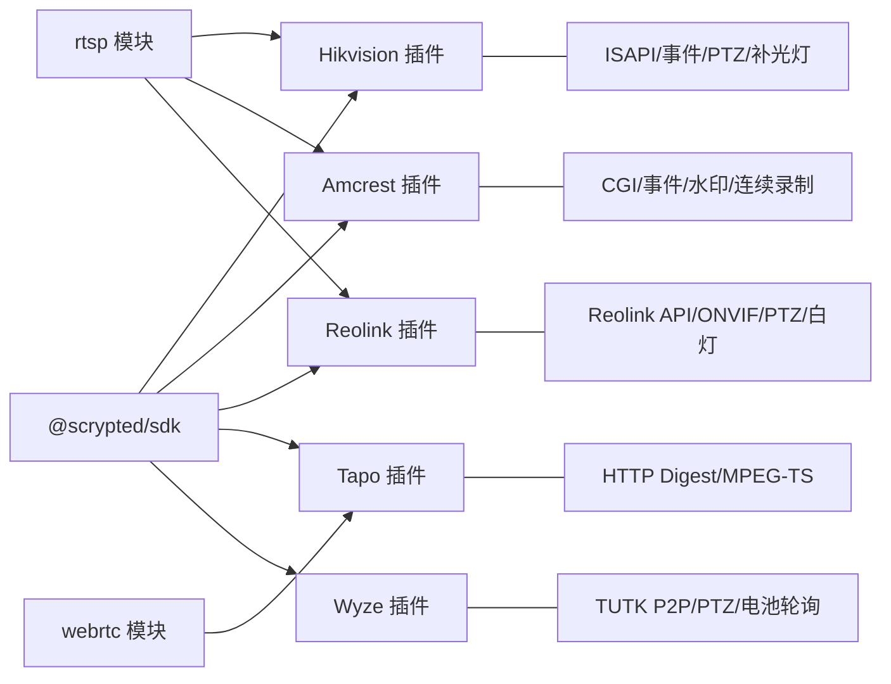

# 品牌专用摄像头集成

<cite>
**本文引用的文件**
- [plugins/hikvision/src/main.ts](file://plugins/hikvision/src/main.ts)
- [plugins/hikvision/src/hikvision-api-channels.ts](file://plugins/hikvision/src/hikvision-api-channels.ts)
- [plugins/amcrest/src/main.ts](file://plugins/amcrest/src/main.ts)
- [plugins/amcrest/src/amcrest-api.ts](file://plugins/amcrest/src/amcrest-api.ts)
- [plugins/reolink/src/main.ts](file://plugins/reolink/src/main.ts)
- [plugins/reolink/src/reolink-api.ts](file://plugins/reolink/src/reolink-api.ts)
- [plugins/tapo/src/main.ts](file://plugins/tapo/src/main.ts)
- [plugins/tapo/src/tapo-api.ts](file://plugins/tapo/src/tapo-api.ts)
- [plugins/wyze/src/main.py](file://plugins/wyze/src/main.py)
</cite>

## 目录
1. [简介](#简介)
2. [项目结构](#项目结构)
3. [核心组件](#核心组件)
4. [架构总览](#架构总览)
5. [详细组件分析](#详细组件分析)
6. [依赖分析](#依赖分析)
7. [性能考虑](#性能考虑)
8. [故障排查指南](#故障排查指南)
9. [结论](#结论)
10. [附录](#附录)

## 简介
本技术文档面向 Scrypted 生态中品牌专用摄像头的集成，系统梳理了海康威视、亚克力（Amcrest）、青立方（Reolink）、泛宇（Tapo）与绿米（Wyze）等品牌的集成方式与实现要点。内容覆盖设备发现、协议适配、认证机制、事件处理、PTZ 控制、补光灯/警号管理、夜视/移动侦测、音频对讲、NVR 多机管理、云服务对接与固件升级等关键主题，并提供配置示例与兼容性建议，帮助用户在不同品牌与型号间做出合理选择。

## 项目结构
Scrypted 通过插件化架构支持多品牌摄像头。每个品牌插件通常包含以下层次：
- 设备类：继承通用相机基类，封装品牌特有的 API、事件监听、能力开关与设备子设备（如报警器、补光灯）。
- API 客户端：封装 HTTP/JSON 或自定义协议调用，负责登录、能力查询、配置下发、事件订阅等。
- 配置与设置：提供高级设置项（如通道号、RTSP 参数、PTZ 能力、两步音频协议选择等）。
- 事件与媒体：统一事件模型（运动、物体检测、门铃等），媒体流（RTSP/ONVIF/WebRTC）。



图示来源
- [plugins/hikvision/src/main.ts:32-80](file://plugins/hikvision/src/main.ts#L32-L80)
- [plugins/amcrest/src/main.ts:25-43](file://plugins/amcrest/src/main.ts#L25-L43)
- [plugins/reolink/src/main.ts:103-120](file://plugins/reolink/src/main.ts#L103-L120)
- [plugins/tapo/src/main.ts:8-16](file://plugins/tapo/src/main.ts#L8-L16)
- [plugins/wyze/src/main.py:194-240](file://plugins/wyze/src/main.py#L194-L240)

章节来源
- [plugins/hikvision/src/main.ts:32-80](file://plugins/hikvision/src/main.ts#L32-L80)
- [plugins/amcrest/src/main.ts:25-43](file://plugins/amcrest/src/main.ts#L25-L43)
- [plugins/reolink/src/main.ts:103-120](file://plugins/reolink/src/main.ts#L103-L120)
- [plugins/tapo/src/main.ts:8-16](file://plugins/tapo/src/main.ts#L8-L16)
- [plugins/wyze/src/main.py:194-240](file://plugins/wyze/src/main.py#L194-L240)

## 核心组件
- 海康威视（Hikvision）
  - 设备类：继承智能相机，支持 ISAPI 协议、事件监听、文本叠加、PTZ、补光灯、报警开关、自动配置等。
  - 关键特性：通道号与 RTSP URL 参数可配置；支持 Hikvision/ONVIF 双向音频；支持智能检测与检测输入回传。
- 亚克力（Amcrest）
  - 设备类：基于 RTSP 智能相机，支持事件流（SSE 风格）、人脸/人体/车辆检测、水印叠加、连续录制、门铃类型切换、锁控等。
  - 关键特性：Amcrest/ONVIF 双向音频；SD 卡连续录制；Dahua 兼容门铃联动。
- 青立方（Reolink）
  - 设备类：支持 Reolink 自研 API 与 ONVIF 双轨事件；PTZ 能力与预置位；白光灯、警号、PIR 传感器；电池设备休眠状态轮询。
  - 关键特性：AI/事件双通道；ONVIF/Reolink 二选一对象检测；多通道 NVR 信息透传。
- 泛宇（Tapo）
  - 设备类：通过 Mixin 提供双向音频，使用 Tapo 自研云口令进行鉴权，基于 HTTP Digest 认证建立双向音频会话。
  - 关键特性：Tapo C 协议；云口令鉴权；MPEG-TS 回传音频。
- 绿米（Wyze）
  - 设备类：纯 Python 实现，基于 TUTK 协议直连摄像头，支持主/子码流、PTZ（巡航点/相对/绝对）、电池与电量轮询。
  - 关键特性：TUTK P2P 直连；RFC4571 封装；PTZ 巡航点与度数映射。

章节来源
- [plugins/hikvision/src/main.ts:32-80](file://plugins/hikvision/src/main.ts#L32-L80)
- [plugins/amcrest/src/main.ts:25-43](file://plugins/amcrest/src/main.ts#L25-L43)
- [plugins/reolink/src/main.ts:103-120](file://plugins/reolink/src/main.ts#L103-L120)
- [plugins/tapo/src/main.ts:8-16](file://plugins/tapo/src/main.ts#L8-L16)
- [plugins/wyze/src/main.py:194-240](file://plugins/wyze/src/main.py#L194-L240)

## 架构总览
下图展示各品牌插件与 Scrypted 核心模块的交互关系，以及典型数据流（事件、媒体、控制）：

```mermaid
graph TB
subgraph "Scrypted 核心"
DM["设备管理器"]
MM["媒体管理器"]
EV["事件注册表"]
end
subgraph "品牌插件"
HK["HikvisionCamera<br/>ISAPI/事件/PTZ/补光灯"]
AC["AmcrestCamera<br/>事件/SSE/水印/连续录制"]
RL["ReolinkCamera<br/>Reolink API/ONVIF/PTZ/白灯"]
TP["TapoIntercomMixin<br/>HTTP Digest/回传音频"]
WZ["WyzeCamera<br/>TUTK P2P/PTZ/电池轮询"]
end
DM <- --> HK
DM <- --> AC
DM <- --> RL
DM <- --> TP
DM <- --> WZ
MM <- --> HK
MM <- --> AC
MM <- --> RL
MM <- --> TP
MM <- --> WZ
EV <- --> HK
EV <- --> AC
EV <- --> RL
EV <- --> WZ
```

图示来源
- [plugins/hikvision/src/main.ts:125-265](file://plugins/hikvision/src/main.ts#L125-L265)
- [plugins/amcrest/src/main.ts:211-315](file://plugins/amcrest/src/main.ts#L211-L315)
- [plugins/reolink/src/main.ts:593-746](file://plugins/reolink/src/main.ts#L593-L746)
- [plugins/tapo/src/main.ts:18-74](file://plugins/tapo/src/main.ts#L18-L74)
- [plugins/wyze/src/main.py:800-823](file://plugins/wyze/src/main.py#L800-L823)

## 详细组件分析

### 海康威视（Hikvision）集成
- 设备发现与初始化
  - 通过 HTTP 获取设备信息（型号、序列号、固件版本），构造管理 URL。
  - 支持“旧款 NVR”与新式设备的通道探测差异。
- API 与事件
  - 使用 ISAPI 协议监听事件，过滤通道号，支持运动、区域入侵、人流统计等事件。
  - 支持智能检测（人脸、人体、车辆等）并回传检测输入图片。
- 媒体与编码
  - 支持 RTSP URL 参数覆盖与通道号配置；自动探测通道并生成媒体流选项。
  - 支持自动配置编码参数（分辨率、帧率、码率、GOP、码控）。
- 控制与扩展
  - 文本叠加（通道名、时间）；PTZ 控制与预置位；补光灯与报警开关作为子设备。
  - 双向音频：优先 ONVIF，其次 Hikvision；G.711 编解码映射。
- 配置项（节选）
  - 通道号、RTSP URL 参数覆盖、门铃类型、双向音频协议、PTZ 能力与预置位、自动配置按钮。



图示来源
- [plugins/hikvision/src/main.ts:125-265](file://plugins/hikvision/src/main.ts#L125-L265)
- [plugins/hikvision/src/hikvision-api-channels.ts:14-51](file://plugins/hikvision/src/hikvision-api-channels.ts#L14-L51)

章节来源
- [plugins/hikvision/src/main.ts:32-80](file://plugins/hikvision/src/main.ts#L32-L80)
- [plugins/hikvision/src/main.ts:98-118](file://plugins/hikvision/src/main.ts#L98-L118)
- [plugins/hikvision/src/main.ts:125-265](file://plugins/hikvision/src/main.ts#L125-L265)
- [plugins/hikvision/src/main.ts:284-292](file://plugins/hikvision/src/main.ts#L284-L292)
- [plugins/hikvision/src/main.ts:353-415](file://plugins/hikvision/src/main.ts#L353-L415)
- [plugins/hikvision/src/main.ts:502-528](file://plugins/hikvision/src/main.ts#L502-L528)
- [plugins/hikvision/src/hikvision-api-channels.ts:14-51](file://plugins/hikvision/src/hikvision-api-channels.ts#L14-L51)

### 亚克力（Amcrest）集成
- 设备发现与初始化
  - 通过 CGI 接口获取厂商、序列号、设备类型、软件版本等信息。
  - 支持门铃类型（Amcrest/Dahua），并可启用 ONVIF 锁控。
- API 与事件
  - 事件监听采用分界线（boundary）解析，支持运动、音频、人脸、交叉线/区域检测、门铃邀请/挂断等。
  - 智能检测（人/车/人脸）事件上送。
- 媒体与编码
  - 通过 Encode 配置获取可用码流；支持连续录制到 SD 卡。
- 控制与扩展
  - 水印叠加（视频水印）；双向音频（Amcrest/ONVIF）；门铃脉冲处理；Dahua 多按钮 Caller ID。
- 配置项（节选）
  - 通道号覆盖、门铃类型、双向音频协议、连续录制开关、自动配置按钮。



图示来源
- [plugins/amcrest/src/main.ts:163-197](file://plugins/amcrest/src/main.ts#L163-L197)
- [plugins/amcrest/src/main.ts:211-315](file://plugins/amcrest/src/main.ts#L211-L315)
- [plugins/amcrest/src/amcrest-api.ts:227-349](file://plugins/amcrest/src/amcrest-api.ts#L227-L349)

章节来源
- [plugins/amcrest/src/main.ts:25-43](file://plugins/amcrest/src/main.ts#L25-L43)
- [plugins/amcrest/src/main.ts:163-197](file://plugins/amcrest/src/main.ts#L163-L197)
- [plugins/amcrest/src/main.ts:211-315](file://plugins/amcrest/src/main.ts#L211-L315)
- [plugins/amcrest/src/main.ts:462-499](file://plugins/amcrest/src/main.ts#L462-L499)
- [plugins/amcrest/src/main.ts:534-571](file://plugins/amcrest/src/main.ts#L534-L571)
- [plugins/amcrest/src/amcrest-api.ts:161-603](file://plugins/amcrest/src/amcrest-api.ts#L161-L603)

### 青立方（Reolink）集成
- 设备发现与初始化
  - 通过 Reolink API 登录并获取设备信息；支持 NVR/无线设备信息透传。
  - 能力查询（Ability）决定是否支持 RTSP/ONVIF/HTTPS/RTMP/白光灯/PIR 等。
- API 与事件
  - AI/事件双通道：AI 状态或事件上报；支持 ONVIF 对象检测（部分机型）。
  - 电池设备轮询休眠/电量状态。
- 媒体与编码
  - 通过 GetEnc 获取编码配置；支持 RTMP/RTSP；ONVIF 流 URL。
- 控制与扩展
  - PTZ 控制（转为具体操作命令）与预置位；白光灯开关/亮度；警号；PIR 开关；ONVIF 两步音频。
- 配置项（节选）
  - 通道号、ONVIF 对象检测开关、PTZ 能力与预置位、RTMP 端口覆盖、睡眠/电量轮询。



图示来源
- [plugins/reolink/src/main.ts:235-247](file://plugins/reolink/src/main.ts#L235-L247)
- [plugins/reolink/src/main.ts:354-370](file://plugins/reolink/src/main.ts#L354-L370)
- [plugins/reolink/src/main.ts:593-746](file://plugins/reolink/src/main.ts#L593-L746)
- [plugins/reolink/src/reolink-api.ts:95-141](file://plugins/reolink/src/reolink-api.ts#L95-L141)
- [plugins/reolink/src/reolink-api.ts:494-526](file://plugins/reolink/src/reolink-api.ts#L494-L526)

章节来源
- [plugins/reolink/src/main.ts:103-120](file://plugins/reolink/src/main.ts#L103-L120)
- [plugins/reolink/src/main.ts:235-247](file://plugins/reolink/src/main.ts#L235-L247)
- [plugins/reolink/src/main.ts:354-370](file://plugins/reolink/src/main.ts#L354-L370)
- [plugins/reolink/src/main.ts:593-746](file://plugins/reolink/src/main.ts#L593-L746)
- [plugins/reolink/src/reolink-api.ts:95-141](file://plugins/reolink/src/reolink-api.ts#L95-L141)
- [plugins/reolink/src/reolink-api.ts:494-526](file://plugins/reolink/src/reolink-api.ts#L494-L526)

### 泛宇（Tapo）集成
- 设备发现与初始化
  - 通过 Mixin 为相机/门铃添加双向音频能力。
- 云口令与认证
  - 使用 HTTP Digest 认证，依据响应头选择 SHA256/MD5；生成 admin 密码后建立 /stream 会话。
- 音频对讲
  - 建立回传通道，将本地音频编码为 PCM_Alaw 并封装为 MPEG-TS 片段发送至设备。
- 配置项（节选）
  - Tapo 云口令（用于双向音频鉴权）。



图示来源
- [plugins/tapo/src/main.ts:18-74](file://plugins/tapo/src/main.ts#L18-L74)
- [plugins/tapo/src/tapo-api.ts:23-67](file://plugins/tapo/src/tapo-api.ts#L23-L67)
- [plugins/tapo/src/tapo-api.ts:103-135](file://plugins/tapo/src/tapo-api.ts#L103-L135)

章节来源
- [plugins/tapo/src/main.ts:8-16](file://plugins/tapo/src/main.ts#L8-L16)
- [plugins/tapo/src/main.ts:18-74](file://plugins/tapo/src/main.ts#L18-L74)
- [plugins/tapo/src/tapo-api.ts:23-67](file://plugins/tapo/src/tapo-api.ts#L23-L67)
- [plugins/tapo/src/tapo-api.ts:103-135](file://plugins/tapo/src/tapo-api.ts#L103-L135)

### 绿米（Wyze）集成
- 设备发现与初始化
  - 通过账户凭据拉取设备清单，按设备能力动态声明接口（PTZ/Battery/门铃等）。
- TUTK P2P 直连
  - 使用 TUTK 协议直连摄像头，支持主/子码流；音频可静音。
- PTZ 控制
  - 支持相对/绝对运动与巡航点；内部将单位转换为设备协议指令。
- 事件与轮询
  - 事件轮询与速率限制处理；PTZ 响应队列与去重。
- 配置项（节选）
  - 主码流比特率；PTZ 预设显示（度数标注）。



图示来源
- [plugins/wyze/src/main.py:1012-1050](file://plugins/wyze/src/main.py#L1012-L1050)
- [plugins/wyze/src/main.py:1062-1073](file://plugins/wyze/src/main.py#L1062-L1073)
- [plugins/wyze/src/main.py:858-908](file://plugins/wyze/src/main.py#L858-L908)
- [plugins/wyze/src/main.py:1206-1439](file://plugins/wyze/src/main.py#L1206-L1439)

章节来源
- [plugins/wyze/src/main.py:1012-1050](file://plugins/wyze/src/main.py#L1012-L1050)
- [plugins/wyze/src/main.py:1062-1073](file://plugins/wyze/src/main.py#L1062-L1073)
- [plugins/wyze/src/main.py:858-908](file://plugins/wyze/src/main.py#L858-L908)
- [plugins/wyze/src/main.py:1206-1439](file://plugins/wyze/src/main.py#L1206-L1439)

## 依赖分析
- 组件耦合
  - 各品牌插件均依赖 @scrypted/sdk 的相机、事件、媒体、设置等接口；RTSP 提供者用于统一媒体流生成。
  - WebRTC 仅 Tapo 使用，用于 RTP 音频转发。
- 外部依赖
  - Hikvision/Amcrest/Reolink：HTTP/JSON API；XML 解析（文本叠加/PTZ）。
  - Tapo：HTTP Digest 认证、MPEG-TS 回传。
  - Wyze：TUTK P2P 协议库与 SDK Key。
- 循环依赖
  - 插件内部未见循环导入；设备类与 API 类职责清晰分离。



图示来源
- [plugins/hikvision/src/main.ts:32-80](file://plugins/hikvision/src/main.ts#L32-L80)
- [plugins/amcrest/src/main.ts:25-43](file://plugins/amcrest/src/main.ts#L25-L43)
- [plugins/reolink/src/main.ts:103-120](file://plugins/reolink/src/main.ts#L103-L120)
- [plugins/tapo/src/main.ts:8-16](file://plugins/tapo/src/main.ts#L8-L16)
- [plugins/wyze/src/main.py:194-240](file://plugins/wyze/src/main.py#L194-L240)

章节来源
- [plugins/hikvision/src/main.ts:32-80](file://plugins/hikvision/src/main.ts#L32-L80)
- [plugins/amcrest/src/main.ts:25-43](file://plugins/amcrest/src/main.ts#L25-L43)
- [plugins/reolink/src/main.ts:103-120](file://plugins/reolink/src/main.ts#L103-L120)
- [plugins/tapo/src/main.ts:8-16](file://plugins/tapo/src/main.ts#L8-L16)
- [plugins/wyze/src/main.py:194-240](file://plugins/wyze/src/main.py#L194-L240)

## 性能考虑
- 媒体流
  - 优先使用 RTSP/ONVIF，避免额外转码开销；必要时启用硬件加速（由底层模块处理）。
  - 合理设置码率/分辨率/FPS，避免过高导致网络拥塞。
- 事件处理
  - 事件过滤与通道匹配，减少无效事件处理；运动检测超时需根据场景调整。
- PTZ
  - Reolink PTZ 操作包含启动与停止两次请求；避免频繁短促操作。
- 云服务
  - Tapo 需要云口令鉴权；Wyze 事件轮询存在速率限制，需退避重试。
- 存储
  - Amcrest 连续录制写入 SD 卡可能造成抖动，建议按需开启。

## 故障排查指南
- 认证失败
  - Tapo：确认云口令与加密算法（SHA256/MD5）匹配；检查 Digest 请求头。
  - Hikvision/Amcrest/Reolink：核对用户名/密码与设备端一致；确认端口可达。
- 事件不触发
  - 检查通道号与事件源是否匹配；确认事件过滤逻辑（如 NVR 场景下的 cameraNumber 匹配）。
- 媒体流异常
  - 调整 RTSP 参数（transportmode 等）；确认摄像头编码与分辨率配置。
- PTZ 不生效
  - Reolink：确认 PTZ 能力与速度范围；使用预置位或相对/绝对指令。
  - Wyze：确保有活动媒体流时再发送 PTZ 指令；检查巡航点有效性。
- 双向音频
  - Hikvision：优先 ONVIF；确认 G.711 编码与采样率。
  - Amcrest/Tapo：确认协议选择与设备支持；检查音频通道可用性。

章节来源
- [plugins/hikvision/src/main.ts:125-168](file://plugins/hikvision/src/main.ts#L125-L168)
- [plugins/amcrest/src/main.ts:211-293](file://plugins/amcrest/src/main.ts#L211-L293)
- [plugins/reolink/src/main.ts:494-526](file://plugins/reolink/src/main.ts#L494-L526)
- [plugins/tapo/src/tapo-api.ts:23-67](file://plugins/tapo/src/tapo-api.ts#L23-L67)
- [plugins/wyze/src/main.py:1206-1439](file://plugins/wyze/src/main.py#L1206-L1439)

## 结论
各品牌摄像头在 Scrypted 中通过统一的设备接口与媒体/事件框架实现了高度一致的用户体验。品牌差异主要体现在协议栈（ISAPI/CGI/Reolink API/ONVIF/TUTK/P2P）、事件模型与控制语义（PTZ/灯光/报警/对讲）。建议在部署前明确设备型号与能力，合理配置通道号、编码参数与事件策略，并结合实际网络环境选择最优媒体路径与音频协议。

## 附录

### 配置示例（通用步骤）
- 海康威视
  - 设置项：通道号、RTSP URL 参数覆盖、门铃类型、双向音频协议、PTZ 能力、自动配置。
  - 连接参数：HTTP 端口默认 80；RTSP 地址基于通道号拼接。
- 亚克力
  - 设置项：通道号覆盖、门铃类型、双向音频协议、连续录制开关、自动配置。
  - 连接参数：HTTP 端口默认 80；事件采用分界线解析。
- 青立方
  - 设置项：通道号、ONVIF 对象检测开关、PTZ 能力、RTMP 端口覆盖、白灯/警号/PIR。
  - 连接参数：HTTP 端口默认 80；支持 Reolink API 与 ONVIF。
- 泛宇
  - 设置项：云口令（双向音频鉴权）、设备地址（含端口）。
  - 连接参数：HTTP Digest 认证；回传音频采用 MPEG-TS。
- 绿米
  - 设置项：邮箱/密码/API Key/Key Id、主码流比特率、PTZ 预设。
  - 连接参数：TUTK P2P 直连；RFC4571 封装媒体。

章节来源
- [plugins/hikvision/src/main.ts:16-22](file://plugins/hikvision/src/main.ts#L16-L22)
- [plugins/hikvision/src/main.ts:315-326](file://plugins/hikvision/src/main.ts#L315-L326)
- [plugins/amcrest/src/main.ts:441-450](file://plugins/amcrest/src/main.ts#L441-L450)
- [plugins/reolink/src/main.ts:752-765](file://plugins/reolink/src/main.ts#L752-L765)
- [plugins/tapo/src/main.ts:9-16](file://plugins/tapo/src/main.ts#L9-L16)
- [plugins/wyze/src/main.py:1155-1190](file://plugins/wyze/src/main.py#L1155-L1190)

### 兼容性与已知问题
- 海康威视
  - 旧款 NVR 默认双通道；部分老设备智能检测能力有限。
- 亚克力
  - AD410 等设备在能力查询时存在索引差异；连续录制写入 SD 卡可能抖动。
- 青立方
  - 部分 WiFi/POE 机型支持 ONVIF 对象检测；电池设备需轮询休眠/电量。
- 泛宇
  - 需要云口令进行双向音频鉴权；Digest 加密算法需与设备协商一致。
- 绿米
  - 部分设备不支持子码流；PTZ 巡航点需先拉取并缓存；事件轮询存在速率限制。

章节来源
- [plugins/hikvision/src/main.ts:364-367](file://plugins/hikvision/src/main.ts#L364-L367)
- [plugins/amcrest/src/amcrest-api.ts:544-553](file://plugins/amcrest/src/amcrest-api.ts#L544-L553)
- [plugins/reolink/src/reolink-api.ts:372-383](file://plugins/reolink/src/reolink-api.ts#L372-L383)
- [plugins/tapo/src/tapo-api.ts:40-48](file://plugins/tapo/src/tapo-api.ts#L40-L48)
- [plugins/wyze/src/main.py:1080-1099](file://plugins/wyze/src/main.py#L1080-L1099)