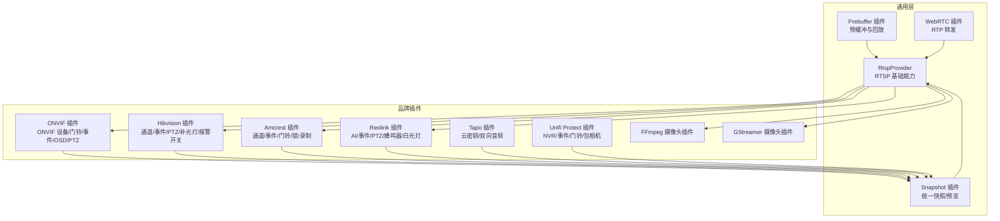
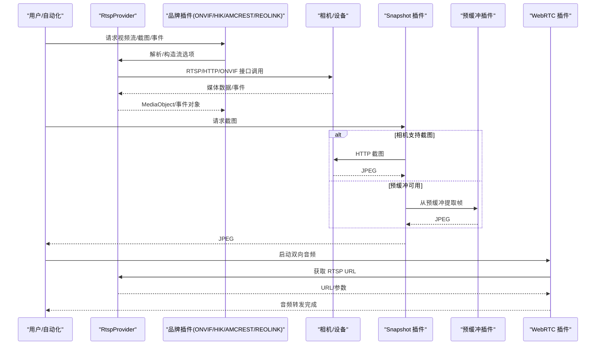
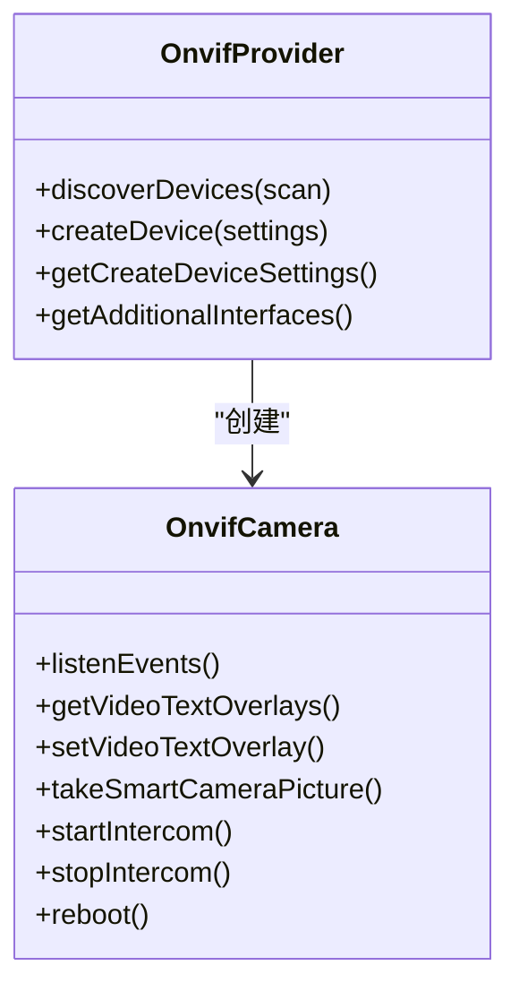
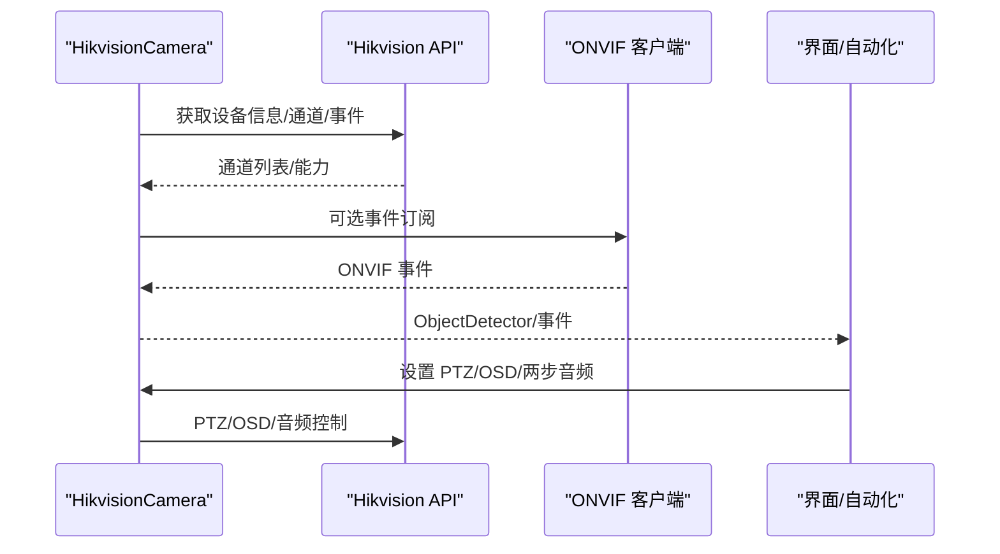
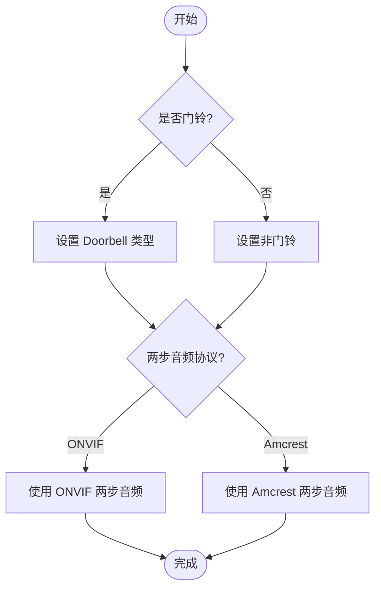
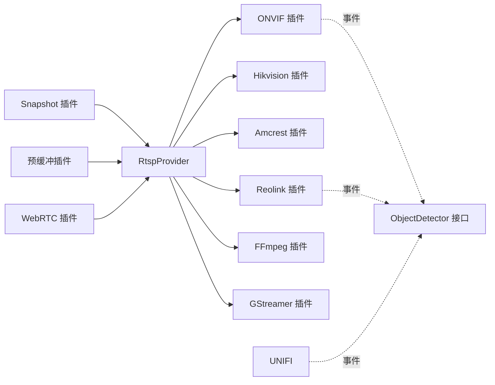

# 摄像头设备集成

<cite>
**本文引用的文件**
- [plugins/onvif/src/main.ts](file://plugins/onvif/src/main.ts)
- [plugins/rtsp/src/main.ts](file://plugins/rtsp/src/main.ts)
- [plugins/rtsp/src/rtsp.ts](file://plugins/rtsp/src/rtsp.ts)
- [plugins/ffmpeg-camera/src/main.ts](file://plugins/ffmpeg-camera/src/main.ts)
- [plugins/gstreamer-camera/src/main.ts](file://plugins/gstreamer-camera/src/main.ts)
- [plugins/hikvision/src/main.ts](file://plugins/hikvision/src/main.ts)
- [plugins/amcrest/src/main.ts](file://plugins/amcrest/src/main.ts)
- [plugins/reolink/src/main.ts](file://plugins/reolink/src/main.ts)
- [plugins/tapo/src/main.ts](file://plugins/tapo/src/main.ts)
- [plugins/unifi-protect/src/main.ts](file://plugins/unifi-protect/src/main.ts)
- [plugins/snapshot/src/main.ts](file://plugins/snapshot/src/main.ts)
- [plugins/prebuffer-mixin/src/main.ts](file://plugins/prebuffer-mixin/src/main.ts)
- [plugins/webrtc/src/rtp-forwarders.ts](file://plugins/webrtc/src/rtp-forwarders.ts)
- [plugins/objectdetector/src/main.ts](file://plugins/objectdetector/src/main.ts)
</cite>

## 目录
1. [简介](#简介)
2. [项目结构](#项目结构)
3. [核心组件](#核心组件)
4. [架构总览](#架构总览)
5. [详细组件分析](#详细组件分析)
6. [依赖关系分析](#依赖关系分析)
7. [性能考虑](#性能考虑)
8. [故障排除指南](#故障排除指南)
9. [结论](#结论)
10. [附录](#附录)

## 简介
本技术文档面向 Scrypted 摄像头设备集成，系统性梳理 ONVIF、RTSP、HTTP 流媒体协议在插件中的实现与配置；覆盖 IP 摄像头的发现、认证、视频流参数、预览能力；详解智能摄像头的移动侦测、人脸识别、夜视模式、PTZ 控制等高级功能；说明媒体处理（编码、分辨率、帧率、音频）能力；给出各插件的配置参数、兼容性与性能优化建议；并提供网络连接、视频流中断、认证失败等常见问题的诊断与解决路径。

## 项目结构
Scrypted 摄像头生态由“通用 RTSP 提供者”和“品牌专用插件”构成。通用层负责 RTSP 基础能力（流选项构造、转码、预览、音频转发），品牌层通过 ONVIF/HTTP API 实现厂商特定功能（事件、PTZ、OSD、两步音频等）。快照与预缓冲插件提供统一的预览与截图能力。

图示来源
- [plugins/rtsp/src/main.ts:1-8](file://plugins/rtsp/src/main.ts#L1-L8)
- [plugins/onvif/src/main.ts:334-622](file://plugins/onvif/src/main.ts#L334-L622)
- [plugins/hikvision/src/main.ts:32-962](file://plugins/hikvision/src/main.ts#L32-L962)
- [plugins/amcrest/src/main.ts:25-826](file://plugins/amcrest/src/main.ts#L25-L826)
- [plugins/reolink/src/main.ts:103-1332](file://plugins/reolink/src/main.ts#L103-L1332)
- [plugins/tapo/src/main.ts:115-141](file://plugins/tapo/src/main.ts#L115-L141)
- [plugins/unifi-protect/src/main.ts:34-966](file://plugins/unifi-protect/src/main.ts#L34-L966)
- [plugins/ffmpeg-camera/src/main.ts:1-155](file://plugins/ffmpeg-camera/src/main.ts#L1-L155)
- [plugins/gstreamer-camera/src/main.ts:1-156](file://plugins/gstreamer-camera/src/main.ts#L1-L156)
- [plugins/snapshot/src/main.ts:55-870](file://plugins/snapshot/src/main.ts#L55-L870)
- [plugins/prebuffer-mixin/src/main.ts](file://plugins/prebuffer-mixin/src/main.ts)
- [plugins/webrtc/src/rtp-forwarders.ts](file://plugins/webrtc/src/rtp-forwarders.ts)

章节来源
- [plugins/rtsp/src/main.ts:1-8](file://plugins/rtsp/src/main.ts#L1-L8)
- [plugins/rtsp/src/rtsp.ts](file://plugins/rtsp/src/rtsp.ts)

## 核心组件
- RtspProvider/RtspSmartCamera：提供 RTSP 视频流选项解析、URL 构造、音频转发、预览与截图、两步音频桥接等通用能力。
- Snapshot 插件：统一从相机接口或预缓冲中生成 JPEG 快照，支持裁剪、缩放、错误占位图。
- 预缓冲插件：在无相机接口时提供预缓冲快照与短时回放。
- WebRTC 插件：将 FFmpeg 输入转换为 RTP 并通过 WebRTC 传输，用于双向音频。
- 品牌专用插件：基于 RtspProvider 扩展 ONVIF/HTTP 能力，实现事件、PTZ、OSD、补光灯、报警开关等。

章节来源
- [plugins/rtsp/src/rtsp.ts](file://plugins/rtsp/src/rtsp.ts)
- [plugins/snapshot/src/main.ts:55-870](file://plugins/snapshot/src/main.ts#L55-L870)
- [plugins/prebuffer-mixin/src/main.ts](file://plugins/prebuffer-mixin/src/main.ts)
- [plugins/webrtc/src/rtp-forwarders.ts](file://plugins/webrtc/src/rtp-forwarders.ts)

## 架构总览
下图展示 ONVIF/RTSP/HTTP 插件如何复用 RtspProvider，并通过 Snapshot/WebRTC/预缓冲提供统一的媒体体验。

图示来源
- [plugins/onvif/src/main.ts:16-332](file://plugins/onvif/src/main.ts#L16-L332)
- [plugins/hikvision/src/main.ts:32-962](file://plugins/hikvision/src/main.ts#L32-L962)
- [plugins/amcrest/src/main.ts:25-826](file://plugins/amcrest/src/main.ts#L25-L826)
- [plugins/reolink/src/main.ts:103-1332](file://plugins/reolink/src/main.ts#L103-L1332)
- [plugins/snapshot/src/main.ts:164-507](file://plugins/snapshot/src/main.ts#L164-L507)
- [plugins/prebuffer-mixin/src/main.ts](file://plugins/prebuffer-mixin/src/main.ts)
- [plugins/webrtc/src/rtp-forwarders.ts](file://plugins/webrtc/src/rtp-forwarders.ts)

## 详细组件分析

### ONVIF 插件
- 协议支持：ONVIF 设备发现、设备信息、事件订阅、OSD 设置、重启、两步音频（ONVIF/RTSP）、门铃事件映射。
- 发现流程：使用 onvif.Discovery 接收 Probe 响应，解析 XAddrs/Scopes，生成设备条目。
- 事件与检测：监听 ONVIF 事件类型，按需启用 ObjectDetector 接口；支持门铃事件名自定义。
- 配置项：用户名/密码/IP/HTTP 端口、自动配置按钮、ONVIF 门铃开关与事件名、是否启用 ONVIF 两步音频。
- 两步音频：优先尝试 ONVIF，否则回退到 RTSP 音频推送。

图示来源
- [plugins/onvif/src/main.ts:16-622](file://plugins/onvif/src/main.ts#L16-L622)

章节来源
- [plugins/onvif/src/main.ts:16-622](file://plugins/onvif/src/main.ts#L16-L622)

### Hikvision 插件
- 协议支持：RTSP/ISAPI，支持多通道、通道号覆盖、URL 参数覆盖、两步音频（Hikvision/ONVIF）。
- 智能功能：运动/区域检测、人脸/车辆/包裹等智能事件；可选 ONVIF 事件源；PTZ 能力与预设。
- 设备扩展：可提供报警开关、补光灯子设备。
- 配置项：通道号、RTSP URL 参数、门铃类型、两步音频协议选择、PTZ 能力/预设、自动配置按钮。

图示来源
- [plugins/hikvision/src/main.ts:32-962](file://plugins/hikvision/src/main.ts#L32-L962)

章节来源
- [plugins/hikvision/src/main.ts:32-962](file://plugins/hikvision/src/main.ts#L32-L962)

### Amcrest 插件
- 协议支持：RTSP/HTTP，支持通道号覆盖、录制回放、两步音频（Amcrest/ONVIF）。
- 智能功能：人/车/人脸检测事件；门铃类型（Amcrest/Dahua）；可选连续录制。
- 锁控：Dahua 门铃可选内置锁。
- 配置项：通道号、门铃类型、两步音频协议、连续录制开关、自动配置按钮。

图示来源
- [plugins/amcrest/src/main.ts:25-826](file://plugins/amcrest/src/main.ts#L25-L826)

章节来源
- [plugins/amcrest/src/main.ts:25-826](file://plugins/amcrest/src/main.ts#L25-L826)

### Reolink 插件
- 协议支持：RTSP/HTTP/ONVIF，支持 AI/事件/PTZ/蜂鸣器/白光灯/PIR 传感器/电池状态。
- 事件源：默认使用 Reolink AI 事件，可切换为 ONVIF 事件；支持 PIR 事件。
- 设备扩展：蜂鸣器、白光灯、PIR 传感器、电池/睡眠状态轮询。
- 配置项：门铃开关、RTMP 端口、事件超时、PTZ 能力/预设、ONVIF 检测开关、两步音频开关。

章节来源
- [plugins/reolink/src/main.ts:103-1332](file://plugins/reolink/src/main.ts#L103-L1332)

### Tapo 插件
- 两步音频：通过 Tapo 云账号密码建立云后向通道，将本地 FFmpeg 音频封装为 MPEG-TS PCM ALaw 推送至设备。
- 配置项：云密码（必需于双向音频）。

章节来源
- [plugins/tapo/src/main.ts:1-141](file://plugins/tapo/src/main.ts#L1-L141)

### Unifi Protect 插件
- 协议支持：NVR WebSocket 事件、HTTP API、RTSP 启用与 IDR 间隔修正。
- 功能：门铃、包相机、指纹识别、LED 状态、PTZ、智能检测事件、设备发现/领养。
- 配置项：IP/用户名/密码；设备发现与重新关联；RTSP 启用与 IDR 修正。

章节来源
- [plugins/unifi-protect/src/main.ts:34-966](file://plugins/unifi-protect/src/main.ts#L34-L966)

### FFmpeg/GStreamer 摄像头插件
- FFmpeg：通过命令行参数直接注入多个输入流，支持禁用音频。
- GStreamer：通过 gst-launch-1.0 生成 TCP mpegts 流，支持单实例限制与多路输入。

章节来源
- [plugins/ffmpeg-camera/src/main.ts:1-155](file://plugins/ffmpeg-camera/src/main.ts#L1-L155)
- [plugins/gstreamer-camera/src/main.ts:1-156](file://plugins/gstreamer-camera/src/main.ts#L1-L156)

### Snapshot 插件
- 统一快照策略：优先相机接口截图；若不可用则从预缓冲提取；可配置 URL 覆盖；支持裁剪/缩放/错误占位图。
- 预览与刷新：带去抖与缓存，支持事件/周期性请求不同超时策略。

章节来源
- [plugins/snapshot/src/main.ts:55-870](file://plugins/snapshot/src/main.ts#L55-L870)

## 依赖关系分析
- ONVIF/HIK/AMCREST/REOLINK 均继承 RtspProvider，共享 RTSP 基础能力。
- Snapshot/预缓冲/WebRTC 作为混入或独立插件，为所有摄像头发起统一的快照与音频能力。
- ONVIF 事件与 Reolink/Unifi Protect 事件分别通过 ONVIF 客户端或 NVR 事件总线接入。

图示来源
- [plugins/rtsp/src/rtsp.ts](file://plugins/rtsp/src/rtsp.ts)
- [plugins/onvif/src/main.ts:16-622](file://plugins/onvif/src/main.ts#L16-L622)
- [plugins/hikvision/src/main.ts:32-962](file://plugins/hikvision/src/main.ts#L32-L962)
- [plugins/amcrest/src/main.ts:25-826](file://plugins/amcrest/src/main.ts#L25-L826)
- [plugins/reolink/src/main.ts:103-1332](file://plugins/reolink/src/main.ts#L103-L1332)
- [plugins/unifi-protect/src/main.ts:34-966](file://plugins/unifi-protect/src/main.ts#L34-L966)
- [plugins/snapshot/src/main.ts:55-870](file://plugins/snapshot/src/main.ts#L55-L870)
- [plugins/prebuffer-mixin/src/main.ts](file://plugins/prebuffer-mixin/src/main.ts)
- [plugins/webrtc/src/rtp-forwarders.ts](file://plugins/webrtc/src/rtp-forwarders.ts)

## 性能考虑
- 优先使用 ONVIF/HTTP 原生事件，减少轮询开销；Reolink 支持 ONVIF 事件时优先启用。
- 合理设置 Snapshot 超时与去抖：事件场景避免等待，周期性场景允许更长等待以获取最新帧。
- 预缓冲快照在无相机接口时显著降低延迟，但会增加 CPU；根据设备能力选择“默认/启用/禁用”策略。
- FFmpeg/GStreamer 参数需匹配设备能力，避免高分辨率/高帧率导致卡顿；必要时在设备端降低码率。
- WebRTC 音频转发采用 RTP 分片推送，注意网络抖动与带宽；对 Tapo 使用云密钥确保稳定后向通道。

## 故障排除指南
- 网络连接问题
  - 确认 IP/端口正确，HTTP 端口默认 80；ONVIF 发现需允许组播/UDP。
  - 若 RTSP 无法播放，检查防火墙/NAT/端口转发；部分设备需开启 RTSP/HTTPS。
- 视频流中断
  - 切换到 ONVIF 事件源（Reolink/ONVIF）；确认设备固件版本与能力。
  - 对 Unifi Protect，检查 WS 连接与重连逻辑，必要时手动重连。
- 认证失败
  - ONVIF/HTTP 登录失败时，先跳过验证（高级设置）进行设备添加，再逐步配置用户名/密码。
  - Tapo 两步音频需要正确的云密码；未配置会报错。
- 快照异常
  - 若相机不支持截图，启用“从预缓冲生成快照”，或配置自定义 Snapshot URL。
  - 事件场景快照失败时，使用缓存旧图并记录告警，避免阻塞自动化。
- 音频问题
  - ONVIF 两步音频通常优于 RTSP；若失败，检查设备是否支持相应协议。
  - WebRTC 音频转发需稳定的本地网络与合适的编码参数。

章节来源
- [plugins/onvif/src/main.ts:465-578](file://plugins/onvif/src/main.ts#L465-L578)
- [plugins/reolink/src/main.ts:593-746](file://plugins/reolink/src/main.ts#L593-L746)
- [plugins/unifi-protect/src/main.ts:286-296](file://plugins/unifi-protect/src/main.ts#L286-L296)
- [plugins/snapshot/src/main.ts:164-507](file://plugins/snapshot/src/main.ts#L164-L507)
- [plugins/tapo/src/main.ts:18-81](file://plugins/tapo/src/main.ts#L18-L81)

## 结论
Scrypted 摄像头体系以 RtspProvider 为核心，结合品牌插件与通用快照/预缓冲/WebRTC 能力，形成覆盖广泛协议与功能的统一框架。通过标准化的流选项、事件与媒体处理接口，用户可在不同品牌设备间获得一致的体验；同时保留厂商特定能力（ONVIF/HTTP API）以满足高级需求。

## 附录

### ONVIF 插件配置参数
- 用户名/密码/IP/HTTP 端口
- 自动配置按钮、ONVIF 自动配置
- ONVIF 门铃开关与事件名
- 是否启用 ONVIF 两步音频
- 显示/隐藏 RTSP/HTTP 端口覆盖

章节来源
- [plugins/onvif/src/main.ts:545-619](file://plugins/onvif/src/main.ts#L545-L619)

### Hikvision 插件配置参数
- 通道号、RTSP URL 参数覆盖
- 门铃类型、两步音频协议选择
- PTZ 能力/预设、自动配置按钮
- 提供设备：报警开关/补光灯

章节来源
- [plugins/hikvision/src/main.ts:530-624](file://plugins/hikvision/src/main.ts#L530-L624)

### Amcrest 插件配置参数
- 通道号、门铃类型
- 两步音频协议选择（ONVIF/Amcrest）
- 连续录制开关、自动配置按钮

章节来源
- [plugins/amcrest/src/main.ts:331-435](file://plugins/amcrest/src/main.ts#L331-L435)

### Reolink 插件配置参数
- 门铃开关、RTMP 端口
- 事件超时、PTZ 能力/预设
- ONVIF 检测开关、两步音频开关
- 蜂鸣器/白光灯/PIR 传感器/电池状态

章节来源
- [plugins/reolink/src/main.ts:115-203](file://plugins/reolink/src/main.ts#L115-L203)

### Tapo 插件配置参数
- 云密码（双向音频必需）

章节来源
- [plugins/tapo/src/main.ts:8-81](file://plugins/tapo/src/main.ts#L8-L81)

### Unifi Protect 插件配置参数
- IP/用户名/密码
- 设备发现/重新关联
- RTSP 启用与 IDR 间隔修正

章节来源
- [plugins/unifi-protect/src/main.ts:792-800](file://plugins/unifi-protect/src/main.ts#L792-L800)

### FFmpeg/GStreamer 插件配置参数
- FFmpeg 输入参数（多路流）
- GStreamer 输入参数、单实例模式
- 禁用音频

章节来源
- [plugins/ffmpeg-camera/src/main.ts:18-142](file://plugins/ffmpeg-camera/src/main.ts#L18-L142)
- [plugins/gstreamer-camera/src/main.ts:24-86](file://plugins/gstreamer-camera/src/main.ts#L24-L86)

### Snapshot 插件配置参数
- 默认快照通道、快照 URL 覆盖
- 从预缓冲生成快照（默认/启用/禁用）
- 快照分辨率（默认/全分辨率/请求分辨率）
- 裁剪与缩放、纵横比
- 隐私模式（禁用快照）

章节来源
- [plugins/snapshot/src/main.ts:56-139](file://plugins/snapshot/src/main.ts#L56-L139)