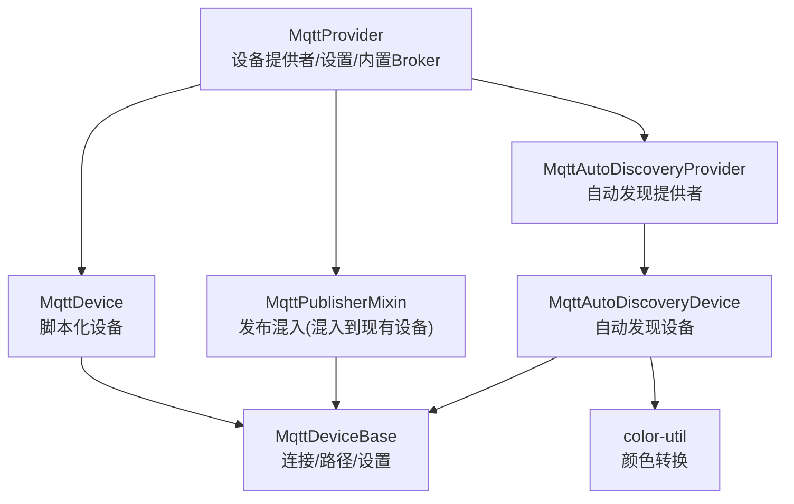
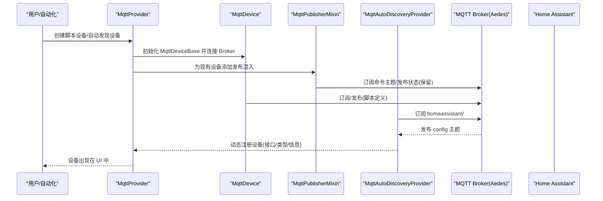
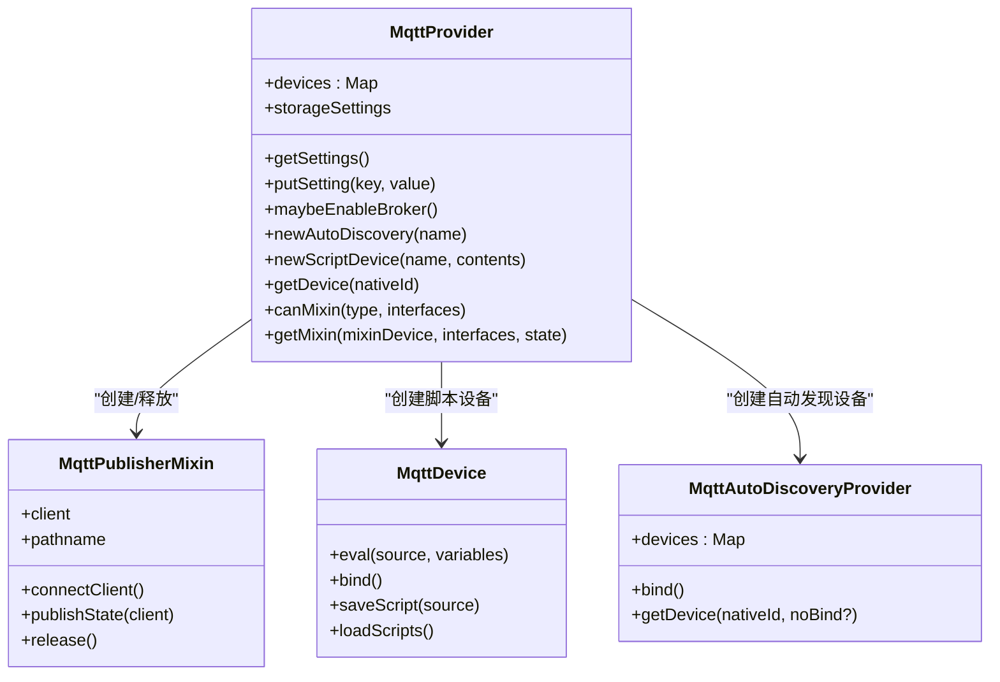
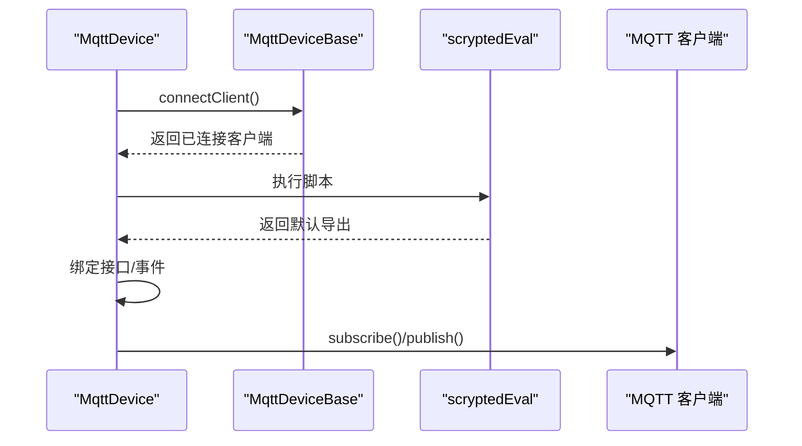
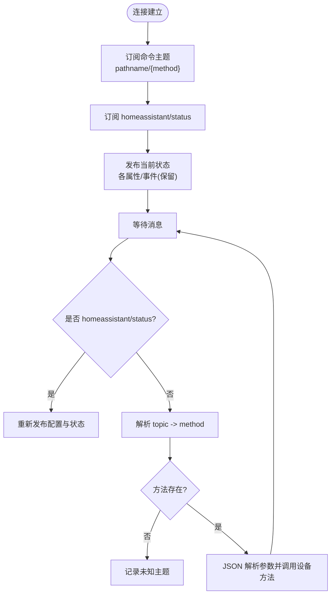
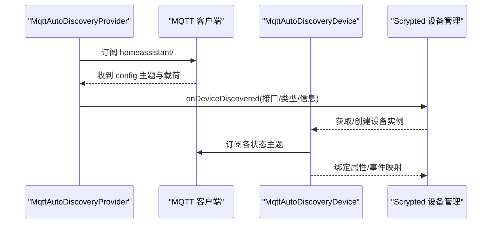
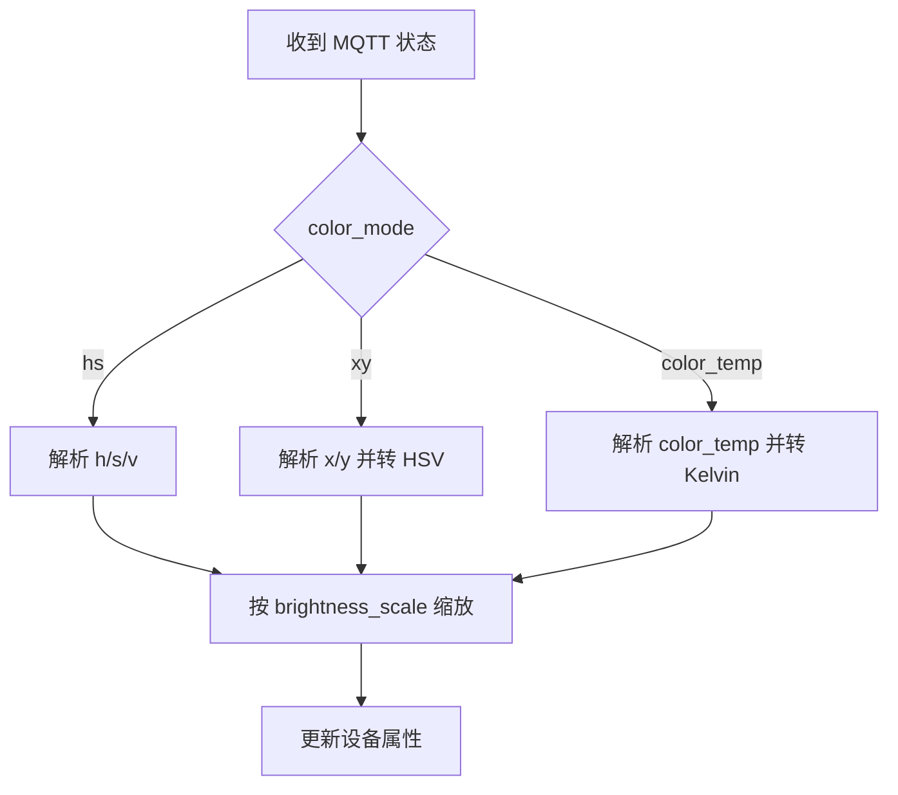
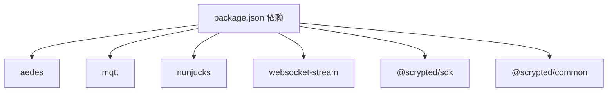

# MQTT 设备

<cite>
**本文引用的文件**
- [plugins/mqtt/src/main.ts](file://plugins/mqtt/src/main.ts)
- [plugins/mqtt/src/autodiscovery.ts](file://plugins/mqtt/src/autodiscovery.ts)
- [plugins/mqtt/src/api/mqtt-client.ts](file://plugins/mqtt/src/api/mqtt-client.ts)
- [plugins/mqtt/src/api/mqtt-device-base.ts](file://plugins/mqtt/src/api/mqtt-device-base.ts)
- [plugins/mqtt/src/publishable-types.ts](file://plugins/mqtt/src/publishable-types.ts)
- [plugins/mqtt/src/color-util.ts](file://plugins/mqtt/src/color-util.ts)
- [plugins/mqtt/src/monaco.ts](file://plugins/mqtt/src/monaco.ts)
- [plugins/mqtt/src/scrypted-eval.ts](file://plugins/mqtt/src/scrypted-eval.ts)
- [plugins/mqtt/package.json](file://plugins/mqtt/package.json)
- [plugins/mqtt/README.md](file://plugins/mqtt/README.md)
- [plugins/mqtt/fs/examples/loopback-light.ts](file://plugins/mqtt/fs/examples/loopback-light.ts)
- [plugins/mqtt/fs/examples/button.ts](file://plugins/mqtt/fs/examples/button.ts)
- [plugins/mqtt/fs/examples/motion-sensor.ts](file://plugins/mqtt/fs/examples/motion-sensor.ts)
- [plugins/mqtt/fs/examples/shelly-dimmer2.ts](file://plugins/mqtt/fs/examples/shelly-dimmer2.ts)
</cite>

## 目录
1. [简介](#简介)
2. [项目结构](#项目结构)
3. [核心组件](#核心组件)
4. [架构总览](#架构总览)
5. [详细组件分析](#详细组件分析)
6. [依赖关系分析](#依赖关系分析)
7. [性能考虑](#性能考虑)
8. [故障排除指南](#故障排除指南)
9. [结论](#结论)
10. [附录](#附录)

## 简介
本文件面向 Scrypted 的 MQTT 设备集成，系统性阐述 MQTT 在智能家居中的应用与实现，涵盖设备发现（含 Home Assistant 自动发现）、消息发布/订阅、脚本化设备控制、状态上报与事件通知、状态缓存与增量更新、保留消息策略、以及配置参数与故障排除。文档以代码为依据，结合图示帮助读者快速理解架构与关键流程。

## 项目结构
- 插件入口与设备提供者：MqttProvider 负责设备发现、脚本设备创建、内置 Aedes MQTT Broker 启停、以及自动发现提供者实例化。
- 自动发现：MqttAutoDiscoveryProvider 与 MqttAutoDiscoveryDevice 实现对 Home Assistant MQTT 自动发现的支持，解析 config 主题，动态组合设备接口与状态订阅。
- 设备基类与脚本执行：MqttDeviceBase 提供 MQTT 客户端连接与路径拼接；MqttDevice 通过脚本引擎运行用户脚本，暴露 subscribe/publish 接口。
- 发布能力判定：publishable-types 用于判断设备是否可作为发布者（非 API/Builtin 等不可发布类型）。
- 颜色转换：color-util 提供 HSV/XY/RGB 与色域映射工具，支撑色温与彩光灯控。
- 示例：examples 目录提供按钮、人体传感器、环回灯、Shelly 等示例脚本，演示订阅与发布模式。

**图表来源**
- [plugins/mqtt/src/main.ts:349-619](file://plugins/mqtt/src/main.ts#L349-L619)
- [plugins/mqtt/src/autodiscovery.ts:76-209](file://plugins/mqtt/src/autodiscovery.ts#L76-L209)
- [plugins/mqtt/src/api/mqtt-device-base.ts:1-103](file://plugins/mqtt/src/api/mqtt-device-base.ts#L1-L103)
- [plugins/mqtt/src/color-util.ts:1-345](file://plugins/mqtt/src/color-util.ts#L1-L345)

**章节来源**
- [plugins/mqtt/README.md:1-9](file://plugins/mqtt/README.md#L1-L9)
- [plugins/mqtt/package.json:1-48](file://plugins/mqtt/package.json#L1-L48)

## 核心组件
- MqttProvider：插件主入口，负责：
  - 内置 Aedes Broker 的启停与监听（TCP/HTTP WebSocket）。
  - 创建脚本设备与自动发现设备。
  - 暴露设置项（启用 Broker、外部 Broker、用户名/密码、端口等）。
- MqttDevice：脚本化设备，基于 MqttDeviceBase，通过脚本引擎运行用户脚本，提供 subscribe/publish 接口，自动拼接 pathname 前缀。
- MqttPublisherMixin：混入到现有设备，将设备状态与事件发布到 MQTT，并订阅命令主题，实现双向交互。
- MqttAutoDiscoveryProvider/MqttAutoDiscoveryDevice：订阅 HA 自动发现 config 主题，解析设备配置，动态创建/合并设备接口，并绑定状态订阅与命令发布。
- MqttDeviceBase：封装 MQTT 连接、URL 解析、pathname 计算、设置持久化。
- publishable-types：判定设备是否可发布（过滤掉 API、Camera、StreamService 等不应发布的接口）。
- color-util：提供 HSV/XY/RGB 转换与色域约束处理，支持色温与彩光灯控。
- 示例脚本：loopback-light、button、motion-sensor、shelly-dimmer2 展示订阅/发布与接口绑定。

**章节来源**
- [plugins/mqtt/src/main.ts:349-619](file://plugins/mqtt/src/main.ts#L349-L619)
- [plugins/mqtt/src/api/mqtt-device-base.ts:1-103](file://plugins/mqtt/src/api/mqtt-device-base.ts#L1-L103)
- [plugins/mqtt/src/autodiscovery.ts:76-209](file://plugins/mqtt/src/autodiscovery.ts#L76-L209)
- [plugins/mqtt/src/publishable-types.ts:1-39](file://plugins/mqtt/src/publishable-types.ts#L1-L39)
- [plugins/mqtt/src/color-util.ts:1-345](file://plugins/mqtt/src/color-util.ts#L1-L345)
- [plugins/mqtt/fs/examples/loopback-light.ts:1-42](file://plugins/mqtt/fs/examples/loopback-light.ts#L1-L42)
- [plugins/mqtt/fs/examples/button.ts:1-15](file://plugins/mqtt/fs/examples/button.ts#L1-L15)
- [plugins/mqtt/fs/examples/motion-sensor.ts:1-16](file://plugins/mqtt/fs/examples/motion-sensor.ts#L1-L16)
- [plugins/mqtt/fs/examples/shelly-dimmer2.ts:1-19](file://plugins/mqtt/fs/examples/shelly-dimmer2.ts#L1-L19)

## 架构总览
下图展示 MQTT 插件的整体交互：Provider 管理 Broker 与设备；Device/PublisherMixin 通过 MQTT 客户端进行订阅/发布；AutoDiscovery 订阅 HA config 主题，动态创建设备并绑定状态。

**图表来源**
- [plugins/mqtt/src/main.ts:349-619](file://plugins/mqtt/src/main.ts#L349-L619)
- [plugins/mqtt/src/autodiscovery.ts:76-209](file://plugins/mqtt/src/autodiscovery.ts#L76-L209)

## 详细组件分析

### 组件一：MqttProvider（设备提供者）
- 角色与职责
  - 管理内置 Aedes Broker 的启停与监听端口。
  - 提供脚本设备与自动发现设备的创建入口。
  - 暴露设置项：启用 Broker、外部 Broker 地址、用户名/密码、TCP/HTTP 端口。
  - 将设备状态事件转化为 MQTT 发布（保留消息），并将命令主题映射到设备方法调用。
- 关键点
  - 连接优先级：设备特定 URL > 外部 Broker（当未启用内置 Broker） > 内置 Broker。
  - pathname 由 URL 路径或设备 id 组成，所有发布/订阅均带前缀。
  - 自动发现：首次连接后向 homeassistant/status 订阅，HA 上线时重新发布配置与当前状态。

**图表来源**
- [plugins/mqtt/src/main.ts:349-619](file://plugins/mqtt/src/main.ts#L349-L619)

**章节来源**
- [plugins/mqtt/src/main.ts:349-619](file://plugins/mqtt/src/main.ts#L349-L619)

### 组件二：MqttDeviceBase 与脚本化设备
- 角色与职责
  - 统一处理 MQTT 连接、URL 解析、pathname 计算与设置持久化。
  - 为脚本设备提供 subscribe/publish 接口，自动拼接 pathname 前缀。
- 关键点
  - connectClient 会移除旧监听器并结束旧连接，确保重连安全。
  - 脚本通过 scryptedEval 执行，支持导出类/函数/实例，最终合并接口并注册到系统。

**图表来源**
- [plugins/mqtt/src/api/mqtt-device-base.ts:53-101](file://plugins/mqtt/src/api/mqtt-device-base.ts#L53-L101)
- [plugins/mqtt/src/scrypted-eval.ts:9-52](file://plugins/mqtt/src/scrypted-eval.ts#L9-L52)
- [plugins/mqtt/src/monaco.ts:1-10](file://plugins/mqtt/src/monaco.ts#L1-L10)

**章节来源**
- [plugins/mqtt/src/api/mqtt-device-base.ts:1-103](file://plugins/mqtt/src/api/mqtt-device-base.ts#L1-L103)
- [plugins/mqtt/src/scrypted-eval.ts:1-53](file://plugins/mqtt/src/scrypted-eval.ts#L1-L53)
- [plugins/mqtt/src/monaco.ts:1-10](file://plugins/mqtt/src/monaco.ts#L1-L10)

### 组件三：MqttPublisherMixin（发布混入）
- 角色与职责
  - 将现有设备的状态与事件发布到 MQTT，使用保留消息上报状态。
  - 订阅命令主题，将消息解析为方法调用参数，触发设备对应方法。
- 关键点
  - pathname 来自设备 id 或 URL 路径，命令主题为 pathname/{method}。
  - 对于属性变更事件，发布 pathname/{property}，保留消息。
  - 首次连接后订阅所有方法主题并发布当前状态。

**图表来源**
- [plugins/mqtt/src/main.ts:160-347](file://plugins/mqtt/src/main.ts#L160-L347)

**章节来源**
- [plugins/mqtt/src/main.ts:160-347](file://plugins/mqtt/src/main.ts#L160-L347)

### 组件四：自动发现（Home Assistant）
- 角色与职责
  - 订阅 homeassistant/#，解析 config 主题，动态创建/合并设备。
  - 根据组件类型映射到 Scrypted 接口（如 OnOff、Brightness、Lock、MotionSensor 等）。
  - 为每个接口生成自动发现配置（retain=true），并订阅命令主题。
- 关键点
  - 支持 availability、brightness/state、color_mode（hs/xy/color_temp）、payload_on/value_template 等字段解析。
  - 使用 Nunjucks 模板渲染 value_template/命令模板。
  - 绑定时建立去抖回调集合，按主题分发消息。

**图表来源**
- [plugins/mqtt/src/autodiscovery.ts:76-209](file://plugins/mqtt/src/autodiscovery.ts#L76-L209)

**章节来源**
- [plugins/mqtt/src/autodiscovery.ts:76-209](file://plugins/mqtt/src/autodiscovery.ts#L76-L209)

### 组件五：颜色与亮度映射
- 角色与职责
  - 将 MQTT 配置中的 color_mode/brightness_scale 等字段映射到 Scrypted 设备属性。
  - 支持 HS/XY 色彩空间与色温（mired->kelvin）转换。
- 关键点
  - brightness 映射：scaleBrightness/unscaleBrightness 处理不同设备的亮度缩放。
  - color_mode 判断：根据 supported_color_modes 选择 hs 或 xy。
  - 色域约束：当 XY 不在色域内时，计算最近可显示点。

**图表来源**
- [plugins/mqtt/src/autodiscovery.ts:297-432](file://plugins/mqtt/src/autodiscovery.ts#L297-L432)
- [plugins/mqtt/src/color-util.ts:1-345](file://plugins/mqtt/src/color-util.ts#L1-L345)

**章节来源**
- [plugins/mqtt/src/autodiscovery.ts:297-432](file://plugins/mqtt/src/autodiscovery.ts#L297-L432)
- [plugins/mqtt/src/color-util.ts:1-345](file://plugins/mqtt/src/color-util.ts#L1-L345)

## 依赖关系分析
- 外部依赖
  - aedes：内置 MQTT Broker（TCP/WebSocket）。
  - mqtt：MQTT 客户端库，用于连接/订阅/发布。
  - nunjucks：模板渲染，用于自动发现与命令模板。
  - websocket-stream：WebSocket 入口支持。
- 内部依赖
  - @scrypted/sdk：设备接口、类型、系统管理。
  - @scrypted/common：脚本执行、Monaco 类型定义。

**图表来源**
- [plugins/mqtt/package.json:33-39](file://plugins/mqtt/package.json#L33-L39)

**章节来源**
- [plugins/mqtt/package.json:1-48](file://plugins/mqtt/package.json#L1-L48)

## 性能考虑
- 连接与重连
  - 连接失败时应避免频繁重试，建议在 Provider/MqttDeviceBase 中增加退避策略与最大重试次数。
  - 连接建立后一次性订阅所有方法主题，减少后续订阅开销。
- 发布策略
  - 状态发布使用保留消息，确保新订阅者立即获得最新状态。
  - 批量发布可通过合并短时间内的状态变化，降低消息风暴。
- 自动发现
  - 首次连接后仅发布一次配置，避免重复发布造成冗余。
  - HA 上线时再发布配置，确保网关重启后同步。
- 订阅与回调
  - 使用去抖回调集合按主题分发，避免重复处理与内存泄漏。
- 模板渲染
  - 自动发现中使用 Nunjucks 渲染模板，建议缓存常用模板以减少 CPU 开销。

[本节为通用指导，不直接分析具体文件]

## 故障排除指南
- 连接断开
  - 现象：客户端反复断开/重连。
  - 排查：检查 Broker 地址、端口、用户名/密码；确认网络可达；查看 Provider 设置项。
  - 参考：Provider 的 maybeEnableBroker 与 connectClient 流程。
- 消息丢失
  - 现象：命令未生效或状态未更新。
  - 排查：确认 pathname 前缀一致；检查订阅的主题是否正确；验证 QoS/保留消息设置。
  - 参考：MqttPublisherMixin 的命令订阅与状态发布。
- 主题冲突
  - 现象：多个设备使用相同主题导致冲突。
  - 排查：确保 pathname 唯一（设备 id 或 URL 路径）；避免手动覆盖系统生成的主题。
  - 参考：connectClient 中 pathname 的计算逻辑。
- 自动发现未生效
  - 现象：HA 未识别设备。
  - 排查：确认 homeassistant/status 是否在线；检查 config 主题内容与接口映射；验证 retain 配置。
  - 参考：MqttAutoDiscoveryProvider 的 bind 与 publishAutoDiscovery。
- 颜色/亮度异常
  - 现象：色温/亮度与预期不符。
  - 排查：检查 brightness_scale 与 color_mode；核对色域范围；确认模板渲染结果。
  - 参考：color-util 与自动发现中的映射逻辑。

**章节来源**
- [plugins/mqtt/src/main.ts:246-339](file://plugins/mqtt/src/main.ts#L246-L339)
- [plugins/mqtt/src/autodiscovery.ts:705-756](file://plugins/mqtt/src/autodiscovery.ts#L705-L756)

## 结论
Scrypted 的 MQTT 插件通过 Provider/Mixin/Device/AutoDiscovery 的协同，实现了从脚本化设备到现有设备的双向 MQTT 交互，支持自动发现、状态保留、颜色与亮度映射等关键能力。合理配置 Broker 与主题前缀、遵循保留消息与模板渲染规范，可显著提升稳定性与可维护性。

[本节为总结，不直接分析具体文件]

## 附录

### 配置参数说明
- Provider 设置
  - 启用 MQTT Broker：布尔值，控制内置 Aedes 启用。
  - 外部 Broker：字符串，指定外部 Broker 地址（当未启用内置 Broker 时生效）。
  - 用户名/密码：字符串，用于 Broker 认证。
  - TCP 端口/HTTP 端口：数字，内置 Broker 的监听端口。
  - Autodiscovery ID：随机生成，用于自动发现节点标识。
- 设备设置（脚本设备/MqttDeviceBase）
  - 订阅 URL：字符串，基础订阅/发布 URL，末尾自动补斜杠。
  - 用户名/密码：字符串，用于 Broker 认证。
- 发布混入（MqttPublisherMixin）
  - 发布 URL：字符串，基础发布 URL；为空则使用内置 Broker。
  - 用户名/密码：字符串，用于 Broker 认证。

**章节来源**
- [plugins/mqtt/src/main.ts:412-480](file://plugins/mqtt/src/main.ts#L412-L480)
- [plugins/mqtt/src/api/mqtt-device-base.ts:15-51](file://plugins/mqtt/src/api/mqtt-device-base.ts#L15-L51)
- [plugins/mqtt/src/main.ts:199-232](file://plugins/mqtt/src/main.ts#L199-L232)

### 示例脚本路径
- 环回灯：演示双向控制与状态回传。
- 按钮：订阅文本主题并映射为二进制状态。
- 人体传感器：订阅文本主题并映射为运动检测。
- Shelly 灯：订阅设备状态主题并发布命令。

**章节来源**
- [plugins/mqtt/fs/examples/loopback-light.ts:1-42](file://plugins/mqtt/fs/examples/loopback-light.ts#L1-L42)
- [plugins/mqtt/fs/examples/button.ts:1-15](file://plugins/mqtt/fs/examples/button.ts#L1-L15)
- [plugins/mqtt/fs/examples/motion-sensor.ts:1-16](file://plugins/mqtt/fs/examples/motion-sensor.ts#L1-L16)
- [plugins/mqtt/fs/examples/shelly-dimmer2.ts:1-19](file://plugins/mqtt/fs/examples/shelly-dimmer2.ts#L1-L19)