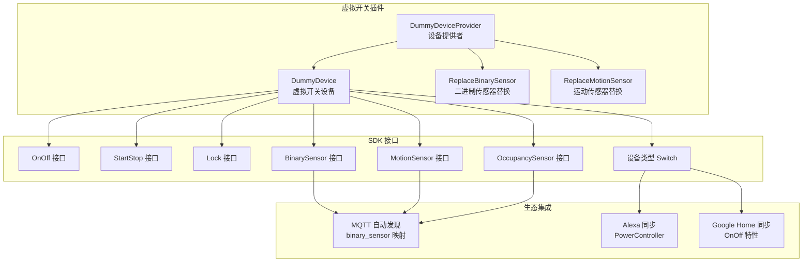
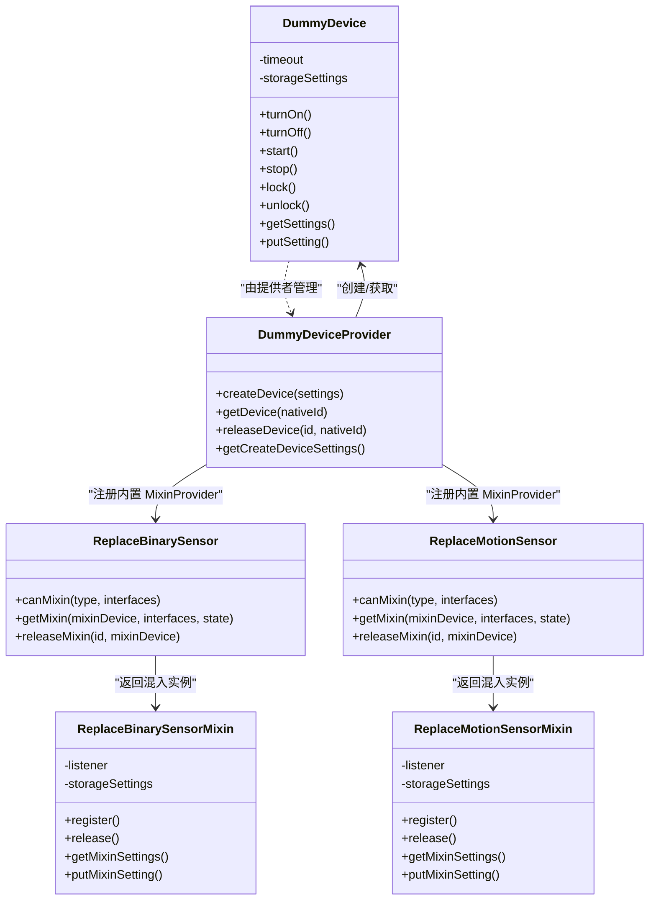
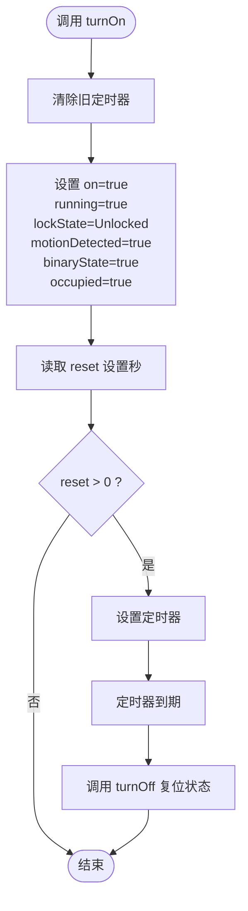
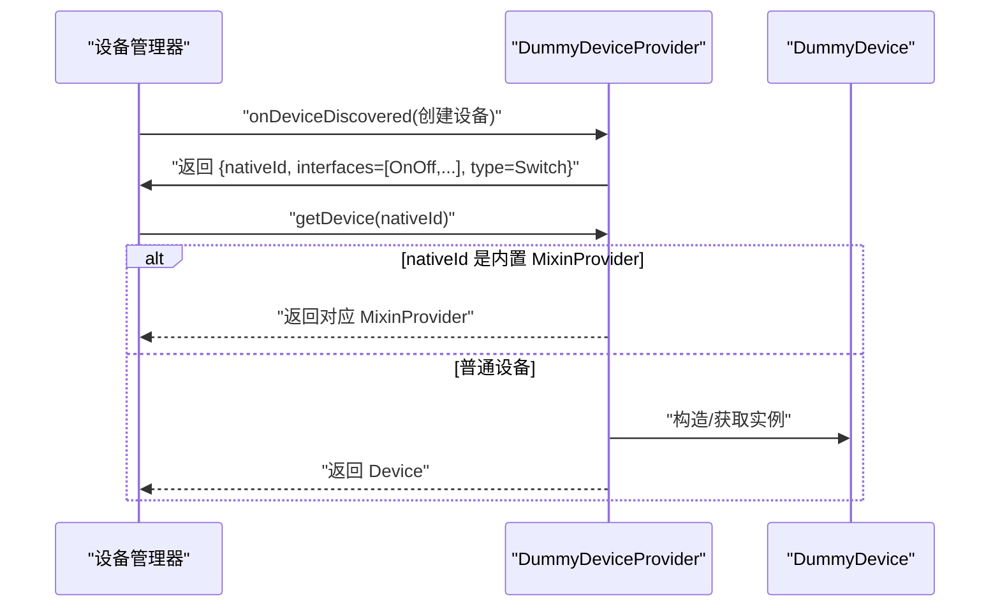
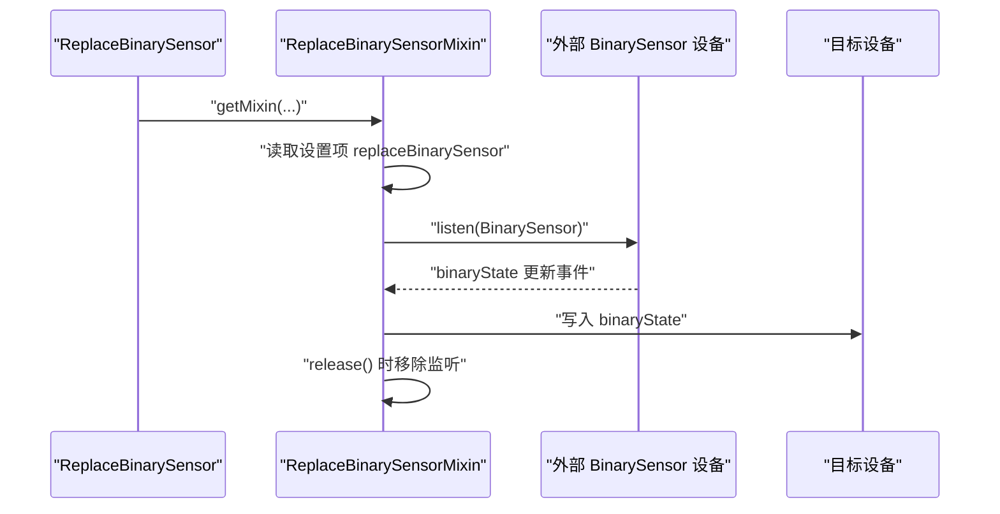
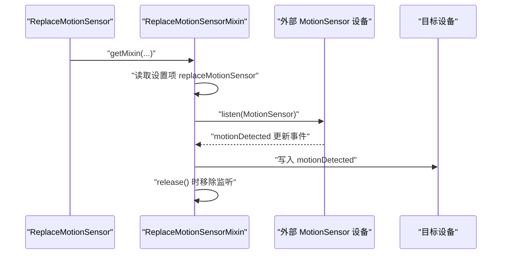
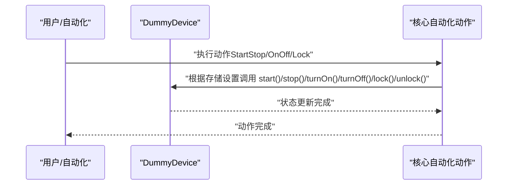
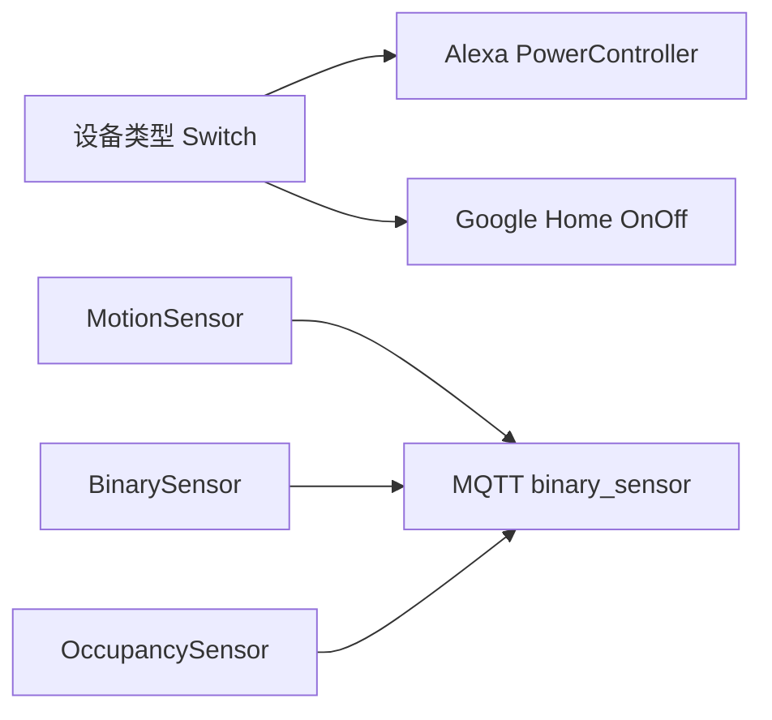
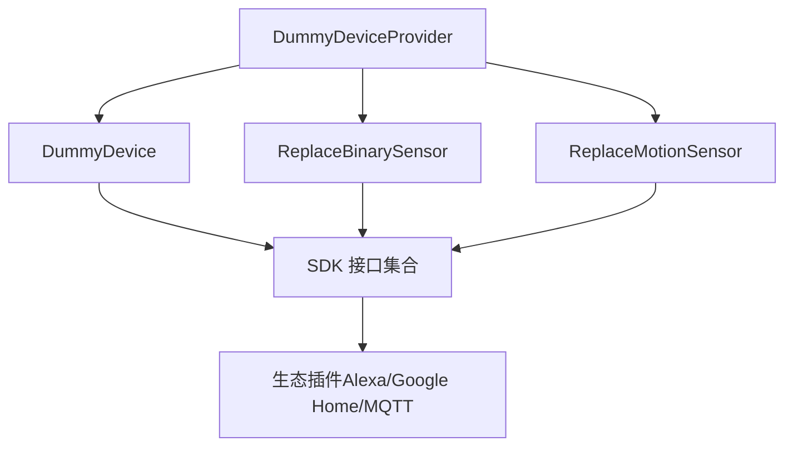

# 开关插座设备

<cite>
**本文引用的文件**
- [plugins/dummy-switch/src/main.ts](file://plugins/dummy-switch/src/main.ts)
- [plugins/dummy-switch/src/replace-binary-sensor.ts](file://plugins/dummy-switch/src/replace-binary-sensor.ts)
- [plugins/dummy-switch/src/replace-motion-sensor.ts](file://plugins/dummy-switch/src/replace-motion-sensor.ts)
- [plugins/dummy-switch/package.json](file://plugins/dummy-switch/package.json)
- [plugins/dummy-switch/README.md](file://plugins/dummy-switch/README.md)
- [sdk/types/src/types.input.ts](file://sdk/types/src/types.input.ts)
- [plugins/mqtt/src/autodiscovery.ts](file://plugins/mqtt/src/autodiscovery.ts)
- [plugins/alexa/src/types/switch.ts](file://plugins/alexa/src/types/switch.ts)
- [plugins/google-home/src/types/switch.ts](file://plugins/google-home/src/types/switch.ts)
- [plugins/core/src/automation-actions.ts](file://plugins/core/src/automation-actions.ts)
- [server/python/plugin_remote.py](file://server/python/plugin_remote.py)
</cite>

## 目录
1. [简介](#简介)
2. [项目结构](#项目结构)
3. [核心组件](#核心组件)
4. [架构总览](#架构总览)
5. [详细组件分析](#详细组件分析)
6. [依赖关系分析](#依赖关系分析)
7. [性能考虑](#性能考虑)
8. [故障排除指南](#故障排除指南)
9. [结论](#结论)
10. [附录](#附录)

## 简介
本文件面向 Scrypted 生态中的“开关插座设备”集成，围绕虚拟开关设备的设备类型定义、状态管理与控制接口实现展开；同时详细说明二进制传感器与运动传感器的“替换”能力，即如何将普通传感器状态映射到开关设备上，从而在 UI 中以“开关”形式呈现与控制。文档还涵盖通用接口（OnOff、StartStop、Lock）的实现要点、配置参数说明、以及常见问题的诊断与解决方法。

## 项目结构
- 虚拟开关插件位于 plugins/dummy-switch，提供可编程的虚拟开关设备，并支持将其他设备的状态（如二进制传感器、运动传感器）“替换”为该开关的属性，实现状态模拟与控制联动。
- SDK 类型定义位于 sdk/types，提供 OnOff、StartStop、Lock、MotionSensor、BinarySensor、OccupancySensor 等接口与设备类型枚举。
- MQTT 自动发现插件将传感器类接口映射为 Home Assistant 的 binary_sensor 组件。
- Alexa/Google Home 插件将 Switch 设备映射为智能音箱可识别的设备类型与特性。
- 核心自动化动作模块对 StartStop、Lock、Brightness 等接口提供统一的动作入口。

**图表来源**
- [plugins/dummy-switch/src/main.ts:9-136](file://plugins/dummy-switch/src/main.ts#L9-L136)
- [plugins/dummy-switch/src/replace-binary-sensor.ts:54-81](file://plugins/dummy-switch/src/replace-binary-sensor.ts#L54-L81)
- [plugins/dummy-switch/src/replace-motion-sensor.ts:54-81](file://plugins/dummy-switch/src/replace-motion-sensor.ts#L54-L81)
- [sdk/types/src/types.input.ts:105-162](file://sdk/types/src/types.input.ts#L105-L162)
- [sdk/types/src/types.input.ts:166-172](file://sdk/types/src/types.input.ts#L166-L172)
- [sdk/types/src/types.input.ts:309-315](file://sdk/types/src/types.input.ts#L309-L315)
- [sdk/types/src/types.input.ts:1496-1520](file://sdk/types/src/types.input.ts#L1496-L1520)
- [plugins/mqtt/src/autodiscovery.ts:634-669](file://plugins/mqtt/src/autodiscovery.ts#L634-L669)
- [plugins/alexa/src/types/switch.ts:5-24](file://plugins/alexa/src/types/switch.ts#L5-L24)
- [plugins/google-home/src/types/switch.ts:4-24](file://plugins/google-home/src/types/switch.ts#L4-L24)

**章节来源**
- [plugins/dummy-switch/src/main.ts:138-231](file://plugins/dummy-switch/src/main.ts#L138-L231)
- [plugins/dummy-switch/src/replace-binary-sensor.ts:54-81](file://plugins/dummy-switch/src/replace-binary-sensor.ts#L54-L81)
- [plugins/dummy-switch/src/replace-motion-sensor.ts:54-81](file://plugins/dummy-switch/src/replace-motion-sensor.ts#L54-L81)
- [plugins/dummy-switch/package.json:25-34](file://plugins/dummy-switch/package.json#L25-L34)

## 核心组件
- 虚拟开关设备（DummyDevice）
  - 实现 OnOff、StartStop、Lock、MotionSensor、BinarySensor、OccupancySensor、Settings 接口，具备完整的状态与控制能力。
  - 支持通过设置项动态暴露传感器与动作接口，设备类型为 Switch。
  - 提供重置定时器，用于在一段时间后自动关闭并复位所有状态。
- 设备提供者（DummyDeviceProvider）
  - 支持创建新设备与按 nativeId 获取设备实例。
  - 注册两个内置 MixinProvider：二进制传感器替换与运动传感器替换。
- 二进制传感器替换（ReplaceBinarySensor）
  - 将任意二进制传感器的状态映射到目标设备的 binaryState 属性。
  - 通过设置项选择被替换的传感器，并监听其状态变化。
- 运动传感器替换（ReplaceMotionSensor）
  - 将任意运动传感器的状态映射到目标设备的 motionDetected 属性。
  - 通过设置项选择被替换的传感器，并监听其状态变化。

**章节来源**
- [plugins/dummy-switch/src/main.ts:9-136](file://plugins/dummy-switch/src/main.ts#L9-L136)
- [plugins/dummy-switch/src/main.ts:138-231](file://plugins/dummy-switch/src/main.ts#L138-L231)
- [plugins/dummy-switch/src/replace-binary-sensor.ts:7-51](file://plugins/dummy-switch/src/replace-binary-sensor.ts#L7-L51)
- [plugins/dummy-switch/src/replace-motion-sensor.ts:7-51](file://plugins/dummy-switch/src/replace-motion-sensor.ts#L7-L51)

## 架构总览
虚拟开关设备通过实现多种 Scrypted 接口，形成统一的控制与状态模型。设备提供者负责设备生命周期与发现，Mixin 提供者负责将外部传感器状态“替换”到当前设备上，从而在 UI 中以开关的形式呈现与控制。

**图表来源**
- [plugins/dummy-switch/src/main.ts:9-136](file://plugins/dummy-switch/src/main.ts#L9-L136)
- [plugins/dummy-switch/src/main.ts:138-231](file://plugins/dummy-switch/src/main.ts#L138-L231)
- [plugins/dummy-switch/src/replace-binary-sensor.ts:54-81](file://plugins/dummy-switch/src/replace-binary-sensor.ts#L54-L81)
- [plugins/dummy-switch/src/replace-motion-sensor.ts:54-81](file://plugins/dummy-switch/src/replace-motion-sensor.ts#L54-L81)

## 详细组件分析

### 虚拟开关设备（DummyDevice）
- 设备类型与接口
  - 设备类型：Switch。
  - 暴露接口：OnOff、StartStop、Lock、MotionSensor、BinarySensor、OccupancySensor、Settings。
- 状态字段
  - on、running、lockState、motionDetected、binaryState、occupied。
- 控制逻辑
  - turnOn：将 on、running、lockState、motionDetected、binaryState、occupied 置为开启/已运行/未锁定/检测到/开启/占用。
  - turnOff：将上述状态全部复位为关闭/停止/锁定/未检测/关闭/未占用。
  - 支持可选的自动重置定时器，按设置秒数后自动关闭。
- 设置项
  - reset：重置传感器状态的秒数（0 表示从不重置），修改时会清除之前的定时器。
  - actionTypes：可选的动作接口集合（OnOff、StartStop、Lock），变更时重新报告接口。
  - sensorTypes：可选的传感器接口集合（MotionSensor、BinarySensor、OccupancySensor），变更时重新报告接口。

**图表来源**
- [plugins/dummy-switch/src/main.ts:111-135](file://plugins/dummy-switch/src/main.ts#L111-L135)

**章节来源**
- [plugins/dummy-switch/src/main.ts:9-136](file://plugins/dummy-switch/src/main.ts#L9-L136)

### 设备提供者（DummyDeviceProvider）
- 创建设备
  - 生成随机 nativeId，声明设备接口集合（OnOff、StartStop、Lock、MotionSensor、BinarySensor、OccupancySensor、Settings），类型为 Switch。
- 获取设备
  - 返回 DummyDevice 实例或内置 MixinProvider（二进制传感器替换、运动传感器替换）。
- 注册内置 MixinProvider
  - 注册两个特殊 nativeId 的 MixinProvider，分别用于“替换二进制传感器”和“替换运动传感器”。

**图表来源**
- [plugins/dummy-switch/src/main.ts:186-207](file://plugins/dummy-switch/src/main.ts#L186-L207)
- [plugins/dummy-switch/src/main.ts:209-223](file://plugins/dummy-switch/src/main.ts#L209-L223)
- [plugins/dummy-switch/src/main.ts:148-173](file://plugins/dummy-switch/src/main.ts#L148-L173)

**章节来源**
- [plugins/dummy-switch/src/main.ts:138-231](file://plugins/dummy-switch/src/main.ts#L138-L231)

### 二进制传感器替换（ReplaceBinarySensor）
- 能力声明
  - 仅对 Camera 或 Doorbell 类型设备生效。
  - 可提供的接口：BinarySensor、Settings、自定义 Mixin 标识。
- 混入实现
  - 通过设置项选择一个外部二进制传感器设备。
  - 监听该设备的 BinarySensor 接口事件，将其 binaryState 同步到当前设备。
  - 释放时移除监听器。

**图表来源**
- [plugins/dummy-switch/src/replace-binary-sensor.ts:54-81](file://plugins/dummy-switch/src/replace-binary-sensor.ts#L54-L81)
- [plugins/dummy-switch/src/replace-binary-sensor.ts:27-50](file://plugins/dummy-switch/src/replace-binary-sensor.ts#L27-L50)

**章节来源**
- [plugins/dummy-switch/src/replace-binary-sensor.ts:7-51](file://plugins/dummy-switch/src/replace-binary-sensor.ts#L7-L51)
- [plugins/dummy-switch/src/replace-binary-sensor.ts:54-81](file://plugins/dummy-switch/src/replace-binary-sensor.ts#L54-L81)

### 运动传感器替换（ReplaceMotionSensor）
- 能力声明
  - 仅对 Camera 或 Doorbell 类型设备生效。
  - 可提供的接口：MotionSensor、Settings、自定义 Mixin 标识。
- 混入实现
  - 通过设置项选择一个外部运动传感器设备。
  - 监听该设备的 MotionSensor 接口事件，将其 motionDetected 同步到当前设备。
  - 释放时移除监听器。

**图表来源**
- [plugins/dummy-switch/src/replace-motion-sensor.ts:54-81](file://plugins/dummy-switch/src/replace-motion-sensor.ts#L54-L81)
- [plugins/dummy-switch/src/replace-motion-sensor.ts:27-50](file://plugins/dummy-switch/src/replace-motion-sensor.ts#L27-L50)

**章节来源**
- [plugins/dummy-switch/src/replace-motion-sensor.ts:7-51](file://plugins/dummy-switch/src/replace-motion-sensor.ts#L7-L51)
- [plugins/dummy-switch/src/replace-motion-sensor.ts:54-81](file://plugins/dummy-switch/src/replace-motion-sensor.ts#L54-L81)

### 通用接口实现（OnOff/StartStop/Lock）
- OnOff
  - 提供 turnOn/turnOff 与 on 状态。
- StartStop
  - 提供 start/stop 与 running 状态。
  - 在自动化动作中可通过布尔值直接触发开始/停止。
- Lock
  - 提供 lock/unlock 与 lockState 状态。
  - 在自动化动作中可通过枚举选择锁定/解锁。

**图表来源**
- [plugins/core/src/automation-actions.ts:33-68](file://plugins/core/src/automation-actions.ts#L33-L68)
- [sdk/types/src/types.input.ts:166-172](file://sdk/types/src/types.input.ts#L166-L172)
- [sdk/types/src/types.input.ts:309-315](file://sdk/types/src/types.input.ts#L309-L315)

**章节来源**
- [plugins/core/src/automation-actions.ts:33-68](file://plugins/core/src/automation-actions.ts#L33-L68)
- [sdk/types/src/types.input.ts:166-172](file://sdk/types/src/types.input.ts#L166-L172)
- [sdk/types/src/types.input.ts:309-315](file://sdk/types/src/types.input.ts#L309-L315)

### 设备类型与生态集成
- 设备类型
  - Switch：用于在生态中作为“开关”设备被识别。
- 生态映射
  - Alexa：将 Switch 映射为 PowerController，支持 powerState 查询与上报。
  - Google Home：将 Switch 映射为 OnOff 特性，支持 on 查询与同步。
  - MQTT 自动发现：将 MotionSensor/BinarySensor/OccupancySensor 等映射为 Home Assistant 的 binary_sensor 组件。

**图表来源**
- [sdk/types/src/types.input.ts:105-162](file://sdk/types/src/types.input.ts#L105-L162)
- [plugins/alexa/src/types/switch.ts:5-24](file://plugins/alexa/src/types/switch.ts#L5-L24)
- [plugins/google-home/src/types/switch.ts:4-24](file://plugins/google-home/src/types/switch.ts#L4-L24)
- [plugins/mqtt/src/autodiscovery.ts:634-669](file://plugins/mqtt/src/autodiscovery.ts#L634-L669)

**章节来源**
- [plugins/alexa/src/types/switch.ts:5-24](file://plugins/alexa/src/types/switch.ts#L5-L24)
- [plugins/google-home/src/types/switch.ts:4-24](file://plugins/google-home/src/types/switch.ts#L4-L24)
- [plugins/mqtt/src/autodiscovery.ts:634-669](file://plugins/mqtt/src/autodiscovery.ts#L634-L669)

## 依赖关系分析
- 内部耦合
  - DummyDeviceProvider 与 DummyDevice 强耦合，负责设备实例化与发现。
  - ReplaceBinarySensor/ReplaceMotionSensor 与各自的 Mixin 实现强耦合，负责状态监听与同步。
- 外部依赖
  - 依赖 SDK 接口（OnOff、StartStop、Lock、MotionSensor、BinarySensor、OccupancySensor）。
  - 依赖设备管理器进行设备发现与事件分发。
  - 依赖生态插件（Alexa、Google Home、MQTT）进行设备映射与同步。

**图表来源**
- [plugins/dummy-switch/src/main.ts:138-231](file://plugins/dummy-switch/src/main.ts#L138-L231)
- [plugins/dummy-switch/src/replace-binary-sensor.ts:54-81](file://plugins/dummy-switch/src/replace-binary-sensor.ts#L54-L81)
- [plugins/dummy-switch/src/replace-motion-sensor.ts:54-81](file://plugins/dummy-switch/src/replace-motion-sensor.ts#L54-L81)
- [sdk/types/src/types.input.ts:105-162](file://sdk/types/src/types.input.ts#L105-L162)

**章节来源**
- [plugins/dummy-switch/src/main.ts:138-231](file://plugins/dummy-switch/src/main.ts#L138-L231)
- [plugins/dummy-switch/src/replace-binary-sensor.ts:54-81](file://plugins/dummy-switch/src/replace-binary-sensor.ts#L54-L81)
- [plugins/dummy-switch/src/replace-motion-sensor.ts:54-81](file://plugins/dummy-switch/src/replace-motion-sensor.ts#L54-L81)

## 性能考虑
- 定时器与事件监听
  - turnOn 时设置的定时器会在到期后自动 turnOff，避免长期占用资源。
  - Mixin 的事件监听在 release 时必须正确移除，防止内存泄漏。
- 状态同步
  - 传感器替换采用被动监听方式，减少轮询开销。
- 设备发现与事件分发
  - 通过设备管理器的 onDeviceDiscovered/onMixinEvent 机制，确保事件在插件进程内高效传递。

**章节来源**
- [plugins/dummy-switch/src/main.ts:111-135](file://plugins/dummy-switch/src/main.ts#L111-L135)
- [plugins/dummy-switch/src/replace-binary-sensor.ts:47-50](file://plugins/dummy-switch/src/replace-binary-sensor.ts#L47-L50)
- [plugins/dummy-switch/src/replace-motion-sensor.ts:47-50](file://plugins/dummy-switch/src/replace-motion-sensor.ts#L47-L50)
- [server/python/plugin_remote.py:606-617](file://server/python/plugin_remote.py#L606-L617)

## 故障排除指南
- 设备不响应
  - 检查设备是否正确创建并暴露了 OnOff/StartStop/Lock 接口。
  - 确认自动化动作中选择了正确的接口与布尔值。
  - 参考自动化动作模块对 StartStop/Lock 的处理逻辑。
- 状态不同步
  - 若使用传感器替换功能，确认设置项中已正确选择外部传感器。
  - 检查 Mixin 的事件监听是否已建立且未被提前 release。
  - 确认设备管理器的事件分发正常。
- 控制延迟
  - turnOn 的自动重置定时器可能影响状态持续时间，检查 reset 设置。
  - 检查生态插件（Alexa/Google Home/MQTT）的同步频率与网络状况。
- 常见定位步骤
  - 查看设备接口集合与类型是否符合预期。
  - 验证设置项（actionTypes/sensorTypes/reset）是否正确。
  - 使用设备管理器的日志与事件追踪功能定位问题。

**章节来源**
- [plugins/core/src/automation-actions.ts:33-68](file://plugins/core/src/automation-actions.ts#L33-L68)
- [plugins/dummy-switch/src/replace-binary-sensor.ts:27-50](file://plugins/dummy-switch/src/replace-binary-sensor.ts#L27-L50)
- [plugins/dummy-switch/src/replace-motion-sensor.ts:27-50](file://plugins/dummy-switch/src/replace-motion-sensor.ts#L27-L50)
- [server/python/plugin_remote.py:606-617](file://server/python/plugin_remote.py#L606-L617)

## 结论
虚拟开关设备通过统一的接口模型与灵活的 Mixin 替换机制，实现了从普通传感器到“开关”的无缝映射与控制。结合生态插件的设备映射与自动化动作的统一入口，用户可以在多种平台上以一致的方式管理与控制设备状态。合理配置设置项与关注事件监听与定时器的生命周期，可有效避免状态不同步与控制延迟等问题。

## 附录
- 插件元信息
  - 名称与描述：参见包配置与自述文件。
  - 类型与接口：DeviceProvider、DeviceCreator、ScryptedSystemDevice。
- 快速参考
  - 设备类型：Switch。
  - 关键接口：OnOff、StartStop、Lock、MotionSensor、BinarySensor、OccupancySensor、Settings。
  - 生态映射：Alexa PowerController、Google Home OnOff、MQTT binary_sensor。

**章节来源**
- [plugins/dummy-switch/package.json:25-34](file://plugins/dummy-switch/package.json#L25-L34)
- [plugins/dummy-switch/README.md:1-22](file://plugins/dummy-switch/README.md#L1-L22)
- [sdk/types/src/types.input.ts:105-162](file://sdk/types/src/types.input.ts#L105-L162)