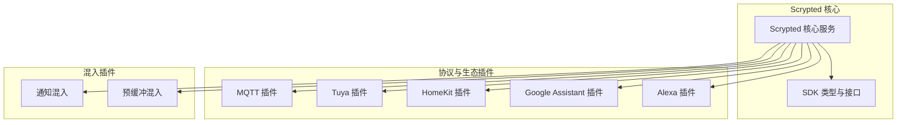
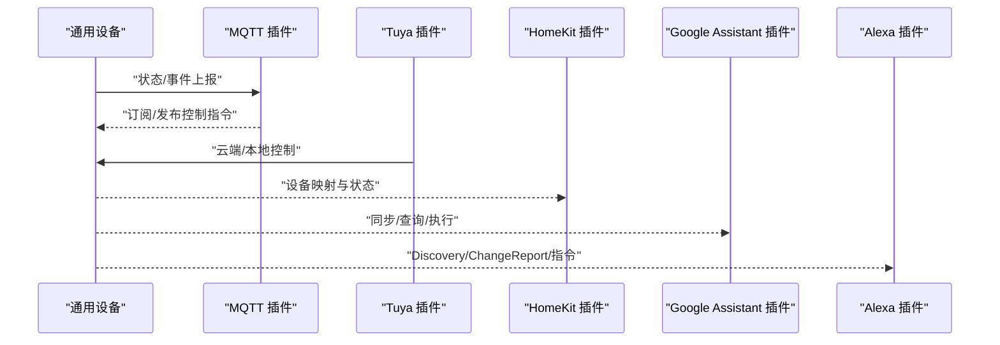
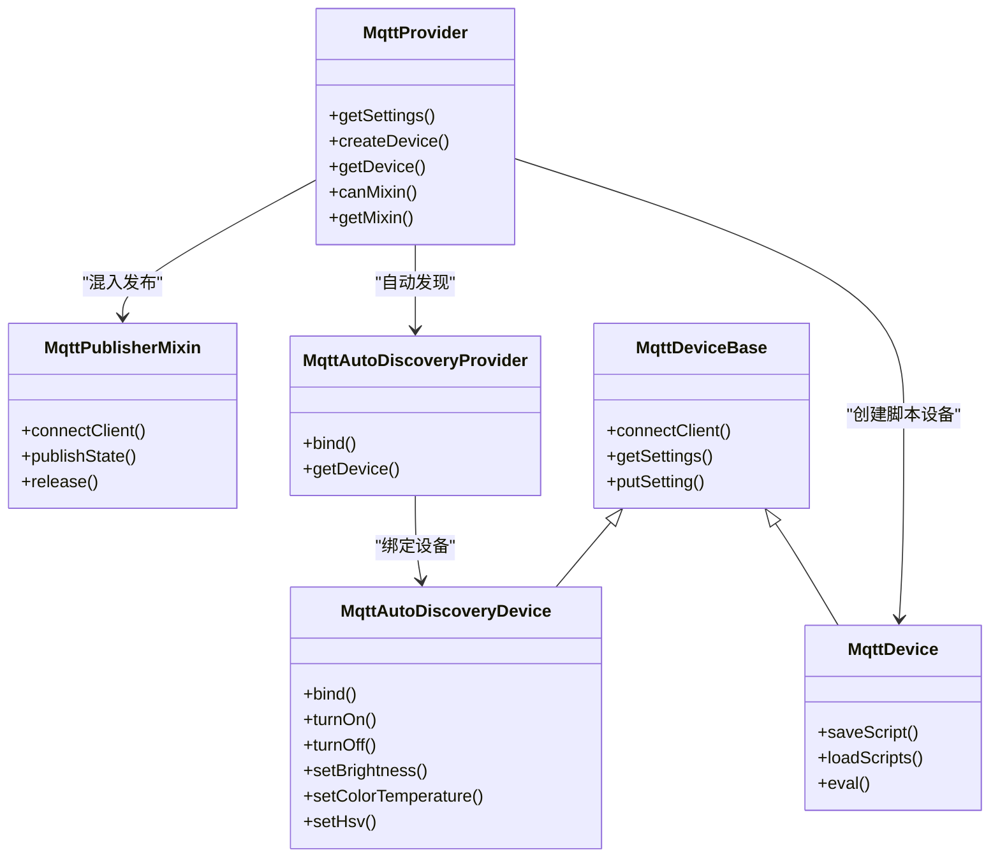
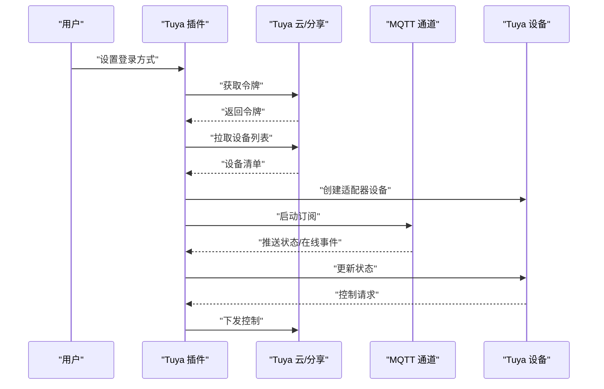
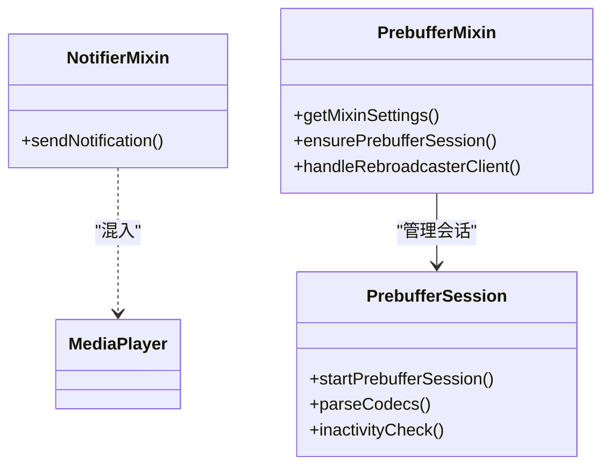
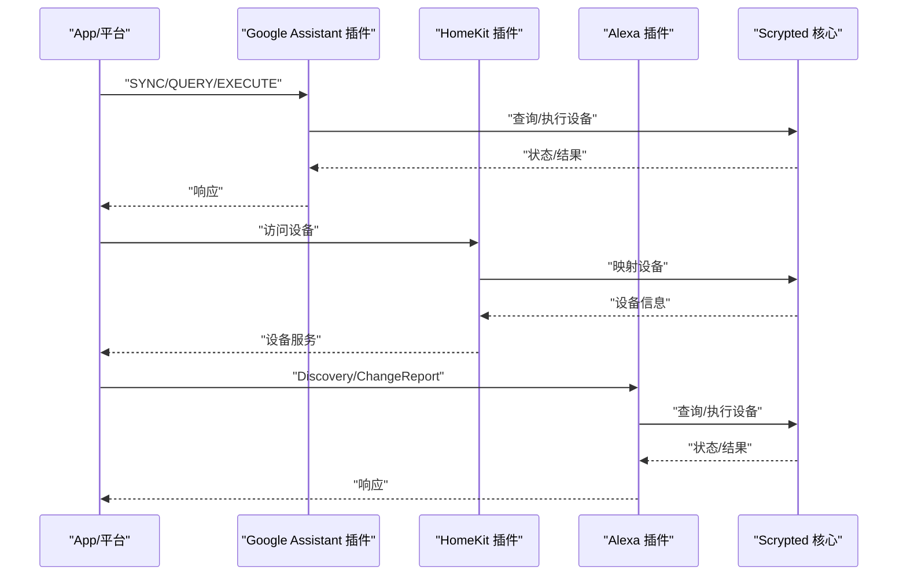
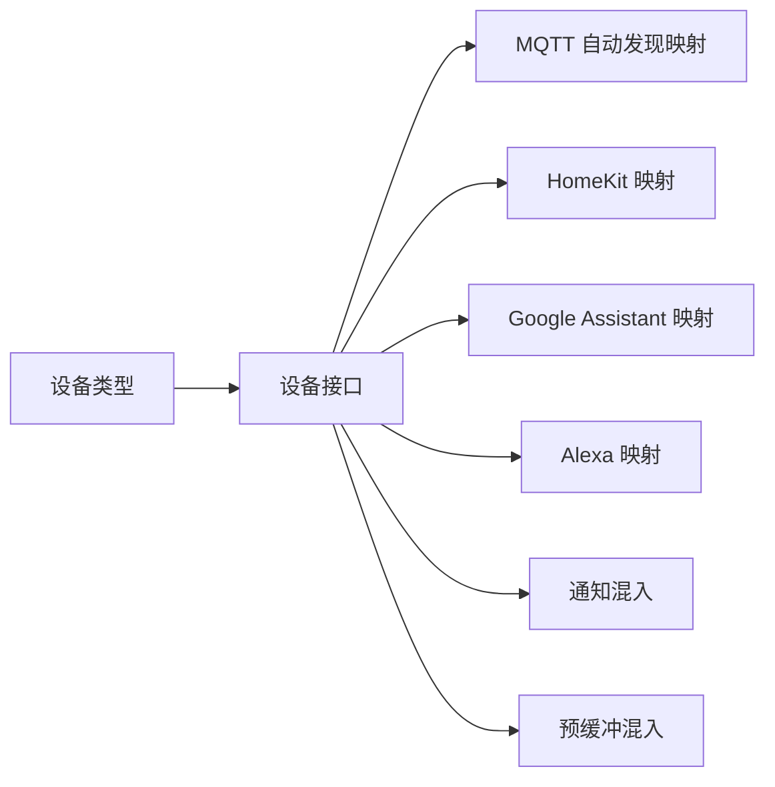

# 智能家居设备集成

<cite>
**本文引用的文件**
- [README.md](file://README.md)
- [main.ts](file://plugins/mqtt/src/main.ts)
- [autodiscovery.ts](file://plugins/mqtt/src/autodiscovery.ts)
- [mqtt-device-base.ts](file://plugins/mqtt/src/api/mqtt-device-base.ts)
- [main.ts](file://plugins/tuya/src/main.ts)
- [plugin.ts](file://plugins/tuya/src/plugin.ts)
- [main.ts](file://plugins/homekit/src/main.ts)
- [main.ts](file://plugins/google-home/src/main.ts)
- [main.ts](file://plugins/alexa/src/main.ts)
- [main.ts](file://plugins/notifier-mixin/src/main.ts)
- [main.ts](file://plugins/prebuffer-mixin/src/main.ts)
- [types.input.ts](file://sdk/types/src/types.input.ts)
</cite>

## 目录
1. [简介](#简介)
2. [项目结构](#项目结构)
3. [核心组件](#核心组件)
4. [架构总览](#架构总览)
5. [详细组件分析](#详细组件分析)
6. [依赖关系分析](#依赖关系分析)
7. [性能考虑](#性能考虑)
8. [故障排除指南](#故障排除指南)
9. [结论](#结论)
10. [附录](#附录)

## 简介
本文件面向 Scrypted 的智能家居设备集成，系统性梳理了通用设备支持（开关、灯光、温控、窗帘等）、MQTT 协议设备集成（主题订阅、消息发布、状态同步、批量控制）、Tuya 设备的云平台对接与本地控制、通用设备混入模式（通知、预缓冲）以及与 HomeKit、Google Assistant、Alexa 生态系统的对接方式。文档以代码为依据，提供可操作的配置参数、设备类型映射、属性转换与命令映射的技术细节，并给出常见问题的诊断与解决建议。

## 项目结构
Scrypted 采用多插件架构，各生态与协议通过独立插件实现：
- MQTT 插件：提供 MQTT 代理、脚本化设备、自动发现与混入发布器
- Tuya 插件：对接 Tuya 云/分享协议，拉取设备列表并通过 MQTT 推送状态
- HomeKit 插件：将 Scrypted 设备暴露为 HomeKit Accessory 或 Bridge
- Google Assistant 插件：对接 Google Home Graph，支持同步、查询、执行与事件上报
- Alexa 插件：对接 Alexa 平台，支持 Discovery、ChangeReport、指令下发
- 混入插件：通知混入（Notifier）与预缓冲混入（Prebuffer），增强设备能力

图示来源
- [main.ts:349-629](file://plugins/mqtt/src/main.ts#L349-L629)
- [plugin.ts:24-313](file://plugins/tuya/src/plugin.ts#L24-L313)
- [main.ts:60-487](file://plugins/homekit/src/main.ts#L60-L487)
- [main.ts:48-650](file://plugins/google-home/src/main.ts#L48-L650)
- [main.ts:23-736](file://plugins/alexa/src/main.ts#L23-L736)
- [main.ts:19-64](file://plugins/notifier-mixin/src/main.ts#L19-L64)
- [main.ts:1-800](file://plugins/prebuffer-mixin/src/main.ts#L1-L800)

章节来源
- [README.md:1-59](file://README.md#L1-L59)

## 核心组件
- 设备类型与接口
  - 设备类型：开关、灯、传感器、恒温器、门锁、窗帘等
  - 关键接口：OnOff、Brightness、ColorSettingTemperature、ColorSettingHsv、Thermometer、HumiditySensor、Lock、WindowCovering 等
- MQTT 组件
  - 提供内置 MQTT Broker、脚本化设备、自动发现、混入发布器
  - 支持设备级或全局外置 Broker 配置
- Tuya 组件
  - 支持 App 扫码登录与账号登录两种方式
  - 通过云接口拉取设备列表，通过 MQTT 订阅实时状态
- 生态对接组件
  - HomeKit：自动将设备映射为 Accessory/Bridge，支持电池与信息扩展
  - Google Assistant：HomeGraph 同步、查询、执行、事件上报
  - Alexa：Discovery、ChangeReport、指令处理与重认证

章节来源
- [types.input.ts:105-162](file://sdk/types/src/types.input.ts#L105-L162)
- [types.input.ts:166-233](file://sdk/types/src/types.input.ts#L166-L233)
- [main.ts:349-629](file://plugins/mqtt/src/main.ts#L349-L629)
- [plugin.ts:24-313](file://plugins/tuya/src/plugin.ts#L24-L313)
- [main.ts:60-487](file://plugins/homekit/src/main.ts#L60-L487)
- [main.ts:48-650](file://plugins/google-home/src/main.ts#L48-L650)
- [main.ts:23-736](file://plugins/alexa/src/main.ts#L23-L736)

## 架构总览
下图展示 Scrypted 在设备接入与生态对接中的整体交互流程：

图示来源
- [main.ts:349-629](file://plugins/mqtt/src/main.ts#L349-L629)
- [plugin.ts:24-313](file://plugins/tuya/src/plugin.ts#L24-L313)
- [main.ts:60-487](file://plugins/homekit/src/main.ts#L60-L487)
- [main.ts:48-650](file://plugins/google-home/src/main.ts#L48-L650)
- [main.ts:23-736](file://plugins/alexa/src/main.ts#L23-L736)

## 详细组件分析

### MQTT 协议设备集成
- 内置与外置 Broker
  - 可启用内置 Aedes MQTT Broker，配置 TCP/HTTP 端口与认证
  - 支持使用外置 Broker，按设备或全局设置用户名/密码
- 脚本化设备
  - 提供 Scriptable 接口，允许用户编写脚本处理订阅与发布
  - 默认示例脚本用于回环测试与演示
- 自动发现（Home Assistant）
  - 解析 HA MQTT 自动发现格式，动态创建设备并绑定接口
  - 支持亮度、色温和 HSV/XY 彩色灯、开关、门磁/人体传感器等
- 混入发布器
  - 将设备属性与方法映射到 MQTT 主题，支持 retain 状态发布
  - 订阅对应命令主题，调用设备方法实现控制
- 设备基类
  - 提供统一的连接、路径与设置管理，支持设备级订阅 URL 与认证

图示来源
- [main.ts:349-629](file://plugins/mqtt/src/main.ts#L349-L629)
- [autodiscovery.ts:76-210](file://plugins/mqtt/src/autodiscovery.ts#L76-L210)
- [mqtt-device-base.ts:6-103](file://plugins/mqtt/src/api/mqtt-device-base.ts#L6-L103)

章节来源
- [main.ts:349-629](file://plugins/mqtt/src/main.ts#L349-L629)
- [autodiscovery.ts:1-757](file://plugins/mqtt/src/autodiscovery.ts#L1-L757)
- [mqtt-device-base.ts:1-103](file://plugins/mqtt/src/api/mqtt-device-base.ts#L1-L103)

### Tuya 设备智能集成
- 登录方式
  - App 扫码登录：生成二维码，扫描后换取令牌
  - 账号登录：使用用户 ID、Access ID/Key、国家信息换取令牌
- 设备发现与状态
  - 通过云接口拉取设备列表，创建适配器设备
  - 若为分享协议，启动 MQTT 订阅，接收在线/删除/名称更新与设备状态变更
- 控制与状态同步
  - 设备状态变更时更新本地缓存并触发事件
  - 支持断线重连与重新认证提示

图示来源
- [plugin.ts:154-313](file://plugins/tuya/src/plugin.ts#L154-L313)

章节来源
- [plugin.ts:24-313](file://plugins/tuya/src/plugin.ts#L24-L313)

### 通用设备混入模式
- 通知混入（Notifier）
  - 将具备 MediaPlayer 的设备增强为通知发送端
  - 支持文本转语音与媒体播放，避免重复 TTS 转换
- 预缓冲混入（Prebuffer）
  - 为视频设备在无客户端时进行预缓冲与转码
  - 支持 RTSP/RTMP 解析、FFmpeg 参数、电池与充电状态联动
  - 提供设置项：解析器选择、输入/输出参数、检测分辨率/码率/关键帧间隔等

图示来源
- [main.ts:19-64](file://plugins/notifier-mixin/src/main.ts#L19-L64)
- [main.ts:1-800](file://plugins/prebuffer-mixin/src/main.ts#L1-L800)

章节来源
- [main.ts:19-64](file://plugins/notifier-mixin/src/main.ts#L19-L64)
- [main.ts:1-800](file://plugins/prebuffer-mixin/src/main.ts#L1-L800)

### 外部平台集成（HomeKit、Google Assistant、Alexa）
- HomeKit
  - 自动将设备映射为 Accessory 或 Bridge，支持电池服务与设备信息
  - 支持独立模式与桥接模式，按设备类型与接口探测可用性
- Google Assistant
  - HomeGraph 同步/查询/执行/断开，支持事件上报与通知
  - 本地授权与 JWT 两种上报路径，支持 mDNS 发布与端口绑定
- Alexa
  - Discovery/ChangeReport/指令处理，支持 Endpoint 健康属性
  - Token 刷新与重认证提示，支持设备增删上报

图示来源
- [main.ts:266-420](file://plugins/google-home/src/main.ts#L266-L420)
- [main.ts:187-408](file://plugins/homekit/src/main.ts#L187-L408)
- [main.ts:314-364](file://plugins/alexa/src/main.ts#L314-L364)

章节来源
- [main.ts:48-650](file://plugins/google-home/src/main.ts#L48-L650)
- [main.ts:60-487](file://plugins/homekit/src/main.ts#L60-L487)
- [main.ts:23-736](file://plugins/alexa/src/main.ts#L23-L736)

## 依赖关系分析
- 设备类型与接口映射
  - 开关/灯/传感器/恒温器/门锁/窗帘等类型与 OnOff、Brightness、ColorSettingTemperature、ColorSettingHsv、Thermometer、HumiditySensor、Lock、WindowCovering 等接口一一对应
- MQTT 自动发现映射
  - component → type + interfaces 映射，支持 availability、color_mode、brightness_scale 等字段解析
- 混入依赖
  - Notifier 需 MediaPlayer 接口
  - Prebuffer 需 VideoCamera 接口与媒体流选项

图示来源
- [autodiscovery.ts:19-757](file://plugins/mqtt/src/autodiscovery.ts#L19-L757)
- [types.input.ts:105-233](file://sdk/types/src/types.input.ts#L105-L233)

章节来源
- [autodiscovery.ts:19-757](file://plugins/mqtt/src/autodiscovery.ts#L19-L757)
- [types.input.ts:105-233](file://sdk/types/src/types.input.ts#L105-L233)

## 性能考虑
- MQTT
  - 使用 retain 发布保持状态，减少重复上报
  - 按设备或全局设置外置 Broker，降低内置 Broker 压力
- Tuya
  - 优先使用 MQTT 订阅实时状态，减少轮询
  - 断线重连与令牌刷新，确保长链路稳定性
- HomeKit/Google Assistant/Alexa
  - 合理设置 mDNS 广播与端口绑定，避免网络环境差异导致的不可达
  - 事件上报节流与状态合并，降低带宽占用

## 故障排除指南
- 设备不在线
  - 检查 MQTT Broker 端口与认证配置
  - 确认外置 Broker 地址与凭据正确
  - 查看 Tuya MQTT 连接日志与重连提示
- 控制延迟高
  - 检查网络质量与 Broker 延迟
  - 对于 Google Assistant/Alexa，确认本地授权与 JWT 有效
- 状态不同步
  - 确认自动发现配置中 availability、state_topic、value_template 等字段正确
  - 检查混入发布器是否正确订阅命令主题并调用设备方法
- HomeKit 不显示设备
  - 检查设备类型与接口映射，确认 autoAdd 设置
  - 确认 mDNS 广播与端口绑定设置

章节来源
- [main.ts:412-579](file://plugins/mqtt/src/main.ts#L412-L579)
- [plugin.ts:270-292](file://plugins/tuya/src/plugin.ts#L270-L292)
- [main.ts:118-140](file://plugins/google-home/src/main.ts#L118-L140)
- [main.ts:187-250](file://plugins/homekit/src/main.ts#L187-L250)
- [main.ts:418-494](file://plugins/alexa/src/main.ts#L418-L494)

## 结论
Scrypted 通过模块化插件体系实现了对多种智能家居协议与生态的统一接入。MQTT 提供灵活的设备集成与自动发现能力；Tuya 插件打通云端与本地控制；混入插件进一步增强设备能力；三大生态插件则将设备无缝暴露给 HomeKit、Google Assistant 与 Alexa。结合本文提供的配置参数、类型映射、属性转换与命令映射，用户可以快速完成设备集成与运维。

## 附录
- 设备类型与接口参考
  - 设备类型枚举与接口定义见 SDK 类型文件
- MQTT 自动发现模板
  - component → type + interfaces 映射表，支持 availability、color_mode、brightness_scale 等字段解析
- 混入能力
  - Notifier：通知发送
  - Prebuffer：视频预缓冲与转码

章节来源
- [types.input.ts:105-233](file://sdk/types/src/types.input.ts#L105-L233)
- [autodiscovery.ts:19-757](file://plugins/mqtt/src/autodiscovery.ts#L19-L757)
- [main.ts:19-64](file://plugins/notifier-mixin/src/main.ts#L19-L64)
- [main.ts:1-800](file://plugins/prebuffer-mixin/src/main.ts#L1-L800)