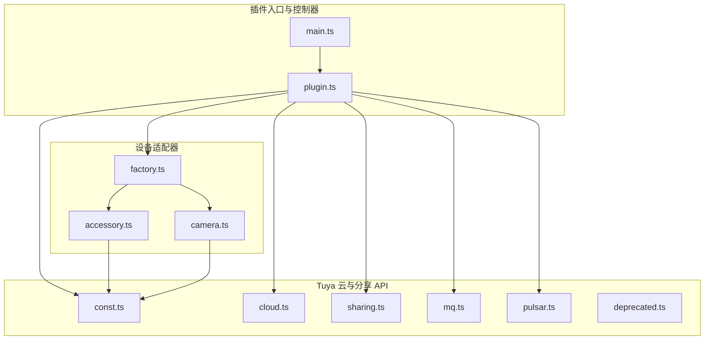
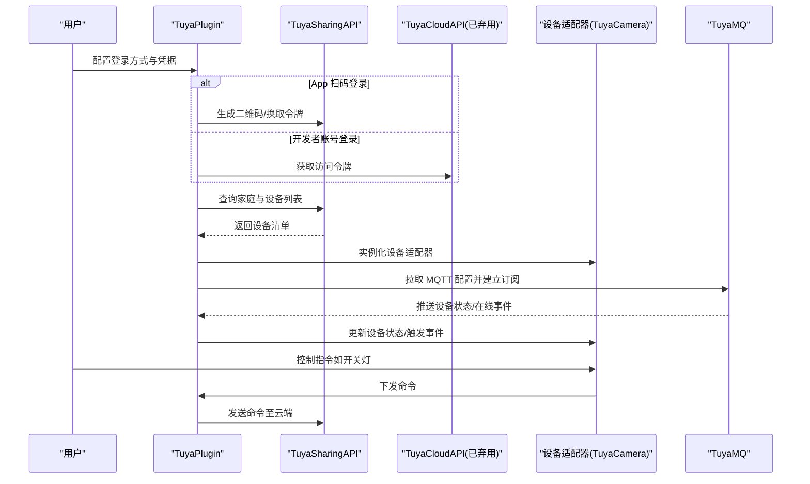
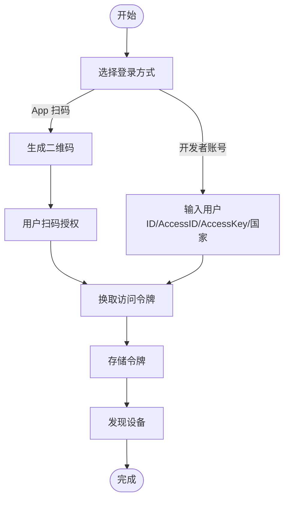
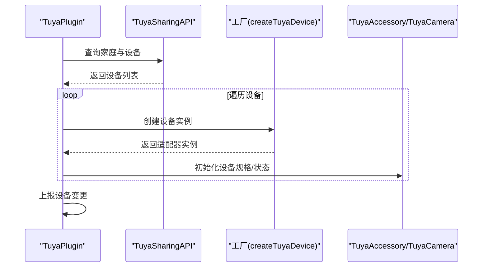
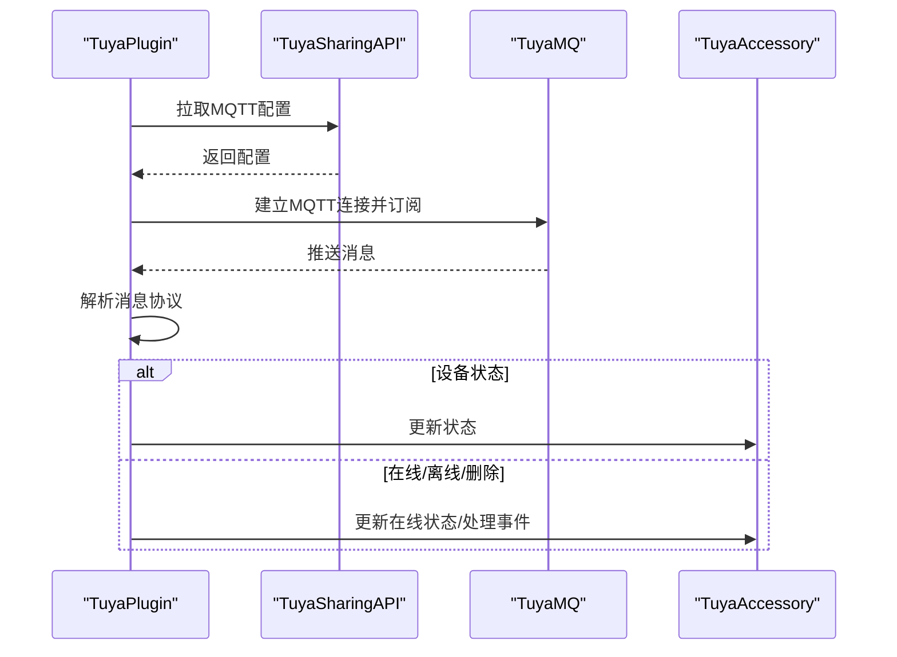
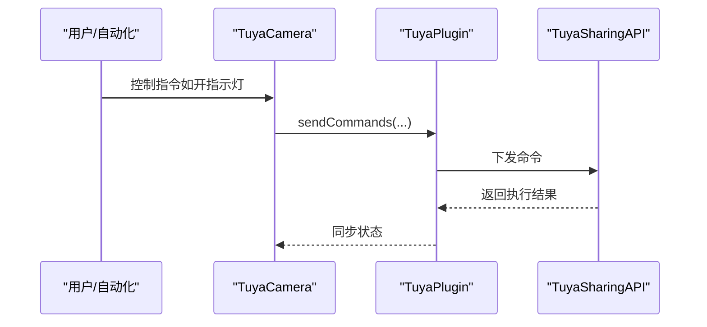
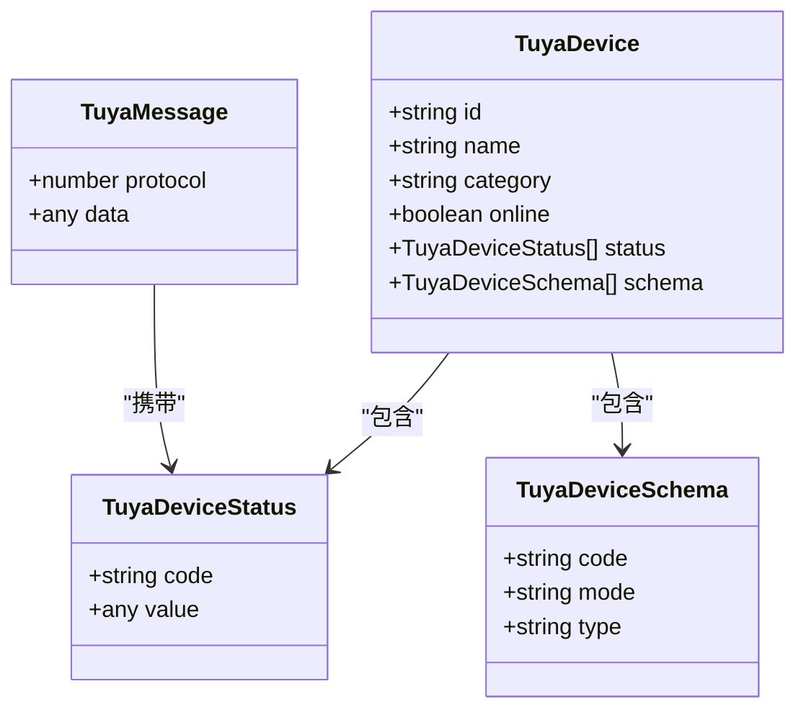
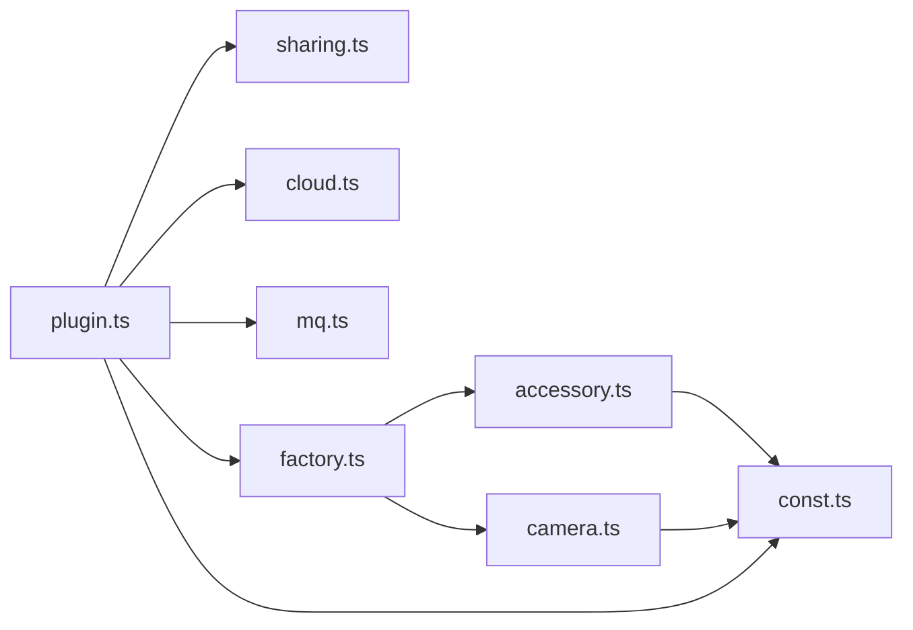

# 涂鸦智能设备

<cite>
**本文引用的文件**
- [README.md](file://plugins/tuya/README.md)
- [package.json](file://plugins/tuya/package.json)
- [main.ts](file://plugins/tuya/src/main.ts)
- [plugin.ts](file://plugins/tuya/src/plugin.ts)
- [const.ts](file://plugins/tuya/src/tuya/const.ts)
- [cloud.ts](file://plugins/tuya/src/tuya/cloud.ts)
- [sharing.ts](file://plugins/tuya/src/tuya/sharing.ts)
- [mq.ts](file://plugins/tuya/src/tuya/mq.ts)
- [pulsar.ts](file://plugins/tuya/src/tuya/pulsar.ts)
- [deprecated.ts](file://plugins/tuya/src/tuya/deprecated.ts)
- [accessory.ts](file://plugins/tuya/src/accessories/accessory.ts)
- [camera.ts](file://plugins/tuya/src/accessories/camera.ts)
- [factory.ts](file://plugins/tuya/src/accessories/factory.ts)
</cite>

## 目录
1. [简介](#简介)
2. [项目结构](#项目结构)
3. [核心组件](#核心组件)
4. [架构总览](#架构总览)
5. [详细组件分析](#详细组件分析)
6. [依赖关系分析](#依赖关系分析)
7. [性能考量](#性能考量)
8. [故障排除指南](#故障排除指南)
9. [结论](#结论)
10. [附录：配置参数与使用说明](#附录配置参数与使用说明)

## 简介
本文件面向 Scrypted 用户与开发者，系统性梳理 Tuya（涂鸦）智能设备在 Scrypted 中的集成方案。内容覆盖云平台对接、设备发现、本地控制、实时消息订阅、流媒体拉取、状态同步与离线处理、以及配置参数与故障排除。重点说明 Tuya API 的两种登录路径（App 扫码登录与开发者账号登录）、数据签名与加密流程、设备类型映射与命令下发、属性管理与事件处理机制，以及云端状态缓存与本地同步策略。

## 项目结构
Tuya 插件位于 plugins/tuya，采用“插件入口 + 核心控制器 + Tuya 云/分享 API + 设备适配器”的分层组织：
- 入口与插件控制器：main.ts、plugin.ts
- Tuya 云与分享 API：cloud.ts、sharing.ts、const.ts、deprecated.ts、mq.ts、pulsar.ts
- 设备适配器：accessory.ts、camera.ts、factory.ts

图表来源
- [main.ts](file://plugins/tuya/src/main.ts)
- [plugin.ts](file://plugins/tuya/src/plugin.ts)
- [const.ts](file://plugins/tuya/src/tuya/const.ts)
- [cloud.ts](file://plugins/tuya/src/tuya/cloud.ts)
- [sharing.ts](file://plugins/tuya/src/tuya/sharing.ts)
- [mq.ts](file://plugins/tuya/src/tuya/mq.ts)
- [pulsar.ts](file://plugins/tuya/src/tuya/pulsar.ts)
- [deprecated.ts](file://plugins/tuya/src/tuya/deprecated.ts)
- [accessory.ts](file://plugins/tuya/src/accessories/accessory.ts)
- [camera.ts](file://plugins/tuya/src/accessories/camera.ts)
- [factory.ts](file://plugins/tuya/src/accessories/factory.ts)

章节来源
- [main.ts](file://plugins/tuya/src/main.ts)
- [plugin.ts](file://plugins/tuya/src/plugin.ts)
- [package.json](file://plugins/tuya/package.json)

## 核心组件
- 插件控制器（TuyaPlugin）
  - 负责登录态管理（App 扫码与开发者账号）、设备发现、设备实例化、MQTT 订阅、消息分发与状态更新。
- 设备适配器基类（TuyaAccessory）
  - 统一设备规格描述、在线状态、状态缓存与命令下发；提供去抖动机制以抑制瞬时事件。
- 摄像头适配器（TuyaCamera）
  - 基于 TuyaAccessory，扩展视频流、门铃/报警事件、指示灯子设备等能力。
- Tuya API 层
  - TuyaCloudAPI（已弃用）与 TuyaSharingAPI（推荐），分别对应开发者账号与 App 扫码登录路径。
  - TuyaMQ（MQTT 客户端封装）与 TuyaPulsar（Pulsar WebSocket 封装，已弃用）。
- 数据模型与常量（const.ts）
  - 设备结构体、消息协议、设备状态与 Schema 定义。

章节来源
- [plugin.ts](file://plugins/tuya/src/plugin.ts)
- [accessory.ts](file://plugins/tuya/src/accessories/accessory.ts)
- [camera.ts](file://plugins/tuya/src/accessories/camera.ts)
- [const.ts](file://plugins/tuya/src/tuya/const.ts)

## 架构总览
下图展示从用户登录到设备发现、实时消息订阅与控制的全链路：

图表来源
- [plugin.ts](file://plugins/tuya/src/plugin.ts)
- [sharing.ts](file://plugins/tuya/src/tuya/sharing.ts)
- [cloud.ts](file://plugins/tuya/src/tuya/cloud.ts)
- [mq.ts](file://plugins/tuya/src/tuya/mq.ts)
- [camera.ts](file://plugins/tuya/src/accessories/camera.ts)

## 详细组件分析

### 登录与认证流程
- 支持两种登录方式：
  - App 扫码登录（推荐）：通过 TuyaSharingAPI 生成二维码，用户在 Tuya（Smart Life）App 扫码授权后换取令牌。
  - 开发者账号登录（已弃用）：通过 TuyaCloudAPI 使用用户 ID、Access ID、Access Key、国家/地区信息换取令牌。
- 登录成功后持久化令牌，后续用于设备发现与命令下发。
- 若令牌过期或失效，触发重新认证并清理存储令牌。

图表来源
- [plugin.ts](file://plugins/tuya/src/plugin.ts)
- [sharing.ts](file://plugins/tuya/src/tuya/sharing.ts)
- [cloud.ts](file://plugins/tuya/src/tuya/cloud.ts)

章节来源
- [plugin.ts](file://plugins/tuya/src/plugin.ts)
- [sharing.ts](file://plugins/tuya/src/tuya/sharing.ts)
- [cloud.ts](file://plugins/tuya/src/tuya/cloud.ts)

### 设备发现与实例化
- App 扫码登录路径：通过 TuyaSharingAPI 查询家庭与设备，拉取设备规格（schema），并基于类别映射创建适配器实例。
- 当前仅支持摄像头类设备（category 属于特定集合），默认返回 TuyaCamera 实例。
- 设备实例化后上报给 Scrypted 设备管理器，随后触发首次状态同步。

图表来源
- [plugin.ts](file://plugins/tuya/src/plugin.ts)
- [factory.ts](file://plugins/tuya/src/accessories/factory.ts)
- [camera.ts](file://plugins/tuya/src/accessories/camera.ts)

章节来源
- [plugin.ts](file://plugins/tuya/src/plugin.ts)
- [factory.ts](file://plugins/tuya/src/accessories/factory.ts)
- [camera.ts](file://plugins/tuya/src/accessories/camera.ts)

### 实时消息订阅与状态同步
- App 扫码登录路径：通过 TuyaSharingAPI 拉取 MQTT 配置，建立 MQTT 连接并订阅设备主题。
- 消息到达后解析为 TuyaMessage，按协议类型分发：
  - 设备状态消息：更新设备状态缓存并触发属性变化。
  - 其他业务消息：处理在线/离线、删除、名称更新等事件。
- 未启用 MQTT 时，仍可进行设备发现与控制，但无法接收实时状态变更。

图表来源
- [plugin.ts](file://plugins/tuya/src/plugin.ts)
- [sharing.ts](file://plugins/tuya/src/tuya/sharing.ts)
- [mq.ts](file://plugins/tuya/src/tuya/mq.ts)

章节来源
- [plugin.ts](file://plugins/tuya/src/plugin.ts)
- [mq.ts](file://plugins/tuya/src/tuya/mq.ts)

### 命令下发与控制
- 设备适配器统一通过 TuyaSharingAPI 或已弃用的 TuyaCloudAPI 下发命令。
- 命令以 TuyaDeviceStatus 数组形式发送，云端确认后返回结果。
- 摄像头适配器支持：
  - 视频流拉取（RTSP，一次性链接，有效期约 30 秒）。
  - 门铃/报警事件检测与去抖动。
  - 指示灯与照明子设备的动态发现与控制。

图表来源
- [camera.ts](file://plugins/tuya/src/accessories/camera.ts)
- [plugin.ts](file://plugins/tuya/src/plugin.ts)
- [sharing.ts](file://plugins/tuya/src/tuya/sharing.ts)

章节来源
- [camera.ts](file://plugins/tuya/src/accessories/camera.ts)
- [plugin.ts](file://plugins/tuya/src/plugin.ts)
- [sharing.ts](file://plugins/tuya/src/tuya/sharing.ts)

### 数据模型与协议
- 设备结构体（TuyaDevice）包含设备 ID、名称、类别、在线状态、本地密钥、产品信息、Schema 与状态数组等。
- 消息协议（TuyaMessageProtocol）区分设备状态与其它业务消息两类。
- 设备状态（TuyaDeviceStatus）与 Schema（TuyaDeviceSchema）用于属性读写与类型约束。

图表来源
- [const.ts](file://plugins/tuya/src/tuya/const.ts)

章节来源
- [const.ts](file://plugins/tuya/src/tuya/const.ts)

### 类型映射与事件处理
- 设备类型映射：当前仅对摄像头类设备进行适配，返回 TuyaCamera 实例。
- 事件处理：
  - 运动检测：根据 Schema 代码匹配，结合去抖动策略触发运动事件。
  - 门铃/报警：根据 Schema 代码匹配，触发二进制传感器事件。
  - 指示灯：若设备具备指示灯 Schema，则动态创建子设备并同步其状态。

章节来源
- [factory.ts](file://plugins/tuya/src/accessories/factory.ts)
- [camera.ts](file://plugins/tuya/src/accessories/camera.ts)

## 依赖关系分析
- 插件声明为 DeviceProvider 与 Settings 接口，依赖 Scrypted SDK 提供设备管理与设置界面。
- 外部依赖：
  - axios：HTTP 请求（含签名与加密）。
  - mqtt：MQTT 订阅与发布。
  - qrcode-svg：生成登录二维码（仅用于 UI 展示）。
- 内部模块耦合：
  - TuyaPlugin 依赖 TuyaSharingAPI/TuyaCloudAPI、TuyaMQ、设备工厂与适配器。
  - 设备适配器依赖 const.ts 中的数据模型与 SDK 接口。

图表来源
- [plugin.ts](file://plugins/tuya/src/plugin.ts)
- [sharing.ts](file://plugins/tuya/src/tuya/sharing.ts)
- [cloud.ts](file://plugins/tuya/src/tuya/cloud.ts)
- [mq.ts](file://plugins/tuya/src/tuya/mq.ts)
- [factory.ts](file://plugins/tuya/src/accessories/factory.ts)
- [accessory.ts](file://plugins/tuya/src/accessories/accessory.ts)
- [camera.ts](file://plugins/tuya/src/accessories/camera.ts)
- [const.ts](file://plugins/tuya/src/tuya/const.ts)

章节来源
- [package.json](file://plugins/tuya/package.json)
- [plugin.ts](file://plugins/tuya/src/plugin.ts)

## 性能考量
- 令牌刷新与请求签名：App 扫码登录路径采用 AES-GCM 加密与 HMAC-SHA256 签名，避免明文传输敏感参数；开发者账号路径采用 SHA256-HMAC 签名与时间戳校验。
- MQTT 连接复用：TuyaMQ 在配置未过期时复用连接，到期前自动续期，降低频繁重连成本。
- 状态更新批处理：设备状态通过批量合并更新，减少重复上报。
- 流媒体拉取：RTSP 链接一次性使用且短期有效，避免长连接占用资源。

章节来源
- [sharing.ts](file://plugins/tuya/src/tuya/sharing.ts)
- [cloud.ts](file://plugins/tuya/src/tuya/cloud.ts)
- [mq.ts](file://plugins/tuya/src/tuya/mq.ts)
- [camera.ts](file://plugins/tuya/src/accessories/camera.ts)

## 故障排除指南
- 登录失败
  - 症状：无法生成二维码或换取令牌。
  - 排查：确认用户代码正确；检查网络可达性；查看日志中错误提示。
  - 参考
    - [plugin.ts](file://plugins/tuya/src/plugin.ts)
    - [sharing.ts](file://plugins/tuya/src/tuya/sharing.ts)
- 设备离线或无法控制
  - 症状：视频流拉取失败或控制无响应。
  - 排查：确认设备在线；检查 RTSP 链接是否过期；验证命令下发是否成功。
  - 参考
    - [camera.ts](file://plugins/tuya/src/accessories/camera.ts)
    - [sharing.ts](file://plugins/tuya/src/tuya/sharing.ts)
- 实时状态不同步
  - 症状：设备状态未及时更新。
  - 排查：确认 MQTT 连接正常；检查订阅主题是否正确；查看消息解析逻辑。
  - 参考
    - [plugin.ts](file://plugins/tuya/src/plugin.ts)
    - [mq.ts](file://plugins/tuya/src/tuya/mq.ts)
- 令牌过期或需要重新认证
  - 症状：接口调用失败并提示需要重新认证。
  - 排查：触发重新登录流程，更新存储令牌。
  - 参考
    - [plugin.ts](file://plugins/tuya/src/plugin.ts)
    - [sharing.ts](file://plugins/tuya/src/tuya/sharing.ts)

章节来源
- [plugin.ts](file://plugins/tuya/src/plugin.ts)
- [sharing.ts](file://plugins/tuya/src/tuya/sharing.ts)
- [camera.ts](file://plugins/tuya/src/accessories/camera.ts)
- [mq.ts](file://plugins/tuya/src/tuya/mq.ts)

## 结论
本插件通过 App 扫码登录路径实现了对 Tuya 摄像头设备的完整接入，涵盖设备发现、实时消息订阅、命令下发与状态同步。尽管开发者账号登录路径已标记为弃用，但 App 扫码登录提供了更安全与稳定的认证体验。未来可扩展更多设备类别与高级特性（如固件升级、本地直连等），但需注意与 Tuya 平台能力与安全策略保持一致。

## 附录：配置参数与使用说明
- 登录方式
  - App 扫码登录：提供用户代码，自动生成二维码，扫码授权后换取令牌。
  - 开发者账号登录（已弃用）：提供用户 ID、Access ID、Access Key、国家/地区。
- 关键参数
  - 用户代码：用于生成登录二维码。
  - 用户 ID、Access ID、Access Key、国家/地区：开发者账号登录所需信息。
  - 令牌信息：内部存储，用于后续请求与续期。
- 设备类型与能力
  - 摄像头：支持视频流（RTSP）、运动检测、门铃/报警事件、指示灯控制。
  - 子设备：指示灯作为独立子设备动态发现与控制。
- 注意事项
  - 需要在 Tuya 项目中启用消息服务以接收实时通知。
  - RTSP 链接短期有效，需在使用前重新拉取。

章节来源
- [README.md](file://plugins/tuya/README.md)
- [plugin.ts](file://plugins/tuya/src/plugin.ts)
- [sharing.ts](file://plugins/tuya/src/tuya/sharing.ts)
- [camera.ts](file://plugins/tuya/src/accessories/camera.ts)