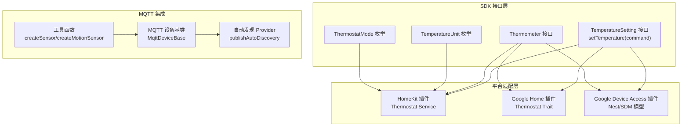
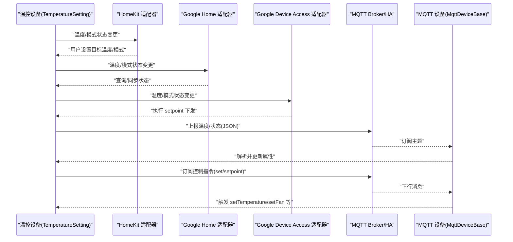
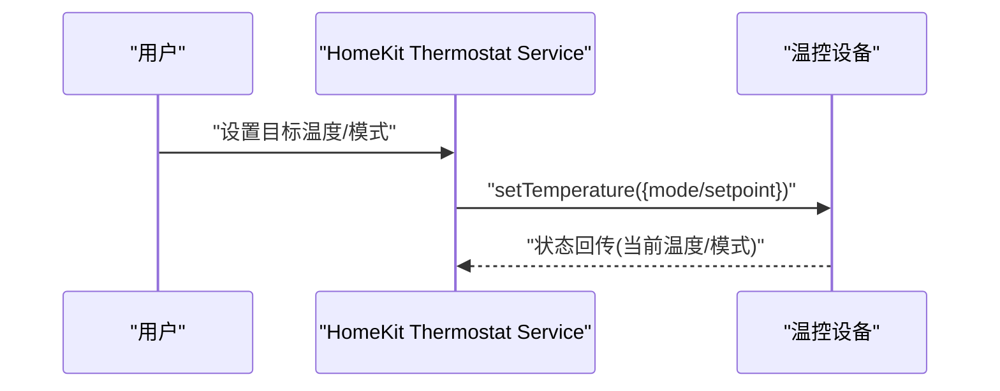
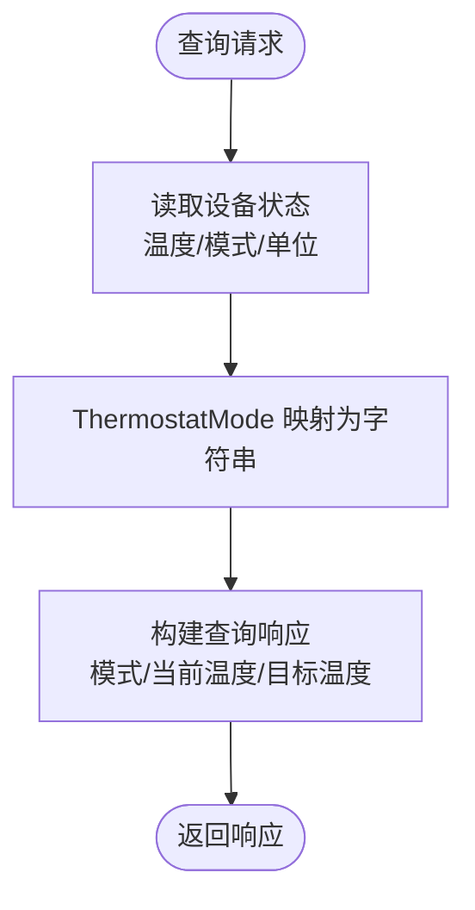
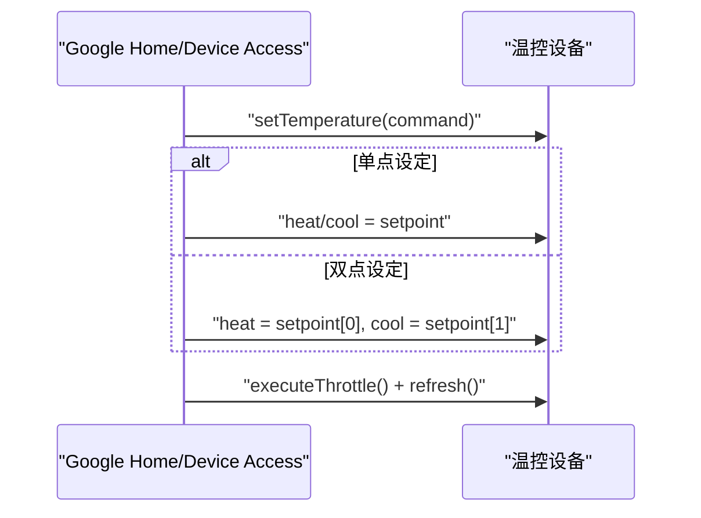
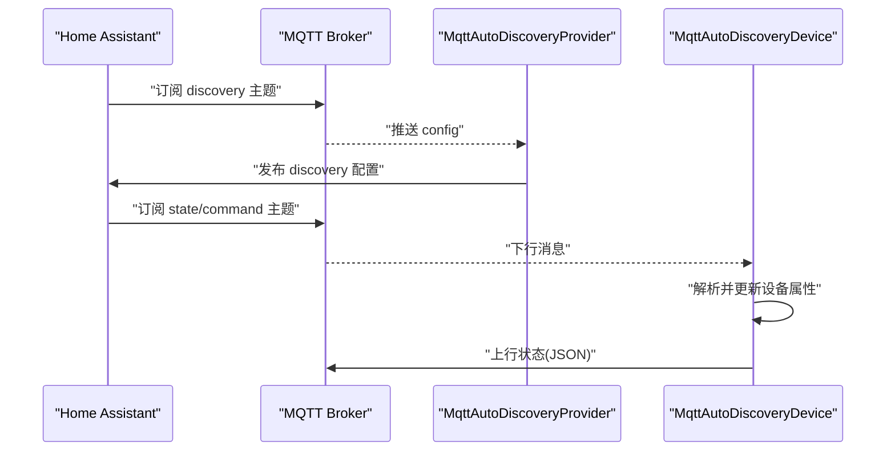
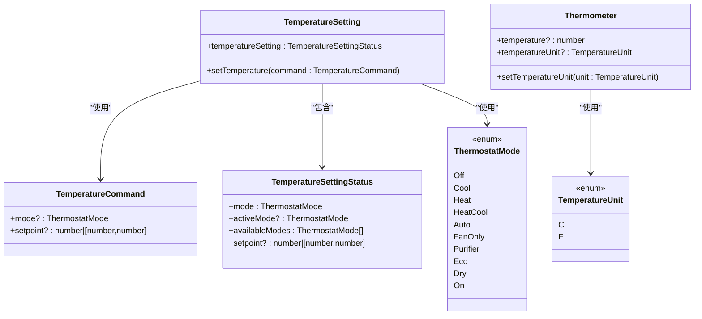
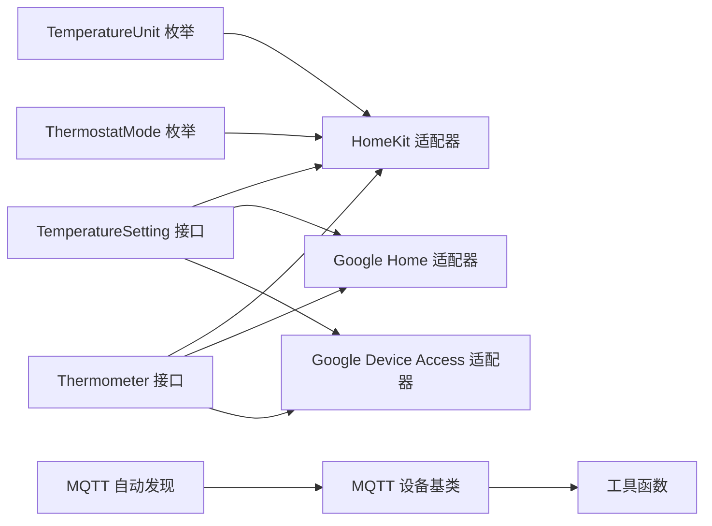

# 温控设备

<cite>
**本文引用的文件**
- [plugins/homekit/src/types/thermostat.ts](file://plugins/homekit/src/types/thermostat.ts)
- [plugins/google-home/src/types/thermostat.ts](file://plugins/google-home/src/types/thermostat.ts)
- [plugins/mqtt/src/autodiscovery.ts](file://plugins/mqtt/src/autodiscovery.ts)
- [plugins/mqtt/src/main.ts](file://plugins/mqtt/src/main.ts)
- [plugins/mqtt/src/api/mqtt-device-base.ts](file://plugins/mqtt/src/api/mqtt-device-base.ts)
- [plugins/mqtt/src/api/util.ts](file://plugins/mqtt/src/api/util.ts)
- [plugins/google-device-access/src/main.ts](file://plugins/google-device-access/src/main.ts)
- [sdk/types/src/types.input.ts](file://sdk/types/src/types.input.ts)
</cite>

## 目录
1. [简介](#简介)
2. [项目结构](#项目结构)
3. [核心组件](#核心组件)
4. [架构总览](#架构总览)
5. [详细组件分析](#详细组件分析)
6. [依赖关系分析](#依赖关系分析)
7. [性能考量](#性能考量)
8. [故障排除指南](#故障排除指南)
9. [结论](#结论)
10. [附录](#附录)

## 简介
本文件面向 Scrypted 平台上的“温控设备”集成，系统性阐述以下内容：
- 设备类型与接口：基于 TemperatureSetting/TemperatureUnit/Thermometer 等接口，覆盖温度测量、目标温度设定、运行模式控制、单位切换等能力。
- 多平台集成：HomeKit、Google Home、Google Device Access、MQTT 自动发现与脚本化设备等。
- 通信机制：MQTT 上报温度与订阅控制指令、自动发现配置发布、脚本化设备的消息处理。
- 状态管理：温度历史与查询、能耗统计（若设备提供）、故障诊断（连接、协议、解析错误）。
- 配置参数：温度单位、精度、报警阈值、节能策略等可调项。
- 故障排除：温度不准、控制失效、通信中断等常见问题的定位与修复。

## 项目结构
围绕温控设备的关键模块分布如下：
- SDK 接口层：定义 TemperatureSetting、Thermometer、TemperatureUnit、ThermostatMode 等核心类型与枚举。
- 平台适配层：HomeKit、Google Home、Google Device Access 将 Scrypted 设备映射到各自生态。
- MQTT 集成：自动发现与脚本化设备，支持 Home Assistant Discovery 协议与自定义消息模板。
- 类型与接口定义：集中于 SDK 的 types.input.ts；各平台适配器在对应插件中实现。

图表来源
- [sdk/types/src/types.input.ts:345-429](file://sdk/types/src/types.input.ts#L345-L429)
- [plugins/homekit/src/types/thermostat.ts:1-242](file://plugins/homekit/src/types/thermostat.ts#L1-L242)
- [plugins/google-home/src/types/thermostat.ts:1-56](file://plugins/google-home/src/types/thermostat.ts#L1-L56)
- [plugins/google-device-access/src/main.ts:420-440](file://plugins/google-device-access/src/main.ts#L420-L440)
- [plugins/mqtt/src/autodiscovery.ts:705-756](file://plugins/mqtt/src/autodiscovery.ts#L705-L756)
- [plugins/mqtt/src/api/mqtt-device-base.ts:1-38](file://plugins/mqtt/src/api/mqtt-device-base.ts#L1-L38)
- [plugins/mqtt/src/api/util.ts:1-63](file://plugins/mqtt/src/api/util.ts#L1-L63)

章节来源
- [sdk/types/src/types.input.ts:345-429](file://sdk/types/src/types.input.ts#L345-L429)
- [plugins/homekit/src/types/thermostat.ts:1-242](file://plugins/homekit/src/types/thermostat.ts#L1-L242)
- [plugins/google-home/src/types/thermostat.ts:1-56](file://plugins/google-home/src/types/thermostat.ts#L1-L56)
- [plugins/google-device-access/src/main.ts:420-440](file://plugins/google-device-access/src/main.ts#L420-L440)
- [plugins/mqtt/src/autodiscovery.ts:705-756](file://plugins/mqtt/src/autodiscovery.ts#L705-L756)
- [plugins/mqtt/src/api/mqtt-device-base.ts:1-38](file://plugins/mqtt/src/api/mqtt-device-base.ts#L1-L38)
- [plugins/mqtt/src/api/util.ts:1-63](file://plugins/mqtt/src/api/util.ts#L1-L63)

## 核心组件
- TemperatureSetting 接口：提供 setTemperature 命令与 temperatureSetting 状态，支持单点或双点（加热/制冷）设定。
- Thermometer 接口：提供当前温度与温度单位切换。
- TemperatureUnit 枚举：C/F。
- ThermostatMode 枚举：Off/Cool/Heat/HeatCool/Auto/FanOnly/Purifier/Eco/Dry/On。
- 平台适配器：
  - HomeKit：将 TemperatureSetting/Thermometer 映射到 Thermostat Service，支持目标温度、当前温度、模式、单位、风速与湿度设置等。
  - Google Home：映射到 TemperatureSetting Trait，提供模式、温度范围与单位。
  - Google Device Access：映射到 Nest/SDM 模型，执行 setpoint 双点下发与刷新。
- MQTT 集成：
  - 自动发现：publishAutoDiscovery 发布 HA Discovery 配置，订阅/发布对应主题。
  - 脚本化设备：MqttDeviceBase 提供订阅 URL、用户名/密码等设置，统一消息处理。
  - 工具函数：createSensor/createMotionSensor 等简化传感器接入。

章节来源
- [sdk/types/src/types.input.ts:345-429](file://sdk/types/src/types.input.ts#L345-L429)
- [plugins/homekit/src/types/thermostat.ts:1-242](file://plugins/homekit/src/types/thermostat.ts#L1-L242)
- [plugins/google-home/src/types/thermostat.ts:1-56](file://plugins/google-home/src/types/thermostat.ts#L1-L56)
- [plugins/google-device-access/src/main.ts:420-440](file://plugins/google-device-access/src/main.ts#L420-L440)
- [plugins/mqtt/src/autodiscovery.ts:705-756](file://plugins/mqtt/src/autodiscovery.ts#L705-L756)
- [plugins/mqtt/src/api/mqtt-device-base.ts:1-38](file://plugins/mqtt/src/api/mqtt-device-base.ts#L1-L38)
- [plugins/mqtt/src/api/util.ts:1-63](file://plugins/mqtt/src/api/util.ts#L1-L63)

## 架构总览
下图展示从设备到平台与 MQTT 的整体交互路径：

图表来源
- [plugins/homekit/src/types/thermostat.ts:85-109](file://plugins/homekit/src/types/thermostat.ts#L85-L109)
- [plugins/google-home/src/types/thermostat.ts:41-54](file://plugins/google-home/src/types/thermostat.ts#L41-L54)
- [plugins/google-device-access/src/main.ts:420-435](file://plugins/google-device-access/src/main.ts#L420-L435)
- [plugins/mqtt/src/autodiscovery.ts:705-756](file://plugins/mqtt/src/autodiscovery.ts#L705-L756)
- [plugins/mqtt/src/api/mqtt-device-base.ts:15-38](file://plugins/mqtt/src/api/mqtt-device-base.ts#L15-L38)

## 详细组件分析

### HomeKit 温控适配器（Thermostat Service）
- 设备类型探测：要求具备 TemperatureSetting 与 Thermometer 接口。
- 特征绑定：
  - 当前/目标温度：限制最小步进与上下限。
  - 目标/当前加热/制冷状态：映射 ThermostatMode。
  - 单点/双点设定：HeatCool 模式下延迟合并上下限设定。
  - 温度单位：支持摄氏/华氏切换。
  - 湿度与风扇：可选扩展到服务中以增强 Home Assistant 兼容性。
- 控制流程：用户通过 HomeKit 设置目标温度/模式后，回调调用设备 setTemperature。

图表来源
- [plugins/homekit/src/types/thermostat.ts:85-109](file://plugins/homekit/src/types/thermostat.ts#L85-L109)
- [plugins/homekit/src/types/thermostat.ts:116-162](file://plugins/homekit/src/types/thermostat.ts#L116-L162)
- [plugins/homekit/src/types/thermostat.ts:164-174](file://plugins/homekit/src/types/thermostat.ts#L164-L174)

章节来源
- [plugins/homekit/src/types/thermostat.ts:7-242](file://plugins/homekit/src/types/thermostat.ts#L7-L242)

### Google Home 温控适配器（TemperatureSetting Trait）
- 同步：返回可用模式列表、温度范围、单位。
- 查询：返回当前模式、环境温度、目标温度（单点/高低点）。
- 映射：ThermostatMode 到字符串枚举。

图表来源
- [plugins/google-home/src/types/thermostat.ts:24-54](file://plugins/google-home/src/types/thermostat.ts#L24-L54)

章节来源
- [plugins/google-home/src/types/thermostat.ts:1-56](file://plugins/google-home/src/types/thermostat.ts#L1-L56)

### Google Device Access（Nest/SDM）集成
- 执行 setpoint 下发：根据模式选择 heat/cool 单点或双点参数。
- 刷新：节流后主动刷新状态，确保 UI 与设备一致。

图表来源
- [plugins/google-device-access/src/main.ts:420-435](file://plugins/google-device-access/src/main.ts#L420-L435)

章节来源
- [plugins/google-device-access/src/main.ts:420-440](file://plugins/google-device-access/src/main.ts#L420-L440)

### MQTT 自动发现与脚本化设备
- 自动发现：publishAutoDiscovery 遍历设备接口，生成 HA Discovery 配置并发布到 homeassistant/<component>/<node>/<iface>/config。
- 订阅与回写：对 OnOff/Brightness/Lock/传感器等接口订阅对应主题，解析 JSON 并更新设备属性。
- 脚本化设备：MqttDeviceBase 提供统一的订阅 URL、认证信息与消息处理入口。
- 工具函数：createSensor/createMotionSensor 等用于快速创建二进制/运动传感器。

图表来源
- [plugins/mqtt/src/autodiscovery.ts:705-756](file://plugins/mqtt/src/autodiscovery.ts#L705-L756)
- [plugins/mqtt/src/autodiscovery.ts:297-431](file://plugins/mqtt/src/autodiscovery.ts#L297-L431)
- [plugins/mqtt/src/api/mqtt-device-base.ts:15-38](file://plugins/mqtt/src/api/mqtt-device-base.ts#L15-L38)

章节来源
- [plugins/mqtt/src/autodiscovery.ts:76-209](file://plugins/mqtt/src/autodiscovery.ts#L76-L209)
- [plugins/mqtt/src/autodiscovery.ts:297-431](file://plugins/mqtt/src/autodiscovery.ts#L297-L431)
- [plugins/mqtt/src/autodiscovery.ts:705-756](file://plugins/mqtt/src/autodiscovery.ts#L705-L756)
- [plugins/mqtt/src/api/mqtt-device-base.ts:1-38](file://plugins/mqtt/src/api/mqtt-device-base.ts#L1-L38)
- [plugins/mqtt/src/api/util.ts:1-63](file://plugins/mqtt/src/api/util.ts#L1-L63)

### 温度设定与模式切换（通用接口）
- 设定命令：TemperatureCommand 支持单点或双点 setpoint；TemperatureSettingStatus 包含当前 activeMode 与 availableModes。
- 模式映射：ThermostatMode 枚举覆盖常见场景（Off/Heat/Cool/HeatCool/Auto/FanOnly/Purifier/Eco/Dry/On）。
- 单位切换：Thermometer.setTemperatureUnit 支持在平台侧切换显示单位。

图表来源
- [sdk/types/src/types.input.ts:345-429](file://sdk/types/src/types.input.ts#L345-L429)

章节来源
- [sdk/types/src/types.input.ts:345-429](file://sdk/types/src/types.input.ts#L345-L429)

## 依赖关系分析
- HomeKit 依赖 TemperatureSetting/Thermometer/TemperatureUnit/ThermostatMode。
- Google Home 依赖 TemperatureSetting/Thermometer 与模式映射。
- Google Device Access 依赖 Nest/SDM 模型，将 setpoint 双点下发至设备。
- MQTT 依赖 publishAutoDiscovery 与 MqttDeviceBase，实现自动发现与消息处理。

图表来源
- [sdk/types/src/types.input.ts:345-429](file://sdk/types/src/types.input.ts#L345-L429)
- [plugins/homekit/src/types/thermostat.ts:1-242](file://plugins/homekit/src/types/thermostat.ts#L1-L242)
- [plugins/google-home/src/types/thermostat.ts:1-56](file://plugins/google-home/src/types/thermostat.ts#L1-L56)
- [plugins/google-device-access/src/main.ts:420-440](file://plugins/google-device-access/src/main.ts#L420-L440)
- [plugins/mqtt/src/autodiscovery.ts:705-756](file://plugins/mqtt/src/autodiscovery.ts#L705-L756)
- [plugins/mqtt/src/api/mqtt-device-base.ts:1-38](file://plugins/mqtt/src/api/mqtt-device-base.ts#L1-L38)
- [plugins/mqtt/src/api/util.ts:1-63](file://plugins/mqtt/src/api/util.ts#L1-L63)

章节来源
- [sdk/types/src/types.input.ts:345-429](file://sdk/types/src/types.input.ts#L345-L429)
- [plugins/homekit/src/types/thermostat.ts:1-242](file://plugins/homekit/src/types/thermostat.ts#L1-L242)
- [plugins/google-home/src/types/thermostat.ts:1-56](file://plugins/google-home/src/types/thermostat.ts#L1-L56)
- [plugins/google-device-access/src/main.ts:420-440](file://plugins/google-device-access/src/main.ts#L420-L440)
- [plugins/mqtt/src/autodiscovery.ts:705-756](file://plugins/mqtt/src/autodiscovery.ts#L705-L756)
- [plugins/mqtt/src/api/mqtt-device-base.ts:1-38](file://plugins/mqtt/src/api/mqtt-device-base.ts#L1-L38)
- [plugins/mqtt/src/api/util.ts:1-63](file://plugins/mqtt/src/api/util.ts#L1-L63)

## 性能考量
- HomeKit 双点设定采用去抖合并（5 秒窗口），避免频繁下发导致的设备压力。
- Google Device Access 在下发命令后进行节流与刷新，减少重复网络往返。
- MQTT 自动发现仅在连接时发布一次配置，保留 QoS 1 与 retain，降低重复传输成本。
- 平台适配器对模式与温度范围进行本地约束，减少无效请求。

[本节为通用指导，不直接分析具体文件]

## 故障排除指南
- 温度不准
  - 检查 Thermometer.temperatureUnit 是否正确（摄氏/华氏）。
  - 平台侧单位切换：Thermometer.setTemperatureUnit。
  - MQTT 侧确认上报 JSON 字段与单位一致。
- 控制失效
  - HomeKit：确认目标温度/模式特征已绑定且未被禁用（如 Auto 模式在某些设备上被限制）。
  - Google Device Access：检查 setpoint 下发是否符合 Heat/Cool 单点或双点格式。
  - MQTT：确认订阅的主题与命令模板匹配。
- 通信中断
  - MQTT：检查订阅 URL、用户名/密码、Broker 地址与网络连通性。
  - 自动发现：确认 homeassistant/status 与 discovery 配置主题可达。
- 状态不一致
  - Google Device Access：执行下发后等待刷新完成，必要时手动触发 refresh。
  - HomeKit：确认特性回调已正确调用 setTemperature。

章节来源
- [plugins/homekit/src/types/thermostat.ts:96-101](file://plugins/homekit/src/types/thermostat.ts#L96-L101)
- [plugins/google-device-access/src/main.ts:434-435](file://plugins/google-device-access/src/main.ts#L434-L435)
- [plugins/mqtt/src/api/mqtt-device-base.ts:15-38](file://plugins/mqtt/src/api/mqtt-device-base.ts#L15-L38)
- [plugins/mqtt/src/autodiscovery.ts:705-756](file://plugins/mqtt/src/autodiscovery.ts#L705-L756)

## 结论
Scrypted 的温控设备通过统一的 TemperatureSetting/Thermometer 接口，结合 HomeKit、Google Home、Google Device Access 与 MQTT 的多平台适配，实现了跨生态的温度控制与状态同步。平台适配器负责模式与数值映射，MQTT 提供灵活的自动发现与脚本化扩展能力。遵循本文的配置与排障建议，可有效提升温控设备的稳定性与用户体验。

[本节为总结，不直接分析具体文件]

## 附录

### 温控设备配置参数说明（示例）
- 温度单位设置：Thermometer.setTemperatureUnit（摄氏/华氏）。
- 精度调整：HomeKit 中温度/阈值温度的最小步进为 0.1。
- 报警阈值：可通过 MQTT 自定义主题上报与订阅，或在脚本中解析 JSON 字段。
- 节能策略：ThermostatMode.Eco 或平台侧的节能模式映射。

章节来源
- [sdk/types/src/types.input.ts:411-414](file://sdk/types/src/types.input.ts#L411-L414)
- [plugins/homekit/src/types/thermostat.ts:19-35](file://plugins/homekit/src/types/thermostat.ts#L19-L35)
- [plugins/mqtt/src/autodiscovery.ts:659-668](file://plugins/mqtt/src/autodiscovery.ts#L659-L668)