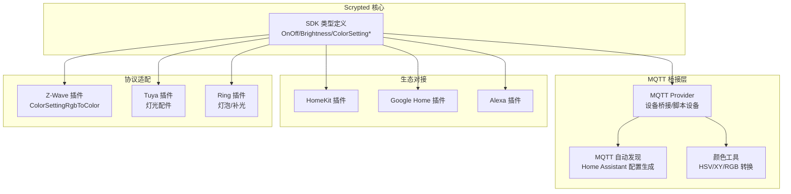
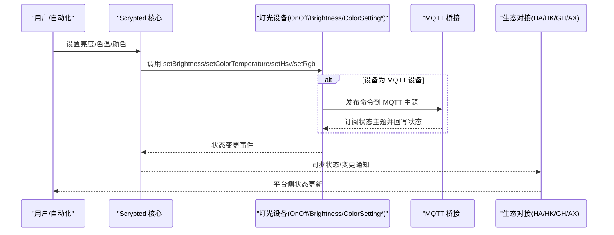
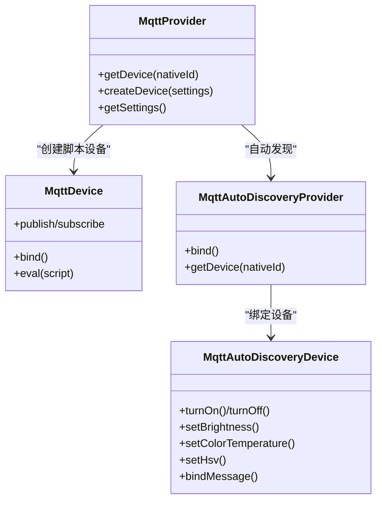
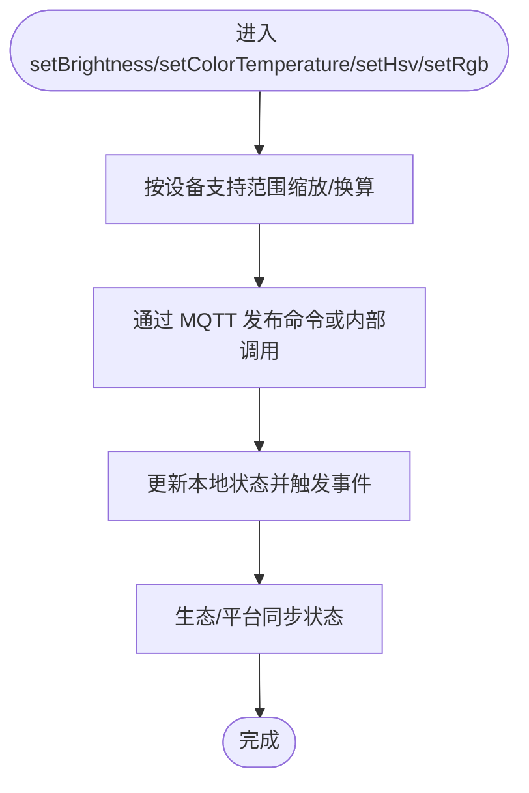
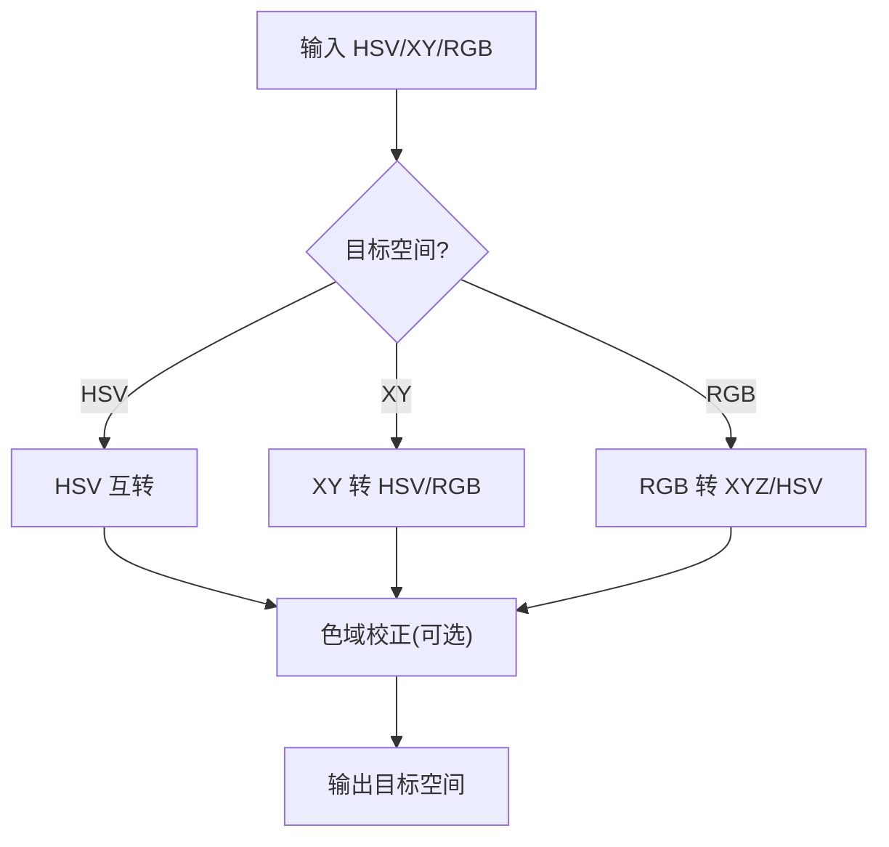
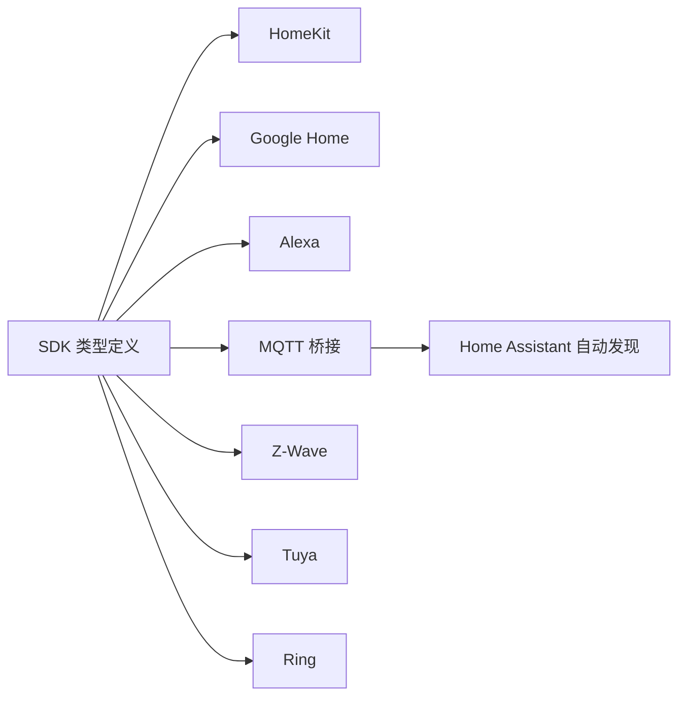

# 灯光控制系统

<cite>
**本文引用的文件**
- [plugins/mqtt/src/main.ts](file://plugins/mqtt/src/main.ts)
- [plugins/mqtt/src/autodiscovery.ts](file://plugins/mqtt/src/autodiscovery.ts)
- [plugins/mqtt/fs/examples/loopback-light.ts](file://plugins/mqtt/fs/examples/loopback-light.ts)
- [plugins/mqtt/fs/examples/shelly-dimmer2.ts](file://plugins/mqtt/fs/examples/shelly-dimmer2.ts)
- [plugins/mqtt/src/color-util.ts](file://plugins/mqtt/src/color-util.ts)
- [sdk/types/src/types.input.ts](file://sdk/types/src/types.input.ts)
- [plugins/zwave/src/CommandClasses/ColorSettingRgbToColor.ts](file://plugins/zwave/src/CommandClasses/ColorSettingRgbToColor.ts)
- [plugins/google-home/src/types/light.ts](file://plugins/google-home/src/types/light.ts)
- [plugins/alexa/src/types/light.ts](file://plugins/alexa/src/types/light.ts)
- [plugins/homekit/src/types/light.ts](file://plugins/homekit/src/types/light.ts)
- [plugins/ring/src/location.ts](file://plugins/ring/src/location.ts)
- [plugins/tuya/src/accessories/camera.ts](file://plugins/tuya/src/accessories/camera.ts)
</cite>

## 目录
1. [简介](#简介)
2. [项目结构](#项目结构)
3. [核心组件](#核心组件)
4. [架构总览](#架构总览)
5. [详细组件分析](#详细组件分析)
6. [依赖关系分析](#依赖关系分析)
7. [性能考量](#性能考量)
8. [故障排除指南](#故障排除指南)
9. [结论](#结论)
10. [附录](#附录)

## 简介
本技术文档面向 Scrypted 的灯光控制系统，系统性阐述灯光设备的设备类型定义、亮度控制、颜色调节（色温与RGB/HSV）、场景模式支持、MQTT 协议在灯光控制中的应用（主题订阅、消息发布、状态同步、批量控制）、通用接口实现、状态管理与缓存、配置参数与性能优化，并提供常见问题的诊断与解决方法。文档同时覆盖与 HomeKit、Google Home、Alexa 等生态的对接能力。

## 项目结构
Scrypted 的灯光控制由多插件协同完成：
- MQTT 插件：提供通用的 MQTT 设备桥接、自动发现、状态订阅与命令发布能力，支持灯光设备的统一接入与状态同步。
- SDK 类型定义：定义 OnOff、Brightness、ColorSettingTemperature、ColorSettingHsv、ColorSettingRgb 等通用接口，确保灯光设备的一致行为契约。
- 生态对接插件：HomeKit、Google Home、Alexa 插件将灯光设备映射到各自生态的设备类型与特性，实现跨平台控制。
- 其他协议插件：Z-Wave、Tuya、Ring 等通过各自的实现展示灯光设备的扩展方式与状态同步策略。

图表来源
- [plugins/mqtt/src/main.ts](file://plugins/mqtt/src/main.ts)
- [plugins/mqtt/src/autodiscovery.ts](file://plugins/mqtt/src/autodiscovery.ts)
- [plugins/mqtt/src/color-util.ts](file://plugins/mqtt/src/color-util.ts)
- [sdk/types/src/types.input.ts](file://sdk/types/src/types.input.ts)
- [plugins/homekit/src/types/light.ts](file://plugins/homekit/src/types/light.ts)
- [plugins/google-home/src/types/light.ts](file://plugins/google-home/src/types/light.ts)
- [plugins/alexa/src/types/light.ts](file://plugins/alexa/src/types/light.ts)
- [plugins/zwave/src/CommandClasses/ColorSettingRgbToColor.ts](file://plugins/zwave/src/CommandClasses/ColorSettingRgbToColor.ts)
- [plugins/tuya/src/accessories/camera.ts](file://plugins/tuya/src/accessories/camera.ts)
- [plugins/ring/src/location.ts](file://plugins/ring/src/location.ts)

章节来源
- [plugins/mqtt/src/main.ts](file://plugins/mqtt/src/main.ts)
- [plugins/mqtt/src/autodiscovery.ts](file://plugins/mqtt/src/autodiscovery.ts)
- [sdk/types/src/types.input.ts](file://sdk/types/src/types.input.ts)

## 核心组件
- 设备类型与接口
  - 设备类型：Light（灯光）。
  - 关键接口：OnOff、Brightness、ColorSettingTemperature、ColorSettingHsv、ColorSettingRgb。
- MQTT 桥接
  - 提供 MQTT 客户端封装、订阅/发布、脚本化设备、自动发现（Home Assistant）。
- 颜色转换工具
  - 支持 HSV/XY/RGB 互转、色域校正、色温与 mired 互算。
- 生态对接
  - HomeKit、Google Home、Alexa 将灯光映射为对应设备类型与特性，支持亮度、色温和颜色控制。

章节来源
- [sdk/types/src/types.input.ts](file://sdk/types/src/types.input.ts)
- [plugins/mqtt/src/main.ts](file://plugins/mqtt/src/main.ts)
- [plugins/mqtt/src/autodiscovery.ts](file://plugins/mqtt/src/autodiscovery.ts)
- [plugins/mqtt/src/color-util.ts](file://plugins/mqtt/src/color-util.ts)
- [plugins/google-home/src/types/light.ts](file://plugins/google-home/src/types/light.ts)
- [plugins/alexa/src/types/light.ts](file://plugins/alexa/src/types/light.ts)
- [plugins/homekit/src/types/light.ts](file://plugins/homekit/src/types/light.ts)

## 架构总览
灯光控制的整体流程如下：
- 控制端（App/语音/自动化）下发命令至 Scrypted。
- Scrypted 根据设备接口调用对应实现（如 OnOff/Brightness/ColorSetting*）。
- 对于 MQTT 设备，命令通过 MQTT 发布到设备；设备状态通过 MQTT 上报，Scrypted 订阅并更新本地状态。
- 生态对接插件（HomeKit/Google Home/Alexa）从 Scrypted 读取状态并上报到各自平台，实现双向同步。

图表来源
- [plugins/mqtt/src/main.ts](file://plugins/mqtt/src/main.ts)
- [plugins/mqtt/src/autodiscovery.ts](file://plugins/mqtt/src/autodiscovery.ts)
- [sdk/types/src/types.input.ts](file://sdk/types/src/types.input.ts)

## 详细组件分析

### MQTT 桥接与自动发现（灯光）
- 设备桥接
  - 提供脚本化设备能力，允许用户编写脚本处理订阅与发布逻辑。
  - 统一订阅/发布路径，支持 retain 策略与属性级发布。
- 自动发现（Home Assistant）
  - 解析 HA 的 light.mqtt 配置，动态创建灯光设备并绑定接口（OnOff、Brightness、ColorSettingHsv/ColorSettingTemperature）。
  - 支持模板渲染（nunjucks），解析状态主题中的 JSON 字段，实现亮度、色温和颜色的双向同步。
- 示例脚本
  - loopback-light：演示如何订阅 set 命令并发布状态回执。
  - shelly-dimmer2：演示如何订阅设备状态并发布命令。

图表来源
- [plugins/mqtt/src/main.ts](file://plugins/mqtt/src/main.ts)
- [plugins/mqtt/src/autodiscovery.ts](file://plugins/mqtt/src/autodiscovery.ts)

章节来源
- [plugins/mqtt/src/main.ts](file://plugins/mqtt/src/main.ts)
- [plugins/mqtt/src/autodiscovery.ts](file://plugins/mqtt/src/autodiscovery.ts)
- [plugins/mqtt/fs/examples/loopback-light.ts](file://plugins/mqtt/fs/examples/loopback-light.ts)
- [plugins/mqtt/fs/examples/shelly-dimmer2.ts](file://plugins/mqtt/fs/examples/shelly-dimmer2.ts)

### 通用接口实现（亮度、色温、RGB/HSV）
- 接口定义
  - OnOff：开关控制。
  - Brightness：亮度（0-100）。
  - ColorSettingTemperature：色温（K）。
  - ColorSettingHsv/ColorSettingRgb：颜色（HSV/RGB）。
- 实现要点
  - 亮度缩放：根据设备支持的亮度范围进行比例换算。
  - 色温换算：K 与 mired 互转。
  - 颜色空间转换：HSV/XY/RGB 互转与色域校正。

图表来源
- [sdk/types/src/types.input.ts](file://sdk/types/src/types.input.ts)
- [plugins/mqtt/src/autodiscovery.ts](file://plugins/mqtt/src/autodiscovery.ts)
- [plugins/mqtt/src/color-util.ts](file://plugins/mqtt/src/color-util.ts)

章节来源
- [sdk/types/src/types.input.ts](file://sdk/types/src/types.input.ts)
- [plugins/mqtt/src/autodiscovery.ts](file://plugins/mqtt/src/autodiscovery.ts)
- [plugins/mqtt/src/color-util.ts](file://plugins/mqtt/src/color-util.ts)

### 颜色转换与色域校正
- 功能
  - HSV/XY/RGB 互转。
  - 色域校正：针对不同型号灯具的色域范围进行最近可显示色点映射。
  - 色温与 mired 互算。
- 应用
  - 在 MQTT 自动发现中，将 XY/HSV 状态转换为内部 HSV 表示，保证跨设备一致性。
  - 在 HomeKit/Google Home/Alexa 中，将内部 HSV 映射到平台特性。

图表来源
- [plugins/mqtt/src/color-util.ts](file://plugins/mqtt/src/color-util.ts)

章节来源
- [plugins/mqtt/src/color-util.ts](file://plugins/mqtt/src/color-util.ts)

### 生态对接（HomeKit/Google Home/Alexa）
- HomeKit
  - 将灯光设备映射为 Light 型号，支持 Hue/Saturation、Brightness、ColorSetting。
  - 使用延迟合并机制减少频繁设置带来的抖动。
- Google Home
  - 将灯光设备映射为 LIGHT 类型，支持 OnOff、Brightness、ColorSetting（按可用接口启用）。
- Alexa
  - 将灯光设备映射为 LIGHT 类型，支持 PowerController、BrightnessController、ColorController（按可用接口启用）。

章节来源
- [plugins/homekit/src/types/light.ts](file://plugins/homekit/src/types/light.ts)
- [plugins/google-home/src/types/light.ts](file://plugins/google-home/src/types/light.ts)
- [plugins/alexa/src/types/light.ts](file://plugins/alexa/src/types/light.ts)

### 协议适配示例（Z-Wave/Tuya/Ring）
- Z-Wave
  - 通过 ColorSettingRgbToColor 实现 RGB 与色温的切换与状态更新。
- Tuya
  - 将设备发现为 Light 类型并映射 OnOff/Online 接口。
- Ring
  - 通过 setBrightness 将百分比映射为 0-1 的级别。

章节来源
- [plugins/zwave/src/CommandClasses/ColorSettingRgbToColor.ts](file://plugins/zwave/src/CommandClasses/ColorSettingRgbToColor.ts)
- [plugins/tuya/src/accessories/camera.ts](file://plugins/tuya/src/accessories/camera.ts)
- [plugins/ring/src/location.ts](file://plugins/ring/src/location.ts)

## 依赖关系分析
- 组件耦合
  - MQTT 桥接与自动发现高度内聚，共同完成设备发现、状态订阅与命令发布。
  - SDK 类型定义为所有灯光设备提供统一接口契约，降低上层对具体协议的依赖。
  - 生态对接插件仅依赖 SDK 接口，不直接关心底层协议细节。
- 外部依赖
  - MQTT 客户端库用于连接与通信。
  - Home Assistant 自动发现规范用于设备配置生成与状态同步。

图表来源
- [sdk/types/src/types.input.ts](file://sdk/types/src/types.input.ts)
- [plugins/mqtt/src/autodiscovery.ts](file://plugins/mqtt/src/autodiscovery.ts)
- [plugins/homekit/src/types/light.ts](file://plugins/homekit/src/types/light.ts)
- [plugins/google-home/src/types/light.ts](file://plugins/google-home/src/types/light.ts)
- [plugins/alexa/src/types/light.ts](file://plugins/alexa/src/types/light.ts)
- [plugins/zwave/src/CommandClasses/ColorSettingRgbToColor.ts](file://plugins/zwave/src/CommandClasses/ColorSettingRgbToColor.ts)
- [plugins/tuya/src/accessories/camera.ts](file://plugins/tuya/src/accessories/camera.ts)
- [plugins/ring/src/location.ts](file://plugins/ring/src/location.ts)

## 性能考量
- 事件去噪与合并
  - 使用延迟合并（如 HomeKit 中的 Hue/Saturation 设置）减少高频事件带来的抖动与网络开销。
- 批量控制
  - 在 MQTT 自动发现中，通过模板与统一命令主题实现批量控制与状态同步。
- 缓存与状态同步
  - 通过 retain 策略与订阅机制，确保状态在网络波动后仍能及时恢复。
- 颜色转换优化
  - 预计算色域与最近可显示色点映射，避免重复计算。

## 故障排除指南
- 亮度不准确
  - 检查设备支持的亮度范围与缩放比例（brightness_scale），确认 Scrypted 内部与设备侧的映射一致。
  - 参考：亮度缩放与解缩放函数。
- 颜色异常
  - 确认颜色空间（HSV/XY/RGB）与色域范围是否匹配设备支持。
  - 使用颜色工具进行转换与色域校正验证。
- 控制延迟
  - 检查 MQTT 连接状态与主题订阅/发布路径，确认 retain 与 QoS 设置。
  - 观察生态对接插件的同步队列与事件频率。
- 状态未更新
  - 确认自动发现配置中的 state_topic 与 value_template 是否正确。
  - 检查设备脚本是否正确订阅状态主题并回写状态。

章节来源
- [plugins/mqtt/src/autodiscovery.ts](file://plugins/mqtt/src/autodiscovery.ts)
- [plugins/mqtt/src/color-util.ts](file://plugins/mqtt/src/color-util.ts)
- [plugins/mqtt/fs/examples/loopback-light.ts](file://plugins/mqtt/fs/examples/loopback-light.ts)

## 结论
Scrypted 的灯光控制系统以 SDK 接口为核心，结合 MQTT 桥接与自动发现实现跨协议、跨生态的一致控制体验。通过颜色转换与色域校正、事件去噪与批量控制等机制，系统在易用性与性能之间取得平衡。配合生态对接插件，用户可在多种平台上统一管理灯光设备。

## 附录
- 配置参数建议
  - MQTT 自动发现：合理设置 state_topic、command_topic、brightness_scale、color_mode 等，确保与设备协议一致。
  - 颜色模型：优先使用设备支持的颜色模式（hs/xy/color_temp），并在需要时启用模板渲染。
  - 性能优化：开启 retain、合理设置 QoS、合并高频事件、预计算色域映射。
- 常见问题速查
  - 亮度不准确：检查 brightness_scale 与缩放函数。
  - 颜色异常：核对色域与转换链路。
  - 控制延迟：检查订阅/发布路径与 retain/QoS。
  - 状态不同步：核对 state_topic/value_template 与设备脚本。