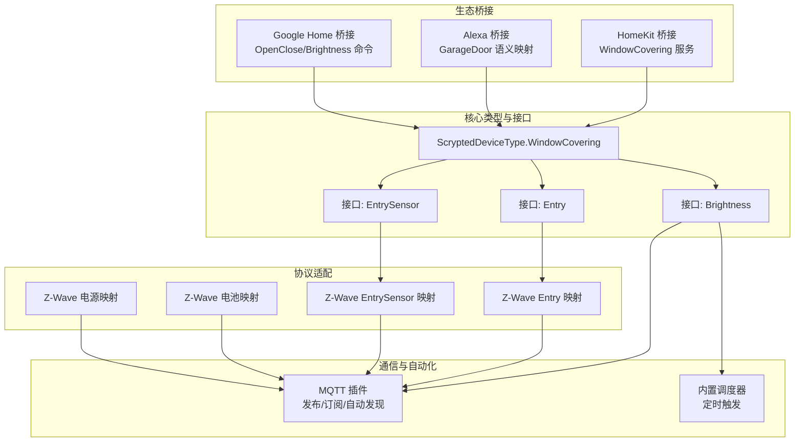
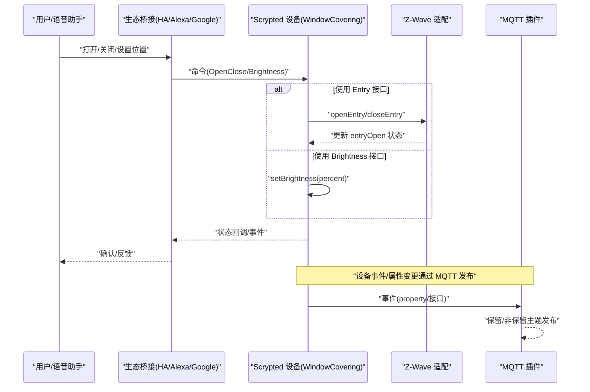
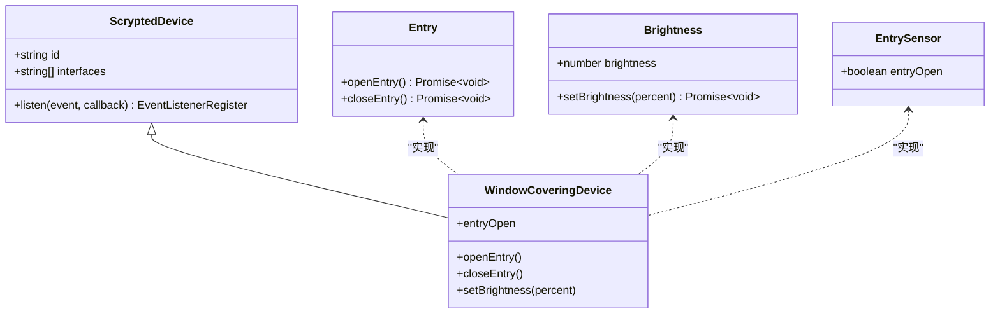
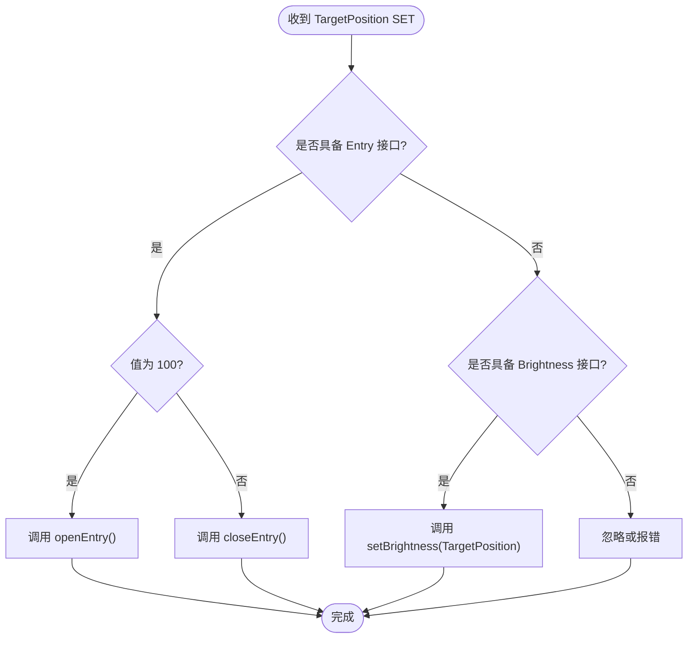
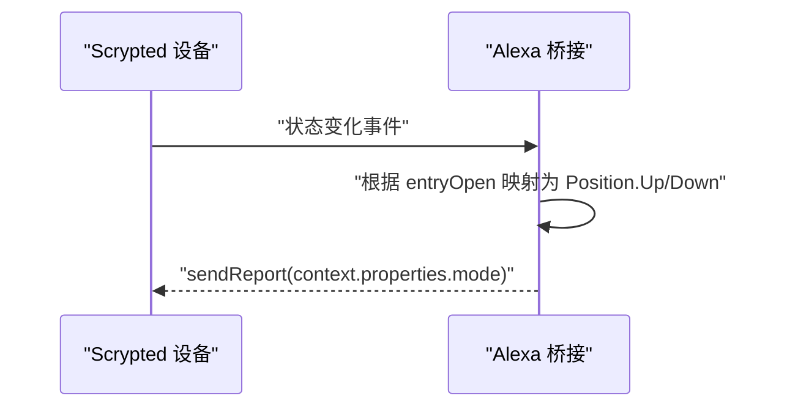
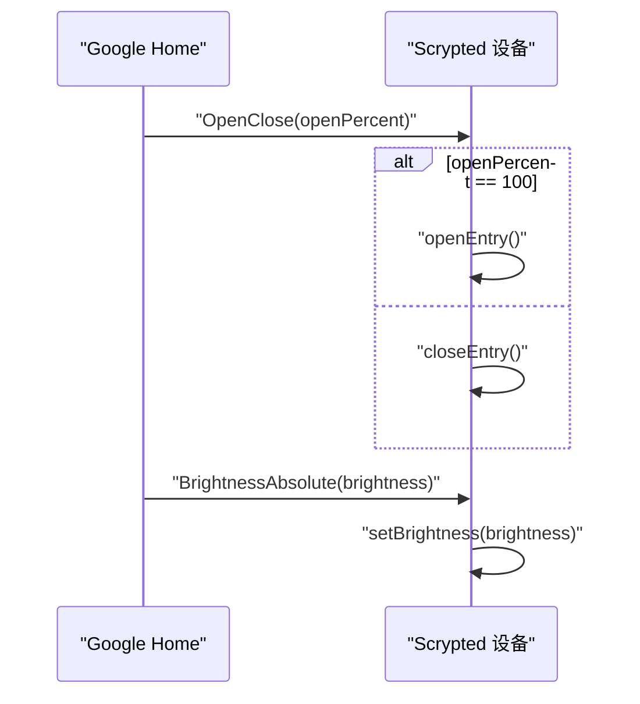
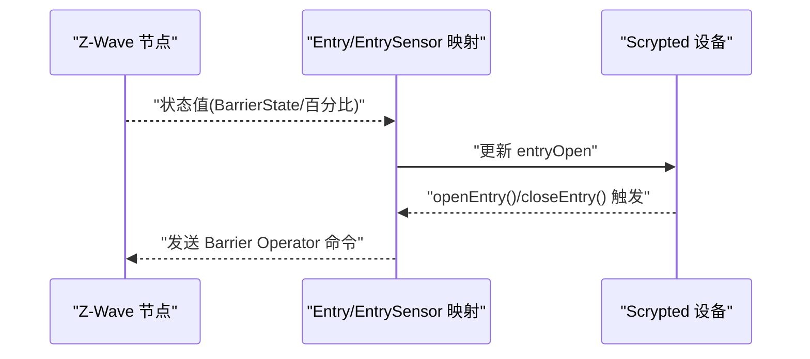
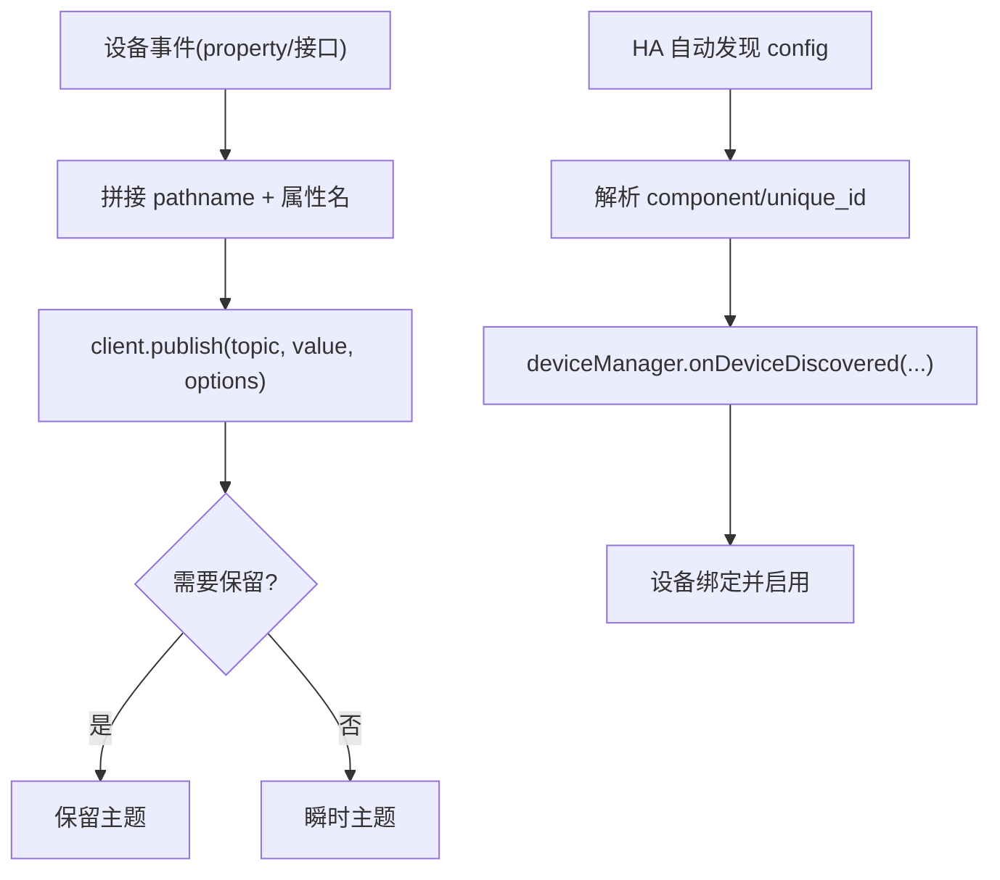
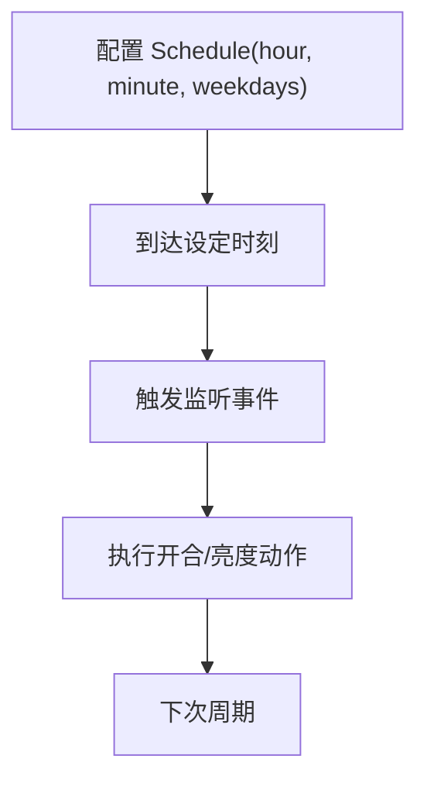
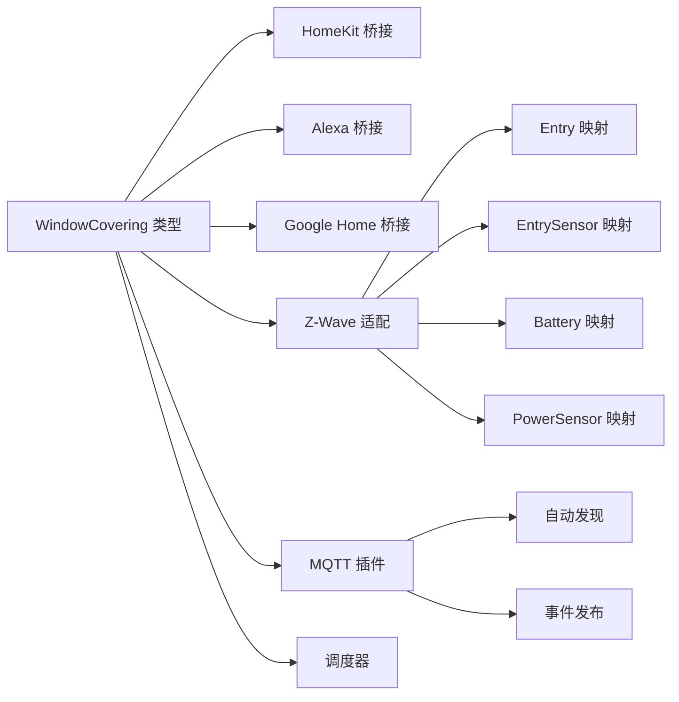

# 窗帘遮阳设备

<cite>
**本文引用的文件**
- [plugins/homekit/src/types/windowcovering.ts](file://plugins/homekit/src/types/windowcovering.ts)
- [plugins/alexa/src/types/garagedoor.ts](file://plugins/alexa/src/types/garagedoor.ts)
- [plugins/google-home/src/commands/openclose.ts](file://plugins/google-home/src/commands/openclose.ts)
- [plugins/google-home/src/commands/brightness.ts](file://plugins/google-home/src/commands/brightness.ts)
- [sdk/types/src/types.input.ts](file://sdk/types/src/types.input.ts)
- [plugins/mqtt/src/main.ts](file://plugins/mqtt/src/main.ts)
- [plugins/mqtt/src/autodiscovery.ts](file://plugins/mqtt/src/autodiscovery.ts)
- [plugins/zwave/src/CommandClasses/EntryToBarrierOperator.ts](file://plugins/zwave/src/CommandClasses/EntryToBarrierOperator.ts)
- [plugins/zwave/src/CommandClasses/EntrySensorToBarrierOperator.ts](file://plugins/zwave/src/CommandClasses/EntrySensorToBarrierOperator.ts)
- [plugins/zwave/src/CommandClasses/BatteryToBattery.ts](file://plugins/zwave/src/CommandClasses/BatteryToBattery.ts)
- [plugins/zwave/src/CommandClasses/PowerSensorToPowerManagement.ts](file://plugins/zwave/src/CommandClasses/PowerSensorToPowerManagement.ts)
- [plugins/core/src/builtins/scheduler.ts](file://plugins/core/src/builtins/scheduler.ts)
</cite>

## 目录
1. [简介](#简介)
2. [项目结构](#项目结构)
3. [核心组件](#核心组件)
4. [架构总览](#架构总览)
5. [详细组件分析](#详细组件分析)
6. [依赖关系分析](#依赖关系分析)
7. [性能考虑](#性能考虑)
8. [故障排除指南](#故障排除指南)
9. [结论](#结论)
10. [附录](#附录)

## 简介
本技术文档面向 Scrypted 中的窗帘遮阳设备（WindowCovering）集成，系统性阐述其设备类型定义、开合控制、位置调节、定时控制、MQTT 集成与自动发现、通用接口实现、状态管理与故障诊断、配置参数说明以及常见问题排查。窗帘遮阳设备在 Scrypted 中通过统一的设备类型与接口抽象，结合 HomeKit、Alexa、Google Home 等生态桥接，以及 MQTT 自动发现与 Z-Wave 等协议适配，形成完整的控制与状态上报链路。

## 项目结构
围绕窗帘遮阳设备的关键模块分布如下：
- 设备类型与接口：在 SDK 类型定义中声明 WindowCovering 类型与亮度、入口等接口。
- 生态桥接层：HomeKit、Alexa、Google Home 将 WindowCovering 映射到各自平台的语义模型。
- 协议适配层：Z-Wave 提供 Entry/EntrySensor 与亮度能力的映射实现。
- 通信与自动化：MQTT 插件负责消息发布订阅与自动发现；内置调度器支持定时控制。

**图表来源**
- [plugins/homekit/src/types/windowcovering.ts:1-70](file://plugins/homekit/src/types/windowcovering.ts#L1-L70)
- [plugins/alexa/src/types/garagedoor.ts:84-143](file://plugins/alexa/src/types/garagedoor.ts#L84-L143)
- [plugins/google-home/src/commands/openclose.ts:1-12](file://plugins/google-home/src/commands/openclose.ts#L1-L12)
- [plugins/google-home/src/commands/brightness.ts:1-9](file://plugins/google-home/src/commands/brightness.ts#L1-L9)
- [sdk/types/src/types.input.ts:105-162](file://sdk/types/src/types.input.ts#L105-L162)
- [plugins/mqtt/src/main.ts:1-200](file://plugins/mqtt/src/main.ts#L1-L200)
- [plugins/mqtt/src/autodiscovery.ts:1-200](file://plugins/mqtt/src/autodiscovery.ts#L1-L200)
- [plugins/zwave/src/CommandClasses/EntryToBarrierOperator.ts:1-22](file://plugins/zwave/src/CommandClasses/EntryToBarrierOperator.ts#L1-L22)
- [plugins/zwave/src/CommandClasses/EntrySensorToBarrierOperator.ts:1-21](file://plugins/zwave/src/CommandClasses/EntrySensorToBarrierOperator.ts#L1-L21)
- [plugins/zwave/src/CommandClasses/BatteryToBattery.ts:1-11](file://plugins/zwave/src/CommandClasses/BatteryToBattery.ts#L1-L11)
- [plugins/zwave/src/CommandClasses/PowerSensorToPowerManagement.ts:1-27](file://plugins/zwave/src/CommandClasses/PowerSensorToPowerManagement.ts#L1-L27)
- [plugins/core/src/builtins/scheduler.ts:1-38](file://plugins/core/src/builtins/scheduler.ts#L1-L38)

**章节来源**
- [sdk/types/src/types.input.ts:105-162](file://sdk/types/src/types.input.ts#L105-L162)
- [plugins/homekit/src/types/windowcovering.ts:1-70](file://plugins/homekit/src/types/windowcovering.ts#L1-L70)
- [plugins/alexa/src/types/garagedoor.ts:84-143](file://plugins/alexa/src/types/garagedoor.ts#L84-L143)
- [plugins/google-home/src/commands/openclose.ts:1-12](file://plugins/google-home/src/commands/openclose.ts#L1-L12)
- [plugins/google-home/src/commands/brightness.ts:1-9](file://plugins/google-home/src/commands/brightness.ts#L1-L9)
- [plugins/mqtt/src/main.ts:1-200](file://plugins/mqtt/src/main.ts#L1-L200)
- [plugins/mqtt/src/autodiscovery.ts:1-200](file://plugins/mqtt/src/autodiscovery.ts#L1-L200)
- [plugins/zwave/src/CommandClasses/EntryToBarrierOperator.ts:1-22](file://plugins/zwave/src/CommandClasses/EntryToBarrierOperator.ts#L1-L22)
- [plugins/zwave/src/CommandClasses/EntrySensorToBarrierOperator.ts:1-21](file://plugins/zwave/src/CommandClasses/EntrySensorToBarrierOperator.ts#L1-L21)
- [plugins/zwave/src/CommandClasses/BatteryToBattery.ts:1-11](file://plugins/zwave/src/CommandClasses/BatteryToBattery.ts#L1-L11)
- [plugins/zwave/src/CommandClasses/PowerSensorToPowerManagement.ts:1-27](file://plugins/zwave/src/CommandClasses/PowerSensorToPowerManagement.ts#L1-L27)
- [plugins/core/src/builtins/scheduler.ts:1-38](file://plugins/core/src/builtins/scheduler.ts#L1-L38)

## 核心组件
- 设备类型：WindowCovering，用于表示窗帘、百叶窗、卷帘等可调遮阳设备。
- 关键接口：
  - Entry：提供开合控制（openEntry/closeEntry）。
  - Brightness：提供百分比亮度/位置控制（setBrightness/brightness）。
  - EntrySensor：提供当前位置状态（entryOpen）。
- 生态桥接：
  - HomeKit：将 WindowCovering 映射为 WindowCovering 服务，支持 TargetPosition(CurrentPosition) 与开合命令。
  - Alexa：将 WindowCovering 映射为 GarageDoor 语义，使用 Position Up/Down 表示开合状态。
  - Google Home：支持 OpenClose（百分比）与 BrightnessAbsolute 命令。
- 协议适配：
  - Z-Wave：Entry/EntrySensor 与亮度接口映射至 Z-Wave 命令类，实现开合与状态上报。
- 通信与自动化：
  - MQTT：设备事件属性与接口变更通过保留主题发布；支持自动发现与脚本化处理。
  - 调度器：基于时间的计划任务，支持按日/周重复的定时控制。

**章节来源**
- [sdk/types/src/types.input.ts:105-162](file://sdk/types/src/types.input.ts#L105-L162)
- [plugins/homekit/src/types/windowcovering.ts:1-70](file://plugins/homekit/src/types/windowcovering.ts#L1-L70)
- [plugins/alexa/src/types/garagedoor.ts:84-143](file://plugins/alexa/src/types/garagedoor.ts#L84-L143)
- [plugins/google-home/src/commands/openclose.ts:1-12](file://plugins/google-home/src/commands/openclose.ts#L1-L12)
- [plugins/google-home/src/commands/brightness.ts:1-9](file://plugins/google-home/src/commands/brightness.ts#L1-L9)
- [plugins/zwave/src/CommandClasses/EntryToBarrierOperator.ts:1-22](file://plugins/zwave/src/CommandClasses/EntryToBarrierOperator.ts#L1-L22)
- [plugins/zwave/src/CommandClasses/EntrySensorToBarrierOperator.ts:1-21](file://plugins/zwave/src/CommandClasses/EntrySensorToBarrierOperator.ts#L1-L21)
- [plugins/mqtt/src/main.ts:160-197](file://plugins/mqtt/src/main.ts#L160-L197)
- [plugins/core/src/builtins/scheduler.ts:1-38](file://plugins/core/src/builtins/scheduler.ts#L1-L38)

## 架构总览
窗帘遮阳设备在 Scrypted 中的控制与状态流转如下：

**图表来源**
- [plugins/homekit/src/types/windowcovering.ts:18-65](file://plugins/homekit/src/types/windowcovering.ts#L18-L65)
- [plugins/alexa/src/types/garagedoor.ts:84-118](file://plugins/alexa/src/types/garagedoor.ts#L84-L118)
- [plugins/google-home/src/commands/openclose.ts:5-11](file://plugins/google-home/src/commands/openclose.ts#L5-L11)
- [plugins/google-home/src/commands/brightness.ts:5-8](file://plugins/google-home/src/commands/brightness.ts#L5-L8)
- [plugins/zwave/src/CommandClasses/EntryToBarrierOperator.ts:6-16](file://plugins/zwave/src/CommandClasses/EntryToBarrierOperator.ts#L6-L16)
- [plugins/mqtt/src/main.ts:178-196](file://plugins/mqtt/src/main.ts#L178-L196)

## 详细组件分析

### 设备类型与接口映射
- WindowCovering 类型：统一遮阳设备的设备类型标识。
- 接口映射：
  - Entry → 开合控制（openEntry/closeEntry）
  - Brightness → 百分比位置/亮度（setBrightness/brightness）
  - EntrySensor → 当前开合状态（entryOpen）

**图表来源**
- [sdk/types/src/types.input.ts:105-162](file://sdk/types/src/types.input.ts#L105-L162)
- [plugins/homekit/src/types/windowcovering.ts:13-65](file://plugins/homekit/src/types/windowcovering.ts#L13-L65)

**章节来源**
- [sdk/types/src/types.input.ts:105-162](file://sdk/types/src/types.input.ts#L105-L162)
- [plugins/homekit/src/types/windowcovering.ts:1-70](file://plugins/homekit/src/types/windowcovering.ts#L1-L70)

### HomeKit 桥接：WindowCovering 服务
- 当设备具备 Entry/EntrySensor 时，TargetPosition 设置为 100 表示打开，0 表示关闭。
- 当设备具备 Brightness 时，TargetPosition 支持 1% 步进，直接映射到 setBrightness。

**图表来源**
- [plugins/homekit/src/types/windowcovering.ts:18-65](file://plugins/homekit/src/types/windowcovering.ts#L18-L65)

**章节来源**
- [plugins/homekit/src/types/windowcovering.ts:1-70](file://plugins/homekit/src/types/windowcovering.ts#L1-L70)

### Alexa 桥接：GarageDoor 语义映射
- 将 WindowCovering 映射为 GarageDoor，使用 Position.Up/Down 表示开合状态。
- 上报与事件中以 ModeController.namespace 的 mode 字段发送 Position.Up/Down。

**图表来源**
- [plugins/alexa/src/types/garagedoor.ts:120-143](file://plugins/alexa/src/types/garagedoor.ts#L120-L143)

**章节来源**
- [plugins/alexa/src/types/garagedoor.ts:84-143](file://plugins/alexa/src/types/garagedoor.ts#L84-L143)

### Google Home 桥接：OpenClose 与 BrightnessAbsolute
- OpenClose：当 openPercent 为 100 时打开，否则关闭。
- BrightnessAbsolute：直接调用 setBrightness 设置百分比。

**图表来源**
- [plugins/google-home/src/commands/openclose.ts:5-11](file://plugins/google-home/src/commands/openclose.ts#L5-L11)
- [plugins/google-home/src/commands/brightness.ts:5-8](file://plugins/google-home/src/commands/brightness.ts#L5-L8)

**章节来源**
- [plugins/google-home/src/commands/openclose.ts:1-12](file://plugins/google-home/src/commands/openclose.ts#L1-L12)
- [plugins/google-home/src/commands/brightness.ts:1-9](file://plugins/google-home/src/commands/brightness.ts#L1-L9)

### Z-Wave 协议适配：开合与状态
- EntryToBarrierOperator：将 Z-Wave Barrier Operator 命令映射为 openEntry/closeEntry，并同步 entryOpen。
- EntrySensorToBarrierOperator：将传感器值映射为 entryOpen（0/100 对应 Closed/Open）。

**图表来源**
- [plugins/zwave/src/CommandClasses/EntryToBarrierOperator.ts:6-16](file://plugins/zwave/src/CommandClasses/EntryToBarrierOperator.ts#L6-L16)
- [plugins/zwave/src/CommandClasses/EntrySensorToBarrierOperator.ts:6-18](file://plugins/zwave/src/CommandClasses/EntrySensorToBarrierOperator.ts#L6-L18)

**章节来源**
- [plugins/zwave/src/CommandClasses/EntryToBarrierOperator.ts:1-22](file://plugins/zwave/src/CommandClasses/EntryToBarrierOperator.ts#L1-L22)
- [plugins/zwave/src/CommandClasses/EntrySensorToBarrierOperator.ts:1-21](file://plugins/zwave/src/CommandClasses/EntrySensorToBarrierOperator.ts#L1-L21)

### MQTT 集成：状态上报与自动发现
- 事件发布：设备属性或接口事件通过 MQTT 主题发布，支持保留主题（如 property）。
- 自动发现：监听 HA MQTT 自动发现配置主题，动态创建/合并设备并绑定接口。

**图表来源**
- [plugins/mqtt/src/main.ts:160-197](file://plugins/mqtt/src/main.ts#L160-L197)
- [plugins/mqtt/src/autodiscovery.ts:85-187](file://plugins/mqtt/src/autodiscovery.ts#L85-L187)

**章节来源**
- [plugins/mqtt/src/main.ts:1-200](file://plugins/mqtt/src/main.ts#L1-L200)
- [plugins/mqtt/src/autodiscovery.ts:1-200](file://plugins/mqtt/src/autodiscovery.ts#L1-L200)

### 定时控制：基于调度器的计划任务
- 调度器支持按小时/分钟与星期维度的计划，生成事件触发器，可驱动窗帘在指定时间开合或调整亮度。

**图表来源**
- [plugins/core/src/builtins/scheduler.ts:16-38](file://plugins/core/src/builtins/scheduler.ts#L16-L38)

**章节来源**
- [plugins/core/src/builtins/scheduler.ts:1-38](file://plugins/core/src/builtins/scheduler.ts#L1-L38)

## 依赖关系分析
窗帘遮阳设备在系统中的耦合与依赖关系如下：

**图表来源**
- [sdk/types/src/types.input.ts:105-162](file://sdk/types/src/types.input.ts#L105-L162)
- [plugins/homekit/src/types/windowcovering.ts:1-70](file://plugins/homekit/src/types/windowcovering.ts#L1-L70)
- [plugins/alexa/src/types/garagedoor.ts:84-143](file://plugins/alexa/src/types/garagedoor.ts#L84-L143)
- [plugins/google-home/src/commands/openclose.ts:1-12](file://plugins/google-home/src/commands/openclose.ts#L1-L12)
- [plugins/google-home/src/commands/brightness.ts:1-9](file://plugins/google-home/src/commands/brightness.ts#L1-L9)
- [plugins/zwave/src/CommandClasses/EntryToBarrierOperator.ts:1-22](file://plugins/zwave/src/CommandClasses/EntryToBarrierOperator.ts#L1-L22)
- [plugins/zwave/src/CommandClasses/EntrySensorToBarrierOperator.ts:1-21](file://plugins/zwave/src/CommandClasses/EntrySensorToBarrierOperator.ts#L1-L21)
- [plugins/zwave/src/CommandClasses/BatteryToBattery.ts:1-11](file://plugins/zwave/src/CommandClasses/BatteryToBattery.ts#L1-L11)
- [plugins/zwave/src/CommandClasses/PowerSensorToPowerManagement.ts:1-27](file://plugins/zwave/src/CommandClasses/PowerSensorToPowerManagement.ts#L1-L27)
- [plugins/mqtt/src/main.ts:1-200](file://plugins/mqtt/src/main.ts#L1-L200)
- [plugins/mqtt/src/autodiscovery.ts:1-200](file://plugins/mqtt/src/autodiscovery.ts#L1-L200)
- [plugins/core/src/builtins/scheduler.ts:1-38](file://plugins/core/src/builtins/scheduler.ts#L1-L38)

**章节来源**
- [sdk/types/src/types.input.ts:105-162](file://sdk/types/src/types.input.ts#L105-L162)
- [plugins/homekit/src/types/windowcovering.ts:1-70](file://plugins/homekit/src/types/windowcovering.ts#L1-L70)
- [plugins/alexa/src/types/garagedoor.ts:84-143](file://plugins/alexa/src/types/garagedoor.ts#L84-L143)
- [plugins/google-home/src/commands/openclose.ts:1-12](file://plugins/google-home/src/commands/openclose.ts#L1-L12)
- [plugins/google-home/src/commands/brightness.ts:1-9](file://plugins/google-home/src/commands/brightness.ts#L1-L9)
- [plugins/zwave/src/CommandClasses/EntryToBarrierOperator.ts:1-22](file://plugins/zwave/src/CommandClasses/EntryToBarrierOperator.ts#L1-L22)
- [plugins/zwave/src/CommandClasses/EntrySensorToBarrierOperator.ts:1-21](file://plugins/zwave/src/CommandClasses/EntrySensorToBarrierOperator.ts#L1-L21)
- [plugins/zwave/src/CommandClasses/BatteryToBattery.ts:1-11](file://plugins/zwave/src/CommandClasses/BatteryToBattery.ts#L1-L11)
- [plugins/zwave/src/CommandClasses/PowerSensorToPowerManagement.ts:1-27](file://plugins/zwave/src/CommandClasses/PowerSensorToPowerManagement.ts#L1-L27)
- [plugins/mqtt/src/main.ts:1-200](file://plugins/mqtt/src/main.ts#L1-L200)
- [plugins/mqtt/src/autodiscovery.ts:1-200](file://plugins/mqtt/src/autodiscovery.ts#L1-L200)
- [plugins/core/src/builtins/scheduler.ts:1-38](file://plugins/core/src/builtins/scheduler.ts#L1-L38)

## 性能考虑
- 事件去噪：通过事件监听选项 denoise 可减少频繁抖动事件的处理开销。
- 批量命令节流：桥接层对命令执行进行节流，避免高频命令导致的网络与设备压力。
- MQTT 发布策略：合理使用保留主题与非保留主题，平衡状态一致性与带宽占用。
- Z-Wave 命令队列：命令类内部维护状态机与回读，降低无效重试。

[本节为通用指导，无需具体文件引用]

## 故障排除指南
- 开合不畅/卡滞
  - 检查 Z-Wave 映射是否正确：Entry/EntrySensor 是否同步了当前状态。
  - 查看设备日志与 MQTT 事件，确认命令是否被接收与执行。
  - 若使用亮度接口，确认 setBrightness 是否被调用且数值范围有效。
- 位置不准
  - HomeKit：TargetPosition 步进为 1%（若具备 Brightness），确保调用方传入期望百分比。
  - Alexa/Google Home：确认上报模式（Position.Up/Down）与当前 entryOpen 一致。
- 通信异常
  - MQTT：检查 pathname 前缀与订阅/发布主题是否匹配；确认保留主题是否正确设置。
  - 自动发现：确认 HA 自动发现配置主题格式与 component/unique_id 解析成功。
- 电量与电源
  - 若设备具备 Battery/PowerSensor 接口，确认 Z-Wave 映射已正确上报；在 Google Home 查询响应中可获取容量描述。

**章节来源**
- [plugins/zwave/src/CommandClasses/EntryToBarrierOperator.ts:1-22](file://plugins/zwave/src/CommandClasses/EntryToBarrierOperator.ts#L1-L22)
- [plugins/zwave/src/CommandClasses/EntrySensorToBarrierOperator.ts:1-21](file://plugins/zwave/src/CommandClasses/EntrySensorToBarrierOperator.ts#L1-L21)
- [plugins/zwave/src/CommandClasses/BatteryToBattery.ts:1-11](file://plugins/zwave/src/CommandClasses/BatteryToBattery.ts#L1-L11)
- [plugins/zwave/src/CommandClasses/PowerSensorToPowerManagement.ts:1-27](file://plugins/zwave/src/CommandClasses/PowerSensorToPowerManagement.ts#L1-L27)
- [plugins/mqtt/src/main.ts:160-197](file://plugins/mqtt/src/main.ts#L160-L197)
- [plugins/mqtt/src/autodiscovery.ts:85-187](file://plugins/mqtt/src/autodiscovery.ts#L85-L187)
- [plugins/google-home/src/common.ts:73-87](file://plugins/google-home/src/common.ts#L73-L87)

## 结论
Scrypted 的窗帘遮阳设备通过统一的 WindowCovering 类型与 Entry/Brightness/EntrySensor 接口，实现了跨生态桥接与协议适配的一致体验。HomeKit、Alexa、Google Home 的语义映射保证了用户交互的直观性；Z-Wave 适配提供可靠的本地控制；MQTT 插件与自动发现则打通了与智能家居生态的连接。配合调度器与事件系统，窗帘设备可在多种场景下稳定运行并满足多样化的控制需求。

[本节为总结，无需具体文件引用]

## 附录
- 配置参数建议（概念性说明）
  - 运动速度：由设备/适配层决定，可通过定时器或外部脚本控制启停节奏。
  - 防夹保护：依赖设备硬件与适配层回读状态，确保在目标位置附近减速或停止。
  - 定位精度：HomeKit 支持 1% 步进；若设备仅支持 100 步进，需在桥接层做映射。
  - 安全保护：结合传感器状态与超时/力矩检测，必要时触发暂停或回退。
  - 电量监测：启用 Battery 接口并确保 Z-Wave 映射正常，以便在相关生态查询。

[本节为通用指导，无需具体文件引用]