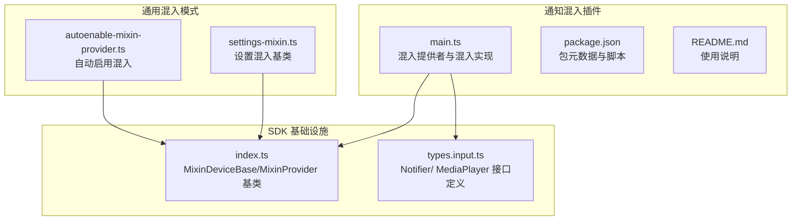
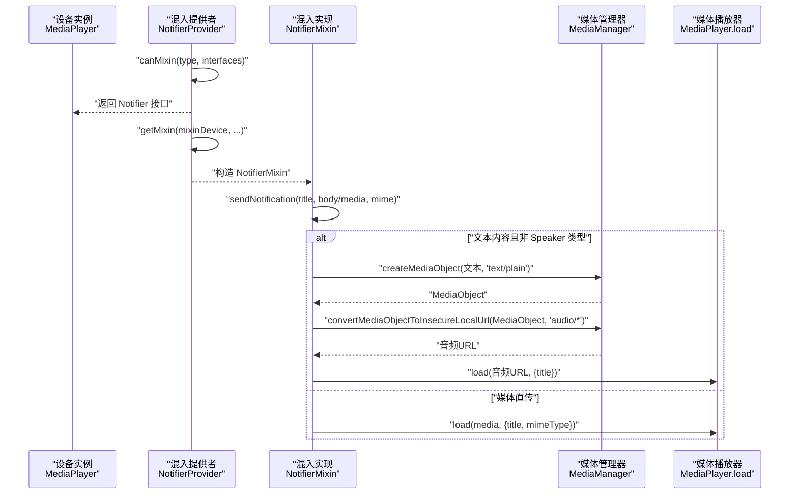
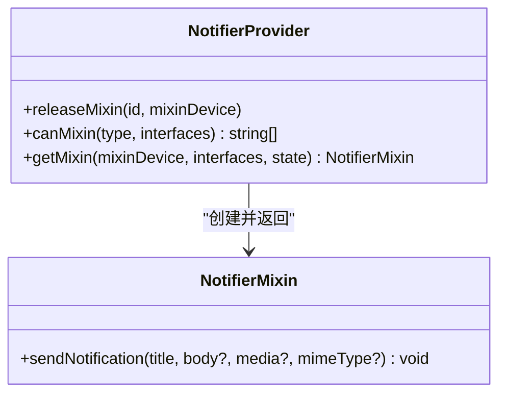
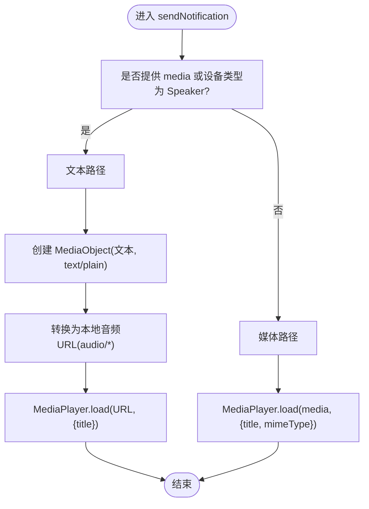
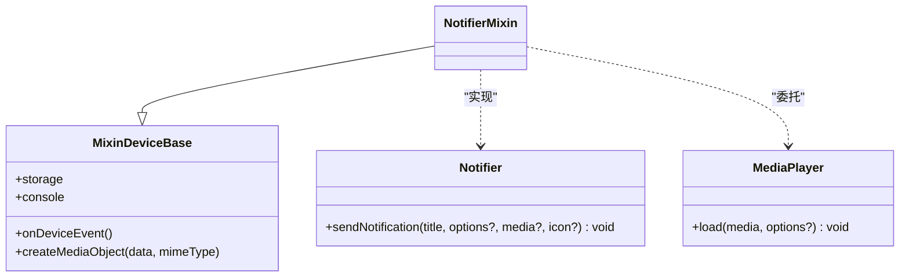
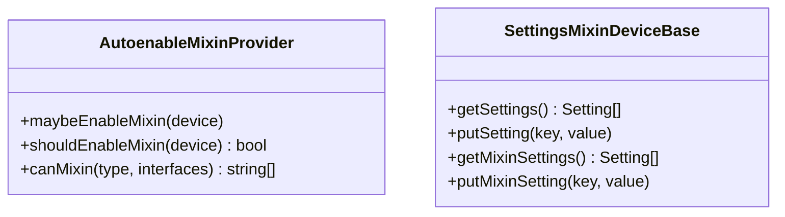
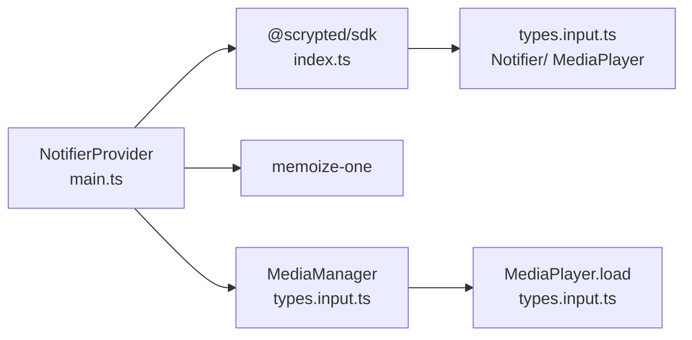

# 通知混入功能

<cite>
**本文引用的文件**
- [plugins/notifier-mixin/src/main.ts](file://plugins/notifier-mixin/src/main.ts)
- [plugins/notifier-mixin/package.json](file://plugins/notifier-mixin/package.json)
- [plugins/notifier-mixin/README.md](file://plugins/notifier-mixin/README.md)
- [sdk/src/index.ts](file://sdk/src/index.ts)
- [sdk/types/src/types.input.ts](file://sdk/types/src/types.input.ts)
- [common/src/autoenable-mixin-provider.ts](file://common/src/autoenable-mixin-provider.ts)
- [common/src/settings-mixin.ts](file://common/src/settings-mixin.ts)
</cite>

## 目录
1. [简介](#简介)
2. [项目结构](#项目结构)
3. [核心组件](#核心组件)
4. [架构总览](#架构总览)
5. [详细组件分析](#详细组件分析)
6. [依赖分析](#依赖分析)
7. [性能考虑](#性能考虑)
8. [故障排除指南](#故障排除指南)
9. [结论](#结论)
10. [附录](#附录)

## 简介
通知混入（Notifier Mixin）是 Scrypted 生态中的一个可选混入插件，用于将“通知”能力注入到具备“媒体播放器”接口的设备中，使这些设备（如智能音箱、智能显示器等）能够接收并播放通知音频或媒体内容。该混入通过将 Notifier 接口与 MediaPlayer 接口结合，实现了“文本转语音”和“媒体加载”的统一通知通道。

本文件面向开发者与运维人员，系统性阐述通知混入的实现原理、配置方法、使用场景、工作机制（事件监听、消息生成、通知发送、状态同步）、通用接口实现（通知类型定义、消息模板、触发条件、执行策略）、状态管理（通知历史记录、重复过滤、优先级处理、失败重试）、配置参数说明以及故障排除指南。

## 项目结构
通知混入位于 plugins/notifier-mixin 目录，核心代码由单个入口文件组成，并通过 SDK 提供的混入基础设施完成接口注入与生命周期管理。

**图表来源**
- [plugins/notifier-mixin/src/main.ts:1-64](file://plugins/notifier-mixin/src/main.ts#L1-L64)
- [plugins/notifier-mixin/package.json:1-41](file://plugins/notifier-mixin/package.json#L1-L41)
- [sdk/src/index.ts:87-204](file://sdk/src/index.ts#L87-L204)
- [sdk/types/src/types.input.ts:289-292](file://sdk/types/src/types.input.ts#L289-L292)
- [sdk/types/src/types.input.ts:1395-1412](file://sdk/types/src/types.input.ts#L1395-L1412)
- [common/src/autoenable-mixin-provider.ts:1-85](file://common/src/autoenable-mixin-provider.ts#L1-L85)
- [common/src/settings-mixin.ts:1-88](file://common/src/settings-mixin.ts#L1-L88)

**章节来源**
- [plugins/notifier-mixin/src/main.ts:1-64](file://plugins/notifier-mixin/src/main.ts#L1-L64)
- [plugins/notifier-mixin/package.json:1-41](file://plugins/notifier-mixin/package.json#L1-L41)
- [plugins/notifier-mixin/README.md:1-16](file://plugins/notifier-mixin/README.md#L1-L16)

## 核心组件
- 混入提供者（MixinProvider）
  - 负责声明可混入的设备类型与接口，将 MediaPlayer 设备转换为具备 Notifier 能力的混入设备。
- 通知混入实现（MixinDeviceBase<MediaPlayer> 实现 Notifier）
  - 将 sendNotification 请求转换为媒体加载（load），支持文本转语音与媒体直传两种路径。
- SDK 基础设施
  - MixinDeviceBase 提供混入设备的存储、日志、事件派发与设备状态访问。
  - Notifier/ MediaPlayer 接口定义了通知发送与媒体播放的标准契约。
- 通用混入模式
  - AutoenableMixinProvider：自动为符合条件的设备启用混入。
  - SettingsMixinDeviceBase：为混入扩展设置项。

**章节来源**
- [plugins/notifier-mixin/src/main.ts:49-61](file://plugins/notifier-mixin/src/main.ts#L49-L61)
- [plugins/notifier-mixin/src/main.ts:19-47](file://plugins/notifier-mixin/src/main.ts#L19-L47)
- [sdk/src/index.ts:87-204](file://sdk/src/index.ts#L87-L204)
- [sdk/types/src/types.input.ts:289-292](file://sdk/types/src/types.input.ts#L289-L292)
- [sdk/types/src/types.input.ts:1395-1412](file://sdk/types/src/types.input.ts#L1395-L1412)
- [common/src/autoenable-mixin-provider.ts:1-85](file://common/src/autoenable-mixin-provider.ts#L1-L85)
- [common/src/settings-mixin.ts:1-88](file://common/src/settings-mixin.ts#L1-L88)

## 架构总览
通知混入的运行时架构围绕“混入提供者 + 混入实现 + SDK 基础设施”展开，下图展示了从设备发现到通知发送的关键交互：

**图表来源**
- [plugins/notifier-mixin/src/main.ts:24-46](file://plugins/notifier-mixin/src/main.ts#L24-L46)
- [sdk/types/src/types.input.ts:289-292](file://sdk/types/src/types.input.ts#L289-L292)
- [sdk/types/src/types.input.ts:1395-1412](file://sdk/types/src/types.input.ts#L1395-L1412)
- [sdk/types/src/types.input.ts:1914-1944](file://sdk/types/src/types.input.ts#L1914-L1944)

## 详细组件分析

### 组件一：混入提供者（NotifierProvider）
- 角色与职责
  - 声明对具备 MediaPlayer 接口的设备进行混入，输出 Notifier 接口。
  - 在 canMixin 中检查接口集合，确保仅对满足条件的设备启用。
- 关键点
  - 通过接口匹配决定是否返回 Notifier。
  - getMixin 返回具体的 NotifierMixin 实例。

**图表来源**
- [plugins/notifier-mixin/src/main.ts:49-61](file://plugins/notifier-mixin/src/main.ts#L49-L61)

**章节来源**
- [plugins/notifier-mixin/src/main.ts:49-61](file://plugins/notifier-mixin/src/main.ts#L49-L61)

### 组件二：通知混入实现（NotifierMixin）
- 角色与职责
  - 实现 Notifier 接口，将通知请求委派给底层 MediaPlayer。
  - 对文本内容进行缓存优化（memoize-one），避免重复 TTS 转换。
  - 支持两类输入：
    - 文本：通过媒体管理器创建 MediaObject 并转换为本地音频 URL 后播放。
    - 媒体：直接传递媒体对象或 URL 到 MediaPlayer.load。
- 关键流程
  - 文本路径：文本 -> MediaObject -> 音频 URL -> load。
  - 媒体路径：媒体对象/URL -> load。
  - 错误处理：TTS 失败时清理缓存，保证后续重试。

**图表来源**
- [plugins/notifier-mixin/src/main.ts:24-46](file://plugins/notifier-mixin/src/main.ts#L24-L46)
- [sdk/types/src/types.input.ts:1914-1944](file://sdk/types/src/types.input.ts#L1914-L1944)

**章节来源**
- [plugins/notifier-mixin/src/main.ts:19-47](file://plugins/notifier-mixin/src/main.ts#L19-L47)

### 组件三：SDK 基础设施与接口契约
- MixinDeviceBase
  - 提供混入设备的存储、日志、事件派发与设备状态访问。
  - 作为混入实现的基础类，屏蔽设备与混入之间的差异。
- Notifier 接口
  - 定义 sendNotification 方法，支持标题、选项、媒体与图标。
- MediaPlayer 接口
  - 定义 load 方法，用于加载媒体并播放，支持标题与 MIME 类型。

**图表来源**
- [sdk/src/index.ts:87-204](file://sdk/src/index.ts#L87-L204)
- [sdk/types/src/types.input.ts:289-292](file://sdk/types/src/types.input.ts#L289-L292)
- [sdk/types/src/types.input.ts:1395-1412](file://sdk/types/src/types.input.ts#L1395-L1412)

**章节来源**
- [sdk/src/index.ts:87-204](file://sdk/src/index.ts#L87-L204)
- [sdk/types/src/types.input.ts:289-292](file://sdk/types/src/types.input.ts#L289-L292)
- [sdk/types/src/types.input.ts:1395-1412](file://sdk/types/src/types.input.ts#L1395-L1412)

### 组件四：通用混入模式
- 自动启用混入（AutoenableMixinProvider）
  - 监听系统设备变更，按条件自动为设备添加混入。
- 设置混入（SettingsMixinDeviceBase）
  - 为混入扩展设置项，合并设备原设置与混入设置，提供统一的 UI 展示。

**图表来源**
- [common/src/autoenable-mixin-provider.ts:1-85](file://common/src/autoenable-mixin-provider.ts#L1-L85)
- [common/src/settings-mixin.ts:1-88](file://common/src/settings-mixin.ts#L1-L88)

**章节来源**
- [common/src/autoenable-mixin-provider.ts:1-85](file://common/src/autoenable-mixin-provider.ts#L1-L85)
- [common/src/settings-mixin.ts:1-88](file://common/src/settings-mixin.ts#L1-L88)

## 依赖分析
- 内部依赖
  - @scrypted/sdk：提供混入基础设施、接口定义与媒体管理器。
  - memoize-one：对文本转语音结果进行缓存，避免重复转换。
- 外部集成
  - MediaPlayer.load：最终的媒体播放调用。
  - MediaManager：负责媒体对象创建与本地 URL 转换。

**图表来源**
- [plugins/notifier-mixin/src/main.ts:1-64](file://plugins/notifier-mixin/src/main.ts#L1-L64)
- [plugins/notifier-mixin/package.json:33-35](file://plugins/notifier-mixin/package.json#L33-L35)
- [sdk/src/index.ts:1-297](file://sdk/src/index.ts#L1-L297)
- [sdk/types/src/types.input.ts:1914-1944](file://sdk/types/src/types.input.ts#L1914-L1944)
- [sdk/types/src/types.input.ts:289-292](file://sdk/types/src/types.input.ts#L289-L292)
- [sdk/types/src/types.input.ts:1395-1412](file://sdk/types/src/types.input.ts#L1395-L1412)

**章节来源**
- [plugins/notifier-mixin/src/main.ts:1-64](file://plugins/notifier-mixin/src/main.ts#L1-L64)
- [plugins/notifier-mixin/package.json:33-35](file://plugins/notifier-mixin/package.json#L33-L35)

## 性能考虑
- 文本转语音缓存
  - 使用 memoize-one 缓存 TTS 结果，减少重复转换开销；当转换失败时主动清理缓存，避免污染。
- 媒体直传路径
  - 若直接提供媒体对象或 URL，则跳过 TTS 步骤，降低延迟与资源消耗。
- 并发与节流
  - 对多扬声器场景，建议在上层应用侧控制并发，避免同时触发多次 TTS 转换。
- 媒体 URL 转换
  - 本地 URL 转换可减少网络往返，提高播放稳定性。

**章节来源**
- [plugins/notifier-mixin/src/main.ts:8-17](file://plugins/notifier-mixin/src/main.ts#L8-L17)
- [plugins/notifier-mixin/src/main.ts:24-46](file://plugins/notifier-mixin/src/main.ts#L24-L46)
- [sdk/types/src/types.input.ts:1914-1944](file://sdk/types/src/types.input.ts#L1914-L1944)

## 故障排除指南
- 通知未播放
  - 检查设备是否具备 MediaPlayer 接口，混入提供者是否正确返回 Notifier。
  - 确认 MediaPlayer.load 是否被调用，以及媒体 URL 可访问性。
- 文本转语音失败
  - 查看 TTS 转换日志；若失败会清理缓存，稍后重试。
  - 确保媒体管理器可将文本转换为音频 URL。
- 重复发送与抖动
  - 若同一文本频繁触发，缓存可避免重复 TTS；如需强制刷新，可清理缓存或更换文本内容。
- 配置错误
  - 确认混入已正确附加到目标设备；检查设备接口列表是否包含 MediaPlayer。
  - 如需自动启用，可参考 AutoenableMixinProvider 模式进行配置。

**章节来源**
- [plugins/notifier-mixin/src/main.ts:24-46](file://plugins/notifier-mixin/src/main.ts#L24-L46)
- [common/src/autoenable-mixin-provider.ts:51-74](file://common/src/autoenable-mixin-provider.ts#L51-L74)

## 结论
通知混入通过将 Notifier 接口与 MediaPlayer 接口无缝结合，为智能音箱、智能显示器等设备提供了统一的通知播放能力。其核心优势在于：
- 简洁的接口契约与成熟的混入基础设施。
- 文本转语音的缓存优化，兼顾性能与一致性。
- 易于扩展的设置与自动启用机制，便于大规模部署。

在实际使用中，建议根据设备类型与网络环境选择合适的媒体直传或 TTS 路径，并配合日志与监控定位异常。

## 附录

### 通知混入的通用接口实现要点
- 通知类型与消息模板
  - NotifierOptions 支持标题、副标题、正文、语言、标签、静默、关键通知等字段，可用于构建跨平台的消息模板。
- 触发条件与执行策略
  - 可通过自动化规则或事件监听触发 sendNotification；执行策略建议在上层应用中统一编排，避免并发抖动。
- 状态同步
  - 通过 MediaPlayer 的状态与事件，实现播放进度、音量与设备在线状态的同步。

**章节来源**
- [sdk/types/src/types.input.ts:259-285](file://sdk/types/src/types.input.ts#L259-L285)
- [sdk/types/src/types.input.ts:289-292](file://sdk/types/src/types.input.ts#L289-L292)
- [sdk/types/src/types.input.ts:1395-1412](file://sdk/types/src/types.input.ts#L1395-L1412)

### 配置参数说明（基于现有文件）
- 包元数据与脚本
  - 名称、版本、关键字、脚本命令（构建、调试、部署）等。
- 插件类型与接口
  - 类型为 API，接口包含 MixinProvider。
- 依赖
  - @scrypted/sdk（开发依赖）、memoize-one（运行时依赖）。

**章节来源**
- [plugins/notifier-mixin/package.json:1-41](file://plugins/notifier-mixin/package.json#L1-L41)