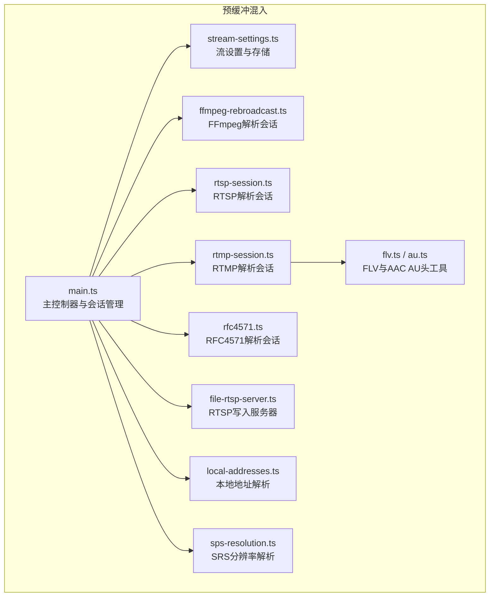
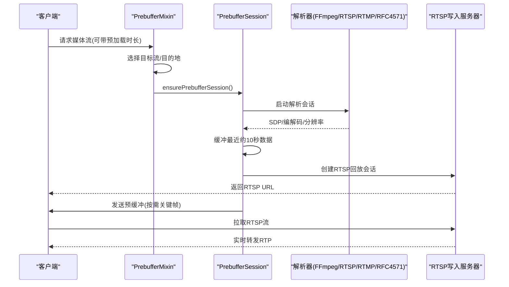
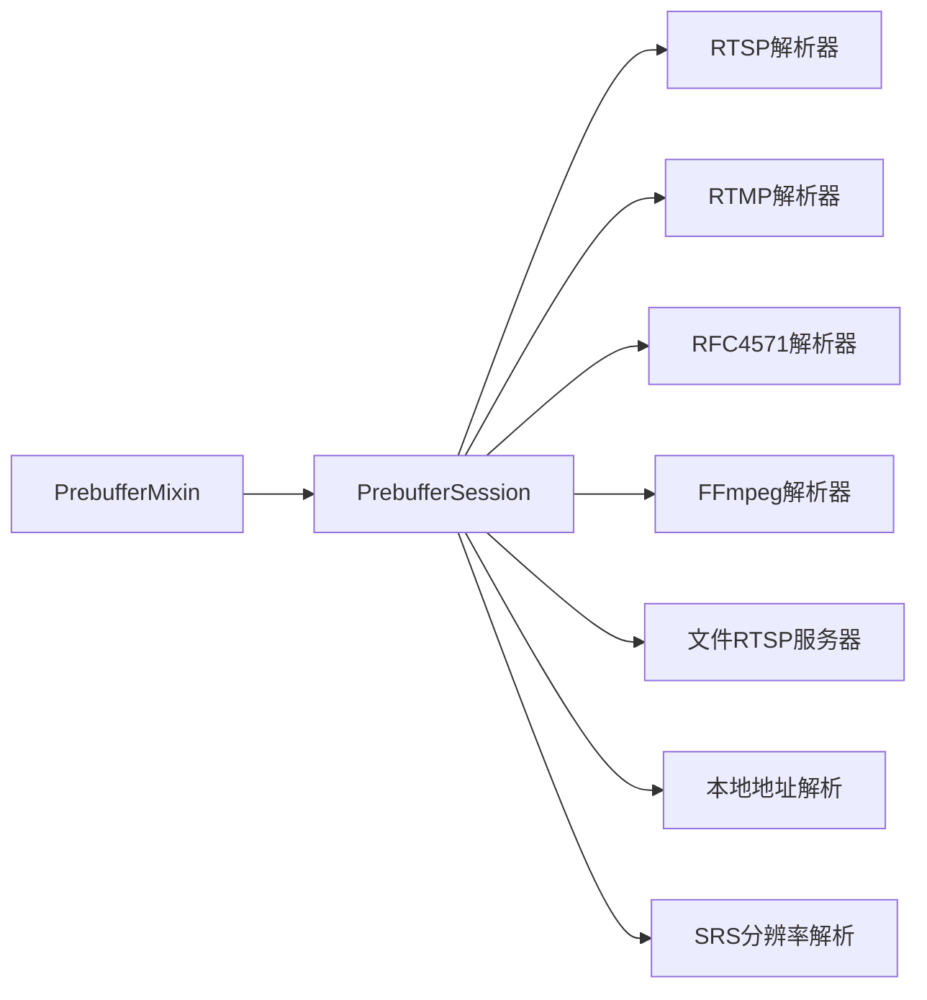

# 预缓冲混入功能

<cite>
**本文引用的文件**
- [plugins/prebuffer-mixin/src/main.ts](file://plugins/prebuffer-mixin/src/main.ts)
- [plugins/prebuffer-mixin/src/stream-settings.ts](file://plugins/prebuffer-mixin/src/stream-settings.ts)
- [plugins/prebuffer-mixin/src/ffmpeg-rebroadcast.ts](file://plugins/prebuffer-mixin/src/ffmpeg-rebroadcast.ts)
- [plugins/prebuffer-mixin/src/rtsp-session.ts](file://plugins/prebuffer-mixin/src/rtsp-session.ts)
- [plugins/prebuffer-mixin/src/rtmp-session.ts](file://plugins/prebuffer-mixin/src/rtmp-session.ts)
- [plugins/prebuffer-mixin/src/rfc4571.ts](file://plugins/prebuffer-mixin/src/rfc4571.ts)
- [plugins/prebuffer-mixin/src/flv.ts](file://plugins/prebuffer-mixin/src/flv.ts)
- [plugins/prebuffer-mixin/src/au.ts](file://plugins/prebuffer-mixin/src/au.ts)
- [plugins/prebuffer-mixin/src/file-rtsp-server.ts](file://plugins/prebuffer-mixin/src/file-rtsp-server.ts)
- [plugins/prebuffer-mixin/src/local-addresses.ts](file://plugins/prebuffer-mixin/src/local-addresses.ts)
- [plugins/prebuffer-mixin/src/sps-resolution.ts](file://plugins/prebuffer-mixin/src/sps-resolution.ts)
- [plugins/prebuffer-mixin/package.json](file://plugins/prebuffer-mixin/package.json)
- [plugins/prebuffer-mixin/README.md](file://plugins/prebuffer-mixin/README.md)
</cite>

## 目录
1. [简介](#简介)
2. [项目结构](#项目结构)
3. [核心组件](#核心组件)
4. [架构总览](#架构总览)
5. [详细组件分析](#详细组件分析)
6. [依赖关系分析](#依赖关系分析)
7. [性能考量](#性能考量)
8. [故障排除指南](#故障排除指南)
9. [结论](#结论)
10. [附录](#附录)

## 简介
本文件系统性阐述 Scrypted 预缓冲混入（Prebuffer Mixin）的功能与实现，涵盖以下主题：
- 预缓冲工作机制：缓冲区管理、数据预加载、流媒体处理、性能优化
- 通用接口实现：缓冲策略配置、预加载参数、流媒体转换、质量控制
- 状态管理：缓冲状态监控、内存使用控制、性能指标统计、异常处理
- 配置参数说明：缓冲大小、预加载时长、编码参数、网络优化
- 故障排除：常见问题诊断与解决方法

该插件通过在后台维护与摄像头的实时连接并缓存最近视频片段，显著降低首次播放延迟，并为 HomeKit Secure Video 等场景提供“即时回放”能力。

## 项目结构
预缓冲混入位于 plugins/prebuffer-mixin，核心由主控制器、会话管理、解析器、RTSP/RTMP/RFC4571 解析、FFmpeg 重广播、本地地址解析、SRS 分辨率解析等模块组成。

图示来源
- [plugins/prebuffer-mixin/src/main.ts:1103-1526](file://plugins/prebuffer-mixin/src/main.ts#L1103-L1526)
- [plugins/prebuffer-mixin/src/stream-settings.ts:43-267](file://plugins/prebuffer-mixin/src/stream-settings.ts#L43-L267)
- [plugins/prebuffer-mixin/src/ffmpeg-rebroadcast.ts:107-289](file://plugins/prebuffer-mixin/src/ffmpeg-rebroadcast.ts#L107-L289)
- [plugins/prebuffer-mixin/src/rtsp-session.ts:17-234](file://plugins/prebuffer-mixin/src/rtsp-session.ts#L17-L234)
- [plugins/prebuffer-mixin/src/rtmp-session.ts:20-224](file://plugins/prebuffer-mixin/src/rtmp-session.ts#L20-L224)
- [plugins/prebuffer-mixin/src/rfc4571.ts:66-221](file://plugins/prebuffer-mixin/src/rfc4571.ts#L66-L221)
- [plugins/prebuffer-mixin/src/file-rtsp-server.ts:11-112](file://plugins/prebuffer-mixin/src/file-rtsp-server.ts#L11-L112)
- [plugins/prebuffer-mixin/src/local-addresses.ts:4-36](file://plugins/prebuffer-mixin/src/local-addresses.ts#L4-L36)
- [plugins/prebuffer-mixin/src/sps-resolution.ts:3-49](file://plugins/prebuffer-mixin/src/sps-resolution.ts#L3-L49)
- [plugins/prebuffer-mixin/src/flv.ts:272-366](file://plugins/prebuffer-mixin/src/flv.ts#L272-L366)
- [plugins/prebuffer-mixin/src/au.ts:67-116](file://plugins/prebuffer-mixin/src/au.ts#L67-L116)

章节来源
- [plugins/prebuffer-mixin/README.md:1-20](file://plugins/prebuffer-mixin/README.md#L1-L20)
- [plugins/prebuffer-mixin/package.json:1-51](file://plugins/prebuffer-mixin/package.json#L1-L51)

## 核心组件
- 主控制器 PrebufferMixin：负责启动/停止预缓冲会话、选择目标流、对外提供 FFmpeg 输入、管理 RTSP 写入服务器、监听设备事件以动态调整。
- PrebufferSession：每个媒体流对应一个会话，负责：
  - 启动解析器（RTSP/RTMP/RFC4571 或 FFmpeg）
  - 维护固定时长的环形缓冲（默认约 10 秒）
  - 检测关键帧间隔、编解码信息、分辨率
  - 为外部客户端提供 RTSP 回放（含预缓冲）
- 流设置 StreamSettings：集中管理本地/远程/低分辨率/录制等多目的地流的选择与启用。
- FFmpeg 解析会话：统一抽象 FFmpeg 子进程输出到解析器的管道模型，支持超时与活动计时。
- RTSP/RTMP/RFC4571 解析器：分别对接标准 RTSP、RTMP（FLV→RTP）、以及 RFC4571 自定义协议。
- 文件 RTSP 服务器：扩展的 RTSP 服务，支持将 RTP 负载写入文件，便于录制与调试。
- 本地地址解析：根据系统端点返回可访问的本地地址列表，用于生成回放 URL。
- SPS 分辨率解析：从 SPS 中提取分辨率，辅助 UI 展示与质量控制。

章节来源
- [plugins/prebuffer-mixin/src/main.ts:1103-1526](file://plugins/prebuffer-mixin/src/main.ts#L1103-L1526)
- [plugins/prebuffer-mixin/src/stream-settings.ts:43-267](file://plugins/prebuffer-mixin/src/stream-settings.ts#L43-L267)
- [plugins/prebuffer-mixin/src/ffmpeg-rebroadcast.ts:107-289](file://plugins/prebuffer-mixin/src/ffmpeg-rebroadcast.ts#L107-L289)
- [plugins/prebuffer-mixin/src/rtsp-session.ts:17-234](file://plugins/prebuffer-mixin/src/rtsp-session.ts#L17-L234)
- [plugins/prebuffer-mixin/src/rtmp-session.ts:20-224](file://plugins/prebuffer-mixin/src/rtmp-session.ts#L20-L224)
- [plugins/prebuffer-mixin/src/rfc4571.ts:66-221](file://plugins/prebuffer-mixin/src/rfc4571.ts#L66-L221)
- [plugins/prebuffer-mixin/src/file-rtsp-server.ts:11-112](file://plugins/prebuffer-mixin/src/file-rtsp-server.ts#L11-L112)
- [plugins/prebuffer-mixin/src/local-addresses.ts:4-36](file://plugins/prebuffer-mixin/src/local-addresses.ts#L4-L36)
- [plugins/prebuffer-mixin/src/sps-resolution.ts:3-49](file://plugins/prebuffer-mixin/src/sps-resolution.ts#L3-L49)

## 架构总览
下图展示从设备请求到预缓冲回放的关键流程：

图示来源
- [plugins/prebuffer-mixin/src/main.ts:1252-1318](file://plugins/prebuffer-mixin/src/main.ts#L1252-L1318)
- [plugins/prebuffer-mixin/src/main.ts:910-1100](file://plugins/prebuffer-mixin/src/main.ts#L910-L1100)
- [plugins/prebuffer-mixin/src/ffmpeg-rebroadcast.ts:107-289](file://plugins/prebuffer-mixin/src/ffmpeg-rebroadcast.ts#L107-L289)
- [plugins/prebuffer-mixin/src/rtsp-session.ts:17-234](file://plugins/prebuffer-mixin/src/rtsp-session.ts#L17-L234)
- [plugins/prebuffer-mixin/src/rtmp-session.ts:20-224](file://plugins/prebuffer-mixin/src/rtmp-session.ts#L20-L224)
- [plugins/prebuffer-mixin/src/rfc4571.ts:66-221](file://plugins/prebuffer-mixin/src/rfc4571.ts#L66-L221)
- [plugins/prebuffer-mixin/src/file-rtsp-server.ts:11-112](file://plugins/prebuffer-mixin/src/file-rtsp-server.ts#L11-L112)

## 详细组件分析

### 主控制器 PrebufferMixin
- 角色与职责
  - 维护多个 PrebufferSession，按流 ID 管理
  - 根据目的地自动选择最优流（本地/远程/低分辨率/录制）
  - 启动内置 RTSP 写入服务器，供外部客户端直接拉流
  - 监听设置变更与设备事件，动态重启会话
- 关键行为
  - 延迟启动（避免启动风暴）
  - 电池/充电状态感知，低电量或未充电时仅按需工作
  - 外部 RTSP 客户端接入时，按路径路由到对应会话
- 并发与生命周期
  - 每个会话独立生命周期，支持超时与空闲回收
  - 支持隐私模式禁用流

章节来源
- [plugins/prebuffer-mixin/src/main.ts:1103-1526](file://plugins/prebuffer-mixin/src/main.ts#L1103-L1526)

### PrebufferSession 会话
- 缓冲机制
  - 固定时长环形缓冲（默认约 10 秒），基于时间戳滑动移除旧数据
  - 可搜索关键帧（IDR）以确保外部解码器能从同步帧开始
- 解析器选择
  - 自动选择 RTSP/RTMP/RFC4571 或 FFmpeg 解析
  - UDP/TCP 与 Scrypted/FFmpeg 解析器可配置
- 输出协商
  - 基于上游编解码与请求协商下游媒体参数
  - 自动检测分辨率与关键帧间隔，用于预加载策略
- 外部客户端接入
  - 为每个客户端建立独立 RTSP 回放通道
  - 控制预缓冲发送与音频过滤

章节来源
- [plugins/prebuffer-mixin/src/main.ts:44-151](file://plugins/prebuffer-mixin/src/main.ts#L44-L151)
- [plugins/prebuffer-mixin/src/main.ts:460-719](file://plugins/prebuffer-mixin/src/main.ts#L460-L719)
- [plugins/prebuffer-mixin/src/main.ts:910-1100](file://plugins/prebuffer-mixin/src/main.ts#L910-L1100)

### FFmpeg 解析会话
- 抽象模型
  - 将 FFmpeg 子进程输出通过管道交给解析器
  - 支持 TCP 协议与命名管道两种方式
  - 提供 SDP 获取、活动超时、协商媒体参数、生命周期管理
- 超时与健壮性
  - 基于活动计时器的超时保护
  - 异常时安全终止子进程

章节来源
- [plugins/prebuffer-mixin/src/ffmpeg-rebroadcast.ts:107-289](file://plugins/prebuffer-mixin/src/ffmpeg-rebroadcast.ts#L107-L289)

### RTSP/RTMP/RFC4571 解析器
- RTSP 解析
  - 支持 UDP/TCP 两种传输
  - 解析 SDP，建立 RTP/RTCP 通道，映射 interleaved 编号
- RTMP 解析
  - 解析 FLV 音视频标签，转换为 RTP（H.264/NALU、AAC AU）
  - 使用 H264 Repacketizer 与 AU 头工具
- RFC4571 解析
  - 从自定义 TCP 流中按长度前缀解析音视频负载
  - 从 SPS 或比特流中提取分辨率

章节来源
- [plugins/prebuffer-mixin/src/rtsp-session.ts:17-234](file://plugins/prebuffer-mixin/src/rtsp-session.ts#L17-L234)
- [plugins/prebuffer-mixin/src/rtmp-session.ts:20-224](file://plugins/prebuffer-mixin/src/rtmp-session.ts#L20-L224)
- [plugins/prebuffer-mixin/src/rfc4571.ts:66-221](file://plugins/prebuffer-mixin/src/rfc4571.ts#L66-L221)
- [plugins/prebuffer-mixin/src/flv.ts:272-366](file://plugins/prebuffer-mixin/src/flv.ts#L272-L366)
- [plugins/prebuffer-mixin/src/au.ts:67-116](file://plugins/prebuffer-mixin/src/au.ts#L67-L116)

### 文件 RTSP 服务器
- 扩展功能
  - 支持 WRITE/WRITESIZE 选项，将 RTP 负载写入文件
  - 高水位与溢出保护，防止内存/磁盘压力过大
- 使用场景
  - 录制调试、离线分析

章节来源
- [plugins/prebuffer-mixin/src/file-rtsp-server.ts:11-112](file://plugins/prebuffer-mixin/src/file-rtsp-server.ts#L11-L112)

### 本地地址解析
- 功能
  - 根据系统端点返回可访问的本地地址列表
  - 支持集群地址覆盖
- 用途
  - 生成回放 URL，便于内网直连

章节来源
- [plugins/prebuffer-mixin/src/local-addresses.ts:4-36](file://plugins/prebuffer-mixin/src/local-addresses.ts#L4-L36)

### SPS 分辨率解析
- 功能
  - 从 SPS 参数计算分辨率（考虑色度格式与裁剪）
- 用途
  - UI 展示与质量控制

章节来源
- [plugins/prebuffer-mixin/src/sps-resolution.ts:3-49](file://plugins/prebuffer-mixin/src/sps-resolution.ts#L3-L49)

## 依赖关系分析
- 模块耦合
  - PrebufferMixin 与 PrebufferSession 高内聚，面向接口松耦合
  - 解析器模块（RTSP/RTMP/RFC4571/FFmpeg）通过统一 ParserSession 接口被复用
  - 流设置模块集中管理流选择与启用，避免分散配置
- 外部依赖
  - FFmpeg 子进程、RTSP/RTMP 客户端库、h264-sps-parser
- 循环依赖
  - 无直接循环；会话释放与主控制器释放通过引用解除

图示来源
- [plugins/prebuffer-mixin/src/main.ts:1103-1526](file://plugins/prebuffer-mixin/src/main.ts#L1103-L1526)
- [plugins/prebuffer-mixin/src/stream-settings.ts:43-267](file://plugins/prebuffer-mixin/src/stream-settings.ts#L43-L267)
- [plugins/prebuffer-mixin/src/ffmpeg-rebroadcast.ts:107-289](file://plugins/prebuffer-mixin/src/ffmpeg-rebroadcast.ts#L107-L289)
- [plugins/prebuffer-mixin/src/rtsp-session.ts:17-234](file://plugins/prebuffer-mixin/src/rtsp-session.ts#L17-L234)
- [plugins/prebuffer-mixin/src/rtmp-session.ts:20-224](file://plugins/prebuffer-mixin/src/rtmp-session.ts#L20-L224)
- [plugins/prebuffer-mixin/src/rfc4571.ts:66-221](file://plugins/prebuffer-mixin/src/rfc4571.ts#L66-L221)
- [plugins/prebuffer-mixin/src/file-rtsp-server.ts:11-112](file://plugins/prebuffer-mixin/src/file-rtsp-server.ts#L11-L112)
- [plugins/prebuffer-mixin/src/local-addresses.ts:4-36](file://plugins/prebuffer-mixin/src/local-addresses.ts#L4-L36)
- [plugins/prebuffer-mixin/src/sps-resolution.ts:3-49](file://plugins/prebuffer-mixin/src/sps-resolution.ts#L3-L49)

## 性能考量
- 缓冲策略
  - 默认约 10 秒环形缓冲，按时间戳滑动清理，避免无限增长
  - 预加载时长默认保守值，结合关键帧间隔动态调整
- 网络与传输
  - 支持 UDP/TCP 与 Scrypted/FFmpeg 解析器，按网络条件选择
  - 外部 RTSP 客户端写入采用高水位与溢出保护
- CPU/内存
  - FFmpeg 解析器与 RTP 转换在子进程中执行，减少主线程压力
  - 预缓冲仅缓存必要数据，不进行额外转码（除非显式配置）

## 故障排除指南
- 缓冲不足/首帧缺失
  - 现象：首次播放卡顿或缺少首帧
  - 排查：确认关键帧间隔是否合理（建议 4 秒），检查预加载时长是否足够
  - 参考：关键帧间隔检测与预加载策略
- 延迟增加
  - 现象：播放延迟增大
  - 排查：检查网络传输（UDP/TCP）、解析器类型（Scrypted/FFmpeg）、外部客户端缓冲
- 内存占用过高
  - 现象：内存持续上升
  - 排查：确认预缓冲时长与客户端数量；检查是否存在长时间未断开的客户端
  - 参考：写入服务器溢出保护与客户端关闭回调
- 无音频/音频异常
  - 现象：无音频或音频不同步
  - 排查：软静音标志、上游音频编解码与请求不一致、RTMP 音频解析
- 电池供电设备无法预缓冲
  - 现象：低电量或未充电时预缓冲仅按需
  - 排查：检查电池/充电状态与策略配置

章节来源
- [plugins/prebuffer-mixin/src/main.ts:725-787](file://plugins/prebuffer-mixin/src/main.ts#L725-L787)
- [plugins/prebuffer-mixin/src/main.ts:851-862](file://plugins/prebuffer-mixin/src/main.ts#L851-L862)
- [plugins/prebuffer-mixin/src/file-rtsp-server.ts:98-111](file://plugins/prebuffer-mixin/src/file-rtsp-server.ts#L98-L111)
- [plugins/prebuffer-mixin/src/rtsp-session.ts:17-234](file://plugins/prebuffer-mixin/src/rtsp-session.ts#L17-L234)
- [plugins/prebuffer-mixin/src/rtmp-session.ts:20-224](file://plugins/prebuffer-mixin/src/rtmp-session.ts#L20-L224)

## 结论
预缓冲混入通过“后台持久连接 + 固定时长环形缓冲”的设计，在保证低延迟与高质量的同时，兼顾了资源消耗与稳定性。其模块化架构便于扩展新的解析器与传输协议，同时提供了完善的配置项与运行时监控，适合在家庭与企业级场景中广泛部署。

## 附录

### 配置参数说明
- 流设置（StreamSettings）
  - 本地流/远程流/低分辨率流/本地录制流/远程录制流：按目的地选择最优流
  - 启用预缓冲流：可多选，建议对需要快速首帧与录制的流启用
  - 禁用音频：当设备无音频或需静音时启用
  - 隐私模式：完全禁用该设备的任何流输出
  - 重播端口：内置 RTSP 写入服务器端口（自动分配）
  - 合成流：通过转码创建额外流，满足不同分辨率/码率需求
- 会话设置（PrebufferSession）
  - RTSP 解析器：可选 Scrypted(UDP/TCP)/FFmpeg(UDP/TCP)，默认 TCP
  - FFmpeg 输入/输出参数：可追加输入/输出参数，影响解析与转码行为
  - 检测到的分辨率/码率/关键帧间隔：用于指导配置与优化
  - 重播 URL（含静音）：供外部客户端直连

章节来源
- [plugins/prebuffer-mixin/src/stream-settings.ts:90-135](file://plugins/prebuffer-mixin/src/stream-settings.ts#L90-L135)
- [plugins/prebuffer-mixin/src/main.ts:282-458](file://plugins/prebuffer-mixin/src/main.ts#L282-L458)
- [plugins/prebuffer-mixin/src/main.ts:460-719](file://plugins/prebuffer-mixin/src/main.ts#L460-L719)