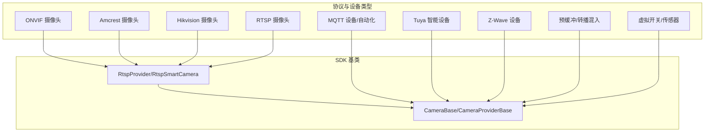
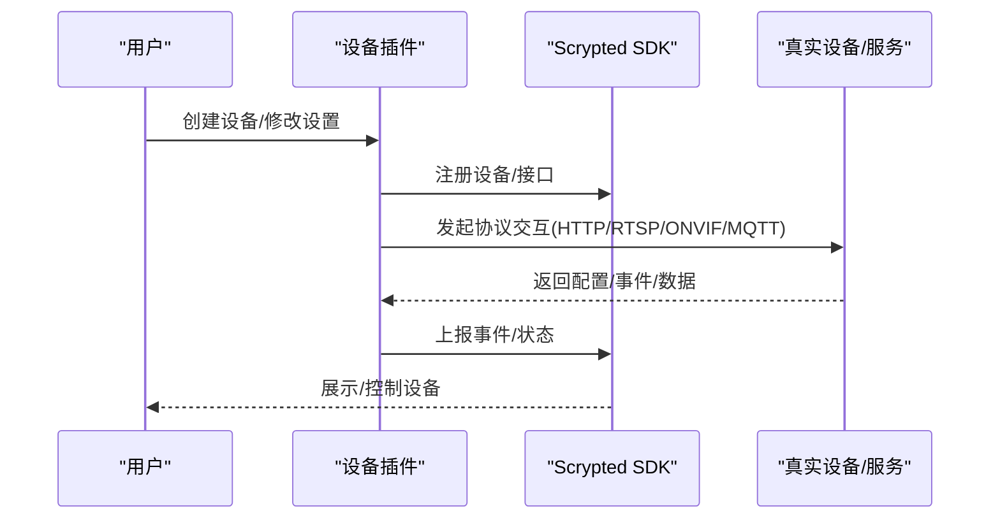
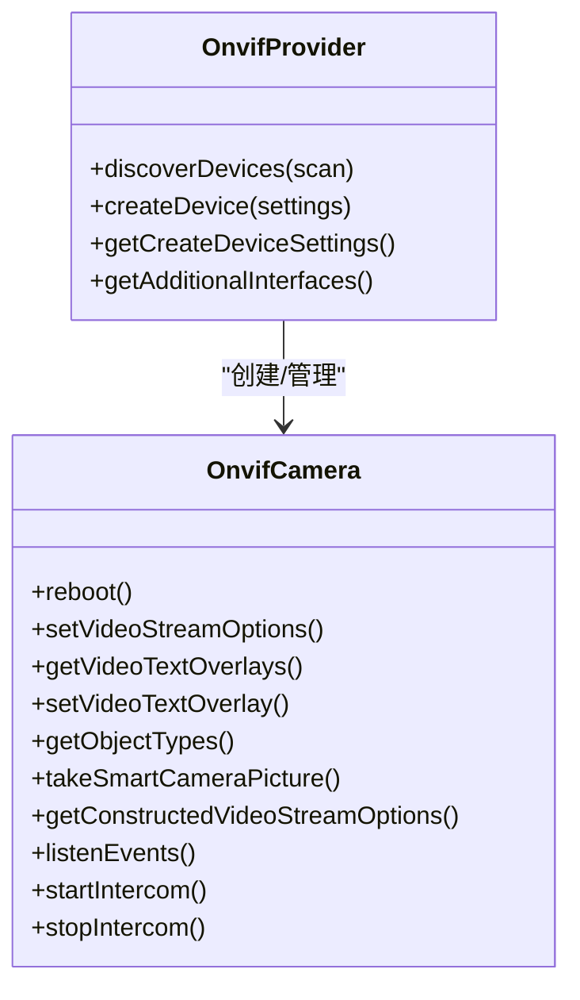
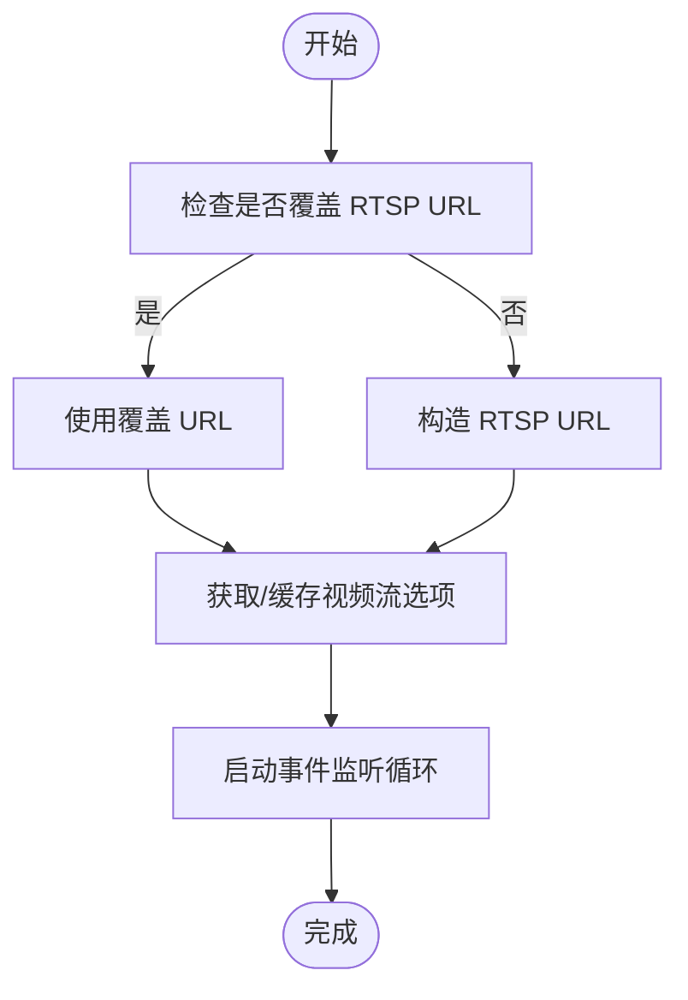
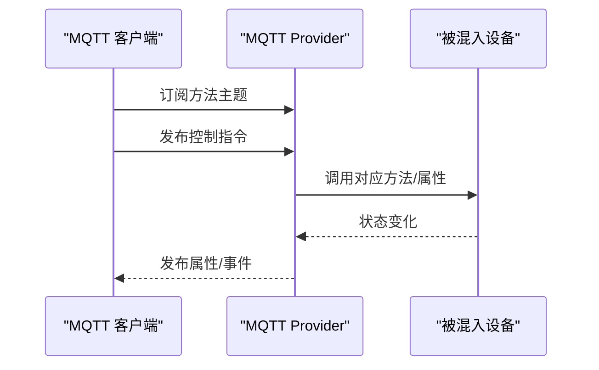
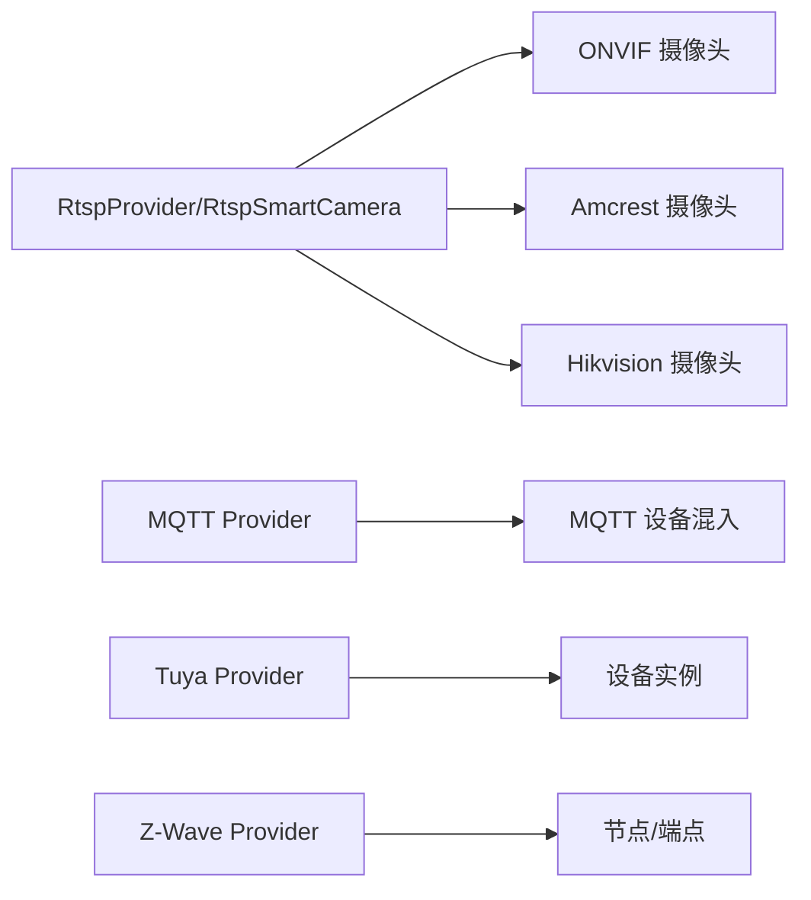

# 设备集成插件

<cite>
**本文引用的文件**
- [README.md](file://README.md)
- [onvif 主入口 main.ts](file://plugins/onvif/src/main.ts)
- [rtsp 提供者 rtsp.ts](file://plugins/rtsp/src/rtsp.ts)
- [rtsp 相机提供者 main.ts](file://plugins/rtsp/src/main.ts)
- [mqtt 主入口 main.ts](file://plugins/mqtt/src/main.ts)
- [amcrest 主入口 main.ts](file://plugins/amcrest/src/main.ts)
- [hikvision 主入口 main.ts](file://plugins/hikvision/src/main.ts)
- [tuya 插件主入口 plugin.ts](file://plugins/tuya/src/plugin.ts)
- [tuya 插件入口 main.ts](file://plugins/tuya/src/main.ts)
- [zwave 主入口 main.ts](file://plugins/zwave/src/main.ts)
- [预缓冲混入 main.ts](file://plugins/prebuffer-mixin/src/main.ts)
- [dummy-switch 提供者 main.ts](file://plugins/dummy-switch/src/main.ts)
</cite>

## 目录
1. [简介](#简介)
2. [项目结构](#项目结构)
3. [核心组件](#核心组件)
4. [架构总览](#架构总览)
5. [详细组件分析](#详细组件分析)
6. [依赖关系分析](#依赖关系分析)
7. [性能考虑](#性能考虑)
8. [故障排除指南](#故障排除指南)
9. [结论](#结论)
10. [附录](#附录)

## 简介
本文件面向 Scrypted 的设备集成插件，系统化梳理 ONVIF、RTSP、HTTP、MQTT 等主流协议在摄像头与安全设备中的实现方式；覆盖 IP/网络/智能摄像头的接入流程、安全设备（门锁、报警器、传感器）的连接与控制、通用设备（开关、灯光、温控）的集成模式；并提供配置参数、功能限制、兼容性说明、故障排除、设备发现与自动配置机制以及性能优化建议。

## 项目结构
- 插件按功能域划分：onvif、rtsp、mqtt、amcrest、hikvision、tuya、zwave、prebuffer-mixin、dummy-switch 等。
- 插件通过 Scrypted SDK 提供统一的设备生命周期管理、事件监听、媒体流处理与设置项。
- 核心能力由通用基类（如 RtspSmartCamera、RtspProvider）复用，减少重复实现。

图示来源
- [onvif 主入口 main.ts:1-622](file://plugins/onvif/src/main.ts#L1-L622)
- [rtsp 提供者 rtsp.ts:1-383](file://plugins/rtsp/src/rtsp.ts#L1-L383)
- [rtsp 相机提供者 main.ts:1-8](file://plugins/rtsp/src/main.ts#L1-L8)
- [mqtt 主入口 main.ts:1-629](file://plugins/mqtt/src/main.ts#L1-L629)
- [amcrest 主入口 main.ts:1-826](file://plugins/amcrest/src/main.ts#L1-L826)
- [hikvision 主入口 main.ts:1-962](file://plugins/hikvision/src/main.ts#L1-L962)
- [tuya 插件主入口 plugin.ts:1-313](file://plugins/tuya/src/plugin.ts#L1-L313)
- [zwave 主入口 main.ts:1-530](file://plugins/zwave/src/main.ts#L1-L530)
- [预缓冲混入 main.ts:1-1723](file://plugins/prebuffer-mixin/src/main.ts#L1-L1723)
- [dummy-switch 提供者 main.ts:1-231](file://plugins/dummy-switch/src/main.ts#L1-L231)

章节来源
- [README.md:1-59](file://README.md#L1-L59)

## 核心组件
- ONVIF 摄像头：基于 ONVIF 协议进行设备发现、事件订阅、PTZ 控制、OSD 文字叠加、两路音频（ONVIF/Intercom）、自动配置等。
- RTSP 摄像头：通用 RTSP 流接入，支持多路流、URL 覆盖、端口覆盖、事件监听循环、快照能力（部分设备）。
- Amcrest/Hikvision 摄像头：在 RTSP 基础上扩展厂商特定 API（如 Amcrest 的 HTTP 配置接口、Hikvision 的 ISAPI），支持智能检测、补光灯、报警开关、PTZ 预置位等。
- MQTT：内置 Aedes 代理、设备状态发布/订阅、Home Assistant 自动发现、脚本化设备（可编写 MQTT 处理脚本）。
- Tuya：云/分享账号登录、MQTT 实时消息、设备列表拉取与状态更新、多种登录方式与国家选择。
- Z-Wave：Z-Wave 驱动、网络加入/排除、安全密钥、节点健康检查、命令类映射到设备接口。
- 预缓冲/转播混入：对视频流进行预缓冲、解析、转码与转播，降低首帧延迟，支持电池供电设备的按需预热。
- 虚拟设备：用于演示与测试，暴露开关、门锁、启动停止、占用/运动/二进制传感器等接口。

章节来源
- [onvif 主入口 main.ts:1-622](file://plugins/onvif/src/main.ts#L1-L622)
- [rtsp 提供者 rtsp.ts:1-383](file://plugins/rtsp/src/rtsp.ts#L1-L383)
- [amcrest 主入口 main.ts:1-826](file://plugins/amcrest/src/main.ts#L1-L826)
- [hikvision 主入口 main.ts:1-962](file://plugins/hikvision/src/main.ts#L1-L962)
- [mqtt 主入口 main.ts:1-629](file://plugins/mqtt/src/main.ts#L1-L629)
- [tuya 插件主入口 plugin.ts:1-313](file://plugins/tuya/src/plugin.ts#L1-L313)
- [zwave 主入口 main.ts:1-530](file://plugins/zwave/src/main.ts#L1-L530)
- [预缓冲混入 main.ts:1-1723](file://plugins/prebuffer-mixin/src/main.ts#L1-L1723)
- [dummy-switch 提供者 main.ts:1-231](file://plugins/dummy-switch/src/main.ts#L1-L231)

## 架构总览
Scrypted 插件通过 Provider/Device 生命周期管理设备，使用 Settings/Mixin 扩展设备能力。媒体流通过 FFmpeg/RTSP/RTMP/WebRTC 等路径接入，事件通过 ONVIF/HTTP/Tuya/Z-Wave 等通道分发。

图示来源
- [onvif 主入口 main.ts:334-622](file://plugins/onvif/src/main.ts#L334-L622)
- [rtsp 提供者 rtsp.ts:378-383](file://plugins/rtsp/src/rtsp.ts#L378-L383)
- [mqtt 主入口 main.ts:349-629](file://plugins/mqtt/src/main.ts#L349-L629)
- [amcrest 主入口 main.ts:706-826](file://plugins/amcrest/src/main.ts#L706-L826)
- [hikvision 主入口 main.ts:32-962](file://plugins/hikvision/src/main.ts#L32-L962)
- [tuya 插件主入口 plugin.ts:146-313](file://plugins/tuya/src/plugin.ts#L146-L313)
- [zwave 主入口 main.ts:39-530](file://plugins/zwave/src/main.ts#L39-L530)

## 详细组件分析

### ONVIF 摄像头插件
- 设备发现：基于 ONVIF Discovery 广播，解析 XAddrs/Scopes，生成待接入设备清单。
- 事件订阅：根据设备支持的事件类型动态启用 ObjectDetector 接口。
- 配置与能力：
  - 支持 ONVIF 设备信息（厂商、序列号、固件、型号）回填。
  - 支持 OSD 文字叠加读写。
  - 支持两路音频（ONVIF Intercom）与门铃事件映射。
  - 支持自动配置（自动推断编码、分辨率、码率）。
  - 支持重启、截图（JPEG 快照或视频首帧回退）。
- 设置项（节选）
  - 用户名/密码/IP/HTTP 端口
  - ONVIF 门铃开关与事件名
  - ONVIF 两路音频开关
  - 自动配置按钮与自动配置参数
  - 高级：HTTP 端口覆盖、跳过校验
- 兼容性与限制
  - 部分设备不支持 JPEG 快照，会回退到视频首帧。
  - OSD 只读文本类型不支持编辑。
  - 两路音频能力取决于设备是否支持 ONVIF Intercom。
- 故障排除
  - 发现失败：确认网络连通、端口开放、防火墙放行。
  - 事件未触发：确认设备事件类型与订阅成功。
  - 两路音频无声：确认设备支持 ONVIF Intercom 或切换到 ONVIF 两路音频。

图示来源
- [onvif 主入口 main.ts:16-622](file://plugins/onvif/src/main.ts#L16-L622)

章节来源
- [onvif 主入口 main.ts:1-622](file://plugins/onvif/src/main.ts#L1-L622)

### RTSP 摄像头插件
- 基于 RtspProvider/RtspSmartCamera 抽象，支持多路 RTSP 流、URL/端口覆盖、事件监听循环、快照能力（部分设备）。
- 关键点
  - URL 覆盖：允许手动指定 RTSP 地址，便于跨网段或反向代理场景。
  - 端口覆盖：HTTP/RTSP 端口可独立覆盖。
  - 事件监听：自动重连、空闲超时、调试日志。
  - 快照：若设备不支持 JPEG 快照，则回退到视频首帧。
- 设置项（节选）
  - RTSP 流 URL 列表（多路）
  - IP/HTTP 端口/RTSP 端口覆盖
  - 调试事件日志
- 兼容性与限制
  - 部分设备不提供快照，需安装快照插件或使用视频首帧。
  - 多路流需确保设备支持并正确配置通道号。

图示来源
- [rtsp 提供者 rtsp.ts:153-383](file://plugins/rtsp/src/rtsp.ts#L153-L383)

章节来源
- [rtsp 提供者 rtsp.ts:1-383](file://plugins/rtsp/src/rtsp.ts#L1-L383)
- [rtsp 相机提供者 main.ts:1-8](file://plugins/rtsp/src/main.ts#L1-L8)

### Amcrest 摄像头插件
- 在 RTSP 基础上，结合 Amcrest HTTP API 进行设备信息、事件、录制回放、OSD 文字叠加、两路音频（Amcrest/ONVIF）等增强。
- 关键点
  - 通道号覆盖：支持指定通道号以适配多路流。
  - 两路音频：优先 ONVIF（通常更稳定），否则使用 Amcrest HTTP 接口。
  - 智能检测：支持人员/人脸/车辆检测事件上报。
  - 补光灯/门锁：部分型号支持作为外设提供。
  - 连续录制：可开启 SD 卡连续录制（受设备支持）。
- 设置项（节选）
  - 门铃类型（Amcrest/Dahua）
  - 两路音频协议选择（None/Amcrest/ONVIF）
  - 通道号覆盖
  - 自动配置按钮与厂商自动配置参数
  - Dahua 门铃：多按键支持、呼叫 ID
- 兼容性与限制
  - 不同型号在事件与音频协议上差异较大，需按设备实际能力启用相应功能。

章节来源
- [amcrest 主入口 main.ts:1-826](file://plugins/amcrest/src/main.ts#L1-L826)

### Hikvision 摄像头插件
- 使用 Hikvision ISAPI 与 HTTP API，支持通道识别、智能检测、补光灯、报警开关、PTZ 控制与预置位。
- 关键点
  - 通道号与摄像头号分离：支持 NVR/多通道场景。
  - 两路音频：优先 ONVIF，否则使用 Hikvision 自有协议并通过 RTP 转发。
  - 智能检测：事件解析与检测类别映射。
  - PTZ：支持预置位、能力声明与命令下发。
  - 补光灯/报警开关：作为子设备提供。
- 设置项（节选）
  - 门铃开关
  - 两路音频协议（Hikvision/ONVIF）
  - 提供的子设备（报警/补光灯）
  - PTZ 能力与预置位
  - RTSP URL 参数覆盖（如传输模式）

章节来源
- [hikvision 主入口 main.ts:1-962](file://plugins/hikvision/src/main.ts#L1-L962)

### MQTT 插件
- 内置 Aedes MQTT 代理（可选），支持设备状态发布/订阅、Home Assistant 自动发现、脚本化设备。
- 关键点
  - 设备发布路径：基于设备 ID 或自定义 URL。
  - 方法调用：订阅方法主题，收到 JSON 参数后调用对应设备方法。
  - 状态发布：设备属性变更时发布保留主题。
  - 脚本设备：可编写 TypeScript 脚本处理消息与控制设备。
- 设置项（节选）
  - 启用内置 Broker（TCP/HTTP 端口）
  - 外部 Broker 地址
  - 认证用户名/密码
  - 自动发现 ID

图示来源
- [mqtt 主入口 main.ts:160-347](file://plugins/mqtt/src/main.ts#L160-L347)

章节来源
- [mqtt 主入口 main.ts:1-629](file://plugins/mqtt/src/main.ts#L1-L629)

### Tuya 智能设备插件
- 登录方式：App 扫码（Smart Life）或账户（旧版）。
- 设备同步：从云端拉取设备列表，创建对应设备对象，支持在线状态、属性更新。
- 通信：MQTT 实时消息推送，支持协议解析与业务事件处理。
- 设置项（节选）
  - 登录方式（App/Account）
  - App 扫码登录（二维码/已扫码确认）
  - 账户登录（用户 ID、Access ID/Key、国家）
  - 已登录用户显示

章节来源
- [tuya 插件主入口 plugin.ts:1-313](file://plugins/tuya/src/plugin.ts#L1-L313)
- [tuya 插件入口 main.ts:1-3](file://plugins/tuya/src/main.ts#L1-L3)

### Z-Wave 插件
- 驱动：zwave-js，支持软复位、安全密钥（S0/S2）、节点健康检查、命令类映射。
- 网络操作：加入/排除设备、网络修复（路由重建）。
- 设备发现：遍历节点与端点，按命令类动态添加接口与方法。
- 设置项（节选）
  - 加入/排除/修复网络
  - 串口、软复位
  - 安全密钥（S0/S2 四把钥匙）

章节来源
- [zwave 主入口 main.ts:1-530](file://plugins/zwave/src/main.ts#L1-L530)

### 预缓冲/转播混入
- 功能：对视频流进行预缓冲、解析、转码与转播，降低首帧延迟；支持电池设备按需预热。
- 关键点
  - 解析器选择：Scrypted/FFmpeg TCP/UDP、RTMP→RTSP 重打包。
  - 预缓冲窗口：默认 10 秒，按时间戳滑动清理。
  - 电池与充电：低电量/未充电时仅按需启动，避免耗电。
  - 设置项：解析器选择、FFmpeg 输入/输出参数、检测到的编解码与分辨率、RTSP 转播地址。
- 适用场景：弱网首帧慢、移动设备、电池供电摄像头。

章节来源
- [预缓冲混入 main.ts:1-1723](file://plugins/prebuffer-mixin/src/main.ts#L1-L1723)

### 虚拟设备（Dummy Switch）
- 用途：演示与测试，暴露 OnOff/StartStop/Lock 与 Motion/Binary/Occupancy 传感器。
- 设置项（节选）
  - 传感器类型与动作类型组合
  - 传感器自动复位延时

章节来源
- [dummy-switch 提供者 main.ts:1-231](file://plugins/dummy-switch/src/main.ts#L1-L231)

## 依赖关系分析
- ONVIF/Amcrest/Hikvision 均继承自 RtspProvider/RtspSmartCamera，共享 RTSP 流管理、事件监听、URL/端口覆盖等能力。
- MQTT 提供者与设备混入通过 Settings/Mixin 接口扩展设备能力。
- Tuya 通过云 API 拉取设备并建立 MQTT 连接，实时接收状态变更。
- Z-Wave 通过 zwave-js 驱动与命令类映射，动态生成设备接口。

图示来源
- [rtsp 提供者 rtsp.ts:378-383](file://plugins/rtsp/src/rtsp.ts#L378-L383)
- [onvif 主入口 main.ts:334-464](file://plugins/onvif/src/main.ts#L334-L464)
- [amcrest 主入口 main.ts:706-781](file://plugins/amcrest/src/main.ts#L706-L781)
- [hikvision 主入口 main.ts:32-962](file://plugins/hikvision/src/main.ts#L32-L962)
- [mqtt 主入口 main.ts:349-629](file://plugins/mqtt/src/main.ts#L349-L629)
- [tuya 插件主入口 plugin.ts:146-313](file://plugins/tuya/src/plugin.ts#L146-L313)
- [zwave 主入口 main.ts:39-530](file://plugins/zwave/src/main.ts#L39-L530)

## 性能考虑
- 预缓冲与转播：对弱网与移动设备显著改善首帧体验，但会增加 CPU/内存占用。建议在电池供电设备上启用“按需”策略。
- 编解码与分辨率：尽量配置 H.264 视频与 G.711/Opus 音频，确保兼容性与质量平衡。
- RTSP 解析器：Scrypted 解析器通常更轻量，FFmpeg 解析器适合复杂流；UDP/TCP 传输需结合网络稳定性选择。
- 事件监听：ONVIF/Hikvision 的事件监听具备自动重连与空闲超时，避免资源泄露。
- MQTT：合理设置主题前缀与保留消息，避免频繁状态风暴。

## 故障排除指南
- ONVIF
  - 发现失败：检查网络连通、端口开放、防火墙策略。
  - 事件无响应：确认设备事件类型与订阅成功。
  - 两路音频无声：切换到 ONVIF 两路音频或检查设备能力。
- RTSP
  - 无法获取快照：确认设备支持 JPEG 快照或启用快照插件。
  - 多路流无效：检查通道号与 URL 覆盖。
- Amcrest/Hikvision
  - 两路音频协议不一致：优先 ONVIF，否则使用厂商协议。
  - 智能检测未上报：确认设备已启用相应检测并正确上报。
- MQTT
  - Broker 无法访问：检查内置 Broker 端口与认证。
  - 脚本错误：查看控制台日志，修正脚本语法与主题。
- Tuya
  - 登录失败：确认登录方式与凭据正确，必要时重新扫码或更换账户方式。
  - 设备不在线：检查 MQTT 连接与设备在线事件。
- Z-Wave
  - 设备不在线：检查串口、软复位与安全密钥；执行网络修复。
- 预缓冲
  - 预热失败：检查解析器选择与输入参数；确认设备编解码为 H.264。

章节来源
- [onvif 主入口 main.ts:1-622](file://plugins/onvif/src/main.ts#L1-L622)
- [rtsp 提供者 rtsp.ts:1-383](file://plugins/rtsp/src/rtsp.ts#L1-L383)
- [amcrest 主入口 main.ts:1-826](file://plugins/amcrest/src/main.ts#L1-L826)
- [hikvision 主入口 main.ts:1-962](file://plugins/hikvision/src/main.ts#L1-L962)
- [mqtt 主入口 main.ts:1-629](file://plugins/mqtt/src/main.ts#L1-L629)
- [tuya 插件主入口 plugin.ts:1-313](file://plugins/tuya/src/plugin.ts#L1-L313)
- [zwave 主入口 main.ts:1-530](file://plugins/zwave/src/main.ts#L1-L530)
- [预缓冲混入 main.ts:1-1723](file://plugins/prebuffer-mixin/src/main.ts#L1-L1723)

## 结论
Scrypted 的设备集成插件以统一 SDK 为基础，通过 Provider/Device/Mixin 模式实现协议抽象与能力扩展。ONVIF/RTSP/HTTP/MQTT/Tuya/Z-Wave 等协议在摄像头与安全设备领域得到完整覆盖，并辅以自动配置、事件订阅、预缓冲转播等能力提升用户体验。建议在部署时结合网络环境与设备能力选择合适的解析器与参数，关注电池与带宽约束，确保稳定与低延迟。

## 附录
- 开发与调试
  - VS Code 调试插件：参考根目录 README 的开发与调试说明。
  - 插件部署：可在命令行中构建并部署到本地服务器。
- 参考链接
  - Scrypted 官方文档与开发者指南见 README 中的链接。

章节来源
- [README.md:1-59](file://README.md#L1-L59)