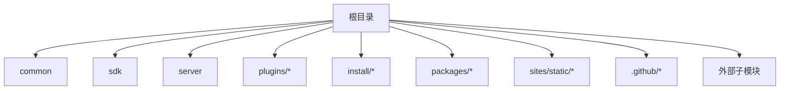
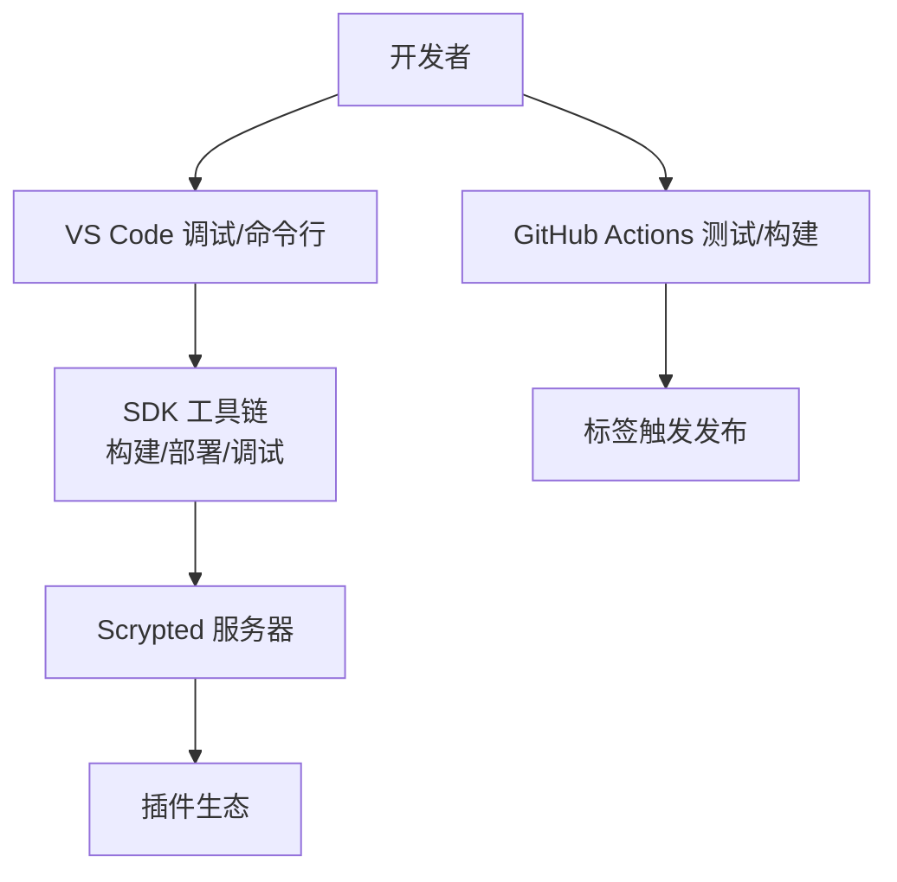
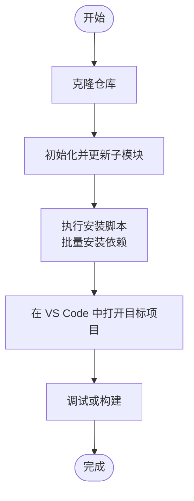
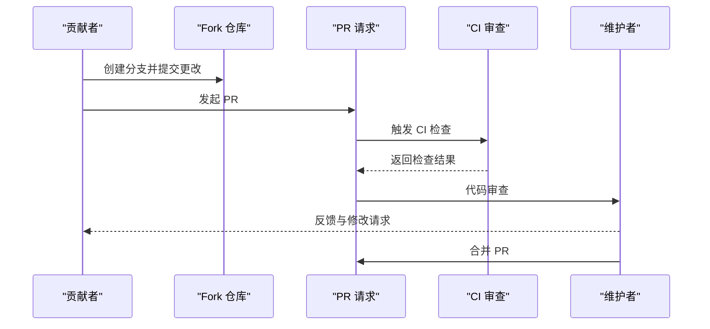
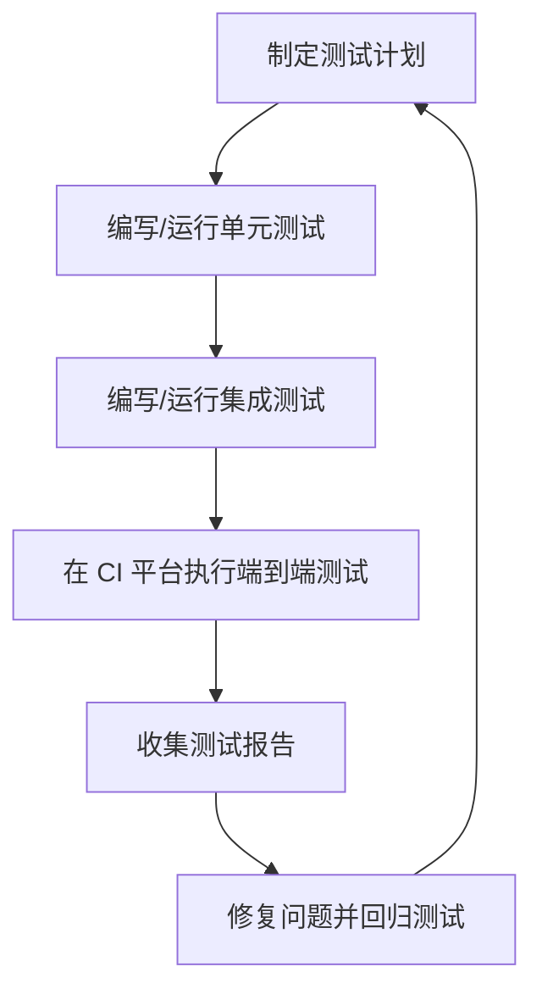
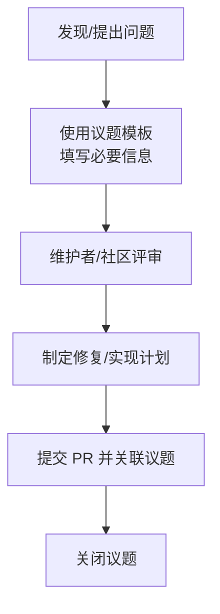
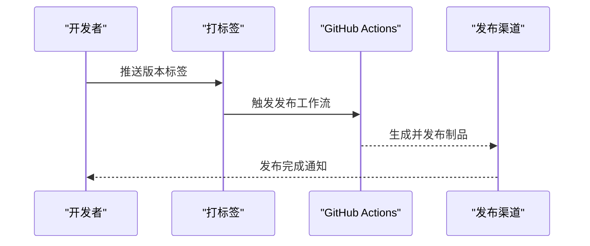
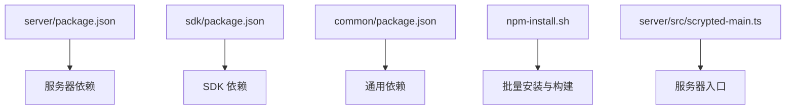

# 贡献指南

<cite>
**本文引用的文件**
- [README.md](file://README.md)
- [.github/workflows/test.yml](file://.github/workflows/test.yml)
- [.github/workflows/release.yml](file://.github/workflows/release.yml)
- [.github/workflows/build-plugins-changed.yml](file://.github/workflows/build-plugins-changed.yml)
- [npm-install.sh](file://npm-install.sh)
- [sdk/bin/scrypted-changelog.js](file://sdk/bin/scrypted-changelog.js)
- [server/package.json](file://server/package.json)
- [sdk/package.json](file://sdk/package.json)
- [common/package.json](file://common/package.json)
- [server/src/scrypted-main.ts](file://server/src/scrypted-main.ts)
- [server/test/rpc-buffer-array-test.ts](file://server/test/rpc-buffer-array-test.ts)
- [server/test/rpc-duplex-test.ts](file://server/test/rpc-duplex-test.ts)
- [server/test/rpc-iterator-test.ts](file://server/test/rpc-iterator-test.ts)
- [server/test/rpc-proxy-set.ts](file://server/test/rpc-proxy-set.ts)
- [server/test/rpc-python-test.ts](file://server/test/rpc-python-test.ts)
- [server/test/threading-test.ts](file://server/test/threading-test.ts)
- [repository.yaml](file://repository.yaml)
- [.github/FUNDING.yml](file://.github/FUNDING.yml)
</cite>

## 目录
1. [简介](#简介)
2. [项目结构](#项目结构)
3. [核心组件](#核心组件)
4. [架构总览](#架构总览)
5. [详细组件分析](#详细组件分析)
6. [依赖分析](#依赖分析)
7. [性能考虑](#性能考虑)
8. [故障排查指南](#故障排查指南)
9. [结论](#结论)
10. [附录](#附录)

## 简介
本贡献指南面向希望参与 Scrypted 项目开发的贡献者，涵盖从开发环境搭建、代码与文档贡献、问题报告与功能建议、Pull Request 提交流程、测试要求、问题报告模板、新功能开发指导，到社区行为准则、沟通渠道、维护者联系方式以及版本发布与变更日志维护等全流程内容。Scrypted 是一个高性能的家庭视频集成平台与 NVR，支持多种摄像头与智能检测，并提供插件化扩展能力。

## 项目结构
Scrypted 仓库采用多包（monorepo）组织方式，主要目录与职责如下：
- 根目录：项目根与顶层脚本
- common：通用工具与类型定义
- sdk：SDK 与打包、部署、调试工具
- server：Scrypted 服务器核心
- plugins：各类设备与服务插件
- install：Docker、Compose、系统安装脚本
- packages：独立的 npm 包
- sites/static：静态站点示例
- .github：CI/CD 工作流与模板
- 外部子模块：如 werift 等第三方依赖

章节来源
- [README.md:1-59](file://README.md#L1-L59)

## 核心组件
- 开发与调试
  - 使用 VS Code 调试插件或命令行直接构建并部署插件
  - 支持在不重启服务器的情况下热更新插件
- 构建与安装
  - 通过顶层脚本初始化子模块并批量安装依赖
  - 按需构建 SDK 与常用插件
- CI/CD
  - 测试工作流覆盖多平台本地安装验证
  - 插件变更构建工作流按需构建受影响插件
  - 发布工作流基于标签自动发布

章节来源
- [README.md:15-59](file://README.md#L15-L59)
- [npm-install.sh:1-37](file://npm-install.sh#L1-L37)
- [.github/workflows/test.yml:1-36](file://.github/workflows/test.yml#L1-L36)
- [.github/workflows/build-plugins-changed.yml:1-52](file://.github/workflows/build-plugins-changed.yml#L1-L52)
- [.github/workflows/release.yml:1-19](file://.github/workflows/release.yml#L1-L19)

## 架构总览
Scrypted 的开发与发布围绕以下关键路径：
- 开发者在本地使用 VS Code 或命令行进行插件开发与调试
- 通过 SDK 工具链完成构建与部署
- CI 在多平台上执行安装与功能测试
- 版本发布由标签触发自动化发布流程

## 详细组件分析

### 开发环境搭建
- 克隆仓库并初始化子模块
- 执行顶层安装脚本以批量安装常见依赖与构建 SDK
- 可选择性地在 VS Code 中打开特定插件或服务器目录进行调试

章节来源
- [README.md:17-56](file://README.md#L17-L56)
- [npm-install.sh:1-37](file://npm-install.sh#L1-L37)

### 代码贡献与 PR 流程
- 分支策略
  - 建议基于主分支创建特性分支进行开发
- 提交信息
  - 使用清晰、简洁的提交信息，遵循项目既定风格
- 代码审查
  - 提交 PR 后由维护者进行审查与合并
- 变更日志
  - 使用 SDK 提供的变更日志生成工具维护变更记录

章节来源
- [sdk/bin/scrypted-changelog.js:1-59](file://sdk/bin/scrypted-changelog.js#L1-L59)

### 测试要求与运行
- 单元测试与集成测试
  - 服务器侧包含多种 RPC 相关与线程相关的测试用例
  - 建议在本地运行相关测试以确保兼容性
- 端到端测试
  - CI 工作流在多个平台执行本地安装测试
- 运行方式
  - 可在对应包目录下执行测试命令（若存在）
  - 也可参考 CI 配置在本地模拟执行

章节来源
- [.github/workflows/test.yml:1-36](file://.github/workflows/test.yml#L1-L36)
- [server/test/rpc-buffer-array-test.ts](file://server/test/rpc-buffer-array-test.ts)
- [server/test/rpc-duplex-test.ts](file://server/test/rpc-duplex-test.ts)
- [server/test/rpc-iterator-test.ts](file://server/test/rpc-iterator-test.ts)
- [server/test/rpc-proxy-set.ts](file://server/test/rpc-proxy-set.ts)
- [server/test/rpc-python-test.ts](file://server/test/rpc-python-test.ts)
- [server/test/threading-test.ts](file://server/test/threading-test.ts)

### 问题报告与功能建议
- 问题报告模板
  - 请在对应的议题模板中填写问题描述、重现步骤、日志信息与环境信息
- 功能建议
  - 在议题中清晰描述需求背景、预期行为与影响范围
- 沟通渠道
  - 社区活跃于 Discord、Reddit 与 GitHub

章节来源
- [README.md:11-13](file://README.md#L11-L13)

### 新功能开发指导
- 需求分析
  - 明确功能目标、用户场景与兼容性要求
- 设计文档
  - 在 PR 中附上设计说明与接口定义
- 实现计划
  - 将大功能拆分为可迭代的小任务，逐步推进
- 测试与验证
  - 编写充分的测试用例并在 CI 上验证

### 版本发布与变更日志
- 版本发布
  - 通过推送标签触发发布工作流，自动创建发布
- 变更日志
  - 使用 SDK 工具自动生成变更日志，便于维护与发布说明

章节来源
- [.github/workflows/release.yml:1-19](file://.github/workflows/release.yml#L1-L19)
- [sdk/bin/scrypted-changelog.js:1-59](file://sdk/bin/scrypted-changelog.js#L1-L59)

## 依赖分析
- 包管理与构建
  - server、sdk、common 等包通过各自 package.json 管理依赖与脚本
  - 顶层安装脚本统一处理子模块与常用依赖
- 关键依赖
  - 服务器依赖包括 Express、LevelDB、Sharp、Engine.IO、WS 等
  - SDK 依赖 Rollup、Webpack、TypeScript 等工具链
- 运行入口
  - 服务器入口通过导出函数启动，便于在不同环境中加载

图表来源
- [server/package.json:1-73](file://server/package.json#L1-L73)
- [sdk/package.json:1-62](file://sdk/package.json#L1-L62)
- [common/package.json:1-25](file://common/package.json#L1-L25)
- [npm-install.sh:1-37](file://npm-install.sh#L1-L37)
- [server/src/scrypted-main.ts:1-4](file://server/src/scrypted-main.ts#L1-L4)

章节来源
- [server/package.json:1-73](file://server/package.json#L1-L73)
- [sdk/package.json:1-62](file://sdk/package.json#L1-L62)
- [common/package.json:1-25](file://common/package.json#L1-L25)
- [npm-install.sh:1-37](file://npm-install.sh#L1-L37)
- [server/src/scrypted-main.ts:1-4](file://server/src/scrypted-main.ts#L1-L4)

## 性能考虑
- 构建与打包
  - 使用 SDK 工具链进行打包与优化，减少运行时开销
- 依赖精简
  - 仅安装所需插件与依赖，避免不必要的资源占用
- 测试覆盖
  - 在多平台 CI 上验证性能与稳定性，及时发现回归问题

## 故障排查指南
- 本地调试
  - 使用 VS Code 调试插件或命令行构建并部署，观察日志输出
- 服务器入口
  - 如需调试服务器，可在服务器目录中进行调试
- 测试失败定位
  - 查看 CI 日志与本地测试输出，定位具体失败用例
- 常见问题
  - 子模块未初始化导致依赖缺失，可通过安装脚本解决
  - 插件热更新未生效，确认部署命令与目标地址

章节来源
- [README.md:17-56](file://README.md#L17-L56)
- [npm-install.sh:1-37](file://npm-install.sh#L1-L37)
- [server/src/scrypted-main.ts:1-4](file://server/src/scrypted-main.ts#L1-L4)

## 结论
通过本贡献指南，贡献者可以快速搭建开发环境、理解测试与发布流程、规范提交与审查过程，并在社区协作下高效推进功能开发与问题修复。欢迎加入 Scrypted 社区，共同打造开放、稳定、易用的视频与自动化平台。

## 附录
- 社区与沟通
  - Discord、Reddit、GitHub 议题与讨论区
- 维护者联系
  - 仓库元数据与资助信息显示维护者联系方式
- 仓库元信息
  - 仓库名称、URL、维护者信息

章节来源
- [README.md:11-13](file://README.md#L11-L13)
- [.github/FUNDING.yml:1-4](file://.github/FUNDING.yml#L1-L4)
- [repository.yaml:1-4](file://repository.yaml#L1-L4)