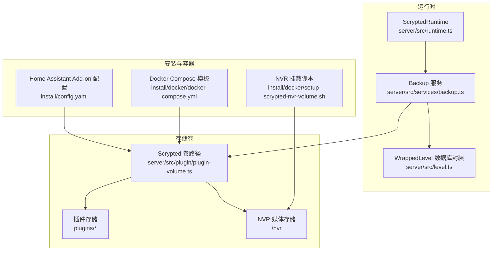
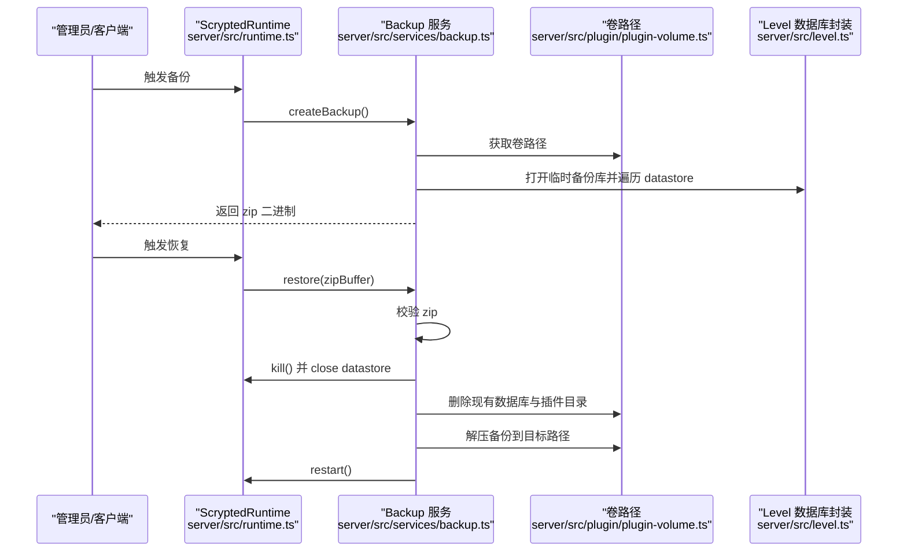
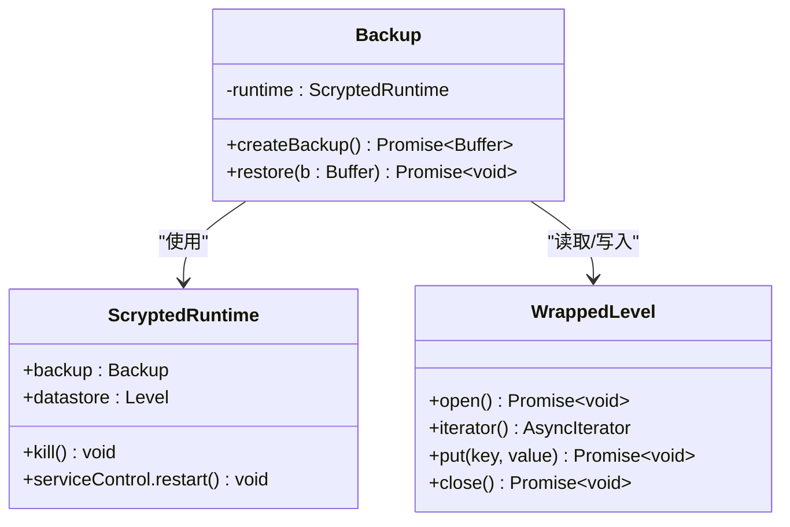
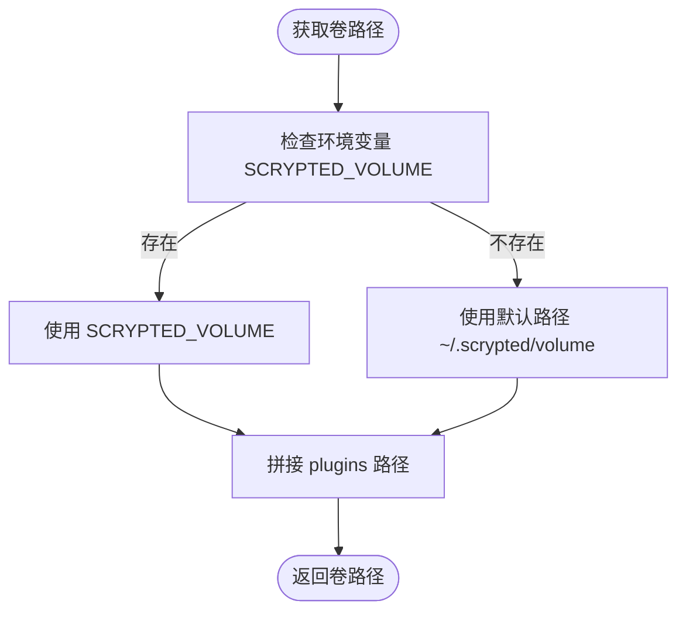
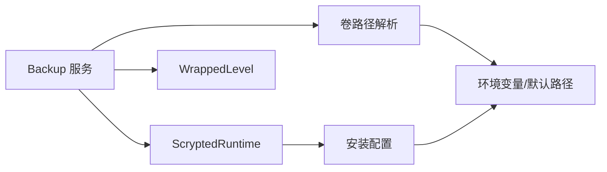

# 备份与恢复

<cite>
**本文引用的文件**
- [server/src/services/backup.ts](file://server/src/services/backup.ts)
- [server/src/plugin/plugin-volume.ts](file://server/src/plugin/plugin-volume.ts)
- [server/src/level.ts](file://server/src/level.ts)
- [server/src/runtime.ts](file://server/src/runtime.ts)
- [install/config.yaml](file://install/config.yaml)
- [install/docker/docker-compose.yml](file://install/docker/docker-compose.yml)
- [install/docker/setup-scrypted-nvr-volume.sh](file://install/docker/setup-scrypted-nvr-volume.sh)
- [server/python/plugin_remote.py](file://server/python/plugin_remote.py)
</cite>

## 目录
1. [简介](#简介)
2. [项目结构](#项目结构)
3. [核心组件](#核心组件)
4. [架构总览](#架构总览)
5. [详细组件分析](#详细组件分析)
6. [依赖关系分析](#依赖关系分析)
7. [性能考量](#性能考量)
8. [故障排查指南](#故障排查指南)
9. [结论](#结论)
10. [附录](#附录)

## 简介
本指南面向 Scrypted 的备份与恢复策略，覆盖数据库备份、配置与插件存储、媒体文件（NVR）备份与恢复、自动化备份配置、增量/全量策略建议、备份验证与完整性检查、灾难恢复流程、跨平台迁移、监控与告警以及最佳实践。文档基于仓库中实际实现进行说明，并提供可操作的步骤与图示。

## 项目结构
围绕备份与恢复的关键目录与文件如下：
- 备份服务：server/src/services/backup.ts
- 存储卷路径：server/src/plugin/plugin-volume.ts
- 数据库存取封装：server/src/level.ts
- 运行时集成：server/src/runtime.ts
- 安装与容器配置：install/config.yaml、install/docker/docker-compose.yml
- NVR 存储挂载脚本：install/docker/setup-scrypted-nvr-volume.sh
- 插件文件存储路径：server/python/plugin_remote.py

**图表来源**
- [server/src/runtime.ts:97](file://server/src/runtime.ts#L97-L97)
- [server/src/services/backup.ts:9](file://server/src/services/backup.ts#L9-L10)
- [server/src/level.ts:18](file://server/src/level.ts#L18-L23)
- [server/src/plugin/plugin-volume.ts:5](file://server/src/plugin/plugin-volume.ts#L5-L7)
- [install/config.yaml:25](file://install/config.yaml#L25-L26)
- [install/docker/docker-compose.yml:58](file://install/docker/docker-compose.yml#L58-L71)
- [install/docker/setup-scrypted-nvr-volume.sh:151](file://install/docker/setup-scrypted-nvr-volume.sh#L151-L156)

**章节来源**
- [server/src/services/backup.ts:12-46](file://server/src/services/backup.ts#L12-L46)
- [server/src/plugin/plugin-volume.ts:5-14](file://server/src/plugin/plugin-volume.ts#L5-L14)
- [server/src/level.ts:18-31](file://server/src/level.ts#L18-L31)
- [server/src/runtime.ts:97](file://server/src/runtime.ts#L97)
- [install/config.yaml:25-26](file://install/config.yaml#L25-L26)
- [install/docker/docker-compose.yml:58-71](file://install/docker/docker-compose.yml#L58-L71)
- [install/docker/setup-scrypted-nvr-volume.sh:151-156](file://install/docker/setup-scrypted-nvr-volume.sh#L151-L156)

## 核心组件
- 备份服务 Backup：负责创建与恢复备份，复制 Level 数据库到临时备份库，打包为 zip 并返回二进制；恢复时关闭当前实例、删除现有数据库与插件目录、解压并重启服务。
- 存储卷路径 getScryptedVolume/getPluginsVolume：确定 scrypted 卷根目录及插件目录，用于备份范围与恢复目标定位。
- WrappedLevel：对 Level 数据库进行封装，支持文档类型前缀迭代、计数、upsert/remove 等操作，是备份数据源的基础。
- 运行时 ScryptedRuntime：在构造时注入 Backup 实例，作为系统级备份入口。
- 安装配置：通过环境变量 SCRYPTED_VOLUME、SCRYPTED_NVR_VOLUME 指定备份与媒体存储位置；Home Assistant Add-on 提供 backup_exclude 排除项，避免将服务器进程与媒体直接纳入备份。

**章节来源**
- [server/src/services/backup.ts:9-76](file://server/src/services/backup.ts#L9-L76)
- [server/src/plugin/plugin-volume.ts:5-14](file://server/src/plugin/plugin-volume.ts#L5-L14)
- [server/src/level.ts:18-114](file://server/src/level.ts#L18-L114)
- [server/src/runtime.ts:97](file://server/src/runtime.ts#L97)
- [install/config.yaml:25-33](file://install/config.yaml#L25-L33)

## 架构总览
下图展示备份与恢复在系统中的调用关系与数据流向：

**图表来源**
- [server/src/runtime.ts:97](file://server/src/runtime.ts#L97)
- [server/src/services/backup.ts:12-46](file://server/src/services/backup.ts#L12-L46)
- [server/src/services/backup.ts:48-75](file://server/src/services/backup.ts#L48-L75)
- [server/src/plugin/plugin-volume.ts:5-14](file://server/src/plugin/plugin-volume.ts#L5-L14)
- [server/src/level.ts:18-31](file://server/src/level.ts#L18-L31)

## 详细组件分析

### 组件一：备份服务 Backup
- 功能要点
  - 创建备份：打开临时备份数据库，遍历运行时 datastore 的键值对写入备份库，再将备份库目录打包为 zip 并返回 Buffer。
  - 恢复备份：校验 zip，停止运行时并关闭 datastore，删除现有 scrypted.db 与 plugins 目录，解压备份内容到目标路径，最后重启服务。
- 关键行为
  - 使用 getScryptedVolume 确定备份与恢复的目标卷路径。
  - 使用 Level 迭代器遍历所有键值，确保配置、用户、设备等元数据完整备份。
  - 恢复时删除 plugins 目录，以确保首次启动时重新安装插件及其资源，避免版本不一致导致的问题。

**图表来源**
- [server/src/services/backup.ts:9-76](file://server/src/services/backup.ts#L9-L76)
- [server/src/runtime.ts:97](file://server/src/runtime.ts#L97)
- [server/src/level.ts:18-31](file://server/src/level.ts#L18-L31)

**章节来源**
- [server/src/services/backup.ts:12-46](file://server/src/services/backup.ts#L12-L46)
- [server/src/services/backup.ts:48-75](file://server/src/services/backup.ts#L48-L75)

### 组件二：存储卷路径与插件存储
- getScryptedVolume/getPluginsVolume
  - 默认路径来自环境变量 SCRYPTED_VOLUME 或用户主目录下的 .scrypted/volume。
  - 插件存储位于卷内 plugins 子目录，恢复时会整体删除该目录以强制重装。
- 插件文件存储
  - Python 插件侧通过环境变量 SCRYPTED_PLUGIN_VOLUME/.../files 获取插件文件存储目录，确保媒体缓存与中间文件可被独立管理。

**图表来源**
- [server/src/plugin/plugin-volume.ts:5-14](file://server/src/plugin/plugin-volume.ts#L5-L14)
- [server/python/plugin_remote.py:488-501](file://server/python/plugin_remote.py#L488-L501)

**章节来源**
- [server/src/plugin/plugin-volume.ts:5-14](file://server/src/plugin/plugin-volume.ts#L5-L14)
- [server/python/plugin_remote.py:488-501](file://server/python/plugin_remote.py#L488-L501)

### 组件三：数据库封装 WrappedLevel
- 功能要点
  - 支持按文档类型前缀迭代、计数、upsert/remove 等操作，便于备份时遍历所有键值。
  - 在 open 时尝试读取自增 ID，保证后续写入的连续性。
- 备份意义
  - 备份服务通过 datastore.iterator() 遍历键值，依赖 WrappedLevel 的迭代能力确保元数据完整。

**章节来源**
- [server/src/level.ts:18-114](file://server/src/level.ts#L18-L114)

### 组件四：运行时集成与触发
- ScryptedRuntime 在构造函数中注入 Backup 实例，作为系统级备份入口，便于上层或运维通过运行时接口触发备份/恢复。

**章节来源**
- [server/src/runtime.ts:97](file://server/src/runtime.ts#L97)

### 组件五：安装与容器配置
- 环境变量
  - SCRYPTED_VOLUME：指定 scrypted 卷根目录，决定备份与恢复的目标位置。
  - SCRYPTED_NVR_VOLUME：指定 NVR 媒体存储挂载点，通常映射到外部磁盘或网络存储。
- Home Assistant Add-on
  - backup_exclude：排除 server 进程、NVR 媒体与插件目录，避免将运行时进程与大体量媒体文件纳入备份，降低备份体积与时间。
- Docker Compose
  - 提供 NVR 存储挂载模板，便于将宿主机目录或网络存储挂载至容器内的 /nvr。

**章节来源**
- [install/config.yaml:25-33](file://install/config.yaml#L25-L33)
- [install/docker/docker-compose.yml:58-71](file://install/docker/docker-compose.yml#L58-L71)

### 组件六：NVR 存储挂载脚本
- 作用
  - 自动备份 docker-compose.yml，交互式确认后修改挂载参数，将外部存储挂载到 /nvr，确保媒体文件独立于应用卷，便于单独备份与迁移。

**章节来源**
- [install/docker/setup-scrypted-nvr-volume.sh:32-71](file://install/docker/setup-scrypted-nvr-volume.sh#L32-L71)
- [install/docker/setup-scrypted-nvr-volume.sh:112-159](file://install/docker/setup-scrypted-nvr-volume.sh#L112-L159)

## 依赖关系分析
- 备份服务依赖运行时的数据存储接口与卷路径解析。
- 卷路径解析依赖环境变量与操作系统用户主目录。
- 数据库存取封装为备份提供键值遍历能力。
- 安装配置影响备份范围与恢复目标，需与备份策略协同。

**图表来源**
- [server/src/services/backup.ts:9-76](file://server/src/services/backup.ts#L9-L76)
- [server/src/runtime.ts:97](file://server/src/runtime.ts#L97)
- [server/src/plugin/plugin-volume.ts:5-14](file://server/src/plugin/plugin-volume.ts#L5-L14)
- [server/src/level.ts:18-31](file://server/src/level.ts#L18-L31)
- [install/config.yaml:25-33](file://install/config.yaml#L25-L33)

**章节来源**
- [server/src/services/backup.ts:9-76](file://server/src/services/backup.ts#L9-L76)
- [server/src/plugin/plugin-volume.ts:5-14](file://server/src/plugin/plugin-volume.ts#L5-L14)
- [server/src/level.ts:18-31](file://server/src/level.ts#L18-L31)
- [server/src/runtime.ts:97](file://server/src/runtime.ts#L97)
- [install/config.yaml:25-33](file://install/config.yaml#L25-L33)

## 性能考量
- 备份体积与速度
  - 通过 backup_exclude 排除 server 进程与 NVR 媒体目录，显著降低备份体积与耗时。
  - 将 SCRYPTED_VOLUME 与 SCRYPTED_NVR_VOLUME 分离到不同存储，有利于独立优化与并行备份。
- 存储空间优化
  - 利用环境变量与安装配置将媒体文件挂载到专用磁盘或网络存储，减少应用卷压力。
- 恢复时间
  - 恢复时删除 plugins 目录并强制重装，确保兼容性但会增加首次启动时间；可在非高峰时段执行。

[本节为通用性能建议，无需特定文件引用]

## 故障排查指南
- 备份失败
  - 检查卷路径权限与可用空间，确认 SCRYPTED_VOLUME 可写。
  - 确认备份过程中未有其他进程占用数据库文件。
- 恢复失败
  - 恢复前确保 zip 文件完整且通过校验；如校验失败，重新生成备份。
  - 恢复后若无法启动，检查日志并确认 plugins 目录已被清理，等待首次启动自动重装。
- 媒体文件丢失
  - 确认 SCRYPTED_NVR_VOLUME 已正确挂载至 /nvr；如挂载异常，使用 NVR 挂载脚本重新配置。
- 权限问题
  - Home Assistant Add-on 中的设备与挂载配置需与备份目标路径匹配，避免权限不足导致写入失败。

**章节来源**
- [server/src/services/backup.ts:48-75](file://server/src/services/backup.ts#L48-L75)
- [install/docker/setup-scrypted-nvr-volume.sh:151-156](file://install/docker/setup-scrypted-nvr-volume.sh#L151-L156)

## 结论
Scrypted 的备份与恢复以“数据库+插件+配置”为核心，结合安装配置与卷路径管理，形成可操作的备份策略。通过排除大型媒体文件、分离存储卷、自动化恢复流程与恢复后重装插件机制，能够在保障数据一致性的同时提升备份与恢复效率。建议在生产环境中配合自动化定时任务、监控与告警，定期演练恢复流程，确保业务连续性。

[本节为总结性内容，无需特定文件引用]

## 附录

### A. 备份策略与实施步骤
- 数据备份
  - 目标：scrypted 卷根目录（含 Level 数据库、配置、插件元数据）。
  - 方法：通过运行时触发 Backup.createBackup()，得到 zip 二进制。
- 配置文件备份
  - 目标：SCRYPTED_VOLUME 下的配置与插件元数据。
  - 方法：同上，备份 zip 内包含数据库与插件相关文件。
- 媒体文件备份
  - 目标：SCRYPTED_NVR_VOLUME 对应的 /nvr 目录。
  - 方法：使用 rsync、快照或外部备份工具对该目录进行独立备份。
- 自动化备份
  - 方案：在宿主机或容器外设置定时任务，调用运行时备份接口或导出备份 zip 至指定位置。
  - 存储位置：将备份文件保存至独立的远程存储或本地高可靠磁盘阵列。
  - 保留策略：采用“多版本保留”，如每日保留 7 天、每周保留 4 周、每月保留 12 个月。
- 增量/全量选择
  - 全量优先：数据库与配置适合全量备份，确保可恢复性。
  - 媒体文件适合增量：结合快照或差异备份，减少存储与传输成本。
- 验证与完整性检查
  - 备份文件校验：对 zip 进行解压测试与哈希校验。
  - 恢复测试：在隔离环境中执行恢复流程，验证服务可用性与关键功能。
  - 数据一致性：核对用户、设备、自动化规则等是否完整恢复。
- 灾难恢复流程
  - 系统崩溃恢复：停止服务，删除现有 scrypted.db 与 plugins 目录，解压备份，重启服务。
  - 硬件故障处理：从最近备份恢复应用卷，重新挂载 /nvr，恢复媒体文件。
  - 数据丢失恢复：根据保留策略选择合适版本，重复恢复测试流程。
- 跨平台迁移
  - 版本升级备份：升级前先执行一次全量备份，确保可回滚。
  - 平台迁移：导出备份 zip，迁移到新平台后恢复；注意插件兼容性与依赖。
  - 配置同步：通过备份中的配置与数据库，统一新平台的初始状态。
- 监控与告警
  - 备份状态监控：记录每次备份的开始/结束时间、大小、状态。
  - 失败告警：备份失败时发送通知（邮件/IM/短信）。
  - 存储空间预警：监控备份存储与 /nvr 空间，提前扩容或清理旧版本。
- 最佳实践
  - 制定备份策略：明确备份频率、保留周期、恢复演练计划。
  - 存储介质选择：应用卷与媒体卷分别存放于不同介质，提高可靠性。
  - 恢复流程演练：每季度至少一次恢复演练，验证备份有效性与恢复速度。

[本节为操作指南与最佳实践汇总，无需特定文件引用]