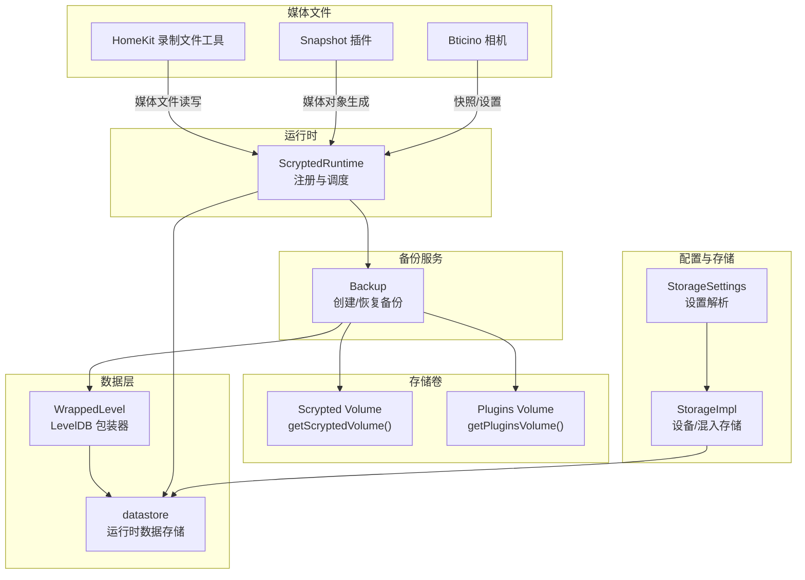
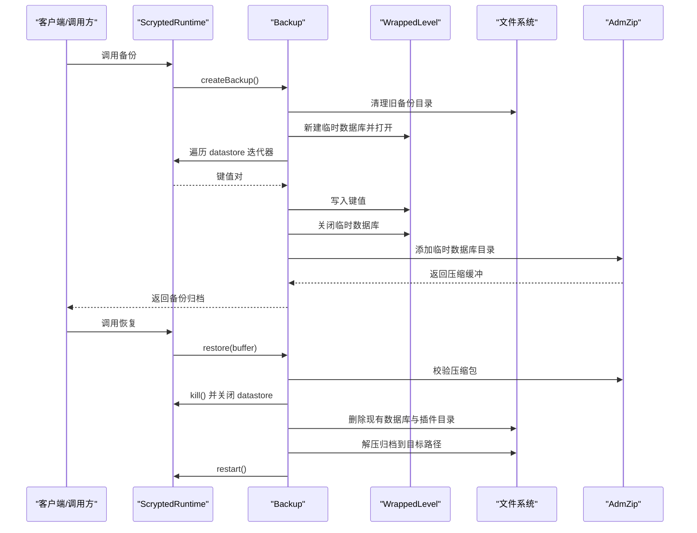
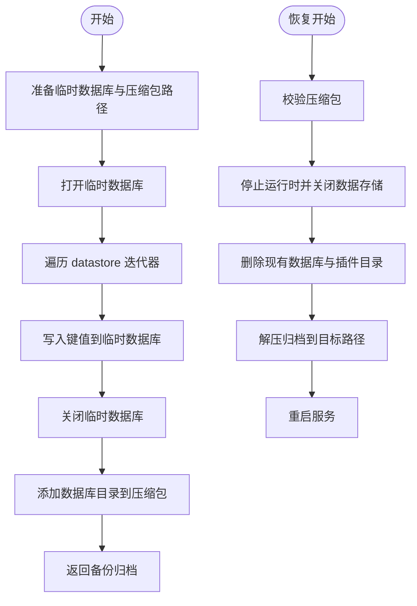
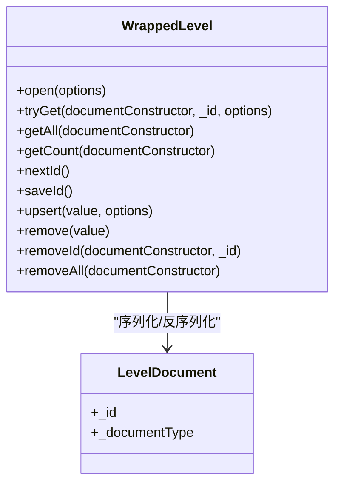
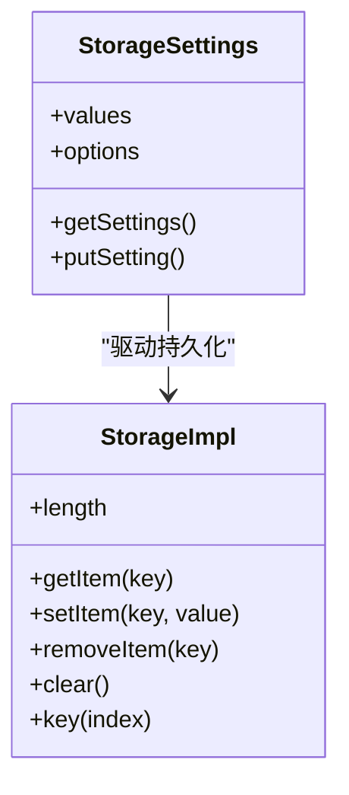
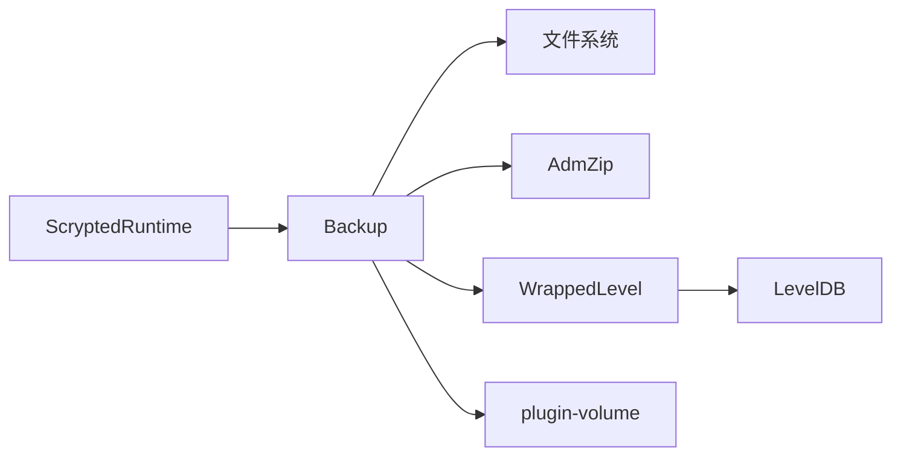

# 数据备份策略

<cite>
**本文引用的文件**
- [server/src/services/backup.ts](file://server/src/services/backup.ts)
- [server/src/level.ts](file://server/src/level.ts)
- [server/src/plugin/plugin-volume.ts](file://server/src/plugin/plugin-volume.ts)
- [server/src/runtime.ts](file://server/src/runtime.ts)
- [sdk/src/storage-settings.ts](file://sdk/src/storage-settings.ts)
- [server/src/plugin/device.ts](file://server/src/plugin/device.ts)
- [plugins/homekit/src/types/camera/camera-recording-files.ts](file://plugins/homekit/src/types/camera/camera-recording-files.ts)
- [plugins/snapshot/src/main.ts](file://plugins/snapshot/src/main.ts)
- [plugins/bticino/src/bticino-camera.ts](file://plugins/bticino/src/bticino-camera.ts)
</cite>

## 目录
1. [简介](#简介)
2. [项目结构](#项目结构)
3. [核心组件](#核心组件)
4. [架构总览](#架构总览)
5. [详细组件分析](#详细组件分析)
6. [依赖关系分析](#依赖关系分析)
7. [性能考虑](#性能考虑)
8. [故障排查指南](#故障排查指南)
9. [结论](#结论)
10. [附录](#附录)

## 简介
本文件面向 Scrypted 的数据备份策略，聚焦以下方面：
- 数据库备份机制：基于 LevelDB 的备份流程、序列化与反序列化、备份文件格式。
- 配置数据备份：设备配置、用户设置、插件配置的备份范围与格式。
- 媒体文件备份策略：录制文件、快照文件、临时文件的备份处理建议。
- 备份数据结构：备份文件内部组织、索引与元数据存储。
- 完整性保障：校验与验证、损坏检测、恢复验证。
- 性能优化：增量备份、压缩算法、并发处理。
- 备份数据管理：命名规范、版本控制、清理策略。

## 项目结构
围绕备份功能的关键模块与职责如下：
- 备份服务：负责创建与恢复备份，使用压缩归档封装数据库内容。
- 数据层包装：对 LevelDB 进行文档化访问与迭代，支持键空间前缀与序列化。
- 存储卷路径：定义 Scrypted 数据卷与插件卷的目录位置。
- 运行时集成：在运行时中注册备份服务，并通过 API 暴露备份能力。
- 配置与存储：设备与插件的存储接口，用于持久化配置与状态。
- 媒体文件：录制与快照的生成与读取，作为媒体备份的参考实现。

图表来源
- [server/src/services/backup.ts:1-76](file://server/src/services/backup.ts#L1-L76)
- [server/src/level.ts:18-114](file://server/src/level.ts#L18-L114)
- [server/src/plugin/plugin-volume.ts:5-32](file://server/src/plugin/plugin-volume.ts#L5-L32)
- [server/src/runtime.ts:97-97](file://server/src/runtime.ts#L97-L97)
- [sdk/src/storage-settings.ts:47-89](file://sdk/src/storage-settings.ts#L47-L89)
- [server/src/plugin/device.ts:182-261](file://server/src/plugin/device.ts#L182-L261)
- [plugins/homekit/src/types/camera/camera-recording-files.ts:14-43](file://plugins/homekit/src/types/camera/camera-recording-files.ts#L14-L43)
- [plugins/snapshot/src/main.ts:484-517](file://plugins/snapshot/src/main.ts#L484-L517)
- [plugins/bticino/src/bticino-camera.ts:288-323](file://plugins/bticino/src/bticino-camera.ts#L288-L323)

章节来源
- [server/src/services/backup.ts:1-76](file://server/src/services/backup.ts#L1-L76)
- [server/src/level.ts:18-114](file://server/src/level.ts#L18-L114)
- [server/src/plugin/plugin-volume.ts:5-32](file://server/src/plugin/plugin-volume.ts#L5-L32)
- [server/src/runtime.ts:97-97](file://server/src/runtime.ts#L97-L97)
- [sdk/src/storage-settings.ts:47-89](file://sdk/src/storage-settings.ts#L47-L89)
- [server/src/plugin/device.ts:182-261](file://server/src/plugin/device.ts#L182-L261)
- [plugins/homekit/src/types/camera/camera-recording-files.ts:14-43](file://plugins/homekit/src/types/camera/camera-recording-files.ts#L14-L43)
- [plugins/snapshot/src/main.ts:484-517](file://plugins/snapshot/src/main.ts#L484-L517)
- [plugins/bticino/src/bticino-camera.ts:288-323](file://plugins/bticino/src/bticino-camera.ts#L288-L323)

## 核心组件
- 备份服务（Backup）
  - 创建备份：遍历运行时数据存储，写入临时 LevelDB，再打包为压缩归档。
  - 恢复备份：校验压缩包，停止运行时，删除现有数据库与插件目录，解压并重启服务。
- 数据层包装（WrappedLevel）
  - 提供文档化读写、迭代、计数、批量删除等能力；统一键空间前缀与 JSON 序列化。
- 存储卷路径（plugin-volume）
  - 定义 Scrypted 数据卷与插件卷的根目录，用于备份与恢复的目标路径。
- 运行时（ScryptedRuntime）
  - 注册备份服务实例，作为备份流程的上下文与调度者。
- 配置与存储（StorageSettings、StorageImpl）
  - 设备与混入存储的读写接口，支持 JSON 设置解析与持久化。
- 媒体文件（HomeKit 录制文件、Snapshot 插件、Bticino 相机）
  - 录制与快照的生成与读取示例，可作为媒体备份策略的参考实现。

章节来源
- [server/src/services/backup.ts:9-76](file://server/src/services/backup.ts#L9-L76)
- [server/src/level.ts:18-114](file://server/src/level.ts#L18-L114)
- [server/src/plugin/plugin-volume.ts:5-32](file://server/src/plugin/plugin-volume.ts#L5-L32)
- [server/src/runtime.ts:97-97](file://server/src/runtime.ts#L97-L97)
- [sdk/src/storage-settings.ts:47-89](file://sdk/src/storage-settings.ts#L47-L89)
- [server/src/plugin/device.ts:182-261](file://server/src/plugin/device.ts#L182-L261)
- [plugins/homekit/src/types/camera/camera-recording-files.ts:14-43](file://plugins/homekit/src/types/camera/camera-recording-files.ts#L14-L43)
- [plugins/snapshot/src/main.ts:484-517](file://plugins/snapshot/src/main.ts#L484-L517)
- [plugins/bticino/src/bticino-camera.ts:288-323](file://plugins/bticino/src/bticino-camera.ts#L288-L323)

## 架构总览
备份流程由运行时触发，通过备份服务完成数据库导出与打包，恢复流程则在服务停止后替换数据库与插件目录。

图表来源
- [server/src/services/backup.ts:12-75](file://server/src/services/backup.ts#L12-L75)
- [server/src/level.ts:21-86](file://server/src/level.ts#L21-L86)
- [server/src/runtime.ts:97-97](file://server/src/runtime.ts#L97-L97)

## 详细组件分析

### 备份服务（Backup）分析
- 创建备份
  - 选择数据卷根目录，准备临时数据库与压缩包路径。
  - 打开临时数据库，遍历运行时数据存储的迭代器，逐条写入临时数据库。
  - 关闭临时数据库，使用压缩库将数据库目录打包为归档。
- 恢复备份
  - 校验压缩包有效性。
  - 停止运行时并关闭当前数据存储。
  - 删除现有数据库与插件目录，解压备份归档到目标路径，最后重启服务。

图表来源
- [server/src/services/backup.ts:12-75](file://server/src/services/backup.ts#L12-L75)

章节来源
- [server/src/services/backup.ts:9-76](file://server/src/services/backup.ts#L9-L76)

### 数据层包装（WrappedLevel）分析
- 文档化访问
  - 统一键空间前缀：以“类名/主键”形式组织键，便于按类型检索与批量删除。
  - JSON 序列化：写入时将对象转为字符串，读取时解析为对应构造函数实例。
- 迭代与统计
  - 支持按类型前缀迭代，计算某类型文档数量。
- 写入与删除
  - 自增主键与“_id”记录，确保主键唯一性。
  - 批量删除指定类型的全部文档。

图表来源
- [server/src/level.ts:18-114](file://server/src/level.ts#L18-L114)

章节来源
- [server/src/level.ts:18-114](file://server/src/level.ts#L18-L114)

### 存储卷路径（plugin-volume）分析
- Scrypted 数据卷：默认位于用户主目录下的隐藏目录，可通过环境变量覆盖。
- 插件卷：位于数据卷下，存放各插件的资源与缓存。
- 插件单体卷：按插件 ID 组织子目录，便于隔离与清理。

章节来源
- [server/src/plugin/plugin-volume.ts:5-32](file://server/src/plugin/plugin-volume.ts#L5-L32)

### 运行时（ScryptedRuntime）集成
- 在运行时中注册备份服务实例，作为备份流程的上下文。
- 通过数据存储访问器与迭代器，驱动备份服务的数据导出。

章节来源
- [server/src/runtime.ts:97-97](file://server/src/runtime.ts#L97-L97)

### 配置与存储（StorageSettings、StorageImpl）分析
- StorageSettings
  - 对设置项进行解析，支持 JSON 字段自动解析与默认值回退。
- StorageImpl
  - 设备与混入存储的代理实现，提供键值读写、长度统计、清空等操作。
  - 通过 API 回写存储变更，确保持久化。

图表来源
- [sdk/src/storage-settings.ts:47-89](file://sdk/src/storage-settings.ts#L47-L89)
- [server/src/plugin/device.ts:182-261](file://server/src/plugin/device.ts#L182-L261)

章节来源
- [sdk/src/storage-settings.ts:47-89](file://sdk/src/storage-settings.ts#L47-L89)
- [server/src/plugin/device.ts:182-261](file://server/src/plugin/device.ts#L182-L261)

### 媒体文件备份策略（参考实现）
- HomeKit 录制文件
  - 提供录制文件清理与修剪逻辑，可作为媒体文件生命周期管理的参考。
- Snapshot 插件
  - 生成快照图片并封装为媒体对象，体现媒体对象的生成与封装流程。
- Bticino 相机
  - 快照获取与设置读写，体现媒体与配置的协同。

章节来源
- [plugins/homekit/src/types/camera/camera-recording-files.ts:14-43](file://plugins/homekit/src/types/camera/camera-recording-files.ts#L14-L43)
- [plugins/snapshot/src/main.ts:484-517](file://plugins/snapshot/src/main.ts#L484-L517)
- [plugins/bticino/src/bticino-camera.ts:288-323](file://plugins/bticino/src/bticino-camera.ts#L288-L323)

## 依赖关系分析
- 备份服务依赖
  - 文件系统：临时数据库与压缩包的创建与清理。
  - 压缩库：将数据库目录打包为归档。
  - 数据存储：遍历键值对，导出到临时数据库。
- 数据层包装依赖
  - LevelDB：底层键值存储，提供迭代、读写、删除等能力。
- 存储卷路径依赖
  - 环境变量与操作系统路径：决定数据卷与插件卷的根目录。
- 运行时集成
  - 注册备份服务实例，作为备份流程的上下文。

图表来源
- [server/src/services/backup.ts:12-75](file://server/src/services/backup.ts#L12-L75)
- [server/src/level.ts:21-86](file://server/src/level.ts#L21-L86)
- [server/src/plugin/plugin-volume.ts:5-32](file://server/src/plugin/plugin-volume.ts#L5-L32)
- [server/src/runtime.ts:97-97](file://server/src/runtime.ts#L97-L97)

章节来源
- [server/src/services/backup.ts:12-75](file://server/src/services/backup.ts#L12-L75)
- [server/src/level.ts:21-86](file://server/src/level.ts#L21-L86)
- [server/src/plugin/plugin-volume.ts:5-32](file://server/src/plugin/plugin-volume.ts#L5-L32)
- [server/src/runtime.ts:97-97](file://server/src/runtime.ts#L97-L97)

## 性能考虑
- 增量备份
  - 当前实现为全量导出临时数据库再打包。建议引入时间戳或版本号标记，仅导出变更键集，减少 IO 与压缩开销。
- 压缩算法
  - 使用压缩库进行目录级打包。可评估不同压缩级别与算法对 CPU 与体积的影响，平衡恢复速度与存储占用。
- 并发处理
  - 备份期间建议暂停写入或采用只读快照，避免数据竞争与不一致。
- I/O 优化
  - 将临时数据库写入 SSD 或内存盘，缩短备份时间；分批写入与流式压缩可降低峰值内存占用。

## 故障排查指南
- 备份失败
  - 检查数据卷权限与磁盘空间；确认临时数据库目录可写；查看压缩库错误信息。
- 恢复失败
  - 校验压缩包完整性；确认服务已完全停止且数据存储已关闭；检查目标路径权限。
- 数据不一致
  - 确认备份过程中未进行大规模写入；必要时在备份窗口内限制写入或启用只读模式。
- 恢复后异常
  - 检查插件目录是否被完整替换；确认服务重启成功；核对日志中的初始化错误。

章节来源
- [server/src/services/backup.ts:48-75](file://server/src/services/backup.ts#L48-L75)

## 结论
Scrypted 的备份策略以 LevelDB 为核心，通过临时数据库导出与压缩归档实现快速备份与恢复。配置数据与设备状态通过存储接口持久化，媒体文件可参考现有插件的生成与读取流程进行备份管理。为进一步提升效率与可靠性，建议引入增量备份、更优的压缩策略与并发控制，并完善备份校验与恢复验证机制。

## 附录
- 备份文件格式
  - 临时数据库目录：包含 LevelDB 文件集合。
  - 压缩归档：目录级打包，包含临时数据库目录。
- 备份范围
  - 数据库：所有键值对。
  - 插件：恢复时会删除插件目录并重新安装。
- 备份命名与版本控制
  - 可在外部增加时间戳或版本号前缀，便于多版本管理与清理策略执行。
- 清理策略
  - 建议保留最近 N 个版本，定期清理过期备份；对媒体文件可结合生命周期策略进行修剪。