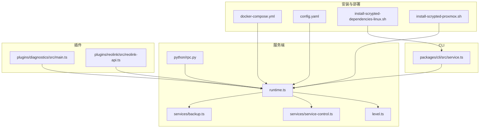
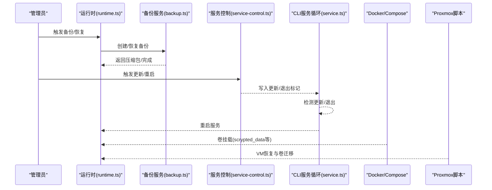
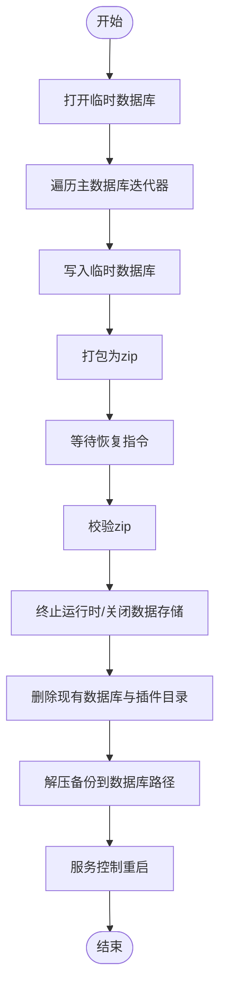
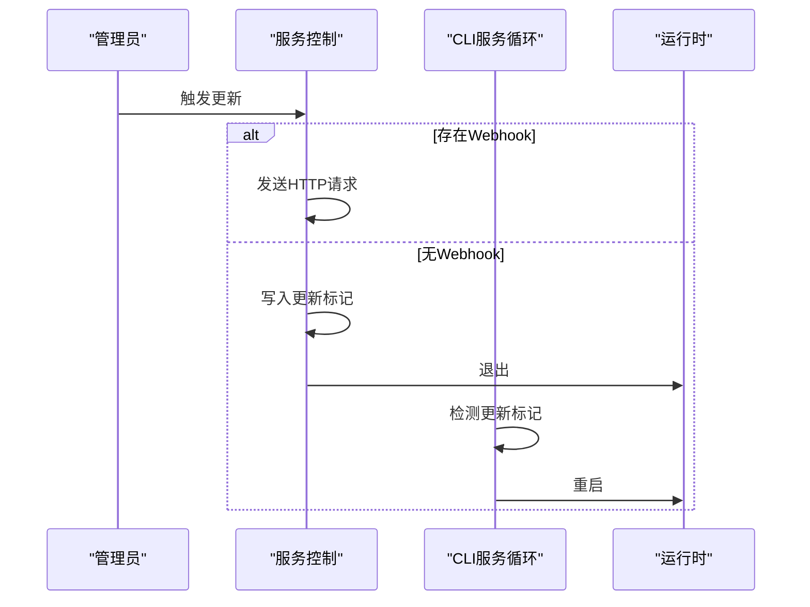
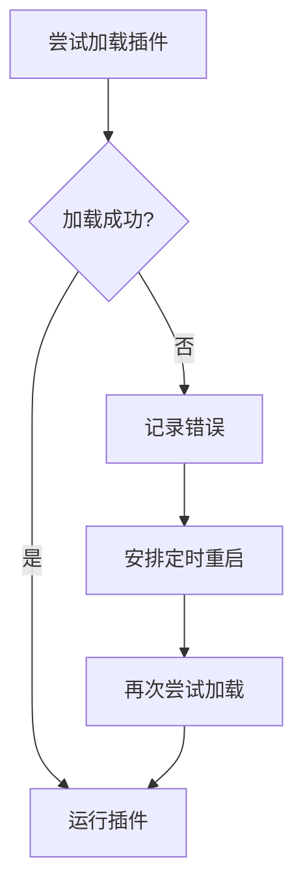
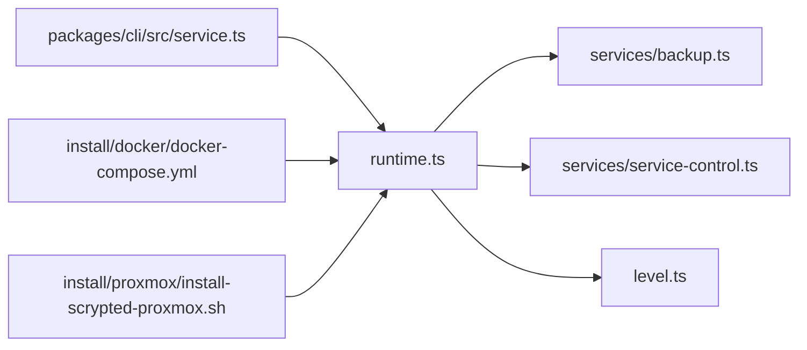

# 灾难恢复流程

<cite>
**本文引用的文件**
- [README.md](file://README.md)
- [repository.yaml](file://repository.yaml)
- [install/config.yaml](file://install/config.yaml)
- [install/docker/docker-compose.yml](file://install/docker/docker-compose.yml)
- [install/local/install-scrypted-dependencies-linux.sh](file://install/local/install-scrypted-dependencies-linux.sh)
- [server/src/runtime.ts](file://server/src/runtime.ts)
- [server/src/level.ts](file://server/src/level.ts)
- [server/src/services/backup.ts](file://server/src/services/backup.ts)
- [server/src/services/service-control.ts](file://server/src/services/service-control.ts)
- [packages/cli/src/service.ts](file://packages/cli/src/service.ts)
- [server/python/rpc.py](file://server/python/rpc.py)
- [plugins/reolink/src/reolink-api.ts](file://plugins/reolink/src/reolink-api.ts)
- [plugins/diagnostics/src/main.ts](file://plugins/diagnostics/src/main.ts)
- [install/proxmox/install-scrypted-proxmox.sh](file://install/proxmox/install-scrypted-proxmox.sh)
</cite>

## 目录
1. [简介](#简介)
2. [项目结构](#项目结构)
3. [核心组件](#核心组件)
4. [架构总览](#架构总览)
5. [详细组件分析](#详细组件分析)
6. [依赖关系分析](#依赖关系分析)
7. [性能考量](#性能考量)
8. [故障排查指南](#故障排查指南)
9. [结论](#结论)
10. [附录](#附录)

## 简介
本指南面向 Scrypted 在生产环境中的灾难恢复与应急处置，覆盖系统崩溃恢复、数据库修复、插件重载、硬件故障（磁盘、内存、网络）处理、数据丢失恢复（部分/完整/版本回滚）、恢复验证（数据完整性、功能测试、性能验证）、恢复后维护（日志清理、缓存重建、配置同步）、恢复演练（模拟故障、RTO 测试、业务连续性验证），以及恢复文档记录（过程记录、问题诊断、改进措施）。内容基于仓库中实际实现与部署脚本进行梳理，确保可执行与可追溯。

## 项目结构
Scrypted 采用模块化分层设计：服务端运行时负责核心调度、RPC、插件生命周期与备份；安装与部署通过 Docker Compose 和本地 systemd 服务管理；插件生态提供设备接入与扩展能力；诊断与硬件相关插件用于健康检查与设备控制。

**图示来源**
- [install/docker/docker-compose.yml:20-169](file://install/docker/docker-compose.yml#L20-L169)
- [install/config.yaml:1-49](file://install/config.yaml#L1-L49)
- [install/local/install-scrypted-dependencies-linux.sh:102-127](file://install/local/install-scrypted-dependencies-linux.sh#L102-L127)
- [install/proxmox/install-scrypted-proxmox.sh:251-274](file://install/proxmox/install-scrypted-proxmox.sh#L251-L274)
- [server/src/runtime.ts:64-100](file://server/src/runtime.ts#L64-L100)
- [server/src/level.ts:18-117](file://server/src/level.ts#L18-L117)
- [server/src/services/backup.ts:9-76](file://server/src/services/backup.ts#L9-L76)
- [server/src/services/service-control.ts:4-32](file://server/src/services/service-control.ts#L4-L32)
- [server/python/rpc.py:199-282](file://server/python/rpc.py#L199-L282)
- [packages/cli/src/service.ts:167-190](file://packages/cli/src/service.ts#L167-L190)
- [plugins/diagnostics/src/main.ts:483-514](file://plugins/diagnostics/src/main.ts#L483-L514)
- [plugins/reolink/src/reolink-api.ts:178-190](file://plugins/reolink/src/reolink-api.ts#L178-L190)

**章节来源**
- [README.md:1-59](file://README.md#L1-L59)
- [repository.yaml:1-4](file://repository.yaml#L1-L4)
- [install/docker/docker-compose.yml:20-169](file://install/docker/docker-compose.yml#L20-L169)
- [install/config.yaml:1-49](file://install/config.yaml#L1-L49)
- [install/local/install-scrypted-dependencies-linux.sh:102-127](file://install/local/install-scrypted-dependencies-linux.sh#L102-L127)
- [install/proxmox/install-scrypted-proxmox.sh:251-274](file://install/proxmox/install-scrypted-proxmox.sh#L251-L274)

## 核心组件
- 运行时与存储
  - 运行时负责插件加载、设备代理、RPC 调度、日志与告警、备份入口等。[路径参考:64-100](file://server/src/runtime.ts#L64-L100)
  - Level 数据库存储结构化元数据与文档型数据，支持迭代器遍历与前缀查询。[路径参考:18-117](file://server/src/level.ts#L18-L117)
- 备份与恢复
  - 备份类负责导出数据库快照并打包为 zip，恢复时关闭当前数据库、删除现有插件目录、解压并重启服务。[路径参考:9-76](file://server/src/services/backup.ts#L9-L76)
- 服务控制
  - 服务控制提供重启与更新触发能力，支持 Webhook 更新或写入更新/退出标记后重启。[路径参考:4-32](file://server/src/services/service-control.ts#L4-L32)
- CLI 服务循环
  - CLI 层在服务意外退出时自动重启，并支持检测更新文件后拉取最新版本并退出以触发外部进程替换。[路径参考:167-190](file://packages/cli/src/service.ts#L167-L190)
- 安装与系统集成
  - 本地安装脚本通过 systemd 管理服务，Docker Compose 提供容器化部署与卷挂载，Proxmox 提供虚拟机恢复流程。[路径参考:102-127](file://install/local/install-scrypted-dependencies-linux.sh#L102-L127) [路径参考:20-169](file://install/docker/docker-compose.yml#L20-L169) [路径参考:251-274](file://install/proxmox/install-scrypted-proxmox.sh#L251-L274)

**章节来源**
- [server/src/runtime.ts:64-100](file://server/src/runtime.ts#L64-L100)
- [server/src/level.ts:18-117](file://server/src/level.ts#L18-L117)
- [server/src/services/backup.ts:9-76](file://server/src/services/backup.ts#L9-L76)
- [server/src/services/service-control.ts:4-32](file://server/src/services/service-control.ts#L4-L32)
- [packages/cli/src/service.ts:167-190](file://packages/cli/src/service.ts#L167-L190)
- [install/local/install-scrypted-dependencies-linux.sh:102-127](file://install/local/install-scrypted-dependencies-linux.sh#L102-L127)
- [install/docker/docker-compose.yml:20-169](file://install/docker/docker-compose.yml#L20-L169)
- [install/proxmox/install-scrypted-proxmox.sh:251-274](file://install/proxmox/install-scrypted-proxmox.sh#L251-L274)

## 架构总览
下图展示灾难恢复相关的关键交互：备份/恢复由运行时调用备份服务完成；服务控制负责重启与更新；CLI 层保障异常退出后的自愈；Docker/Proxmox 配置决定数据持久化位置与恢复策略；诊断与设备插件用于健康检查与设备级恢复。

**图示来源**
- [server/src/runtime.ts:97-98](file://server/src/runtime.ts#L97-L98)
- [server/src/services/backup.ts:12-46](file://server/src/services/backup.ts#L12-L46)
- [server/src/services/backup.ts:48-76](file://server/src/services/backup.ts#L48-L76)
- [server/src/services/service-control.ts:16-31](file://server/src/services/service-control.ts#L16-L31)
- [packages/cli/src/service.ts:167-190](file://packages/cli/src/service.ts#L167-L190)
- [install/docker/docker-compose.yml:81-84](file://install/docker/docker-compose.yml#L81-L84)
- [install/proxmox/install-scrypted-proxmox.sh:251-274](file://install/proxmox/install-scrypted-proxmox.sh#L251-L274)

## 详细组件分析

### 备份与恢复流程
- 备份流程
  - 打开临时 Level 数据库，遍历主数据库迭代器，逐条写入临时数据库，随后打包为 zip。[路径参考:12-46](file://server/src/services/backup.ts#L12-L46)
- 恢复流程
  - 校验 zip；调用运行时终止自身；关闭当前数据存储；删除现有数据库与插件目录；解压备份到数据库路径；通过服务控制重启。[路径参考:48-76](file://server/src/services/backup.ts#L48-L76)
- 关键点
  - 临时数据库避免备份过程中对主数据库的写放大；删除插件目录确保恢复后重新安装，避免版本不一致。[路径参考:15-26](file://server/src/services/backup.ts#L15-L26) [路径参考:66-71](file://server/src/services/backup.ts#L66-L71)

**图示来源**
- [server/src/services/backup.ts:12-46](file://server/src/services/backup.ts#L12-L46)
- [server/src/services/backup.ts:48-76](file://server/src/services/backup.ts#L48-L76)

**章节来源**
- [server/src/services/backup.ts:9-76](file://server/src/services/backup.ts#L9-L76)

### 服务重启与更新
- 重启
  - 服务控制写入退出标记并退出，由上层进程（如 CLI 或 systemd）拉起。[路径参考:5-10](file://server/src/services/service-control.ts#L5-L10)
  - CLI 循环在服务退出后等待一段时间并重启，保证异常退出后的自愈。[路径参考:167-190](file://packages/cli/src/service.ts#L167-L190)
- 更新
  - 若存在 Webhook 更新地址，则向该地址发起请求；否则写入更新标记并触发重启。[路径参考:16-31](file://server/src/services/service-control.ts#L16-L31)

**图示来源**
- [server/src/services/service-control.ts:16-31](file://server/src/services/service-control.ts#L16-L31)
- [packages/cli/src/service.ts:167-190](file://packages/cli/src/service.ts#L167-L190)

**章节来源**
- [server/src/services/service-control.ts:4-32](file://server/src/services/service-control.ts#L4-L32)
- [packages/cli/src/service.ts:167-190](file://packages/cli/src/service.ts#L167-L190)

### 插件重载与异常恢复
- 插件加载与重试
  - 运行时在插件加载失败时会记录错误并安排定时重启，避免单次失败导致永久不可用。[路径参考:691-720](file://server/src/runtime.ts#L691-L720)
- 设备代理与混入表失效
  - 当插件被卸载或设备状态变化时，运行时会失效设备代理与混入表，并在后续重建，确保接口一致性。[路径参考:493-542](file://server/src/runtime.ts#L493-L542)
- RPC 异常处理
  - Python RPC 层在对端被杀时清理挂起结果并抛出错误，避免悬挂连接影响新会话。[路径参考:220-241](file://server/python/rpc.py#L220-L241)

**图示来源**
- [server/src/runtime.ts:691-720](file://server/src/runtime.ts#L691-L720)
- [server/python/rpc.py:220-241](file://server/python/rpc.py#L220-L241)

**章节来源**
- [server/src/runtime.ts:493-542](file://server/src/runtime.ts#L493-L542)
- [server/src/runtime.ts:691-720](file://server/src/runtime.ts#L691-L720)
- [server/python/rpc.py:220-241](file://server/python/rpc.py#L220-L241)

### 硬件故障处理
- 磁盘故障
  - Docker Compose 默认将数据库卷映射到相对路径 volume，建议在宿主机层面使用 RAID 或外部存储；Proxmox 脚本提供 VM 卷迁移与恢复流程。[路径参考:81-84](file://install/docker/docker-compose.yml#L81-L84) [路径参考:251-274](file://install/proxmox/install-scrypted-proxmox.sh#L251-L274)
- 内存故障
  - 诊断插件对内存容量进行校验，NVR 场景建议不低于 16GB，普通场景不低于 8GB。[路径参考:504-514](file://plugins/diagnostics/src/main.ts#L504-L514)
- 网络故障
  - 诊断插件检查 IPv4/IPv6 地址设置与 CPU 数量，确保网络可达性与性能满足要求。[路径参考:486-502](file://plugins/diagnostics/src/main.ts#L486-L502)

**章节来源**
- [install/docker/docker-compose.yml:81-84](file://install/docker/docker-compose.yml#L81-L84)
- [install/proxmox/install-scrypted-proxmox.sh:251-274](file://install/proxmox/install-scrypted-proxmox.sh#L251-L274)
- [plugins/diagnostics/src/main.ts:486-514](file://plugins/diagnostics/src/main.ts#L486-L514)

### 数据丢失恢复
- 部分数据恢复
  - 使用备份服务导出数据库快照，针对特定文档类型可通过 Level 前缀查询与删除/重建实现局部恢复。[路径参考:45-56](file://server/src/level.ts#L45-L56) [路径参考:96-113](file://server/src/level.ts#L96-L113)
- 完整数据恢复
  - 通过备份服务恢复完整数据库与插件目录，随后重启服务，确保所有设备与用户配置恢复。[路径参考:48-76](file://server/src/services/backup.ts#L48-L76)
- 版本回滚
  - 通过服务控制触发更新/重启，若使用 Webhook 则由外部系统拉取目标版本；若无 Webhook 则写入更新标记后重启，由上层进程替换为旧版本二进制。[路径参考:16-31](file://server/src/services/service-control.ts#L16-L31) [路径参考:173-180](file://packages/cli/src/service.ts#L173-L180)

**章节来源**
- [server/src/level.ts:45-56](file://server/src/level.ts#L45-L56)
- [server/src/level.ts:96-113](file://server/src/level.ts#L96-L113)
- [server/src/services/backup.ts:48-76](file://server/src/services/backup.ts#L48-L76)
- [server/src/services/service-control.ts:16-31](file://server/src/services/service-control.ts#L16-L31)
- [packages/cli/src/service.ts:173-180](file://packages/cli/src/service.ts#L173-L180)

### 恢复验证程序
- 数据完整性检查
  - 通过 Level 迭代器遍历文档计数与前缀匹配，核对关键文档是否存在且类型正确。[路径参考:58-64](file://server/src/level.ts#L58-L64)
- 功能测试
  - 使用诊断插件检查网络地址、CPU 数量与内存容量，确保系统满足最低要求。[路径参考:486-514](file://plugins/diagnostics/src/main.ts#L486-L514)
- 性能验证
  - 结合诊断插件的 CPU/内存检查，结合实际业务负载评估系统性能是否达标。[路径参考:498-514](file://plugins/diagnostics/src/main.ts#L498-L514)

**章节来源**
- [server/src/level.ts:58-64](file://server/src/level.ts#L58-L64)
- [plugins/diagnostics/src/main.ts:486-514](file://plugins/diagnostics/src/main.ts#L486-L514)

### 恢复后的系统维护
- 日志清理
  - 运行时按小时清理超过 48 小时的日志，避免日志膨胀影响系统性能。[路径参考:172-176](file://server/src/runtime.ts#L172-L176)
- 缓存重建
  - 恢复后插件会重新安装与加载，缓存随插件初始化重建；同时建议清理不必要的临时文件与缓存目录。[路径参考:66-71](file://server/src/services/backup.ts#L66-L71)
- 配置同步
  - Docker Compose 与 Proxmox 脚本定义了卷挂载与恢复流程，确保配置与数据持久化到指定路径。[路径参考:81-84](file://install/docker/docker-compose.yml#L81-L84) [路径参考:251-274](file://install/proxmox/install-scrypted-proxmox.sh#L251-L274)

**章节来源**
- [server/src/runtime.ts:172-176](file://server/src/runtime.ts#L172-L176)
- [server/src/services/backup.ts:66-71](file://server/src/services/backup.ts#L66-L71)
- [install/docker/docker-compose.yml:81-84](file://install/docker/docker-compose.yml#L81-L84)
- [install/proxmox/install-scrypted-proxmox.sh:251-274](file://install/proxmox/install-scrypted-proxmox.sh#L251-L274)

### 恢复演练
- 模拟故障场景
  - 磁盘故障：断开卷挂载或模拟磁盘损坏，验证备份恢复与数据完整性。[路径参考:81-84](file://install/docker/docker-compose.yml#L81-L84)
  - 内存故障：降低可用内存至阈值以下，验证诊断插件告警与系统稳定性。[路径参考:504-514](file://plugins/diagnostics/src/main.ts#L504-L514)
  - 网络故障：禁用网络或修改 DNS，验证服务可用性与更新机制。[路径参考:16-31](file://server/src/services/service-control.ts#L16-L31)
- RTO 测试
  - 记录从故障发生到服务可用的时间，优化备份与恢复流程以缩短 RTO。[路径参考:48-76](file://server/src/services/backup.ts#L48-L76)
- 业务连续性验证
  - 通过诊断插件与设备插件（如 Reolink）验证核心功能（如摄像头访问、网络协议开关）在恢复后正常工作。[路径参考:178-190](file://plugins/reolink/src/reolink-api.ts#L178-L190)

**章节来源**
- [install/docker/docker-compose.yml:81-84](file://install/docker/docker-compose.yml#L81-L84)
- [plugins/diagnostics/src/main.ts:504-514](file://plugins/diagnostics/src/main.ts#L504-L514)
- [server/src/services/service-control.ts:16-31](file://server/src/services/service-control.ts#L16-L31)
- [server/src/services/backup.ts:48-76](file://server/src/services/backup.ts#L48-L76)
- [plugins/reolink/src/reolink-api.ts:178-190](file://plugins/reolink/src/reolink-api.ts#L178-L190)

### 恢复文档记录
- 恢复过程记录
  - 记录备份/恢复时间、操作人员、涉及的卷与插件、恢复前后关键指标（如文档数量、设备在线率）。[路径参考:12-46](file://server/src/services/backup.ts#L12-L46)
- 问题诊断
  - 结合运行时日志与告警、CLI 自愈行为、服务控制更新日志，定位异常根因。[路径参考:155-170](file://server/src/runtime.ts#L155-L170) [路径参考:167-190](file://packages/cli/src/service.ts#L167-L190)
- 改进措施
  - 基于演练结果优化备份频率、恢复脚本健壮性与监控告警阈值。[路径参考:48-76](file://server/src/services/backup.ts#L48-L76)

**章节来源**
- [server/src/services/backup.ts:12-46](file://server/src/services/backup.ts#L12-L46)
- [server/src/runtime.ts:155-170](file://server/src/runtime.ts#L155-L170)
- [packages/cli/src/service.ts:167-190](file://packages/cli/src/service.ts#L167-L190)

## 依赖关系分析
- 组件耦合
  - 运行时聚合多个子系统（备份、服务控制、日志、用户、集群等），作为核心协调者。[路径参考:97-98](file://server/src/runtime.ts#L97-L98)
  - 备份服务依赖 Level 数据库与插件卷路径，恢复时强依赖服务控制重启。[路径参考:9-76](file://server/src/services/backup.ts#L9-L76)
- 外部依赖
  - Docker Compose 与 Proxmox 提供数据持久化与虚拟化恢复能力；CLI 与 systemd 提供服务自愈与更新能力。[路径参考:20-169](file://install/docker/docker-compose.yml#L20-L169) [路径参考:102-127](file://install/local/install-scrypted-dependencies-linux.sh#L102-L127) [路径参考:251-274](file://install/proxmox/install-scrypted-proxmox.sh#L251-L274)

**图示来源**
- [server/src/runtime.ts:97-98](file://server/src/runtime.ts#L97-L98)
- [server/src/services/backup.ts:9-76](file://server/src/services/backup.ts#L9-L76)
- [server/src/services/service-control.ts:4-32](file://server/src/services/service-control.ts#L4-L32)
- [server/src/level.ts:18-117](file://server/src/level.ts#L18-L117)
- [packages/cli/src/service.ts:167-190](file://packages/cli/src/service.ts#L167-L190)
- [install/docker/docker-compose.yml:20-169](file://install/docker/docker-compose.yml#L20-L169)
- [install/proxmox/install-scrypted-proxmox.sh:251-274](file://install/proxmox/install-scrypted-proxmox.sh#L251-L274)

**章节来源**
- [server/src/runtime.ts:97-98](file://server/src/runtime.ts#L97-L98)
- [server/src/services/backup.ts:9-76](file://server/src/services/backup.ts#L9-L76)
- [server/src/services/service-control.ts:4-32](file://server/src/services/service-control.ts#L4-L32)
- [server/src/level.ts:18-117](file://server/src/level.ts#L18-L117)
- [packages/cli/src/service.ts:167-190](file://packages/cli/src/service.ts#L167-L190)
- [install/docker/docker-compose.yml:20-169](file://install/docker/docker-compose.yml#L20-L169)
- [install/proxmox/install-scrypted-proxmox.sh:251-274](file://install/proxmox/install-scrypted-proxmox.sh#L251-L274)

## 性能考量
- 备份与恢复
  - 备份采用临时数据库与异步打包，避免对主数据库写放大；恢复时删除插件目录确保干净重装。[路径参考:12-46](file://server/src/services/backup.ts#L12-L46) [路径参考:66-71](file://server/src/services/backup.ts#L66-L71)
- 日志与存储
  - 运行时定期清理旧日志，减少磁盘压力；Docker 日志驱动默认关闭以降低闪存磨损。[路径参考:172-176](file://server/src/runtime.ts#L172-L176) [路径参考:123-131](file://install/docker/docker-compose.yml#L123-L131)
- 网络与更新
  - 服务控制支持 Webhook 更新，避免频繁重启；DNS 配置提升外部资源访问成功率。[路径参考:16-31](file://server/src/services/service-control.ts#L16-L31) [路径参考:135-139](file://install/docker/docker-compose.yml#L135-L139)

**章节来源**
- [server/src/services/backup.ts:12-46](file://server/src/services/backup.ts#L12-L46)
- [server/src/runtime.ts:172-176](file://server/src/runtime.ts#L172-L176)
- [install/docker/docker-compose.yml:123-139](file://install/docker/docker-compose.yml#L123-L139)

## 故障排查指南
- 系统崩溃
  - 检查 CLI 是否自动重启；查看服务控制是否写入更新/退出标记；确认 Docker 卷挂载是否正常。[路径参考:167-190](file://packages/cli/src/service.ts#L167-L190) [路径参考:5-10](file://server/src/services/service-control.ts#L5-L10) [路径参考:81-84](file://install/docker/docker-compose.yml#L81-L84)
- 数据库异常
  - 使用 Level 迭代器检查文档数量与类型；必要时执行备份恢复流程。[路径参考:58-64](file://server/src/level.ts#L58-L64) [路径参考:48-76](file://server/src/services/backup.ts#L48-L76)
- 插件崩溃
  - 查看运行时日志与告警；确认插件是否被自动重启；必要时手动卸载并重新安装。[路径参考:691-720](file://server/src/runtime.ts#L691-L720) [路径参考:155-170](file://server/src/runtime.ts#L155-L170)

**章节来源**
- [packages/cli/src/service.ts:167-190](file://packages/cli/src/service.ts#L167-L190)
- [server/src/services/service-control.ts:5-10](file://server/src/services/service-control.ts#L5-L10)
- [install/docker/docker-compose.yml:81-84](file://install/docker/docker-compose.yml#L81-L84)
- [server/src/level.ts:58-64](file://server/src/level.ts#L58-L64)
- [server/src/services/backup.ts:48-76](file://server/src/services/backup.ts#L48-L76)
- [server/src/runtime.ts:691-720](file://server/src/runtime.ts#L691-L720)
- [server/src/runtime.ts:155-170](file://server/src/runtime.ts#L155-L170)

## 结论
本指南基于 Scrypted 实际实现，提供了从备份/恢复、服务重启与更新、插件重载到硬件故障处理、数据恢复、验证与维护的全流程方法论。建议将演练纳入常规运维计划，持续优化恢复策略与监控告警，确保业务连续性与系统韧性。

## 附录
- 参考配置与脚本
  - Docker Compose 卷与网络配置、DNS 设置、Watchtower 更新端口。[路径参考:20-169](file://install/docker/docker-compose.yml#L20-L169)
  - 本地 systemd 服务安装与启动脚本。[路径参考:102-127](file://install/local/install-scrypted-dependencies-linux.sh#L102-L127)
  - Proxmox VM 恢复与卷迁移脚本。[路径参考:251-274](file://install/proxmox/install-scrypted-proxmox.sh#L251-L274)

**章节来源**
- [install/docker/docker-compose.yml:20-169](file://install/docker/docker-compose.yml#L20-L169)
- [install/local/install-scrypted-dependencies-linux.sh:102-127](file://install/local/install-scrypted-dependencies-linux.sh#L102-L127)
- [install/proxmox/install-scrypted-proxmox.sh:251-274](file://install/proxmox/install-scrypted-proxmox.sh#L251-L274)