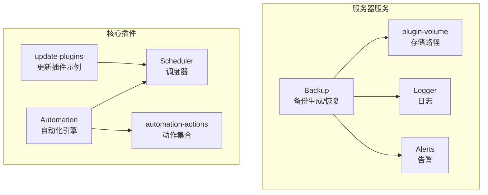
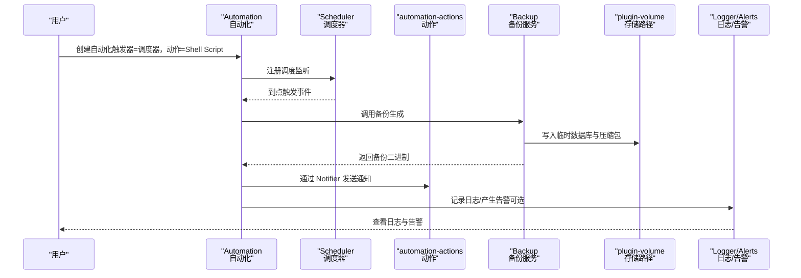
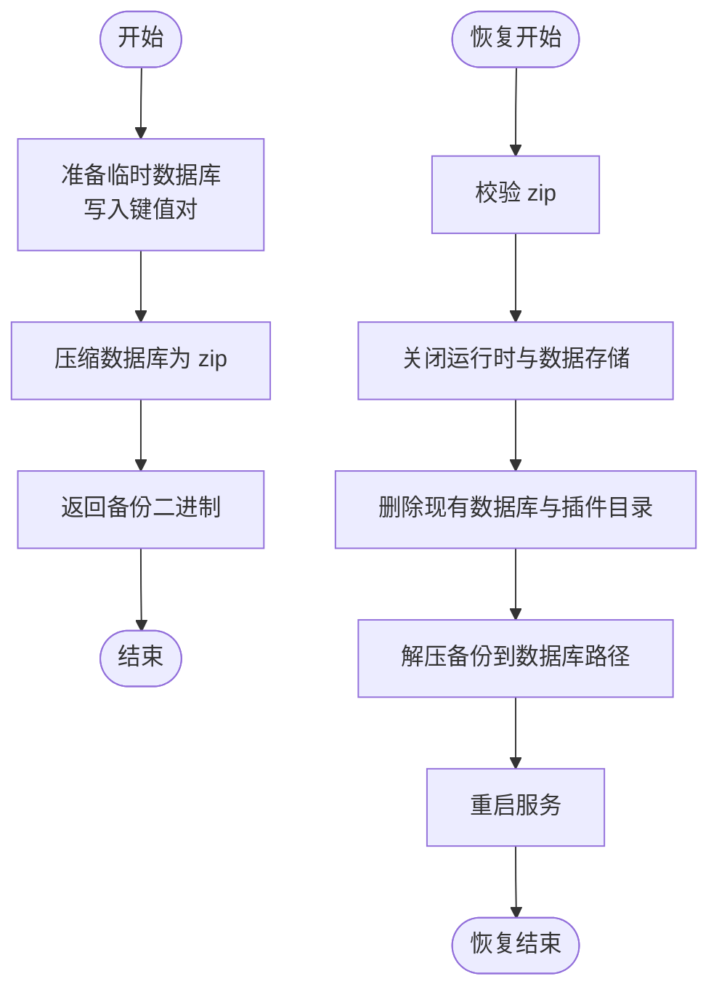
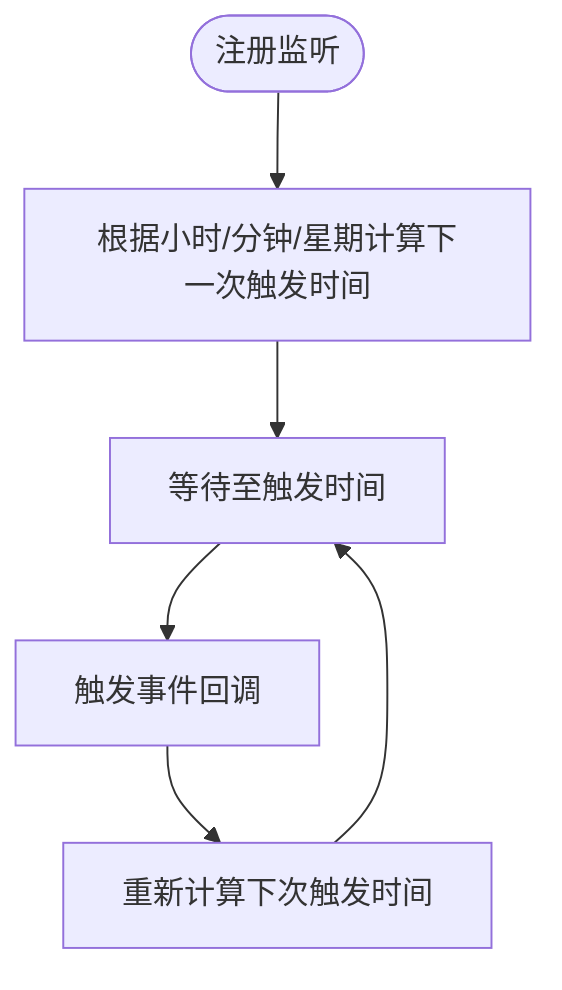
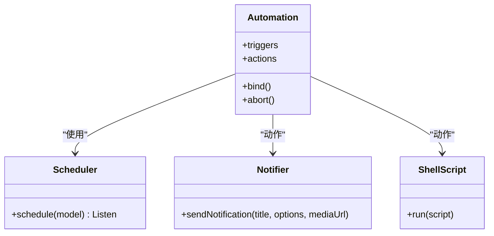
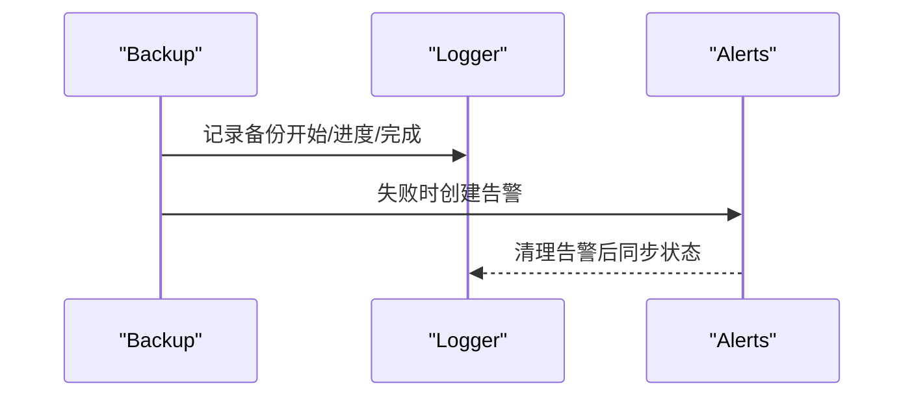
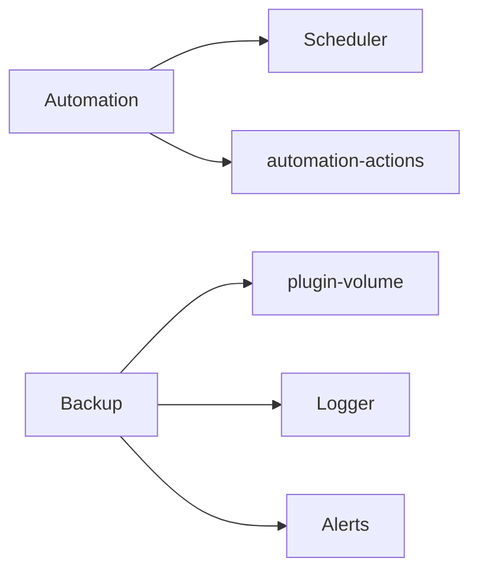

# 自动化备份配置

<cite>
**本文引用的文件**
- [backup.ts](file://server/src/services/backup.ts)
- [scheduler.ts](file://plugins/core/src/builtins/scheduler.ts)
- [automation.ts](file://plugins/core/src/automation.ts)
- [automation-actions.ts](file://plugins/core/src/automation-actions.ts)
- [logger.ts](file://server/src/logger.ts)
- [alerts.ts](file://server/src/services/alerts.ts)
- [plugin-volume.ts](file://server/src/plugin/plugin-volume.ts)
- [update-plugins.ts](file://plugins/core/src/update-plugins.ts)
</cite>

## 目录
1. [简介](#简介)
2. [项目结构](#项目结构)
3. [核心组件](#核心组件)
4. [架构总览](#架构总览)
5. [详细组件分析](#详细组件分析)
6. [依赖关系分析](#依赖关系分析)
7. [性能考量](#性能考量)
8. [故障排查指南](#故障排查指南)
9. [结论](#结论)
10. [附录](#附录)

## 简介
本指南面向在 Scrypted 中进行“自动化备份”的用户与运维人员，围绕以下目标展开：如何通过自动化系统设置定时备份任务（含 cron 风格的调度模型）、备份触发时机与执行间隔、备份存储位置（本地/网络/云）的配置思路、备份保留策略与空间管理、备份通知与告警、备份加密与安全、备份监控与日志、以及备份脚本定制（自定义命令、预处理/后处理）。  
需要特别说明的是：当前仓库中并未直接提供“云存储”或“网络存储”的具体实现入口；但已具备“本地存储”的备份生成能力与“自动化调度+通知”的基础设施，可据此扩展到外部存储方案。

## 项目结构
围绕备份主题的关键模块分布如下：
- 备份生成与恢复：server/src/services/backup.ts
- 自动化调度器：plugins/core/src/builtins/scheduler.ts
- 自动化引擎与动作：plugins/core/src/automation.ts、plugins/core/src/automation-actions.ts
- 日志与告警：server/src/logger.ts、server/src/services/alerts.ts
- 存储路径：server/src/plugin/plugin-volume.ts
- 更新插件示例（展示调度与动作组合）：plugins/core/src/update-plugins.ts

图表来源
- [backup.ts:1-76](file://server/src/services/backup.ts#L1-L76)
- [scheduler.ts:1-101](file://plugins/core/src/builtins/scheduler.ts#L1-L101)
- [automation.ts:350-549](file://plugins/core/src/automation.ts#L350-L549)
- [automation-actions.ts:1-104](file://plugins/core/src/automation-actions.ts#L1-L104)
- [logger.ts:1-93](file://server/src/logger.ts#L1-L93)
- [alerts.ts:1-23](file://server/src/services/alerts.ts#L1-L23)
- [plugin-volume.ts:1-33](file://server/src/plugin/plugin-volume.ts#L1-L33)
- [update-plugins.ts:1-48](file://plugins/core/src/update-plugins.ts#L1-L48)

章节来源
- [backup.ts:1-76](file://server/src/services/backup.ts#L1-L76)
- [scheduler.ts:1-101](file://plugins/core/src/builtins/scheduler.ts#L1-L101)
- [automation.ts:350-549](file://plugins/core/src/automation.ts#L350-L549)
- [automation-actions.ts:1-104](file://plugins/core/src/automation-actions.ts#L1-L104)
- [logger.ts:1-93](file://server/src/logger.ts#L1-L93)
- [alerts.ts:1-23](file://server/src/services/alerts.ts#L1-L23)
- [plugin-volume.ts:1-33](file://server/src/plugin/plugin-volume.ts#L1-L33)
- [update-plugins.ts:1-48](file://plugins/core/src/update-plugins.ts#L1-L48)

## 核心组件
- 备份服务（Backup）
  - 负责从运行时数据存储中导出键值对，写入临时数据库，再打包为 zip 返回二进制流，用于下载或进一步持久化。
  - 提供恢复流程：校验 zip、关闭运行时、删除现有数据库与插件目录、解压并重启服务。
- 调度器（Scheduler）
  - 基于小时/分钟与周内星期布尔位，计算下一次触发时间，并以事件回调方式驱动自动化。
- 自动化引擎（Automation）
  - 支持多种触发器（含调度器）与动作（设备控制、脚本、等待等），并提供“Shell Script”动作类型，可用于执行备份前/后的自定义命令。
- 动作集合（automation-actions）
  - 提供通知类动作（Notifier），可用于备份成功/失败后的消息推送。
- 日志与告警（Logger、Alerts）
  - 提供统一的日志结构与告警清理接口，便于监控与排障。
- 存储路径（plugin-volume）
  - 定义默认卷目录（SCRYPTED_VOLUME 或用户主目录下的 .scrypted/volume），备份生成与恢复均在此目录下进行。

章节来源
- [backup.ts:9-76](file://server/src/services/backup.ts#L9-L76)
- [scheduler.ts:16-101](file://plugins/core/src/builtins/scheduler.ts#L16-L101)
- [automation.ts:350-549](file://plugins/core/src/automation.ts#L350-L549)
- [automation-actions.ts:70-104](file://plugins/core/src/automation-actions.ts#L70-L104)
- [logger.ts:11-93](file://server/src/logger.ts#L11-L93)
- [alerts.ts:1-23](file://server/src/services/alerts.ts#L1-L23)
- [plugin-volume.ts:5-32](file://server/src/plugin/plugin-volume.ts#L5-L32)

## 架构总览
下图展示了“自动化备份”的端到端流程：自动化触发 -> 执行 Shell 脚本（可选预处理/后处理）-> 调用 Backup 生成备份 -> 通过 Notifier 发送通知 -> 记录日志与告警。

图表来源
- [automation.ts:544-566](file://plugins/core/src/automation.ts#L544-L566)
- [scheduler.ts:34-101](file://plugins/core/src/builtins/scheduler.ts#L34-L101)
- [automation-actions.ts:70-104](file://plugins/core/src/automation-actions.ts#L70-L104)
- [backup.ts:12-46](file://server/src/services/backup.ts#L12-L46)
- [plugin-volume.ts:5-8](file://server/src/plugin/plugin-volume.ts#L5-L8)
- [logger.ts:33-46](file://server/src/logger.ts#L33-L46)
- [alerts.ts:8-22](file://server/src/services/alerts.ts#L8-L22)

## 详细组件分析

### 组件一：备份生成与恢复（Backup）
- 生成流程
  - 在卷目录下创建临时数据库文件，遍历运行时数据存储写入该数据库。
  - 使用压缩库将临时数据库目录打包为 zip，返回二进制缓冲区。
- 恢复流程
  - 校验 zip 文件有效性。
  - 关闭运行时与数据存储，删除现有数据库与插件目录。
  - 解压备份内容到数据库路径，重启服务。

图表来源
- [backup.ts:12-76](file://server/src/services/backup.ts#L12-L76)
- [plugin-volume.ts:5-8](file://server/src/plugin/plugin-volume.ts#L5-L8)

章节来源
- [backup.ts:9-76](file://server/src/services/backup.ts#L9-L76)
- [plugin-volume.ts:5-32](file://server/src/plugin/plugin-volume.ts#L5-L32)

### 组件二：自动化调度（Scheduler）
- 调度模型
  - 接收小时、分钟与周内各日布尔位，计算未来最近一次满足条件的时间点。
  - 通过回调事件驱动上层自动化执行。
- 触发时机
  - 当到达设定时刻且对应星期被启用时，触发一次事件；随后重新计算下一次触发时间。

图表来源
- [scheduler.ts:34-101](file://plugins/core/src/builtins/scheduler.ts#L34-L101)

章节来源
- [scheduler.ts:16-101](file://plugins/core/src/builtins/scheduler.ts#L16-L101)

### 组件三：自动化引擎与动作（Automation、automation-actions）
- 触发器
  - 支持“调度器”、“计时器”、“设备事件”等多种触发器；调度器由内置 Scheduler 提供。
- 动作
  - 设备控制、程序运行、亮度调节、锁具控制等。
  - “Shell Script”动作：允许在触发时执行自定义 Shell 命令，适合预处理/后处理与外部存储交互。
  - “Notifier”动作：支持发送标题、正文与媒体（图片/视频流），用于备份成功/失败通知。

图表来源
- [automation.ts:350-549](file://plugins/core/src/automation.ts#L350-L549)
- [automation-actions.ts:70-104](file://plugins/core/src/automation-actions.ts#L70-L104)
- [scheduler.ts:16-101](file://plugins/core/src/builtins/scheduler.ts#L16-L101)

章节来源
- [automation.ts:350-549](file://plugins/core/src/automation.ts#L350-L549)
- [automation-actions.ts:70-104](file://plugins/core/src/automation-actions.ts#L70-L104)

### 组件四：日志与告警（Logger、Alerts）
- Logger
  - 统一日志结构，支持子日志器聚合、按时间排序、清理过期日志。
- Alerts
  - 提供获取、移除、清空告警的能力，便于在备份失败时进行告警管理。

图表来源
- [logger.ts:19-93](file://server/src/logger.ts#L19-L93)
- [alerts.ts:1-23](file://server/src/services/alerts.ts#L1-L23)

章节来源
- [logger.ts:11-93](file://server/src/logger.ts#L11-L93)
- [alerts.ts:1-23](file://server/src/services/alerts.ts#L1-L23)

## 依赖关系分析
- Backup 依赖
  - 运行时数据存储迭代器（从运行时数据存储导出键值对）。
  - 卷目录（默认位于 SCRYPTED_VOLUME 或用户主目录下的 .scrypted/volume）。
- Automation 依赖
  - Scheduler（内置调度器）。
  - automation-actions（动作集合，含 Notifier、Shell Script 等）。
- Logger/Alerts
  - 与 Backup 协同，提供日志与告警能力。

图表来源
- [automation.ts:544-566](file://plugins/core/src/automation.ts#L544-L566)
- [scheduler.ts:16-101](file://plugins/core/src/builtins/scheduler.ts#L16-L101)
- [automation-actions.ts:70-104](file://plugins/core/src/automation-actions.ts#L70-L104)
- [backup.ts:12-46](file://server/src/services/backup.ts#L12-L46)
- [plugin-volume.ts:5-8](file://server/src/plugin/plugin-volume.ts#L5-L8)
- [logger.ts:19-93](file://server/src/logger.ts#L19-L93)
- [alerts.ts:1-23](file://server/src/services/alerts.ts#L1-L23)

章节来源
- [automation.ts:544-566](file://plugins/core/src/automation.ts#L544-L566)
- [scheduler.ts:16-101](file://plugins/core/src/builtins/scheduler.ts#L16-L101)
- [automation-actions.ts:70-104](file://plugins/core/src/automation-actions.ts#L70-L104)
- [backup.ts:12-46](file://server/src/services/backup.ts#L12-L46)
- [plugin-volume.ts:5-8](file://server/src/plugin/plugin-volume.ts#L5-L8)
- [logger.ts:19-93](file://server/src/logger.ts#L19-L93)
- [alerts.ts:1-23](file://server/src/services/alerts.ts#L1-L23)

## 性能考量
- 备份生成
  - 备份过程会遍历运行时数据存储并写入临时数据库，随后压缩。建议在低负载时段执行，避免与高并发 I/O 冲突。
- 调度与事件
  - Scheduler 会在每次触发后重新计算下一次时间，确保不会过于频繁地重复触发。
- 日志与告警
  - Logger 支持按时间窗口清理日志，避免长期运行导致内存占用过高。

章节来源
- [backup.ts:23-25](file://server/src/services/backup.ts#L23-L25)
- [scheduler.ts:70-77](file://plugins/core/src/builtins/scheduler.ts#L70-L77)
- [logger.ts:48-53](file://server/src/logger.ts#L48-L53)

## 故障排查指南
- 备份失败
  - 检查日志输出，定位错误发生阶段（数据库写入、压缩、解压、重启）。
  - 若 zip 校验失败，确认备份文件未被截断或损坏。
- 恢复异常
  - 确认恢复前服务已完全停止，数据库与插件目录已被清理。
  - 检查重启后服务状态是否正常。
- 通知与告警
  - 使用 Alerts 接口查看/清除告警，结合 Logger 日志定位问题根因。
- 自动化未触发
  - 检查调度器配置（小时/分钟/星期）是否正确，确认自动化处于启用状态。

章节来源
- [backup.ts:48-76](file://server/src/services/backup.ts#L48-L76)
- [logger.ts:64-75](file://server/src/logger.ts#L64-L75)
- [alerts.ts:8-22](file://server/src/services/alerts.ts#L8-L22)
- [automation.ts:123-133](file://plugins/core/src/automation.ts#L123-L133)

## 结论
通过“调度器 + 自动化引擎 + 备份服务 + 通知/日志/告警”的组合，Scrypted 已具备构建“自动化备份”的完整能力。当前仓库未直接提供云存储/网络存储的接入点，但可通过“Shell Script”动作与外部工具（如 rsync、rclone、S3 客户端等）实现将备份文件推送到远端存储。同时，利用 Logger 与 Alerts 可实现完善的监控与告警闭环。

## 附录

### A. 定时备份任务设置（调度与执行）
- 触发器选择
  - 使用“调度器”作为触发器，配置小时、分钟与星期布尔位，实现周期性触发。
- 执行间隔
  - 通过调整小时/分钟与星期位，实现每日/每周/特定日期的备份。
- 示例参考
  - 更新插件自动化示例展示了调度器与动作的组合方式，可类比配置备份自动化。

章节来源
- [scheduler.ts:16-101](file://plugins/core/src/builtins/scheduler.ts#L16-L101)
- [update-plugins.ts:1-48](file://plugins/core/src/update-plugins.ts#L1-L48)
- [automation.ts:544-566](file://plugins/core/src/automation.ts#L544-L566)

### B. 备份存储位置配置（本地/网络/云）
- 本地存储
  - 默认卷目录位于 SCRYPTED_VOLUME 或用户主目录下的 .scrypted/volume。备份生成与恢复均基于此目录。
- 网络/云存储
  - 仓库未提供直接的云存储/网络存储接入实现。可在“Shell Script”动作中调用外部工具（如 rclone、AWS CLI、rsync 等）将备份文件上传至远端存储。
- 备份文件命名
  - 备份生成时会创建临时数据库与 zip 文件，最终以二进制形式返回。若需持久化，应在脚本中将其保存到指定路径。

章节来源
- [plugin-volume.ts:5-8](file://server/src/plugin/plugin-volume.ts#L5-L8)
- [backup.ts:12-46](file://server/src/services/backup.ts#L12-L46)
- [automation.ts:350-361](file://plugins/core/src/automation.ts#L350-L361)

### C. 备份保留策略与空间管理
- 保留策略
  - 仓库未提供自动清理策略。可在“Shell Script”动作中编写脚本，按天/周/月保留并删除过期备份。
- 存储空间管理
  - 建议在外部存储侧设置生命周期策略（如对象存储的过期删除），并在本地定期清理临时备份文件。

章节来源
- [automation.ts:350-361](file://plugins/core/src/automation.ts#L350-L361)

### D. 备份通知与告警
- 成功通知
  - 使用“Notifier”动作发送标题与正文，必要时附带图片/视频流。
- 失败告警
  - 结合 Logger 与 Alerts，在备份失败时创建告警并通知管理员。
- 存储空间预警
  - 在外部存储侧配置配额/阈值告警，或在“Shell Script”中检测剩余空间并触发通知。

章节来源
- [automation-actions.ts:70-104](file://plugins/core/src/automation-actions.ts#L70-L104)
- [logger.ts:33-46](file://server/src/logger.ts#L33-L46)
- [alerts.ts:8-22](file://server/src/services/alerts.ts#L8-L22)

### E. 备份加密与安全
- 数据加密
  - 仓库未提供备份文件的内置加密功能。可在“Shell Script”中调用加密工具（如 GPG、AES）对备份文件进行加密后再上传。
- 访问权限控制
  - 对外部存储的访问密钥与权限进行最小化授权，避免泄露。
- 传输安全
  - 使用 HTTPS/TLS 通道上传，或通过 VPN/专线传输，降低中间人风险。

章节来源
- [automation.ts:350-361](file://plugins/core/src/automation.ts#L350-L361)

### F. 备份监控与日志
- 备份状态监控
  - 通过 Logger 记录关键节点（开始、完成、错误），并通过 Alerts 管理告警。
- 日志记录
  - 使用 Logger 的聚合与排序能力，集中查看各子模块日志。
- 性能指标
  - 可在“Shell Script”中统计备份耗时、大小等指标，上报至外部监控系统。

章节来源
- [logger.ts:19-93](file://server/src/logger.ts#L19-L93)
- [alerts.ts:1-23](file://server/src/services/alerts.ts#L1-L23)

### G. 备份脚本定制（自定义命令、预处理/后处理）
- 自定义备份命令
  - 在“Shell Script”动作中编写命令，实现预处理（如停止服务、锁定数据库）与后处理（如上传、清理、通知）。
- 预处理/后处理
  - 预处理：确保数据一致性（如冻结写入、生成快照）。
  - 后处理：上传到远端存储、清理临时文件、发送通知。

章节来源
- [automation.ts:350-361](file://plugins/core/src/automation.ts#L350-L361)
- [automation.ts:513-516](file://plugins/core/src/automation.ts#L513-L516)