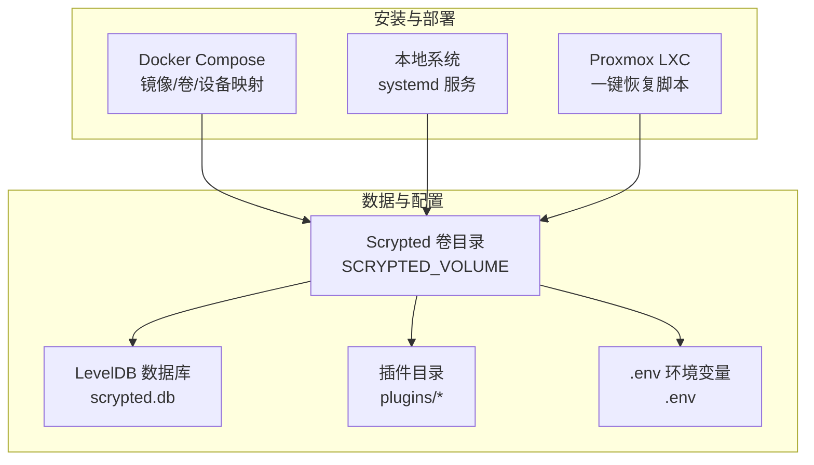
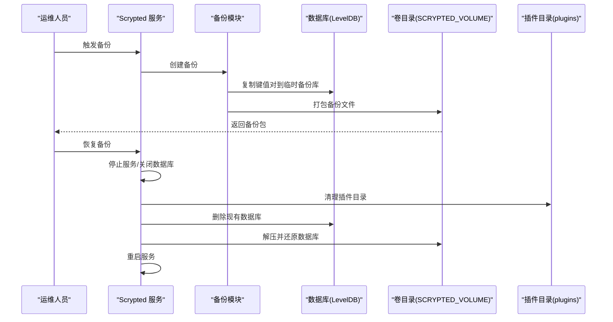
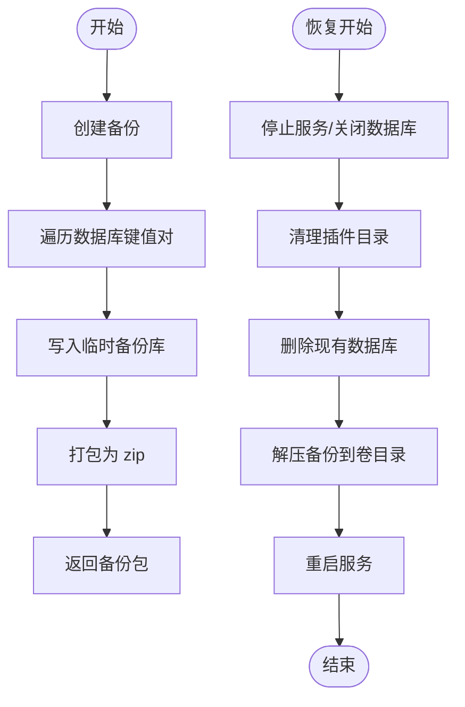
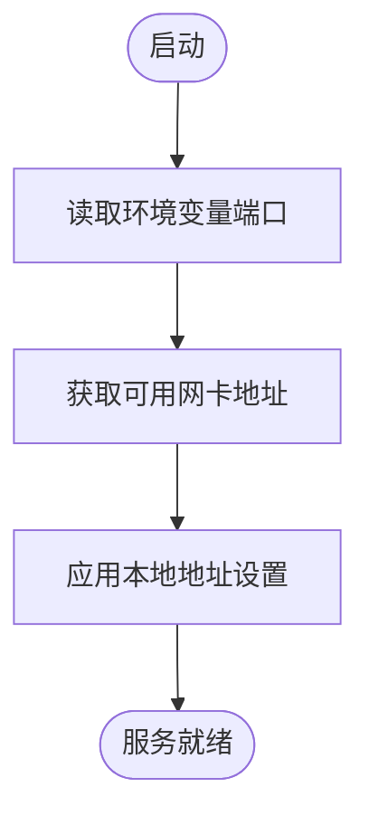
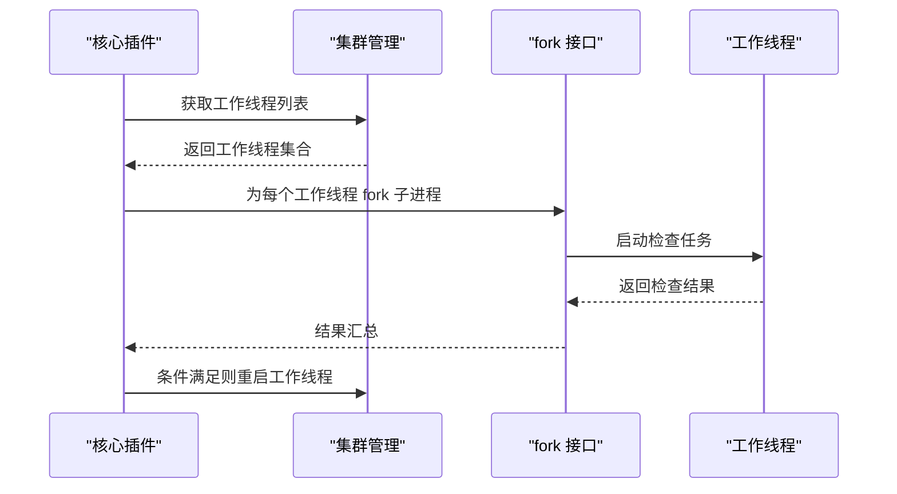
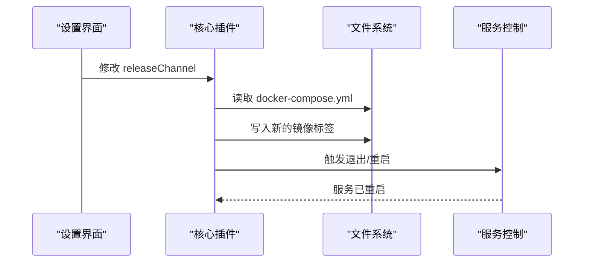
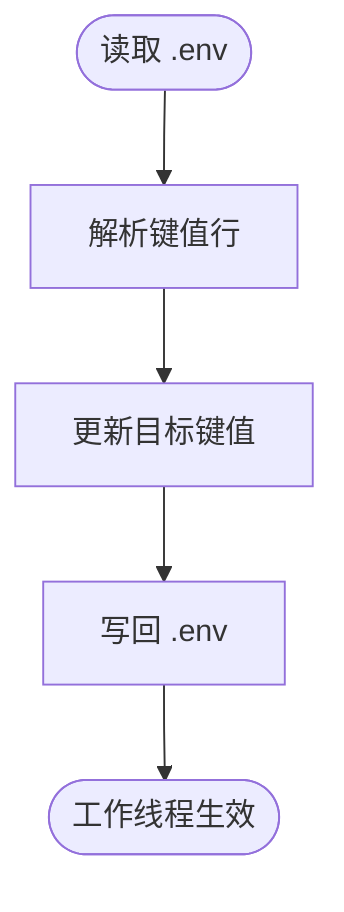
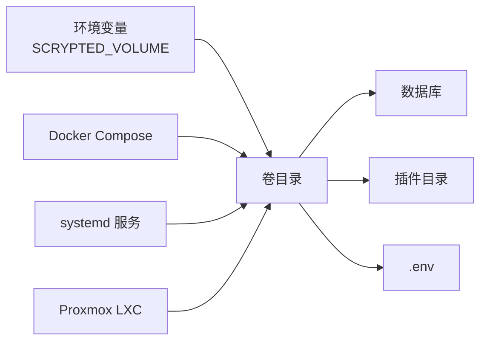

# 跨平台迁移

<cite>
**本文引用的文件**
- [README.md](file://README.md)
- [config.yaml](file://install/config.yaml)
- [docker-compose.yml](file://install/docker/docker-compose.yml)
- [install-scrypted-dependencies-linux.sh](file://install/local/install-scrypted-dependencies-linux.sh)
- [install-scrypted-proxmox.sh](file://install/proxmox/install-scrypted-proxmox.sh)
- [server-settings.ts](file://server/src/server-settings.ts)
- [state.ts](file://server/src/state.ts)
- [backup.ts](file://server/src/services/backup.ts)
- [db-types.ts](file://server/src/db-types.ts)
- [plugin-volume.ts](file://server/src/plugin/plugin-volume.ts)
- [env.ts](file://server/src/services/env.ts)
- [main.ts](file://plugins/core/src/main.ts)
- [update-plugins.ts](file://plugins/core/src/update-plugins.ts)
</cite>

## 目录
1. [简介](#简介)
2. [项目结构](#项目结构)
3. [核心组件](#核心组件)
4. [架构总览](#架构总览)
5. [详细组件分析](#详细组件分析)
6. [依赖关系分析](#依赖关系分析)
7. [性能考量](#性能考量)
8. [故障排查指南](#故障排查指南)
9. [结论](#结论)
10. [附录](#附录)

## 简介
本指南面向需要在不同平台（Docker 容器、本地系统、Proxmox LXC）之间迁移 Scrypted 的用户与运维工程师。内容覆盖版本升级与备份、平台迁移步骤、配置同步、数据完整性验证、常见问题处理、迁移后优化以及最佳实践。所有技术细节均基于仓库中的安装脚本、服务实现与配置文件进行归纳总结。

## 项目结构
Scrypted 提供多平台安装方式与统一的数据存储位置，便于跨平台迁移：
- Docker Compose 配置定义了容器镜像、卷挂载、网络模式与硬件直通设备
- 本地安装通过 systemd 服务运行，使用环境变量指定数据目录
- Proxmox LXC 提供一键恢复脚本，支持保留数据卷并重装系统层
- 数据库存储于可配置的卷目录，插件目录独立管理

图表来源
- [docker-compose.yml:20-120](file://install/docker/docker-compose.yml#L20-L120)
- [install-scrypted-dependencies-linux.sh:100-127](file://install/local/install-scrypted-dependencies-linux.sh#L100-L127)
- [plugin-volume.ts:5-14](file://server/src/plugin/plugin-volume.ts#L5-L14)
- [env.ts:5-16](file://server/src/services/env.ts#L5-L16)

章节来源
- [docker-compose.yml:1-169](file://install/docker/docker-compose.yml#L1-L169)
- [install-scrypted-dependencies-linux.sh:1-145](file://install/local/install-scrypted-dependencies-linux.sh#L1-L145)
- [plugin-volume.ts:1-33](file://server/src/plugin/plugin-volume.ts#L1-L33)
- [env.ts:1-17](file://server/src/services/env.ts#L1-L17)

## 核心组件
- 数据备份与恢复：提供数据库全量备份打包与恢复流程，包含数据库重建与插件目录清理
- 服务器端口与网络：通过环境变量控制端口，自动选择可用网卡地址
- 插件与工作线程：集群工作线程管理与镜像更新触发
- 配置同步：通过 release channel 设置与 docker-compose 文件联动，实现镜像标签切换
- 环境变量：.env 文件用于各工作线程的自定义环境注入

章节来源
- [backup.ts:1-76](file://server/src/services/backup.ts#L1-L76)
- [server-settings.ts:1-11](file://server/src/server-settings.ts#L1-L11)
- [main.ts:228-280](file://plugins/core/src/main.ts#L228-L280)
- [main.ts:377-391](file://plugins/core/src/main.ts#L377-L391)
- [env.ts:9-17](file://server/src/services/env.ts#L9-L17)

## 架构总览
下图展示迁移过程中涉及的关键组件与交互路径，包括备份、恢复、配置同步与卷管理。

图表来源
- [backup.ts:12-75](file://server/src/services/backup.ts#L12-L75)
- [plugin-volume.ts:5-14](file://server/src/plugin/plugin-volume.ts#L5-L14)
- [db-types.ts:4-44](file://server/src/db-types.ts#L4-L44)

## 详细组件分析

### 组件A：备份与恢复流程
- 备份：遍历当前 LevelDB 键值对写入临时备份库，再将备份库打包为 zip
- 恢复：停止服务、关闭数据库、删除现有数据库与插件目录，解压备份并重启服务

图表来源
- [backup.ts:12-75](file://server/src/services/backup.ts#L12-L75)

章节来源
- [backup.ts:1-76](file://server/src/services/backup.ts#L1-L76)
- [plugin-volume.ts:5-14](file://server/src/plugin/plugin-volume.ts#L5-L14)
- [db-types.ts:4-44](file://server/src/db-types.ts#L4-L44)

### 组件B：服务器端口与网络配置
- 端口：可通过环境变量覆盖默认端口（HTTP/HTTPS/调试）
- 地址：自动选择可用网卡地址，支持手动设置本地地址列表

图表来源
- [server-settings.ts:3-10](file://server/src/server-settings.ts#L3-L10)
- [main.ts:40-57](file://plugins/core/src/main.ts#L40-L57)

章节来源
- [server-settings.ts:1-11](file://server/src/server-settings.ts#L1-L11)
- [main.ts:40-57](file://plugins/core/src/main.ts#L40-L57)

### 组件C：插件与工作线程管理
- 工作线程：周期性检查与更新工作线程镜像，必要时重启以应用新镜像
- 集群：通过 fork 接口与 cluster-fork 服务协作，按需拉起检查任务

图表来源
- [main.ts:228-280](file://plugins/core/src/main.ts#L228-L280)

章节来源
- [main.ts:228-280](file://plugins/core/src/main.ts#L228-L280)

### 组件D：配置同步与镜像通道
- releaseChannel：支持 Default、latest、beta、intel、amd、nvidia 等通道
- 更新镜像：修改 docker-compose 中的 image 字段并触发重启

图表来源
- [main.ts:58-95](file://plugins/core/src/main.ts#L58-L95)
- [main.ts:377-391](file://plugins/core/src/main.ts#L377-L391)

章节来源
- [main.ts:58-95](file://plugins/core/src/main.ts#L58-L95)
- [main.ts:377-391](file://plugins/core/src/main.ts#L377-L391)

### 组件E：环境变量注入（.env）
- 每个工作线程维护独立 .env，支持键值对更新
- 通过 cluster-fork 的 EnvControl 接口读写

图表来源
- [env.ts:9-17](file://server/src/services/env.ts#L9-L17)
- [main.ts:62-143](file://plugins/core/src/main.ts#L62-L143)

章节来源
- [env.ts:1-17](file://server/src/services/env.ts#L1-L17)
- [main.ts:62-143](file://plugins/core/src/main.ts#L62-L143)

## 依赖关系分析
- 卷目录 SCRYPTED_VOLUME 是数据与配置的根，包含数据库、插件与 .env
- Docker Compose 将卷目录映射到容器内，确保迁移前后路径一致
- 本地安装通过 systemd 服务与环境变量 SCRYPTED_INSTALL_ENVIRONMENT 控制行为
- Proxmox LXC 支持将数据卷从旧实例移动到新实例，避免丢失

图表来源
- [plugin-volume.ts:5-14](file://server/src/plugin/plugin-volume.ts#L5-L14)
- [docker-compose.yml:81-84](file://install/docker/docker-compose.yml#L81-L84)
- [install-scrypted-dependencies-linux.sh:100-127](file://install/local/install-scrypted-dependencies-linux.sh#L100-L127)
- [install-scrypted-proxmox.sh:210-271](file://install/proxmox/install-scrypted-proxmox.sh#L210-L271)

章节来源
- [plugin-volume.ts:1-33](file://server/src/plugin/plugin-volume.ts#L1-L33)
- [docker-compose.yml:1-169](file://install/docker/docker-compose.yml#L1-L169)
- [install-scrypted-dependencies-linux.sh:1-145](file://install/local/install-scrypted-dependencies-linux.sh#L1-L145)
- [install-scrypted-proxmox.sh:1-311](file://install/proxmox/install-scrypted-proxmox.sh#L1-L311)

## 性能考量
- 日志驱动：容器默认禁用日志驱动，建议仅在调试时启用文件日志以减少闪存磨损
- DNS：建议使用全局 DNS 服务器以避免 npm 等注册表访问问题
- 设备直通：仅映射必要硬件设备，避免过度直通导致性能下降或权限问题

章节来源
- [docker-compose.yml:123-131](file://install/docker/docker-compose.yml#L123-L131)
- [docker-compose.yml:135-139](file://install/docker/docker-compose.yml#L135-L139)

## 故障排查指南
- 依赖项冲突
  - Docker：确认宿主机已安装所需依赖，必要时使用提供的安装脚本
  - 本地：确保 Node 版本与系统依赖满足要求
  - Proxmox：根据脚本提示选择合适的存储类型（local-lvm/local-zfs），修正网络与主机名设置
- 配置错误
  - releaseChannel 无效可能导致服务无法启动，应使用受支持的通道或具体版本标签
  - docker-compose 中 image 字段必须与实际镜像匹配
- 权限问题
  - Docker：确保卷目录与设备映射权限正确
  - 本地：systemd 服务用户需对卷目录有读写权限
  - Proxmox：udev 规则与 CPU 微代码可能与其他规则冲突，谨慎添加

章节来源
- [install-scrypted-dependencies-linux.sh:1-145](file://install/local/install-scrypted-dependencies-linux.sh#L1-L145)
- [install-scrypted-proxmox.sh:1-311](file://install/proxmox/install-scrypted-proxmox.sh#L1-L311)
- [main.ts:58-95](file://plugins/core/src/main.ts#L58-L95)
- [docker-compose.yml:141-169](file://install/docker/docker-compose.yml#L141-L169)

## 结论
通过统一的卷目录与标准化的备份/恢复流程，Scrypted 可在 Docker、本地与 Proxmox 平台间实现平滑迁移。配合 releaseChannel 与 .env 的配置同步机制，可在不丢失业务状态的前提下完成版本升级与平台切换。建议在迁移前做好备份，并在迁移后进行功能与性能验证。

## 附录

### 迁移前准备清单
- 备份当前系统与数据
- 记录当前 releaseChannel 与 .env 设置
- 准备目标平台的安装介质与依赖
- 确认网络与设备直通需求

章节来源
- [backup.ts:12-46](file://server/src/services/backup.ts#L12-L46)
- [main.ts:58-95](file://plugins/core/src/main.ts#L58-L95)
- [env.ts:9-17](file://server/src/services/env.ts#L9-L17)

### 版本升级与备份
- 使用内置备份功能生成压缩包，包含数据库与配置
- 恢复时先清理插件目录，再还原数据库并重启服务

章节来源
- [backup.ts:12-75](file://server/src/services/backup.ts#L12-L75)

### 平台迁移步骤

#### Docker 环境迁移
- 在源平台执行备份
- 在目标平台部署相同镜像与卷映射
- 将备份包上传至目标平台卷目录并执行恢复
- 校验网络与设备直通配置

章节来源
- [docker-compose.yml:20-120](file://install/docker/docker-compose.yml#L20-L120)
- [backup.ts:48-75](file://server/src/services/backup.ts#L48-L75)

#### 本地安装迁移
- 在源平台执行备份
- 在目标平台以 root 用户运行安装脚本，设置 SERVICE_USER 与 SCRYPTED_INSTALL_ENVIRONMENT
- systemd 服务启动后，执行恢复流程
- 校验 HTTPS 证书与端口访问

章节来源
- [install-scrypted-dependencies-linux.sh:1-145](file://install/local/install-scrypted-dependencies-linux.sh#L1-L145)
- [backup.ts:48-75](file://server/src/services/backup.ts#L48-L75)

#### 云平台（Home Assistant Add-on）迁移
- 使用 Home Assistant Add-on 的配置模板，确保卷与环境变量一致
- 备份与恢复流程同 Docker

章节来源
- [config.yaml:1-49](file://install/config.yaml#L1-L49)
- [backup.ts:48-75](file://server/src/services/backup.ts#L48-L75)

#### Proxmox LXC 迁移
- 使用恢复脚本，支持保留数据卷并重装系统层
- 注意存储类型选择与挂载点路径（需位于 /mnt 下）

章节来源
- [install-scrypted-proxmox.sh:1-311](file://install/proxmox/install-scrypted-proxmox.sh#L1-L311)

### 配置同步方法
- releaseChannel：在设置中选择目标通道，自动更新 docker-compose 中的镜像标签
- .env：针对工作线程单独注入环境变量，按需更新键值
- 网络地址：在设置中选择本地地址列表，避免无线地址干扰

章节来源
- [main.ts:58-95](file://plugins/core/src/main.ts#L58-L95)
- [main.ts:40-57](file://plugins/core/src/main.ts#L40-L57)
- [env.ts:9-17](file://server/src/services/env.ts#L9-L17)

### 数据完整性验证
- 迁移后检查数据库是否完整加载
- 验证设备状态与自动化规则
- 对比迁移前后性能指标（CPU/内存/磁盘 IO）

章节来源
- [state.ts:102-119](file://server/src/state.ts#L102-L119)
- [db-types.ts:33-43](file://server/src/db-types.ts#L33-L43)

### 迁移后的系统优化
- 日志与 DNS：按需启用日志驱动；使用全局 DNS
- 设备直通：仅映射必要设备
- 安全：校验证书与访问控制；定期更新 releaseChannel

章节来源
- [docker-compose.yml:123-139](file://install/docker/docker-compose.yml#L123-L139)
- [main.ts:58-95](file://plugins/core/src/main.ts#L58-L95)

### 最佳实践
- 迁移前：创建备份并记录当前配置
- 策略选择：优先使用 Docker 或本地安装；LXC 适合虚拟化场景
- 回滚计划：保留旧镜像与卷快照，确保可逆操作

章节来源
- [README.md:1-59](file://README.md#L1-L59)
- [backup.ts:12-46](file://server/src/services/backup.ts#L12-L46)