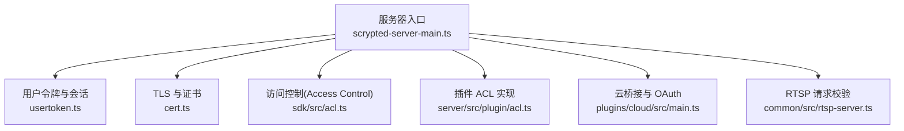
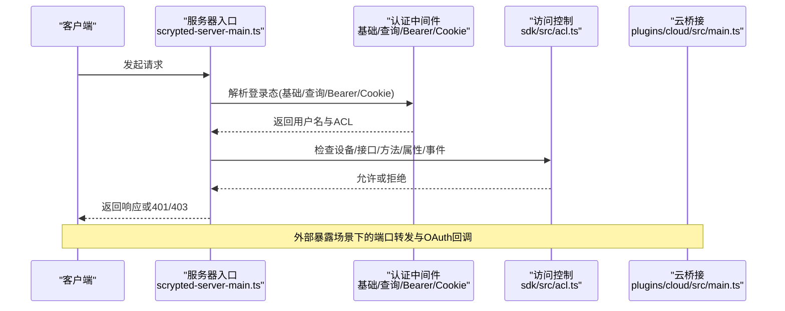
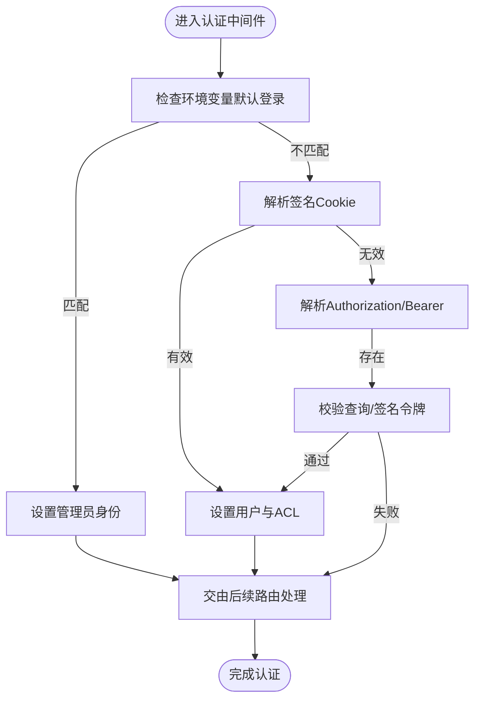
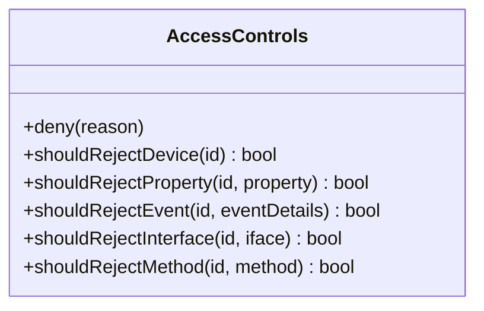
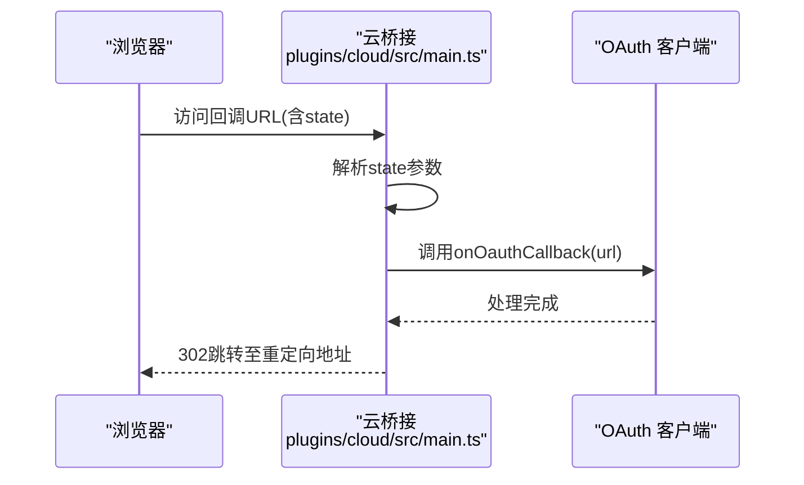
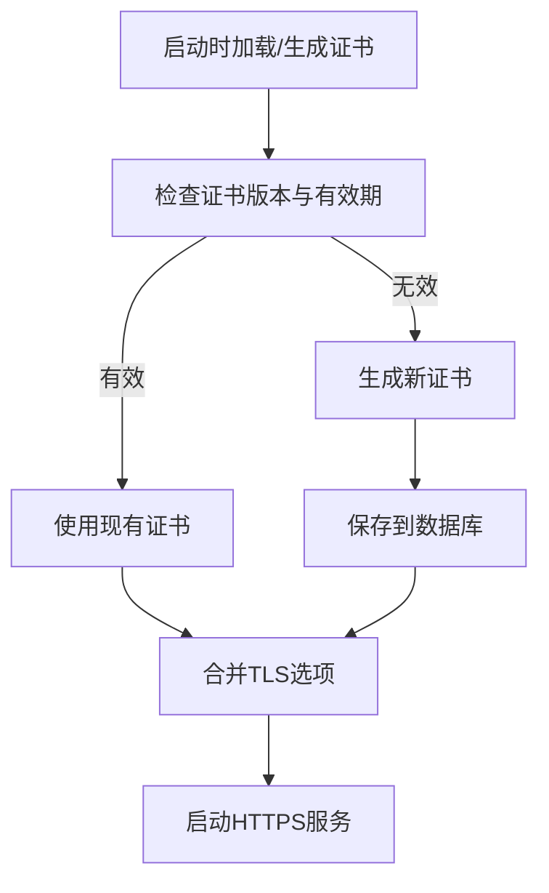
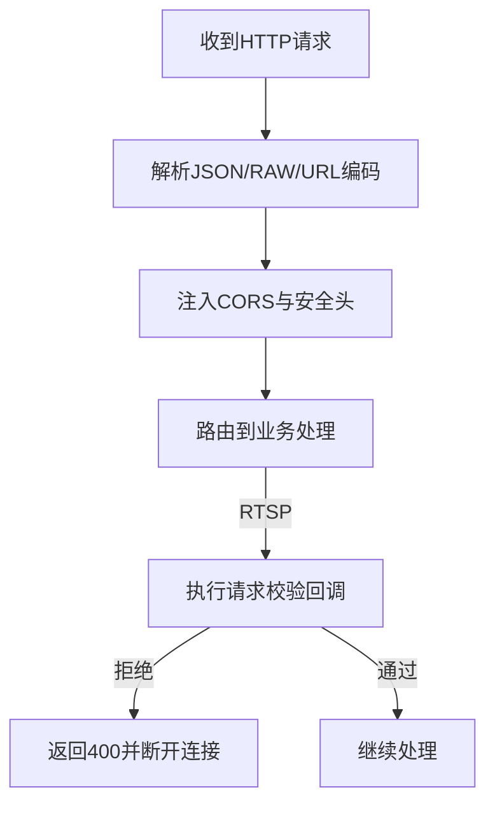
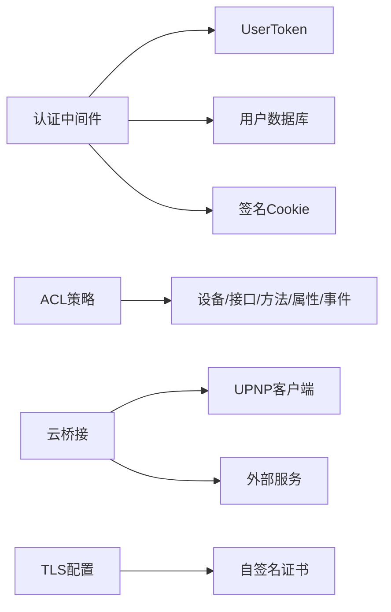

# API 安全配置

<cite>
**本文引用的文件**
- [server/src/scrypted-server-main.ts](file://server/src/scrypted-server-main.ts)
- [server/src/usertoken.ts](file://server/src/usertoken.ts)
- [server/src/cert.ts](file://server/src/cert.ts)
- [plugins/cloud/src/main.ts](file://plugins/cloud/src/main.ts)
- [sdk/src/acl.ts](file://sdk/src/acl.ts)
- [server/src/plugin/acl.ts](file://server/src/plugin/acl.ts)
- [common/src/rtsp-server.ts](file://common/src/rtsp-server.ts)
- [server/test/test-cert.json](file://server/test/test-cert.json)
</cite>

## 目录
1. [简介](#简介)
2. [项目结构](#项目结构)
3. [核心组件](#核心组件)
4. [架构总览](#架构总览)
5. [详细组件分析](#详细组件分析)
6. [依赖关系分析](#依赖关系分析)
7. [性能考量](#性能考量)
8. [故障排查指南](#故障排查指南)
9. [结论](#结论)
10. [附录](#附录)

## 简介
本指南面向 Scrypted 的 API 安全配置，围绕认证与授权、令牌与会话、速率限制、传输加密、安全中间件、监控与审计以及安全测试等方面进行系统化梳理。文档基于仓库中的实际实现进行分析，并提供可操作的配置建议与最佳实践，帮助在生产环境中构建更安全的 API 层。

## 项目结构
Scrypted 的 API 安全相关能力主要分布在以下模块：
- 服务器入口与安全中间件：server/src/scrypted-server-main.ts
- 用户令牌与会话：server/src/usertoken.ts
- 自签名证书与 TLS：server/src/cert.ts
- 云桥接与 OAuth 回调：plugins/cloud/src/main.ts
- 访问控制（ACL）：sdk/src/acl.ts 与 server/src/plugin/acl.ts
- 请求校验与协议安全：common/src/rtsp-server.ts
- 测试证书示例：server/test/test-cert.json

图表来源
- [server/src/scrypted-server-main.ts:112-780](file://server/src/scrypted-server-main.ts#L112-L780)
- [server/src/usertoken.ts:1-49](file://server/src/usertoken.ts#L1-L49)
- [server/src/cert.ts:1-102](file://server/src/cert.ts#L1-L102)
- [sdk/src/acl.ts:1-153](file://sdk/src/acl.ts#L1-L153)
- [server/src/plugin/acl.ts:1-104](file://server/src/plugin/acl.ts#L1-L104)
- [plugins/cloud/src/main.ts:1-800](file://plugins/cloud/src/main.ts#L1-L800)
- [common/src/rtsp-server.ts:1148-1177](file://common/src/rtsp-server.ts#L1148-L1177)

章节来源
- [server/src/scrypted-server-main.ts:112-780](file://server/src/scrypted-server-main.ts#L112-L780)

## 核心组件
- 认证与会话
  - 基础认证与 Cookie 登录：通过 http-auth 基础认证与签名 Cookie 实现登录态持久化。
  - 查询令牌与 Bearer 令牌：支持基于查询参数或 Authorization 头的令牌传递。
  - 环境变量与默认登录：支持通过环境变量快速启用管理员直连或匿名默认登录。
- 令牌模型
  - UserToken：包含用户名、ACL ID、签发时间与有效期，支持过期与未来时间校验。
- 传输加密
  - 自签名证书生成与版本管理，支持 TLS 服务端选项合并。
- 授权与访问控制
  - 设备级、接口级、方法级、属性级与事件级的细粒度访问控制。
- 云桥接与 OAuth
  - 提供 OAuth 回调处理、自定义域名与隧道配置、端口转发与健康检查。
- 协议安全
  - RTSP 请求头解析与可插拔的请求校验回调，拒绝非法方法与头部。

章节来源
- [server/src/scrypted-server-main.ts:175-347](file://server/src/scrypted-server-main.ts#L175-L347)
- [server/src/usertoken.ts:8-38](file://server/src/usertoken.ts#L8-L38)
- [server/src/cert.ts:17-101](file://server/src/cert.ts#L17-L101)
- [sdk/src/acl.ts:25-121](file://sdk/src/acl.ts#L25-L121)
- [server/src/plugin/acl.ts:8-104](file://server/src/plugin/acl.ts#L8-L104)
- [plugins/cloud/src/main.ts:787-800](file://plugins/cloud/src/main.ts#L787-L800)
- [common/src/rtsp-server.ts:1148-1177](file://common/src/rtsp-server.ts#L1148-L1177)

## 架构总览
下图展示了 Scrypted API 安全的关键交互路径：客户端发起请求，服务器通过认证中间件解析登录态，随后根据访问控制策略决定是否放行；对于需要外部暴露的场景，云桥接模块负责端口转发与 OAuth 回调处理。

图表来源
- [server/src/scrypted-server-main.ts:257-347](file://server/src/scrypted-server-main.ts#L257-L347)
- [sdk/src/acl.ts:25-121](file://sdk/src/acl.ts#L25-L121)
- [plugins/cloud/src/main.ts:1274-1310](file://plugins/cloud/src/main.ts#L1274-L1310)

## 详细组件分析

### 认证机制实现
- 基础认证
  - 使用 http-auth 基础认证，密码哈希采用用户名盐值加明文密码后 SHA-256，同时允许使用一次性 token 进行认证。
  - 为避免浏览器弹窗，重写 401 响应行为，直接返回 401。
- Cookie 登录
  - 使用签名 Cookie 存储登录用户令牌，区分安全与非安全场景的 Cookie 名称。
- 查询令牌与 Bearer 令牌
  - 支持 Authorization: Bearer 或查询参数 scryptedToken，令牌由服务端生成并校验。
- 环境变量与默认登录
  - 支持通过环境变量指定管理员直连地址与凭据，或匿名默认登录。
- 令牌模型与校验
  - UserToken 包含用户名、ACL ID、签发时间与有效期，服务端对过期、未来时间与超长有效期进行严格校验。

图表来源
- [server/src/scrypted-server-main.ts:257-347](file://server/src/scrypted-server-main.ts#L257-L347)
- [server/src/usertoken.ts:8-38](file://server/src/usertoken.ts#L8-L38)

章节来源
- [server/src/scrypted-server-main.ts:175-347](file://server/src/scrypted-server-main.ts#L175-L347)
- [server/src/usertoken.ts:8-38](file://server/src/usertoken.ts#L8-L38)

### 授权策略配置
- 设备级与接口级控制
  - 可拒绝特定设备访问，或仅允许某些接口被访问。
- 方法与属性级控制
  - 对具体方法与属性读取进行细粒度控制，防止越权调用。
- 事件级控制
  - 控制事件订阅与推送，避免敏感事件泄露。
- 插件 ACL 实现
  - 服务端插件侧同样提供 ACL 类，用于统一的授权判断。

图表来源
- [sdk/src/acl.ts:25-121](file://sdk/src/acl.ts#L25-L121)
- [server/src/plugin/acl.ts:8-104](file://server/src/plugin/acl.ts#L8-L104)

章节来源
- [sdk/src/acl.ts:25-121](file://sdk/src/acl.ts#L25-L121)
- [server/src/plugin/acl.ts:8-104](file://server/src/plugin/acl.ts#L8-L104)

### OAuth 集成与回调
- OAuth 回调处理
  - 从回调 URL 的查询参数或 hash 中提取状态信息，调用对应 OauthClient 的回调处理函数。
- 云桥接配置
  - 支持自定义域名、Cloudflare 隧道、UPNP 端口映射等，自动注册与健康检查。
- 端口转发与外部地址
  - 根据配置动态更新外部地址列表，确保前端能正确访问。

图表来源
- [plugins/cloud/src/main.ts:1274-1310](file://plugins/cloud/src/main.ts#L1274-L1310)

章节来源
- [plugins/cloud/src/main.ts:787-800](file://plugins/cloud/src/main.ts#L787-L800)
- [plugins/cloud/src/main.ts:1274-1310](file://plugins/cloud/src/main.ts#L1274-L1310)

### API 加密传输（HTTPS/TLS）
- 自签名证书
  - 自动生成 2048 位 RSA 私钥与自签名证书，有效期 5 年，支持版本升级。
- TLS 选项合并
  - 通过环境变量文件合并 TLS 选项，确保服务端 HTTPS 配置灵活可控。
- 测试证书
  - 提供测试证书示例，便于本地开发与调试。

图表来源
- [server/src/cert.ts:17-101](file://server/src/cert.ts#L17-L101)
- [server/src/scrypted-server-main.ts:202-212](file://server/src/scrypted-server-main.ts#L202-L212)

章节来源
- [server/src/cert.ts:17-101](file://server/src/cert.ts#L17-L101)
- [server/src/scrypted-server-main.ts:202-212](file://server/src/scrypted-server-main.ts#L202-L212)
- [server/test/test-cert.json:3-4](file://server/test/test-cert.json#L3-L4)

### API 安全中间件与请求校验
- 请求体解析与大小限制
  - 统一解析 application/json、raw 等类型，限制最大 100MB，避免内存滥用。
- 访问控制头注入
  - 在非 WebSocket 升级请求中注入跨域与安全相关响应头。
- RTSP 请求校验
  - 提供可插拔的请求校验回调，拒绝非法方法或头部，保障协议安全。

图表来源
- [server/src/scrypted-server-main.ts:116-124](file://server/src/scrypted-server-main.ts#L116-L124)
- [server/src/scrypted-server-main.ts:214-219](file://server/src/scrypted-server-main.ts#L214-L219)
- [common/src/rtsp-server.ts:1148-1177](file://common/src/rtsp-server.ts#L1148-L1177)

章节来源
- [server/src/scrypted-server-main.ts:116-124](file://server/src/scrypted-server-main.ts#L116-L124)
- [server/src/scrypted-server-main.ts:214-219](file://server/src/scrypted-server-main.ts#L214-L219)
- [common/src/rtsp-server.ts:1148-1177](file://common/src/rtsp-server.ts#L1148-L1177)

### API 监控与审计
- 日志与告警
  - 云桥接模块在端口转发、UPNP 映射、健康检查等关键流程输出日志与告警。
- 异常检测
  - 通过定时任务与轮询机制检测端口连通性与外部可达性，异常时触发告警。
- 审计要点
  - 建议在生产环境开启请求日志、错误统计与异常告警，结合外部 SIEM 工具进行集中审计。

章节来源
- [plugins/cloud/src/main.ts:444-473](file://plugins/cloud/src/main.ts#L444-L473)
- [plugins/cloud/src/main.ts:475-535](file://plugins/cloud/src/main.ts#L475-L535)

### API 安全测试与渗透测试指南
- 认证绕过测试
  - 尝试绕过基础认证、伪造 Cookie、篡改查询令牌与 Authorization 头。
- 授权越权测试
  - 使用不同用户身份访问受限设备/接口/方法，验证 ACL 生效。
- 传输安全测试
  - 检查 TLS 版本与加密套件配置，验证证书链与主机名匹配。
- 速率限制与防护
  - 模拟高频请求与并发连接，观察服务端响应与异常行为。
- 协议安全测试
  - 对 RTSP 等协议进行请求合法性校验，确保非法方法与头部被拒绝。

章节来源
- [server/src/scrypted-server-main.ts:175-347](file://server/src/scrypted-server-main.ts#L175-L347)
- [sdk/src/acl.ts:25-121](file://sdk/src/acl.ts#L25-L121)
- [server/src/cert.ts:17-101](file://server/src/cert.ts#L17-L101)
- [common/src/rtsp-server.ts:1148-1177](file://common/src/rtsp-server.ts#L1148-L1177)

## 依赖关系分析
- 认证与授权
  - 认证中间件依赖用户数据库与令牌模型；授权策略依赖设备与接口元数据。
- 云桥接
  - 依赖端口转发、UPNP 客户端与外部服务通信，同时维护 CORS 与外部地址列表。
- 传输安全
  - 依赖证书生成与 TLS 选项合并，确保 HTTPS 服务稳定运行。

图表来源
- [server/src/scrypted-server-main.ts:175-347](file://server/src/scrypted-server-main.ts#L175-L347)
- [sdk/src/acl.ts:25-121](file://sdk/src/acl.ts#L25-L121)
- [plugins/cloud/src/main.ts:475-535](file://plugins/cloud/src/main.ts#L475-L535)
- [server/src/cert.ts:17-101](file://server/src/cert.ts#L17-L101)

章节来源
- [server/src/scrypted-server-main.ts:175-347](file://server/src/scrypted-server-main.ts#L175-L347)
- [sdk/src/acl.ts:25-121](file://sdk/src/acl.ts#L25-L121)
- [plugins/cloud/src/main.ts:475-535](file://plugins/cloud/src/main.ts#L475-L535)
- [server/src/cert.ts:17-101](file://server/src/cert.ts#L17-L101)

## 性能考量
- 请求体解析
  - 合理设置 JSON/RAW 解析器的大小限制，避免大体积请求导致内存压力。
- 令牌校验
  - UserToken 校验包含 JSON 解析与时间戳比较，建议在高并发场景下缓存校验结果。
- 证书生成
  - 证书生成与合并为启动阶段操作，运行时尽量避免重复生成。
- ACL 缓存
  - SDK 提供缓存与去抖机制，减少频繁查询 ACL 的开销。

章节来源
- [server/src/scrypted-server-main.ts:116-124](file://server/src/scrypted-server-main.ts#L116-L124)
- [server/src/usertoken.ts:8-38](file://server/src/usertoken.ts#L8-L38)
- [sdk/src/acl.ts:124-124](file://sdk/src/acl.ts#L124-L124)

## 故障排查指南
- 认证失败
  - 检查基础认证用户名与密码哈希是否匹配，确认是否使用一次性 token。
  - 核对 Cookie 是否已签名且未过期。
- 授权拒绝
  - 确认用户 ACL 是否包含目标设备/接口/方法/属性/事件。
- 传输安全问题
  - 检查证书版本与有效期，确认 TLS 选项合并是否正确。
- 云桥接异常
  - 查看 UPNP 映射状态与端口转发日志，确认外部域名与隧道配置。
- RTSP 请求被拒
  - 检查请求方法与头部是否合法，确认校验回调逻辑。

章节来源
- [server/src/scrypted-server-main.ts:175-347](file://server/src/scrypted-server-main.ts#L175-L347)
- [sdk/src/acl.ts:25-121](file://sdk/src/acl.ts#L25-L121)
- [server/src/cert.ts:17-101](file://server/src/cert.ts#L17-L101)
- [plugins/cloud/src/main.ts:475-535](file://plugins/cloud/src/main.ts#L475-L535)
- [common/src/rtsp-server.ts:1148-1177](file://common/src/rtsp-server.ts#L1148-L1177)

## 结论
Scrypted 的 API 安全体系以“认证中间件 + 令牌模型 + 访问控制 + 传输加密 + 协议校验”为核心，辅以外部桥接与可观测性能力，形成完整的安全闭环。建议在生产部署中结合本文提供的配置与测试指南，持续完善安全策略并定期进行渗透测试与审计。

## 附录
- 关键实现位置参考
  - 认证与会话：[server/src/scrypted-server-main.ts:175-347](file://server/src/scrypted-server-main.ts#L175-L347)
  - 令牌模型：[server/src/usertoken.ts:8-38](file://server/src/usertoken.ts#L8-L38)
  - 传输加密：[server/src/cert.ts:17-101](file://server/src/cert.ts#L17-L101)
  - 授权策略：[sdk/src/acl.ts:25-121](file://sdk/src/acl.ts#L25-L121)
  - 云桥接与 OAuth：[plugins/cloud/src/main.ts:787-800](file://plugins/cloud/src/main.ts#L787-L800)
  - 协议安全（RTSP）：[common/src/rtsp-server.ts:1148-1177](file://common/src/rtsp-server.ts#L1148-L1177)