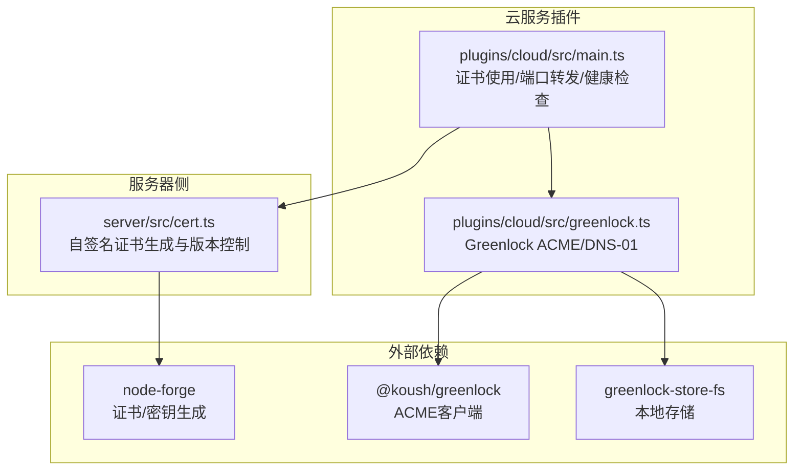
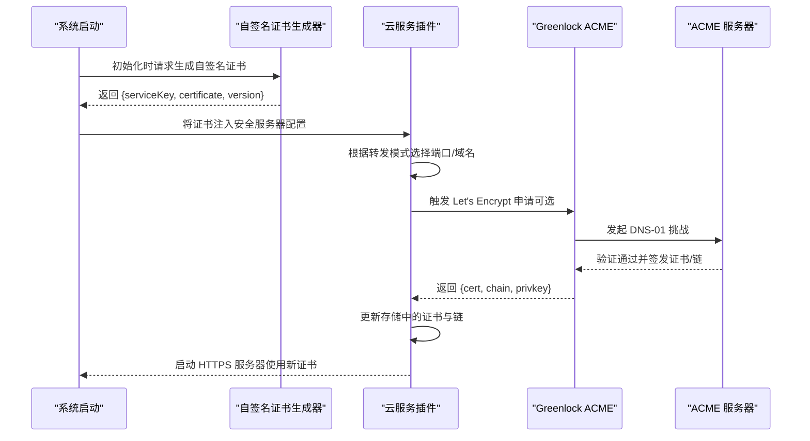
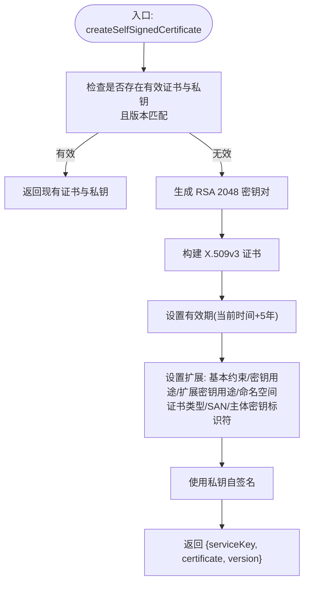
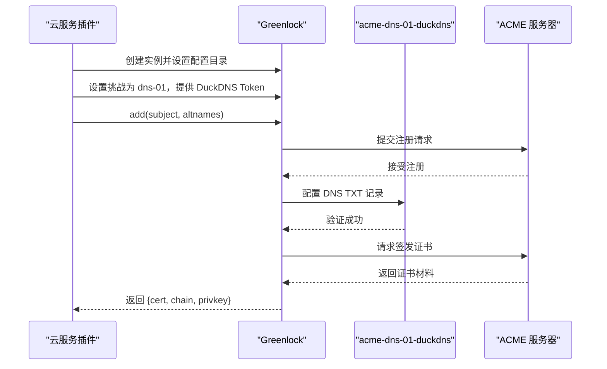
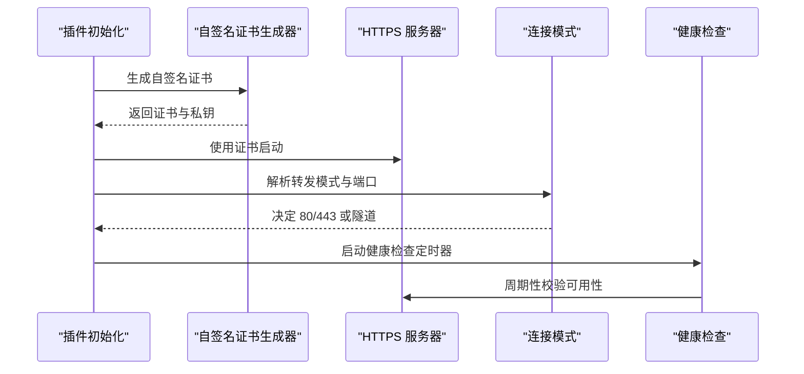
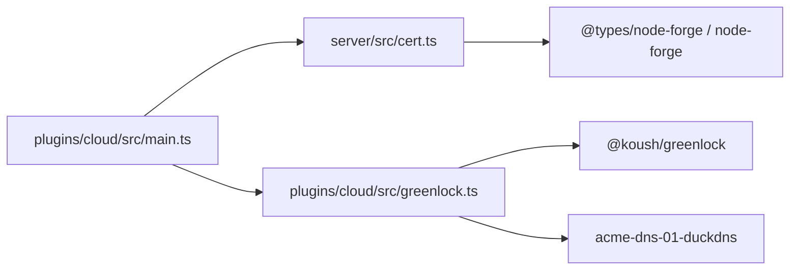

# SSL/TLS 证书管理

<cite>
**本文引用的文件**
- [server/src/cert.ts](file://server/src/cert.ts)
- [plugins/cloud/src/greenlock.ts](file://plugins/cloud/src/greenlock.ts)
- [plugins/cloud/src/main.ts](file://plugins/cloud/src/main.ts)
- [packages/self-signed-certificate/package.json](file://packages/self-signed-certificate/package.json)
- [server/test/test-cert.json](file://server/test/test-cert.json)
</cite>

## 目录
1. [简介](#简介)
2. [项目结构](#项目结构)
3. [核心组件](#核心组件)
4. [架构总览](#架构总览)
5. [详细组件分析](#详细组件分析)
6. [依赖关系分析](#依赖关系分析)
7. [性能考虑](#性能考虑)
8. [故障排除指南](#故障排除指南)
9. [结论](#结论)
10. [附录](#附录)

## 简介
本文件面向 Scrypted 的 SSL/TLS 证书管理，系统性阐述以下内容：
- 自签名证书的生成与版本控制：RSA 密钥对生成、证书有效期与版本策略、证书链与扩展字段。
- Let's Encrypt 证书申请流程：ACME 协议实现思路、域名验证（DNS-01）、证书自动续期机制。
- 证书配置选项：证书格式选择、私钥保护、证书链管理。
- 证书更新策略：过期检测、自动刷新、回退机制。
- 证书监控与故障排除：有效性检查、错误诊断、性能优化。
- 实际配置示例与最佳实践。

## 项目结构
Scrypted 的证书相关能力主要分布在以下模块：
- 自签名证书生成与版本控制：server/src/cert.ts
- Let's Encrypt 证书申请（基于 Greenlock）：plugins/cloud/src/greenlock.ts
- 云服务插件中的证书使用与端口转发：plugins/cloud/src/main.ts
- 自签名证书包元信息：packages/self-signed-certificate/package.json
- 测试用证书样本：server/test/test-cert.json

**图表来源**
- [server/src/cert.ts:1-101](file://server/src/cert.ts#L1-L101)
- [plugins/cloud/src/greenlock.ts:1-58](file://plugins/cloud/src/greenlock.ts#L1-L58)
- [plugins/cloud/src/main.ts:316-318](file://plugins/cloud/src/main.ts#L316-L318)

**章节来源**
- [server/src/cert.ts:1-101](file://server/src/cert.ts#L1-L101)
- [plugins/cloud/src/greenlock.ts:1-58](file://plugins/cloud/src/greenlock.ts#L1-L58)
- [plugins/cloud/src/main.ts:316-318](file://plugins/cloud/src/main.ts#L316-L318)

## 核心组件
- 自签名证书生成器：负责生成 RSA 2048 位密钥对并签发 X.509v3 证书，设置有效期、序列号、主题/颁发者、关键扩展（基本约束、密钥用途、扩展密钥用途、命名空间证书类型、SAN、主体密钥标识符），并以 PEM 格式返回证书与私钥；支持版本化与有效期阈值复用。
- Let's Encrypt 申请器：通过 Greenlock 客户端与 ACME 服务器交互，使用 DNS-01 挑战完成域名验证，获取证书与链，并持久化到插件卷目录。
- 云服务插件：在启动时初始化自签名证书，或在配置变更时触发证书更新；根据连接模式（UPNP/路由器转发/自定义域名/Cloudflare 隧道）决定对外暴露方式与端口；维护健康检查与重试逻辑。

**章节来源**
- [server/src/cert.ts:17-101](file://server/src/cert.ts#L17-L101)
- [plugins/cloud/src/greenlock.ts:10-58](file://plugins/cloud/src/greenlock.ts#L10-L58)
- [plugins/cloud/src/main.ts:316-318](file://plugins/cloud/src/main.ts#L316-L318)

## 架构总览
下图展示证书从生成到使用的整体流程，以及与云服务插件的集成点。

**图表来源**
- [server/src/cert.ts:17-101](file://server/src/cert.ts#L17-L101)
- [plugins/cloud/src/greenlock.ts:10-58](file://plugins/cloud/src/greenlock.ts#L10-L58)
- [plugins/cloud/src/main.ts:316-318](file://plugins/cloud/src/main.ts#L316-L318)

## 详细组件分析

### 自签名证书生成器
- 版本控制：通过版本常量区分证书生成策略，避免重复生成。
- 密钥与证书：优先复用现有私钥与证书，若未过期（超过阈值）则直接返回；否则重新生成密钥对并签发证书。
- 有效期：当前实现设置 5 年有效期，结合“60 天阈值”策略用于判断是否需要刷新。
- 扩展字段：设置基本约束（CA=true）、密钥用途（含服务器/客户端认证等）、扩展密钥用途（含服务器认证等）、命名空间证书类型（多用途）、SAN（IP 回环地址）、主体密钥标识符。
- 输出：PEM 格式的私钥与证书，配合版本号返回。

**图表来源**
- [server/src/cert.ts:17-101](file://server/src/cert.ts#L17-L101)

**章节来源**
- [server/src/cert.ts:8-101](file://server/src/cert.ts#L8-L101)

### Let's Encrypt 证书申请器（Greenlock）
- 配置：指定配置目录（插件卷下的 greenlock.d），注册通知回调处理错误事件。
- 挑战：使用 DNS-01 挑战，模块为 acme-dns-01-duckdns，传入 DuckDNS Token。
- 注册与获取：先添加域名记录，再按服务器名获取证书材料（cert/chain/privkey）。
- 存储：证书材料持久化至配置目录，便于后续加载与续期。

**图表来源**
- [plugins/cloud/src/greenlock.ts:10-58](file://plugins/cloud/src/greenlock.ts#L10-L58)

**章节来源**
- [plugins/cloud/src/greenlock.ts:1-58](file://plugins/cloud/src/greenlock.ts#L1-L58)

### 云服务插件中的证书使用与更新
- 初始化：首次运行时生成自签名证书并写入存储；HTTPS 服务器使用该证书启动。
- 连接模式：根据转发模式（默认/UPNP/路由器转发/自定义域名/禁用）决定端口与域名；自定义域名或 Cloudflare 隧道时走 443。
- DuckDNS 与 Let's Encrypt：预留了调用注册函数的路径，当前注释掉以避免未实现行为；错误会输出日志并抛出异常。
- 健康检查：对 Cloudflare 隧道进行周期性健康检查，失败达到阈值后重启隧道进程。

**图表来源**
- [plugins/cloud/src/main.ts:316-318](file://plugins/cloud/src/main.ts#L316-L318)
- [plugins/cloud/src/main.ts:960-979](file://plugins/cloud/src/main.ts#L960-L979)
- [plugins/cloud/src/main.ts:1154-1205](file://plugins/cloud/src/main.ts#L1154-L1205)

**章节来源**
- [plugins/cloud/src/main.ts:316-318](file://plugins/cloud/src/main.ts#L316-L318)
- [plugins/cloud/src/main.ts:379-409](file://plugins/cloud/src/main.ts#L379-L409)
- [plugins/cloud/src/main.ts:960-979](file://plugins/cloud/src/main.ts#L960-L979)
- [plugins/cloud/src/main.ts:1154-1205](file://plugins/cloud/src/main.ts#L1154-L1205)

## 依赖关系分析
- 自签名证书生成依赖 node-forge，用于密钥对生成、证书构建与签名。
- Let's Encrypt 申请依赖 @koush/greenlock 与 acme-dns-01-duckdns，配合 DNS 提供商完成域名验证。
- 插件通过存储设置保存证书材料，并在 HTTPS 服务器中加载使用。

**图表来源**
- [server/src/cert.ts:2-3](file://server/src/cert.ts#L2-L3)
- [plugins/cloud/src/greenlock.ts:18-39](file://plugins/cloud/src/greenlock.ts#L18-L39)
- [plugins/cloud/src/main.ts:21-22](file://plugins/cloud/src/main.ts#L21-L22)

**章节来源**
- [server/src/cert.ts:2-3](file://server/src/cert.ts#L2-L3)
- [plugins/cloud/src/greenlock.ts:18-39](file://plugins/cloud/src/greenlock.ts#L18-L39)
- [plugins/cloud/src/main.ts:21-22](file://plugins/cloud/src/main.ts#L21-L22)

## 性能考虑
- 自签名证书生成：仅在必要时生成密钥对，利用版本与有效期阈值减少重复开销。
- HTTPS 服务器启动：采用循环重试策略，确保端口可用后再监听，降低启动失败概率。
- 健康检查：固定周期轮询隧道健康状态，失败累计后重启进程，避免长时间不可用。
- DNS-01 挑战：依赖外部 DNS 提供商，网络抖动可能影响验证时延，应合理设置超时与重试。

[本节为通用指导，不直接分析具体文件]

## 故障排除指南
- 时间同步问题：证书有效期严格依赖系统时间，建议使用 NTP 保持高精度时间。
- 私钥泄露风险：仅在受信任的环境中存放私钥，避免权限过大；定期轮换证书。
- DNS-01 验证失败：确认 DuckDNS Token 正确、TXT 记录解析可达；检查防火墙与 DNS 缓存。
- 证书过期：自签名证书默认 5 年有效期，建议在到期前（如 60 天内）自动刷新；如使用 Let's Encrypt，确保 ACME 服务器可达且 DNS 记录正确。
- HTTPS 启动失败：检查端口占用与权限；若端口为 443，需确保反向代理已终止 TLS。
- 日志与告警：关注插件控制台输出的错误事件与健康检查失败提示，及时定位问题。

**章节来源**
- [plugins/cloud/src/greenlock.ts:24-29](file://plugins/cloud/src/greenlock.ts#L24-L29)
- [plugins/cloud/src/main.ts:1154-1205](file://plugins/cloud/src/main.ts#L1154-L1205)

## 结论
Scrypted 在本地提供了完善的自签名证书生成与版本控制能力，并通过云服务插件集成了 Let's Encrypt 的 ACME 申请流程（DNS-01）。结合连接模式与健康检查机制，系统能够稳定地提供安全的 HTTPS 服务。建议在生产环境优先使用 Let's Encrypt 证书，并配合严格的私钥保护与监控告警体系。

[本节为总结性内容，不直接分析具体文件]

## 附录

### 证书配置选项与最佳实践
- 证书格式选择
  - 自签名：适用于本地开发与测试，有效期较长但浏览器会显示不受信。
  - Let's Encrypt：适用于公网访问场景，由 ACME 自动续期，浏览器受信。
- 私钥保护
  - 限制文件权限，避免非授权读取；在容器或受限环境中使用只读挂载。
  - 使用硬件安全模块（HSM）或密钥管理服务（KMS）存储私钥（如适用）。
- 证书链管理
  - 自签名证书无需中间链；Let's Encrypt 返回链与根链，需正确拼接。
  - 在反向代理层终止 TLS 时，确保链完整传递给客户端。
- 过期检测与自动刷新
  - 自签名：基于 60 天阈值策略在启动时检测并刷新。
  - Let's Encrypt：依赖 ACME 自动续期，建议监控证书到期时间并在到期前预警。
- 回退机制
  - 若 Let's Encrypt 申请失败，回退到自签名证书，保证服务可用性。
  - 隧道健康检查失败时重启进程，避免长时间不可用。

**章节来源**
- [server/src/cert.ts:8-29](file://server/src/cert.ts#L8-L29)
- [plugins/cloud/src/greenlock.ts:10-58](file://plugins/cloud/src/greenlock.ts#L10-L58)
- [plugins/cloud/src/main.ts:1154-1205](file://plugins/cloud/src/main.ts#L1154-L1205)

### 实际配置示例（步骤说明）
- 使用自签名证书
  - 启动时由插件生成并写入存储；HTTPS 服务器加载该证书。
  - 参考路径：[plugins/cloud/src/main.ts:316-318](file://plugins/cloud/src/main.ts#L316-L318)
- 申请 Let's Encrypt 证书（DuckDNS）
  - 在插件设置中填写 DuckDNS 主机名与 Token；触发注册流程（当前代码为占位，需按注释启用）。
  - 成功后返回证书与链，更新存储并重启服务。
  - 参考路径：[plugins/cloud/src/greenlock.ts:10-58](file://plugins/cloud/src/greenlock.ts#L10-L58)，[plugins/cloud/src/main.ts:379-409](file://plugins/cloud/src/main.ts#L379-L409)
- 配置反向代理终止 TLS
  - 将 Let's Encrypt 证书与链放置于反向代理；将上游服务指向本地 80/8080 等端口。
  - 确保 443 端口仅用于终止 TLS，内部服务使用 HTTP。

**章节来源**
- [plugins/cloud/src/main.ts:316-318](file://plugins/cloud/src/main.ts#L316-L318)
- [plugins/cloud/src/greenlock.ts:10-58](file://plugins/cloud/src/greenlock.ts#L10-L58)
- [plugins/cloud/src/main.ts:379-409](file://plugins/cloud/src/main.ts#L379-L409)